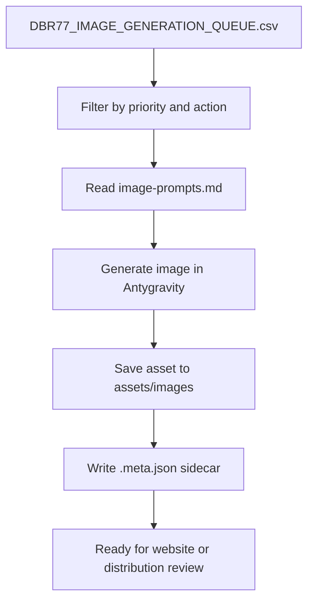

# DBR77 Antygravity Image Workflow

## Purpose

This file defines the operational contract for image generation after the prompt library has been audited and normalized.

Use it as the handoff document for:

- Antygravity operators
- future automation agents
- website publishing workflows
- social and newsletter reuse
- multi-channel production handoff

For exact task wording and operator instructions, pair this file with:

- `Blogs/_OPERATIONS/image_ops/DBR77_ANTYGRAVITY_OPERATOR_RUNBOOK.md`
- `Blogs/_OPERATIONS/image_ops/DBR77_IMAGE_QC_STANDARD.md`
- `Blogs/_OPERATIONS/image_ops/DBR77_IMAGE_PROVIDER_ROUTING.md`

## Core Rule

Antygravity should never guess where prompts live or where outputs belong.

It should always work from:

1. a canonical prompt file
2. a predictable output directory
3. a predictable filename
4. a sidecar metadata file
5. a queue row
6. a channel assignment

## Canonical Input Locations

Read prompts only from these source files:

- `Blogs/<Product>/Blog/<NN_topic_slug>/image-prompts.md`
- `Blogs/DBR77/Blog/<NN_topic_slug>/image-prompts.md`
- `Blogs/DBR77/Pages/<page_slug>/image-prompts.md`
- `Blogs/DBR77/Personas/<persona_slug>/image-prompts.md`

Do not read prompts from:

- `_LP_UPLOAD_READY/`
- archived upload bundles
- social copy files
- ad hoc notes

## Canonical Output Location

For every prompt source folder, generated images belong in:

- `assets/images/`

Example:

- source: `Blogs/Vector/Blog/01_why_public_ai_is_a_security_risk_for_industrial_operations/image-prompts.md`
- output dir: `Blogs/Vector/Blog/01_why_public_ai_is_a_security_risk_for_industrial_operations/assets/images/`

## Filename Standard

Use this pattern:

- `hero_16x9_v1.png`
- `analytical_16x9_v1.png`
- `social_1x1_v1.png`
- optional `social_4x5_v1.png`

If a later run improves the image:

- `hero_16x9_v2.png`
- `analytical_16x9_v2.png`
- `social_1x1_v2.png`

Do not encode the full slug inside the filename when the file already lives inside the article folder.

The folder already carries identity.

## Metadata Sidecar Standard

Write one metadata file per generated image beside the asset:

- `hero_16x9_v1.meta.json`
- `analytical_16x9_v1.meta.json`
- `social_1x1_v1.meta.json`

Required fields:

```json
{
  "article_path": "Blogs/Vector/Blog/01_why_public_ai_is_a_security_risk_for_industrial_operations",
  "product": "Vector",
  "scope_type": "blog",
  "asset_slug": "01_why_public_ai_is_a_security_risk_for_industrial_operations",
  "role": "hero",
  "aspect_ratio": "16:9",
  "usage": ["website", "social", "newsletter"],
  "model": "fill_from_antygravity",
  "prompt_source": "Blogs/Vector/Blog/01_why_public_ai_is_a_security_risk_for_industrial_operations/image-prompts.md",
  "prompt_text": "fill_with_final_prompt_used",
  "negative_prompt": "fill_with_final_negative_prompt_used",
  "seed": "fill_if_available",
  "run_id": "fill_if_available",
  "created_at": "ISO-8601 timestamp",
  "alt_text_en": "Editorial industrial split image contrasting public AI convenience with a secure governed factory AI environment.",
  "caption_en": "Convenience looks fast until the wrong data path creates strategic exposure.",
  "crop_safe_notes": "Keep main subject and boundary contrast inside center-safe area for 1:1 reuse."
}
```

Optional localized fields:

- `alt_text_pl`
- `alt_text_de`
- `caption_pl`
- `caption_de`

## Queue Files

Two files drive operations:

- `Blogs/_OPERATIONS/image_ops/DBR77_IMAGE_PROMPTS_INVENTORY.csv`
- `Blogs/_OPERATIONS/image_ops/DBR77_IMAGE_GENERATION_QUEUE.csv`

### Inventory CSV

Use for:

- audit filtering
- structural review
- rework prioritization

### Generation Queue CSV

Use for:

- batch execution
- status tracking
- output targeting
- separating active, inferred, and missing prompt roles
- preserving the operating contract while routing work through different channels

## Queue Row Meaning

Each row in `DBR77_IMAGE_GENERATION_QUEUE.csv` should represent one target output role.

Important fields:

- `product`
- `scope_type`
- `asset_slug`
- `role`
- `source_status`
- `generation_action`
- `recommended_priority`
- `output_dir`
- `output_filename`
- `meta_filename`
- `active_generation_target`

Meaning of `source_status`:

- `explicit`: role exists clearly in the prompt file
- `inferred`: role likely exists by numeric order and needs quick review
- `missing`: role does not exist and must be written first

Meaning of `generation_action`:

- `generate_now`
- `review_then_generate`
- `rewrite_prompt_first`
- `exclude_from_active_batch`

## Antygravity Batch Logic

Use this operational flow:



## Recommended Batch Filters

### First Production Batch

Filter:

- `recommended_priority = P1 or P2`
- `generation_action = generate_now`
- exclude `is_archive = true`

Reason:

- do not start with `IoT` rewrite-heavy rows

### Rewrite Queue

Filter:

- `generation_action = rewrite_prompt_first`

Reason:

- those rows are backlog for prompt normalization, not generation

### Review Queue

Filter:

- `generation_action = review_then_generate`

Reason:

- mainly inferred `IoT` roles or structurally ambiguous rows

## Active Generation Rules

Only active prompt rows should enter production generation.

Exclude:

- archive rows
- rows with missing roles
- rows from files not yet normalized to the strategy contract

## Website / Social / Newsletter Reuse

### Website

Use:

- `Hero` first
- `Analytical` in the body

Required metadata:

- `alt_text_en`
- `caption_en`
- `usage` contains `website`

### Social

Use:

- `Social`
- optional crop or variant based on the same role

Required metadata:

- crop-safe note
- usage contains `social`

### Newsletter

Use:

- `Social` when the issue carries one thesis
- `Hero` when the module needs more trust and less intensity

Required metadata:

- usage contains `newsletter`
- caption field tuned for a one-line takeaway

## Operator Prompts For Antygravity

### Single Article Prompt

Use this instruction:

```text
Read the prompt file at Blogs/<Product>/Blog/<slug>/image-prompts.md.
Generate the Hero, Analytical, and Social images using the defined role sections only.
Save outputs into Blogs/<Product>/Blog/<slug>/assets/images/ using the filenames hero_16x9_v1.png, analytical_16x9_v1.png, and social_1x1_v1.png.
Write one .meta.json sidecar for each output with prompt source, final prompt used, negative prompt used, model, timestamp, role, aspect ratio, usage, alt_text_en, caption_en, and crop_safe_notes.
Do not invent additional filenames, folders, or roles.
```

### Product Batch Prompt

Use this instruction:

```text
Open Blogs/_OPERATIONS/image_ops/DBR77_IMAGE_GENERATION_QUEUE.csv.
Process only rows where product = <Product>, generation_action = generate_now, and active_generation_target = true.
For each row, read the prompt from source_prompt_path, generate the target role only, save it to output_dir/output_filename, and write the sidecar metadata file meta_filename.
Skip rows marked rewrite_prompt_first or exclude_from_active_batch.
```

### Priority Batch Prompt

Use this instruction:

```text
Open Blogs/_OPERATIONS/image_ops/DBR77_IMAGE_GENERATION_QUEUE.csv.
Process rows with recommended_priority = <P1_or_P2>, generation_action = generate_now, and active_generation_target = true.
Generate only the listed role for each row, save into the specified output_dir, and write the specified meta_filename beside the image.
Do not process archive rows or rows with missing source prompts.
```

## Human Review Rule

Apply `Blogs/_OPERATIONS/image_ops/DBR77_IMAGE_QC_STANDARD.md` as the shared approval contract for any generated role.

Before assets are treated as approved:

1. check operational realism
2. check thesis fidelity
3. check crop safety for social reuse
4. check whether the asset feels mature enough for DBR77 public trust

If any of the four checks fail, increase the version number and rerun the role.
