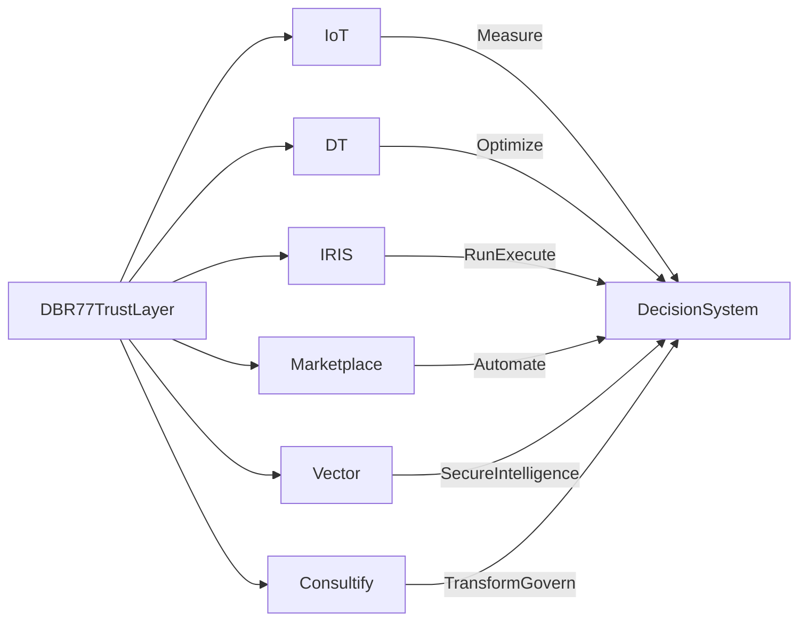

/Users/piotrwisniewski/Desktop/Marketing automation/Blogs/_SYSTEM/strategy/DBR77_PRODUCT_MARKETING_PLAN.md# DBR77 Product Marketing Plan

Status: canonical strategy document.  
Owner: DBR77 marketing and product communication team.  
Companion tracker: `Blogs/_SYSTEM/strategy/MASTER_COMPLETION_PLAN.md`

## One North Star

Make DBR77 look like the natural result of `10` years of industrial practice, not like a new company publishing smart content.

Everything in the public market presence should reinforce one buyer feeling:

- these people have history
- these people understand operational reality
- these people have seen these situations before
- these people know what works
- these people can support both decision and implementation

## Hybrid Communication System

DBR77 should be managed as a hybrid communication system:

- `DBR77` sells trust, system logic, and category leadership
- products sell a specific problem, decision logic, and outcome
- personas receive different narratives, proof, and CTA pathways
- every content asset should support a stage of contact, not only exist as an article

This logic should stay visible in planning even when the public-facing experience is organized as a knowledge system.

## Source Of Truth

Build and maintain the system using these core sources:

- live pages: `https://dbr77.com/`, `https://consultify.ai/`, `https://iot.dbr77.com/`, `https://iris.dbr77.com/`, `https://dt.dbr77.com/`, `https://marketplace.dbr77.com/marketplace`, `https://vector.dbr77.com/`
- topic backlog: `Blogs/_OPERATIONS/core/DBR77_TOPIC_DRAFT.md`
- content engine rules: `Blogs/_SYSTEM/standards/CONTENT_ENGINE.md`
- article package template: `Blogs/_SYSTEM/standards/ARTICLE_PACKAGE_TEMPLATE.md`
- persona definitions: `Persona spec/`

## Multi-Entry Gate System

DBR77 should not rely on a single top-level entry point.

Market experience shows that a one-gate model built around `DBR77.com`, followed by product discovery, is too cognitively complex for many industrial B2B buyers.

Different personas enter with different problems:

- they do not think in terms of a platform first
- they do not immediately understand the full DBR77 system
- they expect direct relevance to their situation
- they want a clear first step, not a system explanation

This means DBR77 should operate as a multi-entry system.

Each product landing page acts as an independent entry gate tailored to a specific problem and persona.

The product entry gates are:

- `Consultify`
- `IoT`
- `IRIS`
- `DT`
- `Marketplace`
- `Vector`

Each gate is not only a product page.

Each gate is the first DBR77 experience designed around a specific buyer problem.

The buyer should enter through the problem first.

The broader DBR77 system should be revealed progressively, not upfront.

## Role Of DBR77.com

`DBR77.com` should not be treated as the default primary entry point for most buyers.

Its main role is:

- trust layer
- system explanation layer
- category and brand authority layer
- ecosystem understanding layer for buyers who are ready to zoom out

This means:

- product landing pages drive entry
- `DBR77.com` strengthens trust and system understanding
- the corporate layer supports the gates instead of replacing them

## Persona-To-Gate Mapping

Default entry gates should be mapped by buyer type:

- `Owner / CEO / President / Chairman`: `Consultify` or `DT`
- `Plant Manager / Operations`: `IoT` or `DT`
- `CFO`: `DT` or `Marketplace`
- `CTO`: `IRIS` or `Vector`
- `Purchasing / Supplier / Integrator`: `Marketplace`

This mapping should influence:

- campaign routing
- LinkedIn distribution
- outbound flows
- content planning
- CTA paths
- LP structure

## Entry-First Content Rule

Every article should have:

- one primary entry product
- optional secondary cross-product bridges

This means DBR77 should not write for "the system" first.

It should write for the right entry gate first.

The wider system should then be introduced through:

- cross-links
- proof bridges
- adjacent use cases
- ecosystem logic
- next-step CTA design

## System Consistency Rule

A multi-entry model increases clarity and conversion quality, but it also creates a consistency risk.

If every gate starts speaking differently, the DBR77 system will fragment.

Therefore every gate must:

- use the same underlying operating logic
- reinforce the same core truths
- stay consistent with DBR77 system thinking
- connect back to the broader ecosystem where relevant

Different gates may change:

- entry narrative
- problem framing
- examples
- CTA path

They must not change:

- strategic logic
- proof standard
- trust model
- operating philosophy
- system coherence

## Market Reality

DBR77 sells into industrial B2B markets where buyers do not trust newcomers easily.

They trust:

- practitioners
- operators
- companies with visible history
- teams that sound close to implementation
- firms that show repeatable proof, not enthusiasm

They do not trust:

- thin product pages
- small content footprints
- vague AI positioning
- generic startup-style blogs
- marketing language without operational substance

This means DBR77 must look like an established industrial company with accumulated knowledge, not like a recent content sprint.

## Non-Negotiables

The following rules are fixed:

1. DBR77 has `6` strategic product lines:
   - `Consultify`
   - `IoT`
   - `IRIS`
   - `DT`
   - `Marketplace`
   - `Vector`
2. Each product needs a target library of `50` articles.
3. Those `50` articles are not only for SEO.
4. The article footprint is part of perceived maturity and buyer trust.
5. The public system must look like a mature Industrial Knowledge Base, not a simple blog feed.
6. Personas, funnel stages, CTAs, and face ownership remain critical internally, but must not dominate the public-facing structure.

## What DBR77 Is Building

DBR77 is not building:

- a blog
- an article calendar
- a generic AI content machine

DBR77 is building:

- a product knowledge system
- a public proof system
- a market-facing archive of industrial practice
- a trust layer for every product landing page

Externally, the system should look like a mature industrial knowledge base.

Internally, it should still be run through:

- product
- persona
- funnel stage
- region
- face / author
- CTA
- content layer
- status

## Brand Positioning

DBR77 is not a random software portfolio.

It is one operating logic for industry:

1. measure reality
2. optimize options
3. run with control
4. automate safely
5. think with secure industrial intelligence
6. transform with governance and ROI discipline

The full system should consistently make DBR77 feel:

- experienced
- operationally credible
- financially aware
- implementation-ready
- structured enough for serious industrial buyers

## Brand Architecture

## Faces Of The Brand

### Outward-Facing

- `Piotr Wisniewski`: umbrella DBR77, transformation, board-level trust, strategic clarity
- `Torian Richardson`: USA-facing leadership, executive education, first-contact, and nurture
- `Pawel Mroczkowski`: Marketplace, supplier and integrator ecosystem, Germany and DACH, sourcing clarity

### Deeper Authority

- `Pawel Dera`: IoT, machine data, downtime, shop-floor visibility, operations
- `Bartlomiej Straszak`: Digital Twin, Poland and CEE, simulation, CAPEX confidence, layout and flow decisions
- `Konrad Milewski`: IRIS and Vector, system logic, operational architecture, secure industrial AI

### Company Page

- `DBR77 company page`: synthesis, proof, case studies, events, and best-of distribution

## Persona Mapping

- `Owner / President / Chairman`: Piotr, Torian
- `Plant Manager / Operations`: Pawel Dera, Bartlomiej
- `CFO`: Piotr, Torian, Bartlomiej
- `CTO`: Konrad
- `Purchasing / Supplier / Integrator`: Pawel Mroczkowski

## Product Messaging Priorities

- `Consultify`: transformation structure, ROI, governance, consulting replacement
- `IoT`: visibility, downtime, retrofit, real-time control
- `IRIS`: from insight to execution, unified plant operating system
- `DT`: test before invest, simulation-backed decisions, CAPEX confidence
- `Marketplace`: sourcing clarity, vendor comparison, faster path to automation
- `Vector`: secure industrial AI, data sovereignty, deployment trust, human approval

## Trust Architecture

Trust should not come mainly from adjectives.

Trust should come from six visible signals:

1. case-shaped thinking
2. operational specificity
3. repeatable insight patterns
4. process clarity
5. outcome logic
6. visible depth

### 1. Case-Shaped Thinking

Articles should sound like they come from repeated real situations.

Use framing such as:

- what usually happens in plants
- where companies misread the problem
- what fails first
- what better decisions look like
- what changes when the approach improves

### 2. Operational Specificity

The language must stay close to real industrial work.

Use real operating vocabulary such as:

- downtime
- OEE
- layout
- flow
- sourcing
- bottlenecks
- execution drift
- ROI visibility
- scenario testing
- governance

### 3. Repeatable Insight Patterns

The same core truths should appear across multiple assets.

Examples:

- downtime is often not only a machine issue
- layout and flow often matter more than isolated equipment choices
- visibility without execution still creates waste
- automation projects often fail before implementation because sourcing and comparison are weak
- strategy without execution is theater
- industrial AI must be secure, governed, and grounded in real operating logic

This repetition is not duplication.

It is how DBR77 builds a recognizable school of thought.

### 4. Process Clarity

The audience must feel that DBR77 knows how industrial work actually moves.

Explain clearly:

- how a problem is diagnosed
- how options are compared
- how teams should decide
- how implementation should begin
- how value should be reviewed

### 5. Outcome Logic

Content should connect decisions to outcomes whenever possible.

Use:

- result signals
- number anchors
- financial logic
- time-to-value logic
- risk reduction logic

### 6. Visible Depth

Buyers should never feel they found only three isolated articles.

They should feel they are entering a deep, structured body of work that suggests:

- history
- maturity
- repetition
- accumulated practical understanding

## Product Knowledge Architecture

Each product must ultimately have `50` articles.

Those `50` articles must be organized into `5` layers with `10` articles each.

### Layer 1: Field Reality

Purpose:

- prove closeness to daily industrial reality
- show that DBR77 understands how plants and teams actually operate

Typical topics:

- real downtime causes
- hidden bottlenecks
- why OEE can mislead
- why automation stalls
- why reporting misses shift-level reality

Buyer effect:

- "they have been close to the real environment"

### Layer 2: Problem Deep Dives

Purpose:

- show exact understanding of specific industrial and transformation problems

Typical topics:

- changeover time
- internal logistics chaos
- machine utilization
- labor inefficiency
- fragmented decision-making
- unclear ROI ownership

Buyer effect:

- "they understand my exact problem, not just the category"

### Layer 3: Solution Logic

Purpose:

- explain how serious teams solve the problem
- compare approaches without turning the article into feature dumping

Typical topics:

- what works and what fails
- what sequence is right
- what data is needed first
- where pilots should begin
- how different operating models compare

Buyer effect:

- "they know how this should actually be solved"

### Layer 4: Decision Support

Purpose:

- help CFO, CEO, owner, chairman, CTO, and buying teams make safer decisions

Typical topics:

- ROI
- CAPEX versus OPEX logic
- risk
- implementation exposure
- architecture
- security
- vendor comparison

Buyer effect:

- "I can buy this without walking into blind risk"

### Layer 5: Execution And Transformation

Purpose:

- prove that DBR77 understands what happens after the decision
- show that implementation is governable

Typical topics:

- first `30` days
- first `90` days
- rollout sequencing
- governance model
- owner accountability
- value review
- adoption mistakes

Buyer effect:

- "this can actually be implemented"

## Product Landing Page Rules

Each product landing page must work as the front door to its knowledge system.

Do not structure LPs as:

- thin sales page plus a blog link
- generic article list by date
- isolated CTA page with weak proof

Structure each LP as:

1. product value proposition
2. proof-rich explanation of the real problem
3. decision or use-case sections
4. grouped knowledge sections
5. proof assets and implementation content
6. CTA paths matched to buyer maturity

Recommended public section labels include:

- Downtime And OEE
- Layout And Flow
- CAPEX And Investment
- Governance And ROI
- Automation And Sourcing
- AI And Decision Making
- Execution And Rollout

## Article Standard

Every article should behave like proof-bearing expert content.

Default structure:

1. a real and specific problem
2. what actually happens in plants or leadership teams
3. a reality check or common-mistake block
4. what works in practice
5. how DBR77 approaches it
6. the outcome logic or consequence of the better approach

Not every article needs to be a formal case study.

But every article must feel informed by repeated real-world observation.

## Required Proof Signals

Where appropriate, articles should include:

- number anchors
- repeated field patterns
- trade-off logic
- implementation warnings
- role-specific consequences
- cross-industry observations
- language that signals accumulated experience

Useful patterns:

- over the past `10` years
- across different industrial contexts
- in multiple plants and transformation programs
- one recurring pattern is
- what usually causes failure is
- teams often assume X, but the real issue is Y

Important accuracy rule:

- DBR77 should use its real `10`-year market history
- DBR77 should not falsely imply that every current product existed in the same form for `10` years
- DBR77 should communicate that the thinking, practical exposure, and industrial patterns behind the products were built over many years of market work

## Tone Standard

The tone should consistently feel:

- experienced
- calm
- practical
- specific
- sober
- high-trust

Avoid writing that sounds:

- startup-like
- hype-heavy
- trend-chasing
- generic
- mass-produced

The reader should feel:

- these people have done this before
- these people know where projects really fail
- these people understand both operations and decisions

## What To Avoid

Do not rely on:

- generic "what is X" articles as the dominant content type
- trend-list content
- thin educational summaries
- article lists with no knowledge architecture
- repetitive phrasing that makes all content look factory-made
- inflated claims without proof

The risk is not only weak performance.

The risk is negative perception:

- "this looks like a recent content sprint"
- "this feels like a startup trying to imitate maturity"
- "this sounds like marketing, not practice"

## Internal Planning Model

Internally, every asset should still be tracked by:

- product
- persona
- funnel stage
- region
- face / author
- CTA
- content layer
- proof type
- status

This remains critical for:

- topic selection
- distribution
- email sequencing
- repurposing
- ownership
- measurement

The internal planning system stays layered.

The public user experience must stay simple and mature.

## Funnel Communication System

### 1. First Contact

Goal:

- credibility
- relevance
- curiosity

Core assets:

- executive insight email or LinkedIn message
- one problem article
- one proof asset
- one role-matched landing page or knowledge entry point

CTA style:

- read
- benchmark
- explore
- see how others approach this

### 2. Demo / Trial Entry

Goal:

- reduce uncertainty
- show concrete upside

Core assets:

- role-based "what you get" content
- demo or trial explainers
- first-value and first-30-days content
- ROI or business-case lite

CTA style:

- start demo
- start trial
- book workshop
- see first-value path

### 3. Buying Decision

Goal:

- de-risk the purchase

Core assets:

- ROI logic
- architecture, security, or procurement content
- implementation path
- case proof and scenario logic

CTA style:

- validate fit
- review business case
- schedule decision meeting

### 4. Product Use / Adoption

Goal:

- increase time-to-value
- support expansion

Core assets:

- onboarding education
- use-case guides
- module expansion content
- benchmark and maturity content

CTA style:

- activate next use case
- expand module
- measure impact

### 5. Nurture For Observers

Goal:

- keep mental availability high

Core assets:

- POV posts
- newsletter insights
- webinars and podcast clips
- market memos and "when not to buy" trust builders

CTA style:

- stay close
- join webinar
- read insight
- follow the topic

### 6. External Visibility

Goal:

- category leadership
- social proof

Core assets:

- events
- podcasts
- reports
- media commentary
- founder and expert posts

CTA style:

- watch
- attend
- subscribe
- connect

## Content Production Rules

Every major asset must have:

- persona
- funnel stage
- product bridge
- proof type
- CTA

Every major asset should be able to generate:

- article
- personal post
- company post
- email angle
- sales snippet
- `2-3` image prompts

Additional rules:

- `DBR77` content = system, trust, and cross-product logic
- product content = problem, solution logic, and outcome
- company page should not duplicate people `1:1`; it should amplify and synthesize

## Packaging Rule

The article package standard remains:

- `article_EN.md`
- `article_PL.md`
- `article_DE.md`
- `seo.md`
- `cta.md`
- `image-prompts.md`
- `publish.md`
- `social.md`
- `sources.md`

English remains the master version.

## Distribution Rule

One strong core asset should create multiple derivatives.

A single strong article can generate:

- product-page placement
- internal-link support
- personal LinkedIn post
- company-page amplification
- email angle
- sales snippet
- webinar talking point

The core asset stays durable.

The derivatives adapt the same logic to the right face, region, persona, and CTA.

## Initial System Build Sequence

Use this order whenever DBR77 needs to rebuild, extend, or brief a new team on the system:

1. freeze messaging architecture for DBR77, `6` products, and key personas
2. build the publication matrix: author x persona x product x region x format x CTA
3. define the funnel asset map for the `6` communication situations
4. choose the first wave of flagship assets: Consultify, IoT, IRIS, DT, Marketplace, Vector
5. turn each flagship asset into a repurposing set for people and the company page
6. only then scale serial library production toward `50` articles per product

## Initial Deliverables

The core foundational deliverables are:

- messaging architecture document
- publication matrix
- funnel asset map
- `90`-day publication framework
- flagship article set

## Supporting Documents

This file is the only strategy master document.

The following files support execution under this strategy:

- `Blogs/_SYSTEM/strategy/MASTER_COMPLETION_PLAN.md`
- `Blogs/_OPERATIONS/core/DBR77_MESSAGING_ARCHITECTURE.md`
- `Blogs/_OPERATIONS/core/DBR77_PUBLICATION_MATRIX.md`
- `Blogs/_OPERATIONS/core/DBR77_FUNNEL_ASSET_MAP.md`
- `Blogs/_OPERATIONS/core/DBR77_90_DAY_PUBLICATION_FRAMEWORK.md`
- `Blogs/_SYSTEM/standards/DBR77_PUBLICATION_OPERATING_CHECKLIST.md`
- `Blogs/_SYSTEM/lp_kb/DBR77_LP_KNOWLEDGE_ARCHITECTURE_MODEL.md`
- product roadmap files in each product blog folder

If any supporting document conflicts with this file, this file wins.

## Team Decision Rule

When in doubt, choose the option that increases:

- perceived maturity
- proof density
- operational realism
- decision usefulness
- implementation credibility

Do not choose the option that only increases volume.

Volume matters.

But in DBR77's market, volume only helps when it looks like the natural output of real experience.

## Operational Success Criteria

The system should be treated as structurally correct when:

- each persona sees the right expert and the right problem logic
- each LP gets its own content path while staying aligned with the DBR77 system story
- content supports first contact, demo or trial, decision, adoption, and long nurture
- the corporate brand and expert faces strengthen each other instead of competing

## Success Test

The strategy is working when a serious industrial buyer lands on the website and feels:

- this company has history
- this company has depth
- this company has a system
- this company has seen these situations before
- this company can support both decision and implementation

The strategy is failing when the website feels like:

- a startup content push
- a generic AI marketing project
- a shallow software blog
- a library with no internal logic
