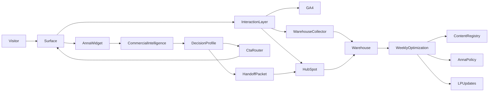

# DBR77 Product Marketing System (2026)

Status: draft system design (canonical companion to `_SYSTEM/strategy/DBR77_PRODUCT_MARKETING_PLAN.md`)  
Owner: DBR77 marketing + product communication + commercial intelligence  
Scope: all public websites (DBR77 + 6 product gates) + Anna (voice/widget) + telemetry + warehouse + governance

## Purpose

Turn DBR77 from “a set of landing pages and content” into **one market-facing operating system** that:

- makes DBR77 look like the natural output of 10 years of industrial practice
- routes every visitor through the right entry gate, proof, and next step (CTA ladder)
- captures behavioral + conversational signals across all sites
- connects those signals to commercial workflows (HubSpot) without losing control or consistency
- centralizes how Anna behaves, what she knows, and how she hands off to sales / demo / trial
- builds a long-term learning loop (warehouse + analysis + optimization + content governance)

This document defines the **system architecture**, not only messaging.

## Non‑negotiables (from Product Marketing Plan)

These rules are inherited and must remain true in the system implementation:

- DBR77 operates as a **multi-entry gate system** (product LPs are primary entry gates).
- DBR77.com is a **trust / authority layer**, not the default entry for most buyers.
- Each product builds a **50-article library** organized as a knowledge system (not date feed).
- Every LP must support: problem reality, decision paths, grouped knowledge, proof blocks, CTA ladder.
- The system must feel **mature, calm, operationally credible**. Never “startup content sprint”.

Source strategy: `Blogs/_SYSTEM/strategy/DBR77_PRODUCT_MARKETING_PLAN.md` is still the strategy master.

---

## System North Star

**One sentence**: DBR77 websites + content + Anna behave like a single industrial decision-support machine that continuously learns from market signals and pushes the right next step without fragmenting the brand.

### Success definition (operational)

The system works when we can answer, for any inbound buyer session:

- who they likely are (persona cluster)
- what stage they are in (funnel stage)
- what they care about (intent + objections)
- what they consumed (content + sections + Anna interactions)
- what we recommended (next step + assets)
- whether they acted (CTA outcomes)
- how that progressed in CRM (HubSpot lifecycle + deal motion)

And we can improve decisions weekly based on warehouse data.

---

## Current Reality (inputs we must integrate)

### Websites

- We operate **7 public surfaces**:
  - DBR77 corporate surface (`DBR77.com` as trust / authority layer)
  - 6 product entry gates (`Consultify`, `IoT`, `IRIS`, `DT`, `Marketplace`, `Vector`)
- The implementation stack of those surfaces may differ (WordPress vs custom/static/app). PMS must treat them all as **surfaces** with one shared interaction contract.
- Google Analytics and HubSpot are already connected, but implementation depth and consistency vary by surface.
- Hosting for PMS services is still uncertain; assume **Railway** for PMS backend services until proven otherwise.

### Surface implementation variants (do not fork the system logic)

PMS must support both variants without changing system semantics:

- **Variant A: WordPress surfaces**
  - one shared plugin (or shared snippet + GTM) installs the Interaction Layer and HubSpot/GA hooks
- **Variant B: non‑WordPress surfaces**
  - one shared `ci-sdk.js` snippet (Interaction Layer) embedded on each domain/app

In both cases, the rule is the same:

- surfaces emit events to PMS/CI first
- PMS/CI fans out to GA4 and HubSpot

### Analytics / CRM

- Google Analytics is present (current implementation varies by site; needs standardization)
- HubSpot is present (meeting links + tracking + forms + CRM)

### Anna (assistant)

We already have an implementation pattern in a Next.js site:

- voice widget UI
- voice (Gemini Live audio) + text fallback (LLM) + TTS
- explicit “Anna conversion session” concept (intent/persona/readiness/next step) in code (`ai-conversion.ts`)

This document upgrades that pattern into a **central system** across all sites.

---

## Target Architecture (high level)

### Core principle

We separate concerns:

- **Public websites** are “surfaces”: fast, beautiful, localized, conversion-aware.
- **Product Marketing System (PMS)** is the “brain”: content registry, knowledge/LLM control, telemetry pipeline, experiment routing, and CI handoffs.

### Components (logical)

1. **Interaction Layer (shared client runtime)**
   - the same thin integration on every surface
   - generates/reads: `visitor_id`, `session_id`, `interaction_id`
   - captures consent state and identifiers (`ga_client_id`, `hubspotutk`) where available
   - listens to HubSpot global form events where embedded
   - emits canonical events to PMS/CI (never “GA-only” or “HubSpot-only”)
2. **Content Registry**
   - canonical list of content assets (articles, proof packs, demos, videos, PDFs)
   - metadata: product gate, knowledge layer, persona relevance, funnel stage, proof type, locale variants, canonical slug
3. **Telemetry & Identity Layer**
   - consistent event schema across all sites
   - consistent visitor/session identifiers
   - consent-aware tracking controls
4. **Event Collector + Event Store (canonical memory)**
   - ingestion endpoint(s) for all surfaces
   - durable, replayable event store (buffer/queue + append-only log)
   - fan-out jobs to downstream tools (GA4, HubSpot) with retries
5. **Warehouse**
   - append-only event store + modeled tables for analysis
   - joins: session → identity → content → CTA → CRM lifecycle
6. **Commercial Intelligence (CI) Orchestrator**
   - turns raw signals into “session insight” (persona/intent/readiness/objections/next step)
   - produces “handoff packets” for HubSpot and sales
7. **Knowledge Grounding (approved sources layer)**
   - product truth sets (“facts-only kernel”)
   - approved content excerpts (direct answers, evidence blocks, FAQs, sources)
   - retrieval rules, versioning, and auditability
8. **Lead Memory (cross-surface state)**
   - stores the latest Decision Profile + key session summaries
   - supports cross-gate routing and “returning visitor” continuity
9. **Anna Platform**
   - central knowledge base + behavior rules + prompts + routing intents
   - multi-site widget delivery (embed)
   - safe data boundaries (no hallucinations, no leaking sensitive info)
10. **Control Panel (internal)**
   - manage content metadata + featured clusters on LPs
   - manage Anna policy + knowledge sources + versioning
   - manage experiments and “approved variants”
   - monitor quality (trust signals, conversion, safety)

### Deployment assumption (for now)

We design PMS as deployable on Railway (services + database + queue), but the architecture should remain portable (any cloud).

---

## Technical Architecture Layers (v1)

This section makes the system implementable. It defines the technical layers that must exist in Stage 1/2/3, even if some are “thin” at first.

### Layer 0: Surface (LP / corporate / blog)

What it is:

- any DBR77 public site or gate (WordPress or non‑WordPress)
- responsible for UI/UX and content presentation

What it must do:

- embed Interaction Layer
- embed Anna widget surface (UI) where applicable
- include stable canonical URLs and routing structure

### Layer 1: Interaction Layer (shared client SDK)

Goal:

- one “first mile” integration that standardizes signals everywhere

Core responsibilities:

- generate/read: `visitor_id`, `session_id`, `interaction_id`
- read (if available, consented): `ga_client_id`, `hubspotutk`
- collect: page context (site_id/gate/page_type/locale), UTM/referrer, section/asset context
- listen to embedded HubSpot form global events when present
- emit canonical Event Envelope v1 to PMS/CI collector
- (optional) call “decision endpoint” to fetch next best action/CTA ordering

Integration variants:

- **WordPress**: plugin or shared snippet (optionally via GTM)
- **non‑WordPress**: shared `ci-sdk.js` embedded on each domain/app

### Layer 2: Anna UI (widget shell) vs Anna Runtime (orchestration)

We split Anna to prevent “chatbot drift”:

- **Anna UI (on surface)**: mic/button, transcript UI, basic state
- **Anna Runtime (central)**: mode selection, grounding, classification, handoff packaging

Minimum Anna Runtime endpoints (conceptual):

- `POST /v1/anna/turn` → returns `{ answer, mode, citations[], decision_profile_delta, handoff_suggestion }`
- `GET /v1/anna/config?gate=...&locale=...` → returns truth set version, allowed assets, prompt policy version

### Layer 3: PMS/CI Collector + Event Store (canonical memory)

Collector endpoints (minimum):

- `POST /v1/events` (ingest Event Envelope v1)
- `POST /v1/identify` (optional, when form email is provided; links ids in identity graph)
- `GET /v1/redirect/*` (meeting/CTA redirector that logs context before leaving the surface)

Event Store properties:

- append-only, replayable
- dedupe by `event_id`
- retry-safe fan-out workers to downstream systems

### Layer 4: Routing + Scoring (Commercial Intelligence core)

Two outputs must be deterministic and measurable:

1) **Decision Profile** (persona / stage / intent / readiness / next step)
2) **Next Best Action** (CTA ladder action + recommended asset cluster)

Minimum decision endpoint (conceptual):

- `POST /v1/decide` with `{ interaction_id, gate, recent_events, locale }` → returns recommended CTA/asset + explanation metadata

### Layer 5: Reporting & execution sinks (subordinate systems)

- **GA4**: receives analytics-safe subset (no PII, no raw transcripts)
  - client tagging can remain
  - CI can add server-side events via Measurement Protocol where needed
- **HubSpot**: receives CRM-relevant subset (commercial signals + handoff context)
  - behavioral events: CI → HubSpot (custom events)
  - forms: surface listens to form events and includes CI context
  - outcomes: HubSpot → CI via webhooks

### Layer 6: Selix (Stage 3 central control plane)

Selix is the long-term “owner” of:

- Event Store + Warehouse modeling
- identity stitching and scoring/routing
- content registry + featured clusters
- Anna grounding and policy versions
- internal panel for operations, experiments, and governance

In early stages, Selix can be represented by thinner services (collector + small DB), but the contracts should remain stable.

---

## How surfaces connect to PMS/CI (integration contract)

### Required per-surface config (immutable identifiers)

Each surface must declare:

- `site_id` (domain-level identity)
- `gate` (Consultify/IoT/IRIS/DT/Marketplace/Vector/DBR77)
- `default_locale` + allowed locales
- `page_type` mapping rules (lp/article/role/security/deployment/etc.)

### Required runtime injection (minimal)

Every surface must load:

- Interaction Layer (`ci-sdk.js` or WP plugin runtime)
- Anna UI widget (if enabled)
- (optional but recommended) HubSpot tracking + GA4 tags (consent-aware)

### Redirector rule (cross-domain + meeting links)

All high-intent exits must route through PMS redirect endpoints so the system never loses attribution:

- meetings
- “start trial/demo/pilot” if it leaves the current domain
- key resource downloads if hosted elsewhere

This gives a stable place to:

- log `cta_clicked` with full Decision Profile + last assets
- attach handoff packet id
- perform cross-domain identity linking where allowed

---

## Cross-surface communication (when it makes business sense)

We should communicate between surfaces only when it reduces buyer cognitive load or increases conversion quality:

### Cross-gate routing (business rule)

If CI detects that a visitor entered via the wrong gate, we route them progressively:

- keep them in the current gate until the primary problem is clear
- then offer a “bridge” CTA (later on the page, not in hero)
- preserve trust: explain why the bridge is relevant (not “random redirect”)

### Shared session continuity (technical rule)

When a visitor moves across domains:

- preserve `interaction_id` via redirector links
- preserve Decision Profile state in Lead Memory (consent-aware)
- avoid stitching without consent; prefer deterministic link keys (hubspotutk / form email)

---

## System Flow (end-to-end)

This system should be understood as one loop, not as isolated tools.

### 1. Public entry

A buyer enters through:

- one of the 6 product gates
- DBR77.com as trust / authority layer
- an article, campaign, direct link, referral, or sales follow-up

The public page must immediately do 3 things:

- establish the right problem context
- show proof density and maturity
- offer a safe next step matched to readiness

### 2. Signal capture

As the visitor moves through the page, the system captures:

- page and section behavior
- content and proof consumption
- CTA exposure and clicks
- form behavior
- Anna/widget interactions
- source / campaign / locale / device context

This happens on WordPress sites, but the capture logic must be standardized by PMS, not left to each site individually.

### 3. Identity and session interpretation

PMS then turns raw browsing activity into a usable session model:

- anonymous session identity
- known identifiers when available (`hubspotutk`, form email, meeting context)
- Decision Profile
- inferred persona cluster
- inferred funnel stage
- inferred intent / objection / readiness

This is the moment where “traffic” becomes “commercially readable behavior”.

### 4. Routing and recommendations

Based on Decision Profile, PMS chooses the next best step:

- show a low-, mid-, or high-commitment CTA
- surface a better proof block or content cluster
- route to the correct meeting / pilot / demo path
- let Anna recommend a narrower next action

The goal is not maximum clicks.
The goal is lower decision friction and higher-quality progression.

### 5. Commercial handoff

When the visitor crosses a threshold of intent, PMS prepares a structured handoff to HubSpot:

- contact or company context
- session summary
- primary intent
- objection pattern
- recommended next action
- source gate and key consumed assets

HubSpot remains the workflow / CRM execution layer, but PMS decides what commercial context should be handed off.

### 6. CRM feedback loop

HubSpot then sends outcome signals back into PMS / warehouse:

- contact created or matched
- company created or matched
- deal created
- lifecycle stage changed
- meeting booked
- commercial owner assigned

This closes the loop between public behavior and actual sales progress.

### 7. Learning and optimization

The warehouse and CI layers then answer:

- which gates produce the right personas
- which proof clusters produce deeper progression
- which Anna behaviors improve handoff quality
- which CTA ladders produce meetings, not only clicks
- which objections are increasing by product / region / persona

This is why PMS is the brain: it continuously improves routing, curation, and commercial readiness.

---

## Data Model (system language)

We standardize the system vocabulary so content, Anna, analytics, and sales talk the same language.

### Entry gates

`Consultify`, `IoT`, `IRIS`, `DT`, `Marketplace`, `Vector`, plus DBR77 umbrella pages.

### Persona clusters (minimum set)

- Owner/CEO/Chairman
- Plant Manager / Operations
- CFO
- CTO / IT / Security
- Purchasing / Supplier / Integrator
- Unknown

### Funnel stages (public-facing behavior)

- first_contact
- demo_trial
- buying_decision
- adoption (optional; may be split later)
- nurture

### Intents & objections

Intent examples:

- security, roi, deployment, integration, vendor_comparison, pilot, workshop, demo, trial, overview

Objections examples:

- “data sovereignty”
- “auditability”
- “pilot sprawl”
- “ROI ownership”
- “architecture complexity”

Default objection clusters (v1):

- **value-understanding gap**: user cannot map the offer to their problem; unclear outcome logic
- **owner gap**: user has no internal owner / decision owner for moving forward

### Decision Profile (per session)

Decision Profile is the minimal on-site classifier:

- persona
- funnel stage
- primary intent
- readiness (low/medium/high)
- recommended next step

This is the object that:

- drives CTA ladder routing on page
- drives Anna’s next-step behavior
- drives HubSpot handoff
- becomes the join-key for analytics → commercial outcomes

---

## Telemetry (events we must capture everywhere)

### Why telemetry is central

We cannot build “the best marketing/sales system” without **consistent, comparable, cross-site measurement**.
The warehouse is not optional: it becomes our memory.

### Event schema (minimum viable)

All sites must emit the same shape of events, including:

- **identity**: `visitor_id`, `session_id`, and (optionally) `interaction_id`
- **hubspot identity (optional)**: `hubspotutk` when consented and available
- **context**: `site_id`, `page_path`, `locale`, `referrer`, UTM fields, `occurred_at`
- **content context**: gate, section_id, asset_id/slug when relevant
- **action**: event_name + payload

Minimum events:

- page_view (with route + gate + locale)
- section_view / scroll depth milestones (to infer interest)
- asset_opened (article/resource/video)
- cta_shown / cta_clicked (with ladder level low/mid/high)
- form_started / form_submitted
- meeting_link_clicked
- anna_widget_opened
- anna_message_sent / answered
- anna_session_classified (Decision Profile output)
- anna_handoff_applied (prefill applied to form/meeting)

### GA4 + HubSpot + Warehouse (how they coexist)

- GA4 remains the **marketing reporting surface** (acquisition, campaign performance).
- HubSpot remains the **CRM + automation surface** (contacts, pipelines, sequences).
- Warehouse becomes the **system intelligence surface**:
  - cross-site joins
  - cohort analysis by persona/intent/readiness
  - true funnel modeling (content → CTA → CRM outcomes)
  - experimentation analysis (variant performance)

PMS must be able to send the same event to:

- GA4 (client or server)
- HubSpot (behavioral event / timeline where allowed)
- Warehouse (always, canonical)

---

## AI Conversion Layer

### Strategic role

AI in DBR77 should not be treated as “a chatbot feature”.

It should be treated as a **commercial intelligence layer** that sits behind all public surfaces and improves:

- routing into the right gate
- interpretation of visitor intent
- CTA ladder selection
- form / meeting handoff quality
- feedback from sales outcomes back into content and LP optimization

### Functional split

To keep the system stable, AI responsibilities should be split into 4 layers:

1. **Surface layer**
   - all public surfaces (WordPress or non‑WordPress)
   - visible narrative, proof, CTA presentation
2. **Anna layer**
   - voice/text widget
   - user-facing explanation and guided interaction
   - collection of conversational signals
3. **Commercial Intelligence layer**
   - converts page + CTA + Anna signals into a structured Decision Profile
   - recommends next best action
   - generates handoff packets for HubSpot and sales
4. **Execution layer**
   - HubSpot for CRM, forms, meetings, workflows
   - GA4 for acquisition and surface reporting
   - warehouse for canonical system memory

### Relationship between PMS and Commercial Intelligence

The cleanest model is:

- **PMS** = the broader system brain
  - content registry
  - knowledge architecture
  - telemetry normalization
  - Anna governance
  - experimentation
- **Commercial Intelligence** = the commercial reasoning engine inside PMS
  - session interpretation
  - qualification
  - handoff packaging
  - feedback joins to sales outcomes

In practice, CI should be treated as the **commercial module of PMS**, not as an unrelated side project.

### Anna’s role in this architecture

Anna should become a centrally controlled widget with 3 practical modes:

1. **Explain**
   - page-aware, bounded, factual answers
   - optimized for trust, not for long conversation
2. **Diagnose**
   - short qualification path
   - extracts persona, stage, intent, and readiness
3. **Hand off**
   - recommends one next best action
   - prepares a handoff packet for form / meeting / sales follow-up

Important rule:

- Anna is **not** the source of truth
- Anna is **not** the owner of conversion logic
- Anna is **not** the canonical memory

She consumes truth and policy from PMS and returns signals back into PMS.

### Trust and quality guardrails

Because Anna is currently not reliable enough to operate loosely, the system must enforce:

- product truth sets as primary grounding
- curated content and proof assets as approved recommendation pool
- explicit “do not claim” policies
- clear out-of-scope handling
- confidence-aware fallback to lower-risk CTA or human handoff

Anna should be optimized for **trust preservation first, conversational richness second**.

### Recommended rollout logic

#### Phase 0: measurement and schemas first

Before scaling AI behavior, define:

- one event taxonomy
- one Decision Profile schema
- one handoff packet schema
- one identity strategy across domains

#### Phase 1: shadow intelligence

Commercial Intelligence should first classify sessions without aggressively changing public behavior:

- infer persona / intent / readiness
- score likely next step
- compare with actual HubSpot outcomes

#### Phase 2: controlled CTA routing

After calibration:

- allow CI to influence CTA ordering
- allow Anna to recommend one next action
- attach handoff packet to forms and meeting flows

#### Phase 3: cross-gate orchestration

When signal quality is proven:

- route visitors between gates when fit is stronger elsewhere
- detect when a `Vector` visitor is actually a `Consultify`, `DT`, `IRIS`, or `Marketplace` conversation
- support system-level movement instead of page-local optimization only

#### Phase 4: commercial copilot loop

Later, the same intelligence layer can support:

- pre-call sales briefs
- objection summaries by gate / persona / region
- recommended follow-up assets
- commercial pattern mining across the full system

---

## Event Dictionary v1

This is the first recommended shared event language across public surfaces, Anna, PMS/CI, HubSpot, GA4, and the warehouse.

### Canonical event envelope (v1 JSON contract)

Every emitter (WordPress plugin, `ci-sdk.js`, Anna widget) must send events in one canonical envelope.
If a surface cannot send a field, it must be omitted (never faked).

```json
{
  "event_id": "uuid",
  "event_name": "page_view",
  "occurred_at": "2026-03-28T12:34:56.789Z",
  "site_id": "vector",
  "gate": "vector",
  "page_path": "/security-vector",
  "page_url": "https://vector.dbr77.com/security-vector",
  "locale": "en",
  "referrer": "https://www.linkedin.com/",
  "utm_source": "linkedin",
  "utm_medium": "paid_social",
  "utm_campaign": "vector_security_q2",
  "visitor_id": "v_...",
  "session_id": "s_...",
  "interaction_id": "i_...",
  "ga_client_id": "GA1.1....",
  "hubspotutk": "....",
  "consent_state": { "analytics": true, "marketing": false, "functional": true },
  "payload": {}
}
```

### Shared event fields

Every event should include as many of these as available.

Canonical naming:

- prefer `event_id` + `occurred_at` as canonical fields
- if a surface currently emits `timestamp`, it must be mapped to `occurred_at` at ingestion

HubSpot cookie naming note:

- HubSpot stores a user token in the browser cookie named `hubspotutk`.
- HubSpot APIs sometimes call this value `utk` (behavioral events) or `hutk` (forms context).
- PMS canonical field name is always `hubspotutk`. Any inbound/outbound mapping must translate accordingly.

- `event_id` (uuid)
- `event_name`
- `occurred_at` (ISO 8601)
- `visitor_id`
- `session_id`
- `interaction_id`
- `site_id`
- `gate`
- `page_path`
- `page_url` when available
- `locale`
- `referrer`
- `utm_source`
- `utm_medium`
- `utm_campaign`
- `hubspotutk` when consented and available
- `ga_client_id` when available
- `consent_state` when available (`analytics`, `marketing`, `functional`)

### Navigation and content events

`page_view`

- purpose: canonical page/session memory
- extra payload:
  - `page_type`
  - `entry_page`
  - `page_title`

`section_view`

- purpose: infer what part of the LP the visitor actually consumed
- extra payload:
  - `section_id`
  - `section_type`
  - `scroll_depth_bucket`

`asset_opened`

- purpose: understand which knowledge/proof assets influenced progress
- extra payload:
  - `asset_id`
  - `asset_slug`
  - `asset_type`
  - `asset_gate`
  - `asset_funnel_stage`

### CTA events

`cta_shown`

- purpose: know what next step the system exposed
- extra payload:
  - `cta_id`
  - `cta_label`
  - `cta_level` (`low`, `mid`, `high`)
  - `cta_context` (`hero`, `section`, `final`, `anna`)
  - `decision_profile_id` when available

`cta_clicked`

- purpose: know which step the user actively chose
- extra payload:
  - all key fields from `cta_shown`
  - `destination_type` (`page`, `form`, `meeting`, `external`)
  - `destination_value`

### Anna events

`anna_widget_opened`

- purpose: measure conversational interest
- extra payload:
  - `anna_entry_context`
  - `available_modes`

`anna_session_started`

- purpose: canonical start of conversational session
- extra payload:
  - `anna_session_id`
  - `modality` (`voice`, `text`)
  - `entry_page_id`

`anna_message_sent`

- purpose: measure engagement and support intent shift analysis
- extra payload:
  - `anna_session_id`
  - `message_index`
  - `message_type`

`anna_message_answered`

- purpose: trace assistant behavior and answer context
- extra payload:
  - `anna_session_id`
  - `message_index`
  - `answer_mode` (`explain`, `diagnose`, `handoff`)
  - `grounding_version`

`anna_decision_profile_updated`

- purpose: persist the current commercial interpretation
- extra payload:
  - `anna_session_id`
  - `persona_guess`
  - `funnel_stage`
  - `primary_intent`
  - `readiness`
  - `recommended_next_step`
  - `top_objection`

`anna_handoff_created`

- purpose: mark that PMS/CI prepared a structured handoff
- extra payload:
  - `anna_session_id`
  - `handoff_type` (`form`, `meeting`, `sales_note`, `resource`)
  - `recommended_next_step`
  - `summary_version`

`anna_handoff_applied`

- purpose: know whether the user accepted the routed handoff
- extra payload:
  - `anna_session_id`
  - `handoff_type`
  - `target_surface`

### Form and meeting events

`form_started`

- purpose: detect stronger intent
- extra payload:
  - `form_id`
  - `form_type`
  - `source_context`

`form_prefilled`

- purpose: measure use of AI-generated handoff context
- extra payload:
  - `form_id`
  - `prefill_source` (`anna`, `campaign`, `returning_user`)
  - `prefilled_fields`

`form_submitted`

- purpose: key commercial conversion event
- extra payload:
  - `form_id`
  - `form_type`
  - `submission_channel`
  - `decision_profile_id`

`meeting_link_clicked`

- purpose: high-intent conversion signal
- extra payload:
  - `meeting_type`
  - `meeting_owner`
  - `decision_profile_id`

`meeting_booked`

- purpose: confirmed commercial step
- extra payload:
  - `meeting_type`
  - `decision_profile_id`
  - `hubspot_contact_id` when available

### CRM synchronization events

`hubspot_contact_matched`

- purpose: join anonymous session behavior to CRM identity
- extra payload:
  - `hubspot_contact_id`
  - `match_method` (`email`, `hutk`, `form_submission`, `workflow`)

`hubspot_lifecycle_updated`

- purpose: connect upstream signals with downstream commercial movement
- extra payload:
  - `hubspot_contact_id`
  - `lifecycle_stage`
  - `deal_stage` when available

### Distribution rule

Not every event must go to every tool.

The correct rule is:

- PMS/CI receives the canonical event stream first (source of truth)
- warehouse receives the canonical event stream (durable memory)
- GA4 receives the reporting-relevant subset (no raw chat; no PII)
- HubSpot receives the CRM-relevant subset (commercially relevant only)

This prevents tool-specific drift from redefining the system language.

---

## Identity Stitching Spec v1 (default)

This section defines the default identity strategy so that GA4, HubSpot, and PMS/CI never become separate truths.

### Canonical IDs in PMS/CI

- `visitor_id`: first-party anonymous identifier set by Interaction Layer (per domain, unless shared identity service is used later)
- `session_id`: short-lived session identifier (rotation rules defined by Interaction Layer)
- `interaction_id`: the cross-surface join key for a user journey and for Anna sessions (can equal session_id in v1, but must remain explicit)

### External identifiers (optional, governed by consent)

- `ga_client_id`: GA4 client identifier when available
- `hubspotutk`: HubSpot user token cookie value when available
- `email`: only when explicitly provided by the user (forms) or otherwise legally allowed
- `company_domain`: derived from business email or explicit company field
- `hubspot_contact_id`, `hubspot_company_id`, `hubspot_deal_id`: when known via HubSpot APIs/webhooks

### Stitching rules (deterministic, v1)

1. Before identity is known, all events attach to `visitor_id` + `session_id`.
2. When a HubSpot form is submitted with an email:
   - store `email` on the session (PMS/CI)
   - link `hubspotutk` (if present) to the same identity graph node
3. When HubSpot returns a `hubspot_contact_id` (webhook or API):
   - link that contact id to the existing identity node by strongest evidence (prefer email match; then hubspotutk match)
4. When a deal or company is created/matched:
   - link `company_domain` to `hubspot_company_id`
   - link `hubspot_deal_id` to the same account node

### Priority order (conflict resolution)

If identifiers disagree, PMS/CI resolves in this order:

1. `hubspot_contact_id` (from HubSpot webhook/API)
2. verified `email`
3. `hubspotutk`
4. `ga_client_id`
5. `visitor_id`

### Data-sharing constraints

- GA4 must not receive raw email or raw chat transcripts by default.
- HubSpot should receive only commercially relevant events and handoff context.
- Warehouse receives the canonical event stream and identity links (consent-aware).

### Operational success criteria

We treat identity stitching as “working” when:

- a meeting booked in HubSpot can be linked back to a gate session and its Decision Profile
- a deal stage change can be attributed to upstream proof/asset consumption patterns
- cross-gate routing can recognize returning visitors without breaking consent boundaries

## AI Data Flow Overlay

The high-level system flow above remains valid, but AI introduces a more specific feedback loop:

1. A visitor lands on a product gate surface or DBR77.com.
2. The interaction layer assigns / reads `visitor_id`, `session_id`, and `interaction_id`.
3. Page behavior, asset consumption, and CTA exposure are emitted into the telemetry layer.
4. If Anna opens, Anna starts a session under the same `interaction_id`.
5. Anna sends conversational signals to Commercial Intelligence.
6. Commercial Intelligence updates the Decision Profile:
   - persona guess
   - funnel stage
   - primary intent
   - readiness
   - recommended next step
7. PMS/CI chooses the next best output:
   - CTA recommendation
   - content asset recommendation
   - form handoff
   - meeting handoff
8. HubSpot receives the execution payload:
   - contact context
   - session summary
   - objections
   - next-step recommendation
9. HubSpot and sales outcomes flow back into the warehouse.
10. Weekly optimization uses this feedback to improve:
   - LP structure
   - CTA ladder behavior
   - Anna policy
   - featured assets
   - sales follow-up quality

### Compact diagram



---

## KPI Framework

### Why KPI design matters here

DBR77 should not optimize for generic “website performance”.
It should optimize for:

- better routing into the correct gate
- stronger proof consumption
- cleaner CTA progression
- better commercial qualification
- better CRM outcomes from the same traffic base

That means KPI design must follow the system architecture, not only marketing dashboards.

### KPI hierarchy

Use 4 KPI layers:

1. **North Star KPIs**
2. **Funnel progression KPIs**
3. **Capability KPIs** (content, Anna, routing, data quality)
4. **Commercial outcome KPIs**

### 1. North Star KPIs

These are the top system measures.

- **Qualified Intent Rate**
  - share of sessions that show clear buying or decision behavior
  - canonical definition (v1): a session is “qualified” when it progresses to a **mid/high commitment step**:
    - starts demo or trial
    - initiates a buying/contract conversation
    - books a meeting / decision call
    - submits a high-intent form (pilot/demo/trial)
- **CTA Ladder Progression Rate**
  - share of sessions that move from low-commitment to mid/high-commitment next steps
- **Proof-Assisted Conversion Rate**
  - conversion rate among sessions that consumed proof content before acting
- **Qualified Commercial Handoff Rate**
  - share of sessions that create a commercially usable handoff packet, not just a raw lead
- **Pipeline Influence Rate**
  - share of meetings / qualified opportunities that can be linked back to product-gate sessions, content, and Anna signals

### 2. Funnel progression KPIs

Measure the whole path, not only the last click.

#### Reach and entry

- sessions by gate
- sessions by persona-mapped source
- campaign-to-gate match rate
- corporate site to product-gate transition rate

#### Engagement and proof

- section engagement rate
- grouped knowledge section CTR
- proof block view rate
- proof depth rate (how many proof-bearing assets a session consumed)
- article / asset continuation rate

#### CTA progression

- low-commitment CTA click rate
- mid-commitment CTA click rate
- high-commitment CTA click rate
- progression from low -> mid
- progression from mid -> high
- direct high-intent conversion rate

#### Qualification

- form start rate
- form completion rate
- meeting click rate
- meeting booking completion rate
- valid business email rate
- identified company rate

#### Commercial outcome

- contact creation / match rate
- company match rate
- deal creation rate
- meeting-to-opportunity rate
- gate-to-pipeline rate

### 3. Capability KPIs

These measure whether the system itself is healthy.

#### Content system KPIs

- featured cluster CTR
- cluster-to-CTA assist rate
- cross-product bridge click rate
- stale asset ratio
- asset coverage by gate / persona / funnel stage

#### Anna KPIs

- widget open rate
- conversation start rate
- session classification success rate
- handoff acceptance / usage rate
- Anna-assisted CTA progression rate
- Anna-assisted meeting / form conversion rate
- safety / fallback rate

#### Routing KPIs

- recommended-next-step click rate
- misroute rate (users bounce or backtrack after recommendation)
- persona inference confidence distribution
- readiness classification coverage

#### Data / telemetry KPIs

- event capture completeness
- identifier match rate across domains / tools
- HubSpot association success rate
- warehouse ingestion latency
- retry / failure rate for sync jobs

### 4. Commercial outcome KPIs

This is where marketing performance meets sales reality.

- meeting quality score
- sales acceptance rate of inbound handoffs
- opportunity creation rate by gate
- opportunity creation rate by content cluster
- opportunity creation rate by Anna-assisted vs non-Anna sessions
- average time from first session to meeting
- average time from meeting to qualified opportunity
- influenced pipeline value by gate

### KPI ownership rules

Every KPI must have one canonical source:

- **GA4** for campaign and surface-level acquisition reporting
- **HubSpot** for CRM lifecycle, meetings, and deal motion
- **Warehouse / PMS** for cross-site, cross-tool, and true system KPIs

If one KPI depends on more than one source, PMS / warehouse becomes canonical.

### KPI anti-patterns to avoid

Do not optimize primarily for:

- raw traffic growth without gate quality
- hero CTA CTR without proof consumption
- raw form submissions without commercial acceptance
- Anna usage volume without handoff quality
- article views without progression or pipeline influence

The system wins when it improves commercial clarity, not when it only increases activity.

---

## AI / LLM Layer (SEO + AEO/LLMO + governance)

### Why AI is part of PMS (not a side tool)

DBR77 cannot win on “content volume” alone. In this market, volume only helps when it looks like the natural output of accumulated industrial practice.

AI is therefore a **system component** that:

- converts our knowledge architecture into better routing and better answers
- scales structured, high-trust content primitives (not “generated fluff”)
- improves both classic SEO and “answer engine” visibility (AEO/LLMO)
- closes the loop: warehouse signals → CI → weekly curation updates

### AI objectives (what we optimize for)

We use AI to improve two public outcomes:

- **SEO (search engines)**:
  - stronger snippets (direct answers)
  - better internal linking and cluster surfacing
  - more complete coverage of buyer intents per product and persona
- **AEO / LLMO (chat / answer engines)**:
  - higher citability (clear claims, constraints, and canonical links)
  - fewer hallucination surfaces (facts pinned to approved truth sets)
  - better “decision usefulness” (trade-offs + implementation warnings)

### AI primitives we standardize (machine-generatable blocks)

These blocks are designed to be generated, versioned, and A/B-tested safely:

1. **Direct Answer Block** (top-of-page / top-of-article)
   - 3–6 sentences: what it is + when it applies + key trade-off
   - 3 bullets: common failure pattern, constraint, first practical step
2. **Evidence Block** (citability unit)
   - Claim → why true → constraints/assumptions → source links (when applicable)
3. **FAQ Set + Schema**
   - 8–12 Q&A mirroring buyer intent (reality → decision → execution)
   - JSON-LD: `FAQPage` where appropriate
4. **Internal Linking Map**
   - each asset declares: primary gate, section label, knowledge layer, persona fit, funnel relevance
   - each asset carries 5–10 recommended internal links (anchors + destinations)
5. **LLM Navigation Map**
   - `llms.txt` per domain (authoritative index for assistants)
   - canonical URLs + stable slugs as non-negotiable

### SEO + AEO/LLMO: operational pipeline from article packages

DBR77 already produces `seo.md` and `sources.md` per article package, but the LP upload layer can (correctly) import only article bodies for operational simplicity.

PMS must therefore compile SEO/AEO outputs centrally:

- `seo.md` → title/description/H1 suggestions, internal linking map, FAQ candidates, query/intent mapping
- `sources.md` → visible “Sources / References” blocks (citability units) and evidence-linking guidelines

Rule:

- `seo.md` + `sources.md` remain the canonical metadata truth for SEO/AEO, even if the LP KB imports body-only markdown.

### Domain-level release checklist (per gate)

Every gate domain must ship a minimum set of trust + discoverability primitives:

- canonical tags
- sitemap
- robots policy
- OG/Twitter metadata
- `llms.txt`
- stable slugs aligned to content registry

This is non-negotiable for durable SEO and for answer-engine citability.

Minimum PMS integration checklist per gate (non-negotiable):

- Interaction Layer installed (WordPress plugin or `ci-sdk.js`)
- event emission to PMS/CI confirmed for: `page_view`, `cta_clicked`, `form_submitted` (when relevant), `anna_widget_opened`
- HubSpot forms hooks installed where forms exist (global form events)
- meeting links routed through a PMS redirector (so attribution and handoff context are captured before leaving the site)
- consent settings mapped into `consent_state` (analytics/marketing/functional)

### Product Truth Set (the “facts-only kernel”)

To keep Anna and AI outputs consistent and safe, each product must have an approved “truth kernel”:

- what it is (1 sentence)
- what it is not (boundaries)
- top differentiators (calm, implementer tone)
- constraints (deployment/integration/security boundaries)
- default CTA ladder mapping by readiness

This truth set is versioned and deployed like code:

- `truth_set_dt_vX.Y`
- `truth_set_vector_vX.Y`
- etc.

Approval rule (v1):

- the truth set owner/approver is **Piotr** (immediate approval cycle)
- no claim that impacts: numbers, security/compliance posture, or competitive comparisons may ship without explicit truth set approval

### Where AI runs in the system (control points)

AI shows up in 4 controlled places:

- **Content production**: generate structured blocks (direct answer, FAQ, linking map) from article packages + `seo.md` + `sources.md`
- **LP curation**: maintain featured clusters, bridges, and section-level FAQs using warehouse feedback
- **Anna routing**: Decision Profile extraction + next-step recommendation + handoff packet
- **Commercial intelligence**: summarize session intent/objections into CRM-safe handoff context

### AI governance rules (non-negotiable)

- **No hallucination by default**: Anna and system summaries must be grounded in approved sources (truth set + content registry + curated excerpts).
- **No private data in public outputs**: no internal numbers, no customer details unless explicitly approved and published.
- **Claims policy**: any claim with numbers, security posture, compliance, or competitive comparisons requires an explicit “approved facts” entry.
- **Storage policy**: raw chat/transcripts are stored only if consent and policy allow; otherwise store only derived signals (intent/readiness/objections).

---

## Anna Platform (widget-first)

### Why widget-first

Anna must be part of every LP and part of DBR77.com. That strongly implies:

- one embed integration pattern across sites
- one central control plane for her knowledge + policy + behavior

### Anna capabilities (system level)

Anna capabilities are defined once in `AI Conversion Layer` (Explain / Diagnose / Hand off).

This section focuses on the platform requirements:

- one embed integration pattern across sites
- one central control plane for knowledge + policy + behavior
- one versioned grounding model (truth sets + approved content registry)

### Anna should not own truth or memory

Important rule:

- Anna does not own the truth set
- Anna does not own conversion logic
- Anna does not own CRM memory

Anna should consume policy and truth from PMS/CI, and emit signals back into PMS/CI.

This keeps the assistant from drifting away from the product marketing system.

### Central knowledge & governance

Anna must have a controlled “source of truth”:

- product truth set (facts, differentiators, boundaries)
- content registry (what to recommend)
- policy rules (what not to say, how to handle out-of-scope, safety, compliance)
- versioning (Anna policy vX.Y deployed to sites)

We must treat Anna as a **governed product**, not a chatbot.

---

## Content Management (central, but not “CMS hype”)

We do not need a huge CMS at day 1. We need a **content registry + curation layer** that can power:

- LP grouped knowledge sections (curated clusters)
- “featured assets” per persona/intent
- Anna recommendations
- internal linking maps and cross-product bridges

### Content metadata we must store

For each asset:

- gate (primary)
- section label (primary)
- knowledge layer (1..5)
- funnel stage relevance
- persona relevance
- proof type (e.g., decision mistake, implementation warning, outcome logic)
- locales and canonical slug
- publish status + last updated + owner/face

This allows us to operationalize “knowledge architecture” instead of hand-curating forever.

---

## Experimentation & Rotations (controlled)

We will rotate only what is safe to rotate:

- microcopy variants (hero subtitle, CTA labels, short proof lines)
- ordering of decision paths (Start Here routing)
- which 3–6 articles are featured in a cluster

We will never rotate:

- core product promises and claims
- numbers and compliance/security statements without governance
- “truth kernel” of DBR77 system logic

Experiments must be measurable in the warehouse and attributable to CRM outcomes (not only clicks).

---

## CRM Integration (HubSpot as execution layer)

### What HubSpot is for (in this system)

- contact record and lifecycle
- meeting scheduling and sequences
- marketing automation and follow-up
- attribution inside HubSpot where possible

### What HubSpot is not for

HubSpot should not be our only memory. We must keep our own warehouse as canonical.

### Key supported mechanisms to rely on

- tracking code API: `_hsq` identify + track events/pageviews (use only when email is known)
- custom behavioral events in HubSpot for CRM-relevant event tracking
- forms embed / forms submission with context:
  - support for `hutk` and page context in form submission payloads (important for matching activity)
- form event hooks / listeners where useful for detecting form readiness, submit success, and post-submit metadata

### Meeting attribution rule (avoid “naked meeting links”)

Meeting links should not be fired directly from LP CTAs if we care about system memory.

Default pattern:

- CTA → PMS redirect endpoint (logs `meeting_link_clicked` with full context + handoff packet id)
- redirect → HubSpot meetings URL

This guarantees:

- warehouse attribution is complete even when HubSpot meeting UTMs are limited
- CI can attach a pre-call brief to the session/contact later

---

## Internal Panel (why we likely need it)

If we want to “manage signals, content, and Anna centrally”, we will almost certainly need a lightweight internal panel.

Panel v1 should support:

- view session insights (Decision Profile + key events)
- search/filter by gate/persona/intent/readiness
- view conversion outcomes (CTA → form → meeting → CRM stage)
- manage content registry metadata and featured clusters
- manage Anna policy versions + prompt templates + allowed facts set
- experiment dashboard (variant performance)

We can keep it minimal and still unlock the learning loop.

---

## Operating Model (weekly rhythm)

The system must be run like an operating cadence:

- **Weekly**:
  - review top intents/objections by gate
  - review best-performing content clusters
  - review Anna handoff quality (sales feedback)
  - ship 1–3 curation updates + 1 microcopy experiment
- **Monthly**:
  - revise knowledge architecture (clusters and bridges)
  - revise product truth sets (only when facts change)
  - review attribution vs CRM outcomes

### Weekly KPI review pack

The weekly operating pack should include:

- gate-by-gate session quality
- top intents and objections
- proof-assisted conversions
- CTA ladder progression
- Anna-assisted sessions and handoff quality
- HubSpot outcomes from prior sessions
- data quality / telemetry failures

### Monthly KPI review pack

The monthly review should answer:

- which gates produce qualified commercial motion
- which personas are under-served by current routing
- which proof clusters influence meetings and opportunities
- whether Anna improves progression or only adds interaction volume
- which parts of the system should be re-curated, not only re-written

---

## Implementation Roadmap (3 stages)

This program must be executed in three stages so we can ship value immediately, then add measurement, then centralize control under Selix (Commercial Intelligence).

### Stage 1 (ASAP: today/tomorrow) — knowledge bases + Anna integrated everywhere

Goal:

- all gates have their knowledge bases connected and visible as part of the site experience
- Anna is integrated into every gate surface and DBR77.com (same embed standard)
- Anna is page-aware and can talk about:
  - the current gate
  - other DBR77 products (cross-gate bridges)
  - blog/library content (grounded recommendations and citations)

Deliverables:

- **KB ingestion across all gates**
  - attach/import the 50-article libraries per gate into the LP knowledge experience
  - preserve canonical slugs and locale variants
- **Anna widget rollout**
  - installed on every surface (same UX and same runtime assumptions)
  - uses Explain / Diagnose / Hand off modes
- **Grounding v1**
  - Product Truth Sets per gate (facts-only kernel)
  - Content Registry populated for all public assets
  - Sources policy for what can be cited publicly

Definition of done:

- on any gate, a visitor can open Anna and get:
  - a correct answer about the gate’s problem and operating logic
  - a grounded pointer to relevant blog/library assets
  - a maturity-matched next step (CTA ladder) without inventing facts

### Stage 2 (immediately after) — telemetry + reporting sinks

Goal:

- standardize measurement across all surfaces
- push events into one canonical place first (PMS/CI), then into reporting sinks

Stage 2 technical spec (keep it simple):

- **Emitter**: Interaction Layer on every surface emits Event Envelope v1.
- **Transport**: batch events + `sendBeacon` on unload + local retry queue.
- **Collector**: `POST /v1/events` validates, dedupes by `event_id`, appends to Event Store.
- **Fan-out**:
  - GA4 receives analytics-safe subset (no PII, no raw transcripts)
  - HubSpot receives commercially relevant subset (events + handoff context)
- **Redirector**: all high-intent exits go through PMS redirect endpoints before leaving the surface.

Stage 2 event routing (minimal, canonical):

| Event | Warehouse (canonical) | GA4 (reporting) | HubSpot (CRM signals) |
|---|---:|---:|---:|
| `page_view` | yes | yes | no |
| `section_view` / `scroll_depth` | yes | yes | no |
| `asset_opened` | yes | yes | no |
| `cta_shown` / `cta_clicked` | yes | yes | only if `cta_level` is `mid`/`high` |
| `form_started` | yes | yes | optional |
| `form_submitted` | yes | yes (no PII) | yes |
| `meeting_link_clicked` (via redirector) | yes | yes | yes |
| `anna_widget_opened` | yes | yes | no |
| `anna_decision_profile_updated` | yes | yes (classification only) | only if readiness is `high` or Qualified Intent triggered |
| `anna_handoff_applied` | yes | yes | yes (as context for the lead) |

HubSpot fan-out rules (v1):

- **Never** send low-value browsing noise. HubSpot receives only commercially meaningful events.
- Prefer HubSpot delivery when a session is **Qualified Intent** (demo/trial/pilot/meeting/contract conversation) and/or when identity is known (email/contact id).
- GA4 never receives raw email or raw transcripts; GA4 only receives classification fields and event metadata.

Deliverables:

- **Interaction Layer enabled on all surfaces**
  - event envelope v1 in production
  - consistent `visitor_id`, `session_id`, `interaction_id`
  - capture `ga_client_id` and `hubspotutk` where consent allows
- **Fan-out routing**
  - GA4 receives the reporting subset (no PII, no raw transcripts)
  - HubSpot receives the CRM-relevant subset (commercial signals only)
  - optional interim “engineering visibility sink” (until Selix UI exists):
    - GitHub artifacts (daily exports + schema + dashboards-as-code), and/or
    - minimal warehouse table access

Definition of done:

- we can see system health and funnel progression per gate:
  - page/content/proof consumption
  - CTA ladder exposure and clicks
  - Anna usage, classification, and handoff acceptance
  - form and meeting actions

### Stage 3 — Selix module (central control plane)

Goal:

- Selix becomes the central system that owns:
  - event ingestion + event store + modeled warehouse
  - identity stitching and scoring/routing
  - content registry + featured cluster curation
  - Anna policy + knowledge grounding + versioned deployments
  - internal panel for metrics, signals, experiments, and governance

Deliverables:

- **Selix Event Collector + Event Store**
  - replayable ingestion and retry-safe fan-out to GA4/HubSpot
- **Selix Warehouse + joins**
  - session and identity tables
  - HubSpot webhooks ingestion (closed-loop outcomes)
- **Selix Panel v1**
  - sessions/insights viewer
  - curation controls (clusters, bridges, CTAs)
  - Anna policy versions + rollout controls
  - experiment results

Definition of done:

- we can trace any meeting/deal outcome back to:
  - gate session → Decision Profile → consumed proof/assets → Anna signals → routed CTA path
- we can operate weekly improvements centrally without ad-hoc edits across 7 sites

---

## Open Questions (to decide; treat as architecture tasks)

### Warehouse

- Which warehouse do we choose first (fastest path): BigQuery vs Snowflake vs Postgres + dbt + later warehouse?
- Do we need streaming ingestion now, or batch is enough for phase 1?
- What is our retention policy for raw events and audio/chat artifacts?

### Identity & cross-domain

- How do we define `visitor_id` across multiple domains (first-party cookie per domain vs shared identity service)?
- Do we want to use HubSpot `hubspotutk` (hutk) as one of the join keys in CI?
- What is the “golden key” for identity when email is unknown?

### Anna as widget

- How do we deliver Anna widget to all sites: a shared JS bundle + config, or per-site builds?
- Where does Anna store state: localStorage only, or also server-side conversation state?
- What is the approved knowledge source for Anna: content registry only, or also “product truth set” + curated excerpts?
- How do we version Anna policy and roll it out safely (canary gates, rollback)?

### LLM/RAG architecture

- Do we run one central RAG index for all products or one per gate?
- Which data is allowed in RAG (public-only vs also private internal sales enablement)?
- How do we enforce “no hallucination” and “facts only” across model providers?

### CRM (HubSpot) integration depth

- Do we push “Decision Profile” into HubSpot as contact properties, custom events, or both?
- What is the minimum set of HubSpot objects we need (contacts only vs deals + tickets + custom objects)?
- How do we handle meeting link attribution reliably if UTMs on meeting links are limited?

### Commercial Intelligence ownership

- Is Commercial Intelligence a service inside PMS, or a separate platform with PMS as one of its consumers?
- Which team owns the Decision Profile taxonomy and scoring logic: marketing, sales ops, or CI?
- Where do we store the canonical handoff packet definition used by Anna, forms, meetings, and sales follow-up?

### Governance / compliance

- Consent management: do we implement one shared consent banner across domains?
- Audio: do we store transcripts? If yes, where, for how long, and with what redaction policy?
- What is the policy for “never store” vs “store for learning” for Anna sessions?

### Infrastructure (assume Railway for now)

- How many services do we need day 1 (collector + admin + worker + db)?
- Do we need a queue (for async HubSpot sync / enrichment)?
- What is our failure mode: if HubSpot is down, do we buffer events and retry?

### Content ops

- Who owns “featured clusters” per gate weekly?
- How do we stop drift between content truth and product truth?
- How do we keep multilingual variants aligned without forcing identical wording?

### SEO + AEO / LLMO (system questions)

- Where do we publish “assistant-friendly” blocks (Direct Answer + Evidence + FAQ): on LPs only, articles only, or both?
- Do we treat `llms.txt` per domain as a non-negotiable release item?
- What is the approval workflow for claims and numbers before they become “AI repeatable truth”?
- What is the minimal “sources publishing” standard that increases citability without creating compliance risk?

### Surface inventory (resolve WordPress vs non‑WordPress)

- Which of the 7 surfaces are WordPress today, and which are non‑WordPress?
- Which surfaces already embed HubSpot forms vs only meeting links?
- Which surfaces already have GA4 installed, and by which method (direct tag vs GTM)?

---

## First Implementation Slice (Phase 1)

Goal: make the system real without rebuilding everything.

Phase 1 outputs:

- one shared event schema + collector endpoint + warehouse tables
- Event Dictionary v1 and a stable LP → CI → HubSpot → warehouse flow
- a minimal content registry (even as a JSON/DB table) powering featured clusters
- Anna widget deployed to 1–2 gates with:
  - Decision Profile extraction
  - recommended next step + handoff packet
- HubSpot integration: send session insight summary into CRM

Phase 1 success test:

- we can attribute which content + Anna signals produce meetings and qualified conversations
- we can improve routing in weekly cadence with measurable impact

