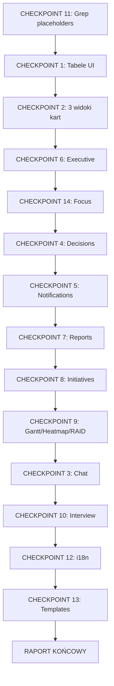

# 🔍 Audit Checkpoints — Plan Weryfikacji Wdrożenia

**Data przygotowania**: 2026-02-09  
**Status**: 🔲 OCZEKUJE NA AUDYT (Cursor kończy przebudowę)

---

## Cel dokumentu

Dokument definiuje **checkpointy audytowe** — konkretne kroki weryfikacji, które będą wykonane po zakończeniu przebudowy przez Cursor. Każdy checkpoint ma przypisane:

- **pliki/komponenty do sprawdzenia** (grep, view_file, view_code_item)
- **testy do uruchomienia**
- **weryfikację wizualną** (browser)

---

## CHECKPOINT 1: Spójność tabel (UI)

**Dotyczy**: A2, A4, A6, D2, E3, F1

### Weryfikacja kodu

- [ ] Porównać komponenty tabel: Inbox, Tasks, Decisions, Notifications, Initiatives, Interview
- [ ] Sprawdzić czy korzystają z wspólnego komponentu bazowego tabeli
- [ ] Zweryfikować CSS: nagłówki, spacing, hover, row height
- [ ] Sprawdzić row actions: "⋯" menu we wszystkich tabelach
- [ ] Sprawdzić truncation tekstu (ellipsis) w kolumnach

### Pliki do sprawdzenia

```
src/components/*Table*.tsx
src/components/*List*.tsx
src/components/common/Table/
src/components/Inbox/
src/components/Tasks/
src/components/Decisions/
src/components/Notifications/
src/views/initiatives/
src/views/interview/
```

---

## CHECKPOINT 2: 3 style widoku kart (Notion/ClickUp/Current)

**Dotyczy**: A7, B7.1, E4.1, F1.3

### Weryfikacja kodu

- [ ] Sprawdzić komponent przełącznika widoków (ViewSelector / ViewToggle)
- [ ] Zweryfikować 3 warianty widoku w Tasks, Decisions, Notifications, Initiatives, Insights
- [ ] Sprawdzić Notion-like: menu po lewej (8-12 sekcji), treść po prawej
- [ ] Sprawdzić ClickUp-like: gęsty widok, małe ikony, tech-sexy
- [ ] Upewnić się, że preferencja widoku zapisuje się per user

### Pliki do sprawdzenia

```
src/components/*ViewSelector*
src/components/*ViewMode*
src/components/*NotionView*
src/components/*ClickUpView*
src/components/*CardView*
```

---

## CHECKPOINT 3: Chat — stabilność i funkcjonalność

**Dotyczy**: C1-C9

### Weryfikacja kodu

- [ ] "New conversation" → tworzy nową (nie wraca do starej)
- [ ] Welcome screen: 4 przyciski z rotacji
- [ ] Historia: auto-tytuły, foldery, limity widoczności
- [ ] Załączniki: RAG pipeline, PDF parsing
- [ ] Markdown rendering (brak surowych \*\* ### itp.)
- [ ] Web search: albo działa albo jasno wyłączony
- [ ] Deep thinking / show reasoning: widoczny tok pracy
- [ ] Multi-agent: UI współpracy agentów
- [ ] Ustawienia głosu/stylu/języka (3-4 style)
- [ ] Chat nawigacyjny: przechodzenie do modułów
- [ ] Chat kontekstowy: zna obiekt z którego został wywołany
- [ ] Feedback: thumbs down → dopytanie co było złe

### Pliki do sprawdzenia

```
src/components/Chat/
src/components/UnifiedChatPanel/
src/services/chat*
src/hooks/useChat*
server/src/routes/chat*
server/src/services/ai*
```

---

## CHECKPOINT 4: Decisions — delegowanie i akcje

**Dotyczy**: A5

### Weryfikacja kodu

- [ ] Delegowanie decyzji: end-to-end flow bez crash
- [ ] "Request for description": stabilna obsługa
- [ ] Walidacja uprawnień przy delegowaniu
- [ ] Error handling: użytkownik widzi sensowne komunikaty

### Testy

```bash
# Sprawdzić istniejące testy
find tests -name "*decision*" -o -name "*delegat*" | head -20
# Uruchomić testy
npx vitest run --reporter verbose tests/**/decision*
```

---

## CHECKPOINT 5: Notifications — kompletność

**Dotyczy**: A6

### Weryfikacja kodu

- [ ] Kolumna "tip": CSS wrap/ellipsis
- [ ] Kolumna "dotyczy": typ + link do encji
- [ ] Kolumna "źródło": skąd notyfikacja
- [ ] "New notification": pełny CRUD (nie "coming soon")

### Pliki do sprawdzenia

```
src/components/Notifications/
src/views/*notification*
server/src/routes/notification*
```

---

## CHECKPOINT 6: Executive — realne dane i uprawnienia

**Dotyczy**: A1

### Weryfikacja kodu

- [ ] Sprawdzić czy metryki to API calls (nie hardcoded/mock)
- [ ] Grep: `"No data"` / fallback gdy brak danych
- [ ] Route guard: manager/admin only
- [ ] API middleware: role check

### Testy

```bash
grep -rn "mock\|placeholder\|hardcoded\|dummy" src/views/Executive* src/components/Executive*
grep -rn "role.*manager\|isAdmin\|requireRole" src/views/Executive*
```

---

## CHECKPOINT 7: Reports — immutable, wersje, estetyka

**Dotyczy**: B2, B5, B6

### Weryfikacja kodu

- [ ] Lista wygenerowanych raportów z metryką (data, autor, wersja)
- [ ] Raport immutable (brak edycji po wygenerowaniu)
- [ ] Prawy panel: lista wersji, szybkie otwieranie
- [ ] Estetyka: sprawdzić layout, typografię, wykresy

### Pliki do sprawdzenia

```
src/views/reports/
src/components/Report*
src/components/ReportEditor/
server/src/routes/report*
```

---

## CHECKPOINT 8: Initiatives — 3 formaty, 5 kluczowych elementów

**Dotyczy**: B7, D1-D5

### Weryfikacja kodu

- [ ] 3 formaty widoku inicjatyw
- [ ] 5 kluczowych zawsze widocznych: cel, taski, team, zasoby, finanse/ryzyko
- [ ] Statusy kompletne (draft → scheduled → execution → done + cancelled/archived)
- [ ] Antyduplikacja inicjatyw
- [ ] Formularz w języku aplikacji (nie miks PL/EN)
- [ ] Menu "⋯" nie chowa się pod elementami

### Pliki do sprawdzenia

```
src/views/initiatives/
src/components/Initiative*
src/services/initiative*
server/src/routes/initiative*
```

---

## CHECKPOINT 9: Gantt + Heatmap + RAID

**Dotyczy**: D5, D6

### Weryfikacja kodu

- [ ] Gantt: zależności, ścieżka krytyczna, edycja graficzna + manualna
- [ ] Heatmap: obciążenie miesięczne, sumowanie tasków
- [ ] RAID Log: CRUD, raport, linkowanie do inicjatyw
- [ ] Execution Center: realne parametry, brak placeholderów

### Pliki do sprawdzenia

```
src/components/Gantt*
src/components/Heatmap*
src/components/RAID*
src/views/execution/
```

---

## CHECKPOINT 10: Interview — end-to-end

**Dotyczy**: E1-E4

### Weryfikacja kodu

- [ ] Inbox: "days to due" + kolory (≤3 żółte, overdue czerwone)
- [ ] Arkusze: wpisywanie, zmiana ocen, notatki, załączniki, zapis
- [ ] Statusy: drafting → review → accepted/rejected
- [ ] Chat-assist: kontekstowy w kolumnie wsparcia
- [ ] Insights: 3 formaty, 2 osie (by report / by person)
- [ ] Nawigacja: assessments między sessions/templates, insights na prawo

### Pliki do sprawdzenia

```
src/views/interview/
src/components/Interview*
src/components/Insights*
server/src/routes/interview*
```

---

## CHECKPOINT 11: Brak placeholderów i "coming soon"

**Dotyczy**: F3

### Weryfikacja automatyczna

```bash
# Wyszukać placeholdery w kodzie
grep -rn "coming soon\|placeholder\|TODO\|FIXME\|WIP\|mock data\|hardcoded" \
  src/ server/src/ --include="*.ts" --include="*.tsx" | grep -v node_modules | grep -v test
```

---

## CHECKPOINT 12: Spójność językowa (i18n)

**Dotyczy**: F2, B8.1

### Weryfikacja

- [ ] Sprawdzić pliki i18n: czy wszystkie klucze mają tłumaczenia PL i EN
- [ ] Sprawdzić formularze inicjatyw: czy respektują język
- [ ] Sprawdzić chat: czy respektuje język ustawienia

### Pliki do sprawdzenia

```
src/i18n/
src/locales/
public/locales/
```

---

## CHECKPOINT 13: Templates — zwiniete + ikony

**Dotyczy**: B4

### Weryfikacja

- [ ] Wejście w template: wszystko zwinięte (initial state)
- [ ] Menu nie nakładają się na siebie
- [ ] Ikony: disable, copy, add — wszystkie mają ikony (symetria)

---

## CHECKPOINT 14: Focus — brak duplikatów + czytelne akcje

**Dotyczy**: A3

### Weryfikacja kodu

- [ ] Logika Today vs This week (brak duplikatów)
- [ ] Row actions: "⋯" czytelne, nie nachodzą na tekst

---

## Kolejność wykonania audytu



---

## Wynik audytu

| Status     | Znaczenie                           |
| ---------- | ----------------------------------- |
| ✅ PASS    | Spełnia wymagania z PDF             |
| ⚠️ PARTIAL | Częściowo wdrożone, wymaga poprawek |
| ❌ FAIL    | Nie wdrożone lub krytyczny problem  |
| ⏭️ SKIP    | Nie dotyczy / odroczone             |

Raport końcowy zostanie zapisany jako `AUDIT_RESULTS.md` w tym samym katalogu.
