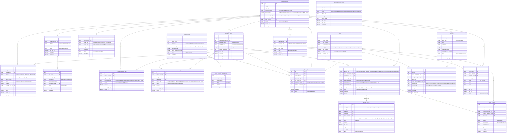

# 01 - DBR77 Enterprise Account System ER Diagram

```mermaid
erDiagram
    USER {
        uuid id PK
        string email UK
        string display_name
        string auth_provider
        string external_identity_id
        string user_type "core|workforce|end_user|external_consultant|dbr77_support|dbr77_service"
        boolean mfa_enabled
        string status "invited|active|suspended|deleted"
        datetime last_login_at
        datetime created_at
        datetime updated_at
    }

    ORGANIZATION {
        uuid id PK
        string legal_name
        string display_name
        string verification_status "unverified|verified|enterprise_verified"
        string[] business_types "manufacturer|integrator|technology_supplier|consultant_company|dbr77_internal"
        string tenant_encryption_mode "platform_managed|tenant_managed|customer_managed_key"
        string customer_kms_key_ref
        uuid scim_tenant_id FK
        string status "active|suspended|deleted"
        datetime created_at
        datetime updated_at
    }

    MEMBERSHIP {
        uuid id PK
        uuid user_id FK
        uuid organization_id FK
        string org_role "owner|admin|security_admin|billing_admin|member"
        string source "manual_invite|scim|support_created"
        string external_group_id
        string status "invited|active|suspended|expired|deleted"
        datetime invited_at
        uuid invited_by_user_id FK
        datetime activated_at
        datetime expires_at
        datetime created_at
        datetime updated_at
    }

    SCIM_TENANT {
        uuid id PK
        uuid organization_id FK
        string idp_type "entra_id|okta|onelogin|custom"
        string scim_base_url
        string status "active|paused|disabled"
        datetime last_sync_at
        datetime created_at
        datetime updated_at
    }

    SCIM_GROUP_MAPPING {
        uuid id PK
        uuid scim_tenant_id FK
        string external_group_id
        string target_scope "organization|module|project"
        string target_role_bundle_key
        uuid target_project_space_id FK
        string status "active|disabled"
        datetime created_at
        datetime updated_at
    }

    ENTITLEMENT {
        uuid id PK
        uuid organization_id FK
        string module_key "marketplace|digital_twin|iot|iris|iris_hrm|consultify"
        string license_type "full|module|admin|workforce|self_service|external|device"
        int seat_limit
        int seats_used
        string status "active|expired|suspended"
        datetime active_from
        datetime active_until
    }

    PROJECT_SPACE {
        uuid id PK
        string name
        uuid owner_organization_id FK
        string workspace_type "isolated|aggregated"
        string sensitivity_level "internal|confidential|ip_critical"
        string status "draft|active|archived|closed"
        uuid created_by_user_id FK
        datetime start_date
        datetime end_date
        datetime created_at
        datetime updated_at
    }

    PROJECT_SPACE_ORG {
        uuid id PK
        uuid project_space_id FK
        uuid organization_id FK
        string relationship_type "owner|customer|integrator|supplier|consultant|dbr77_support|dbr77_service"
        string status "invited|active|suspended|removed"
        datetime invited_at
        uuid invited_by_user_id FK
        datetime expires_at
    }

    PROJECT_SPACE_USER {
        uuid id PK
        uuid project_space_id FK
        uuid user_id FK
        uuid organization_id FK
        string project_role "project_owner|project_admin|contributor|viewer|external_consultant|dbr77_support|dbr77_service"
        string status "invited|active|suspended|expired|removed"
        datetime invited_at
        uuid invited_by_user_id FK
        datetime expires_at
    }

    ROLE_BUNDLE {
        uuid id PK
        string key UK
        string display_name
        string archetype "viewer|contributor|specialist|manager|admin|owner"
        string product_scope "global|marketplace|digital_twin|iot|iris|iris_hrm|consultify"
        boolean external_allowed
        boolean export_allowed_by_default
        string status "active|deprecated"
        datetime created_at
        datetime updated_at
    }

    ROLE_BUNDLE_PERMISSION {
        uuid id PK
        uuid role_bundle_id FK
        string permission_key
        string effect "allow|deny"
        json conditions
        datetime created_at
    }

    USER_ROLE_ASSIGNMENT {
        uuid id PK
        uuid user_id FK
        uuid organization_id FK
        uuid project_space_id FK
        uuid role_bundle_id FK
        string assignment_source "manual|scim_group|system|support_escalation"
        uuid assigned_by_user_id FK
        datetime valid_from
        datetime valid_until
        string status "active|expired|revoked"
    }

    RESOURCE {
        uuid id PK
        string resource_type "twin|model|simulation|iot_device|iot_stream|iris_analysis|hrm_employee|marketplace_product|consultify_document"
        uuid owner_organization_id FK
        uuid project_space_id FK
        uuid created_by_user_id FK
        string data_classification "public|internal|confidential|ip_critical"
        string encryption_mode "platform_managed|tenant_managed|customer_managed_key"
        string encryption_key_ref
        string visibility "private|project|organization|marketplace_public"
        string status "draft|active|archived|deleted"
        datetime created_at
        datetime updated_at
    }

    ACCESS_POLICY {
        uuid id PK
        string subject_type "user|organization|role_bundle|project_role|dbr77_support|scim_group"
        uuid subject_id
        uuid resource_id FK
        uuid organization_id FK
        uuid project_space_id FK
        string action "view|create|edit|delete|share|export|download|approve|manage|support_read|support_edit|act_on_behalf"
        string effect "allow|deny"
        json conditions
        datetime valid_from
        datetime valid_until
        uuid created_by_user_id FK
        string status "active|revoked|expired"
    }

    REBAC_RELATION_TUPLE {
        uuid id PK
        string object_type
        uuid object_id
        string relation "owner|member|admin|viewer|editor|participant|shared_with|acts_on_behalf|parent"
        string subject_type
        uuid subject_id
        json caveat_context
        datetime valid_from
        datetime valid_until
        datetime created_at
    }

    DEVICE {
        uuid id PK
        uuid organization_id FK
        string device_type "tablet|kiosk|terminal"
        string name
        string location_ref
        string[] allowed_modules
        string[] allowed_workflows
        int session_timeout_seconds
        string status "registered|active|lost|revoked"
        datetime registered_at
        uuid registered_by_user_id FK
    }

    SESSION {
        uuid id PK
        uuid user_id FK
        uuid active_organization_id FK
        uuid active_project_space_id FK
        uuid device_id FK
        uuid acting_on_behalf_of_org_id FK
        string session_type "personal|workforce|device|consultant|support_readonly|support_edit|delegated"
        string auth_strength "password|mfa|sso_mfa|device_pin|badge"
        datetime issued_at
        datetime expires_at
        datetime last_activity_at
    }

    SUPPORT_GRANT {
        uuid id PK
        uuid organization_id FK
        uuid project_space_id FK
        uuid granted_to_user_id FK
        uuid granted_by_user_id FK
        string mode "read_only|edit"
        json scope
        string reason
        string ticket_id
        datetime valid_from
        datetime valid_until
        string status "active|expired|revoked"
    }

    AUDIT_EVENT {
        uuid id PK
        uuid actor_user_id FK
        uuid actor_organization_id FK
        uuid active_project_space_id FK
        uuid acting_on_behalf_of_org_id FK
        uuid resource_id FK
        string action
        string decision "allowed|denied"
        string policy_engine "rebac|abac|rbac|manual"
        json decision_reason
        string ip_address
        string user_agent
        datetime occurred_at
    }

    SIEM_EXPORT_SUBSCRIPTION {
        uuid id PK
        uuid organization_id FK
        string destination_type "webhook|eventbridge|kafka|splunk_hec|datadog"
        string endpoint_ref
        string[] event_types
        string status "active|paused|disabled"
        datetime created_at
        datetime updated_at
    }

    USER ||--o{ MEMBERSHIP : has
    ORGANIZATION ||--o{ MEMBERSHIP : contains
    ORGANIZATION ||--o{ ENTITLEMENT : owns
    ORGANIZATION ||--|| SCIM_TENANT : may_use
    SCIM_TENANT ||--o{ SCIM_GROUP_MAPPING : maps
    ORGANIZATION ||--o{ PROJECT_SPACE : owns
    PROJECT_SPACE ||--o{ PROJECT_SPACE_ORG : includes
    ORGANIZATION ||--o{ PROJECT_SPACE_ORG : participates
    PROJECT_SPACE ||--o{ PROJECT_SPACE_USER : has_users
    USER ||--o{ PROJECT_SPACE_USER : assigned_to
    ORGANIZATION ||--o{ RESOURCE : owns
    PROJECT_SPACE ||--o{ RESOURCE : contains
    RESOURCE ||--o{ ACCESS_POLICY : protected_by
    ROLE_BUNDLE ||--o{ ROLE_BUNDLE_PERMISSION : contains
    USER ||--o{ USER_ROLE_ASSIGNMENT : receives
    ORGANIZATION ||--o{ USER_ROLE_ASSIGNMENT : scopes
    PROJECT_SPACE ||--o{ USER_ROLE_ASSIGNMENT : scopes
    ROLE_BUNDLE ||--o{ USER_ROLE_ASSIGNMENT : assigned_as
    ORGANIZATION ||--o{ DEVICE : registers
    DEVICE ||--o{ SESSION : starts
    USER ||--o{ SESSION : owns
    ORGANIZATION ||--o{ SUPPORT_GRANT : grants
    USER ||--o{ SUPPORT_GRANT : receives
    USER ||--o{ AUDIT_EVENT : acts
    RESOURCE ||--o{ AUDIT_EVENT : referenced_by
    ORGANIZATION ||--o{ SIEM_EXPORT_SUBSCRIPTION : exports_to
```
