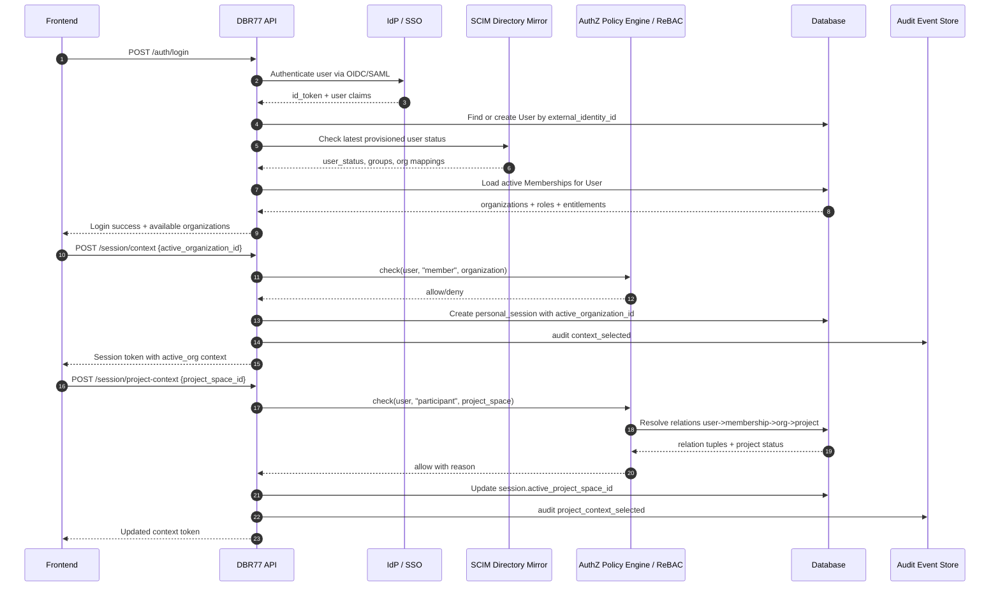
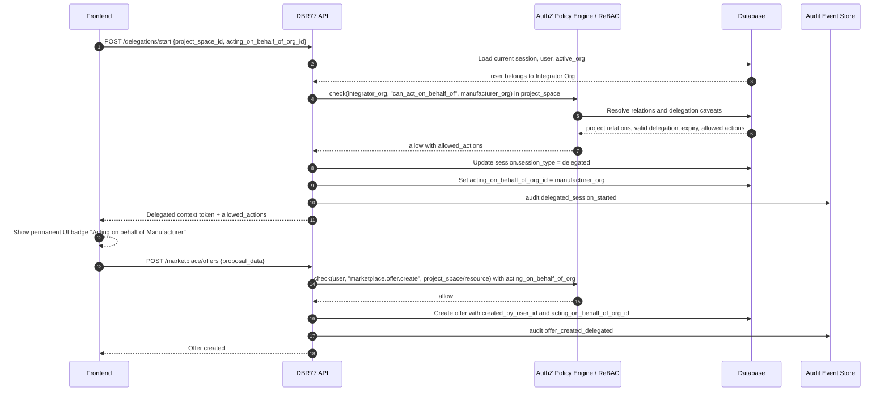
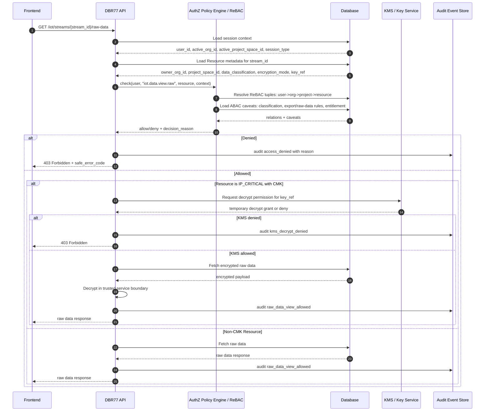

# 02 - Critical Sequence Diagrams

## A) Login & Context Switch into Project Space

## B) Delegated Access: Integrator acts on behalf of Manufacturer

## C) Resource Access: IRIS Analyst requests IoT raw data

