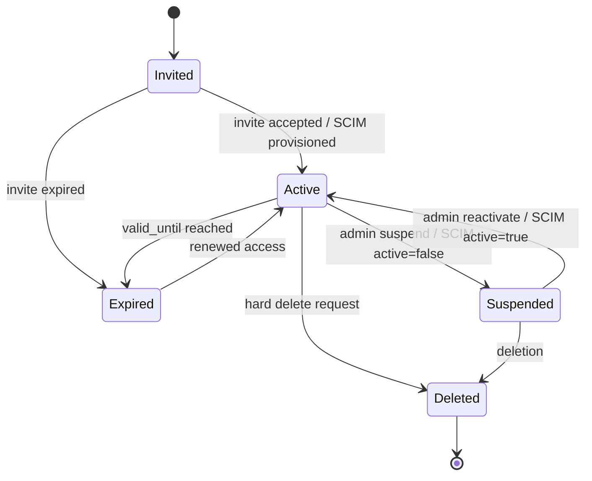

# 04 - User Lifecycle Flow

## Principle

User lifecycle must support two paths:

1. Manual Invite Flow - for SMBs, partners, smaller customers, external consultants.
2. SCIM Provisioning Flow - mandatory for Enterprise customers using Entra ID, Okta, OneLogin, etc.

SSO handles authentication.
SCIM handles provisioning and deprovisioning.

---

# A. Manual Invite Flow

## 1. Invite Created

Actor:

- Org Owner
- Org Admin
- Project Admin, if inviting into a Project Space
- DBR77 Support only if explicitly allowed

System actions:

1. Create or locate User by email.
2. Create Membership with status `invited`.
3. Assign default organization role or project role.
4. Assign Role Bundle if selected.
5. Set optional expiration for external users.
6. Send invitation email.
7. Create ReBAC relation tuples in pending state if needed.
8. Write Audit Event: `user_invited`.

Required fields:

- invited_email
- target_organization_id
- target_project_space_id optional
- role_bundle_key
- invited_by_user_id
- expires_at required for external users
- source = manual_invite

Rules:

- external consultants must have expiry
- DBR77 Support Edit cannot be granted through normal invite
- Org Owner role should require elevated confirmation

---

## 2. Invite Accepted / Activation

User actions:

1. Opens invitation link.
2. Creates account or logs into existing account.
3. Completes MFA if required.
4. Accepts terms and privacy requirements.
5. Selects or confirms organization/project context.

System actions:

1. Verify invite token.
2. Activate User if new.
3. Set Membership status to `active`.
4. Activate related project membership.
5. Create or activate ReBAC relation tuples.
6. Issue first session.
7. Write Audit Event: `user_activated`.

Rules:

- if MFA required and not completed, block access
- if invite expired, reject and require new invite
- if user belongs to multiple organizations, force context selection after login

---

## 3. Role Assignment

Actor:

- Org Owner
- Org Admin
- Security Admin for security roles
- Project Owner / Project Admin for project roles
- SCIM Group Mapping for Enterprise

System actions:

1. Validate assigner has permission `org.user.role.assign` or `project.role.assign`.
2. Validate target user belongs to organization or project.
3. Validate Role Bundle is assignable in this scope.
4. Create UserRoleAssignment.
5. Create/update ReBAC relation tuples.
6. Write Audit Event: `role_assigned`.

Rules:

- Org Admin cannot remove or downgrade Org Owner.
- External Consultant roles must be project-scoped.
- Role Bundle cannot exceed Organization Entitlement.
- Export permissions require explicit grant if resource is Confidential or IP Critical.

---

## 4. Entering a Project Space

User action:

- selects Project Space in UI or follows project link

System actions:

1. Load current session.
2. Verify active organization.
3. Check membership: user belongs to active organization.
4. Check organization participates in Project Space.
5. Check user has direct or role-based project access.
6. Check project status is active.
7. Set `active_project_space_id` in session.
8. Return new context token.
9. Write Audit Event: `project_context_selected`.

Rules:

- no project access without active organization
- no lateral movement between projects
- expired project memberships are denied
- frontend must display active Project Space clearly

---

## 5. Deactivation / Removal

Manual path:

1. Admin removes user or role.
2. Membership status changes to `suspended` or `deleted`.
3. UserRoleAssignments are revoked.
4. ReBAC relation tuples are deleted or expired.
5. Active sessions are revoked.
6. Audit Event: `user_access_revoked`.

Rules:

- removing last Org Owner is blocked
- project access must be removed when organization is removed from project
- external users should auto-expire

---

# B. SCIM Enterprise Provisioning Flow

## 1. SCIM Tenant Setup

Actor:

- Organization Security Admin
- DBR77 Enterprise Admin

System actions:

1. Create SCIM_TENANT for Organization.
2. Generate SCIM bearer token or OAuth client credentials.
3. Configure IdP app in Entra ID / Okta.
4. Define group mappings.
5. Test provisioning connection.
6. Audit Event: `scim_tenant_created`.

Required mappings:

- IdP group -> DBR77 organization role
- IdP group -> module role bundle
- IdP group -> project role bundle optional

---

## 2. SCIM User Provisioned

IdP action:

- sends SCIM `POST /Users`

System actions:

1. Create or update User.
2. Link User to external_identity_id.
3. Create Membership in mapped Organization.
4. Assign roles based on SCIM group mappings.
5. Create ReBAC relation tuples.
6. Do not require manual invite.
7. Audit Event: `scim_user_provisioned`.

Rules:

- SCIM is source of truth for Enterprise-managed users.
- local manual role overrides should be avoided or clearly marked.
- user may still need first login via SSO before receiving a session.

---

## 3. SCIM Group Update

IdP action:

- sends SCIM `PATCH /Users/{id}` with group changes

System actions:

1. Update group memberships.
2. Recalculate Role Assignments from SCIM mappings.
3. Add or revoke Role Bundles.
4. Update ReBAC relation tuples.
5. Revoke sessions if privileges were reduced.
6. Audit Event: `scim_group_membership_updated`.

Rules:

- removed group means role revoked.
- security-sensitive role changes should revoke active sessions immediately.
- downgrade from Admin/Owner-equivalent group requires immediate session refresh or logout.

---

## 4. SCIM User Deprovisioned

IdP action:

- sends SCIM `PATCH active=false` or `DELETE /Users/{id}`

System actions:

1. Set User or Membership status to `suspended`.
2. Revoke all Role Assignments for that Organization.
3. Expire all ReBAC relation tuples for that Organization.
4. Revoke active sessions.
5. Remove project access inherited from that Organization.
6. Audit Event: `scim_user_deprovisioned`.

Rules:

- deprovisioning must be near-real-time.
- user must lose access even if already logged in.
- if user belongs to other organizations, only the SCIM-managed org access is removed.
- if user was last Org Owner, trigger emergency owner recovery process.

---

# C. Special Lifecycle Rules

## External Consultants

- must always have expiration
- must always be project-scoped
- MFA required
- export disabled by default
- no organization-wide access

## Workforce / End Users

- can be manually created, bulk imported, or SCIM provisioned
- should be managed primarily inside HRM admin
- only self-service permissions by default
- no access to core platform modules unless explicitly upgraded

## Shared Devices

- devices are provisioned separately from users
- employee identity must still be captured for personal actions
- device sessions must be short-lived
- no persistent shared user session

## DBR77 Support

- read-only by default
- edit requires Support Grant
- Support Grant requires customer approval
- Support Grant requires scope and expiry
- all support actions are audited

## Role Bundle Assignment Defaults

Recommended defaults:

- new internal organization user: `global.viewer` or no role until assigned
- new project invite: `project.viewer`
- external consultant: `external.project_viewer` with expiry
- workforce user: `hrm.employee_self_service`
- DBR77 support: `support.readonly`
- DBR77 service user in project: assigned per project, never global

---

# D. Lifecycle State Machine

