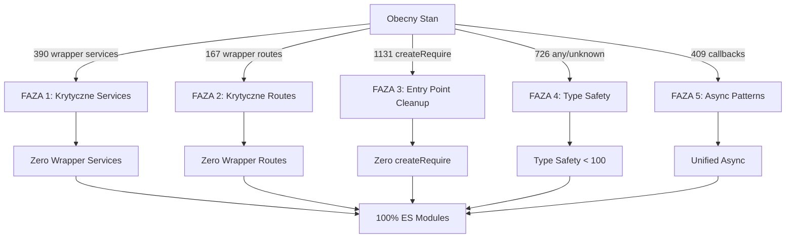

# Plan Finalnej Migracji TypeScript -

Zero Wrapperów

## Cel: 100% TypeScript ES Modules bez createRequire() i wrapperów

**Obecny stan:**

- 390 wrapper services używających `require()`

- 167 wrapper routes używających `require()`

- 1,131 wystąpień `createRequire()` w `server/src/`

- 175 `require()` w `server/src/index.ts`

- 726 użyć `any/unknown` (target: < 100)

- 409 callback patterns (target: < 50)

**Cel końcowy:**

- 0 `createRequire()` w całym `server/src/`
- 0 `require()` w TypeScript plikach

- 0 wrapper services/routes

- < 100 użyć `any/unknown`
- < 50 callback patterns

- 100% ES modules
- Pełna type safety

## Architektura Migracji




## FAZA 1: Migracja Krytycznych Services (Priorytet 1)

### Zadanie 1.1: BillingService.ts - Pełna Migracja

**Plik:** `server/src/services/BillingService.ts` (obecnie wrapper)

**Źródło:** `server/services/billingService.js` (953 linie)**Akcje:**

1. Przeczytać pełny `billingService.js` i zidentyfikować wszystkie funkcje

2. Utworzyć interfejsy TypeScript dla:

- `BillingPlan`, `Subscription`, `Invoice`, `PaymentMethod`

- `BillingStats`, `RevenueMetrics`

3. Zmigrować klasę `BillingService` z pełnym typowaniem

4. Zamienić wszystkie `require()` na ES module imports

5. Usunąć wrapper i użyć bezpośrednio klasy

6. Zaktualizować wszystkie importy w routes/controllers

**Metryki:**

- 0 `require()` w BillingService.ts

- 0 `any` types
- Wszystkie funkcje mają pełne typy

### Zadanie 1.2: InvoiceService.ts - Pełna Migracja

**Plik:** `server/src/services/InvoiceService.ts` (obecnie wrapper)

**Źródło:** `server/services/invoiceService.js` (342 linie)**Akcje:**

1. Migracja podobna do BillingService

2. Interfejsy: `Invoice`, `InvoiceLineItem`, `CreditNote`

3. Pełne typowanie Stripe integration

### Zadanie 1.3: DunningService.ts - Pełna Migracja

**Plik:** `server/src/services/dunningService.ts` (obecnie wrapper)

**Źródło:** `server/services/dunningService.js` (464 linie)

**Akcje:**

1. Migracja payment failure handling

2. Interfejsy: `DunningProcess`, `PaymentFailure`, `RetryPolicy`

### Zadanie 1.4: BillingWebhookService.ts - Pełna Migracja

**Plik:** `server/src/services/BillingWebhookService.ts` (obecnie wrapper)

**Źródło:** `server/services/billingWebhookService.js` (429 linie)**Akcje:**

1. Migracja webhook event handling

2. Interfejsy: `WebhookEvent`, `EventPayload`, `EventStats`

### Zadanie 1.5: AI Services - Pełna Migracja (Największe)

**Pliki:**

- `server/src/services/aiService.ts` (2085 linii JS)

- `server/src/services/aiOrchestrator.ts` (734 linie JS)

- `server/src/services/ragService.ts` (709 linii JS)

**Akcje:**

1. **aiService.ts:** Migracja w częściach (największy plik)

- Faza 1.5a: Core AI functions (generate, chat, analyze)
- Faza 1.5b: Queue operations

- Faza 1.5c: Integration functions

2. **aiOrchestrator.ts:** Migracja orchestration logic

3. **ragService.ts:** Migracja RAG operations

**Uwaga:** aiService.js jest oznaczony jako deprecated - sprawdzić czy można użyć AIPipeline.ts

### Zadanie 1.6: Pozostałe Krytyczne Services

**Pliki do migracji:**

- `MFAService.ts` (807 linii JS)

- `EmailVerificationService.ts`

- `SubscriptionAnalyticsService.ts`

**Akcje:** Podobny pattern jak powyżej - pełna migracja z typami

**Metryki końcowe FAZY 1:**

- 0 wrapper services w krytycznych komponentach

- Wszystkie billing/AI services w pełnym TypeScript

- Build successful po każdej migracji

## FAZA 2: Migracja Krytycznych Routes (Priorytet 2)

### Zadanie 2.1: Routes używane w index.ts

**Pliki:** 19 routes wymienionych w `registerLegacyRoutes()`

**Lista routes do migracji:**

1. `sessions.routes.ts`
2. `settings.routes.ts`

3. `superadmin.routes.ts` (już częściowo zmigrowany)
4. `knowledge.routes.ts`

5. `llm.routes.ts`
6. `teams.routes.ts`

7. `notifications.routes.ts`

8. `initiatives.routes.ts` (już częściowo zmigrowany)

9. `feedback.routes.ts`

10. `access-control.routes.ts`

11. `ai-training.routes.ts`
12. `budgets.routes.ts`

13. `adminAlerts.routes.ts` (już częściowo zmigrowany)

14. `webhooks/stripe.routes.ts`
15. `tokenBilling.routes.ts`

16. `documents.routes.ts`
17. `megatrend.routes.ts`

18. `admin-data.routes.ts` (już częściowo zmigrowany)

**Akcje dla każdego route:**

1. Przeczytać odpowiedni `.js` plik z `server/routes/`

2. Zmigrować do pełnego TypeScript z:

- ES module imports

- Zod validation schemas
- Pełne typowanie request/response

- asyncHandler dla wszystkich handlers

3. Usunąć wrapper z `server/src/routes/[name].routes.ts`

4. Zaktualizować import w `index.ts`

### Zadanie 2.2: Pozostałe Wrapper Routes (Batch Processing)

**Liczba:** ~150 routes**Strategia:**

1. Utworzyć skrypt automatyzacji do identyfikacji wrapper routes

2. Migrować w batchach po 10-20 routes

3. Każdy batch: migracja → test → commit

**Metryki końcowe FAZY 2:**

- 0 wrapper routes

- Wszystkie routes używają ES modules

- `index.ts` używa tylko ES module imports dla routes

## FAZA 3: Entry Point Cleanup (Priorytet 3)

### Zadanie 3.1: Usunięcie createRequire() z index.ts

**Plik:** `server/src/index.ts`**Akcje:**

1. Zidentyfikować wszystkie `require()` w `registerLegacyRoutes()`

2. Dla każdego route sprawdzić czy istnieje TS wersja

3. Zamienić `require()` na ES module imports

4. Usunąć `import { createRequire }` i `const require = createRequire(...)`

5. Usunąć funkcję `registerLegacyRoutes()` jeśli wszystkie routes zmigrowane

**Kod przed:**

```typescript
import { createRequire } from 'module';
const require = createRequire(import.meta.url);

const registerLegacyRoutes = () => {
    const sessionRoutes = require('../routes/sessions');
    // ... 163 więcej require()
};
```

**Kod po:**

```typescript
// Wszystkie routes jako ES modules
import sessionRoutes from './routes/sessions.routes.js';
import settingsRoutes from './routes/settings.routes.js';
// ...

const registerMigratedRoutes = () => {
    app.use('/api/sessions', sessionRoutes);
    // ...
};
```


### Zadanie 3.2: Usunięcie createRequire() z Services

**Pliki:** 390 wrapper services**Akcje:**

1. Dla każdego wrapper service:

- Jeśli już zmigrowany w FAZIE 1 → usunąć wrapper

- Jeśli nie zmigrowany → zmigrować w FAZIE 1

2. Batch processing dla pozostałych services

### Zadanie 3.3: Usunięcie createRequire() z Routes

**Pliki:** 167 wrapper routes

**Akcje:**

1. Dla każdego wrapper route:

- Jeśli już zmigrowany w FAZIE 2 → usunąć wrapper

- Jeśli nie zmigrowany → zmigrować w FAZIE 2

**Metryki końcowe FAZY 3:**

- 0 `createRequire()` w całym `server/src/`
- 0 `require()` w TypeScript plikach

- Wszystkie importy to ES modules

## FAZA 4: Type Safety Improvements (Priorytet 4)

### Zadanie 4.1: Redukcja any/unknown

**Obecny stan:** 726 użyć `any/unknown`

**Target:** < 100**Akcje:**

1. Zidentyfikować wszystkie `any/unknown`:

   ```bash
      grep -r ": any\|: unknown" server/src/ --include="*.ts" > /tmp/any_types.txt
   ```

2. Dla każdego przypadku:

- Utworzyć właściwy interface/type

- Zamienić `any` na konkretny typ

- Dodać type guards gdzie potrzebne

**Priorytety:**

- Najpierw: public APIs (routes, services exports)

- Potem: internal functions

- Na końcu: utility functions

### Zadanie 4.2: Type Guards i Validation

**Akcje:**

1. Utworzyć type guard functions dla:

- Database results

- API responses

- External service responses

2. Dodać runtime validation z Zod gdzie potrzebne

**Metryki końcowe FAZY 4:**

- < 100 użyć `any/unknown`

- Wszystkie public APIs mają pełne typy

- Type guards dla runtime validation

## FAZA 5: Async Patterns Unification (Priorytet 5)

### Zadanie 5.1: Callback → Promise Conversion

**Obecny stan:** 409 callback patterns

**Target:** < 50**Akcje:**

1. Zidentyfikować callback patterns:

   ```bash
      grep -r "callback\|cb\)" server/src/ --include="*.ts"
   ```

2. Dla każdego przypadku:

- Zamienić callback na Promise/async-await

- Zaktualizować wywołania

- Usunąć callback parameters

**Przykład konwersji:**

```typescript
// PRZED:
function getData(id: string, callback: (err: Error | null, data: Data) => void) {
    db.get(sql, [id], callback);
}

// PO:
async function getData(id: string): Promise<Data> {
    return new Promise((resolve, reject) => {
        db.get(sql, [id], (err, row) => {
            if (err) reject(err);
            else resolve(row);
        });
    });
}
```


### Zadanie 5.2: Database Query Patterns

**Akcje:**

1. Wszystkie `db.get()`, `db.all()`, `db.run()` z callbackami
2. Zamienić na Promise-based patterns

3. Użyć `DbPromise` utility gdzie już istnieje

**Metryki końcowe FAZY 5:**

- < 50 callback patterns

- Wszystkie database operations używają Promises

- Unified async/await patterns

## Harmonogram Realizacji

### Tydzień 1-2: FAZA 1 (Krytyczne Services)

- Dzień 1-2: BillingService.ts
- Dzień 3-4: InvoiceService.ts, DunningService.ts

- Dzień 5-7: BillingWebhookService.ts

- Dzień 8-10: AI Services (aiService.ts częściowo)

- Dzień 11-14: AI Services (dokończenie), MFAService.ts

### Tydzień 3-4: FAZA 2 (Krytyczne Routes)

- Dzień 1-3: Routes z index.ts (19 routes)

- Dzień 4-7: Batch processing pozostałych routes (10-20 dziennie)

- Dzień 8-14: Dokończenie wszystkich wrapper routes

### Tydzień 5: FAZA 3 (Entry Point Cleanup)

- Dzień 1-2: Usunięcie createRequire() z index.ts

- Dzień 3-5: Cleanup pozostałych createRequire() w services/routes

### Tydzień 6: FAZA 4 (Type Safety)

- Dzień 1-3: Redukcja any/unknown w public APIs
- Dzień 4-5: Redukcja any/unknown w internal functions
- Dzień 6-7: Type guards i validation

### Tydzień 7: FAZA 5 (Async Patterns)

- Dzień 1-3: Callback → Promise conversion
- Dzień 4-5: Database query patterns
- Dzień 6-7: Final cleanup i verification

**Szacowany czas całkowity:** 7 tygodni (35 dni roboczych)

## Metryki Sukcesu - Finalne

### Code Quality

- 0 błędów TypeScript (strict mode)
- 0 użyć `createRequire()`
- 0 użyć `require()` w TS plikach
- < 100 użyć `any/unknown`
- < 50 callback patterns

### System Architecture

- 100% ES modules w `server/src/`
- 0 wrapper services/routes
- Pełna type safety dla public APIs
- Unified async patterns

### Performance

- Build time bez zmian lub lepszy
- Startup time bez zmian
- Test execution time bez zmian

### Testing

- Wszystkie testy przechodzą
- Coverage > 95%
- Zero regressions

## Narzędzia i Automatyzacja

### Skrypty Wspomagające

1. **Detekcja wrapper services:**
   ```bash
      grep -r "require.*services/" server/src/services --include="*.ts" | cut -d: -f1 | sort | uniq
   ```


2. **Detekcja any types:**

   ```bash
      grep -r ": any\|: unknown" server/src/ --include="*.ts" | wc -l
   ```


3. **Detekcja callbacks:**
   ```bash
      grep -r "callback\|cb\)" server/src/ --include="*.ts" | wc -l
   ```


4. **Verification script:**
   ```bash
      # Sprawdzenie czy migracja kompletna
      echo "createRequire: $(grep -r 'createRequire' server/src --include='*.ts' | wc -l)"
      echo "require in TS: $(grep -r 'require(' server/src --include='*.ts' | wc -l)"
      echo "any/unknown: $(grep -r ': any\|: unknown' server/src --include='*.ts' | wc -l)"
   ```


## Rekomendacje Implementacyjne

1. **Incremental Approach:** Migrować po jednym service/route, testować, commitować
2. **Type-First:** Najpierw stworzyć interface'y, potem implementację
3. **Backward Compatibility:** Zachować API compatibility podczas migracji
4. **Testing:** Testy przed/po każdej migracji
5. **Documentation:** Dokumentować zmiany w interfejsach

## Ryzyka i Mitigacje

**Ryzyko 1:** Regression w funkcjonalności

- **Mitigacja:** Testy przed/po, code review

**Ryzyko 2:** Performance degradation

- **Mitigacja:** Benchmark przed/po, monitoring

**Ryzyko 3:** Build failures

- **Mitigacja:** CI/CD z type checking, incremental commits

**Ryzyko 4:** Timeline overrun