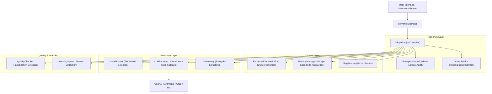
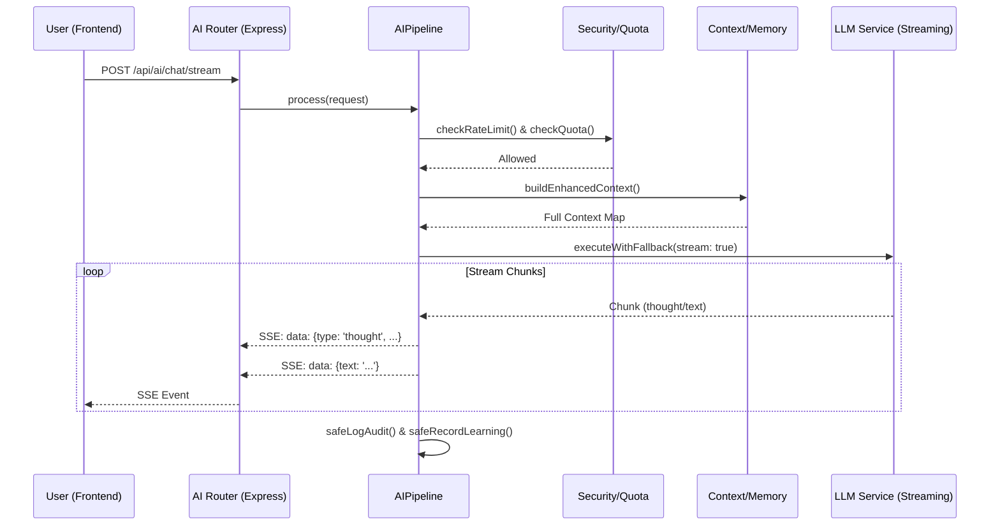
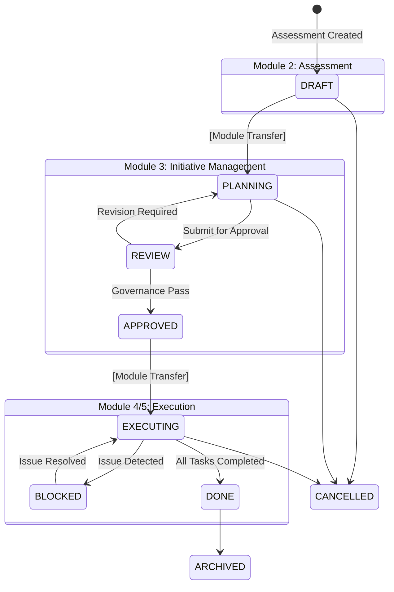

# Architecture Detailed Blueprints (C4 Level 3)

**Last Updated:** 1 January 2026  
**Standard:** C4 Model Tier 3 (Component Level)

This document provides the low-level architectural blueprints for the core engines of Consultinity. These specifications are designed to allow a professional engineering team to rebuild the core services with byte-perfect logic parity.

---

## 1. AI Pipeline Orchestration (`AIPipeline.js`)

The `AIPipeline` is the central nervous system for AI operations, managing a resilient, multi-provider execution flow.

### C4 Level 3: Component Diagram

### Sequence Diagram: AI Streaming Flow

---

## 2. Initiative Governance (`StatusMachine.js`)

The `StatusMachine` enforces the PMO-standard lifecycle. Transitions across module boundaries trigger specific system behaviors.

### Status Transition Matrix (C4 Level 3)

---

## 3. Data Flow Standards
- **Immutability**: Once an initiative reaches `DONE` or `ARCHIVED`, its financial and timeline baseline is locked.
- **Audit Trails**: Every state change in the `StatusMachine` must be recorded in the `pmo_audit_log` with the `changedBy` and `rationale` fields.
- **Fail-Open Policy**: The AI Pipeline security components (Quota/Security) are designed to "Fail-Open" in case of non-critical infrastructure errors to ensure high availability for end-users, while logging "Critical Warnings" to `AIAuditLogger`.
