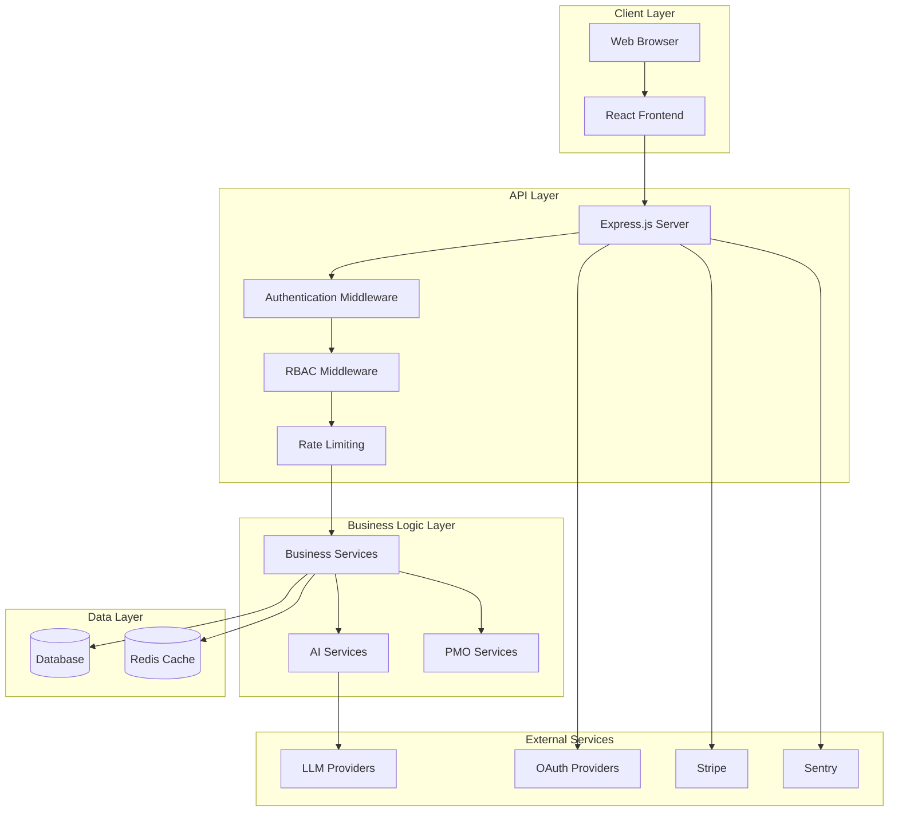
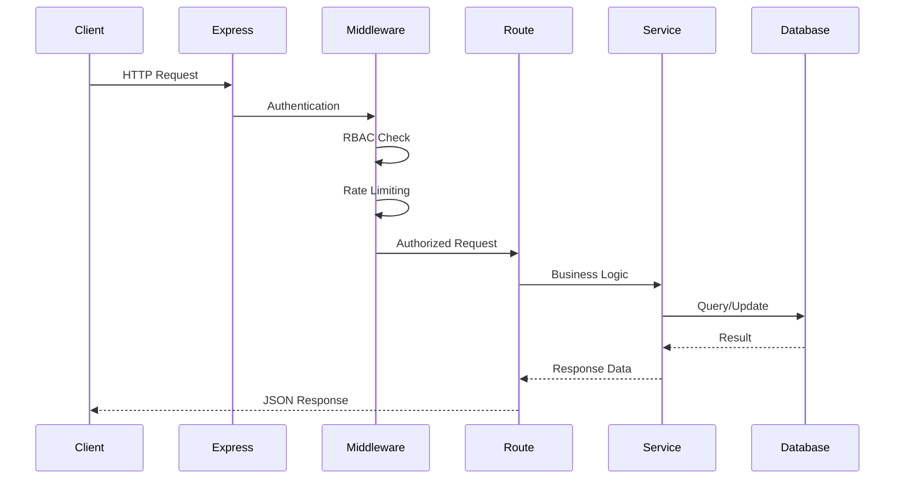
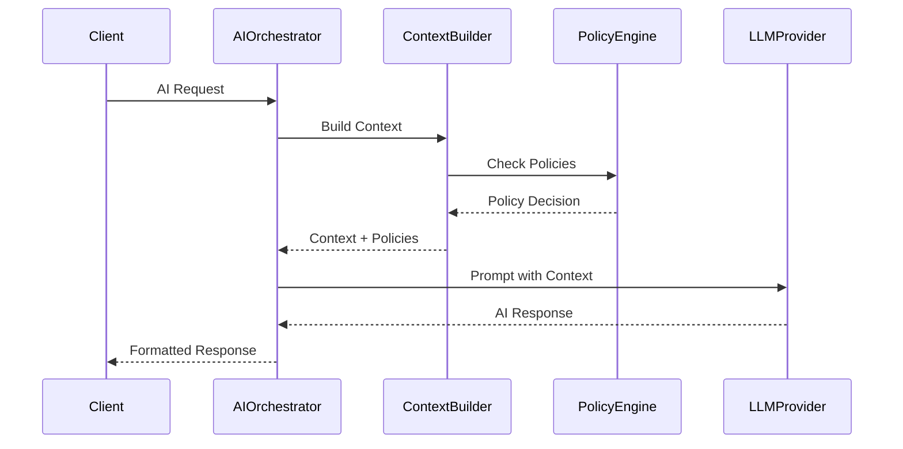
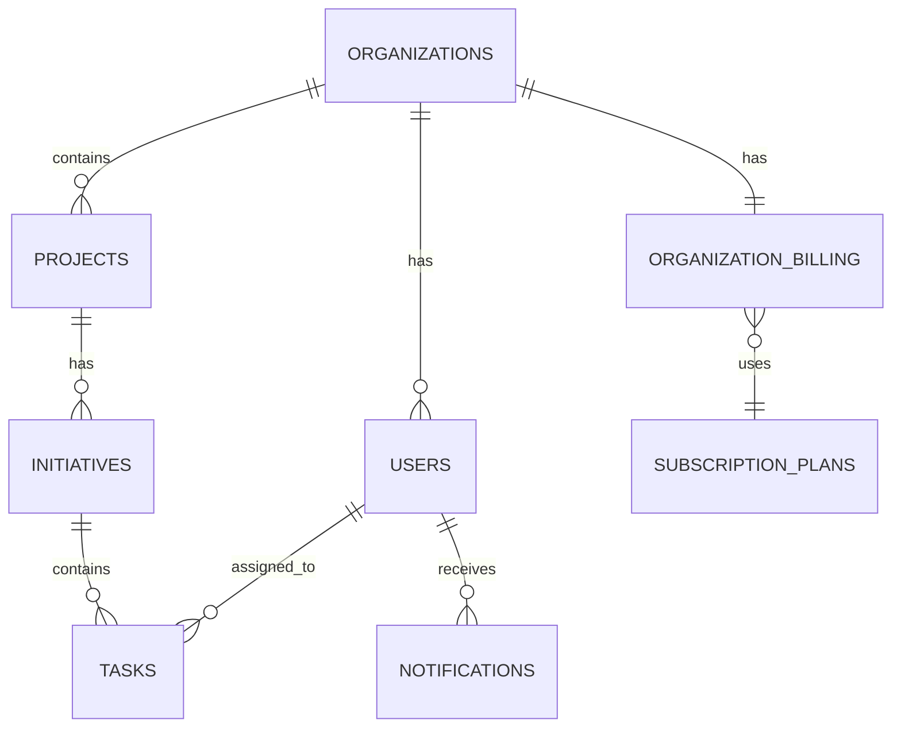
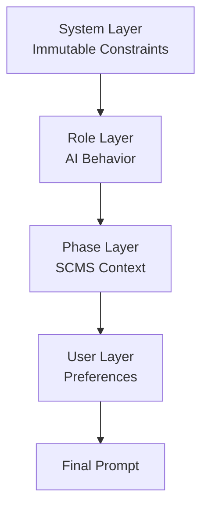

# System Architecture

## Overview

Consultify is built as a modern full-stack web application with a clear separation between frontend and backend, designed for scalability, maintainability, and enterprise-grade reliability.

## High-Level Architecture



## Technology Stack

### Frontend

- **React 19** – UI framework
- **TypeScript** – Type safety
- **Vite** – Build tool and dev server
- **React Router** – Client-side routing
- **Zustand** – State management
- **Tailwind CSS** – Styling
- **Framer Motion** – Animations
- **React i18next** – Internationalization
- **Recharts** – Data visualization
- **Lucide React** – Icons

### Backend

- **Node.js** – Runtime environment
- **Express.js** – Web framework
- **SQLite/PostgreSQL** – Database (configurable)
- **Redis** – Caching and rate limiting
- **JWT** – Authentication tokens
- **bcryptjs** – Password hashing
- **Winston** – Logging
- **BullMQ** – Job queue management
- **Node-cron** – Scheduled tasks

### AI & Integrations

- **Google Gemini API** – Primary LLM provider
- **OpenAI API** – Alternative LLM provider
- **Anthropic Claude API** – Alternative LLM provider
- **Passport.js** – OAuth authentication (Google, LinkedIn)
- **Stripe** – Payment processing
- **Sentry** – Error tracking and monitoring

## Project Structure

```
consultify/
├── components/          # React components
│   ├── assessment/     # Assessment components
│   ├── ai/            # AI-related components
│   ├── dashboard/     # Dashboard components
│   ├── governance/    # Governance components
│   └── PMO/          # PMO components
├── views/             # Page-level views
├── services/          # Frontend services
│   ├── api.ts        # API client
│   └── ai/           # AI service integrations
├── store/             # Zustand stores
├── hooks/            # Custom React hooks
├── contexts/         # React contexts
├── server/           # Backend application
│   ├── routes/       # API route handlers
│   ├── services/    # Business logic services
│   ├── middleware/  # Express middleware
│   ├── ai/          # AI orchestration
│   ├── migrations/  # Database migrations
│   └── cron/        # Scheduled jobs
├── docs/             # Documentation
└── tests/            # Test suites
```

## Data Flow

### Request Flow



### AI Request Flow



## Database Architecture

### Database Options

Consultify supports two database backends:

1. **SQLite** (default for development)
   - File-based, zero configuration
   - Suitable for development and small deployments
   - Path: `./server/consultify.db`

2. **PostgreSQL** (recommended for production)
   - Full-featured relational database
   - Better performance and scalability
   - Supports advanced features (JSONB, full-text search)

### Core Tables

- **organizations** – Organization/tenant data
- **users** – User accounts and authentication
- **projects** – Transformation projects
- **sessions** – User session data
- **initiatives** – Transformation initiatives
- **tasks** – Task management
- **teams** – Team structures
- **notifications** – User notifications
- **llm_providers** – LLM provider configurations
- **subscription_plans** – Billing plans
- **organization_billing** – Billing records

### Database Schema Relationships



## Authentication & Authorization

### Authentication Flow

1. User submits credentials (email/password or OAuth)
2. Server validates credentials
3. JWT token generated with user ID and role
4. Token stored in HTTP-only cookie or Authorization header
5. Subsequent requests include token for validation

### Authorization Model

- **Role-Based Access Control (RBAC)**:
  - `SUPERADMIN` – Full system access
  - `ADMIN` – Organization-level admin
  - `USER` – Standard user
  - `CONSULTANT` – Consultant mode

- **Resource-Level Permissions**:
  - Organization-scoped resources
  - Project-level access control
  - Feature flags per organization

## AI Architecture

### AI Service Layers

1. **AI Orchestrator** – Main entry point for AI requests
2. **Context Builder** – Assembles context from user data
3. **Policy Engine** – Enforces AI behavior constraints
4. **Role Guard** – Manages AI role switching (Advisor/PMO/Executor/Educator)
5. **Memory Manager** – Handles conversation history
6. **Prompt Hierarchy** – 4-layer prompt stacking system

### AI Prompt Hierarchy



### LLM Provider Integration

- Unified interface for multiple providers
- Automatic fallback on errors
- Token usage tracking
- Cost monitoring per organization

## API Architecture

### RESTful API Design

- Base URL: `/api`
- Standard HTTP methods (GET, POST, PUT, DELETE, PATCH)
- JSON request/response format
- Consistent error handling
- Rate limiting per endpoint category

### API Route Organization

- `/api/auth` – Authentication endpoints
- `/api/users` – User management
- `/api/organizations` – Organization management
- `/api/projects` – Project management
- `/api/initiatives` – Initiative management
- `/api/tasks` – Task management
- `/api/ai` – AI endpoints
- `/api/pmo` – PMO framework endpoints
- `/api/analytics` – Analytics endpoints
- `/api/billing` – Billing endpoints

## Security Architecture

### Security Layers

1. **Helmet.js** – Security headers (CSP, XSS protection)
2. **CORS** – Cross-origin resource sharing control
3. **Rate Limiting** – Request throttling (Redis-backed)
4. **JWT Authentication** – Token-based auth
5. **Password Hashing** – bcrypt with salt rounds
6. **SQL Injection Prevention** – Parameterized queries
7. **Audit Logging** – All actions logged for compliance

### Data Isolation

- Multi-tenant architecture
- Organization-scoped data access
- Row-level security in queries
- No cross-organization data leakage

## Deployment Architecture

### Development

- Frontend: Vite dev server (port 3000)
- Backend: Express server (port 3005)
- Database: SQLite (file-based)
- Redis: Optional (can use mock)

### Production

- Frontend: Static build served by Express or CDN
- Backend: Express server (Node.js)
- Database: PostgreSQL (recommended)
- Redis: Required for rate limiting and caching
- Reverse Proxy: Nginx or similar
- Process Manager: PM2 or Docker

### Docker Deployment

- Multi-stage Dockerfile
- Docker Compose for local development
- Separate containers for:
  - Application
  - PostgreSQL
  - Redis

## Monitoring & Observability

### Logging

- **Winston** – Structured logging
- Log levels: error, warn, info, debug
- Request correlation IDs
- Performance metrics logging

### Error Tracking

- **Sentry** – Error tracking and monitoring
- Automatic error capture
- Source map support for debugging
- Performance monitoring

### Metrics

- Frontend metrics (page load, interactions)
- Backend metrics (API response times)
- Database query performance
- AI token usage tracking

## Scalability Considerations

### Horizontal Scaling

- Stateless API design
- Redis for shared session state
- Database connection pooling
- Load balancer ready

### Performance Optimization

- Frontend code splitting (lazy loading)
- API response caching (Redis)
- Database query optimization
- CDN for static assets

## Integration Points

### External Services

- **LLM Providers** – Google Gemini, OpenAI, Anthropic
- **OAuth Providers** – Google, LinkedIn
- **Payment Processing** – Stripe
- **Error Tracking** – Sentry
- **Email** – SMTP (optional)

### Webhooks

- Stripe webhooks for payment events
- Custom webhook subscriptions
- Event-driven architecture support

## Next Steps

- **[Features Documentation](03-features.md)** – Detailed feature descriptions
- **[API Reference](API_REFERENCE.md)** – Complete API documentation
- **[Development Guide](04-development.md)** – Developer workflow and standards
- **[Deployment Guide](06-deployment.md)** – Production deployment instructions

---

*For detailed database schema, see migration files in `server/migrations/`*


