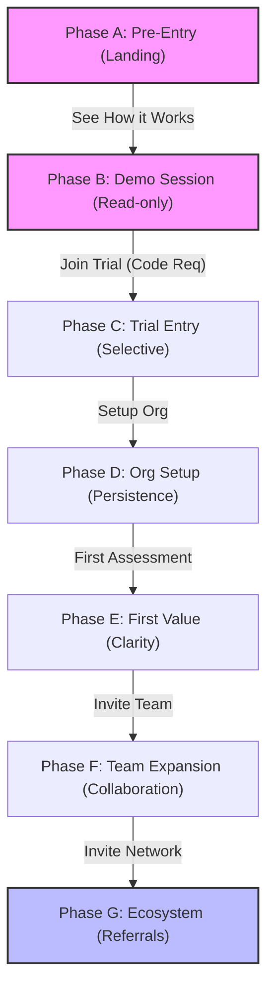

# Consultify Workflow Map

This document visualizes the user journey from initial discovery to ecosystem participation.

## 1. High-Level Flow

## 2. Phase Summaries

| Phase | User State | Primary Action | AI Role |
|-------|------------|----------------|---------|
| **A** | `ANON` | Exploration | Absent |
| **B** | `DEMO_SESSION` | Methods Review | Narrator |
| **C** | `TRIAL_TRUSTED` | Intent Validation | Guide |
| **D** | `ORG_SETUP` | Resource Setup | Memory |
| **E** | `FIRST_VALUE` | Context Input | Partner |
| **F** | `TEAM` | Collaboration | Facilitator |
| **G** | `ECOSYSTEM` | Network Growth | Matchmaker |

## 3. Engagement Loops

### The "Selective Path" (A -> B -> C)
- **Phase A**: No low-quality leads.
- **Phase B**: Low-risk but read-only engagement.
- **Phase C**: High-commitment trial entry via referral codes.

### The "Expansion Path" (D -> E -> F)
- **Phase D**: Transition from individual user to organizational unit.
- **Phase E**: Rapid time-to-clarity.
- **Phase F**: Network effect within the organization.

### The "Network Path" (F -> G)
- **Phase G**: Turning successful users into referrers (Affiliates).
