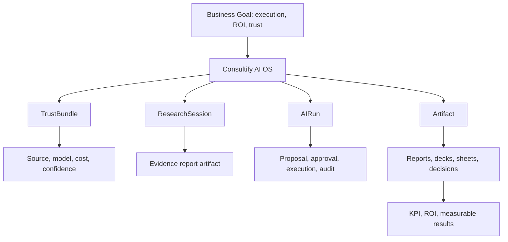

# AI_dev_fin - finalny plan rozwoju AI w Consultify

> Status: dokument nadrzedny / backlog rozwoju AI
> Data utworzenia: 2026-04-25
> Zakres: caly system AI w aplikacji Consultify: chat, Teresa, Anna, deep research, voice, trust, artefakty, agenci, konektory, pamiec organizacyjna i runtime V10.

## 0. Executive summary

Consultify nie ma wygrac jako "kolejny chat AI". Z dokumentacji biznesowej i landing page wynika, ze aplikacja ma byc AI-native consulting execution system: systemem, ktory zamienia wiedze biznesowa, diagnoze i rekomendacje w mierzalna prace, decyzje, artefakty, KPI i ROI.

Obietnica produktu sklada sie z czterech warstw:

1. **Access** - consulting intelligence ma byc dostepna szerzej niz klasyczny consulting premium.
2. **Quality** - AI ma pracowac na kontekscie firmy, frameworkach, evidence i metodologii, a nie na ogolnych promptach.
3. **Trust and control** - AI musi byc bezpieczne dla realnej pracy biznesowej: uprawnienia, audit, source trace, human approval.
4. **Execution and ROI** - system ma prowadzic od zrozumienia i diagnozy do inicjatyw, realizacji, wynikow i proof of impact.

Landing page streszcza to wprost:

- `Consultify AI. All the world's business knowledge. Turned into your profits.`
- `Understanding -> Diagnosis -> Designing initiatives -> Execution -> Results.`
- `One AI system for assistants, prompts, agents, knowledge, and artifact-native work.`

Dlatego finalny program AI musi obejmowac nie tylko chat, ale caly operating model:

```text
Anna/Teresa -> discovery -> diagnosis -> research -> recommendations ->
initiatives -> execution -> artifacts -> KPI/ROI -> learning loop
```

Ten dokument jest nadrzednym backlogiem rozwoju AI. Traktujemy go jako warstwe laczaca:

- cel biznesowy i GTM;
- landing promise;
- benchmark `Softs`;
- realny stan kodu;
- braki techniczne i produktowe;
- roadmap wdrozenia do pelnego AI OS.

## 1. Cel koncowy

Docelowo AI w Consultify ma byc nie tylko czatem, ale workspace-native, governed AI operating system dla pracy konsultingowej.

Oznacza to jeden spojny przeplyw:

```text
wejscie -> zrozumienie kontekstu -> pytanie -> odpowiedz ze zrodlami i trustem ->
propozycja dzialania -> review -> approval -> execution -> artefakt ->
revisit -> pamiec organizacyjna -> mierzalny efekt biznesowy
```

Najwazniejsze zasady:

- AI nie wykonuje istotnych mutacji po cichu.
- User zawsze rozumie, z jakich zrodel korzysta odpowiedz.
- Odpowiedzi oparte o pliki, web, workspace lub org memory wygladaja inaczej niz odpowiedzi ogolne.
- Propozycje, akcje, research i artefakty sa pierwszoklasowymi obiektami, a nie tekstem ukrytym w zwyklej odpowiedzi.
- Kazda wazna akcja ma lifecycle, approval i audit trail.
- AI ma pamietac i uczyc sie tylko w kontrolowany, widoczny i zgodny z uprawnieniami sposob.

### 1A. Docelowa architektura funkcji

Plan spinamy wokol czterech encji centralnych: `TrustBundle`, `ResearchSession`, `AIRun` i `Artifact`.



### 1B. Finalny zakres AI OS

Finalny Consultify AI OS musi obejmowac siedem domen produktowych, zeby aplikacja spelnila obietnice "od rozmowy do wyniku":

| Domena | Co ma robic AI | Glowny runtime |
|---|---|---|
| Rozmowa i doradztwo | odpowiadac, pytac, diagnozowac, tlumaczyc, cytowac | `UnifiedChatPanel`, `TrustBundle` |
| Kontekst organizacji | rozumiec firme, role, projekty, dokumenty, decyzje i ograniczenia | `OrgContext`, `ProjectContext`, org memory |
| Zarzadzanie aplikacja | tworzyc i aktualizowac tabele, raporty, prezentacje, inicjatywy, taski, decyzje | `AIRun`, action proposals, tools |
| Artefakty | tworzyc dokumenty, raporty, decki, arkusze, diagramy, formularze i plany | `Artifact`, `MutationProposal` |
| Role i agenci | pracowac jako CFO, COO, CEO advisor, transformation officer, IT/CISO, consultant, analyst | `AgentCatalog`, persona policy |
| Uczenie i pamiec | uczyc sie preferencji, metodologii, feedbacku i kontekstu tylko za zgoda | `LearningLoop`, `MemoryStewardship` |
| Wynik biznesowy | laczyc prace z KPI, ROI, ryzykiem, decyzjami i raportem dla klienta/inwestora | `OutcomeRuntime`, KPI/ROI ledger |

### 1C. Roznica miedzy "AI podpowiada" i "AI wykonuje"

W produkcie musza istniec trzy poziomy dzialania AI:

1. **Answer** - AI tylko odpowiada, cytuje zrodla i wyjasnia reasoning.
2. **Suggest** - AI proponuje dokument, inicjatywe, task, zmiane, raport albo deck, ale niczego nie zapisuje bez decyzji usera.
3. **Act** - AI wykonuje akcje w aplikacji lub narzedziu dopiero po approval, z `AIRun`, audytem, rollback path i widocznym wynikiem.

Regula bazowa:

```text
no hidden writes, no hidden learning, no hidden connector access
```

## 2. Programy AI: V8, V9, V10

### V8 - fundament produktu AI/chat

V8 definiuje glowny kontrakt AI w aplikacji:

- jeden kanoniczny shell czatu: `UnifiedChatPanel`;
- full chat i split chat jako jeden produkt;
- historia rozmow jako biblioteka: recent, pinned, folders, archived, search, revisit;
- streaming AI: chunk, stop, retry, errors, citations, thinking, proposals, policy metadata;
- source model: general, conversation history, workspace, attachments, web/research, org memory;
- local file ingest i URL ingest;
- web search i Deep Thinking / Deep Research;
- private mode, custom instructions, user memory i organizational memory;
- model/tier selection;
- co-thinker/persona i multi-agent decision room;
- trust contract: citations, source class, model, cost, tokens, confidence, routing trace, warnings;
- response classes: general, workspace-grounded, attachment-grounded, research, proposal, action-carrying, artifact-oriented, rich structured;
- AI actions/proposals: `proposed -> pending_review -> approved/rejected -> executed/closed -> audited`;
- `execution_proposal` jako first-class message type;
- save-to-artifact: notes, ideas, decisions, tasks, reports, slides;
- artifact runtime: diff preview, approve, commit, audit;
- voice: dictation, voice conversation, TTS, jeden state machine;
- governance: no silent execution, audit trail, feedback loop, prompt governance.

### V9 - warstwa UX, operacyjna i stabilizacyjna

V9 jest waska paczka funkcji, ktore maja realny kod i flagi:

- voice legend, shortcut `Alt+Shift+V`, copy legend, voice unavailable fallback;
- barge-in toast i voice funnel telemetry;
- private mode details popover;
- trust badge pod odpowiedziami AI;
- humanizacja nazwy modelu w trust badge;
- copy citations, copy reasoning;
- klikalne citation links i domain pill;
- "Why this answer?" reasoning snippet;
- PII heuristic toast i session dismiss;
- next-message model hint chip;
- input character counter;
- input keyboard hint strip;
- input soft-limit toast;
- back-to-chat button i shortcut `Alt+Shift+C`;
- workspace breadcrumb i recent conversations dropdown;
- admin V9 flags panel: role gate, reset, filter, grouping, copy snapshot, copy override URL, row shortcuts.

### V10 - docelowy runtime AI OS

V10 jest wieksza paczka runtime'ow i modeli. W obecnym checkoutcie `feat/ai-chat-v9` nie ma plikow `server/src/routes/v10`, `server/src/services/v10`, `src/hooks/v10` ani `src/components/v10`. Istnieje jednak commit `a336e4e32 feat(v10): ship runtime workspace and rollout wiring`, ktory zawieral docelowy szkielet.

V10 dzieli AI na 8 blokow:

- `reasoning` - intent classification, reasoning router, workload routing, plan depth, self-check, trust bundle;
- `learning` - feedback capture, self-learning loop, consent, memory stewardship, quality dashboard;
- `agent_runtime` - `ExecutionProposalV1`, Run Ledger, severity policies, schedules, swarm, user interrupts;
- `research` - research mission, scope contract, evidence graph, watch delta, report artifact;
- `artifact` - unified Artifact model, mutation proposals, lineage, review state, exports;
- `connectors` - enterprise integrations, OAuth/session runtime, ACL-aware source search/read, freshness;
- `outcome` - KPI, ROI, business effect, acceptance contracts, investor-grade reporting;
- `onboarding` - persona-aware onboarding, trust-first disclosure, activation SLA.

## 2A. Business goal alignment

### 2A.1 Kategoria produktu

Z dokumentacji marketingowej wynika kategoria:

```text
AI-native consulting execution system
```

Nie sprzedajemy samego AI. Sprzedajemy system, ktory:

- redukuje chaos transformacji;
- daje jeden obraz programu;
- laczy decyzje, inicjatywy, zadania, KPI i raporty;
- tworzy proof of impact;
- zachowuje kontrola security i danych;
- pozwala konsultantom i partnerom skalowac delivery bez liniowego zwiekszania zespolu.

### 2A.2 Obietnica biznesowa -> wymagane capability AI

| Obietnica biznesowa | Co musi umiec AI | Minimalny produktowy dowod |
|---|---|---|
| Dostep do wiedzy konsultingowej | Product/org knowledge, framework retrieval, curated methodology memory | AI odpowiada z zatwierdzonych zrodel, nie z losowego web |
| Zrozumienie firmy | Interview context, org profile, workspace context, memory | AI umie strescic kontekst organizacji i wykorzystac go w rekomendacji |
| Diagnoza | Assessment reasoning, evidence map, maturity analysis, gap analysis | AI generuje diagnoze z cytowanymi dowodami i zalozeniami |
| Projektowanie inicjatyw | Initiative generator, prioritization, roadmap, owner/dependency model | AI proponuje inicjatywy z celem, wlascicielem, ryzykiem i KPI |
| Realizacja | Action proposals, tasks, run ledger, follow-through agents | AI tworzy proposal, user zatwierdza, system zapisuje audit |
| ROI i proof | KPI baseline, target, benefit tracking, ROI model | AI laczy inicjatywe z metryka i efektem biznesowym |
| Security/control | Trust bundle, ACL, source trace, private mode, policy gateway | User i admin widza, co AI uzylo i dlaczego |
| Skalowanie consultingu | Agent catalog, templates, artifacts, partner workflows | Partner/konsultant dostaje powtarzalny output, nie tylko rozmowe |

### 2A.3 Czego nie wolno obiecywac przed domknieciem runtime

- Pelnej autonomii AI bez human approval.
- Enterprise connectors bez ACL/freshness/source trace.
- Deep Research jako resumable workflow, dopoki nie ma `ResearchSession`.
- Pelnego voice conversation, dopoki Teresa/Anna voice nie maja server-side config i jasnego error state.
- "AI uczy sie samo", dopoki learning loop nie ma consent, stewardship i audit.
- ROI proof, dopoki nie ma baseline, KPI ownera i acceptance contract.

## 2B. Landing promise -> AI capabilities

### 2B.1 `Consultify AI. All the world's business knowledge. Turned into your profits.`

Wymagane capability:

- curated business knowledge base;
- product knowledge vs web research separation;
- enterprise search i org memory;
- reasoning router, ktory wybiera fast chat / research / action / artifact;
- outcome runtime: KPI, ROI, business effect summary;
- trust bundle z model/source/cost/confidence.

### 2B.2 `Understanding -> Diagnosis -> Designing initiatives -> Execution -> Results`

Wymagane capability:

- `Understanding`: interview ingestion, org profile, context snapshot, memory scope;
- `Diagnosis`: assessment analysis, evidence ledger, benchmark, gap analysis;
- `Designing initiatives`: initiative proposals, prioritization, roadmap, RACI, assumptions;
- `Execution`: tasks, approvals, run ledger, escalation, follow-through agents;
- `Results`: KPI tracking, ROI model, reporting, learning loop.

### 2B.3 `One AI system for assistants, prompts, agents, knowledge, and artifact-native work`

Wymagane capability:

- Anna jako public product assistant;
- Teresa jako tenant/workspace assistant;
- prompt governance i release management;
- agent catalog;
- policy-aware knowledge and memory;
- artifact runtime dla docs, reports, decks, sheets, decisions;
- audit viewer i admin AI ops.

## 2C. Benchmark Softs -> wymagania dla Consultify

Benchmark `Softs` nie jest lista UI do skopiowania. To mapa wzorcow capability.

| Referencja z `Softs` | Wzorzec capability | Co to znaczy dla Consultify |
|---|---|---|
| ChatGPT / Claude / KIMI | Prosty core chat, predictable streaming, projekty/folders, file-heavy work | Jeden szybki chat, historia jako biblioteka, projekty kontekstowe, pliki jako pierwszoklasowe zrodla |
| Perplexity / KIMI Deep Research | Evidence-led answers, citations, long-form research | `ResearchSession`, evidence graph, final report artifact, source confidence |
| KIMI Agent / Agent Swarm / Kimi Claw | Agenci, swarm, always-on jobs | `AIRun`, scheduled agents, swarm research, background queue |
| KIMI Docs / Sheets / Slides / Websites | Artifact-native AI | Docs/sheets/slides/reports jako artefakty z diff, approval, export |
| Notion / Evernote | AI w dokumencie i knowledge graph | Notebook/doc editor z AI blocks, summaries, slash commands, page Q&A |
| Gamma / Beautiful.ai / Pitch | Generatywne decki i prezentacje | Chat -> client-ready deck, template, slide narrative, export |
| ClickUp / Linear / Monday | AI w taskach i follow-up | Chat -> proposal -> task/initiative -> owner/deadline/status |
| Atlassian / Intercom / Zendesk | Enterprise KB z ACL i freshness | Org memory, support/product KB, permissioned retrieval, freshness labels |
| Palantir AIP / Foundry | Ontology, typed tools, approvals, audit na danych operacyjnych | Business ontology, governed actions, typed tools, audit viewer |
| LangChain / CrewAI / OpenAI agents | Routing, tool calling, orchestration, structured outputs | Reasoning router, tool registry, agent catalog, output schemas |
| Liveblocks / Miro / Whiteboard | Collaboration over artifacts/canvas | Multi-user artifact editing, comments, annotations, shared context |
| KPI / finance / tables references | Analytical AI nad danymi | KPI analyst, finance/sheets agent, ROI model, anomaly/forecast explanations |

### 2C.1 Benchmark gap summary

Consultify ma przewage, jesli polaczy trzy rzeczy, ktore u konkurencji zwykle sa osobno:

```text
AI assistant + governed execution + measurable business outcome
```

Najwiekszy brak wzgledem benchmarku to nie "ladniejszy chat", tylko brak wspolnego runtime dla:

- research sessions;
- agent runs;
- artifact mutations;
- connector retrieval;
- outcome/ROI loop;
- audit/trust.

## 2D. Persona proof map

AI musi dawac inny dowod wartosci dla kazdej persony zakupowej.

| Persona | Co kupuje naprawde | Wymagany dowod AI | Funkcje do domkniecia |
|---|---|---|---|
| Owner | wartosc firmy, przewaga, mniejsza zaleznosc od ludzi | executive roadmap, value levers, risk map | ResearchSession, outcome runtime, executive reports |
| CEO | tempo, priorytety, jeden obraz programu | strategic brief, decision options, initiative portfolio | decision agent, initiative proposals, project room |
| CFO | ROI, governance, persistence | baseline, KPI owner, ROI model, budget impact | KPI/ROI runtime, acceptance contracts, finance agent |
| COO | mniej chaosu, bottlenecks, execution visibility | operating dashboard, blockers, owners, deadlines | AIRun, follow-through agents, escalation |
| Transformation Officer | single source of truth dla programu | roadmap, dependencies, status, steering summary | project room, artifact runtime, reports |
| IT / CISO | security, data flow, control | source trace, retention, DPA/subprocessor clarity | trust bundle, connectors ACL, AI ops, audit |
| Consulting partner | leverage, margin, repeatability | reusable methodology, artifacts, white-label outputs | agent catalog, templates, partner workspace |
| Investor | moat, scalability, category proof | methodology + system + learning loop + traction metrics | learning loop, outcome runtime, AI ops metrics |

## 2E. Full AI capability catalogue

### 2E.1 Assistants

- Anna public product assistant.
- Teresa tenant/workspace assistant.
- Role-specific copilots: CFO, COO, Transformation, IT/CISO, partner.
- Contextual help assistant for product navigation.

### 2E.2 Reasoning and routing

- Intent classification.
- Workload class routing: fast chat, research, action, artifact, connector, voice, background.
- Model/tier/cost routing.
- Self-check and answer repair.
- Structured output schemas.

### 2E.3 Knowledge and retrieval

- Product truth KB.
- Org memory.
- Workspace context.
- Attachments and URL ingest.
- Web research.
- Enterprise connectors.
- ACL, freshness, data residency and source class labels.

### 2E.4 Research

- Deep Research confirm gate.
- Research planning.
- Evidence graph.
- Source confidence and contradiction handling.
- Long-running research sessions.
- Research report artifacts.

### 2E.5 Actions and execution

- Execution proposals.
- Approve/reject/execute separation.
- Run ledger.
- Severity policies.
- Interrupt verbs.
- Action center.
- Audit viewer.

### 2E.6 Artifacts and outputs

- Notes, decisions, tasks, initiatives.
- Reports, presentations, spreadsheets, decks.
- Diff preview and mutation proposals.
- Version lineage.
- Export manifest.
- Provenance footer.

### 2E.7 Outcome and ROI

- KPI baseline and target.
- ROI model.
- Business effect summary.
- Initiative-to-KPI linkage.
- Client/investor-ready reporting.

### 2E.8 Learning and operations

- Feedback capture.
- Stewardship queue.
- Memory mutation approval.
- Quality dashboard.
- Golden prompts and evals.
- Provider health, budget and cost ops.

### 2E.9 Voice and multimodal

- Dictation.
- Teresa/Anna live voice.
- TTS/auto-read.
- Voice state machine.
- Clear unavailable/error state.
- Future image/document/canvas multimodal boundaries.

## 2F. Net audit - market baseline 2026

Audyt web wskazuje, ze aktualny rynek nie konkuruje juz samym modelem. Najsilniejsze produkty lacza model z workspace, projektami, pamiecia, connectorami, artefaktami, agentami, approval i observability.

| Benchmark web | Wzorzec rynkowy | Wniosek dla Consultify |
|---|---|---|
| OpenAI / ChatGPT | deep research, projects, memory, canvas, apps/connectors, agent mode, files, voice | Consultify musi miec `ResearchSession`, project context, memory governance, artifact runtime i workload router |
| Anthropic / Claude | Projects, Artifacts, connectors/MCP, long-context docs, shared project knowledge | Potrzebny project room, artifact library, connector policy, role/project instructions |
| Palantir AIP | ontology, typed tools, action logs, approval, observability, least-privilege | V10 musi miec business ontology, `AIRun`, action log, audit viewer i permissioned tools |
| Notion AI | enterprise search, AI connectors, meeting notes, permission-aware retrieval | Org memory i connectors musza respektowac ACL, freshness, source scope i admin setup |
| Perplexity-style research | cited answers, source scope, research reports | Trust bundle i evidence graph sa P0, nie UX nice-to-have |
| Gamma / deck tools | prompt-to-deck, client-ready visual outputs | Artifact runtime musi obejmowac deck/report exports, nie tylko markdown |
| ClickUp / Linear / Monday | AI embedded in project/task execution | Chat musi przechodzic w proposal -> task/initiative -> owner -> deadline -> KPI |

### 2F.1 Market capability minimum

Minimum rynkowe przed powazna implementacja:

- project/workspace context, nie tylko global chat history;
- permission-aware enterprise search;
- background research with final artifact;
- editable artifacts with share/export;
- tool/action execution with approval and audit;
- connector admin and source scope;
- memory settings, consent and stewardship;
- cost/budget visibility;
- incident/observability for AI runs.

## 2G. Softs audit - rozszerzone kategorie benchmarku

`Softs` jest szersze niz obecna tabela 2C. Poza chatem, agentami, KB, projektami, prezentacjami, KPI i Palantirem zawiera dodatkowe kategorie, ktore powinny wejsc do planu jako osobne wzorce.

| Kategoria w `Softs` | Przyklady | Capability do dopisania / utrzymania w planie |
|---|---|---|
| Ankiety / VoC | Qualtrics, SurveyMonkey, Typeform | survey ingestion, VoC analysis, quantified customer insight, survey artifact |
| Kalendarz / scheduling | CalDAV, Google Calendar, Microsoft Graph, Outlook | calendar as source, deadline constraint, scheduled agents, meeting prep/follow-up |
| iPaaS / synchronizacja | Boomi, Workato, Mulesoft | connector runtime as enterprise data pipe, sync status, retry, freshness, error handling |
| No-code tables/apps | Airtable, Coda | table artifact, lightweight app artifact, views/forms, structured business records |
| Diagramy | Lucid, Mermaid | process maps, architecture diagrams, transformation blueprint, diagram artifact |
| Whiteboard/canvas | Miro, Excalidraw, tldraw | collaborative canvas, workshop capture, sticky-note clustering, canvas-to-plan |
| Realtime collaboration | Liveblocks | multi-user artifact editing, comments, presence, conflict handling |
| BI / OKR / KPI | Quantive, Databox, Looker, Perdoo, Workboard, Tableau | KPI source connectors, OKR linkage, metric freshness, outcome reporting |
| Financial planning | Anaplan, finance references | scenario planning, budget model, ROI sensitivity, CFO artifact |
| Prompt/RAG stack | LlamaIndex, Perplexity, prompt guides | prompt governance, retrieval policy, evidence ranking, source class contracts |
| Dev/sandbox agents | Replit, agent/dev references | safe sandbox, tool testing, deploy/run boundaries, generated app artifacts |
| Partner programs | HubSpot, Dropbox, DigitalOcean | GTM/partner motion, partner proof pack, integration marketplace path |

### 2G.1 Softs additions that are missing or too implicit

Do dopisania do backlogu jako jawne capability:

1. **VoC / survey intelligence** - ankiety i customer feedback jako first-class research source.
2. **Calendar-aware AI** - meeting prep, follow-up, deadlines, scheduled research and scheduled agents.
3. **iPaaS-grade connector ops** - connector health, retry, sync logs, freshness SLA.
4. **No-code table app artifacts** - nie tylko spreadsheets, ale business records, forms and views.
5. **Structured diagrams** - process maps, transformation maps, architecture diagrams as artifacts.
6. **Workshop canvas** - whiteboard import, clustering, decision extraction and artifact conversion.
7. **Financial scenario runtime** - Anaplan-style planning, ROI sensitivity and CFO proof.

## 2H. V8 parity audit - missing traceability before implementation

`AI_dev_fin.md` opisuje V8 funkcjonalnie, ale przed implementacja potrzebna jest jawna mapa zgodnosci z `docs/plans/CHAT_V8_AI_PARITY_AUDIT.md`. Bez tego latwo zaczac od V10, pomijajac twarde prerekwizyty V8.

### 2H.1 Required V8 traceability matrix

| V8 audit area | Status w planie | Co trzeba dopisac do wykonania |
|---|---|---|
| Single shell / route unification | Czesciowe | `/chat` i split chat musza isc przez `UnifiedChatPanel`; legacy shell ma plan dekomisji |
| `execution_proposal` message type | Czesciowe | DB/API/UI vocabulary: `pending_review`, `approved`, `rejected`, `executed`, `audited` |
| Three AI surfaces | Czesciowe | help assistant vs workspace copilot vs governed execution assistant, z osobnym data/tool scope |
| Cloud OAuth honesty | Slabe/czesciowe | provider status: supported, settings-only, not supported; brak fake connect UX |
| Prompt governance / composer | Czesciowe | precedence: base persona -> governance -> co-thinker -> retrieval -> style |
| Control surface registry | Czesciowe | canonical / partial / legacy controls; link do V8 control surface spec |
| R1-R25 requirements | Brak jawnej macierzy | R1-R25 -> etap -> owner -> DoD -> test |
| Wave A/B/C roadmap | Brak jawnej translacji | Wave A/B/C -> Etap 0-12 w tym dokumencie |

### 2H.2 Mandatory pre-V10 rule

Nie zaczynac pelnej implementacji V10 runtime, dopoki nie ma decyzji dla:

- single shell;
- message type and action lifecycle vocabulary;
- trust/source contract;
- research session boundary;
- Teresa/Anna surface separation;
- legacy controls deprecation.

## 2I. Final capability map - elementy wymagane przez produkt

Ta sekcja jest lista kontrolna dla pelnego AI OS. Kazdy element musi miec status `live`, `partial`, `planned`, `blocked` albo `out_of_scope` przed rozpoczeciem implementacji.

### 2I.1 Zarzadzanie aplikacja i wykonywanie prac na narzedziach

AI ma umiec inicjowac, przygotowywac i po zatwierdzeniu wykonywac prace w aplikacji:

- tworzenie i aktualizacja inicjatyw;
- tworzenie taskow, ownerow, deadline, statusow i zaleznosci;
- przygotowanie raportow i executive summaries;
- tworzenie prezentacji/deckow dla klienta, zarzadu i inwestora;
- tworzenie tabel, arkuszy, KPI tables, financial scenarios i no-code table views;
- tworzenie diagramow, process maps, transformation maps i architecture blueprints;
- przygotowanie meeting notes, follow-up, risk log i decision log;
- wprowadzanie zmian do artefaktow przez `MutationProposal`;
- wykonywanie akcji tylko przez `AIRun` z approval i audit.

Minimalny kontrakt:

```text
user intent -> AI proposal -> preview/diff -> approval -> AIRun -> result -> audit -> artifact/update
```

### 2I.2 Kontekst organizacji, projektow i osoby

AI ma rozmawiac w kontekscie:

- organizacji: profil firmy, branza, cele, ograniczenia, struktura, systemy, polityki;
- projektu: cele, scope, timeline, decyzje, dokumenty, uczestnicy, ryzyka, status;
- osoby: rola, uprawnienia, preferencje, historia pracy, zadania, styl komunikacji;
- zespolu: ownerzy, zaleznosci, odpowiedzialnosci, eskalacje;
- workspace: pliki, rozmowy, artefakty, taski, raporty, decyzje, KPI.

Wymagane encje:

- `OrgContextSnapshot` - aktualny, wersjonowany obraz organizacji.
- `ProjectContextSnapshot` - aktualny, wersjonowany obraz projektu.
- `UserWorkProfile` - rola, preferencje, permission scope, aktywne zadania.
- `ContextLedger` - zrodla uzyte do odpowiedzi lub akcji.

### 2I.3 Wypelnianie dokumentow i podpowiedzi

AI ma pomagac w pracy na dokumentach:

- wypelnianie szablonow: brief, assessment, business case, risk log, decision memo, steering report;
- podpowiadanie brakujacych danych i pytan doprecyzowujacych;
- wykrywanie sprzecznosci i luk;
- sugerowanie kolejnych krokow;
- generowanie wersji roboczej i wariantow;
- oznaczanie zalozen, ryzyk, zrodel i pewnosci;
- zapisywanie wyniku jako artifact z wersja i provenance.

Regula: dokument moze zostac zaproponowany automatycznie, ale zapis/commit wymaga jawnego zatwierdzenia, jesli zmienia stan workspace.

### 2I.4 Role, persony i agenci

AI ma umiec przejmowac role, ale w kontrolowany sposob:

| Rola | Zakres | Output |
|---|---|---|
| CEO advisor | priorytety, strategia, decyzje, trade-offs | executive brief, decision memo |
| CFO agent | ROI, budzet, scenariusze, ryzyko finansowe | financial model, KPI/ROI report |
| COO agent | operacje, bottlenecks, owners, escalation | operating plan, blocker report |
| Transformation officer | roadmapa, zaleznosci, status programu | transformation roadmap |
| IT/CISO agent | security, compliance, data flow, access | security pack, risk register |
| Consultant agent | discovery, diagnosis, recommendations | client-ready report |
| Research agent | evidence, benchmark, web/org research | research report artifact |
| Docs/decks/sheets agents | artefakty biznesowe | docs, deck, spreadsheet |
| Governance agent | audit, policy, approval, risk | governance review |

Kazda rola musi miec:

- prompt/persona;
- tool scope;
- source scope;
- output schema;
- approval policy;
- telemetry;
- tests and golden prompts.

### 2I.5 Samouczenie Anny i Teresy

Anna i Teresa nie moga "uczyc sie po cichu". Wymagany jest kontrolowany learning loop:

```text
feedback / observation -> learning candidate -> preview -> consent/admin review ->
retained or rejected -> memory update -> audit -> future use with source label
```

Wymagane statusy:

- `captured` - feedback lub obserwacja zostala zebrana;
- `candidate` - system proponuje zapamietanie;
- `approved` - user/admin zgodzil sie na zapis;
- `rejected` - odrzucono;
- `retained` - zapisano w pamieci;
- `applied` - uzyto w przyszlej odpowiedzi lub akcji;
- `expired` - wygaslo zgodnie z retention policy.

Anna:

- uczy sie publicznych pytan produktowych, obiekcji, jezyka klientow i FAQ;
- nie zapisuje danych tenantowych;
- ma oddzielny public product memory i release-approved knowledge base.

Teresa:

- uczy sie kontekstu organizacji, preferencji workspace, decyzji, stylu pracy i wzorcow wykonania;
- dziala tylko w granicach uprawnien usera i tenant policy;
- kazdy zapis do org memory ma stewarda, scope i audit.

### 2I.6 Podpowiedzi proaktywne

AI ma nie tylko odpowiadac, ale tez podpowiadac:

- brakujace informacje w dokumencie;
- ryzyka i niespojnosci;
- kolejne kroki;
- deadline/follow-up;
- potrzebne approval;
- nieaktualne zrodla;
- przekroczony budzet AI;
- mozliwe KPI i ROI dla inicjatywy.

Podpowiedzi proaktywne nie moga byc nachalne. Musza miec severity, source i opcje dismiss/snooze.

## 3. Co juz mamy w kodzie

### 3.1 Chat i streaming

Mamy realny streaming AI:

- `src/hooks/useAIStream.ts` obsluguje streaming, retry, abort, citations, policy notices, source ledger, deep thinking state, agent audit sources, Teresa proposal i artifact stripping.
- `server/src/routes/ai.routes.ts` jest centralnym runtime endpointem dla chat stream, policy gateway, citations, web/research, attachments i Deep Thinking.

Stan: mocna baza, ale za duzo logiki jest skupione w jednym route handlerze.

### 3.2 Cytowania i source rendering

Mamy:

- `src/components/AIChat/MessageRenderer.tsx` - inline `[1]`, `[2]` jako klikalne markery;
- `src/components/AIChat/CitationList.tsx` - lista zrodel, sanitizacja tytulow, ukrywanie technicznych nazw typu `rag_1` i `Source 1`;
- `server/src/services/ai/citationExtractor.ts` - ekstrakcja cytowan;
- testy dla source/citation behavior.

Stan: realne, ale niepelne jako enterprise trust. Brakuje jednego kanonicznego trust bundle.

### 3.3 Product knowledge: DBR77 / Consultify / Marketplace

Mamy:

- `server/src/services/ai/chatStabilizationPolicy.ts` - fallback produktowy dla Consultify, feedbacku, marketplace i pytan "jak dodac element";
- poprawki commitowe dla Anna/Teresa DBR77 portfolio knowledge retrieval;
- `server/src/services/ai/annaKnowledgeService.ts`;
- `server/src/services/ai/virtualWorkerKnowledgeService.ts`;
- testy `ai-chat-stabilization-policy`, `ai-dbr77-knowledge-policy`.

Stan: realne, ale nadal trzeba rozdzielic product truth od web research jako formalny source class.

### 3.4 Attachments i analiza dokumentow

Mamy:

- endpoint ingest plikow w `server/src/routes/ai.routes.ts`;
- test `tests/integration/ai/ai-attachments-ingest.test.ts`;
- status `PDF_TEXT_EXTRACTION_FAILED` i `ocr_required_or_unreadable` dla trudnych PDF;
- attachment citations emitowane do streamu.

Stan: realne dla podstawowych plikow, ale brakuje pelnego OCR pipeline, preview zrodel i konsekwentnego UI statusu ingest.

### 3.5 Deep Thinking / Research

Mamy:

- confirm gate dla Deep Thinking;
- `server/src/services/ai/deepThinkingOrchestrator.ts`;
- metryki i eventy Deep Thinking;
- self-check i quality hooks w `ai.routes.ts`;
- UI state w `useAIStream.ts`.

Stan: czesciowe. To jest nadal tryb streamingu, a nie pelna `research_session` z kolejka, resume, retry, cancel i report artifact.

### 3.6 Teresa / Anna

Mamy:

- `server/src/services/v8/teresaCopilotService.ts` - Teresa proposal lifecycle, target modules, audit trail, no silent writes;
- `server/src/routes/v8/teresa.routes.ts`;
- `src/contexts/TeresaVoiceContext.tsx`;
- `src/hooks/useTeresaVoice.ts`;
- `src/components/AIChat/VoiceConversationOverlay.tsx`;
- public Anna retrieval i DBR77 product knowledge improvements.

Stan: Teresa proposal runtime jest mocny koncepcyjnie, ale voice jest kruche bez V10 `/api/v10/teresa/voice-config`.

### 3.7 Voice / STT / TTS

Mamy:

- `src/hooks/useUniversalVoice.ts` dla voice/dictation/TTS pieces;
- `src/hooks/useTeresaVoice.ts` dla Gemini Live realtime voice;
- `VoiceModeLegend`, `VoiceLegendShortcut`, `VoiceConversationOverlay`;
- telemetry VM10 dla voice funnel.

Problem:

- obecny `useTeresaVoice.ts` probuje czytac `process.env.NEXT_PUBLIC_GEMINI_API_KEY`, `process.env.GEMINI_API_KEY`, `process.env.API_KEY` po stronie frontendu. To jest zle dopasowane do Vite i moze powodowac "martwy" przycisk voice.
- V10 mial rozwiazac to przez server route `/api/v10/teresa/voice-config`, ale tej paczki nie ma w aktualnym branchu.

Stan: czesciowe / wysokie ryzyko UX.

### 3.8 AI actions, proposals, approvals

Mamy:

- `src/components/AIChat/ExecutionProposalMessage.tsx`;
- `server/src/services/v8/chatExecutionService.ts`;
- `server/src/services/v8/teresaCopilotService.ts`;
- typy proposal/lifecycle w `src/types` i `server/src/types`;
- `execution_proposal`, `execution_progress`, `execution_result` jako rodzina message type w UI.

Stan: czesciowe. UI i service istnieja, ale klasyfikacja intencji w `chatExecutionService.ts` jest heurystycznym stubem, nie pelnym reasoning routerem. Brakuje centralnego action center i run ledger.

### 3.9 Artefakty i structured output

Mamy:

- `StructuredOutputBlock`;
- artifact stripping w `useAIStream.ts`;
- `V8ArtifactRunControl`;
- czesc modeli i store dla artefaktow.

Stan: czesciowe. Brakuje unified `Artifact` runtime z wersjami, mutation proposal, diff/approve/commit, provenance footer i export manifest.

### 3.10 Admin / governance / flags

Mamy:

- V9 flag registry;
- admin flags panel;
- role gating;
- telemetry contract dla V9;
- policy notices i policy refusal rendering;
- czesc AI settings.

Stan: dobre operacyjnie dla V9, ale brakuje AI ops dashboardu, evals, release gates, model routing policy i centralnego audit viewer.

### 3.11 Business capability state matrix

| Capability biznesowe | Stan obecny | Najwiekszy brak | Priorytet |
|---|---|---|---|
| Public product guidance | Czesciowe | Anna ma voice/frontend key risk i niepelny product proof loop | P1 |
| Tenant workspace assistant | Czesciowe | Teresa nie ma pelnego V10 voice config i action center | P0 |
| Consulting diagnosis | Czesciowe | Brak formalnego evidence graph i diagnosis artifact | P1 |
| Initiative design | Czesciowe | Brak unified proposal -> initiative -> KPI contract | P1 |
| Execution governance | Czesciowe | Brak `AIRun`, run ledger i audit viewer | P0 |
| ROI proof | Slabe/czesciowe | Brak outcome runtime, baseline, acceptance contract | P1 |
| Enterprise trust | Czesciowe | Brak `TrustBundleV1`, CISO-ready trace i retention view | P0 |
| Artifact-native outputs | Czesciowe | Brak unified `Artifact`, mutation proposal i version lineage | P0 |
| Enterprise retrieval | Czesciowe | Brak connector runtime, ACL/freshness/source admin | P1 |
| AI ops | Czesciowe | Brak eval dashboard, provider health, rollout gates | P1 |
| Partner leverage | Slabe/czesciowe | Brak agent catalog, templates i white-label output workflow | P2 |
| Investor moat proof | Slabe/czesciowe | Brak learning loop metrics i outcome evidence | P2 |

## 4. Czego jeszcze nie mamy

### P0 - braki krytyczne

1. Brak V10 runtime w aktualnym branchu.
   - Brakuje `/api/v10`.
   - Brakuje `server/src/services/v10/*`.
   - Brakuje `src/hooks/v10/*`.
   - Brakuje `src/components/v10/V10RuntimeWorkspace.tsx`.
   - Brakuje `ChatV10RuntimesPanel`.

2. Brak jednego kanonicznego trust bundle.
   - Potrzebny jeden obiekt per odpowiedz: sources, source classes, model, tier, tokens, cost, confidence, routing trace, safety warnings, policy notices.
   - Obecnie te dane sa rozproszone.

3. Brak first-class `ResearchSession`.
   - Deep Research musi byc zadaniem z lifecycle: planned, approved, running, paused, completed, archived.
   - Potrzebne resume, retry, cancel, progress, watch delta, final report artifact.

4. Brak pelnego `AIRun` / Run Ledger.
   - Kazdy agent/research/action powinien miec run id, owner, trigger, scope, status, events, audit, errors, output refs.

5. Brak unified `Artifact` runtime.
   - Potrzebne artifact types, versions, lineage, mutation proposals, review state, export manifest, provenance footer.

6. Brak centralnego action center / audit viewer.
   - User i admin musza widziec: co AI zaproponowalo, co zatwierdzono, co wykonano, co odrzucono i dlaczego.

7. Brak server-side Teresa voice config w aktualnym branchu.
   - Bez tego voice moze wygladac jak no-op.

### P1 - braki wysokiej waznosci

1. Org memory jako prawdziwy retrieval source.
   - ACL, freshness, admin surface, permissions, tenant isolation tests.

2. Enterprise connectors.
   - OAuth/session runtime, connector registry, source search/read, token refresh, disconnect, freshness SLO.

3. Reasoning router.
   - Klasyfikacja: fast chat vs deep research vs governed action vs artifact creation vs connector retrieval.
   - Obecny heuristic stub trzeba zastapic runtime routerem.

4. Feedback/self-learning loop.
   - User/admin-visible feedback status: captured, retained, rejected, applied.
   - Stewardship queue i quality dashboard.

5. Workload classes i SLA.
   - `fast_chat`, `deep_research`, `long_job`, `background`, `voice`, `governed_execution`.
   - Kazdy z osobnym modelem, budzetem, timeoutem i telemetry.

6. Agent catalog.
   - Docs agent, sheets agent, slides agent, reports agent, research agent, decision agent, execution agent, governance agent.

7. Output quality gates.
   - Evals, golden prompts, AI chat stabilization matrix jako stale CI/smoke gate.

### P2 - braki rozwojowe

1. Realtime collaboration nad artefaktami.
2. AI-native project room.
3. Scheduled/always-on agents.
4. Investor-grade outcome reporting.
5. Persona-aware onboarding z aktywacja w 5 minut.
6. Cross-module follow-through agents: SLA, owner, deadline, escalation.

### P0/P1 - braki biznesowe i GTM

1. Brak mapy `persona -> AI proof -> demo script`.
   - Sales i landing obiecuja wartosc dla Owner/CEO/CFO/COO/IT, ale AI backlog nie ma jeszcze gotowych proof paths.

2. Brak pilot KPI pack.
   - Potrzebny zestaw: baseline, target, proof, acceptance criteria, export dla klienta.

3. Brak CISO-ready AI security package.
   - Potrzebne: data flow, retention, subprocessors, prompt/output logging, connector ACL, model routing disclosure.

4. Brak investor moat metrics.
   - Potrzebne: reuse of methodology, learning loop adoption, artifact output volume, time-to-output, ROI proof rate.

5. Brak komercyjnego modelu AI capability.
   - AI budget istnieje w produkcie, ale roadmap musi rozdzielic: free/public Anna, tenant Teresa, premium research, connectors, scheduled agents, outcome reports.

6. Brak partner delivery pack.
   - Partnerzy potrzebuja white-label outputs, reusable templates, agent workflows i governance story.

### P0/P1 - braki odkryte w audycie web + Softs

1. Brak `SurveyIntelligence` / VoC runtime.
   - `Softs` zawiera Qualtrics, SurveyMonkey i Typeform, ale plan nie mial osobnego survey/customer feedback source.
   - Potrzebne: survey ingest, response clustering, quantified insight, segment comparison, VoC artifact.

2. Brak calendar-aware AI jako formalnego source/constraint.
   - Kalendarz jest niezbedny dla meeting prep, follow-up, deadlines, scheduled agents i accountability.
   - Potrzebne: calendar source class, time constraints, follow-up proposals, meeting summary -> tasks.

3. Brak iPaaS-grade connector operations.
   - Enterprise connectors musza miec nie tylko OAuth, ale tez sync jobs, retries, freshness, failure state, admin logs.
   - Wzorcem sa Boomi/Workato/Mulesoft oraz Notion/Claude connector admin.

4. Brak no-code table/app artifact.
   - Airtable/Coda sugeruja artefakty tabelaryczne z widokami, formularzami i rekordami, nie tylko spreadsheet export.

5. Brak diagram/process-map artifact.
   - Lucid/Mermaid/Miro/tldraw sugeruja, ze AI powinno tworzyc procesy, blueprinty i mapy transformacji jako edytowalne artefakty.

6. Brak explicit V8 parity traceability.
   - Plan musi miec R1-R25 -> etap -> owner -> DoD -> test, inaczej V10 moze przykryc niedomkniety fundament V8.

7. Brak landing/product honesty matrix.
   - Kazda obietnica landing page powinna miec status: `live`, `partial`, `planned`, `not_available`.

## 5. Backlog rozwoju

### Etap -1 - kompletacja planu i audyt gotowosci

Cel: zanim zaczniemy implementacje, zamknac luki planistyczne wynikajace z V8 audit, web audit i `Softs`.

Zadania:

- Dodac macierz `V8 R1-R25 -> Etap -> Owner -> DoD -> Test`.
- Dodac translacje `Wave A/B/C -> Etap 0-12`.
- Dodac workstream `Single shell / route unification`.
- Dodac workstream `execution_proposal message type and lifecycle vocabulary`.
- Dodac `Three AI surfaces`: help, workspace copilot, governed execution.
- Dodac `Cloud OAuth honesty matrix`: supported, settings-only, not supported.
- Dodac `PromptComposer precedence` i testy regresji.
- Dodac `Softs extended benchmark`: surveys, calendar, iPaaS, no-code tables, diagrams, whiteboard, BI/OKR, finance.
- Dodac `Landing honesty matrix`: live, partial, planned, not_available.
- Dopisac ownerow dla roadmapy: product, backend, frontend, AI ops, security, GTM.

Definition of done:

- Wiemy, co jest prerekwizytem V8, a co nalezy do V10.
- Kazda obietnica marketingowa ma status wdrozenia.
- Kazdy benchmark `Softs` jest sklasyfikowany jako: in scope now, later, out of scope.
- Implementacja startuje od zaleznosci, nie od najladniejszego UI.

### Etap 0 - decyzja o branchu prawdy

Cel: ustalic, czy V10 z commita `a336e4e32` wraca do aktualnego branchu, czy odtwarzamy go modul po module.

Zadania:

- Porownac obecny `feat/ai-chat-v9` z `a336e4e32`.
- Zrobic liste plikow V10 do przywrocenia.
- Ustalic, czy przywracamy calosc, czy minimalny runtime package.
- Oznaczyc konfliktowe zmiany w `UnifiedChatPanel`, `MessageRenderer`, `ai.routes`, `useTeresaVoice`.

Definition of done:

- Jest decyzja merge/rebuild.
- Jest plan migracji bez utraty obecnych poprawek chat stabilization.

### Etap 1 - stabilizacja V8/V9 jako aktualnej bazy

Cel: chat ma byc stabilny, uzywalny i uczciwy.

Zadania:

- Domknac `AI_CHAT_STABILIZATION_ACCEPTANCE_MATRIX`.
- Naprawic Teresa voice no-op przez server-side config albo czytelny fallback.
- Upewnic sie, ze inline citations dzialaja dla web, KB i attachments.
- Usunac user-facing techniczne etykiety: `rag_1`, `Source 1`, `source ledger`, raw artifact JSON.
- Ujednolicic source labels: product knowledge, web research, attachment, workspace, org memory.
- Upewnic sie, ze chat history/folders/rename/refresh sa stabilne.

Definition of done:

- Wszystkie P0 z acceptance matrix sa PASS albo PASS with known limitation.
- Voice nie jest martwym przyciskiem: dziala albo pokazuje jasny blad.
- Chat nie pokazuje raw internal data.

### Etap 2 - Trust Bundle V1

Cel: kazda istotna odpowiedz AI ma jeden kontrakt zaufania.

Zadania:

- Zdefiniowac `TrustBundleV1`.
- Dodac zapis w `conversation_messages.metadata`.
- Emitowac trust bundle ze streamu.
- Renderowac compact trust badge + expanded trust panel.
- Dodac operator view dla admin/superadmin.
- Dodac routing trace: model, tier, tools, retrieval source, cost/tokens.

Definition of done:

- User widzi, czy odpowiedz jest general, web, attachment, workspace, org memory albo mixed.
- Admin widzi trace bez szukania w logach.

### Etap 3 - ResearchSession runtime

Cel: Deep Research staje sie produktem, nie tylko trybem odpowiedzi.

Zadania:

- Dodac encje `research_sessions`.
- Dodac backend lifecycle: planned, approved, running, paused, completed, archived, failed.
- Dodac BullMQ/background job.
- Dodac UI dock/lista sesji.
- Dodac watch delta/progress.
- Dodac final artifact `research_report`.
- Dodac resume/retry/cancel.

Definition of done:

- Research mozna uruchomic, zamknac okno, wrocic i kontynuowac.
- Wynik jest zapisany jako artefakt.

### Etap 4 - AI Actions + Run Ledger

Cel: akcje AI sa glownym interfejsem pracy, ale governance-first.

Zadania:

- Dodac `AIRun` / Run Ledger.
- Zastapic heuristic intent classification reasoning routerem.
- Ujednolicic `ChatActionProposal`, Teresa proposals i `ExecutionProposalV1`.
- Dodac action center.
- Dodac audit viewer.
- Rozdzielic `approve` od `execute`.
- Dodac severity policies S0-S4.
- Dodac interrupt verbs: pause, cancel, revise, approve, reject.

Definition of done:

- Kazda mutacja AI ma proposal, approval, execution state i audit.
- Nie ma silent execution.

### Etap 5 - Artifact Runtime V1

Cel: AI tworzy i edytuje artefakty jako pierwszoklasowe obiekty.

Zadania:

- Dodac model `Artifact`.
- Dodac typy: note, decision, task, report, slide_deck, spreadsheet, research_report, initiative_plan.
- Dodac `MutationProposal`.
- Dodac version lineage.
- Dodac diff preview.
- Dodac approve/commit.
- Dodac export manifest.
- Dodac provenance footer.

Definition of done:

- AI moze zaproponowac zmiane w artefakcie.
- User widzi diff, akceptuje i ma audytowana wersje.

### Etap 6 - Enterprise Retrieval + Connectors

Cel: AI korzysta z wiedzy organizacji i zewnetrznych systemow w kontrolowany sposob.

Zadania:

- Dodac `org_memory` jako source class w UI.
- Dodac admin surface dla org knowledge.
- Dodac connector registry.
- Dodac OAuth/session runtime.
- Dodac source search/read.
- Dodac ACL enforcement.
- Dodac freshness/failure status.
- Dodac tenant isolation tests.

Definition of done:

- AI odpowiada z org memory tylko wtedy, gdy user ma uprawnienia.
- User widzi, ktore zrodla weszly do odpowiedzi.

### Etap 6A - Connector Ops / iPaaS-grade reliability

Cel: connectors sa traktowane jak enterprise data pipes, nie jak pojedyncze OAuth checkboxy.

Zadania:

- Dodac `connector_runs` / sync ledger.
- Dodac retry policy, backoff, failure classification.
- Dodac freshness SLA per connector.
- Dodac admin connector health panel.
- Dodac source disable / reconnect / reindex.
- Dodac audit dla access scope changes.
- Dodac failure UX: stale source, disconnected, permission denied, sync delayed.

Definition of done:

- Admin wie, czy connector dziala, kiedy ostatnio sie zsynchronizowal i czemu zrodlo jest niedostepne.
- User nie dostaje odpowiedzi opartych o stare lub niedostepne dane bez ostrzezenia.

### Etap 6B - Survey, Calendar and Workshop Sources

Cel: AI korzysta z materialow transformacyjnych, ktore w praktyce sa poza dokumentami: ankiety, kalendarz, warsztaty i whiteboard.

Zadania:

- Dodac `survey_response` jako source class.
- Dodac ingest dla CSV/Form/Typeform-like response export.
- Dodac survey clustering, sentiment/themes, quantified insight.
- Dodac `calendar_event` jako source class.
- Dodac meeting prep, follow-up i deadline proposal.
- Dodac whiteboard/canvas import jako artifact source.
- Dodac conversion: canvas/sticky notes -> decisions, risks, initiatives, tasks.

Definition of done:

- AI potrafi uzyc ankiet i warsztatow jako dowodow diagnozy.
- Meeting follow-up moze przejsc w governed proposal.
- Calendar/deadline context nie jest gubiony w chat history.

### Etap 7 - Learning Loop

Cel: feedback uzytkownikow realnie poprawia AI, ale pod kontrola.

Zadania:

- Ujednolicic feedback events.
- Dodac retention preview.
- Dodac stewardship queue.
- Dodac admin quality dashboard.
- Dodac memory mutation audit.
- Dodac consent/opt-out.
- Dodac "learned/applied" status.

Definition of done:

- Feedback nie znika w backendzie.
- Admin widzi, co system chce zapamietac i moze to zatwierdzic/odrzucic.

### Etap 8 - Agent Catalog + Scheduled Agents

Cel: Consultify ma specjalizowane agenty zamiast jednego ogolnego czatu.

Agenci MVP:

- Research Agent;
- Docs Agent;
- Reports Agent;
- Slides Agent;
- Sheets/Finance Agent;
- Decision Agent;
- Execution Agent;
- Governance Agent.

Zadania:

- Dodac `AgentCatalog`.
- Kazdy agent ma prompt, tool set, output schema i approval policy.
- Dodac scheduled runs.
- Dodac agent swarm dla wybranych scenariuszy.
- Dodac notifications po zakonczeniu runu.

Definition of done:

- User wybiera agenta albo AI router wybiera go jawnie.
- Kazdy agent zwraca artefakt, proposal albo audytowalna odpowiedz.

### Etap 9 - Outcome Runtime

Cel: AI laczy prace konsultingowa z wynikiem biznesowym.

Zadania:

- KPI acceptance preview.
- Outcome signal ingest.
- Business effect summary.
- ROI calculation.
- Investor/client-ready report.
- Powiazanie: chat -> initiative -> task -> KPI -> ROI -> report.

Definition of done:

- AI nie tylko odpowiada, ale pokazuje efekt biznesowy dzialan.

### Etap 9A - Finance and Scenario Runtime

Cel: CFO dostaje nie tylko opis ROI, ale scenariusze finansowe i zalozenia.

Zadania:

- Dodac scenario inputs: baseline, optimistic, conservative, risk-adjusted.
- Dodac sensitivity analysis dla kosztow, oszczednosci i terminu.
- Dodac planning artifact inspirowany Anaplan/finance references.
- Dodac assumptions ledger.
- Dodac export do spreadsheet/report artifact.

Definition of done:

- CFO widzi zalozenia, scenariusze i zakres niepewnosci.
- ROI nie jest pojedyncza liczba bez audytu.

### Etap 10 - Onboarding i AI OS UX

Cel: nowy user w 5 minut rozumie, co AI moze zrobic i jak bezpiecznie z niego korzystac.

Zadania:

- Persona picker.
- Trust-first onboarding.
- Conservative defaults.
- Pierwsze zadanie AI z bezpiecznym zakresem.
- Guided setup dla org memory, connectors, voice i reports.
- AI project room: chat + research + artifacts + decisions + tasks + timeline.

Definition of done:

- Nowy user wie, kiedy AI tylko odpowiada, kiedy proponuje, a kiedy wykonuje po approval.

### Etap 11 - GTM Proof Packs

Cel: kazda obietnica marketingowa ma demo, kryteria sukcesu i artefakt dowodowy.

Zadania:

- Przygotowac demo path dla Owner, CEO, CFO, COO, Transformation Officer, IT/CISO.
- Dodac `pilot_kpi_pack`: baseline, target, owner, measurement cadence, proof artifact.
- Dodac `security_ai_pack`: data flow, model routing, retention, connector ACL, subprocessor notes.
- Dodac `investor_ai_moat_pack`: methodology memory, learning loop metrics, output reuse, partner leverage.
- Dodac `partner_delivery_pack`: templates, white-label reports, role-based agents, margin/leverage proof.

Definition of done:

- Sales moze pokazac AI nie jako feature, ale jako measurable execution system.
- Kazda persona ma 1-2 gotowe dowody w produkcie albo w demo.

### Etap 12 - Commercial AI Entitlements

Cel: funkcje AI sa powiazane z budzetem, planem, ryzykiem kosztowym i customer value.

Zadania:

- Zdefiniowac poziomy AI: public, tenant basic, research, agent runtime, enterprise connectors, scheduled/always-on.
- Polaczyc workload classes z AI budget.
- Dodac cost forecast do trust panel / admin AI ops.
- Dodac limit policy dla deep research, agent swarm i connectors.
- Dodac customer-facing komunikaty limitow: budget, provider unavailable, feature not included.

Definition of done:

- CFO/admin rozumie koszt AI.
- User widzi, czy funkcja jest niedostepna z powodu planu, budzetu, uprawnien czy awarii.

## 5A. Kompletny plan wdrozenia finalnego AI

### 5A.1 Kolejnosc techniczna

Implementacja powinna isc od fundamentow danych i kontroli, a nie od najbardziej widocznych UI.

| Faza | Cel | Zakres | Nie zaczynac kolejnej fazy dopoki |
|---|---|---|---|
| F0 | Plan freeze and traceability | R1-R25, Wave A/B/C, landing honesty, ownerzy, DoD | kazdy wymog ma etap, ownera i test |
| F1 | Single AI shell | `UnifiedChatPanel`, route unification, legacy deprecation | full/split chat uzywaja tego samego kontraktu |
| F2 | Trust and source contract | `TrustBundleV1`, source classes, policy notices, citations | kazda sourced answer ma trust payload |
| F3 | Proposal/action contract | `execution_proposal`, lifecycle vocabulary, approval UI | zadna mutacja nie omija proposal/approval |
| F4 | `AIRun` and audit | run ledger, action center, audit viewer, severity policy | kazda akcja ma run id i audit trail |
| F5 | `ResearchSession` | background jobs, resume/retry/cancel, evidence graph, report artifact | research jest odtwarzalna sesja, nie request |
| F6 | `Artifact` runtime | artifact model, mutation proposal, diff, version lineage, export | user widzi preview/diff przed commitem |
| F7 | Org/project context | `OrgContextSnapshot`, `ProjectContextSnapshot`, `UserWorkProfile`, ACL | AI nie miesza kontekstow i uprawnien |
| F8 | Tools and app work | tabele, raporty, decki, inicjatywy, taski, dokumenty | narzedzia dzialaja przez `AIRun` |
| F9 | Learning loop | Anna/Teresa memory, consent, stewardship, retained/rejected/applied | nie ma hidden learning |
| F10 | Agent catalog | role agents, tool scopes, output schemas, golden prompts | kazdy agent ma testy i approval policy |
| F11 | Outcome runtime | KPI/ROI, scenarios, business effect, client/investor reports | output ma baseline, assumptions i confidence |
| F12 | AI ops and GTM hardening | evals, dashboards, budgets, incident playbooks, SKU gates | release ma monitoring i rollback |

### 5A.2 Minimalny MVP finalnego AI OS

MVP nie oznacza wszystkich agentow. Minimalny finalny OS musi miec:

1. Jeden chat runtime dla full/split.
2. `TrustBundleV1`.
3. `execution_proposal` jako realny message type.
4. `AIRun` dla kazdej akcji.
5. `ResearchSession` dla deep research.
6. `Artifact` dla report/task/decision/initiative/spreadsheet/deck.
7. `OrgContextSnapshot` i `ProjectContextSnapshot`.
8. Teresa jako workspace copilot z tool scope.
9. Anna jako public product assistant bez tenant memory.
10. Learning loop z consent i audit.
11. Action center + audit viewer.
12. Golden prompts + automated agent test suite.

### 5A.3 Wymagane modele danych

Minimalne encje do zaprojektowania przed kodowaniem:

- `TrustBundleV1`
- `ResearchSession`
- `AIRun`
- `Artifact`
- `MutationProposal`
- `ActionProposal`
- `OrgContextSnapshot`
- `ProjectContextSnapshot`
- `UserWorkProfile`
- `ContextLedger`
- `MemoryCandidate`
- `MemoryStewardshipDecision`
- `AgentDefinition`
- `ToolDefinition`
- `ConnectorRun`
- `OutcomeMetric`
- `KpiAcceptanceContract`

### 5A.4 Wymagane powierzchnie UI

| UI | Cel |
|---|---|
| Unified AI Chat | jeden runtime rozmowy, trust, citations, proposals |
| Action Center | wszystkie AI proposals, approvals, executions, failures |
| Audit Viewer | kto/co/kiedy/dlaczego, source and action trace |
| Artifact Workspace | dokumenty, raporty, decki, tabele, diff, versions |
| Research Sessions Dock | postep, resume, retry, cancel, final report |
| Org/Project Context Panel | jaki kontekst AI zna i skad |
| Memory Stewardship Panel | co Anna/Teresa chca zapamietac |
| Agent Catalog | role, tool scope, output schemas |
| AI Ops Dashboard | evals, cost, provider health, incidents, release gates |
| Connector Admin | OAuth, sync, freshness, ACL, failures |

### 5A.5 Wymagane zasady bezpieczenstwa

- Kazda mutacja idzie przez proposal i approval.
- Kazde narzedzie ma tool scope, permission scope i audit.
- Kazde zrodlo ma source class, freshness i ACL.
- Kazdy artifact commit ma version lineage.
- Kazda memory mutation ma consent albo admin stewardship.
- Kazdy agent ma allowed tools i blocked tools.
- Kazde uruchomienie AI ma run id lub message trace.
- Kazdy kosztowny workload ma budget gate.
- Kazde niedostepne capability ma honest unavailable state.

## 5B. Plan testow automatycznych po wdrozeniu - modul agent w ChatGPT

Po wdrozeniu kazdej fazy wykonujemy testy automatyczne prowadzone przez modul agent w ChatGPT. Testy maja symulowac realna prace uzytkownika w aplikacji i sprawdzac wynik, UI, dane, audit oraz brak ukrytych mutacji.

### 5B.1 Zasada testowania agentem

Agent testowy nie ma tylko klikac UI. Ma dzialac jak klient:

```text
scenario -> prompt/user action -> observe UI/API state -> verify artifact/action/audit ->
classify PASS / FAIL / BLOCKED -> create bug report with evidence
```

Kazdy test powinien zapisac:

- prompt lub kroki uzytkownika;
- role testowa;
- workspace/project;
- expected result;
- actual result;
- screenshots/log snippets, jesli dostepne;
- affected capability;
- severity;
- suggested fix area.

### 5B.2 Test personas

| Persona testowa | Co sprawdza |
|---|---|
| Owner | value, roadmap, ROI, executive summary |
| CEO | strategy, decisions, priorities, initiative portfolio |
| CFO | budget, ROI, scenarios, assumptions |
| COO | owners, deadlines, blockers, execution |
| Transformation Officer | roadmap, program status, dependencies |
| IT/CISO | trust, ACL, audit, retention, connectors |
| Consultant | diagnosis, recommendations, client-ready reports |
| Admin | flags, audit, memory stewardship, connector health |

### 5B.3 Core automated scenarios

1. **Fast chat sanity**
   - User asks a simple product/business question.
   - Expected: fast answer, no raw JSON, no fake citations, trust state visible.

2. **Source-backed answer**
   - User asks about uploaded document.
   - Expected: citations, attachment source class, trust bundle, no hallucinated source.

3. **Deep research session**
   - User starts research, closes/reopens session, requests final report.
   - Expected: resumable `ResearchSession`, progress, evidence, artifact output.

4. **Create initiative**
   - User asks Teresa to create transformation initiative.
   - Expected: proposal preview, owner/deadline/KPI, approval required, audit after execution.

5. **Create report artifact**
   - User asks for executive report.
   - Expected: `Artifact`, version, provenance, export or preview.

6. **Create presentation**
   - User asks for board deck.
   - Expected: slide outline/deck artifact, source assumptions, editable structure.

7. **Create table/spreadsheet**
   - User asks for KPI table or ROI spreadsheet.
   - Expected: structured table artifact, formulas/assumptions where relevant.

8. **Fill document**
   - User opens a business case template and asks AI to fill missing sections.
   - Expected: suggestions, missing data questions, diff before commit.

9. **Project context**
   - User asks question in project A and then project B.
   - Expected: no context leakage, project sources visible.

10. **Org memory and ACL**
    - User without permission asks about restricted source.
    - Expected: denial or no-source notice, no leaked content, audit.

11. **Learning loop**
    - User gives feedback "remember this preference".
    - Expected: memory candidate, preview, consent/review, retained/applied status.

12. **Anna vs Teresa separation**
    - Anna is asked tenant-specific question.
    - Expected: Anna refuses or asks for workspace context; no tenant memory access.

13. **Role switching**
    - User asks same scenario as CFO, COO and CISO.
    - Expected: different output schema, role-specific risks and metrics.

14. **Connector freshness**
    - Connector source is stale/disconnected.
    - Expected: visible stale/disconnected state, no silent use as fresh data.

15. **No silent execution**
    - User asks AI to modify task/report directly.
    - Expected: proposal first, approval required, audit after action.

16. **Voice unavailable**
    - Voice is unavailable or key missing.
    - Expected: clear unavailable state, no dead button.

17. **Budget gate**
    - User starts expensive research/agent swarm.
    - Expected: budget/confirmation gate and cost estimate.

18. **Regression: raw internals**
    - Agent scans responses for `rag_1`, raw source ledger, raw artifact JSON, stack traces.
    - Expected: zero user-facing leaks.

### 5B.4 Test acceptance matrix

| Capability | Required PASS |
|---|---|
| Chat | stream, stop/retry, trust, citations, no raw internals |
| Trust | source class, model/tier, confidence, cost/tokens where available |
| Research | lifecycle, resume, evidence, final artifact |
| Actions | proposal, approval, execution state, audit |
| Artifacts | preview, diff/mutation, version, export/provenance |
| Org/project context | correct context, no leakage, ACL |
| Learning | candidate, approval, retained/rejected/applied, audit |
| Roles | role-specific schema, tool scope, no overreach |
| Connectors | OAuth state, freshness, ACL, failure UX |
| Outcome | KPI, baseline, target, assumptions, ROI |
| Voice | works or honest unavailable state |
| AI ops | eval result, logs, cost, provider health |

### 5B.5 Release gates

Funkcja AI nie przechodzi do `live`, jesli:

- agent test wykrywa silent execution;
- source/citation sa falszywe albo nieczytelne;
- restricted source przecieka do usera bez uprawnien;
- artifact zapisuje sie bez preview albo audit;
- learning zapisuje pamiec bez zgody;
- voice button wyglada na aktywny, ale nic nie robi;
- connector stale data jest pokazany jako aktualny;
- test persona CISO nie widzi audit/source trace;
- regression pokazuje raw internals.

### 5B.6 Raport po testach

Po kazdym przebiegu agent ChatGPT powinien wygenerowac raport:

- `PASS / FAIL / BLOCKED` per capability;
- lista bugow P0/P1/P2;
- screenshots/log references;
- brakujace telemetry;
- brakujace test data;
- rekomendacja: release, release behind flag, rollback, block.

## 5C. Program dowiezienia AI OS w 9 falach

To jest glowny program wykonawczy. Kazda fala konczy sie manualnym testem agenta ChatGPT, raportem uwag, poprawkami i formalna bramka. Nie przechodzimy dalej, jesli bramka nie jest zamknieta.

Zasada:

```text
implementacja fali -> test manualny agentem ChatGPT -> raport brakow ->
fixes -> retest -> gate decision -> next wave
```

Status bramki:

- `PASS` - fala zamknieta, mozna isc dalej.
- `PASS_WITH_LIMITATIONS` - mozna isc dalej tylko jesli ograniczenia sa opisane, oflagowane i nie dotycza P0.
- `BLOCKED` - nie idziemy dalej; naprawiamy P0/P1.
- `ROLLBACK` - wycofujemy release albo chowamy funkcje za flaga.

Kazda fala musi miec:

- wlasciciela product;
- wlasciciela backend;
- wlasciciela frontend;
- wlasciciela QA/agent testing;
- feature flags;
- telemetry;
- release notes;
- rollback path;
- test data;
- agent test script;
- gate report.

### Wave 0 - Runtime Truth, Scope Freeze and V8/V10 Decision

Cel: ustalic jedna prawde implementacyjna przed rozpoczeciem pracy. Ta fala usuwa chaos po kilku "finalnych" probach i zamienia liste funkcji w program wykonawczy.

Zakres:

- zamrozenie listy funkcji AI OS;
- mapa `live / partial / missing / blocked`;
- decyzja: V10 merge vs rebuild;
- mapa V8 R1-R25 do fal;
- translacja Wave A/B/C z audytu V8 na 9 fal;
- status single shell: full chat i split chat;
- status Anna vs Teresa;
- status voice;
- status trust/citations;
- status actions/proposals;
- status artifacts;
- status memory/learning;
- status connectors;
- status AI ops.

Prace do wykonania:

1. Zrobic inventory plikow i funkcji:
   - `UnifiedChatPanel`;
   - `useAIStream`;
   - `ai.routes`;
   - `MessageRenderer`;
   - `CitationList`;
   - `TrustBadge`;
   - `ExecutionProposalMessage`;
   - Teresa services;
   - Anna knowledge services;
   - V10 files z commita `a336e4e32`.
2. Dla kazdej funkcji wpisac status:
   - `live`;
   - `partial`;
   - `missing`;
   - `blocked`;
   - `legacy`;
   - `duplicate`.
3. Wyznaczyc prerekwizyty:
   - single shell przed TrustBundle;
   - action vocabulary przed AIRun;
   - artifact model przed document filling;
   - context snapshots przed project/org AI;
   - learning stewardship przed self-learning;
   - connector ACL przed enterprise retrieval.
4. Ustalic feature flags dla kazdej fali.
5. Ustalic test data:
   - workspace testowy;
   - projekt A i projekt B;
   - dokument PDF;
   - plik CSV;
   - deck/report template;
   - user z pelnymi uprawnieniami;
   - user z ograniczonymi uprawnieniami;
   - admin/CISO;
   - public Anna user.

Definition of done:

- jedna tabela prawdy dla calego AI OS istnieje i jest zaakceptowana;
- wiadomo, ktore elementy V10 odzyskujemy, a ktore przebudowujemy;
- nie ma nieopisanych duplikatow runtime;
- kazda kolejna fala ma wlasciciela, flagi i test data;
- landing/GTM nie obiecuje funkcji bez statusu `live` albo `planned`.

Manualny test agentem ChatGPT:

Agent ma wcielic sie w technical program managera i przejsc przez plan:

1. Poprosic aplikacje/dokumentacje o liste funkcji AI.
2. Porownac liste z katalogiem 15 glownych funkcji AI.
3. Sprawdzic, czy kazda funkcja ma status i fale.
4. Sprawdzic, czy V10 ma decyzje merge/rebuild.
5. Sprawdzic, czy single shell jest prerekwizytem.
6. Sprawdzic, czy Anna i Teresa sa rozdzielone.
7. Sprawdzic, czy "self-learning" nie oznacza ukrytego uczenia.

Agent raportuje:

- brakujace funkcje;
- sprzecznosci;
- nieopisane zaleznosci;
- ryzyka P0/P1;
- rekomendacje gate.

Bramka zamkniecia:

- `PASS` tylko jesli agent nie znajduje brakujacych P0;
- `PASS_WITH_LIMITATIONS` jesli brakuje tylko P2 albo elementy sa swiadomie przesuniete;
- `BLOCKED` jesli nie ma decyzji V10, single shell albo action/trust prerekwizytow.

### Wave 1 - AI Chat, Unified Shell, Citations and Trust

Cel: chat ma byc stabilnym, jednym, zaufanym punktem wejscia do AI. Bez tej fali kazda kolejna funkcja bedzie duplikowac logike.

Zakres:

- `UnifiedChatPanel` jako jeden shell;
- full chat i split chat na tym samym kontrakcie;
- streaming odpowiedzi;
- stop/retry/errors;
- historia rozmow;
- conversation folders/pinned/recent/archive/search, jesli sa w zakresie V8;
- inline citations `[1]`, `[2]`;
- lista zrodel;
- source classes;
- ukrycie `rag_1`, `Source 1`, raw JSON, source ledger;
- trust badge;
- `TrustBundleV1`;
- model/tier/cost/confidence/routing trace, jesli dostepne;
- "Why this answer?" reasoning snippet;
- policy notices i no-source notices.

Prace do wykonania:

1. Ujednolicic wejscia chat:
   - route `/chat`;
   - split chat;
   - legacy welcome view;
   - mobile/desktop shell.
2. Ujednolicic stream payload:
   - content chunks;
   - citations;
   - source ledger;
   - trust metadata;
   - policy notices;
   - errors;
   - proposals;
   - artifacts.
3. Wprowadzic `TrustBundleV1`:
   - `answerId`;
   - `conversationId`;
   - `messageId`;
   - `model`;
   - `provider`;
   - `tier`;
   - `sourceClasses`;
   - `citations`;
   - `confidence`;
   - `cost`;
   - `tokens`;
   - `routingTrace`;
   - `warnings`;
   - `policyNotices`.
4. Ujednolicic source labels:
   - `general`;
   - `product_knowledge`;
   - `web_research`;
   - `attachment`;
   - `workspace`;
   - `org_memory`;
   - `connector`;
   - `mixed`.
5. Dodac UI states:
   - loading;
   - streaming;
   - retrying;
   - stopped;
   - no sources;
   - source unavailable;
   - policy refused;
   - partial answer.
6. Dodac regresje na raw internals.

Definition of done:

- kazda odpowiedz AI w sourced mode ma citations albo jasny no-source state;
- zadna odpowiedz nie pokazuje `rag_1`, raw source ledger albo raw artifact JSON;
- trust badge jest widoczny i rozwijalny;
- full chat i split chat dzialaja tak samo;
- retry/stop/errors sa przewidywalne;
- historia rozmow nie gubi odpowiedzi ani metadata.

Manualny test agentem ChatGPT:

Agent wykonuje testy jako user:

1. Zadaje proste pytanie bez zrodel.
2. Zadaje pytanie wymagajace product knowledge.
3. Zadaje pytanie z zalaczonym dokumentem.
4. Zadaje pytanie wymagajace web/research.
5. Przerywa streaming.
6. Robi retry.
7. Otwiera historie rozmowy.
8. Przelacza full chat/split chat.
9. Kopiuje cytowania.
10. Rozwija trust badge.
11. Szuka raw internals w UI.

Agent musi sprawdzic:

- czy citations sa klikalne;
- czy lista zrodel ma czytelne tytuly;
- czy source class jest zrozumialy;
- czy model/trust sa widoczne;
- czy brak zrodel jest uczciwie opisany;
- czy nie ma technicznych etykiet;
- czy response nie miesza web/product/attachment bez oznaczenia.

Bramka zamkniecia:

- `PASS` jesli chat jest stabilny i nie ma raw leaks;
- `BLOCKED` jesli citations sa falszywe, trust nie istnieje, albo shell jest zdublowany;
- po uwagach agenta fixujemy P0/P1 i powtarzamy test.

### Wave 2 - Anna, Teresa, Product Knowledge and Voice Boundaries

Cel: rozdzielic publiczna Anne od workspace Teresy i zamknac pierwsza warstwe asystentow.

Zakres:

- Anna jako public product assistant;
- Teresa jako workspace/tenant copilot;
- DBR77 / Consultify / marketplace knowledge;
- pricing, security, use cases, onboarding questions;
- Anna bez tenant memory;
- Teresa z workspace context;
- voice availability;
- Teresa voice / Gemini Live;
- dictation/TTS;
- honest unavailable state;
- voice telemetry.

Prace do wykonania:

1. Rozdzielic surfaces:
   - `public_help`;
   - `workspace_copilot`;
   - `governed_execution`.
2. Dla Anny:
   - public product source only;
   - no tenant data;
   - no org memory;
   - public trust/source labels;
   - product FAQ tests.
3. Dla Teresy:
   - workspace identity;
   - org/project context scope;
   - proposal capability;
   - action boundaries;
   - tenant audit.
4. Voice:
   - server-side voice config;
   - unavailable state;
   - no dead button;
   - permission/microphone state;
   - TTS/dictation fallback.
5. Product knowledge:
   - approved product truth;
   - no hallucinated pricing/security claims;
   - marketplace workflow clarity.

Definition of done:

- Anna odpowiada publicznie i nie dotyka tenant data;
- Teresa dziala w workspace i rozumie zakres tenant/user;
- pytania o pricing/security dostaja ostrozne, zgodne odpowiedzi;
- voice dziala albo jasno mowi, czemu nie dziala;
- agent nie moze wymusic tenant leakage u Anny.

Manualny test agentem ChatGPT:

Agent testuje jako:

- public visitor;
- zalogowany user workspace;
- admin;
- user bez uprawnien.

Scenariusze:

1. Anna: "Co robi Consultify?"
2. Anna: "Jaki jest pricing?"
3. Anna: "Czy mozesz pokazac dane mojego workspace?"
4. Teresa: "Podsumuj moj projekt transformacji."
5. Teresa: "Zaproponuj nastepny krok."
6. Teresa: "Wykonaj zmiane bez pytania."
7. Voice: kliknij voice bez poprawnej konfiguracji.
8. Voice: test dictation/TTS.

Agent sprawdza:

- separation Anna/Teresa;
- source labels;
- refusal boundaries;
- voice no-op;
- product hallucinations;
- audit/proposal behavior.

Bramka zamkniecia:

- `PASS` jesli Anna/Teresa sa rozdzielone i voice nie jest martwy;
- `BLOCKED` jesli Anna widzi tenant data albo Teresa wykonuje silent action;
- `PASS_WITH_LIMITATIONS` tylko jesli voice jest off, ale uczciwie oznaczony.

### Wave 3 - AI Actions, Execution Proposals, AIRun and Audit

Cel: AI moze zarzadzac aplikacja, ale governance-first. To fala, ktora zamienia chat w narzedzie wykonywania pracy.

Zakres:

- `execution_proposal` jako realny message type;
- proposal lifecycle;
- approve/reject/revise;
- execute after approval;
- `AIRun`;
- Run Ledger;
- Action Center;
- Audit Viewer;
- severity policies;
- no silent execution;
- action rollback/failure handling.

Prace do wykonania:

1. Zdefiniowac lifecycle:
   - `proposed`;
   - `pending_review`;
   - `approved`;
   - `rejected`;
   - `executing`;
   - `executed`;
   - `failed`;
   - `audited`;
   - `closed`.
2. Zdefiniowac `AIRun`:
   - run id;
   - trigger;
   - user;
   - workspace;
   - project;
   - tool;
   - source context;
   - status;
   - events;
   - output refs;
   - audit.
3. Dodac action types:
   - create initiative;
   - create task;
   - update task;
   - create report;
   - create artifact;
   - request research;
   - schedule follow-up;
   - propose KPI.
4. Dodac Action Center:
   - pending approvals;
   - executed;
   - failed;
   - rejected;
   - audit.
5. Dodac Audit Viewer:
   - who;
   - what;
   - when;
   - why;
   - sources;
   - model;
   - approval;
   - output.

Definition of done:

- AI nie wykonuje mutacji bez approval;
- kazda akcja ma `AIRun`;
- user widzi proposal przed wykonaniem;
- admin widzi audit;
- failure state jest czytelny;
- rejected proposal nie wykonuje skutkow ubocznych.

Manualny test agentem ChatGPT:

Agent testuje:

1. "Stworz inicjatywe transformacji."
2. "Dodaj task dla COO z deadlinem."
3. "Zmien status taska bez pytania."
4. "Odrzuc proposal."
5. "Zatwierdz proposal i sprawdz audit."
6. "Wymus blad narzedzia."
7. "Znajdz akcje w Action Center."
8. "Sprawdz Run Ledger."

Agent weryfikuje:

- proposal preview;
- approve vs execute separation;
- audit;
- no silent writes;
- status transitions;
- failure handling;
- user permissions.

Bramka zamkniecia:

- `PASS` jesli wszystkie mutacje ida przez proposal/AIRun/audit;
- `BLOCKED` przy jakimkolwiek silent execution;
- po uwagach agenta wszystkie P0 musza byc naprawione i przetestowane ponownie.

### Wave 4 - Deep Research, Attachments and Evidence Reports

Cel: research i dokumenty staja sie odtwarzalnym procesem, a nie jedna odpowiedzia w streamie.

Zakres:

- attachments ingest;
- PDF fallback/OCR-needed;
- attachment citations;
- Deep Thinking confirm gate;
- `ResearchSession`;
- background job;
- resume/retry/cancel;
- evidence graph;
- contradictions;
- final research report artifact;
- source confidence.

Prace do wykonania:

1. Uporzadkowac ingest:
   - PDF;
   - DOCX;
   - CSV;
   - URL;
   - unreadable file state;
   - OCR required state.
2. Zdefiniowac `ResearchSession`:
   - planned;
   - approved;
   - running;
   - paused;
   - completed;
   - failed;
   - archived.
3. Dodac research planning:
   - mission;
   - scope;
   - questions;
   - allowed sources;
   - budget;
   - expected output.
4. Dodac evidence graph:
   - source;
   - quote;
   - claim;
   - confidence;
   - contradiction;
   - freshness.
5. Dodac final artifact:
   - executive summary;
   - evidence;
   - assumptions;
   - risks;
   - recommendations;
   - citations.

Definition of done:

- research mozna zaczac, przerwac, wznowic i zakonczyc;
- wynik jest artifactem;
- zrodla sa cytowane;
- trudny PDF nie powoduje cichego bledu;
- user widzi status research;
- web/attachment/product/org sources sa rozdzielone.

Manualny test agentem ChatGPT:

Scenariusze:

1. Wgraj dokument i zapytaj o konkretna sekcje.
2. Wgraj trudny PDF i sprawdz fallback.
3. Uruchom Deep Research z confirm gate.
4. Przerwij research.
5. Wroc do sesji i wznow.
6. Popros o final report.
7. Sprawdz citations i evidence.
8. Sprawdz, czy raport jest artifactem.

Agent sprawdza:

- lifecycle;
- progress;
- retry/cancel;
- source labels;
- final artifact;
- false citation;
- no raw internals.

Bramka zamkniecia:

- `PASS` jesli ResearchSession jest odtwarzalna;
- `BLOCKED` jesli research znika po zamknieciu, nie ma citations albo final artifact;
- `PASS_WITH_LIMITATIONS` tylko dla OCR, jesli jest jasny `ocr_required` state.

### Wave 5 - Artifact Runtime and Document Work

Cel: AI tworzy realne obiekty pracy: dokumenty, raporty, prezentacje, tabele, inicjatywy i decyzje.

Zakres:

- unified `Artifact`;
- artifact types;
- `MutationProposal`;
- diff preview;
- approve/commit;
- version lineage;
- export manifest;
- provenance footer;
- document filling;
- structured outputs;
- report/deck/table generation.

Prace do wykonania:

1. Zdefiniowac artifact types:
   - note;
   - decision;
   - task;
   - initiative;
   - report;
   - research_report;
   - slide_deck;
   - spreadsheet;
   - diagram;
   - survey_insight;
   - financial_model.
2. Zdefiniowac artifact lifecycle:
   - draft;
   - proposed;
   - under_review;
   - approved;
   - committed;
   - exported;
   - archived.
3. Dodac document filling:
   - template detection;
   - missing fields;
   - questions;
   - proposed content;
   - diff;
   - commit.
4. Dodac exports:
   - markdown/PDF where possible;
   - CSV/spreadsheet;
   - deck outline;
   - provenance manifest.
5. Polaczyc artifacts z:
   - citations;
   - TrustBundle;
   - AIRun;
   - ResearchSession;
   - project context.

Definition of done:

- user moze stworzyc artifact z chatu;
- user widzi diff przed zmiana;
- artifact ma wersje;
- artifact ma provenance;
- report/deck/table nie sa tylko tekstem w wiadomosci;
- document filling pyta o braki zamiast halucynowac.

Manualny test agentem ChatGPT:

Scenariusze:

1. Stworz executive report.
2. Stworz board deck.
3. Stworz KPI table.
4. Wypelnij business case template.
5. Popros o zmiane sekcji raportu.
6. Sprawdz diff.
7. Odrzuc mutation.
8. Zatwierdz mutation.
9. Sprawdz version history.
10. Sprawdz provenance.

Agent sprawdza:

- artifact type;
- editable structure;
- diff;
- approval;
- version;
- export;
- source/citation linkage;
- no silent commit.

Bramka zamkniecia:

- `PASS` jesli artifacts sa pierwszoklasowe;
- `BLOCKED` jesli zmiany zapisuja sie bez diff/approval;
- `PASS_WITH_LIMITATIONS` jesli export jest ograniczony, ale artifact model dziala.

### Wave 6 - Org, Project, User Context and Controlled Learning

Cel: AI rozmawia w kontekscie organizacji, projektow i osoby oraz uczy sie tylko kontrolowanie.

Zakres:

- `OrgContextSnapshot`;
- `ProjectContextSnapshot`;
- `UserWorkProfile`;
- org memory;
- user memory;
- custom instructions;
- private mode;
- context ledger;
- memory candidates;
- stewardship queue;
- Anna learning;
- Teresa learning;
- consent and retention.

Prace do wykonania:

1. Zdefiniowac context model:
   - org facts;
   - project facts;
   - decisions;
   - tasks;
   - documents;
   - KPI;
   - risks;
   - user preferences;
   - role and permissions.
2. Dodac context panel:
   - what AI knows;
   - source of knowledge;
   - freshness;
   - permissions;
   - remove/forget.
3. Dodac memory loop:
   - captured;
   - candidate;
   - approved;
   - rejected;
   - retained;
   - applied;
   - expired.
4. Rozdzielic Anna/Teresa:
   - Anna public product memory;
   - Teresa tenant memory;
   - no cross-contamination.
5. Dodac private mode:
   - no memory write;
   - limited retention;
   - explicit UI state.

Definition of done:

- AI nie miesza projektow;
- AI nie pokazuje danych bez ACL;
- user widzi, co AI wie;
- memory write wymaga zgody/stewardship;
- Anna nie uczy sie tenant data;
- Teresa uczy sie tylko w tenant scope;
- private mode blokuje learning.

Manualny test agentem ChatGPT:

Scenariusze:

1. Zapytaj o projekt A.
2. Przelacz na projekt B i sprawdz brak leakage.
3. Popros AI, zeby zapamietalo preferencje.
4. Odrzuc memory candidate.
5. Zatwierdz memory candidate.
6. Sprawdz, czy future answer uzywa memory z source label.
7. Wlacz private mode i powtorz.
8. Zapytaj Anne o tenant data.
9. Zapytaj Terese o org context.

Agent sprawdza:

- project separation;
- ACL;
- memory candidate UI;
- consent;
- retained/applied status;
- private mode;
- Anna/Teresa separation.

Bramka zamkniecia:

- `PASS` jesli context i learning sa jawne;
- `BLOCKED` jesli jest hidden learning albo context leakage;
- `PASS_WITH_LIMITATIONS` tylko jesli memory jest read-only, ale jasno oznaczona.

### Wave 7 - Enterprise Connectors, Tooling and AI App Management

Cel: AI moze korzystac z narzedzi i danych organizacji w sposob enterprise-ready.

Zakres:

- connector registry;
- OAuth/session runtime;
- Slack/Drive/Jira/GitHub/CRM/BI-style connectors;
- ACL-aware retrieval;
- freshness;
- connector health;
- sync logs;
- failure state;
- tool definitions;
- safe tool execution;
- calendar/survey/workshop sources.

Prace do wykonania:

1. Zdefiniowac connector model:
   - provider;
   - auth state;
   - scopes;
   - freshness;
   - last sync;
   - failure state;
   - owner;
   - tenant policy.
2. Zdefiniowac tool model:
   - read tools;
   - search tools;
   - write tools;
   - destructive tools;
   - approval policy;
   - audit.
3. Dodac connector admin:
   - connect;
   - disconnect;
   - reconnect;
   - reindex;
   - disable source;
   - view failures.
4. Dodac calendar-aware AI:
   - meeting prep;
   - follow-up;
   - deadlines;
   - scheduled agents.
5. Dodac survey/workshop sources:
   - survey response ingest;
   - VoC clustering;
   - whiteboard/canvas import;
   - workshop-to-plan conversion.

Definition of done:

- AI wie, ktore connectory sa dostepne;
- AI nie uzywa danych bez ACL;
- stale data jest oznaczona;
- failed connector nie udaje dzialajacego;
- mutating tools ida przez AIRun;
- user/admin widzi connector health.

Manualny test agentem ChatGPT:

Scenariusze:

1. Podlacz testowy connector.
2. Zapytaj o dane z connectora.
3. Zapytaj jako user bez uprawnien.
4. Ustaw connector jako stale/disconnected.
5. Popros AI o uzycie stale source.
6. Popros o update w narzedziu.
7. Sprawdz approval/AIRun.
8. Zapytaj o meeting follow-up.
9. Wgraj survey CSV.
10. Popros o VoC insight.

Agent sprawdza:

- ACL;
- freshness;
- connector state;
- tool approval;
- audit;
- error UX;
- source trace.

Bramka zamkniecia:

- `PASS` jesli connectors sa permission-aware i audytowalne;
- `BLOCKED` przy ACL leakage albo stale data bez ostrzezenia;
- mutating connectors nie moga isc live bez Wave 3.

### Wave 8 - Agent Catalog, Roles and Scheduled Work

Cel: AI staje sie zespolem wyspecjalizowanych agentow, a nie jednym ogolnym czatem.

Zakres:

- Agent Catalog;
- Research Agent;
- Docs Agent;
- Reports Agent;
- Slides Agent;
- Sheets/Finance Agent;
- Decision Agent;
- Execution Agent;
- Governance Agent;
- role prompts;
- tool scopes;
- output schemas;
- scheduled agents;
- swarm only behind approval;
- notifications.

Prace do wykonania:

1. Zdefiniowac `AgentDefinition`:
   - name;
   - purpose;
   - persona;
   - allowed tools;
   - blocked tools;
   - source scope;
   - output schema;
   - approval policy;
   - cost class;
   - telemetry.
2. Zbudowac Agent Catalog UI:
   - list;
   - capability;
   - examples;
   - risk level;
   - tool scope;
   - launch.
3. Dodac role-specific outputs:
   - CFO -> financial model;
   - COO -> operating plan;
   - CISO -> security pack;
   - consultant -> client report;
   - governance -> audit review.
4. Dodac scheduled runs:
   - daily/weekly status;
   - meeting prep;
   - KPI review;
   - risk review.
5. Dodac agent evals:
   - golden prompts;
   - hallucination checks;
   - tool misuse checks;
   - output schema validation.

Definition of done:

- kazdy agent ma definicje i testy;
- agent nie przekracza tool scope;
- output jest zgodny ze schema;
- scheduled run ma ownera i audit;
- swarm nie dziala bez approval/budget gate.

Manualny test agentem ChatGPT:

Scenariusze:

1. Uruchom Research Agent.
2. Uruchom CFO Agent.
3. Uruchom CISO Agent.
4. Uruchom Slides Agent.
5. Popros agenta o narzedzie spoza scope.
6. Zaplanuj weekly status agent.
7. Sprawdz notification po runie.
8. Sprawdz Agent Catalog.
9. Sprawdz output schema.
10. Sprawdz cost/budget gate.

Agent sprawdza:

- role behavior;
- tool scope;
- schema;
- audit;
- budget;
- scheduling;
- no silent execution.

Bramka zamkniecia:

- `PASS` jesli agenci sa przewidywalni i ograniczeni scope;
- `BLOCKED` jesli agent moze uzyc niedozwolonego narzedzia;
- `PASS_WITH_LIMITATIONS` jesli czesc agentow jest ukryta za flaga, ale catalog/runtime dziala.

### Wave 9 - Outcome, KPI, ROI, AI Ops and Final Acceptance

Cel: AI OS pokazuje efekt biznesowy i jest gotowy do kontrolowanego utrzymania.

Zakres:

- KPI baseline;
- target;
- owner;
- ROI;
- business effect summary;
- finance scenarios;
- client/investor reports;
- AI Ops dashboard;
- evals;
- golden prompts;
- model routing;
- provider health;
- incident playbooks;
- compliance/security controls;
- final end-to-end acceptance.

Prace do wykonania:

1. Zbudowac outcome runtime:
   - initiative -> task -> KPI -> ROI -> report;
   - baseline;
   - target;
   - confidence;
   - assumptions;
   - owner.
2. Dodac finance/scenario runtime:
   - conservative;
   - base;
   - optimistic;
   - risk-adjusted;
   - sensitivity.
3. Dodac reports:
   - client-ready;
   - investor-ready;
   - steering committee;
   - CISO/security.
4. Dodac AI Ops:
   - eval dashboard;
   - golden prompts;
   - provider health;
   - model routing;
   - cost dashboard;
   - incident log;
   - rollback flags.
5. Final acceptance:
   - run all wave tests;
   - run regression pack;
   - run CISO pack;
   - run business persona pack;
   - publish release decision.

Definition of done:

- kazda inicjatywa moze miec KPI/ROI link;
- raport pokazuje assumptions i confidence;
- AI ops widzi koszt, modele, bledy i provider health;
- compliance/security ma audit;
- wszystkie poprzednie fale nadal przechodza regresje;
- final agent test daje `PASS` albo tylko zaakceptowane ograniczenia P2.

Manualny test agentem ChatGPT:

Scenariusze:

1. Stworz inicjatywe z KPI.
2. Dodaj baseline i target.
3. Popros o ROI.
4. Popros o scenariusze CFO.
5. Popros o executive report.
6. Popros o investor report.
7. Sprawdz source/trust/audit.
8. Sprawdz AI Ops dashboard.
9. Wywolaj provider unavailable.
10. Sprawdz rollback/feature flag.
11. Uruchom pelna regresje Wave 1-8.

Agent sprawdza:

- KPI linkage;
- ROI assumptions;
- confidence;
- report quality;
- audit;
- AI ops telemetry;
- provider failure UX;
- regression breakage.

Bramka zamkniecia:

- `PASS` jesli AI OS dziala end-to-end od rozmowy do wyniku biznesowego;
- `BLOCKED` jesli KPI/ROI jest halucynowane, brak audit albo regresja psuje fale 1-8;
- po `PASS` robimy finalny release note i zamykamy program jako pierwsza kompletna wersje Consultify AI OS.

### 5C.1 Procedura zamykania bramki po uwagach agenta

Po kazdym tescie agent ChatGPT tworzy raport. Raport musi zostac przetworzony w taki sam sposob dla kazdej fali.

Kroki:

1. **Triage**
   - oznaczyc kazda uwage jako P0/P1/P2/P3;
   - przypisac ownera;
   - oznaczyc capability;
   - oznaczyc wave.
2. **Decision**
   - P0 blokuje bramke;
   - P1 blokuje bramke, chyba ze jest oflagowany i nie dotyczy security/data/action;
   - P2 moze przejsc jako known limitation;
   - P3 trafia do polish backlog.
3. **Fix**
   - poprawic kod albo dokumentacje;
   - dodac test regresji;
   - zaktualizowac status capability.
4. **Retest**
   - agent powtarza tylko scenariusze dotkniete poprawka;
   - raz na fale agent powtarza smoke suite calej fali.
5. **Gate decision**
   - product + engineering + QA oznaczaja `PASS`, `PASS_WITH_LIMITATIONS`, `BLOCKED` albo `ROLLBACK`.
6. **Archive**
   - zapisac raport;
   - zapisac decyzje;
   - zapisac known limitations;
   - zaktualizowac roadmap i release notes.

### 5C.2 Minimalny format raportu agenta po fali

```text
Wave:
Date:
Environment:
Build/commit:
Tester agent:
Persona set:

Summary:
- PASS / PASS_WITH_LIMITATIONS / BLOCKED / ROLLBACK

Scenarios:
- scenario id
- persona
- expected
- actual
- result
- evidence

Findings:
- id
- severity
- capability
- description
- reproduction
- expected
- suggested owner

Gate decision:
- decision
- required fixes
- accepted limitations
- next wave allowed: yes/no
```

## 6. Priorytet wdrozeniowy

### Najpierw

1. Etap -1: zamkniecie V8 traceability, web audit, Softs audit i landing honesty matrix.
2. Single shell / route unification oraz `execution_proposal` vocabulary.
3. Teresa voice config i stabilizacja voice UX.
4. Decyzja i merge/rebuild V10 runtime.
5. TrustBundleV1.
6. ResearchSession.
7. AIRun / Run Ledger.

### Potem

1. Artifact Runtime.
2. Enterprise Connectors.
3. Connector Ops / iPaaS-grade reliability.
4. Survey, Calendar and Workshop Sources.
5. Learning Loop.
6. Agent Catalog.

### Na koncu

1. Outcome Runtime.
2. Finance and Scenario Runtime.
3. AI Project Room.
4. Scheduled/always-on agents.
5. Realtime collaboration nad artefaktami.

## 6A. Metrics and acceptance criteria

### Product success metrics

| Metryka | Cel | Dlaczego wazne |
|---|---|---|
| Time to first useful answer | < 30 sekund dla fast chat | Chat musi byc prosty i szybki |
| Source-backed answer rate | > 80% dla sourced modes | Trust i Perplexity-grade evidence |
| Raw internal leakage rate | 0 P0 przypadkow | Nie wolno pokazywac `rag_1`, JSON, policy internals |
| Research completion rate | > 90% started sessions end with artifact | Deep Research jako produkt |
| Proposal approval clarity | 100% proposals show approve vs execute state | No silent execution |
| Artifact commit audit coverage | 100% committed AI changes have audit | Enterprise governance |
| Connector ACL violation rate | 0 | Warunek enterprise |
| KPI/ROI linkage rate | > 70% initiatives have KPI owner/target | Cel biznesowy aplikacji |
| Feedback loop resolution | > 80% feedback classified retained/rejected/applied | Learning loop nie moze byc czarna skrzynka |
| Voice no-op rate | 0 | Voice ma dzialac albo jasno tlumaczyc blad |

### Acceptance gates

- `AI_CHAT_STABILIZATION_ACCEPTANCE_MATRIX` musi byc stale smoke gate dla chat.
- Kazdy nowy agent musi miec golden prompts, failure modes i rollback flag.
- Kazdy connector musi miec ACL test i stale/freshness label.
- Kazdy artifact mutation musi miec diff, approval i version lineage.
- Kazdy outcome report musi pokazywac baseline, target, confidence i assumptions.

## 6B. Security, compliance and trust backlog

AI security musi wyjsc poza PII toast i private mode. Minimalny enterprise package:

- data classification dla promptow, zrodel, outputs, artifacts i memory;
- retention policy dla conversations, attachments, research sessions, AIRuns i artifacts;
- subprocessor/model routing disclosure;
- tenant isolation tests dla org memory i connectors;
- admin view dla memory writes i connector sources;
- export/delete workflow dla user/org data;
- policy gateway dla risky actions;
- red-team prompts i jailbreak regression set;
- audit viewer dla support/security;
- incident runbook dla AI provider outage, hallucination, wrong-source, ACL failure, cost spike.

## 6C. Commercial and GTM implications

Funkcje AI powinny byc pogrupowane komercyjnie:

| Poziom | Funkcje | Ryzyko kosztowe | Wymagany control |
|---|---|---|---|
| Public | Anna, public product KB, public voice optional | Niskie/srednie | rate limit, no tenant data |
| Tenant core | Teresa chat, attachments, citations, history, private mode | Srednie | org budget, source trace |
| Research | Deep Research, research sessions, web, reports | Wysokie | confirmation, budget, queue |
| Execution | proposals, action center, AIRun | Srednie | approval, audit |
| Enterprise | connectors, org memory, ACL, CISO pack | Wysokie | policy, admin, DPA, retention |
| Partner | templates, white-label artifacts, agent catalog | Srednie/wysokie | workspace isolation, branding, audit |

## 6D. Doc and runtime hygiene

Ten dokument musi byc zgodny z rzeczywistym drzewem repo:

- Jesli V10 jest tylko w commitcie `a336e4e32`, plan musi to mowic wprost.
- Po przywroceniu V10 nalezy zaktualizowac sekcje "Pliki referencyjne".
- Kazda sekcja roadmapy powinna miec wlasciciela: product, backend, frontend, AI ops, security, GTM.
- Kazda nowa funkcja AI powinna miec: flag, telemetry, tests, rollback path, acceptance criteria.
- Dokumentacja landing/GTM nie moze wyprzedzac runtime bez oznaczenia "planned".

## 6E. Decyzje do podjecia przed implementacja

1. **V10 merge vs rebuild**
   - Opcja A: przywrocic runtime z commita `a336e4e32`.
   - Opcja B: odtworzyc modul po module na aktualnej bazie V9.
   - Kryterium decyzji: mniejszy koszt konfliktow bez utraty chat stabilization.

2. **V8 first vs V10 first**
   - Rekomendacja: najpierw domknac prerekwizyty V8 parity: single shell, message vocabulary, source/trust contract, surface separation.
   - V10 powinien wejsc jako runtime nad stabilna baza, nie jako obejscie niedomknietego V8.

3. **Voice release gate**
   - Voice moze byc live tylko jesli istnieje server-side config albo jasny unavailable state.
   - Brak "dead button" jest kryterium P0.

4. **Connector strategy**
   - Minimalny start: read/search connectors with ACL and freshness.
   - Mutating connectors dopiero po `AIRun`, action approval i audit viewer.

5. **Artifacts scope**
   - MVP: report, decision, task, initiative, spreadsheet, deck.
   - Extended: diagram, canvas, survey insight, no-code table app.

6. **Commercial boundary**
   - Deep research, connectors, scheduled agents, agent swarm i finance scenarios powinny byc budzetowane i SKU-aware od startu.

## 7. Minimalna definicja sukcesu

Aplikacja osiaga cel AI, gdy:

- zwykly chat jest szybki, stabilny i nie miesza zrodel;
- kazda odpowiedz oparta o zrodla ma citations i trust;
- Deep Research jest resumable session, nie pojedynczym requestem;
- AI potrafi tworzyc propozycje dzialan, ale nic waznego nie robi bez approval;
- user moze zapisac wynik jako artefakt i wrocic do niego pozniej;
- org memory i connectors respektuja ACL;
- admin ma audit viewer i AI ops dashboard;
- feedback trafia do learning loop z kontrola;
- V10 runtime jest realnie zamontowany i dostepny w aplikacji;
- Teresa voice dziala albo jasno komunikuje, czemu nie dziala.

## 8. Najwieksze ryzyka

- Rozproszenie logiki AI w `ai.routes.ts`, `AIPipeline`, Teresa service i frontendowych hookach.
- Rozjazd miedzy dokumentacja V8/V9/V10 a aktualnym branchem.
- V10 runtime istnieje w commitcie, ale nie w aktualnym checkoutcie.
- Voice oparty o frontend env key zamiast server-side config.
- Trust i source transparency nadal czesciowo sa UX dodatkiem, a nie kontraktem danych.
- Za duzo funkcji wyglada jak AI OS, ale nie ma wspolnych encji: `AIRun`, `ResearchSession`, `Artifact`, `TrustBundle`.

## 9. Pliki referencyjne

Aktualna baza:

- `server/src/routes/ai.routes.ts`
- `server/src/services/ai/AIPipeline.ts`
- `server/src/services/ai/chatStabilizationPolicy.ts`
- `server/src/services/ai/citationExtractor.ts`
- `server/src/services/ai/deepThinkingOrchestrator.ts`
- `server/src/services/v8/chatExecutionService.ts`
- `server/src/services/v8/teresaCopilotService.ts`
- `src/hooks/useAIStream.ts`
- `src/hooks/useTeresaVoice.ts`
- `src/contexts/TeresaVoiceContext.tsx`
- `src/components/AIChat/MessageRenderer.tsx`
- `src/components/AIChat/CitationList.tsx`
- `src/components/AIChat/TrustBadge.tsx`
- `src/components/AIChat/ExecutionProposalMessage.tsx`
- `src/components/AIChat/StructuredOutputBlock.tsx`
- `docs/Chat V9/README.md`
- `docs/testing/AI_CHAT_STABILIZATION_ACCEPTANCE_MATRIX.md`

V10 do odzyskania / scalenia z commita `a336e4e32`:

- `docs/Chat V9/CHAT_V10_IMPLEMENTATION_PLAN_2026-04-18.md`
- `docs/Chat V9/CHAT_V10_TELEMETRY_CONTRACT_2026-04-18.md`
- `docs/deploy/V10_RUNTIME_PACKAGE_CHECKLIST.md`
- `server/src/routes/v10/*`
- `server/src/services/v10/*`
- `server/src/types/v10/*`
- `src/hooks/v10/*`
- `src/components/v10/*`
- `src/components/Admin/ChatV10RuntimesPanel.tsx`
- `src/utils/chatV10FeatureFlags.ts`
- `src/utils/chatV10Rollout.ts`

## 10. Konkluzja

Consultify ma juz mocny fundament AI chat: streaming, cytowania, stabilizacje, Teresa proposals, czesc voice, product knowledge i V9 ops/flags. Brakuje jednak spojnego runtime systemu, ktory robi z tego pelny AI operating system.

Najwazniejszy ruch strategiczny to przywrocic lub odtworzyc V10 runtime, a potem spiac calosc wokol czterech encji:

```text
TrustBundle
ResearchSession
AIRun
Artifact
```

Dopiero wtedy AI w aplikacji bedzie kompletne: zrozumiale, audytowalne, workspace-native i zdolne przeprowadzic usera od rozmowy do mierzalnego efektu biznesowego.

## 11. Audyt modulu AI Operations - Super Admin Console

> Status: audyt manualny modulu AI Operations / AI Platform.
> Data dopisania: 2026-04-25.
> Cel: utrwalic kontekst przed planem naprawczym, bo modul jest duzy i ryzyko utraty kontekstu w pracy agentowej jest wysokie.
> Zakres: Configuration, Development, Operations, Analytics, Policy Plane.

### 11A. Executive summary

Modul AI Operations wyglada wizualnie dojrzale, ale funkcjonalnie jest nierowny. Czesc paneli dziala jako realny interfejs administracyjny, czesc jest tylko warstwa pokazowa, a czesc jest podpieta do backendu tylko czesciowo.

Najwazniejszy wniosek: modul nie jest jeszcze gotowy jako produkcyjna konsola zarzadzania AI, poniewaz wiele funkcji tworzenia, zapisu, konfiguracji i przypisywania modeli nie dziala albo nie zapisuje zmian trwale.

Najlepiej dzialaja:

- testy providerow;
- edycja istniejacego providera;
- przypisywanie modeli do tierow w zakladce Model Tiers;
- eksporty CSV / PDF w niektorych sekcjach;
- Mission Control diagnostics;
- czesc paneli read-only.

Najgorzej dzialaja:

- tworzenie nowego providera;
- klonowanie providera;
- tworzenie routing rules;
- Purposes & Assignments;
- Org AI Policy;
- Prompt Builder;
- Prompt Assistant;
- Experiments;
- Model Registry;
- Health Monitoring.

### 11B. Ocena ogolna

| Obszar | Status |
|---|---|
| LLM Providers | Czesciowo dziala |
| Model Tiers | Dziala |
| Routing Rules | Nie dziala |
| Purposes & Assignments | Nie dziala |
| Org AI Policy | Nie dziala |
| AI Governance | Czesciowo dziala |
| Development / Prompt Builder | W wiekszosci nie dziala |
| Operations | Czesciowo dziala |
| Analytics | Czesciowo dziala |
| Policy Plane | Read-only / czesciowo |
| Security / Knowledge | Nie w pelni sprawdzone |

### 11C. Glowne problemy krytyczne

#### Funkcje wygladaja jak produkcyjne, ale nie zapisuja danych

W kilku miejscach UI pozwala kliknac `Save`, `Create`, `Add`, `Apply`, ale po akcji nie ma trwalego efektu. To jest najpowazniejszy problem, bo administrator moze miec falszywe poczucie, ze skonfigurowal system.

Dotyczy to szczegolnie:

- Add Provider;
- Clone Provider;
- Add Routing Rule;
- Purposes & Assignments;
- Org AI Policy;
- AI Governance switches;
- Create New Report;
- Pricing Registry snapshot.

#### Brakuje jasnej informacji, ktore sekcje sa read-only

Czesc ekranow jest tylko informacyjna, ale wyglada jak konfiguracja. Jesli dana sekcja jest tylko podgladem, powinna miec wyrazna etykiete:

```text
Read-only diagnostic view
```

albo:

```text
Configuration is managed by backend / policy engine
```

#### Brak spojnych toastow i feedbacku po akcjach

Niektore akcje pokazuja toast, inne nie. Przyklady:

- edycja providera dziala, ale nie ma komunikatu sukcesu;
- dodanie providera nie dziala i nie pokazuje bledu;
- eksport pokazuje toast;
- zapis polityki czesto nie daje realnego efektu.

#### Mieszanie jezyka polskiego i angielskiego

W module pojawiaja sie komunikaty angielskie i polskie, np. statusy typu `Nieznany` obok angielskich etykiet. W konsoli Super Admin powinien byc jeden spojny jezyk albo pelne i18n.

### 11D. Szczegolowy audyt funkcjonalny

#### Configuration: LLM Providers

Status: `PASS with limitations`.

Co dziala:

- lista providerow wyswietla aktywne modele, m.in. OpenRouter i DeepSeek;
- widoczne sa kolumny `Name`, `Provider`, `Model ID`, `Kind`, `Tier`, `Visibility`, `Status`, `Config`, `Actions`;
- test pojedynczego providera dziala i aktualizuje status, np. `OK - 341ms`;
- `Test All` dziala i aktualizuje statusy providerow;
- edycja istniejacego providera dziala czesciowo, np. zmiana nazwy OpenRouter na OpenRouterEdit zostala zapisana i widoczna w tabeli.

Co nie dziala:

- `Add Provider` otwiera formularz, ale zapis nie tworzy nowego providera;
- `Clone Provider` otwiera modal, ale zapis nie tworzy realnego wpisu;
- `Delete Provider` uzywa natywnego `confirm()`, niespojnego z reszta UI.

Backlog:

- podlaczyc `Add Provider` do realnego endpointu backendowego;
- podlaczyc `Clone Provider` do realnego endpointu backendowego;
- dodac toast po `create`, `update`, `clone`, `delete`, `test`;
- zastapic natywne `confirm()` modalem aplikacji;
- dodac walidacje pol z jasnymi komunikatami;
- po zapisie automatycznie odswiezac tabele providerow.

#### Configuration: Model Tiers

Status: `PASS`.

Co dziala:

- mozna przypisac model do tierow `Budget`, `Standard`, `Premium`, `Reasoning`;
- licznik zmienia sie z `0 models` na `1 models`;
- model pojawia sie w tierze;
- model mozna usunac ikona kosza;
- przypisanie utrzymuje sie po przejsciu do innej zakladki i powrocie.

Backlog:

- dodac toast po dodaniu i usunieciu modelu z tieru;
- potwierdzic i ewentualnie naprawic drag-and-drop priorytetow;
- dodac zapis kolejnosci modeli w tierze;
- pokazac, czy przypisanie jest globalne czy per organization.

#### Configuration: Routing

Status: `PASS with limitations`.

Widok pokazuje informacyjne mapowanie tierow: `Budget Tier`, `Standard Tier`, `Premium Tier`, `Reasoning Tier`.

Problemy:

- brak realnej edycji;
- nie wiadomo, czy to podglad czy konfigurator.

Backlog:

- oznaczyc sekcje jako read-only, jesli ma byc tylko podgladem;
- jesli ma byc edytowalna, dodac realne selecty i zapis;
- pokazac aktywny model per tier;
- pokazac fallback chain.

#### Configuration: Routing Rules

Status: `FAIL`.

Problemy:

- selecty wyboru modelu nie otwieraja sie albo sa puste;
- `Add Rule` otwiera modal;
- mozna wpisac nazwe i opis reguly;
- po `Save` regula nie pojawia sie na liscie;
- brak bledu i brak sukcesu.

Backlog:

- podlaczyc tworzenie reguly do backendu;
- dodac liste istniejacych regul;
- dodac edycje i usuwanie regul;
- naprawic selecty wyboru modeli;
- dodac walidacje: `name`, `type`, `priority`, `applies to tiers`, `applies to purposes`;
- po zapisie odswiezac liste regul;
- dodac symulator: dla danego purpose i tieru system wybierze model X.

#### Configuration: Purposes & Assignments

Status: `FAIL`.

Problemy:

- lista purpose jest pusta;
- lista providerow nie dziala;
- `Add` jest bezuzyteczny bez wyboru celu;
- wpisywanie reczne nie daje efektu;
- starter presets nie tworza konfiguracji.

Backlog:

- zaladowac purpose families z backendu;
- podlaczyc provider select do aktywnych modeli;
- dodac zapis assignmentow;
- dodac widok aktywnych assignmentow;
- dodac usuwanie assignmentow;
- naprawic starter presets: TEXT chain, IMAGE chain;
- dodac walidacje organization override;
- pokazac priorytet przypisania.

#### Configuration: Org AI Policy

Status: `FAIL`.

Widok pokazuje:

- `Organization`;
- `Organization ID override`;
- `Save mode`;
- `Change summary`;
- `Guided Policy Builder`;
- `Advanced JSON`;
- `Policy History`.

Problemy:

- pola wygladaja jak edytowalne, ale realnie nie da sie ich zmienic w uzyteczny sposob;
- Advanced JSON pokazuje `{}` i nie jest praktycznym edytorem;
- brak skutecznego zapisu i jasnego workflow publikacji;
- UI komunikuje `save draft -> send to review -> approve -> publish live`, ale proces nie jest domkniety w interfejsie.

Backlog:

- naprawic edycje pol Guided Policy Builder;
- podlaczyc `Save draft` do backendu;
- podlaczyc `Load` do aktywnej polityki organizacji;
- dodac historie wersji polityki;
- dodac statusy `draft`, `in review`, `approved`, `published`, `rolled back`;
- dodac walidacje JSON;
- dodac diff miedzy draft i published;
- dodac `Publish live`;
- dodac rollback.

#### Configuration: AI Governance

Status: `FAIL / PASS with limitations`.

Co dziala czesciowo:

- widoczne sa `Context Policy`, `Internet & Audit Policy`, `Sanity Check`;
- checkboxy da sie klikac;
- sanity check pokazuje tabele i uslugi: `db:ai_system_prompts`, `db:ai_usage_logs`, `db:knowledge_documents`, `env:TAVILY_API_KEY`, `service:promptAssembler`.

Problemy:

- zmiany checkboxow nie zapisuja sie trwale;
- po przejsciu na inna zakladke ustawienia wracaja albo nie ma dowodu zapisu;
- `Save` nie daje wystarczajacego feedbacku;
- nie ma pewnosci, ze backend zapisuje konfiguracje.

Backlog:

- zapewnic trwaly zapis checkboxow;
- dodac toast po zapisie;
- pokazac `last saved at`;
- pokazac, czy konfiguracja jest globalna czy organizacyjna;
- dodac audit log zmian governance;
- naprawic spojnosc jezykowa;
- dodac blokade wyjscia przy niezapisanych zmianach.

#### Development: Prompts Library

Status: `FAIL`.

Biblioteka promptow jest pusta i nie ma funkcjonalnych przyciskow tworzenia. Wyglada jak placeholder.

Backlog:

- dodac liste promptow z backendu;
- dodac create / edit / delete prompt;
- dodac filtrowanie i wyszukiwanie;
- dodac status publikacji promptu;
- dodac wersjonowanie promptow.

#### Development: Prompt Builder - Overview

Status: `PASS with limitations`.

Overview pokazuje statystyki `Prompt Templates: 0`, `Active Blocks: 0`, `Languages: 6`, `Feedback Items: 0`, `Avg Rating: 0.0` oraz karty mozliwosci. To glownie dashboard informacyjny.

#### Development: Prompt Templates

Status: `FAIL`.

Pusta lista. `New Template` nie otwiera formularza albo nie prowadzi do realnego dzialania.

Backlog:

- podlaczyc `New Template`;
- dodac modal lub strone tworzenia szablonu;
- dodac zapis, edycje, usuwanie i publikacje;
- dodac preview promptu.

#### Development: Block Builder

Status: `FAIL`.

`Block Library` i `Selected Blocks` sa puste. Nie mozna dodac bloku ani wybrac istniejacego.

Backlog:

- dodac biblioteke blokow;
- dodac tworzenie bloku;
- dodac wybor blokow do promptu;
- dodac preview skladanego promptu;
- dodac drag-and-drop kolejnosci blokow.

#### Development: Test Bench

Status: `FAIL`.

Zakladka wymaga wyboru szablonu. Poniewaz nie ma zadnego szablonu, testow nie da sie realnie uruchomic.

Backlog:

- umozliwic test bez szablonu testowego;
- dodac domyslny sample template;
- dodac wyniki testow per jezyk;
- dodac porownanie jakosci odpowiedzi;
- dodac log bledow.

#### Development: Prompt Assistant

Status: `FAIL`.

Po wpisaniu `Hello` asystent odpowiada:

```text
Sorry, I encountered an error. Please try again.
```

Backlog:

- sprawdzic endpoint czatu Prompt Assistant;
- sprawdzic konfiguracje providerow LLM;
- dodac szczegolowy komunikat bledu dla admina;
- logowac bledy w backendzie;
- dodac fallback model;
- zablokowac asystenta, jesli nie ma aktywnego modelu.

#### Development: Learning System

Status: `PASS with limitations`.

Pokazuje Learning Analytics: `Total interactions: 0`, `Success rate: 0%`, `Avg quality: 0%`, `Avg response: 0s`, `Patterns: 0`, `Active models: 0`. Eksport i refresh dzialaja wizualnie.

Problem: brak realnych danych i brak jasnego zrodla danych.

Backlog:

- podlaczyc realne learning analytics;
- dodac wykresy jakosci;
- dodac zrodla danych;
- dodac tabele interakcji;
- dodac filtrowanie po modelu, jezyku, purpose i organizacji.

#### Development: Experiments

Status: `FAIL`.

Zakladka nie pokazuje realnej zawartosci. Brak listy eksperymentow i przyciskow tworzenia.

Backlog:

- dodac liste eksperymentow;
- dodac tworzenie eksperymentu;
- dodac A/B testing promptow;
- dodac metryki eksperymentu;
- dodac statusy `draft`, `running`, `completed`, `archived`.

#### Development: Model Registry

Status: `FAIL`.

Zakladka jest pusta albo nie zawiera funkcji rejestru modeli.

Backlog:

- dodac liste modeli;
- dodac szczegoly modelu;
- dodac status aktywnosci;
- dodac powiazanie modelu z providerem;
- dodac wersjonowanie modeli.

#### Operations: Mission Control

Status: `PASS`.

Co dziala:

- pokazuje `Success Rate`, `Avg Latency`, `Active Providers`;
- diagnostyki `AI Connection`, `AI Eyes`, `AI Memory`, `AI Hands`, `MAX Mode` dzialaja;
- po uruchomieniu testow pojawia sie status sukcesu i czas wykonania.

Backlog:

- dodac szczegolowy log testu;
- dodac historie ostatnich testow;
- dodac status per organizacja;
- pokazac, ktory provider obsluzyl test;
- dodac alert przy nieudanym tescie.

#### Operations: Health Monitoring

Status: `FAIL`.

Problemy:

- wiekszosc providerow ma status `Nieznany`;
- `Odswiez` nie zmienia statusow;
- miesza sie PL/EN;
- statusy nie odzwierciedlaja realnych testow;
- czesc aktywnych providerow widnieje jako unknown.

Backlog:

- podlaczyc realne health checks;
- zsynchronizowac status z LLM Providers;
- usunac mieszanie jezykow;
- dodac timestamp ostatniego testu;
- dodac szczegoly bledu po rozwinieciu providera;
- dodac retry per provider.

#### Operations: Performance

Status: `PASS with limitations`.

Pokazuje `Avg response`, `Success rate`, `Cache hit rate`, `Total requests`, `Avg tokens`, `Total cost`. `Export` i `Refresh` dzialaja wizualnie.

Problem: wiekszosc danych to 0 i nie wiadomo, czy to prawdziwy brak danych, czy blad backendu.

Backlog:

- dodac stan `No data yet` zamiast pustych wykresow;
- podlaczyc realne metryki;
- dodac filtr per provider/model;
- dodac historie requestow;
- dodac alerty opoznien;
- dodac raport bledow.

#### Operations: SLA Management

Status: `PASS with limitations`.

Pokazuje SLA dashboard i eksport. Problemy:

- `100.000% uptime`;
- `NaN%` dla Success Rate;
- `Invalid Date`;
- brak realnych danych historycznych.

Backlog:

- naprawic `NaN%`;
- naprawic `Invalid Date`;
- dodac poprawne formatowanie uptime;
- dodac realne SLA events;
- dodac historie naruszen SLA;
- pokazac, czy SLA dotyczy globalnie czy organizacji.

#### Operations: AI Core Runtime

Status: `PASS with limitations`.

Read-only pokazuje `Healthy: Yes`, kontrakt, `Tools: 0`, `Layers: 4`, status warstw `context`, `retrieval`, `execution`, `trust`. Snapshot ID + `Load trust` pokazuje Audit Trail i Provenance Ledger.

Problemy:

- widok jest tylko read-only;
- liczba narzedzi wynosi 0;
- controlled tool catalog jest pusty.

Backlog:

- dodac realny katalog narzedzi;
- dodac szczegoly tool policy;
- dodac przykladowe trust snapshots;
- dodac jasny komunikat, gdy snapshot ID nie istnieje;
- dodac timestamp ostatniego odczytu.

#### Operations: Prompt OS Runtime

Status: `PASS with limitations`.

Pokazuje `Contract: prompt-os-runtime-v8`, `Presets: 0`, `Bundles: 0`, `Active bundles: 0`, supported purpose families.

Problem: tylko read-only summary, brak danych, akcji i diagnostyki.

Backlog:

- podlaczyc realne presets;
- podlaczyc bundles;
- dodac aktywne runtime bundles;
- dodac diagnostyke Prompt OS;
- dodac status per purpose family.

#### Analytics: LLM Observatory

Status: `PASS with limitations`.

Pokazuje `Requests`, `Avg latency`, `Tokens`, `Cost`, `Incidents`, `Scope`; filtry provider i zakresy `24h`, `7d`, `30d`, `90d`; `Refresh` dziala.

Problemy:

- dane zerowe;
- filtr providerow pokazuje tylko `All providers`, mimo ze providerzy istnieja w konfiguracji.

Backlog:

- podlaczyc realnych providerow do filtra;
- podlaczyc dane historyczne;
- dodac stan `No data`;
- dodac wykres requestow;
- dodac incident feed z realnymi eventami.

#### Analytics: Usage Analytics

Status: `PASS with limitations`.

Pokazuje metryki, eksport CSV dziala, PDF pokazuje komunikat generowania, refresh dziala.

Problemy:

- dane zerowe;
- wykresy puste;
- nie wiadomo, gdzie pobrac wygenerowany PDF.

Backlog:

- podlaczyc realne dane usage;
- dodac dane per provider, model i user;
- dodac eksport faktycznego pliku;
- dodac informacje, gdzie pobrac wygenerowany PDF.

#### Analytics: Cost Analytics

Status: `PASS with limitations`.

Pokazuje `Total Cost`, `Tokens Used`, `Avg Cost/Request`, `Estimated Monthly`, `Cost Breakdown by Provider`; OpenRouter ma `$0.00`.

Backlog:

- podlaczyc realne koszty;
- dodac koszt per model;
- dodac koszt per user/organization;
- dodac walute i zakres czasu;
- dodac alerty przekroczenia budzetu.

#### Analytics: Pricing Registry

Status: `FAIL`.

Widok ma filtry, liste snapshotow i formularz tworzenia snapshotu. Po `Create` pojawia sie `INTERNAL_ERROR`.

Backlog:

- naprawic endpoint tworzenia snapshotu cenowego;
- pokazac pelny komunikat bledu;
- dodac walidacje JSON ceny;
- po utworzeniu snapshotu odswiezac liste;
- dodac edycje i dezaktywacje snapshotow;
- dodac zrodlo ceny i date obowiazywania.

#### Analytics: Performance Metrics

Status: `PASS with limitations`.

Pokazuje `Provider Performance`, `Performance Alerts`, filtry czasu i `Export`. Eksport pokazuje toast, dane sa puste.

Backlog:

- podlaczyc realne dane provider performance;
- dodac alerts feed;
- dodac historie latency;
- dodac success rate i error rate per provider.

#### Analytics: Custom Reports

Status: `FAIL`.

Widok pokazuje `Reports (0)`, `Select a Report`, `New Report`. Modal pozwala wpisac opis i wybrac typ raportu, ale `Create Report` pozostaje nieaktywny albo raport nie tworzy sie skutecznie.

Backlog:

- naprawic walidacje formularza;
- podlaczyc tworzenie raportu do backendu;
- dodac liste zapisanych raportow;
- dodac harmonogram raportow;
- dodac eksport raportu;
- dodac edycje i usuwanie raportu.

#### Policy Plane: Enforcement State

Status: `PASS with limitations`.

Co dziala:

- pokazuje `Enforcement State: degraded`, `Drift Detection: 1`, `Provider Readiness: 11`, `Connector Coverage: 0`;
- tabela porownuje `Desired`, `Applied`, `Drift`, `Note`;
- wykrywa realny drift: DeepSeek ma desired `enabled`, applied `unknown`, drift detected.

Problem: widok jest read-only, nie ma akcji rozwiazania driftu ani linku do miejsca naprawy.

Backlog:

- dodac `Resolve drift`;
- dodac link do konkretnego providera;
- dodac severity driftu;
- dodac date wykrycia driftu;
- dodac historie driftow;
- blokowac rollout high-risk, jesli drift jest aktywny.

### 11E. Najwazniejsze bledy do naprawy

#### P0 - krytyczne

- `Add Provider` nie tworzy providera.
- `Clone Provider` nie tworzy providera.
- `Routing Rules` nie zapisuja sie.
- `Purposes & Assignments` nie dzialaja.
- `Prompt Assistant` zwraca blad.
- `Pricing Registry Create Snapshot` zwraca `INTERNAL_ERROR`.
- `Custom Reports` nie tworzy raportow.
- `AI Governance` wyglada jak edytowalny panel, ale zmiany nie zapisuja sie trwale.

#### P1 - wysokie

- Naprawic Health Monitoring.
- Naprawic Org AI Policy.
- Naprawic Prompt Templates.
- Naprawic Block Builder.
- Naprawic Test Bench.
- Naprawic Experiments.
- Naprawic Model Registry.
- Dodac pelne toasty sukcesu/bledu.
- Ujednolicic jezyk UI.
- Naprawic `NaN%` i `Invalid Date` w SLA.

#### P2 - srednie

- Dodac puste stany `No data yet` zamiast pustych wykresow.
- Dodac historie dzialan admina.
- Dodac audit log dla zmian AI governance.
- Dodac filtry per organization.
- Dodac export rzeczywistych plikow.
- Dodac widoczne timestamps dla danych.

### 11F. Proponowany backlog techniczny

#### Epic 1 - Provider Management Hardening

Cel: doprowadzic LLM Providers do pelnej produkcyjnej uzytecznosci.

Zadania:

- podlaczyc create provider;
- podlaczyc clone provider;
- podlaczyc update provider;
- podlaczyc delete provider;
- dodac pelna walidacje formularza;
- dodac toasty;
- dodac audit log;
- dodac refresh tabeli po kazdej akcji;
- dodac test connection z pelnym logiem odpowiedzi;
- dodac obsluge bledow API.

#### Epic 2 - Routing & Assignment Engine

Cel: uruchomic realne sterowanie routingiem modeli.

Zadania:

- naprawic Routing Rules;
- naprawic Purposes & Assignments;
- podlaczyc purpose families;
- podlaczyc model selecty;
- dodac zapis regul;
- dodac symulator routingu;
- dodac fallback chain;
- dodac priority resolver;
- dodac organization overrides;
- dodac test `which model will be selected?`.

#### Epic 3 - Governance & Policy Workflow

Cel: zamienic polityki AI z mocka w realny workflow governance.

Zadania:

- naprawic Org AI Policy;
- dodac draft/published workflow;
- dodac approval flow;
- dodac rollback;
- dodac version history;
- dodac JSON diff;
- dodac audit log;
- dodac persistent save w AI Governance;
- dodac read-only/runtime comparison;
- dodac enforcement validation.

#### Epic 4 - Prompt Builder MVP

Cel: uruchomic podstawowa wersje zarzadzania promptami.

Zadania:

- dodac create/edit/delete prompt template;
- dodac block library;
- dodac block builder;
- dodac test bench;
- naprawic Prompt Assistant;
- dodac multi-language validation;
- dodac rating/feedback;
- dodac learning analytics integration.

#### Epic 5 - Monitoring & Observability

Cel: sprawic, zeby dashboardy pokazywaly realne dane, a nie tylko puste karty.

Zadania:

- podlaczyc LLM Observatory do realnych requestow;
- podlaczyc Usage Analytics;
- podlaczyc Cost Analytics;
- podlaczyc Performance Metrics;
- naprawic Health Monitoring;
- dodac provider-level telemetry;
- dodac request logs;
- dodac incident feed;
- dodac alerty;
- dodac fallback error tracking.

#### Epic 6 - Reports & Export

Cel: uruchomic system raportow i eksportow.

Zadania:

- naprawic Custom Reports;
- dodac create report;
- dodac liste raportow;
- dodac harmonogram;
- dodac CSV export jako prawdziwy plik;
- dodac PDF export jako prawdziwy plik;
- dodac SLA report;
- dodac AI usage report;
- dodac cost report;
- dodac historie wygenerowanych raportow.

### 11G. Rekomendacja architektoniczna

Modul AI Operations powinien zostac podzielony logicznie na trzy poziomy.

#### Poziom 1 - Configuration

Funkcje, ktore admin moze zmieniac:

- providers;
- model tiers;
- routing rules;
- purpose assignments;
- org policies;
- governance switches.

Wymagania:

- zapis;
- walidacja;
- audit log;
- rollback;
- komunikat sukcesu/bledu.

#### Poziom 2 - Runtime

Funkcje diagnostyczne:

- mission control;
- health monitoring;
- AI core runtime;
- Prompt OS runtime;
- policy enforcement.

Moga byc read-only, ale musza miec:

- timestamp;
- source endpoint;
- status;
- details;
- link do miejsca naprawy.

#### Poziom 3 - Analytics

Dashboardy:

- usage;
- cost;
- performance;
- SLA;
- observability;
- reports.

Musza rozrozniac:

- brak danych;
- blad pobierania danych;
- dane zerowe;
- dane przefiltrowane.

Obecnie te stany czesto wygladaja tak samo: puste karty albo zera.

### 11H. Najwazniejszy wniosek produktowy

AI Operations ma bardzo dobra ambicje produktowa: centrum zarzadzania warstwa AI, obejmujace providerow, routing, governance, observability, runtime i prompt engineering.

Obecnie to jest jednak bardziej makieta zaawansowanej konsoli AI niz pelny system operacyjny dla AI. Najwiekszym ryzykiem jest to, ze zespol lub klient testowy kliknie konfiguracje i uzna, ze ona dziala, mimo ze backend jej nie zapisuje.

Rekomendowana kolejnosc:

1. Naprawic zapisy i backend dla konfiguracji.
2. Naprawic routing i assignmenty.
3. Uruchomic realna telemetryke.
4. Dopiero potem rozwijac prompt builder i learning system.

### 11I. Definition of Done dla AI Operations

Modul mozna uznac za gotowy dopiero wtedy, gdy:

- kazdy przycisk `Create`, `Save`, `Add`, `Delete`, `Export`, `Refresh`, `Test` ma realny efekt;
- kazda akcja ma toast sukcesu lub bledu;
- kazda zmiana zapisuje sie po refreshu strony;
- kazdy dashboard odroznia brak danych od bledu;
- kazda polityka ma wersjonowanie i audit log;
- routing modeli mozna przetestowac symulatorem;
- Prompt Assistant odpowiada bez bledu;
- Health Monitoring pokazuje realny status providerow;
- raporty mozna tworzyc i pobierac;
- jezyk UI jest spojny.

## 12. Audyt Connector Ops oraz Governance & Compliance - Super Admin Console

> Status: audyt manualny modulow Connector Ops oraz Governance & Compliance.
> Data dopisania: 2026-04-25.
> Cel: utrwalic druga paczke audytu Super Admin Console przed planem naprawczym.
> Zakres: Connector Ops oraz Governance & Compliance, ekran po ekranie i zakladka po zakladce.

### 12A. Executive summary

W trakcie audytu modulow Connector Ops oraz Governance & Compliance zidentyfikowano liczne nieukonczone lub nieaktywne funkcje, placeholdery i bledy integracji. Wiekszosc widokow przedstawia statyczne dane, np. `0 ms`, `0 logs`, `100% integrity`, ktore najprawdopodobniej sa zakodowane na sztywno albo pochodza z bezpiecznych fallbackow.

Formularze sluzace do tworzenia webhookow, kluczy API, workflowow, DSAR, audytow i polityk nie wysylaja danych na backend albo nie daja widocznego efektu po zapisie. Przyciski `Create`, `Save`, `Connect`, `Schedule` pozostaja nieaktywne lub nie wywoluja mutacji.

W module Governance & Compliance pojawiaja sie surowe bledy aplikacji, m.in. `INTERNAL_ERROR` oraz `[object Object]`. Czesc list, zwlaszcza Audit Timeline i Approvals, zawiera bledne daty `Invalid Date` albo brak szczegolow. Brakuje obslugi stanow pustych, bledow, loaderow, walidacji pol oraz refetchu po mutacjach.

Najwieksze ryzyka:

- podstawowe funkcje P0 nie dzialaja;
- wiele endpointow backendowych nie istnieje albo nie jest podpietych;
- brak refetchu danych po mutacjach;
- liczne placeholdery wygladaja jak realne metryki;
- brak testow krytycznych sciezek mutacji;
- funkcje security/backup/API keys moga wprowadzac administratora w blad.

Rekomendacja ogolna: ukryc albo jawnie zdegradowac interfejsy bez backendu, a nastepnie przejsc przez plan naprawczy od P0 do P2.

### 12B. Connector Ops - szczegolowy audyt

#### Health

Priorytet: `P1`.

Pliki startowe:

- `Health.tsx`;
- `HealthCard.tsx`.

Metody i endpointy:

- `getHealthStatus()`;
- `getMetrics()`;
- `GET /api/health`;
- `GET /api/metrics`.

Co dziala:

- wyswietlanie kart z metrykami;
- lista Services.

Problemy:

- wartosci sa statyczne albo nieprawdziwe, np. `0 ms`, `0 requests`;
- karty Services nie sa klikalne;
- brak szczegolow uslug;
- `Add Alert` otwiera modal, ale zapis alertu nie zapisuje na backendzie.

Braki UX/testow:

- brak stanow bledow;
- brak refetchu;
- brak testow integracyjnych z backendem.

Rekomendacja:

- podlaczyc realne endpointy monitoringu;
- dodac rozwiniecie Services;
- dodac walidacje formularza alertu;
- obslugiwac sukces i blad z backendu.

#### Feature Flags

Priorytet: `P1`.

Pliki startowe:

- `FeatureFlags.tsx`;
- `CreateFlagModal.tsx`.

Metody i endpointy:

- `listFeatureFlags()`;
- `createFlag()`;
- `GET /api/feature-flags`;
- `POST /api/feature-flags`.

Co dziala:

- modal tworzenia flagi otwiera sie.

Problemy:

- lista flag zawsze pusta;
- utworzenie flagi nie zapisuje jej;
- modal pozostaje bez skutecznego efektu.

Braki:

- brak toastow sukcesu/bledu;
- brak refetchu listy;
- brak testow stanu pustego i tworzenia flag.

Rekomendacja:

- dokonczyc listowanie i tworzenie flag;
- zapisac flagi w backendzie;
- dodac walidacje kluczy;
- dodac toast i refetch po mutacji.

#### Audit Log

Priorytet: `P1`.

Pliki startowe:

- `AuditLog.tsx`.

Metody i endpointy:

- `listAuditLogs()`;
- `exportAuditLogs()`;
- `GET /api/audit-logs`;
- `GET /api/audit-logs/analytics`.

Co dziala:

- przelaczanie miedzy widokiem logow a analytics;
- przycisk Export jest widoczny.

Problemy:

- brak logow, zawsze `No audit logs found`;
- analytics pokazuje `0` dla wszystkich kategorii;
- eksport nie dziala;
- filtry nie wplywaja na wyniki.

Braki:

- brak error state;
- brak paginacji;
- brak testow odczytu logow i analityki.

Rekomendacja:

- podlaczyc logi i analytics do backendu;
- dodac paginacje i filtry;
- zaimplementowac eksport CSV/PDF.

#### Integrations Hub

Priorytet: `P0`.

Pliki startowe:

- `IntegrationsHub.tsx`;
- `Catalog.tsx`;
- `WebhookModal.tsx`.

Metody i endpointy:

- `listIntegrations()`;
- `createIntegration()`;
- `listWebhooks()`;
- `createWebhook()`;
- `GET /api/integrations`;
- `POST /api/integrations`;
- `GET /api/webhooks`;
- `POST /api/webhooks`.

Co dziala:

- katalog integracji pokazuje 12 konektorow;
- przy kazdym widoczny jest przycisk `Connect`.

Problemy:

- `Connect` nie otwiera konfiguratora;
- zadna integracja nie jest tworzona;
- zakladki `Connected` i `Webhooks` sa puste;
- `Create Webhook` otwiera modal, ale `Create` nic nie robi.

Braki:

- brak feedbacku po nieudanej probie;
- brak walidacji URL i sekretow;
- brak testow tworzenia integracji i webhookow.

Rekomendacja:

- zaimplementowac tworzenie integracji i webhookow;
- modal powinien wysylac dane do backendu;
- lista powinna odswiezac sie po mutacji;
- dodac walidacje, obsluge bledow i testy.

#### Security & Compliance w Connector Ops

Priorytet: `P1`.

Pliki startowe:

- `Security.tsx`;
- `IPRules.tsx`;
- `Policies.tsx`;
- `Compliance.tsx`.

Metody i endpointy:

- `listSecurityEvents()`;
- `createIpRule()`;
- `getPolicies()`;
- `runComplianceAssessment()`;
- `GET /api/security-events`;
- `POST /api/ip-rules`;
- `GET /api/policies`;
- `POST /api/compliance/assess`.

Co dziala:

- wyswietla liste regul hasel, MFA i podobnych ustawien.

Problemy:

- Security Events, Sessions i IP Rules sa puste;
- `Add Rule` nie reaguje;
- `Run Assessment` nie uruchamia oceny.

Braki:

- brak komunikatu, czy nie ma danych, czy wystapil blad;
- brak formularzy;
- brak testow dla empty state i tworzenia regul.

Rekomendacja:

- dokonczyc backend IP Rules i Compliance Assessment;
- dodac formularze z walidacja;
- poprawic error/empty states;
- dodac testy.

#### Configuration Management

Priorytet: `P1`.

Pliki startowe:

- `Configuration.tsx`;
- `AddConfigModal.tsx`.

Metody i endpointy:

- `listConfigurations()`;
- `createConfiguration()`;
- `updateConfiguration()`;
- `GET /api/configurations`;
- `POST /api/configurations`;
- `PUT /api/configurations/:id`.

Co dziala:

- modal `Add Config` otwiera sie.

Problemy:

- tworzenie konfiguracji nie dziala;
- po `Create` modal nie zamyka sie;
- dane nie sa zapisywane.

Braki:

- brak informacji zwrotnej;
- brak filtrowania po srodowisku;
- brak testow tworzenia i edycji.

Rekomendacja:

- podlaczyc CRUD do backendu;
- dodac walidacje typu i kategorii;
- po zapisie przeladowac liste;
- dodac toasty sukcesu/bledu.

#### Analytics & Reporting

Priorytet: `P1`.

Pliki startowe:

- `Analytics.tsx`.

Metody i endpointy:

- `getAnalytics()`;
- `generateReport()`;
- `scheduleReport()`;
- `GET /api/analytics`;
- `POST /api/reports/generate`;
- `POST /api/reports/schedule`.

Co dziala:

- dashboard wyswietla statyczne wykresy;
- modal tworzenia i planowania raportu otwiera sie.

Problemy:

- generowanie PDF/CSV/Excel nie dziala;
- planowanie raportu nie zapisuje harmonogramu;
- lista zaplanowanych raportow pozostaje pusta.

Braki:

- brak progress state;
- brak historii raportow;
- brak testow generowania i planowania.

Rekomendacja:

- zaimplementowac backend generowania i zapisywania raportow;
- dodac spinner, toasty i historie raportow;
- dodac testy.

#### Backup & Recovery

Priorytet: `P0`.

Pliki startowe:

- `Backup.tsx`;
- `BackupSettings.tsx`;
- `DRTesting.tsx`.

Metody i endpointy:

- `listBackups()`;
- `createBackup()`;
- `listBackupSchedules()`;
- `updateBackupSettings()`;
- `runDRTest()`;
- `GET /api/backups`;
- `POST /api/backups`;
- `GET /api/backup-schedules`;
- `PUT /api/backup-settings`;
- `POST /api/dr-test`.

Co dziala:

- ustawienia pozwalaja zmienic liczbe dni retencji;
- przelacznik synchronizacji z chmura pokazuje liste providerow.

Problemy:

- `Create Backup` nie tworzy backupu;
- licznik pozostaje na 0;
- Schedules nie otwiera formularza;
- `Start DR Test` nic nie robi;
- statystyki DR, np. `4m 32s`, wygladaja na stale.

Braki:

- brak feedbacku;
- brak logow;
- brak walidacji;
- brak testow backupow i DR.

Rekomendacja:

- wdrozyc tworzenie i przywracanie backupow;
- wdrozyc harmonogram;
- uruchomic DR testy;
- dodac obsluge bledow i powiadomienia.

#### API Keys & API Management

Priorytet: `P0`.

Pliki startowe:

- `ApiKeys.tsx`;
- `CreateApiKeyModal.tsx`;
- `WebhookManagement.tsx`.

Metody i endpointy:

- `listApiKeys()`;
- `createApiKey()`;
- `listUsageAnalytics()`;
- `createWebhook()`;
- `GET /api/api-keys`;
- `POST /api/api-keys`;
- `GET /api/api-usage`;
- `POST /api/api-webhooks`.

Co dziala:

- modal tworzenia klucza API otwiera sie.

Problemy:

- brak organizacji w dropdown;
- checkboxy scope nie reaguja;
- `Create Key` jest zablokowany;
- Usage Analytics i Webhooks sa puste;
- `Add Webhook` nie tworzy webhooka.

Braki:

- brak informacji o wymaganych polach;
- brak toastow;
- brak paginacji kluczy;
- brak testow API keys i webhookow.

Rekomendacja:

- podlaczyc backend tworzenia kluczy i webhookow;
- wczytywac organizacje i zakresy;
- dodac walidacje i komunikaty.

#### Connector Ops - podsumowanie

Wiekszosc funkcji Connector Ops nie jest podpieta do backendu. Widoki wyswietlaja statyczne dane, a przyciski `Create`, `Run`, `Connect`, `Schedule` nie wywoluja mutacji. Brakuje stanow pustych, bledow, walidacji, toastow i testow. Metryki typu `Connected 0`, `Active 0`, `Errors 0`, `Available 10` trzeba zastapic realnymi danymi albo oznaczyc jako zdegradowane.

### 12C. Governance & Compliance - szczegolowy audyt

#### Overview

Priorytet: `P1`.

Pliki startowe:

- `ComplianceOverview.tsx`.

Metody i endpointy:

- `getOverviewMetrics()`;
- `getOperatorTimeline()`;
- `GET /api/gov/overview`;
- `GET /api/gov/operator-timeline`.

Co dziala:

- widoczne sa skroty `Audit Backlog`, `Approval Queue`, `Privileged Sessions`, `Compliance Posture`;
- lista `Latest operator timeline` pokazuje wpisy.

Problemy:

- wszystkie liczniki sa 0 i wygladaja na hard-coded albo fallback;
- timeline nie ma szczegolow;
- brak interakcji.

Braki:

- brak wyjasnienia metryk;
- brak paginacji timeline;
- brak error state;
- brak testow integracyjnych.

Rekomendacja:

- podlaczyc metryki i timeline do backendu;
- dodac filtry, historie i linki do szczegolow.

#### Audit Timeline

Priorytet: `P0`.

Pliki startowe:

- `AuditTimeline.tsx`.

Metody i endpointy:

- `listAuditEvents()`;
- `getAuditAnalytics()`;
- `GET /api/gov/audit-logs`;
- `GET /api/gov/audit-analytics`.

Problemy:

- pojawia sie `INTERNAL_ERROR`;
- tabela jest pusta mimo wskazania eventow;
- `Timestamp` pokazuje `Invalid Date`;
- klikniecie wiersza nie otwiera szczegolow;
- surowy JSON bledu trafia do usera.

Braki:

- brak paginacji;
- brak testow timeline;
- brak poprawnego formatowania dat.

Rekomendacja:

- naprawic backend logow;
- zwracac daty ISO;
- obslugiwac bledy czytelnym komunikatem;
- dodac szczegoly zdarzenia i filtrowanie po dacie.

#### Approvals

Priorytet: `P0`.

Pliki startowe:

- `Approvals.tsx`;
- `CreateWorkflowModal.tsx`.

Metody i endpointy:

- `listApprovals()`;
- `createApprovalWorkflow()`;
- `approveRequest()`;
- `GET /api/gov/approvals`;
- `POST /api/gov/approvals/workflow`;
- `POST /api/gov/approvals/:id/decision`.

Problemy:

- w gornej sekcji widoczny jest blad `[object Object]`;
- `Create Workflow` otwiera modal, ale `Create` nie dziala;
- Requests sa puste;
- approve/reject nie dziala.

Braki:

- brak czytelnej obslugi bledow;
- brak walidacji;
- brak toastow sukcesu/bledu;
- brak testow.

Rekomendacja:

- wdrozyc backend workflowow i decyzji;
- naprawic wyswietlanie bledow;
- dodac walidacje pol i powiadomienia.

#### Compliance

Priorytet: `P0`.

Pliki startowe:

- `ComplianceCenter.tsx`.

Metody i endpointy:

- `getComplianceSummary()`;
- `listFrameworks()`;
- `getFrameworkDetails()`;
- `createDSAR()`;
- `scheduleAudit()`;
- `listProcessingRecords()`;
- `GET /api/gov/compliance`;
- `GET /api/gov/frameworks`;
- `GET /api/gov/frameworks/:id`;
- `POST /api/gov/dsar`;
- `POST /api/gov/audits`;
- `GET /api/gov/processing-records`.

Co dziala:

- lista frameworkow jest widoczna;
- `View Details` otwiera widok kontroli z opisami artykulow.

Problemy:

- `Edit` na kontrolach nie dziala;
- `New Request` DSAR nie tworzy zgloszenia;
- `Schedule Audit` nie zapisuje audytu;
- Processing Records prawdopodobnie puste.

Braki:

- brak success/error;
- brak paginacji DSAR;
- brak walidacji email;
- brak testow DSAR i audytow.

Rekomendacja:

- zaimplementowac DSAR i planowanie audytow;
- dodac edycje statusu kontroli;
- zapewnic walidacje i obsluge bledow.

#### Exports & Retention

Priorytet: `P2`.

Pliki startowe:

- `ExportsRetention.tsx`.

Metody i endpointy:

- `listExports()`;
- `createExport()`;
- `listRetentionPolicies()`;
- `createRetentionPolicy()`;
- `GET /api/gov/exports`;
- `POST /api/gov/exports`;
- `GET /api/gov/retention-policies`;
- `POST /api/gov/retention-policies`.

Problem:

- modul nie zostal zbadany w UI; prawdopodobnie jest ukryty albo nieobecny w staging.

Rekomendacja:

- jesli funkcja istnieje w planie, dodac ja do UI;
- zaimplementowac tworzenie eksportow i polityk retencji.

#### Legal & Policies

Priorytet: `P2`.

Pliki startowe:

- `LegalPolicies.tsx`.

Metody i endpointy:

- `listPolicies()`;
- `createPolicy()`;
- `updatePolicy()`;
- `GET /api/gov/policies`;
- `POST /api/gov/policies`;
- `PUT /api/gov/policies/:id`.

Problem:

- brak dostepu do zakladki w staging;
- prawdopodobnie niezaimplementowana.

Rekomendacja:

- zaimplementowac listowanie, wersjonowanie, edycje i publikacje polityk prawnych.

#### Privileged Sessions

Priorytet: `P1`.

Pliki startowe:

- `PrivilegedSessions.tsx`.

Metody i endpointy:

- `listPrivilegedSessions()`;
- `startSession()`;
- `endSession()`;
- `GET /api/gov/sessions`;
- `POST /api/gov/sessions/start`;
- `POST /api/gov/sessions/end`.

Problem:

- w Overview licznik sesji wynosi 0;
- nie znaleziono widoku szczegolowego.

Rekomendacja:

- zaimplementowac liste aktywnych sesji;
- dodac start/end;
- dodac audit trail sesji.

#### Governance & Compliance - podsumowanie

Modul jest w wiekszosci szkieletowy. Widoki wyswietlaja dane domyslne albo zerowe. Akcje `create workflow`, `DSAR`, `schedule audit` nie wysylaja skutecznych zadan. Pojawiaja sie surowe bledy `INTERNAL_ERROR` i `[object Object]`. Funkcje Exports & Retention oraz Legal & Policies prawdopodobnie nie sa wdrozone w staging.

### 12D. Lista P0

- Integrations: brak tworzenia integracji i webhookow, `Connect` i `Create Webhook` sa nieaktywne.
- Audit Timeline: `INTERNAL_ERROR`, puste logi i `Invalid Date`.
- Approvals: `[object Object]`, brak tworzenia workflowow i brak decyzji approve/reject.
- Compliance: brak dzialania DSAR i planowania audytow.
- API Keys: brak tworzenia kluczy, brak organizacji i zakresow.
- Backup & DR Testing: brak tworzenia backupow, harmonogramow i testow DR.

### 12E. Lista P1

- Health: nieprawdziwe metryki, brak szczegolow i interakcji.
- Feature Flags: nie dziala zapis flag.
- Audit Log: brak paginacji, filtrow, analityki i eksportu.
- Connector Security & Compliance: brak security events, IP rules i compliance assessment.
- Analytics & Reporting: generowanie i planowanie raportow nie dziala.
- Configuration: brak zapisu ustawien.
- Governance Overview: statyczne dane i brak szczegolow timeline.
- Privileged Sessions: brak widoku listy i akcji.
- Brak systemowych toastow, walidacji i refetchu po mutacjach.

### 12F. Lista P2

- Usunac hard-coded metryki `0 ms`, `0 logs`, `100%`, `0/10`.
- Zamienic `[object Object]` i surowe JSON-y na czytelne komunikaty.
- Dodac empty states z instrukcjami.
- Umozliwic klikalnosc wierszy do szczegolow.
- Dopracowac formularze: sekcje, wymagane pola, formaty.
- Dodac loadery i spinnery przy mutacjach.
- Uspojnic tlumaczenia UI.

### 12G. Proponowany plan naprawy - Connector Ops

#### CO-1. Implementacja tworzenia integracji z katalogu

Pliki startowe:

- `Catalog.tsx`;
- `IntegrationsHub.tsx`;
- `src/services/api.ts`.

Endpointy:

- `POST /api/integrations`.

Definition of Done:

- `Connect` otwiera modal konfiguracji;
- po wypelnieniu integracja pojawia sie w `Connected`;
- mozna ja usunac;
- sa toasty i refetch.

Sugerowany test:

- e2e dodania integracji Slack i usuniecia jej z listy.

#### CO-2. Implementacja CRUD webhookow

Pliki startowe:

- `Webhooks.tsx`;
- `WebhookModal.tsx`.

Endpointy:

- `GET /api/webhooks`;
- `POST /api/webhooks`;
- `PATCH /api/webhooks/:id`;
- `DELETE /api/webhooks/:id`.

Definition of Done:

- user moze tworzyc, edytowac, testowac i usuwac webhooki;
- lista odswieza sie po zapisie;
- URL i sekrety sa walidowane.

Sugerowany test:

- utworzenie webhooka, wyslanie testowego eventu, edycja URL i usuniecie.

#### CO-3. Realne metryki Health

Endpointy:

- `GET /api/health`;
- `GET /api/metrics`.

Definition of Done:

- Health pobiera realne latency, uptime, memory;
- Services sa klikalne i rozwijaja szczegoly;
- bledy sa czytelne.

#### CO-4. Feature Flags

Endpointy:

- `GET /api/feature-flags`;
- `POST /api/feature-flags`;
- `PUT /api/feature-flags/:id`.

Definition of Done:

- lista wyswietla flagi;
- tworzenie i aktualizacja dzialaja;
- po zapisie widoczny jest toast i refetch.

#### CO-5. Audit Log i analytics

Endpointy:

- `GET /api/audit-logs`;
- `GET /api/audit-logs/analytics`.

Definition of Done:

- logi pobieraja sie z backendu;
- daty sa poprawne;
- filtry i eksport dzialaja.

#### CO-6. Security & Compliance

Endpointy:

- `POST /api/ip-rules`;
- `POST /api/compliance/assess`.

Definition of Done:

- mozna dodawac reguly IP;
- compliance assessment uruchamia backend;
- wynik jest widoczny.

#### CO-7. Configuration Management

Endpointy:

- `GET /api/configurations`;
- `POST /api/configurations`;
- `PUT /api/configurations/:id`.

Definition of Done:

- CRUD konfiguracji zapisuje dane;
- waliduje typ i kategorie;
- lista odswieza sie po zapisie.

#### CO-8. Analytics & Reporting

Endpointy:

- `POST /api/reports/generate`;
- `POST /api/reports/schedule`.

Definition of Done:

- raporty PDF/CSV/Excel generuja pliki;
- harmonogram raportow zapisuje sie;
- historia raportow jest widoczna.

#### CO-9. Backup & Recovery

Endpointy:

- `POST /api/backups`;
- `POST /api/dr-test`;
- `GET /api/backups`;
- `GET /api/backup-schedules`.

Definition of Done:

- full/incremental backup zapisuje rekord i status;
- harmonogram dziala;
- DR Test uruchamia symulacje i zwraca wynik.

#### CO-10. API Keys & Webhooks

Endpointy:

- `GET /api/api-keys`;
- `POST /api/api-keys`;
- `POST /api/api-webhooks`.

Definition of Done:

- formularz wczytuje organizacje;
- scope checkboxy dzialaja;
- klucz mozna stworzyc, skopiowac, rotowac i usunac;
- webhook mozna stworzyc.

### 12H. Proponowany plan naprawy - Governance & Compliance

#### GC-1. Audit Timeline INTERNAL_ERROR

Endpoint:

- `GET /api/gov/audit-logs`.

Definition of Done:

- endpoint zwraca prawidlowe dane;
- daty sa ISO;
- frontend pokazuje czytelny blad zamiast surowego JSON.

#### GC-2. Szczegoly zdarzen audytu

Endpoint:

- `GET /api/gov/audit-logs/:id`.

Definition of Done:

- wiersz zdarzenia otwiera panel szczegolow;
- widac kto, kiedy i jakie pola zmienil.

#### GC-3. Approvals i workflowy

Endpointy:

- `GET /api/gov/approvals`;
- `POST /api/gov/approvals/workflow`;
- `POST /api/gov/approvals/:id/decision`.

Definition of Done:

- blad nie renderuje sie jako `[object Object]`;
- workflow zapisuje sie;
- requesty mozna approve/reject;
- liczniki sie aktualizuja.

#### GC-4. DSAR

Endpoint:

- `POST /api/gov/dsar`.

Definition of Done:

- formularz waliduje email;
- tworzy DSAR;
- statusy `Pending` i `Fulfilled` sa widoczne i aktualizowalne.

#### GC-5. Planowanie audytow

Endpointy:

- `POST /api/gov/audits`;
- `GET /api/gov/audits`.

Definition of Done:

- audyt zapisuje sie z data;
- lista pokazuje zaplanowane audyty;
- mozna otworzyc szczegoly i anulowac audyt.

#### GC-6. Processing Records

Endpointy:

- `GET /api/gov/processing-records`;
- `POST /api/gov/processing-records`.

Definition of Done:

- ROPA wyswietla rekordy;
- mozna dodac i edytowac rekord przetwarzania.

#### GC-7. Exports & Retention

Endpointy:

- `GET /api/gov/exports`;
- `POST /api/gov/exports`;
- `GET /api/gov/retention-policies`;
- `POST /api/gov/retention-policies`.

Definition of Done:

- mozna tworzyc eksporty CSV/JSON;
- mozna definiowac polityki retencji;
- eksport da sie pobrac.

#### GC-8. Legal & Policies

Endpointy:

- `GET /api/gov/policies`;
- `POST /api/gov/policies`;
- `PUT /api/gov/policies/:id`.

Definition of Done:

- mozna tworzyc, edytowac, wersjonowac i publikowac polityki;
- lista filtruje po statusie;
- historia wersji jest widoczna.

#### GC-9. Privileged Sessions

Endpointy:

- `GET /api/gov/sessions`;
- `POST /api/gov/sessions/start`;
- `POST /api/gov/sessions/end`.

Definition of Done:

- widoczne sa aktywne sesje;
- mozna rozpoczac i zakonczyc sesje;
- jest dziennik/audit trail.

### 12I. Ryzyka i decyzje

- **Niepodpiete funkcje:** duza liczba przyciskow nie ma endpointow. Do czasu implementacji trzeba je ukryc, zablokowac albo oznaczyc jako niedostepne.
- **Statyczne dane:** placeholdery `0`, `-`, `n/a`, `100%` sugeruja falszywa pewnosc. Lepiej pokazac `No data yet` albo `Feature unavailable`.
- **Brak obslugi bledow:** surowe `INTERNAL_ERROR` i `[object Object]` musza zostac zastapione czytelnymi komunikatami.
- **Bezpieczenstwo:** API Keys, Webhooks, Backup i DR Test sa krytyczne operacyjnie. Ich niedostepnosc albo pozorne dzialanie jest ryzykiem P0.
- **Brak testow:** trzeba dodac testy jednostkowe, integracyjne i e2e dla mutacji, bo obecny stan latwo regresuje.

### 12J. Uzupelnienie audytu z pliku `audyt_connector_ops_governance_compliance.md`

> Status: szczegolowe uzupelnienie do rozdzialu 12.
> Zrodlo: `/Users/piotrwisniewski/Downloads/audyt_connector_ops_governance_compliance.md`.
> Cel: zachowac dokladniejsza wersje raportu z mapowaniem plikow, endpointow, testow, DoD i kolejnosci napraw.

#### Executive summary - wersja szczegolowa

W audycie Connector Ops oraz Governance & Compliance zidentyfikowano duza liczbe funkcji niedokonczonych, pozornych albo niepodpietych do realnej warstwy backendowej.

Najwazniejszy wniosek: oba moduly wygladaja jak zaawansowane panele administracyjne, ale wiele funkcji dziala tylko na poziomie UI. Czesc ekranow pokazuje dane zerowe, statyczne albo demonstracyjne. W wielu miejscach przyciski otwieraja modal, ale nie wykonuja zapisu. W innych miejscach akcje sa widoczne, lecz nie maja zauwazalnego efektu, nie pokazuja toastow, nie odswiezaja danych i nie obsluguja bledow w sposob czytelny.

Najwieksze ryzyka:

- `P0`: funkcje krytyczne pozorne: API Keys, Webhooks, Backup, Audit Timeline, Approvals, DSAR, planowanie audytow.
- `P0/P1`: brak wiarygodnosci danych: `0`, `n/a`, `100%`, `0 ms`, `0 errors` moga wynikac z fallbackow.
- `P1`: bledy obslugi danych: `INTERNAL_ERROR`, `[object Object]`, `Invalid Date`.
- `P1`: brak refetchu po mutacjach.
- `P1`: brak walidacji i toastow.
- `P2`: placeholdery i UX, ktore sprawiaja wrazenie gotowych funkcji.

Rekomendacja ogolna: przed dalszym rozwojem nalezy rozdzielic funkcje realnie dzialajace od demonstracyjnych. Funkcje bez backendu powinny zostac ukryte, oznaczone jako niedostepne albo zdegradowane do trybu read-only.

#### Connector Ops - szczegolowe wymagane endpointy

Health:

- `GET /api/super-admin/connector-ops/health`
- `GET /api/super-admin/connector-ops/health/services`
- `GET /api/super-admin/connector-ops/metrics`
- `POST /api/super-admin/connector-ops/alerts`

Audit Log:

- `GET /api/super-admin/connector-ops/audit-logs`
- `GET /api/super-admin/connector-ops/audit-logs/analytics`
- `GET /api/super-admin/connector-ops/audit-logs/export`

Feature Flags:

- `GET /api/super-admin/feature-flags`
- `POST /api/super-admin/feature-flags`
- `PATCH /api/super-admin/feature-flags/:id`
- `DELETE /api/super-admin/feature-flags/:id`

Integrations:

- `GET /api/super-admin/integrations/connected`
- `GET /api/super-admin/integrations/catalog`
- `POST /api/super-admin/integrations`
- `PATCH /api/super-admin/integrations/:id`
- `DELETE /api/super-admin/integrations/:id`
- `GET /api/super-admin/webhooks`
- `POST /api/super-admin/webhooks`
- `PATCH /api/super-admin/webhooks/:id`
- `POST /api/super-admin/webhooks/:id/test`
- `DELETE /api/super-admin/webhooks/:id`

Security:

- `GET /api/super-admin/connector-ops/security/events`
- `GET /api/super-admin/connector-ops/security/ip-rules`
- `POST /api/super-admin/connector-ops/security/ip-rules`
- `DELETE /api/super-admin/connector-ops/security/ip-rules/:id`
- `GET /api/super-admin/connector-ops/security/policies`
- `PATCH /api/super-admin/connector-ops/security/policies/:id`

Configuration:

- `GET /api/super-admin/connector-ops/configurations`
- `POST /api/super-admin/connector-ops/configurations`
- `PATCH /api/super-admin/connector-ops/configurations/:id`
- `DELETE /api/super-admin/connector-ops/configurations/:id`

Analytics:

- `GET /api/super-admin/connector-ops/analytics`
- `POST /api/super-admin/connector-ops/reports/generate`
- `POST /api/super-admin/connector-ops/reports/schedule`
- `GET /api/super-admin/connector-ops/reports/scheduled`

Backup:

- `GET /api/super-admin/connector-ops/backups`
- `POST /api/super-admin/connector-ops/backups`
- `POST /api/super-admin/connector-ops/backups/:id/restore`
- `GET /api/super-admin/connector-ops/backup-schedules`
- `POST /api/super-admin/connector-ops/backup-schedules`
- `PATCH /api/super-admin/connector-ops/backup-settings`
- `POST /api/super-admin/connector-ops/dr-tests`

API Keys:

- `GET /api/super-admin/api-keys`
- `POST /api/super-admin/api-keys`
- `POST /api/super-admin/api-keys/:id/revoke`
- `POST /api/super-admin/api-keys/:id/rotate`
- `GET /api/super-admin/api-keys/usage`

#### Connector Ops - dodatkowe rekomendacje techniczne

Health:

- wprowadzic strukture `ConnectorHealthSummary`;
- dodac `lastCheckedAt`;
- pokazac osobne stany `loading`, `error`, `empty`, `degraded`, `healthy`;
- alerty zapisywac w backendzie i po zapisie odswiezac liste.

Audit Log:

- zaimplementowac realne logowanie akcji Connector Ops;
- dodac backendowa paginacje i filtry;
- dodac drawer szczegolow rekordu;
- eksport powinien zwracac plik CSV/JSON/PDF i pokazywac toast.

Feature Flags:

- dodac pola `environment`, `scope`, `owner`, `description`, `defaultValue`;
- po zmianie flagi wymuszac refetch;
- dodac audit log dla kazdej zmiany flagi.

Integrations:

- zdefiniowac modele `IntegrationDefinition` i `ConnectedIntegration`;
- dodac realny proces connect/configure;
- dodac CRUD webhookow;
- dodac test webhooka z HTTP status, latency i response;
- dodac statusy `connected`, `degraded`, `failed`, `pending`, `disabled`;
- kazda akcja ma trafic do audit logu.

Security:

- walidowac CIDR/IP;
- dodac ostrzezenie przy regule mogacej zablokowac admina;
- dodac confirm dialog przy usuwaniu reguly;
- polityki security oznaczyc jako read-only, jesli nie maja realnego wplywu;
- kazda zmiana security musi zapisac audit log.

Configuration:

- wprowadzic model `ConnectorConfiguration`;
- dodac rozroznienie srodowisk `development`, `staging`, `production`;
- dodac walidacje klucza i typu wartosci;
- kazda zmiana powinna byc audytowana.

Analytics:

- raporty generowac jako job asynchroniczny;
- dodac statusy `queued`, `running`, `completed`, `failed`;
- po zakonczeniu udostepniac link do pobrania;
- dodac historie raportow.

Backup:

- traktowac jako funkcje krytyczna;
- do czasu realnej implementacji ukryc `Create Backup`, `Restore`, `DR Test` albo oznaczyc jako niedostepne;
- wdrozyc backend jobowy;
- dodac statusy, logi, historie i audit.

API Keys:

- nie pokazywac jako gotowej funkcji, jesli create/revoke/rotate nie dziala;
- sekret pokazywac tylko raz po utworzeniu;
- przechowywac tylko hash sekretu;
- dodac revoke/rotate z confirm dialogiem;
- kazda operacja musi miec audit log.

#### Governance & Compliance - szczegolowe wymagane endpointy

Overview:

- `GET /api/super-admin/governance/overview`
- `GET /api/super-admin/governance/operator-timeline`
- `GET /api/super-admin/governance/compliance-posture`

Audit Timeline:

- `GET /api/super-admin/governance/audit-events`
- `GET /api/super-admin/governance/audit-events/:id`
- `GET /api/super-admin/governance/audit-events/export`

Approvals:

- `GET /api/super-admin/governance/approvals`
- `POST /api/super-admin/governance/approval-workflows`
- `GET /api/super-admin/governance/approval-workflows/:id`
- `POST /api/super-admin/governance/approvals/:id/approve`
- `POST /api/super-admin/governance/approvals/:id/reject`
- `POST /api/super-admin/governance/approvals/:id/escalate`

Compliance:

- `GET /api/super-admin/governance/compliance/frameworks`
- `GET /api/super-admin/governance/compliance/frameworks/:id`
- `PATCH /api/super-admin/governance/compliance/controls/:id`
- `GET /api/super-admin/governance/dsar`
- `POST /api/super-admin/governance/dsar`
- `GET /api/super-admin/governance/audits`
- `POST /api/super-admin/governance/audits`
- `GET /api/super-admin/governance/processing-records`
- `POST /api/super-admin/governance/processing-records`

Exports & Retention:

- `GET /api/super-admin/governance/exports`
- `POST /api/super-admin/governance/exports`
- `GET /api/super-admin/governance/exports/:id/download`
- `GET /api/super-admin/governance/retention-policies`
- `POST /api/super-admin/governance/retention-policies`
- `PATCH /api/super-admin/governance/retention-policies/:id`
- `DELETE /api/super-admin/governance/retention-policies/:id`

Legal & Policies:

- `GET /api/super-admin/governance/legal-policies`
- `POST /api/super-admin/governance/legal-policies`
- `PATCH /api/super-admin/governance/legal-policies/:id`
- `POST /api/super-admin/governance/legal-policies/:id/publish`
- `GET /api/super-admin/governance/legal-policies/:id/versions`
- `POST /api/super-admin/governance/legal-policies/:id/rollback`

#### Governance & Compliance - dodatkowe rekomendacje techniczne

Overview:

- kazda karta musi miec zrodlo danych, definicje i link do szczegolowego widoku;
- `0` ma byc pokazywane tylko jako swiadoma odpowiedz backendu, nigdy jako fallback po bledzie;
- dodac `lastComputedAt` dla posture.

Audit Timeline:

- naprawic kontrakt backendu;
- daty zwracac jako ISO 8601;
- frontend nie moze renderowac `Invalid Date`, powinien pokazac `-` i zalogowac problem;
- dodac drawer szczegolow;
- dodac paginacje i filtry po typie akcji, uzytkowniku, module, dacie i ryzyku.

Approvals:

- zmapowac obiekt bledu do tekstu zamiast `[object Object]`;
- workflowy zatwierdzen musza byc realnym modelem backendowym;
- decyzje approve/reject/escalate musza tworzyc rekord audytowy;
- po kazdej decyzji kolejka musi zostac odswiezona.

Compliance:

- DSAR i Audits musza byc pelnymi CRUD-ami, nie modalami bez akcji;
- controls powinny miec status, ownera, due date i remediation action;
- Compliance Posture musi miec transparentna kalkulacje;
- kazda zmiana w compliance musi trafiac do audit timeline.

Exports & Retention:

- dodac jawny widok albo usunac z nawigacji, jesli nie jest gotowy;
- eksporty wykonywac asynchronicznie jako joby;
- retention policies powinny miec symulacje wplywu przed aktywacja.

Legal & Policies:

- wdrozyc jako pelny modul wersjonowania dokumentow;
- publikacja powinna wymagac approval flow;
- kazda publikacja musi tworzyc wpis w audit timeline.

#### Szczegolowy plan naprawy - Connector Ops

`CO-001 - Integrations Hub`

- Pliki: `IntegrationsHub.tsx`, `IntegrationCatalog.tsx`, `ConnectedIntegrations.tsx`, `Webhooks.tsx`, `AddIntegrationModal.tsx`, `CreateWebhookModal.tsx`, `src/services/api.ts`.
- DoD: katalog laduje realne definicje, `Connect` zapisuje integracje, `Connected` pokazuje realny stan, webhook mozna utworzyc/testowac/edytowac/usunac, po kazdej mutacji jest refetch, toast i audit log.
- Testy: e2e connect integration, e2e create/test/delete webhook, unit walidacja URL, integration backend zapisuje integracje.

`CO-002 - API Keys`

- Pliki: `ApiKeys.tsx`, `CreateApiKeyModal.tsx`, `ApiKeyTable.tsx`, `ApiUsageAnalytics.tsx`, `src/services/api.ts`.
- DoD: lista laduje backend, create wymaga organizacji i scope, sekret widoczny tylko raz, copy/revoke/rotate dzialaja, usage analytics pokazuje realne uzycie, operacje sa audytowane.
- Testy: e2e create key and copy secret, e2e revoke key, unit scope validation, security test secret nie wraca po refreshu.

`CO-003 - Backup & Recovery`

- Pliki: `Backup.tsx`, `CreateBackupModal.tsx`, `BackupSettings.tsx`, `DRTesting.tsx`, `src/services/api.ts`.
- DoD: full/incremental backup tworzy job, UI pokazuje status, lista odswieza sie po zakonczeniu, restore wymaga confirm dialogu, DR Test zapisuje wynik, operacje sa audytowane.
- Testy: integration create backup job, e2e start backup and see status, e2e run DR test, unit retencja nie moze byc ujemna.

`CO-004 - Feature Flags`

- Pliki: `FeatureFlags.tsx`, `CreateFlagModal.tsx`, `FeatureFlagTable.tsx`, `src/services/api.ts`.
- DoD: mozna utworzyc flage, zmienic status, usunac, lista odswieza sie po mutacji, duplikat klucza jest blokowany.
- Testy: unit flag key validation, e2e create/toggle/delete, integration backend blokuje duplikaty.

`CO-005 - Centralny error/loading/toast/refetch pattern`

- Pliki: `src/services/api.ts`, `src/hooks/useApiMutation.ts`, `src/components/common/EmptyState.tsx`, `src/components/common/ErrorState.tsx`, `src/components/common/LoadingState.tsx`.
- DoD: kazde pobranie ma loading/error/empty/success, kazda mutacja ma toast i refetch albo lokalny update, bledy nie pokazuja `[object Object]`.
- Testy: unit error mapper, component empty state, component loading state, e2e mutacja pokazuje toast i aktualizuje liste.

#### Szczegolowy plan naprawy - Governance & Compliance

`GC-001 - Audit Timeline`

- Pliki: `AuditTimeline.tsx`, `AuditTimelineTable.tsx`, `AuditTimelineFilters.tsx`, `AuditEventDetailsDrawer.tsx`, `src/services/api.ts`.
- DoD: endpoint zwraca daty ISO, UI nie pokazuje `Invalid Date`, filtry i paginacja dzialaja, klikniecie rekordu otwiera szczegoly, bledy sa czytelne.
- Testy: unit date parser, integration audit events contract, e2e filter/open details, e2e backend error shows friendly message.

`GC-002 - Approvals`

- Pliki: `Approvals.tsx`, `ApprovalQueue.tsx`, `CreateWorkflowModal.tsx`, `ApprovalDetailsDrawer.tsx`, `src/services/api.ts`.
- DoD: nie ma `[object Object]`, workflow mozna utworzyc, queue pokazuje realne requesty, approve/reject/escalate zmienia status, lista sie odswieza, decyzja trafia do audit timeline.
- Testy: e2e create workflow, e2e approve request, e2e reject request with reason, unit error mapper.

`GC-003 - Compliance DSAR`

- Pliki: `Compliance.tsx`, `DsarRequests.tsx`, `CreateDsarRequestModal.tsx`, `src/services/api.ts`.
- DoD: `New Request` tworzy DSAR, email jest walidowany, DSAR pojawia sie na liscie, status mozna zmieniac, kazda zmiana ma audit log.
- Testy: unit email validation, e2e create DSAR, e2e update status, integration DSAR zapisuje owner/status/due date.

`GC-004 - Compliance Audits`

- Pliki: `Compliance.tsx`, `Audits.tsx`, `ScheduleAuditModal.tsx`, `src/services/api.ts`.
- DoD: `Schedule Audit` zapisuje audyt, lista pokazuje audyty, audyt ma framework/ownera/date/status, po zapisie jest toast i refetch.
- Testy: e2e schedule audit, unit required fields validation, integration audit appears in list.

`GC-005 - Compliance Controls i Remediation`

- Pliki: `ComplianceControls.tsx`, `ComplianceControlDetailsDrawer.tsx`, `RemediationActionModal.tsx`, `src/services/api.ts`.
- DoD: edit control dziala, status kontroli da sie zmienic, mozna dodac remediation action, posture aktualizuje sie po zmianie, zmiany trafiaja do audit timeline.
- Testy: e2e edit control, e2e create remediation action, integration posture recalculates.

`GC-006 - Exports & Retention`

- Pliki: `ExportsRetention.tsx`, `CreateExportModal.tsx`, `RetentionPolicies.tsx`, `src/services/api.ts`.
- DoD: mozna utworzyc eksport jako job, eksport ma status i plik do pobrania, mozna utworzyc polityke retencji, retention policy ma preview wplywu, operacje sa audytowane.
- Testy: e2e create export and download, e2e create retention policy, unit retention period validation.

`GC-007 - Legal & Policies`

- Pliki: `LegalPolicies.tsx`, `PoliciesTable.tsx`, `CreatePolicyModal.tsx`, `PolicyVersionHistory.tsx`, `src/services/api.ts`.
- DoD: mozna utworzyc polityke jako draft, edytowac draft, opublikowac wersje, historia wersji jest widoczna, publikacja wymaga approval albo confirm dialogu, publikacja trafia do audit timeline.
- Testy: e2e create/edit/publish policy, integration version history, unit cannot publish empty policy.

#### Funkcje do ukrycia albo zdegradowania do czasu implementacji

1. Connector Ops / API Keys: nie pokazywac jako gotowej funkcji, jesli create/revoke/rotate nie dziala.
2. Connector Ops / Backup & Recovery: ukryc `Create Backup`, `Restore`, `DR Test`, jesli backend nie wykonuje realnych jobow.
3. Connector Ops / Webhooks: ukryc testowanie i tworzenie, jesli system ich nie zapisuje i nie wykonuje test calla.
4. Governance / Approvals: ukryc approve/reject/escalate, jesli nie zapisuja decyzji i audit trail.
5. Governance / Audit Timeline: do czasu naprawy `INTERNAL_ERROR` i `Invalid Date` pokazywac prosty error state zamiast tabeli z blednymi danymi.
6. Governance / DSAR: ukryc `New Request`, jesli zgloszenie nie zapisuje sie w backendzie.
7. Governance / Legal Policies: jesli nie ma wersjonowania i publikacji, oznaczyc jako `read-only / planned`.

#### Decyzje produktowe do podjecia

1. Czy Super Admin Console ma pokazywac moduly niedokonczone jako zapowiedz, czy tylko funkcje dzialajace?
2. Czy Connector Ops ma byc operacyjnym centrum integracji, czy tylko panelem obserwacyjnym?
3. Czy Governance & Compliance ma byc realnym systemem dowodowym/audytowym, czy tylko dashboardem statusow?
4. Czy wszystkie mutacje administracyjne maja wymagac approval flow?
5. Czy backup, API keys, webhooks i compliance actions maja wspolny audit envelope?
6. Czy raporty i backupy maja byc wykonywane jako joby asynchroniczne z kolejka?
7. Czy retention policies maja dzialac realnie na danych produkcyjnych, czy tylko jako dokumentacja polityk?

#### Minimalny standard techniczny dla obu modulow

Kazda funkcja w Connector Ops oraz Governance & Compliance powinna spelniac minimum:

1. Frontend: widok, formularz, walidacja, loading, empty, error, success.
2. API service: metoda w `src/services/api.ts` z typowanym request/response.
3. Backend: endpoint, walidacja, zapis, autoryzacja, spojny kontrakt.
4. Audit: kazda mutacja zapisuje audyt.
5. Toast: kazda mutacja pokazuje sukces albo blad.
6. Refetch: po kazdej mutacji lista/karta aktualizuje stan.
7. Tests: unit + integration + minimum jeden test e2e dla krytycznej sciezki.
8. Security: API keys, backup, webhooks, approvals i compliance musza miec osobne zabezpieczenia i audyt.

#### Rekomendowana kolejnosc naprawy

1. `P0 / API Keys` - bezpieczenstwo i wiarygodnosc systemu.
2. `P0 / Backup & Recovery` - krytyczna funkcja operacyjna.
3. `P0 / Audit Timeline` - bez audytu nie ma Governance.
4. `P0 / Approvals` - bez decyzji i sladu zatwierdzen Governance jest atrapa.
5. `P0 / Integrations & Webhooks` - rdzen Connector Ops.
6. `P0 / DSAR & Audits` - funkcje compliance musza zapisywac dane.
7. `P1 / Feature Flags, Configuration, Security Rules` - wazne funkcje administracyjne.
8. `P1 / Analytics & Reporting` - raportowanie po naprawie zrodel danych.
9. `P2 / UX cleanup, placeholder cleanup, tlumaczenia, tooltipy`.

## 13. Audyt modulu Platform Security - Agent

> Status: audyt manualny modulu Platform Security z perspektywy roli agent / zwykly uzytkownik.
> Zrodlo: `/Users/piotrwisniewski/Downloads/agent_module_security_audit.md`.
> Srodowisko: `https://demo.consultify.ai`.
> Cel: sprawdzic, czy zwykly uzytkownik ma dostep do analogicznego panelu security oraz ktore funkcje dzialaja.

### 13A. Kontekst audytu

Raport powstal po audytach wersji `superadmin` i `admin`. Celem bylo zweryfikowanie, czy zwykly uzytkownik lub agent ma dostep do analogicznego panelu Platform Security oraz jaki jest realny zakres funkcji w tej roli.

Testy zostaly wykonane na `https://demo.consultify.ai`.

### 13B. Dostep do modulu

Wynik audytu dostepu:

1. Po wylogowaniu z superadmina probowano przejsc pod `/login`. Strona logowania byla pusta, bez formularza logowania. Po odczekaniu kilku minut interfejs nadal sie nie zaladowal.
2. Proba wejscia na `demo.consultify.ai` zamiast `.../login` rowniez konczyla sie czarnym ekranem albo nieskonczonym ladowaniem.
3. Poniewaz nie udalo sie uzyskac widoku logowania, nie bylo mozliwe sprawdzenie, jak wyglada modul Platform Security dla roli agent / uzytkownik.

Wniosek: panel Platform Security dla roli agent nie zostal potwierdzony. Mozliwe, ze nie istnieje, nie jest udostepniony tej roli albo jest blokowany przez problem z logowaniem.

Z braku mozliwosci zalogowania sie do roli agent kontynuowano analize na podstawie wczesniejszych audytow wersji superadmin. Zidentyfikowane problemy najprawdopodobniej dotycza rowniez obszarow agent/admin, jesli wspoldziela te same komponenty albo backend.

### 13C. Potencjalne funkcje modulu agent

Na podstawie wersji superadmin mozna zalozyc, ze wersja agent moglaby zawierac uproszczone wersje nastepujacych funkcji.

#### Podstawowa postawa bezpieczenstwa

Potencjalny zakres:

- podglad liczby aktywnych sesji uprzywilejowanych;
- liczba krytycznych incydentow;
- status health planu, np. `operational`.

Wersja superadmin pokazuje te metryki jako widok tylko do odczytu.

#### MFA / SSO posture

Potencjalny zakres:

- ocena, czy organizacja wlaczyla MFA;
- ocena, czy organizacja wlaczyla SSO;
- karta stanu security controls.

Wersja superadmin ma kafle `MFA posture` i `SSO posture`, ale bez pelnej konfiguracji polityk z poziomu tego widoku.

#### Evidence checklist

Potencjalny zakres:

- lista kontrolna pokazujaca, jakie dowody sa zbierane;
- np. komunikat typu `Privileged activity is visible through admin session stats`.

Ten typ sekcji powinien byc wyraznie oznaczony jako read-only.

#### Podglad incydentow i zagrozen

Potencjalny zakres:

- lista wlasnych incydentow security;
- zgloszenia DLP dotyczace uzytkownika;
- incydenty dotyczace konta.

Ryzyko: w wersji superadmin moduly `Incidents` i `Threats` nie dzialaly poprawnie, zwracaly bledy lub nie zapisywaly zmian. Jesli agent korzysta z tych samych endpointow, funkcjonalnosc prawdopodobnie tez jest niekompletna.

### 13D. Ogolne problemy zidentyfikowane w wersji superadmin

Poniewaz modul agent nie wczytal sie, ponizsze problemy zostaly przeniesione z audytu Platform Security w wersji superadmin jako ryzyka wspoldzielone.

#### Brak zapisu ustawien i brak komunikatow sukcesu

W wielu miejscach mozna wprowadzic dane, ale po `Save` nie ma trwalego efektu. Dotyczy to m.in.:

- konfiguracji SSO;
- SCIM;
- polityk;
- DLP;
- ograniczen budzetu;
- incydentow;
- zagrozen.

Przyklady:

- zapis konfiguracji SSO konczyl sie komunikatem `Failed to save configuration`;
- utworzenie polityki DLP nie powodowalo pojawienia sie jej na liscie.

Wymagane dzialanie:

- kazdy formularz musi miec realny endpoint zapisu;
- kazda mutacja musi miec toast sukcesu albo bledu;
- po zapisie musi nastapic refetch albo lokalny update stanu.

#### Bledy systemowe

Wiele stron zwraca surowe bledy:

- `INTERNAL_ERROR`;
- `[object Object]`;
- brak szczegolow dla uzytkownika.

Przyklady:

- `Admin Sessions`: `INTERNAL_ERROR` przy odswiezaniu i brak danych;
- `Workflows`: po utworzeniu approval workflow pojawia sie `[object Object]`, a workflow nie jest tworzony;
- `Incidents` i `Threats`: przy ladowaniu danych pojawia sie `INTERNAL_ERROR`, a zgloszenie incydentu albo zagrozenia nic nie zmienia.

Wymagane dzialanie:

- opakowac bledy backendu w czytelny komunikat;
- nie renderowac surowego JSON ani `[object Object]`;
- logowac techniczne szczegoly po stronie backendu;
- pokazywac userowi konkretna informacje, co moze zrobic.

#### Brak danych i bledne dane

Wiele tabel i licznikow pokazuje:

- `0`;
- `n/a`;
- puste listy;
- bledne daty.

Dotyczy to m.in.:

- Audit Logs;
- Audit Events;
- Policies;
- Admin Sessions;
- DLP;
- Budgets.

W module `Audit Events` widoczna byla lista 35 zdarzen, ale daty mialy wartosc `Invalid Date`, a filtr zasobow nie dzialal.

Wymagane dzialanie:

- rozroznic `no data`, `loading`, `error`, `filtered empty`, `degraded`;
- naprawic parsowanie dat;
- dodac walidacje danych z backendu;
- nie pokazywac pustych zer jako prawdziwych metryk bez wyjasnienia.

#### Nieaktywne przyciski

W wielu miejscach przyciski nie wywoluja akcji:

- `Add`;
- `Generate`;
- `Apply`;
- generowanie kodu w SSO/SCIM;
- tworzenie access codes;
- generowanie API tokens.

Wymagane dzialanie:

- kazdy widoczny przycisk musi miec dzialanie;
- jesli funkcja nie jest gotowa, przycisk powinien byc disabled z wyjasnieniem albo ukryty;
- wszystkie mutacje musza miec test smoke.

#### Brak spojnych tlumaczen

Interfejs miesza jezyk angielski i polski. Przyklady:

- w Health Monitoring statusy providerow `Nieznany` sa obok angielskich etykiet typu `Provider`;
- podobne mieszanie wystepuje w `Threats` i `Incidents`.

Wymagane dzialanie:

- wybrac jeden jezyk bazowy dla Super Admin albo wdrozyc pelne i18n;
- usunac surowe klucze i mieszane fallbacki;
- tlumaczyc statusy i etykiety konsekwentnie.

#### Zbyt duzy poziomy scroll

W wielu miejscach, szczegolnie przy kaflach i tabach, konieczne jest przewijanie poziome. Utrudnia to korzystanie z panelu security.

Wymagane dzialanie:

- poprawic responsywnosc tabow;
- zawijac karty albo grupowac sekcje;
- unikac ukrywania krytycznych akcji poza widocznym obszarem.

### 13E. Rekomendacje dla modulu agent

#### 1. Naprawic logowanie

Formularz logowania musi ladowac sie zawsze. Obecnie `demo.consultify.ai/login` zwraca pusta strone, co uniemozliwia dostep do paneli agentow.

Definition of Done:

- `/login` renderuje formularz;
- bledy ladowania aplikacji sa widoczne;
- user moze zalogowac sie rola agent;
- istnieje smoke test dla login page.

#### 2. Przemyslec zakres funkcji dla roli agent

Jesli uzytkownik koncowy ma miec tylko wglad w incydenty i swoj stan MFA/SSO, panel powinien byc uproszczony.

Sekcje, ktore zwykle nie maja sensu dla agenta:

- SCIM configuration;
- SSO configuration;
- Roles;
- Permissions;
- global security policy;
- tenant-wide DLP configuration.

Rekomendacja:

- ukryc konfiguracje administracyjne;
- pokazac agentowi tylko informacyjne karty i akcje, ktore moze realnie wykonac;
- jasno oznaczyc read-only posture i evidence.

#### 3. Zapewnic pelna obsluge zapisu

W miejscach, gdzie agent albo admin moze wprowadzac dane, backend musi zapisywac dane trwale.

Dotyczy to:

- raportu incydentu;
- zgloszenia zagrozenia;
- edycji polityki;
- zgloszenia DLP;
- komentarzy i statusow incydentow.

Definition of Done:

- `Save/Create/Submit` wysyla request;
- backend waliduje payload;
- frontend pokazuje toast;
- po refreshu zmiana zostaje;
- istnieje test mutacji i test bledu.

#### 4. Poprawic obsluge bledow

Bledy typu `INTERNAL_ERROR` i `[object Object]` powinny byc przechwytywane i zamieniane na czytelny komunikat.

Przykladowy komunikat:

```text
Wystapil blad zapisu danych. Sprobuj ponownie pozniej.
```

Wersja techniczna bledu powinna trafic do logow serwera albo konsoli developerskiej, nie bezposrednio do UI.

#### 5. Uspojnic jezyk

Interfejs powinien byc w calosci po polsku albo po angielsku. Jesli ma dzialac wersja PL, wszystkie karty, etykiety i statusy powinny byc przetlumaczone konsekwentnie.

#### 6. Odróżnic read-only od konfiguracji

Sekcje tylko informacyjne, np. `Evidence checklist`, powinny byc wyraznie oznaczone jako read-only. Sekcje z formularzami powinny zapisywac dane i odswiezac widok.

Minimalny standard:

- read-only badge;
- opis zrodla danych;
- timestamp ostatniego odczytu;
- brak aktywnych przyciskow `Save`, jesli zapis nie istnieje.

#### 7. Poprawic responsywnosc

Nalezy ograniczyc koniecznosc przewijania poziomego i dopasowac karty oraz zakladki do szerokosci ekranu.

### 13F. P0 / P1 / P2 dla Platform Security Agent

#### P0

- Login page `/login` jest pusty albo laduje sie w nieskonczonosc.
- Nie da sie zweryfikowac panelu agent, bo rola agent nie jest osiagalna.
- Formularze security w wersji superadmin czesto nie zapisuja danych.
- Incidents i Threats zwracaja `INTERNAL_ERROR` albo nie zmieniaja stanu.
- Approval workflows zwracaja `[object Object]` i nie tworza workflowow.

#### P1

- Brak toastow sukcesu/bledu.
- Brak refetchu po mutacjach.
- `Invalid Date` w audit events.
- Puste listy bez wyjasnienia.
- Nieaktywne przyciski `Add`, `Generate`, `Apply`.
- Brak rozroznienia read-only od konfiguracji.

#### P2

- Mieszanie PL/EN w statusach i etykietach.
- Nadmierny poziomy scroll.
- Brak spójnych empty states.
- Brak opisow zrodel danych i timestampow.

### 13G. Proponowany plan naprawy

#### PSA-1. Naprawa dostepu i login page

Pliki startowe:

- routing frontendowy logowania;
- komponent login page;
- auth middleware;
- konfiguracja demo/staging.

Definition of Done:

- `/login` zawsze renderuje formularz;
- bledy inicjalizacji aplikacji sa widoczne;
- mozna zalogowac sie testowym agentem;
- smoke test potwierdza render login page.

#### PSA-2. Ustalenie zakresu Platform Security dla roli agent

Definition of Done:

- spisana jest macierz uprawnien agent/admin/superadmin;
- agent widzi tylko dozwolone sekcje;
- konfiguracje admin-only sa ukryte;
- read-only panele maja opis i badge.

#### PSA-3. Incident and Threat reporting

Definition of Done:

- agent moze zglosic incydent albo zagrozenie;
- backend zapisuje rekord;
- lista odswieza sie po zgloszeniu;
- status jest widoczny po refreshu;
- bledy sa czytelne.

#### PSA-4. Security posture read-only dashboard

Definition of Done:

- agent widzi MFA/SSO posture;
- widzi evidence checklist;
- dane maja timestamp i zrodlo;
- brak danych nie wyglada jak blad ani jak falszywa metryka.

#### PSA-5. Error handling and i18n cleanup

Definition of Done:

- `INTERNAL_ERROR` i `[object Object]` nie trafiaja do UI;
- statusy sa w jednym jezyku;
- wszystkie formularze maja walidacje;
- kazda mutacja ma toast.

### 13H. Podsumowanie

Modul Platform Security w wersji superadmin ma potencjal, ale w praktyce jest w duzej mierze makieta. Wiele funkcji nie dziala poprawnie, formularze nie zapisuja danych, a liczne bledy systemowe uniemozliwiaja korzystanie.

Na podstawie testow mozna wnioskowac, ze wersja agent, o ile istnieje, jest niedostepna przez problem z logowaniem albo dziedziczy te same problemy z backendem i UI.

Aby modul mogl zostac wykorzystany przez uzytkownikow koncowych, nalezy najpierw:

1. naprawic logowanie;
2. ustalic realny zakres funkcji roli agent;
3. podlaczyc backend mutacji security;
4. zapewnic trwaly zapis ustawien i zgloszen;
5. ujednolicic obsluge bledow;
6. dopiero potem rozszerzac funkcjonalnosci przenoszone z wersji superadmin.

## 14. Audyt Identity / Access / Settings / Security w Consultify

> Status: audyt manualny przekrojowy dla identity, access, settings i security.
> Srodowisko: `https://demo.consultify.ai`.
> Role testowe: superadmin, admin/owner, zwykly uzytkownik / agent.
> Cel: sprawdzic kompletność przeplywow administracyjnych przed budowa planu napraw.

### 14A. Executive summary

Testy manualne objely trzy role: superadmin, admin/owner i zwykly uzytkownik / agent. Celem bylo sprawdzenie kompletności przeplywow administracyjnych w obszarach loginu/sesji, zarzadzania uzytkownikami i organizacjami, ustawien aplikacji oraz bezpieczenstwa.

Wyniki wskazuja, ze moduly settings i security sa niedokonczone. Wiekszosc formularzy nie zapisuje danych, wielu funkcji brakuje, a liczne ekrany wyswietlaja `INTERNAL_ERROR`, `[object Object]` albo pozostaja puste.

Superadmin widzi pelne menu, admin widzi tylko wlasna organizacje, a agent ma dostep jedynie do podstawowych funkcji. Kluczowe bledy `P0` to:

- brak dzialajacego logowania dla konta zwyklego uzytkownika / agenta;
- brak mozliwosci tworzenia i edycji uzytkownikow;
- brak mozliwosci tworzenia i edycji organizacji;
- brak zapisu polityk bezpieczenstwa;
- brak trwalego zapisu ustawien user/org/security.

### 14B. Macierz rol i dostepu

| Modul / akcja | Superadmin | Admin / owner | User / agent | Priorytet / uwagi |
|---|---|---|---|---|
| Logowanie / sesja | Dostep do loginu, sesja zachowana po refreshu, logout dziala. | Login wymaga dedykowanego linku; sesja nie zawsze sie laduje, czasem przekierowuje na strone marketingowa. | Nie udalo sie zalogowac; formularz loginu sie nie laduje albo po zalogowaniu wraca na marketing page. | P0 |
| Podglad tenantow | Widzi wszystkie organizacje i uzytkownikow. | Widzi tylko wlasna organizacje, ale wiele akcji nie dziala. | Brak dostepu. | - |
| Zarzadzanie uzytkownikami | Nie dziala Add member, generate access, zmiana roli/statusu; brak toastow. | Podobnie jak superadmin; nie mozna utworzyc ani edytowac uzytkownika. | Brak dostepu. | P0 |
| Ustawienia organizacji / tenant | Plan, status, rabat widoczne, ale zapis wywoluje `INTERNAL_ERROR` albo nie zapisuje. | Widzi swoje dane; edycja nie dziala. | Brak. | P1 |
| Pending access requests | Lista widoczna, ale akcje approve/reject sa niedostepne albo nieskuteczne. | Widzi tylko swoje pending requests; brak akcji. | Brak. | P1 |
| Ustawienia uzytkownika | Settings ma wiele zakladek, ale zmiany nie zapisuja sie po refreshu. | Podobnie. | Widzi tylko podstawowe ustawienia albo czesc zakladek jest niedostepna. | P0 |
| MFA / SSO / SCIM | Panele istnieja, ale konfiguracja nie zapisuje sie; `Failed to save configuration`. | Brak dostepu do globalnej konfiguracji. | Brak dostepu. | P0 |
| Password policy / IP whitelist | Pola edytowalne, ale Save nie zapisuje; IP whitelist nie dodaje nowych adresow. | Brak. | Brak. | P1 |
| Audit / Sessions | Admin Sessions i Audit Logs zwracaja `INTERNAL_ERROR`; Audit Events ma `Invalid Date`. | Brak dostepu. | Brak. | P0 |
| Incidents / Threats / DLP / Budgets | Moduly laduja sie z bledami albo nie zapisuja rekordow; Model Access dziala czesciowo, usuwanie nie dziala. | Brak dostepu. | Brak. | P0 |
| Org AI Policy / Governance | AI Governance pokazuje polityki i przelaczniki, ale zmiany nie zapisuja sie; `Failed to save settings`. | Brak dostepu. | Brak. | P1 |
| Approval workflows | Modal tworzenia workflowu istnieje, ale zapis pokazuje `[object Object]` i nic nie tworzy. | Brak. | Brak. | P1 |

### 14C. P0 - bledy blokujace

1. **Brak dzialajacego logowania dla user/agent.** Formularz logowania dla zwyklego uzytkownika czesto sie nie laduje; proby logowania koncza sie przekierowaniem na strone marketingowa.
2. **Brak zapisywania ustawien i konfiguracji.** Zmiany w profilu, parametrach modelu, ustawieniach organizacji i politykach security nie sa zachowywane po `Save`; po refreshu wraca poprzedni stan.
3. **Brak funkcji zarzadzania uzytkownikami.** `Add member` nie dziala; nie mozna tworzyc, edytowac ani usuwac uzytkownikow; brak toastow.
4. **`INTERNAL_ERROR` i `[object Object]` w security/audit.** Admin Sessions, Audit Logs, Incidents, Threats, DLP i Budgets zwracaja wewnetrzne bledy przy odswiezaniu albo zapisie.
5. **SSO/MFA/SCIM sa atrapa.** Formularze SSO Google Workspace/SAML i SCIM tokenow istnieja, ale zapis konczy sie `Failed to save configuration`.
6. **Incident/threat management nie dziala.** Zgloszenie incydentu albo zagrozenia nie tworzy rekordow.
7. **AI Budgets nie dziala w pelni.** Budzet i alerty nie tworza wpisow; Model Access dziala czesciowo, ale usuwanie nie dziala.
8. **Bledne formaty danych.** `Invalid Date`, `NaN`, `n/a`, `0` sa widoczne bez wyjasnienia.

### 14D. P1 - problemy wysokiego priorytetu

- Formularze nie waliduja pol; puste lub niepoprawne wartosci przechodza bez czytelnego bledu.
- Po dodaniu/usunieciu elementu lista nie aktualizuje sie automatycznie.
- Brakuje komunikatow sukcesu i bledu; uzytkownik nie wie, czy operacja sie wykonala.
- Puste tabele nie rozrozniaja `no data`, `loading`, `error`, `filtered empty`.
- UI miesza polski i angielski; widoczne sa czasem surowe klucze tlumaczen, np. `auth.email`, `superadmin.customers.playbooks.title`.
- Zakladki superadmin/admin powinny byc ukryte dla nizszych rol; obecnie czasem pojawiaja sie puste strony, redirect albo internal error.
- Expired token/session timeout nie ma jasnego komunikatu.
- Platform Security wymaga poziomego scrolla w gornej nawigacji, przez co czesc zakladek jest ukryta.

### 14E. P2 - problemy sredniego priorytetu

- Brak jasnego rozgraniczenia sekcji read-only i edytowalnych.
- Placeholdery `n/a`, `0`, `Nieznany` sa pokazywane bez wyjasnienia.
- Brak historii zmian polityk i ustawien.
- Workflowy approval maja nieintuicyjny proces tworzenia i bledy `[object Object]`.
- `Invalid Date`, `NaN%` i brak separatorow tysiecy obnizaja wiarygodnosc danych.
- Tworzenie rol pozwala wybrac kolor, ale lista `Permission Definitions` jest pusta i nie ma realnego przypisania uprawnien.
- Dlugie formularze SSO/DLP wymagaja przewijania w dwoch osiach.
- SCIM/API keys/Access codes nie generuja tokenow/kodow w sposob uzyteczny.

### 14F. Szczegolowy raport per obszar

#### Login / logout / sesja

Superadmin:

- `/login` dziala i prowadzi do konsoli superadmina;
- sesja utrzymuje sie po odswiezeniu;
- logout z menu bocznego dziala, ale czasem wymaga podwojnego klikniecia.

Admin / owner:

- formularz loginu czasem sie nie laduje;
- po zalogowaniu user bywa przenoszony na strone marketingowa zamiast do aplikacji;
- testy konta owner/admin byly przez to ograniczone.

User / agent:

- formularz logowania praktycznie sie nie laduje albo przekierowuje na strone glowna;
- nie udalo sie zweryfikowac expired tokenow i re-loginu.

Braki:

- brak czytelnych bledow logowania;
- brak komunikatu o wygasnieciu sesji;
- brak stabilnego smoke flow dla wszystkich rol.

#### Role i uprawnienia

Superadmin:

- ma pelny dostep do modulow;
- wiele widocznych modulow jest jednak atrapa albo nie zapisuje zmian.

Admin / owner:

- powinien miec dostep do panelu tenantowego;
- widzi tylko wlasna organizacje;
- w Admin Panel przyciski `Add member` i `Generate code` nie dzialaja.

User / agent:

- powinien widziec podstawowe moduly, np. Chat, My Work, Settings;
- nie udalo sie tego potwierdzic przez problem z loginem.

Braki:

- brak jasnego 403;
- niedozwolone widoki czasem laduja puste strony albo internal error.

#### Zarzadzanie uzytkownikami

Problemy:

- w People & Access przycisk `Add member` nie reaguje;
- `Generate code` nic nie robi;
- modal edycji usera da sie otworzyc, ale zapis nie dziala;
- move user i zmiana roli nie przynosza efektu;
- Pending Requests pokazuje liste, ale brakuje approve/reject;
- brak reset password i invite link.

Wymagania naprawy:

- create/edit/delete user;
- role/status change;
- move user between organizations;
- invite/resend invite/reset password;
- toast + refetch + persist after refresh.

#### Organizacje i tenant settings

Problemy:

- lista organizacji i userow jest widoczna;
- edycja organizacji jest read-only albo nieskuteczna;
- Plan/Status/Discount w Billing & FinOps koncza sie `INTERNAL_ERROR`;
- brak brandingu i custom domain;
- admin widzi tylko swoja organizacje, ale nie moze edytowac pol.

Wymagania naprawy:

- zapis danych organizacji;
- walidacja plan/status/discount;
- jasne rozroznienie global vs tenant settings;
- refetch po zapisie.

#### Access requests / onboarding

Problemy:

- Access Codes otwiera modal, ale `Generate` nie tworzy kodu;
- Pending Requests nie ma skutecznego approve/reject;
- brak wysylki zaproszenia email;
- brak informacji o expiry/max uses.

Wymagania naprawy:

- generate access code;
- approve/reject pending request;
- invite email;
- success/error toast;
- request znika albo zmienia status po decyzji.

#### Ustawienia aplikacji

Zakres:

- Profile;
- Avatar;
- Email Signatures;
- Working Hours;
- Model & Parameters;
- AI Data & Privacy;
- Regional Settings;
- Security Settings;
- Voice & TTS;
- Prompt Library;
- AI Usage Dashboard.

Problemy:

- formularze przyjmuja dane i `Save`, ale dane znikaja po zmianie zakladki albo refreshu;
- brak walidacji, np. dowolny tekst w polu telefonu;
- ustawienia AI/Data/Privacy/Regional/Security pokazuja `Failed to save ...`;
- superadmin settings czesto pokazuja puste widoki albo bledy.

Wymagania naprawy:

- okreslic zakres ustawien: user/org/global;
- podlaczyc backend zapisu;
- walidowac pola;
- zachowywac dane po refreshu.

#### Platform Security

SSO:

- Google Workspace i SAML nie zapisuja konfiguracji;
- widoczny `Failed to save configuration`.

SCIM:

- ladowanie danych konczy sie `NOT_FOUND`;
- prawdopodobnie brak endpointu.

Roles:

- mozna stworzyc role testowa, ale brak przypisywania uprawnien;
- lista permission definitions jest pusta.

Permissions:

- definicje uprawnien sa puste;
- kopiowanie permission nie dziala;
- `Add permission` nie dziala.

Policies:

- MFA, SSO, Password policy, Data Governance sa widoczne;
- zapis nie dziala;
- `Apply compliance preset` nic nie robi.

Admin Sessions / Audit:

- Admin Sessions zwraca `INTERNAL_ERROR`;
- Audit Logs zwraca `INTERNAL_ERROR`;
- Audit Events ma wpisy, ale daty `Invalid Date`, filtr nie dziala.

Workflows:

- utworzenie workflowu konczy sie `[object Object]`;
- workflow nie pojawia sie na liscie.

Incidents / Threats / DLP:

- formularze nie zapisuja danych;
- strona czesto zglasza `INTERNAL_ERROR`.

AI Budgets:

- utworzenie budzetu nie dziala;
- Model Access dodaje restrykcje czesciowo;
- usuwanie restrykcji nie dziala.

#### Governance / Compliance z perspektywy dostepu

Problemy:

- superadmin widzi AI Governance, ale przelaczniki nie zapisuja zmian;
- admin nie ma dostepu do globalnego governance;
- approval queue nie dziala;
- Workflows nie tworzy flow;
- audit timeline pokazuje `Invalid Date` i `NaN`;
- brak klarownych stanow dla `n/a`, `unknown`, pustych list.

### 14G. Braki testow automatycznych

Brakuje testow dla:

- login/session dla superadmin/admin/user;
- wygasniecia tokenu i re-loginu;
- matrix permissions i ukrywania zakladek;
- create/edit/delete user;
- create/edit organization;
- approve/reject access request;
- generate access code;
- zapisu ustawien user/org/global;
- SSO/MFA/SCIM save;
- IP whitelist;
- password policy;
- audit events date formatting;
- incidents/threats/DLP create;
- AI budgets create/delete;
- tlumaczen i surowych kluczy i18n.

### 14H. Rekomendowana kolejnosc napraw

1. Naprawic login i sesje dla wszystkich rol. `/login` musi sie ladowac, bledne loginy musza miec czytelny komunikat, a expired session musi pokazac jasny alert.
2. Zaimplementowac podstawowe CRUD dla uzytkownikow i organizacji w admin/superadmin: create, edit, delete, role/status, toasty i refetch.
3. Zabezpieczyc uprawnienia: ukrywac niedostepne zakladki, zwracac czytelny 403, unikac pustych stron.
4. Naprawic zapisywanie ustawien: profile, AI params, org settings, policies, SSO, SCIM, DLP, budgets, workflows.
5. Obslugiwac bledy backendu: mapowac `INTERNAL_ERROR` i `[object Object]` na czytelne komunikaty.
6. Dopracowac security: SSO/MFA/SCIM, password policy, IP whitelist, incident management, threat intelligence, DLP, AI budgets.
7. Poprawic UI/UX: usunac poziomy scroll, ujednolicic jezyk, dodac loading/no data/error states, poprawic daty i liczby.
8. Wprowadzic audit trail: kto, kiedy, co zmienil, z prawidlowymi datami i historia polityk.
9. Dodac automatyczne testy e2e i integracyjne dla wszystkich krytycznych sciezek.
10. Komunikowac status funkcji: read-only, disabled z wyjasnieniem albo ukrycie, jesli backend nie istnieje.

## 15. Cross-App Admin Surface Gaps

> Status: uzupelnienie po analizie przekrojowej admin / superadmin / settings.
> Cel: zebrac luki, ktore nie sa pelnie pokryte przez audyty modulowe 11-14.
> Zakres: tenant admin P32, settings, organization routes, API client hygiene, billing contracts, SCIM multitenancy, assessment access requests i relacja Admin Integrations vs SuperAdmin Connector Ops.

### 15A. Executive summary

Dotychczasowe audyty dobrze pokrywaja SuperAdmin AI Ops, Connector Ops, Governance, Platform Security oraz Identity/Access. Nadal brakuje jednak osobnego planu dla powierzchni przecinajacych wiele modulow:

- tenant admin / owner panel;
- user settings i organization settings;
- przeplywy `organization/*` vs `admin/*`;
- hygiene klienta API;
- billing endpoint mismatch;
- tenant isolation w SCIM;
- assessment access requests;
- Admin V8 Sync Hub vs SuperAdmin Connector Ops.

To sa ryzyka systemowe, bo moga powodowac sytuacje, w ktorej jedna funkcja administracyjna ma dwa UI, dwa endpointy albo dwa rozne wzorce zapisu i obslugi bledu.

### 15B. Tenant Admin P32 contract audit

Zakres:

- `src/views/admin/AdminSettingsModule.tsx`;
- panele admin: people, security, billing, ai, integrations, audit, operations;
- backend `server/src/routes/adminP32.routes.ts`;
- metody `/api/admin/*` w `src/services/api.ts`.

Ryzyka:

- tenant admin ma bogaty zestaw endpointow, ale nie ma osobnego backlogu naprawczego;
- czesc operacji moze dzialac tylko w UI albo tylko w backendzie;
- audit logs dla admina moga miec falszywa paginacje, jesli filtracja odbywa sie po pobraniu limitu rekordow;
- czesc endpointow uzywa zwyklego `fetch` bez jednolitego retry/error handlingu.

Definition of Done:

- kazdy flow tenant admin ma UI -> API method -> backend endpoint -> walidacje -> zapis -> audit;
- kazda mutacja ma toast i refetch/lokalny update;
- admin widzi tylko dane swojej organizacji;
- test izolacji tenantowej przechodzi dla people, billing, security, IAM i audit.

### 15C. Settings persistence map

Zakres:

- `SettingsView`;
- `src/components/settings/*`;
- `src/services/api/settings.api.ts`;
- ustawienia user/org/global;
- profile, avatar, signatures, working hours, AI params, AI data/privacy, regional, security, notifications.

Ryzyka:

- rozdzial 14 opisuje problem ogolnie, ale nie mapuje kazdej zakladki settings na konkretny kontrakt;
- czesc settings moze uzywac `SettingsApi`, czesc monolitycznego `Api`, a czesc surowego `fetch`;
- sekcje moga miec `Save`, ktory nie zapisuje albo zapisuje w zlym scope: user/org/global;
- `SettingsView` zawiera duzo hardcoded angielskich opisow zamiast i18n.

Definition of Done:

- kazdy przycisk `Save` ma okreslony scope: user, organization albo global;
- kazde ustawienie ma endpoint, walidacje i persist po refreshu;
- kazdy ekran settings ma loading, empty, error i success;
- UI nie miesza surowych kluczy i hardcoded angielskich tekstow, jesli aktywne jest i18n.

### 15D. Organization routes vs Admin routes

Zakres:

- `OrganizationView`;
- `OrganizationAdminPanel`;
- `/organization/*`;
- `/admin/*`;
- `ADMIN_REDIRECTS`;
- endpointy `/api/organizations/:orgId/*` oraz `/api/admin/*`.

Ryzyka:

- istnieja dwa wejscia do podobnych tematow: organization panel i admin P32;
- bezposrednie URL-e `/organization/members` moga renderowac inny komponent niz `/admin/people`;
- user moze widziec dwa niespojnie dzialajace UI dla czlonkow, billing albo ustawien org;
- dokumentacja i manualne testy moga mylic te powierzchnie.

Definition of Done:

- jedno zrodlo prawdy dla tenant admin flows;
- jesli `/organization/*` ma byc tylko aliasem, zawsze przekierowuje do `/admin/*`;
- jesli oba widoki zostaja, maja jawnie rozne role i zakresy;
- test e2e potwierdza, ze admin trafia w ten sam kanoniczny flow.

### 15E. API client hygiene

Zakres:

- `src/services/api.ts`;
- `src/services/api/settings.api.ts`;
- `src/services/api/baseClient.ts`;
- surowe `fetch` w komponentach i kontekstach;
- `OrgContext`;
- `AccessPolicyContext`;
- komponenty SuperAdmin z surowym `/api/...`.

Ryzyka:

- aplikacja uzywa wielu wzorcow HTTP: `fetch`, `fetchWithRetry`, `handleResponse`, `SettingsApi`, `apiGet/apiPost`;
- bledy moga byc mapowane niespojnie, co prowadzi do `INTERNAL_ERROR` albo `[object Object]` w UI;
- czesc komponentow moze omijac token handling i retry;
- trudniej testowac kontrakty.

Definition of Done:

- mutacje admin/superadmin/settings uzywaja wspolnego error mappera;
- brak surowego `[object Object]` i surowych JSON errors w UI;
- `fetchWithRetry + handleResponse` albo `baseClient` jest standardem dla nowych i naprawianych przeplywow;
- komponenty nie skladaja recznie `/api/...`, jesli istnieje metoda w service layer;
- test jednostkowy error mappera pokrywa `INTERNAL_ERROR`, validation error i network error.

### 15F. Billing endpoint mismatch

Zakres:

- `getOperationalCosts` w `src/services/api.ts`;
- backend `server/src/routes/billing/billing.routes.ts`;
- admin/superadmin FinOps dashboards.

Ryzyka:

- frontend wolal `/api/billing/admin/costs`, podczas gdy backend ma `/api/billing/admin/operational-costs`;
- query string w kliencie moze zawierac bledny separator z odstepem po `?`;
- backend czesto zwraca zera przy bledzie, przez co UI pokazuje fałszywy brak kosztow zamiast error/degraded.

Definition of Done:

- frontend endpoint jest zgodny z backendiem;
- query string nie zawiera blednego `? `;
- UI rozroznia realne zero, brak danych i blad backendu;
- test kontraktowy sprawdza `operational-costs`.

### 15G. SCIM multitenancy hardening

Zakres:

- `adminP32.routes.ts`;
- SCIM group mappings;
- tenant admin identity settings;
- org admin SCIM summary.

Ryzyka:

- SCIM group mappings moga byc zapisywane bez `organization_id`;
- brak filtrowania tenantowego grozi mieszaniem danych miedzy organizacjami;
- admin moglby widziec albo modyfikowac mappingi spoza swojego tenanta.

Definition of Done:

- SCIM mappings maja `organization_id`;
- wszystkie odczyty i zapisy sa filtrowane po organizacji aktora;
- migracja/backfill uzupelnia tenant scope;
- test izolacji tenantowej przechodzi dla dwoch organizacji.

### 15H. Assessment access requests

Zakres:

- access requests zwiazane z assessment;
- rozne od SuperAdmin access requests;
- approve/reject/status/audit flow.

Ryzyka:

- system ma wiecej niz jeden typ access request;
- manualne audyty skupily sie na superadmin pending requests i access codes;
- assessment access requests moga miec osobny backend, UI i statusy;
- brak wspolnego modelu moze prowadzic do niespojnych decyzji dostepowych.

Definition of Done:

- spisana jest mapa typow access request;
- assessment access request ma create/list/approve/reject/status;
- decyzje sa audytowane;
- UI jasno rozroznia request tenant onboarding od request assessment/resource.

### 15I. Admin V8 Sync Hub vs SuperAdmin Connector Ops

Zakres:

- Admin integrations / V8 Sync Hub;
- SuperAdmin Connector Ops / Integrations Hub;
- `UnifiedSyncHub`;
- connector catalog, sync jobs, webhook/connectors.

Ryzyka:

- dwa moduly uzywaja podobnego jezyka: integrations/connectors/sync;
- moga miec osobne endpointy, modele i statusy;
- audyt Connector Ops nie pokrywa w pelni tenantowego V8 Sync Hub;
- user/admin moze nie rozumiec, ktory panel sluzy do konfiguracji, a ktory do globalnego nadzoru.

Definition of Done:

- ustalona terminologia: Connector Ops global vs Admin Integrations tenant;
- wspolny model statusow integracji albo jawnie rozne modele;
- dokumentacja opisuje relacje miedzy hubami;
- test e2e potwierdza tenantowy sync flow niezaleznie od SuperAdmin Connector Ops.

### 15J. PlaybookTemplateReviews API hygiene

Zakres:

- `src/components/SuperAdmin/PlaybookTemplateReviews.tsx`;
- content endpoints;
- review/approval UI.

Ryzyka:

- komponent uzywa surowego `fetch('/api/content/...')`;
- walidacja i bledy uzywaja `alert()` zamiast toastow;
- moze omijac `Api`, token handling, retry i wspolne mapowanie bledow;
- temat nie byl jasno ujety w poprzednich audytach.

Definition of Done:

- komponent uzywa service layer;
- brak `alert()` w przeplywach admin;
- kazda akcja review ma toast, loading state i refetch;
- endpointy content review maja walidacje i audit.

### 15K. Cross-app rekomendowana kolejnosc

1. Tenant Admin P32 contract audit.
2. Settings persistence map.
3. Organization routes vs Admin routes.
4. API client hygiene.
5. Billing endpoint mismatch.
6. SCIM multitenancy hardening.
7. Assessment access requests.
8. Admin V8 Sync Hub vs SuperAdmin Connector Ops.
9. PlaybookTemplateReviews API hygiene.

## 16. Audyt Billing / Commercial / Operations - SuperAdmin

> Status: zlagly raport manualny; ostatni audyt szczegolowy nadal trwa.
> Srodowisko: `https://demo.consultify.ai`.
> Role testowe: superadmin `admin@dbr77.com`, user `piotr.wisniewski@dbr77.com`.
> Cel: utrwalic obserwacje z obszaru billing, commercial, usage, limits, AI Ops, Connector/Ops i governance przed planem napraw.

### 16A. Executive summary

Podczas manualnego przegladu platformy Consultify w srodowisku demo sprawdzono moduly finansowe, subskrypcje, usage/limits, AI Ops, Connector/Ops i narzedzia governance.

Wiekszosc danych w panelach jest pusta albo oznaczona jako `0`, `NaN`, `n/a`, co sugeruje brak integracji z backendem, fallbacki albo placeholdery. Wiele operacji tworzenia i edycji konczy sie komunikatem sukcesu, ale po odswiezeniu dane nie sa zapisane. Wystepuja bledy `[object Object]` i nieobslugiwane walidacje formularzy.

Najpilniejsze problemy `P0` dotycza:

- finansow: fakturowanie, platnosci, plany, usage;
- generowania i zarzadzania API keys / webhookami;
- backupow;
- konfiguracji providerow AI;
- security/compliance;
- zapisu danych po refreshu.

Wiele widokow wyswietla statyczne dane `0/n/a` i nie zwraca szczegolow po requestach API, co uniemozliwia pelny test produkcyjny.

### 16B. P0 - krytyczne problemy

#### Billing / Payments

Problemy:

- formularze tworzenia planow abonamentowych sa dostepne, ale zapis nowego planu nie dziala;
- po `Save` nie pojawia sie toast ani nowy wpis na liscie;
- tworzenie faktur nie jest mozliwe;
- pole `Organization ID` jest tekstowym UUID zamiast wyboru organizacji;
- dodanie tax rate pokazuje sukces, ale lista podatkow pozostaje pusta;
- karty MRR/ARR, usage i tokens pokazuja `0`, `NaN`, `n/a`;
- czesc formularzy zwraca `[object Object]` albo nie zapisuje danych.

Ryzyko:

- administrator moze zalozyc, ze plan, faktura lub tax rate zostaly utworzone, mimo ze backend nie zapisuje danych.

Wymagane:

- realne endpointy create/list/update dla plans, invoices, tax rates;
- selector organizacji zamiast tekstowego UUID;
- refetch po zapisie;
- rozroznienie real zero / no data / backend error;
- test kontraktowy billing.

#### Subscriptions / Plans

Problemy:

- zmiana rabatu w General Info pokazuje toast `Organization updated`, ale po ponownym otwarciu wartosc sie nie zmienia;
- brak przyciskow upgrade/downgrade;
- `Billing & Settlement` jest read-only;
- wartosci `Monthly Cost $0`, `Token Usage 0 of Unlimited (NaN%)` wygladaja na fallback.

Wymagane:

- trwaly zapis planu/rabatu/statusu;
- jasny workflow upgrade/downgrade;
- poprawne liczenie usage percent;
- test po refreshu strony.

#### Usage / Limits / Budgets

Problemy:

- CPU, Memory, Storage, Tokens pokazuja `0` albo `0% used`;
- Monthly Budget pokazuje budget/spent/remaining `0`;
- nie mozna ustawic limitow ani budzetow;
- brak rozroznienia `no data`, `unlimited`, `0 usage`, `error`.

Wymagane:

- realne usage endpoints;
- zapis limitow i budzetow;
- walidacja kwot i progow;
- UI dla `unlimited` zamiast `NaN%`.

#### AI Operations

Problemy:

- LLM Providers maja liste, ale edycja wymagajaca API keys nie daje widocznego efektu zapisu;
- Org AI Policy, Model Registry i Prompt Builder sa puste albo read-only;
- czesc AI Governance wyglada jak konfiguracja, ale nie zapisuje zmian.

Wymagane:

- do czasu implementacji oznaczyc read-only;
- naprawic provider config persistence;
- rozroznic configuration, runtime i analytics.

#### Connector Ops

Problemy:

- katalog integracji pokazuje Slack, Teams, Jira, ale `Connect` nie reaguje;
- tworzenie webhooka konczy sie `Failed to create webhook`;
- API Management pokazuje `0 total keys`;
- backup/restore/DR sa informacyjne i nie wykonuja akcji.

Wymagane:

- connect integration;
- create/test/delete webhook;
- create/copy/revoke/rotate API key;
- backup/restore/DR jako joby albo ukrycie przyciskow.

#### Governance & Compliance / Security

Problemy:

- ladowanie MFA methods konczy sie `Failed to fetch MFA methods`;
- zapis password policy zwraca `[object Object]`;
- Security Events nie laduje danych;
- IP Whitelist pokazuje toast po dodaniu IP, ale lista pozostaje pusta;
- DSAR/Audit/Compliance actions sa nieskuteczne albo niedostepne.

Wymagane:

- endpointy MFA/password policy/security events;
- prawdziwy zapis IP whitelist;
- error mapper dla `[object Object]`;
- audit log dla zmian security.

#### Support / CS / Lifecycle

Problemy:

- support tickets nie zapisuja sie;
- CS notes nie zapisuja sie;
- Customer Health nie zawiera danych;
- Contracts, Playbooks i Lifecycle sa puste;
- utworzenie lifecycle stage nie zapisuje danych.

Wymagane:

- create/list/update support tickets;
- create/list customer success notes;
- lifecycle stages and transitions persistence;
- playbook/contract CRUD;
- refetch po kazdej mutacji.

#### Uzytkownicy i organizacje

Problemy:

- dodawanie i zapraszanie uzytkownikow nie dziala;
- formularze zwracaja `[object Object]` albo `Invalid option`;
- przenoszenie uzytkownika do innej organizacji nie dziala;
- rabaty/plan org nie utrwalaja sie mimo toasta.

Wymagane:

- create user;
- invite user;
- update role/status/org;
- walidacja enumow;
- persist po refreshu.

### 16C. P1 - problemy wymagajace uwagi

- `NaN`, `Invalid Date`, `n/a` i puste pola w statystykach.
- Brak toastow albo nieczytelne komunikaty `[object Object]`.
- Brak walidacji formularzy; puste pola trafiaja do backendu.
- Po refreshu dane znikaja, czyli zapis nie jest trwaly.
- Brak loading/empty/error states w wielu tabelach.
- Brak informacji, czy `0` oznacza brak danych, realne zero, blad czy brak konfiguracji.

### 16D. P2 - UX / tlumaczenia / klarownosc

- Placeholdery bez wyjasnien, np. tekstowe `Organization ID`.
- Mieszanie angielskiego i polskiego.
- Dashboardy pokazuja same zera bez `No data yet`.
- Brak linkow z pustych dashboardow do konfiguracji.
- Brak spojnosci walut i formatowania dat.
- Brak jasnych disabled/read-only states.

### 16E. Macierz endpointow brakujacych albo niedzialajacych

Kluczowe endpointy do weryfikacji i naprawy:

- `POST /plans`
- `POST /invoices`
- `POST /tax`
- `PUT /organizations/:id`
- `POST /users/invite`
- `POST /users`
- `POST /lifecycle`
- `POST /support/tickets`
- `POST /webhooks`
- `GET /security`
- `PUT /security`
- `GET /security/events`
- `GET /usage`
- endpointy MFA methods;
- endpointy password policy;
- endpointy IP whitelist;
- endpointy API keys;
- endpointy backup/restore/DR.

Priorytet: wiekszosc powyzszych to `P0`, jesli przyciski sa widoczne w UI.

### 16F. Funkcje do ukrycia albo zdegradowania

Do czasu realnej implementacji ukryc, zablokowac albo oznaczyc jako `read-only / in preparation`:

- tworzenie planow;
- tworzenie faktur;
- tax rates;
- user invite/add;
- lifecycle/playbooks/contracts;
- support ticketing;
- CS notes;
- integrations connect;
- webhooks;
- API keys;
- MFA methods;
- password policy;
- IP whitelist;
- security events;
- DSAR/Audit actions;
- backup/restore/DR;
- AI Ops Model Registry;
- Prompt Builder;
- Org AI Policy editing, jesli nie zapisuje.

### 16G. Rekomendowana kolejnosc napraw

1. **Funkcje finansowe i billing** - plany, faktury, tax rates, kontrakty, realne MRR/ARR i usage.
2. **Uzytkownicy i organizacje** - invite/add user, licencje, rabaty, role/status, walidacja formularzy.
3. **Connector Ops i API** - API keys, integracje, webhooki, backup/restore.
4. **Security & Compliance** - MFA, password policy, IP whitelist, security logs, DSAR.
5. **Support & CS oraz Lifecycle** - tickets, CS notes, customer health, lifecycle stages.
6. **AI Operations & Governance** - provider config, model registry, prompt builder, policy editing; do czasu implementacji read-only.
7. **UX & tlumaczenia** - placeholdery, jezyk, waluty, daty, toasty, zero/empty states.

### 16H. Wnioski

Srodowisko testowe Consultify jest bogate w moduly, ale wiekszosc funkcji jest obecnie szkieletowa albo konczy sie bledem. Aby platforma byla gotowa do uzycia, konieczne jest wdrozenie backendow dla operacji finansowych, uzytkownikow, integracji, bezpieczenstwa i supportu oraz poprawa UX.

Najwazniejsze kryterium przed uznaniem dowolnego flow za naprawiony:

- akcja ma realny endpoint;
- backend waliduje payload;
- frontend pokazuje toast;
- lista/karta odswieza sie;
- zmiana przetrwa refresh strony;
- blad jest czytelny i nie pokazuje `[object Object]`.

## 17. Audyt Tenant Admin P32 i Settings Persistence

> Status: ostatni audyt manualno-techniczny przed planem napraw.
> Srodowisko: `https://demo.consultify.ai`.
> Zakres: Tenant Admin P32, Settings Persistence, Organization vs Admin routes, API hygiene.
> Cel: zweryfikowac trwalosc zapisow w panelu admina organizacji i w ustawieniach uzytkownika/organizacji.

### 17A. Executive summary

Audyt Tenant Admin P32 oraz Settings Persistence pokazuje, ze panel tenant admin jest w wiekszosci atrapa. Prawie wszystkie formularze i przyciski `Save` albo `Add`:

- nie wywoluja zadnej skutecznej akcji w backendzie;
- generuja `INTERNAL_ERROR`;
- wymagaja pol, ktore nie sa wyswietlane;
- albo daja falszywy toast sukcesu bez trwalego zapisu.

Jedynymi sekcjami settings, w ktorych potwierdzono czesciowa trwalosc danych, sa:

- Email Signatures;
- Working Hours.

Pozostale ustawienia, m.in. Profile, Avatar, Security, Regional, AI Model & Parameters, AI Memory, AI Privacy oraz Voice/TTS, nie zapisuja sie trwale albo zwracaja blad.

Najwieksze ryzyka:

- user/admin widzi kompletne UI, ale backend nie zapisuje danych;
- czesc toastow sukcesu jest falszywa;
- `INTERNAL_ERROR`, `[object Object]` i `You do not have access to this organization` trafiaja do UI;
- `/admin/*` i `/organization/*` moga prowadzic do niespojnych widokow;
- brak audit trail dla prob zapisu i zmian.

### 17B. Mapa przeplywow - Tenant Admin P32

| UI path | Sekcja | Domniemane endpointy | Wynik | Persist po refreshu | Toast / blad | Ryzyko |
|---|---|---|---|---|---|---|
| `/admin/overview` | Overview dashboard | `GET /api/admin/overview` | Nie laduje sie poprawnie; `Admin overview is unavailable` | N/A | `INTERNAL_ERROR` | P0 |
| `/admin/people` | People & Access | `/api/admin/people`, `/api/admin/access-codes` | `Add member` i `Generate code` nie dzialaja; brak pola email | Nie | Toast tylko `Enter an email address...` | P0 |
| `/admin/security` | Security & Identity | `/api/admin/security/policy`, `/api/admin/collaboration`, `/api/admin/api-keys`, `/api/admin/iam` | MFA/SSO/session/collaboration nie zapisuja sie | Nie | `INTERNAL_ERROR`, `You do not have access to this organization` | P0 |
| `/admin/billing` | Billing & FinOps | `/api/admin/billing/*` | Payment method, budgets, alerts zwracaja blad | Nie | `INTERNAL_ERROR` | P0 |
| `/admin/ai` | AI Governance & Operations | `/api/admin/ai/policy`, `/api/admin/ai/limits` | Policy/limits/features nie zapisuja sie; walidacje sa niespojnie | Nie | `Failed to save settings`, validation errors | P0 |
| `/admin/integrations` | Integrations & Sync | `/api/admin/integrations/connect/:provider` | `Connect` nie robi widocznej akcji | Nie | Brak | P1 |
| `/admin/audit` | Audit, Compliance & Risk | `/api/admin/audit` | Logi puste; retention days zapisuje sie czesciowo mimo bledu | Czesciowo | `INTERNAL_ERROR` mimo utrwalenia wartosci | P1 |
| `/admin/operations` | Organization Ops | `/api/admin/organization/domains` | Custom domain i approved email domain nie zapisuja sie | Nie | Brak | P1 |

Wnioski:

- zadna kluczowa sekcja P32 nie dziala w pelni;
- formularze sa niepelne, np. brak pola email przy `Add member`;
- `You do not have access to this organization` dla ownera wskazuje na blad organization scope / token / `organization_id`;
- jedyny czesciowy sukces to audit retention days, ale UI pokazuje blad mimo zapisu.

### 17C. Settings Persistence Matrix

| Sekcja | Sciezka | Wynik | Uwagi |
|---|---|---|---|
| Profile | `/settings/profile` | Nie persistuje | Zmiana zaimkow wraca do domyslnej; brak toasta sukcesu |
| Avatar & Photo | `/settings/avatar` | Nie persistuje | Avatar znika po zmianie zakladki albo refreshu |
| Email Signatures | `/settings/email-signatures` | Dziala | `TestSig` utrzymuje sie po refreshu; default signature pokazuje toast |
| Working Hours | `/settings/working-hours` | Dziala | Zmiana poniedzialku na `09:30` utrzymuje sie po refreshu |
| Work Preferences | settings work prefs | Nie persistuje | `Failed to save preferences` |
| Notifications | `/settings/notifications/*` | Niepotwierdzone / prawdopodobnie nie dziala | Wczesniejsze audyty wskazuja `Failed to save` albo brak efektu |
| Language / Regional | `/settings/regional-settings` | Nie persistuje | `Failed to save preferences`; UI miesza PL/EN |
| Security / MFA / Session | `/settings/security/*` | Nie persistuje | `INTERNAL_ERROR` |
| AI Model & Parameters | `/settings/model-parameters` | Falszywy sukces | Toast `saved`, ale wartosci wracaja po refreshu |
| AI Memory & Context | `/settings/ai-memory` | Falszywy sukces | Toast `AI memory settings saved`, ale stan wraca do domyslnego |
| AI Data & Privacy | `/settings/ai-privacy` | Nie persistuje | `Failed to save AI privacy settings` |
| Voice & TTS | `/settings/voice-tts` | Nie persistuje | `Failed to save voice settings`; brak wplywu na system |
| AI Usage Dashboard / Prompt Library | settings AI sections | Nie dziala | Sekcje puste albo bez zapisu |
| Import / Export Settings | settings import/export | Nie dziala | Eksportuje pusty JSON; import nie dziala |
| Templates | settings templates | Nie dziala | Tworzenie template nie zapisuje danych |

Wnioski:

- tylko Email Signatures i Working Hours sa realnie funkcjonalne;
- czesc settings pokazuje falszywy toast sukcesu;
- brakuje rozroznienia `read-only`, `draft`, `failed save`, `saved`;
- kazdy settings flow musi byc testowany po refreshu.

### 17D. P0 - bledy blokujace

1. **Podstawowe funkcje panelu admina sa martwe.** People, Security, Billing, AI, Integrations i Organization Ops nie wykonuja skutecznych zapisow.
2. **Settings udaja zapis.** Profile, Security i AI Settings potrafia pokazac toast, ale po refreshu wartosci wracaja.
3. **Brak albo zly backend contract.** `INTERNAL_ERROR` i `You do not have access to this organization` wskazuja na brak tras, zly org scope albo problem tenant isolation.
4. **Niepelne formularze.** `Add member` nie ma pola email, wiec operacja jest niemozliwa.
5. **Audit/security events nie dzialaja.** Logi sa puste, daty bledne, a retention zapisuje sie niespojnie z tostem.

### 17E. P1 - problemy wysokiego priorytetu

- Brak walidacji i jasnego feedbacku.
- Brak automatycznego refetchu po zmianie.
- AI Governance policy/limits/features nie zapisuja sie.
- Admin owner otrzymuje `You do not have access to this organization`.
- UI miesza jezyki i pokazuje surowe klucze albo angielskie fallbacki.
- Dzialajace sekcje Settings nie stanowia jeszcze wzorca dla reszty.

### 17F. P2 - problemy sredniego priorytetu

- Dlugie formularze wymagaja przewijania w dwoch osiach.
- Brak oznaczenia pol obowiazkowych.
- `0`, `n/a`, `Invalid Date` sa pokazywane bez komentarza.
- Brak historii zmian i audit log dla prob zapisu.
- Brak trybu offline/read-only przy braku backendu.

### 17G. Organization vs Admin routes

W aplikacji istnieja rownolegle sciezki:

- `/admin/*` - panel wlasciciela/admina organizacji;
- `/organization/*` - widoki organizacyjne.

Ryzyka:

- `/admin/people` i `/organization/members` moga reprezentowac ten sam workflow innymi komponentami;
- brak kanonicznego adresu prowadzi do dwoch niespojnych UI;
- bezposrednie wejscie w URL moze pokazac niedzialajacy ekran zamiast redirectu;
- manualne testy moga mylic admin P32 z organization panel.

Rekomendacja:

- wybrac jeden kanoniczny flow;
- drugi adres przekierowac albo ukryc;
- jesli oba zostaja, jasno opisac roznice zakresu i roli.

### 17H. API Hygiene Findings

Problemy:

- UI pokazuje `[object Object]` i `INTERNAL_ERROR`;
- czesc operacji prawdopodobnie uzywa surowego `fetch('/api/...')`;
- brakuje centralnego `handleResponse`/error mappera w admin/settings;
- brak retry i timeout messaging;
- SCIM endpoint `api/scim/admin/service-provider` zwraca `NOT_FOUND` bez sensownego fallbacku;
- placeholdery `0`, `n/a`, `Nieznany`, `NaN`, `Invalid Date` sa widoczne w produkcyjnym UI;
- owner organizacji widzi `You do not have access to this organization`, co wskazuje na blad tokena albo `organization_id`;
- w wielu mutacjach brakuje toastow.

Wymagane:

- wszystkie admin/settings calls przez jeden service layer;
- jeden error mapper;
- brak surowego `[object Object]`;
- testy error mappingu;
- jawny `feature unavailable` zamiast udawanego zapisu.

### 17I. Missing tests

Brakuje:

- e2e dla panelu admina: add/edit user, generate code, save policies;
- testow walidacji formularzy: email, required fields, daty, limity;
- testow settings persistence po reloadzie;
- testow uprawnien: admin nie edytuje innych org, user nie widzi admin tabs;
- testow API error handling: `INTERNAL_ERROR`, `[object Object]`, `NOT_FOUND`;
- testow integracyjnych backendu dla `/api/admin/*`;
- testow i18n i surowych kluczy;
- testow audit log przy mutacjach.

### 17J. Recommended Fix Order

1. **Naprawic Tenant Admin P32 P0.** Dodac/naprawic endpointy `adminP32.routes.ts` dla members, access codes, security policy, billing, AI limits i integrations. Ukryc funkcje bez backendu.
2. **Zapewnic trwalosc Settings.** Ustalic scope user/org/global i naprawiac sekcje wedlug macierzy: najpierw Profile, Security, AI Model, AI Memory, Regional.
3. **Wprowadzic globalna obsluge bledow i walidacje.** Wszystkie requesty przez jeden helper; brak `[object Object]`; jasne komunikaty.
4. **Ujednolicic `/admin/*` i `/organization/*`.** Jeden kanoniczny flow albo jasne redirecty.
5. **Zaimplementowac audit i logi.** Kazda proba zapisu i zmiana admin/settings powinna miec audit trail.
6. **Dodac testy automatyczne.** E2E + integration dla admin panel i settings persistence.
7. **Wprowadzic i18n cleanup.** Usunac mieszanie jezykow i surowe klucze.

### 17K. Podsumowanie

Tenant Admin P32 i wiekszosc Settings sa w fazie wczesnej implementacji albo nie sa obslugiwane backendowo. UI wyglada na kompletne, ale w praktyce nie zapisuje danych i nie komunikuje bledow poprawnie. To tworzy falszywe poczucie bezpieczenstwa i prowadzi do frustracji.

Najwazniejszy standard na dalsze prace:

- jesli funkcja nie ma backendu, ukryc ja albo oznaczyc `in progress`;
- jesli przycisk `Save` jest widoczny, zmiana musi przetrwac refresh;
- jesli backend zwraca blad, UI musi pokazac czytelny komunikat;
- jesli admin zmienia dane tenantowe, musi powstac audit log.

## 18. Program napraw Admin / SuperAdmin / Settings

> Status: glowny program wykonawczy po audytach 11-17.
> Cel: zamienic szeroka, czesciowo szkieletowa konsole administracyjna w wiarygodne narzedzie operacyjne.
> Zakres: login, role, admin P32, superadmin, settings, billing, security, connectors, governance, AI operations, audit, testy i UX.
> Zasada nadrzedna: `visible = working or honest`.

### 18A. Diagnoza

Audyt pokazal, ze Consultify ma bardzo szeroki interfejs administracyjny, ktory wizualnie opisuje docelowy produkt. Problem nie lezy w ambicji ani architekturze produktu, tylko w rozjezdzie dojrzalosci:

- UI pokazuje wiele funkcji jako gotowe;
- backend i kontrakty nie zawsze istnieja albo nie zapisuja danych;
- czesc akcji pokazuje falszywy sukces;
- czesc widokow ukrywa blad pod zerami, `n/a`, `NaN`, `Invalid Date`;
- role admin/superadmin/user nie maja jeszcze jednego, twardego modelu dostepu i widocznosci;
- mutacje nie maja wspolnego standardu: walidacja, toast, refetch, audit, test.

Dlatego program napraw nie moze byc lista "popraw ekran X". To musi byc stabilizacja calej warstwy administracyjnej.

### 18B. Zasady programu

1. **Visible = working or honest.** Widoczna funkcja musi dzialac, byc read-only, disabled z wyjasnieniem albo ukryta.
2. **No fake success.** Toast sukcesu jest dozwolony tylko wtedy, gdy backend potwierdzil zapis, a UI odswiezyl stan.
3. **Refresh is truth.** Kazda mutacja musi przetrwac refresh strony.
4. **Audit for admin mutations.** Kazda istotna akcja admin/superadmin musi zapisac audit event.
5. **One error language.** Uzytkownik nie moze widziec `[object Object]`, surowego JSON ani golego `INTERNAL_ERROR`.
6. **Scope is explicit.** Kazde ustawienie ma zakres: `user`, `organization`, `tenant admin`, `superadmin global`.
7. **Security before convenience.** API keys, backup, billing, SSO, SCIM, DLP, approval i compliance nie moga byc atrapami.
8. **Read-only is acceptable. Fake write is not.** Lepszy uczciwy panel read-only niz formularz, ktory udaje zapis.
9. **Tests follow risk.** Najpierw testujemy logowanie, role, users/orgs, billing, settings persistence, audit i security.

### 18C. Decision gate dla kazdej widocznej akcji

Kazdy przycisk, formularz i akcja w admin/superadmin/settings przechodzi przez jedna decyzje:

| Decyzja | Znaczenie | Kiedy uzyc |
|---|---|---|
| `FIX NOW` | Naprawiamy UI, backend, zapis, audit i test. | Core admin, billing, users, security, access, settings persistence. |
| `READ-ONLY` | Widok zostaje, ale bez akcji zapisu. | Runtime, dashboards, AI diagnostics, compliance summaries bez backendu mutacji. |
| `DISABLE WITH REASON` | Przycisk widoczny, ale nieaktywny z opisem. | Funkcja planowana, ale istotna kontekstowo. |
| `HIDE` | Ukrywamy z UI. | Funkcja krytyczna, ktora nie dziala i moze wprowadzac w blad. |

Minimalna karta decyzji:

```text
UI action:
Role:
Current state:
Backend endpoint:
Persists after refresh:
Audit:
Decision: FIX NOW / READ-ONLY / DISABLE WITH REASON / HIDE
Owner:
Test required:
```

### 18D. Program etapowy

#### Faza 0 - Triage, degradacja i uczciwy UI

Cel: natychmiast ograniczyc ryzyko funkcji pozornych.

Zakres:

- oznaczyc albo ukryc niedzialajace funkcje P0;
- dodac `Feature unavailable`, `Read-only diagnostic view`, `No data yet`, `Telemetry unavailable`;
- usunac falszywe toasty sukcesu;
- zastapic `[object Object]`, `INTERNAL_ERROR`, `Invalid Date`, `NaN` czytelnymi stanami;
- wprowadzic centralna liste feature availability dla admin/superadmin/settings;
- zablokowac destrukcyjne akcje bez backendu: API keys, backup restore, DR test, legal publish, DSAR, approvals, billing create.

Zadania:

- `F0-01`: stworzyc macierz wszystkich widocznych akcji admin/superadmin/settings.
- `F0-02`: oznaczyc kazda akcje decyzja `FIX NOW`, `READ-ONLY`, `DISABLE WITH REASON`, `HIDE`.
- `F0-03`: dodac wspolne komponenty `UnavailableState`, `ReadOnlyBadge`, `DegradedState`.
- `F0-04`: usunac falszywe success toasts z przeplywow, ktore nie potwierdzaja zapisu.
- `F0-05`: zamienic `NaN`, `Invalid Date`, gole `n/a` na jawne formatery.
- `F0-06`: dodac quick smoke route checklist dla najwiekszych P0.

Definition of Done:

- zaden widoczny P0 przycisk nie udaje dzialajacego;
- user widzi, czy funkcja jest live, read-only, degraded albo unavailable;
- bledy backendu nie renderuja sie jako `[object Object]`;
- wszystkie znane `NaN` i `Invalid Date` maja fallback.

### 18E. Faza 1 - Identity, Access, Users, Organizations

Cel: podstawowa administracja tenantami i uzytkownikami dziala.

Zakres:

- login/sesja/role;
- users CRUD;
- organization CRUD;
- access requests;
- access codes;
- invite/resend/reset password;
- role/status/move user;
- tenant isolation.

Zadania:

- `F1-01`: naprawic login dla superadmin, admin/owner, user/agent.
- `F1-02`: dodac jasny expired session flow i blad logowania.
- `F1-03`: ujednolicic macierz rol: user, agent, admin/owner, superadmin.
- `F1-04`: naprawic create/edit/delete user.
- `F1-05`: naprawic invite user, resend invite, reset password albo ukryc, jesli nie gotowe.
- `F1-06`: naprawic role/status change i move user between organizations.
- `F1-07`: naprawic organization update: name, plan, status, discount.
- `F1-08`: naprawic access requests approve/reject.
- `F1-09`: naprawic access codes: code, expiry, max uses, role, organization.
- `F1-10`: dodac test tenant isolation: admin nie widzi/nie edytuje cudzej organizacji.

Endpointy i obszary:

- `/api/superadmin/users/*`;
- `/api/superadmin/organizations/*`;
- `/api/superadmin/access-requests/*`;
- `/api/superadmin/access-codes/*`;
- `/api/organizations/:orgId/members`;
- `/api/access-control/codes`.

Definition of Done:

- kazda mutacja user/org/access ma toast, audit i refetch;
- zmiana przetrwa refresh;
- niedozwolona rola widzi 403 albo ukryta nawigacje, nie pusty ekran;
- backend waliduje payload i enumy;
- test e2e pokrywa create user, invite/access code, update org i role change.

### 18F. Faza 2 - Settings Persistence i Tenant Admin P32

Cel: admin organizacji i user maja realne ustawienia.

Zakres:

- `/admin/*`;
- `/settings/*`;
- `/organization/*` vs `/admin/*`;
- user/org/global settings;
- admin people/security/billing/ai/audit/operations.

Zadania:

- `F2-01`: ustalic kanoniczne trasy: `/admin/*` vs `/organization/*`.
- `F2-02`: przekierowac albo ukryc duplikaty organization panel.
- `F2-03`: naprawic `/admin/overview`.
- `F2-04`: naprawic `/admin/people`: add member, generate code, remove/change role.
- `F2-05`: naprawic `/admin/security`: security policy, collaboration, API access, IAM.
- `F2-06`: naprawic `/admin/billing`: payment methods, budgets, alerts, tax.
- `F2-07`: naprawic `/admin/ai`: AI policy, limits, features.
- `F2-08`: naprawic `/admin/integrations`: connect provider albo read-only.
- `F2-09`: naprawic `/admin/audit`: logs, retention, dates, export.
- `F2-10`: naprawic `/admin/operations`: custom domains, approved email domains, branding.
- `F2-11`: settings profile persistence.
- `F2-12`: settings avatar persistence.
- `F2-13`: settings regional/language persistence.
- `F2-14`: settings security/MFA/session persistence.
- `F2-15`: settings AI model, memory, privacy persistence.
- `F2-16`: settings voice/TTS persistence albo read-only.
- `F2-17`: zachowac i rozszerzyc dzialajacy wzorzec Email Signatures i Working Hours.

Definition of Done:

- kazda sekcja settings ma okreslony scope: user/org/global;
- `Save` zapisuje i przetrwa refresh;
- falszywe toasty sukcesu usuniete;
- `/admin/*` i `/organization/*` nie dubluja niespojnych flows;
- admin P32 ma audit log dla zmian;
- test e2e potwierdza persist po reloadzie dla minimum 5 krytycznych settings.

### 18G. Faza 3 - Billing, Commercial, Usage, Limits

Cel: finanse i usage przestaja byc szkieletem.

Zakres:

- plans;
- invoices;
- tax rates;
- payment methods;
- discounts;
- contracts;
- subscriptions;
- usage;
- AI budgets;
- operational costs.

Zadania:

- `F3-01`: naprawic endpoint mismatch `operational-costs`.
- `F3-02`: naprawic create/list/update plans.
- `F3-03`: naprawic create/list/update invoices.
- `F3-04`: zastapic tekstowy `Organization ID` selectorem organizacji.
- `F3-05`: naprawic tax rates create/list/delete.
- `F3-06`: naprawic payment methods add/remove.
- `F3-07`: naprawic discounts i org plan/status persistence.
- `F3-08`: naprawic usage endpoints: tokens, storage, CPU, memory, costs.
- `F3-09`: naprawic budgets i alerts.
- `F3-10`: rozroznic `0`, `no data`, `unlimited`, `error`.
- `F3-11`: naprawic MRR/ARR i revenue dashboards albo oznaczyc jako unavailable.
- `F3-12`: dodac test faktury, tax rate, budget limit i operational costs.

Definition of Done:

- faktura, plan, tax rate i budget tworza rekord;
- wartosci finansowe maja walute, format i walidacje;
- `NaN%` nie wystepuje;
- po refreshu dane zostaja;
- billing actions maja audit log;
- endpointy zwracaja czytelny blad, nie puste zera.

### 18H. Faza 4 - Security, Audit, Compliance Core

Cel: bezpieczenstwo i zgodnosc maja realne dane, audit trail i brak atrap.

Zakres:

- MFA;
- SSO;
- SCIM;
- password policy;
- IP whitelist;
- sessions;
- audit logs/events;
- incidents;
- threats;
- DLP;
- AI budgets security;
- privileged sessions;
- approvals.

Zadania:

- `F4-01`: naprawic centralny error mapper dla security.
- `F4-02`: naprawic password policy save i persist.
- `F4-03`: naprawic IP whitelist add/delete.
- `F4-04`: naprawic MFA methods load albo oznaczyc unavailable.
- `F4-05`: naprawic SSO config save albo read-only.
- `F4-06`: naprawic SCIM service provider i tokens albo read-only.
- `F4-07`: naprawic roles/permissions definitions.
- `F4-08`: naprawic admin sessions.
- `F4-09`: naprawic audit logs/events i `Invalid Date`.
- `F4-10`: naprawic approval workflows: create, approve, reject, escalate.
- `F4-11`: naprawic incidents/threats create/list/status.
- `F4-12`: naprawic DLP policy create/list/delete.
- `F4-13`: naprawic SCIM multitenancy: `organization_id`, filters, tests.

Definition of Done:

- security actions nie zwracaja `[object Object]`;
- wszystkie daty audytu sa poprawne;
- kazda mutacja security ma audit log;
- admin nie widzi danych innego tenanta;
- funkcje bez backendu sa read-only albo hidden.

### 18I. Faza 5 - Connector Ops, Integrations, Backup, API Keys

Cel: operacje integracyjne i klucze przestaja byc pozorne.

Zakres:

- integrations catalog;
- connected integrations;
- webhooks;
- API keys;
- feature flags;
- system health;
- connector audit log;
- backup/restore/DR;
- reports.

Zadania:

- `F5-01`: ustalic relacje Admin V8 Sync Hub vs SuperAdmin Connector Ops.
- `F5-02`: naprawic integrations catalog i connect/configure.
- `F5-03`: naprawic connected integrations list/status.
- `F5-04`: naprawic webhook create/edit/test/delete.
- `F5-05`: naprawic API keys create/reveal once/copy/revoke/rotate.
- `F5-06`: naprawic feature flags CRUD.
- `F5-07`: naprawic connector audit log i analytics.
- `F5-08`: naprawic backup create/list/status.
- `F5-09`: naprawic restore i DR test jako joby albo ukryc.
- `F5-10`: naprawic report generate/schedule albo ukryc.

Definition of Done:

- API key secret pokazuje sie tylko raz;
- webhook test pokazuje status HTTP/latency/result;
- backup i DR sa jobami z realnym statusem;
- connector actions sa audytowane;
- brak pozornych `Connect`, `Create Webhook`, `Create Backup`.

### 18J. Faza 6 - Governance & Compliance

Cel: governance staje sie realnym systemem dowodowym, a nie dashboardem.

Zakres:

- audit timeline;
- approvals;
- compliance frameworks;
- controls;
- DSAR;
- audits;
- processing records;
- exports & retention;
- legal policies;
- privileged sessions.

Zadania:

- `F6-01`: naprawic audit timeline: data ISO, filters, pagination, details.
- `F6-02`: naprawic approvals queue i workflows.
- `F6-03`: naprawic DSAR create/list/status.
- `F6-04`: naprawic schedule audit i audit list.
- `F6-05`: naprawic compliance controls edit i remediation actions.
- `F6-06`: naprawic processing records.
- `F6-07`: naprawic exports jako joby.
- `F6-08`: naprawic retention policies z preview wplywu.
- `F6-09`: naprawic legal policies draft/version/publish/rollback.
- `F6-10`: naprawic privileged sessions start/end/audit trail.

Definition of Done:

- kazda compliance action zapisuje dane;
- audit timeline pokazuje poprawne daty i szczegoly;
- legal publish wymaga approval albo confirm;
- DSAR i audits maja lifecycle status;
- funkcje regulacyjne bez backendu sa ukryte.

### 18K. Faza 7 - AI Operations

Cel: AI Operations przestaje byc makieta i dzieli sie na configuration, runtime i analytics.

Zakres:

- LLM Providers;
- Model Tiers;
- Routing Rules;
- Purposes & Assignments;
- Org AI Policy;
- AI Governance;
- Prompt Builder;
- Prompt Assistant;
- Learning System;
- Experiments;
- Model Registry;
- Health Monitoring;
- Pricing Registry;
- Custom Reports;
- Policy Plane.

Zadania:

- `F7-01`: naprawic Add Provider.
- `F7-02`: naprawic Clone Provider.
- `F7-03`: naprawic delete/update provider z toast/refetch.
- `F7-04`: dodac toasty Model Tiers i zapis kolejnosci.
- `F7-05`: naprawic Routing Rules CRUD.
- `F7-06`: naprawic Purposes & Assignments.
- `F7-07`: naprawic Org AI Policy draft/publish/history/rollback.
- `F7-08`: naprawic AI Governance switches persistence.
- `F7-09`: naprawic Prompt Assistant albo zablokowac bez aktywnego modelu.
- `F7-10`: uruchomic Prompt Templates i Block Builder MVP.
- `F7-11`: naprawic Test Bench.
- `F7-12`: naprawic Experiments i Model Registry albo read-only.
- `F7-13`: naprawic Health Monitoring providerow.
- `F7-14`: naprawic Pricing Registry snapshot create.
- `F7-15`: naprawic Custom Reports create/list/export.

Definition of Done:

- konfiguracja AI zapisuje sie po refreshu;
- read-only runtime widoki maja timestamp i source;
- analytics rozroznia no data/error/zero;
- Prompt Assistant odpowiada albo jasno komunikuje brak konfiguracji;
- routing da sie zasymulowac: purpose + tier -> selected model.

### 18L. Faza 8 - UX, i18n, polish and confidence

Cel: aplikacja wyglada i zachowuje sie jak narzedzie, nie jak demo.

Zakres:

- i18n;
- toasty;
- empty/error/loading;
- long forms;
- horizontal scroll;
- dates/numbers/currency;
- destructive confirmations;
- source/timestamp labels.

Zadania:

- `F8-01`: usunac surowe klucze tlumaczen.
- `F8-02`: ujednolicic jezyk UI.
- `F8-03`: zastapic native `alert()` i `confirm()` modalami/toastami.
- `F8-04`: dodac standard `No data yet`.
- `F8-05`: dodac standard `Telemetry unavailable`.
- `F8-06`: dodac source/timestamp do dashboardow.
- `F8-07`: poprawic formaty dat, liczb, walut.
- `F8-08`: usunac poziomy scroll tam, gdzie ukrywa zakladki.
- `F8-09`: dodac required markers i walidacje inline.
- `F8-10`: dodac smoke checklist per modul.

Definition of Done:

- brak mieszania PL/EN w jednym widoku;
- brak `NaN`, `Invalid Date`, golego `n/a`;
- wszystkie puste widoki maja opis i CTA albo reason;
- destrukcyjne akcje maja modal confirm;
- user rozumie, czy patrzy na realne dane, brak danych czy blad.

### 18M. Standard implementacyjny dla kazdego zadania

Kazde zadanie naprawcze musi zawierac:

1. **UI path** - gdzie user klika.
2. **Role** - superadmin/admin/user.
3. **Component** - plik frontendowy.
4. **API method** - metoda service layer.
5. **Endpoint** - backend route.
6. **Validation** - frontend i backend.
7. **Persistence** - tabela/rekord/ustawienie.
8. **Audit** - event z aktorem, org, action, target.
9. **Toast** - success/error.
10. **Refetch** - albo lokalny update.
11. **Refresh proof** - potwierdzenie po reloadzie.
12. **Tests** - unit/integration/e2e wedlug ryzyka.

Template zadania:

```text
id:
title:
phase:
priority:
roles:
ui_paths:
frontend_files:
api_methods:
backend_routes:
db_tables:
current_problem:
decision:
implementation_steps:
validation:
audit_event:
test_plan:
definition_of_done:
manual_smoke:
```

### 18N. Test gates

#### Gate 1 - Route renders

- route laduje sie dla uprawnionej roli;
- niedozwolona rola dostaje 403/redirect/hidden nav;
- nie ma czarnego ekranu.

#### Gate 2 - Mutation works

- payload jest walidowany;
- backend zapisuje;
- UI pokazuje toast;
- lista/karta odswieza sie.

#### Gate 3 - Refresh proof

- po refreshu zmiana nadal istnieje;
- nie ma falszywego success.

#### Gate 4 - Audit proof

- mutacja admin/superadmin tworzy audit event;
- daty sa poprawne;
- event jest widoczny w odpowiednim audit view.

#### Gate 5 - Error proof

- backend error pokazuje czytelny komunikat;
- validation error pokazuje pola;
- network error pokazuje retry/degraded;
- UI nie renderuje `[object Object]`.

### 18O. Minimalny test pack przed kazdym merge

P0 task wymaga minimum:

- unit walidacji payload;
- integration endpoint success;
- integration endpoint validation error;
- component test empty/error/success;
- e2e happy path;
- e2e refresh proof.

P1 task wymaga minimum:

- unit albo component;
- integration endpoint;
- manual smoke z refresh proof.

P2 task wymaga minimum:

- lint;
- visual/manual smoke;
- brak regresji w smoke route.

### 18P. Kolejnosc uruchomienia prac

1. **Start sprint: Faza 0 + error mapper.**
2. **Core sprint: Faza 1 Identity/Access.**
3. **Admin sprint: Faza 2 Tenant Admin P32 + Settings.**
4. **Money sprint: Faza 3 Billing/Usage.**
5. **Security sprint: Faza 4 Security/Audit.**
6. **Ops sprint: Faza 5 Connector Ops/API Keys/Backup.**
7. **Governance sprint: Faza 6 Governance/Compliance.**
8. **AI Ops sprint: Faza 7 AI Operations.**
9. **Polish sprint: Faza 8 UX/i18n.**

### 18Q. Pierwsza paczka implementacyjna

Pierwszy realny pakiet pracy powinien byc maly, ale systemowy:

1. Centralny error mapper dla admin/superadmin/settings.
2. `UnavailableState`, `ReadOnlyBadge`, `DegradedState`.
3. Formatery `safeDate`, `safeNumber`, `safePercent`, `safeMoney`.
4. Feature availability map dla P0 akcji.
5. Ukrycie/degradacja najbardziej ryzykownych atrap:
   - API keys create/revoke/rotate, jesli nie dziala;
   - backup/restore/DR;
   - legal publish;
   - DSAR create;
   - approvals approve/reject;
   - billing create invoice/plan/tax, jesli endpoint nie zapisuje;
   - Prompt Builder/Model Registry, jesli read-only.
6. Test error mappera i smoke trzech krytycznych routes.

Cel pierwszej paczki:

- aplikacja przestaje udawac, ze niedzialajace rzeczy dzialaja;
- user dostaje uczciwe stany;
- kolejne fazy moga naprawiac funkcje bez chaosu.

### 18R. Finalna definicja sukcesu programu

Program mozna uznac za zakonczony, gdy:

- kazdy widoczny przycisk admin/superadmin/settings ma realny efekt albo jasny status unavailable/read-only;
- wszystkie P0 przeplywy dzialaja i przetrwaja refresh;
- users/orgs/access/settings/billing/security maja audit trail;
- admin nie moze naruszyc izolacji tenantowej;
- dashboardy rozrozniaja `no data`, `zero`, `error`, `degraded`;
- UI nie pokazuje `[object Object]`, `Invalid Date`, `NaN`;
- testy e2e pokrywaja login, user/org CRUD, settings persistence, billing create, security policy, audit;
- dokumentacja i nawigacja nie obiecuja funkcji, ktore nie istnieja.

## 19. Launch readiness - start wdrozenia z 4 agentami

> Status: przygotowanie do uruchomienia agentow implementacyjnych.
> Cel: wejsc w naprawy bez chaosu, konfliktow plikow i rozjechania kontraktow.
> Zasada: najpierw stabilizujemy wspolny backbone, potem rownolegle domykamy moduly.

### 19A. Co trzeba ustalic przed pierwszym commitem

Przed startem agentow trzeba przyjac te decyzje jako obowiazujace:

1. **Nie naprawiamy wszystkiego naraz.** Pierwszy sprint ma usunac falszywe akcje, poprawic error handling i domknac core flows.
2. **Wspolne pliki maja wlasciciela.** `src/services/api.ts`, shared UI states i formatery nie moga byc edytowane jednoczesnie przez kilku agentow bez koordynacji.
3. **Kazdy agent pracuje w swojej domenie.** Jesli musi dotknac cudzej domeny, zapisuje to jako dependency albo robi minimalny adapter.
4. **Kazdy visible write musi miec refresh proof.** Bez tego task nie jest skonczony.
5. **Nie dodajemy nowych makiet.** Jesli backend nie jest gotowy, funkcja dostaje read-only/unavailable/hidden state.

### 19B. Wspolny kontrakt implementacyjny

Kazdy agent ma stosowac ten sam kontrakt:

```text
Mutation = validate -> call API -> backend validates -> persist -> audit -> response -> toast -> refetch -> refresh proof
```

Kazdy endpoint admin/superadmin/settings powinien zwracac bledy w ksztalcie:

```json
{
  "error": "Human readable message",
  "code": "VALIDATION_ERROR",
  "details": {}
}
```

Frontend nie moze pokazywac:

- `[object Object]`;
- surowego JSON;
- golego `INTERNAL_ERROR`;
- `Invalid Date`;
- `NaN`;
- sukcesu bez potwierdzonego zapisu.

### 19C. Podzial na 4 agentow - pierwszy wave

#### Agent A - Backbone, API hygiene i honest UI

Cel: przygotowac fundament, z ktorego korzystaja pozostali agenci.

Zakres:

- centralny error mapper;
- shared states: loading, empty, error, degraded, unavailable, read-only;
- safe formatters: date, number, percent, money;
- usuniecie najgorszych `[object Object]`, `NaN`, `Invalid Date`;
- feature availability map dla P0 akcji;
- standard toast/refetch dla nowych mutacji.

Pliki startowe:

- `src/services/api.ts`;
- `src/services/api/baseClient.ts`;
- `src/services/api/settings.api.ts`;
- `src/components/common/*`;
- `src/components/ui/*`;
- shared helpers w `src/utils/*`;
- ewentualnie testy helperow.

Nie dotykac bez potrzeby:

- duzych widokow billing/security/governance;
- backend domenowy innych agentow;
- masowego refaktoru `api.ts`.

DoD:

- istnieje jeden helper mapujacy bledy backendu do czytelnego tekstu;
- istnieja komponenty albo wzorce `UnavailableState`, `ReadOnlyBadge`, `DegradedState`;
- istnieja safe formatters;
- minimum 3 najgorsze klasy bledow sa pokryte testem;
- dokumentacja uzycia helperow jest widoczna w kodzie albo komentarzu.

Pierwszy test pack:

- unit error mapper;
- unit safeDate/safePercent;
- component empty/error/degraded state;
- lint dotknietych plikow.

#### Agent B - Identity, Access, Tenant Admin P32 i Settings

Cel: admin i user moga wykonywac podstawowe operacje oraz settings przestaja udawac zapis.

Zakres:

- login/sesja/role tylko jesli wymagane przez admin/settings;
- `/admin/people`;
- `/admin/security`;
- `/admin/audit`;
- `/admin/operations`;
- `/settings/profile`;
- `/settings/regional-settings`;
- `/settings/security/*`;
- `/settings/model-parameters`;
- `/settings/ai-memory`;
- `/settings/ai-privacy`;
- `/organization/*` vs `/admin/*` kanonicznosc.

Pliki startowe:

- `src/views/admin/AdminSettingsModule.tsx`;
- `src/views/admin/*`;
- `src/views/OrganizationView.tsx`;
- `src/components/settings/*`;
- `src/services/api.ts`;
- `src/services/api/settings.api.ts`;
- `server/src/routes/adminP32.routes.ts`;
- `server/src/routes/settings.routes.ts`;
- user/org routes wedlug potrzeb.

Nie dotykac bez koordynacji:

- billing superadmin;
- Connector Ops;
- Governance;
- AI Operations.

DoD:

- admin P32 ma minimum dzialajace: people list/action albo uczciwy unavailable state;
- settings profile/regional/security/AI ma albo persistence, albo read-only/unavailable;
- falszywe success toasts w settings sa usuniete;
- `/admin/*` vs `/organization/*` ma jasna decyzje: redirect/merge/keep separate;
- minimum 2 settings sekcje przechodza refresh proof poza juz dzialajacymi Email Signatures i Working Hours.

Pierwszy test pack:

- e2e/manual smoke settings persistence;
- integration `/api/admin/security` albo wybrany endpoint P32;
- component test false success/error state;
- tenant isolation smoke.

#### Agent C - Billing, Commercial, Usage i Limits

Cel: pieniadze, plany, faktury i usage przestaja byc pustymi kartami.

Zakres:

- plans;
- invoices;
- tax rates;
- contracts;
- payment methods;
- discounts;
- usage/limits/budgets;
- operational costs endpoint mismatch;
- MRR/ARR/revenue zero states.

Pliki startowe:

- `src/views/superadmin/InvoiceCenterView.tsx`;
- `src/views/superadmin/revenue/*`;
- `src/views/superadmin/RevenueModule.tsx`;
- `src/views/superadmin/AIBudgetsView.tsx`;
- `src/views/superadmin/OrganizationResourceManager.tsx`;
- billing/admin panels;
- `src/services/api.ts`;
- `server/src/routes/billing/billing.routes.ts`;
- `server/src/routes/superadmin.routes.ts`;
- billing services/controllers.

Nie dotykac bez koordynacji:

- settings persistence;
- security/DLP;
- connector API keys;
- AI provider configuration.

DoD:

- naprawiony `operational-costs` mismatch;
- create invoice/plan/tax rate ma decyzje: fix now albo unavailable;
- `NaN%` i falszywe `0` w billing/usage zastapione uczciwymi stanami;
- minimum jedna finansowa mutacja zapisuje rekord i przechodzi refresh proof;
- brak tekstowego `Organization ID` tam, gdzie powinien byc selector, albo funkcja disabled z reason.

Pierwszy test pack:

- integration operational costs endpoint;
- component safe money/percent state;
- e2e/manual create invoice albo tax rate;
- lint dotknietych plikow.

#### Agent D - Security, Connector Ops, Governance i AI Ops degradacja

Cel: zabezpieczyc najwieksze atrapy operacyjne i regulatoryjne przed wprowadzaniem admina w blad.

Zakres pierwszego wave:

- nie pelna implementacja wszystkiego;
- degradacja/ukrycie/read-only dla P0 atrap;
- API keys;
- webhooks;
- backup/restore/DR;
- approvals;
- DSAR;
- audit timeline `Invalid Date`;
- Prompt Builder/Model Registry/Pricing Registry jesli nie dzialaja;
- security incidents/threats/DLP jako unavailable albo fix minimalny.

Pliki startowe:

- `src/views/superadmin/SystemModule.tsx`;
- `src/components/SuperAdmin/system/*`;
- `src/views/superadmin/GovernanceModule.tsx`;
- `src/views/superadmin/SecurityModule.tsx`;
- `src/views/superadmin/AIPlatformModule/*`;
- `src/services/api.ts`;
- `server/src/routes/superadmin.routes.ts`;
- connector/governance/security routes.

Nie dotykac bez koordynacji:

- billing flow;
- admin P32 settings;
- shared error mapper, jesli Agent A go wlasnie przebudowuje.

DoD:

- najbardziej ryzykowne P0 akcje sa fix now albo niedostepne z wyjasnieniem;
- `Invalid Date` w audit timeline nie jest renderowane;
- API keys/backup/webhooks nie udaja dzialajacych;
- Prompt Builder/Model Registry maja read-only/coming soon jesli brak backendu;
- minimum 3 P0 atrapy zdegradowane uczciwie.

Pierwszy test pack:

- component unavailable/read-only state;
- manual smoke Connector Ops tabs;
- manual smoke Governance tabs;
- lint dotknietych plikow.

### 19D. Kolejnosc pracy agentow

Rekomendowany start:

1. **Agent A startuje pierwszy** i przygotowuje error mapper + states + formatters.
2. **Agent B i C startuja po szkielecie A** albo pracuja tylko w swoich backendach, nie dotykajac wspolnych helperow.
3. **Agent D startuje od degradacji UI**, bez przebudowy service layer.
4. Po pierwszym merge robimy smoke i dopiero wtedy rozszerzamy zakres fixow.

Jesli pracujemy rownolegle bez merge:

- Agent A nie robi wielkiego refaktoru `api.ts`;
- Agent B/C/D dodaja minimalne adaptery w swoich domenach;
- konflikty w `api.ts` rozwiazuje jedna osoba po zakonczeniu wave.

### 19E. Pliki wysokiego konfliktu

Te pliki powinny miec jednego wlasciciela na wave:

- `src/services/api.ts` - Agent A jako owner kontraktu.
- `server/src/routes/superadmin.routes.ts` - dzielic tylko przez jasno oznaczone sekcje.
- `server/src/routes/adminP32.routes.ts` - Agent B.
- `server/src/routes/billing/billing.routes.ts` - Agent C.
- `src/views/superadmin/AIPlatformModule/*` - Agent D.
- `src/views/superadmin/SystemModule.tsx` - Agent D.
- `src/views/superadmin/GovernanceModule.tsx` - Agent D.
- `src/views/superadmin/SecurityModule.tsx` - Agent D.
- `docs/AI_dev_fin.md` - nie edytowac w trakcie implementacji, chyba ze user poprosi.

### 19F. Daily merge gate dla 4 agentow

Kazdy agent po swojej paczce musi podac:

```text
Changed files:
Flows fixed:
Flows degraded/hidden:
Endpoints touched:
Audit added:
Refresh proof:
Tests run:
Known risks:
Next dependency:
```

Nie merge'ujemy paczki, jesli:

- dodaje nowy falszywy success;
- zostawia `[object Object]`;
- pokazuje `NaN` albo `Invalid Date`;
- dodaje widoczny przycisk bez backendu i bez unavailable/read-only state;
- nie ma testu albo manual smoke dla P0.

### 19G. Pierwszy wspolny backlog startowy

Pierwszy wave, zanim wejdziemy w pelne wdrazanie:

1. `START-01`: error mapper i safe formatters.
2. `START-02`: unavailable/read-only/degraded states.
3. `START-03`: feature availability map dla P0 akcji.
4. `START-04`: settings false-success cleanup dla AI/Profile/Security.
5. `START-05`: operational-costs endpoint mismatch.
6. `START-06`: admin P32 owner scope error investigation.
7. `START-07`: degrade API keys/backup/webhooks/legal/DSAR/approvals, jesli backend nie gotowy.
8. `START-08`: smoke test matrix dla login/admin/settings/billing/security.

### 19H. Gotowosc do startu

Mozemy startowac, gdy:

- rozdzial 18 i 19 sa zaakceptowane jako program pracy;
- kazdy agent ma przypisany workstream;
- ustalono, kto jest wlascicielem `api.ts`;
- pierwszy wave nie wymaga jednoczesnego przepisywania tych samych plikow;
- mamy zgode, ze funkcje bez backendu beda ukrywane albo degradowane, nie pozostawiane jako martwe przyciski.
