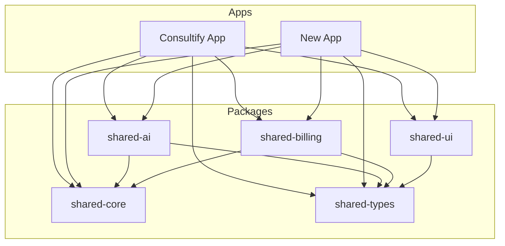

# Fork Inventory - Consultify Platform

**Document Version:** 1.0.0  
**Last Updated:** January 4, 2026  
**Purpose:** Code analysis for splitting Consultify into shared core + application-specific modules

---

## Executive Summary

This document inventories the Consultify codebase to prepare for forking into:
1. **Shared Core Library** - Reusable across multiple applications
2. **Consultify Application** - PMO/Digital Transformation specific
3. **New Application** - Future fork with different business domain

---

## Code Distribution Analysis

### Total Codebase Statistics

| Category | Files | Lines (Est.) | Classification |
|----------|-------|--------------|----------------|
| Backend TypeScript | 877 | ~150K | Mixed |
| Frontend Components | 717 | ~100K | Mixed |
| Types & Schemas | 30 | ~5K | Mostly Shared |
| SQL Migrations | 138 | ~10K | Split Required |
| Tests | 765 | ~80K | Split Required |

---

## 1. SHARED CORE (Both Apps) - `@consultify/core`

### 1.1 Authentication & Authorization

**Services (Shared):**
```
server/src/services/
├── RefreshTokenService.ts       ✅ Generic JWT refresh
├── MFAService.ts                ✅ Generic 2FA/TOTP
├── oauthService.ts              ✅ OAuth2 providers
├── ssoService.ts                ✅ SAML SSO
├── webauthnService.ts           ✅ Passkeys
├── rbacService.ts               ✅ Role-based access
├── permissionService.ts         ✅ Permission checking
├── accessPolicyService.ts       ⚠️ Partial (has PMO policies)
├── userSessionService.ts        ✅ Session management
└── passwordPolicyService.ts     ✅ Password rules
```

**Middleware (Shared):**
```
server/src/middleware/
├── auth.middleware.ts           ✅ JWT authentication
├── rbac.middleware.ts           ✅ Role checking
├── permission.middleware.ts     ✅ Permission gates
├── securityHeaders.middleware.ts✅ Helmet config
├── quota.middleware.ts          ⚠️ Needs abstraction
└── validation.middleware.ts     ✅ Input validation
```

**Types/Schemas (Shared):**
```
schemas/
├── auth.schema.ts               ✅ Auth validation
├── user.schema.ts               ✅ User validation
└── accessControl.schema.ts      ✅ RBAC validation

types/
├── api/requests.ts              ✅ Generic requests
├── api/responses.ts             ✅ Generic responses
└── domain/user.ts               ✅ User types
```

### 1.2 Database Abstraction Layer

**Fully Shared:**
```
server/src/database/
├── IDatabase.ts                 ✅ Interface contract
├── Database.ts                  ✅ Factory pattern
├── PostgresDatabase.ts          ✅ PostgreSQL impl
└── index.ts                     ✅ Exports
```

**Utilities (Shared):**
```
server/src/utils/
├── DbPromise.ts                 ✅ Promise wrapper
├── QueryAdapter.ts              ✅ SQL adaptation
├── queryHelpers.ts              ✅ Query builders
└── orgColumn.ts                 ⚠️ Multi-tenant helper
```

### 1.3 AI Core Infrastructure

**Shared AI Services:**
```
server/src/services/ai/
├── llmService.ts                ✅ LLM provider abstraction
├── modelRouter.ts               ✅ Model selection
├── embeddingService.ts          ✅ Vector embeddings
├── circuitBreaker.ts            ✅ Fault tolerance
├── cacheService.ts              ✅ Response caching
├── rateLimiter.ts               ✅ Rate limiting
├── healthMonitor.ts             ✅ Health checks
├── observability.ts             ✅ Tracing/metrics
├── alerting.ts                  ✅ Alert triggers
├── redisClient.ts               ✅ Redis connection
├── quotaService.ts              ✅ Usage tracking
└── enterpriseSecurity.ts        ✅ PII redaction
```

**AI Types (Shared):**
```
server/src/types/ai.types.ts     ✅ AI type definitions
types/AIContract.ts              ✅ AI contract types
types/domain/ai.ts               ✅ AI domain types
schemas/ai.schema.ts             ⚠️ Some PMO-specific
```

### 1.4 Billing & Payments

**Services (Shared):**
```
server/src/services/
├── BillingService.ts            ✅ Core billing
├── BillingWebhookService.ts     ✅ Stripe webhooks
├── InvoiceService.ts            ✅ Invoice generation
├── SubscriptionAnalyticsService.ts ✅ Analytics
├── tokenBillingService.ts       ✅ Token usage billing
├── payAsYouGoService.ts         ✅ Usage-based billing
├── promoCodeService.ts          ✅ Promo codes
├── settlementService.ts         ✅ Partner settlements
├── billing/                     ✅ Billing subdomain
│   └── stripeService.ts         ✅ Stripe integration
```

**Types/Schemas (Shared):**
```
schemas/billing.schema.ts        ✅ Billing validation
types/domain/billing.ts          ✅ Billing types
```

### 1.5 Communication Services

**Services (Shared):**
```
server/src/services/
├── emailService.ts              ✅ Email sending
├── emailTemplateService.ts      ✅ Email templates
├── NotificationService.ts       ✅ Push notifications
├── notificationBatchingService.ts ✅ Notification batching
├── notificationOutboxService.ts ✅ Outbox pattern
├── smsService.ts                ✅ SMS sending
├── WhatsAppService.ts           ✅ WhatsApp integration
├── slackService.ts              ✅ Slack integration
└── webhookDeliveryService.ts    ✅ Webhook delivery
```

### 1.6 Infrastructure & Utilities

**Utils (Shared):**
```
server/src/utils/
├── Logger.ts                    ✅ Winston logger
├── ErrorHandler.ts              ✅ Error handling
├── RedisClient.ts               ✅ Redis connection
├── RedisRateLimitStore.ts       ✅ Rate limit store
├── RequestStore.ts              ✅ Request context
├── requestContext.ts            ✅ Context propagation
├── cacheHelper.ts               ✅ Caching utilities
├── piiRedactor.ts               ✅ PII redaction
├── asyncHandler.ts              ✅ Async route handler
├── typeGuards.ts                ✅ Type guards
└── validation.ts                ✅ Validation utils
```

**Cron Infrastructure (Shared):**
```
server/src/cron/
├── Scheduler.ts                 ⚠️ Needs abstraction
├── HealthCheckJob.ts            ✅ Health monitoring
├── CleanupRevokedTokens.ts      ✅ Token cleanup
└── BackupCron.ts                ✅ Backup jobs
```

---

## 2. CONSULTIFY-SPECIFIC (PMO/Digital Transformation)

### 2.1 PMO Module

**Services (Consultify Only):**
```
server/src/services/
├── pmoHealthService.ts          🔵 PMO health dashboard
├── pmoAnalysisService.ts        🔵 PMO analysis
├── pmoDomainRegistry.ts         🔵 PMO domain definitions
├── pmoRoleService.ts            🔵 PMO roles (PRINCE2/PMBOK)
├── pmoStandardsMapping.ts       🔵 ISO 21500/PMBOK/PRINCE2 mapping
├── stageGateService.ts          🔵 Stage gate workflow
├── decisionTriggerService.ts    🔵 Decision triggers
├── governanceService.ts         🔵 Governance tracking
├── governanceAuditService.ts    🔵 Governance audit
├── evidenceLedgerService.ts     🔵 Evidence management
└── evmMetricsService.ts         🔵 Earned value metrics
```

**AI PMO Extensions:**
```
server/src/services/
├── aiDecisionGovernance.ts      🔵 AI decision tracking
├── aiRiskChangeControl.ts       🔵 AI risk assessment
├── aiWorkloadIntelligence.ts    🔵 Workload optimization
├── aiMaturityMonitor.ts         🔵 Maturity tracking
├── aiExecutiveReporting.ts      🔵 Executive AI reports
├── aiKnowledgeManager.ts        🔵 PMO knowledge base
└── ai/agents/pmoAgent.ts        🔵 PMO AI agent
```

**Routes (Consultify Only):**
```
server/src/routes/
├── pmo.routes.ts
├── pmo-analysis.routes.ts
├── pmo-context.routes.ts
├── pmoDomains.routes.ts
├── pmoRoles.routes.ts
├── stage-gates.routes.ts
├── decisions.routes.ts
├── governance.routes.ts
└── governanceAdmin.routes.ts
```

### 2.2 Assessment Module (DRD Methodology)

**Services (Consultify Only):**
```
server/src/services/
├── assessmentService.ts         🔵 Core assessment
├── assessmentWorkflowService.ts 🔵 Assessment workflow
├── assessmentReportService.ts   🔵 Assessment reports
├── assessmentOverviewService.ts 🔵 Assessment dashboard
├── frameworkAssessmentService.ts 🔵 Multi-framework
├── frameworkBenchmarkService.ts 🔵 Benchmarking
├── frameworkRBACService.ts      🔵 Framework permissions
├── frameworkScoreCalculators.ts 🔵 Score calculations
├── multiFrameworkAssessmentService.ts 🔵 SIRI/ADMA/CMMI
├── multiFrameworkAuditService.ts 🔵 Audit trail
├── multiFrameworkReportService.ts 🔵 Multi-FW reports
├── externalAssessmentService.ts 🔵 External assessments
├── qualityAssessmentService.ts  🔵 Quality assessment
├── adkarService.ts              🔵 ADKAR model
├── rapidLeanService.ts          🔵 Rapid LEAN
├── rapidLeanReportService.ts    🔵 Rapid LEAN reports
└── rapidLeanObservationMapper.ts 🔵 LEAN observations
```

**AI Assessment Extensions:**
```
server/src/services/
├── aiAssessmentFormHelper.ts    🔵 Form assistance
├── aiAssessmentPartnerService.ts 🔵 AI partner mode
├── aiAssessmentReportGenerator.ts 🔵 Report generation
└── aiCharterGeneratorService.ts 🔵 Charter generation
```

**Routes (Consultify Only):**
```
server/src/routes/
├── assessment.routes.ts
├── assessment-hub.routes.ts
├── assessment-reports.routes.ts
├── assessment-workflow.routes.ts
├── rapidlean.routes.ts
├── external-assessments.routes.ts
├── multi-framework-assessment.routes.ts
└── multi-framework-workflow.routes.ts
```

### 2.3 Initiative Management

**Services (Consultify Only):**
```
server/src/services/
├── initiativeService.ts         🔵 Core initiatives
├── initiativeGeneratorService.ts 🔵 AI initiative gen
├── initiativeTemplateService.ts 🔵 Templates
├── initiativeStatusService.ts   🔵 Status tracking
├── roadmapService.ts            🔵 Roadmap planning
├── scenarioService.ts           🔵 Scenario analysis
├── baselineService.ts           🔵 Baseline management
├── capacityService.ts           🔵 Capacity planning
├── executionService.ts          🔵 Execution tracking
├── stabilizationService.ts      🔵 Stabilization
└── progressService.ts           🔵 Progress tracking
```

**Routes (Consultify Only):**
```
server/src/routes/
├── initiatives.routes.ts
├── initiative-generator.routes.ts
├── roadmap.routes.ts
├── scenarios.routes.ts
├── baselines.routes.ts
├── capacity.routes.ts
├── execution.routes.ts
└── stabilization.routes.ts
```

### 2.4 Consulting-Specific Features

**Services (Consultify Only):**
```
server/src/services/
├── consultantService.ts         🔵 Consultant management
├── partnerService.ts            🔵 Partner management
├── demoService.ts               🔵 Demo orchestration
├── demoSessionService.ts        🔵 Demo sessions
├── onboardingService.ts         🔵 Client onboarding
├── journeyAnalytics.ts          🔵 Journey tracking
├── competitiveIntelligenceService.ts 🔵 CI analysis
├── industryAIModelsService.ts   🔵 Industry models
├── steeringCommitteeAggregator.ts 🔵 SteerCo reports
└── teamMeetingAggregator.ts     🔵 Team meeting prep
```

---

## 3. GENERIC/REUSABLE (New App Candidates)

### 3.1 Project Management (Abstractable)

**Services (Can Be Shared with Abstraction):**
```
server/src/services/
├── TaskService.ts               ⚠️ Can be generic
├── projectMemberService.ts      ⚠️ Can be generic
├── dependencyService.ts         ⚠️ Can be generic
├── statusService.ts             ⚠️ Can be generic
├── statusReportService.ts       ⚠️ Can be generic
├── workqueueService.ts          ⚠️ Can be generic
├── workModeService.ts           ⚠️ Can be generic
├── workstreamService.ts         ⚠️ Can be generic
├── slaService.ts                ⚠️ Can be generic
├── EscalationService.ts         ⚠️ Can be generic
└── criticalPathService.ts       ⚠️ Can be generic
```

### 3.2 Reporting Framework (Abstractable)

**Services (Can Be Shared):**
```
server/src/services/
├── reportService.ts             ⚠️ Can be generic
├── reportingService.ts          ⚠️ Can be generic
├── pdfGeneratorService.ts       ⚠️ Can be generic
├── pdfExportService.ts          ⚠️ Can be generic
├── excelExportService.ts        ⚠️ Can be generic
├── pptxGeneratorService.ts      ⚠️ Can be generic
├── scheduledReportsService.ts   ⚠️ Can be generic
├── reportEmailService.ts        ⚠️ Can be generic
├── reportVersionService.ts      ⚠️ Can be generic
├── reportCommentsService.ts     ⚠️ Can be generic
└── reportApprovalService.ts     ⚠️ Can be generic
```

### 3.3 Analytics Framework (Abstractable)

**Services (Can Be Shared):**
```
server/src/services/
├── analyticsService.ts          ⚠️ Can be generic
├── metricsService.ts            ⚠️ Can be generic
├── metricsCollector.ts          ⚠️ Can be generic
├── metricsAggregator.ts         ⚠️ Can be generic
├── metricsPersistenceService.ts ⚠️ Can be generic
├── dashboardBuilderService.ts   ⚠️ Can be generic
└── periodComparisonService.ts   ⚠️ Can be generic
```

### 3.4 Help & Support System (Abstractable)

**Services (Can Be Shared):**
```
server/src/services/
├── helpService.ts               ⚠️ Can be generic
├── helpChatService.ts           ⚠️ Can be generic
├── helpAnalyticsService.ts      ⚠️ Can be generic
├── supportTicketService.ts      ⚠️ Can be generic
├── feedbackService.ts           ⚠️ Can be generic
└── gamificationService.ts       ⚠️ Can be generic
```

---

## 4. DATABASE SCHEMA SPLIT

### 4.1 Shared Tables (Core)

```sql
-- Authentication & Users
users, user_settings, user_preferences, user_sessions
refresh_tokens, revoked_tokens, mfa_secrets, password_resets
access_codes, access_code_usage

-- Organizations & RBAC
organizations, organization_settings, organization_branding
roles, permissions, user_roles, role_permissions
access_policies, permission_requests

-- Billing
subscriptions, subscription_items, invoices, invoice_items
billing_events, payment_methods, promo_codes, promo_usage
token_usage, billing_credits

-- Communications
email_logs, notification_logs, notification_preferences
webhook_subscriptions, webhook_logs

-- AI Core
ai_conversations, ai_messages, ai_feedback
ai_audit_logs, ai_cache, ai_rate_limits

-- System
audit_logs, system_config, feature_flags
scheduled_jobs, job_logs
```

### 4.2 Consultify-Specific Tables

```sql
-- PMO Framework
pmo_snapshots, pmo_metrics, pmo_domains
decisions, decision_triggers, decision_history
stage_gates, stage_gate_reviews, stage_gate_evidence

-- Assessments
assessments, assessment_responses, assessment_scores
framework_assessments, framework_benchmarks
evidence_items, evidence_attachments
adkar_assessments, rapid_lean_assessments

-- Initiatives & Projects (Consultify flavor)
projects, project_members, project_roles
initiatives, initiative_templates, initiative_milestones
roadmaps, roadmap_items, dependencies
scenarios, scenario_comparisons, baselines

-- Consulting
consultants, consultant_assignments, consultant_access
partners, partner_settlements
demo_sessions, demo_data

-- Reports (PMO-specific)
management_reports, steering_committee_reports
report_templates, report_versions
```

---

## 5. FRONTEND COMPONENT SPLIT

### 5.1 Shared Components (`@consultify/ui`)

```
components/common/              ✅ All shared
components/layout/              ✅ Layout components
components/forms/               ✅ Form components
components/charts/              ⚠️ Some PMO-specific
components/tables/              ✅ Data tables
components/modals/              ✅ Modal dialogs
components/notifications/       ✅ Notification UI
```

### 5.2 Consultify-Specific Components

```
components/assessment/          🔵 Assessment UI
components/initiatives/         🔵 Initiative UI
components/pmo/                 🔵 PMO dashboard
components/governance/          🔵 Governance UI
components/consulting/          🔵 Consulting features
components/roadmap/             🔵 Roadmap planning
```

---

## 6. TYPES & SCHEMAS SPLIT

### 6.1 Shared Types Package (`@consultify/types`)

```typescript
// types/shared/
├── api.types.ts        // Request/Response types
├── user.types.ts       // User domain types
├── billing.types.ts    // Billing domain types
├── ai.types.ts         // AI types
└── common.types.ts     // Shared utilities

// schemas/shared/
├── auth.schema.ts
├── user.schema.ts
├── billing.schema.ts
└── ai.schema.ts
```

### 6.2 Consultify-Specific Types

```typescript
// types/consultify/
├── pmo.types.ts        // PMO domain types
├── assessment.types.ts // Assessment types
├── initiative.types.ts // Initiative types
├── governance.types.ts // Governance types
└── consulting.types.ts // Consulting types

// schemas/consultify/
├── pmo.schema.ts
├── initiative.schema.ts
├── project.schema.ts   // PMO-flavored projects
└── task.schema.ts      // PMO-flavored tasks
```

---

## 7. MIGRATION STRATEGY

### Phase 1: Package Extraction (Week 1-2)

1. Create `packages/shared-core/` directory
2. Extract database abstraction layer
3. Extract authentication services
4. Extract utility functions
5. Create shared types package

### Phase 2: AI Core Extraction (Week 3-4)

1. Create `packages/shared-ai/` directory
2. Extract LLM service layer
3. Extract embedding service
4. Extract circuit breaker & monitoring
5. Define AI extension points

### Phase 3: Billing Core Extraction (Week 5)

1. Create `packages/shared-billing/` directory
2. Extract Stripe integration
3. Extract invoice generation
4. Extract subscription management

### Phase 4: Application Split (Week 6-8)

1. Create `apps/consultify/` with PMO-specific code
2. Create `apps/new-app/` skeleton
3. Configure shared dependency imports
4. Update build system

---

## 8. RECOMMENDED MONOREPO STRUCTURE

```
consultify/
├── packages/
│   ├── shared-core/           # Core utilities, DB, auth
│   │   ├── src/
│   │   │   ├── database/
│   │   │   ├── auth/
│   │   │   ├── utils/
│   │   │   └── middleware/
│   │   ├── package.json
│   │   └── tsconfig.json
│   │
│   ├── shared-ai/             # AI infrastructure
│   │   ├── src/
│   │   │   ├── llm/
│   │   │   ├── embeddings/
│   │   │   ├── rag/
│   │   │   └── monitoring/
│   │   ├── package.json
│   │   └── tsconfig.json
│   │
│   ├── shared-billing/        # Billing infrastructure
│   │   ├── src/
│   │   │   ├── stripe/
│   │   │   ├── invoices/
│   │   │   └── subscriptions/
│   │   ├── package.json
│   │   └── tsconfig.json
│   │
│   ├── shared-types/          # TypeScript types
│   │   ├── src/
│   │   ├── package.json
│   │   └── tsconfig.json
│   │
│   └── shared-ui/             # React components
│       ├── src/
│       ├── package.json
│       └── tsconfig.json
│
├── apps/
│   ├── consultify/            # PMO/Consulting app
│   │   ├── frontend/
│   │   ├── backend/
│   │   ├── package.json
│   │   └── tsconfig.json
│   │
│   └── new-app/               # New application
│       ├── frontend/
│       ├── backend/
│       ├── package.json
│       └── tsconfig.json
│
├── nx.json                    # Nx workspace config
├── package.json               # Root package.json
└── tsconfig.base.json         # Shared TS config
```

---

## 9. DEPENDENCY GRAPH



---

## 10. RISK ASSESSMENT

### High Risk Areas

| Area | Risk | Mitigation |
|------|------|------------|
| Database Schema Split | Data integrity | Careful migration scripts |
| AI Context | Loss of PMO context | Clear interface definitions |
| Session Management | Auth conflicts | Shared token service |
| Feature Flags | Flag naming conflicts | Namespace prefixes |

### Medium Risk Areas

| Area | Risk | Mitigation |
|------|------|------------|
| Test Coverage | Gaps after split | Test both packages and apps |
| Build Time | Longer builds | Nx caching |
| Dependency Hell | Version conflicts | Strict versioning |

---

## Document History

| Version | Date | Author | Changes |
|---------|------|--------|---------|
| 1.0.0 | 2026-01-04 | AI Assistant | Initial fork inventory |

---

*This document is part of the Phase 1 Architectural Modernization deliverables.*


