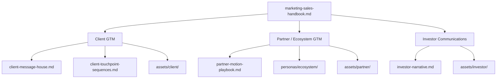

# Marketing & Sales Handbook — Consultify

Dokument nadrzędny spinający **product marketing**, **sales outreach** i **fundraising communications** dla Consultify. Ten plik nie zastępuje szczegółowych źródeł prawdy, tylko pokazuje **jak cały system działa razem** i jak używać go operacyjnie.

---

## 1. Cel handbooka

Ten handbook ma dać marketingowi i sprzedaży jeden wspólny model pracy:

- czym jest kategoria Consultify,
- do kogo mówimy,
- jak różni się narracja dla klienta, partnera i inwestora,
- jakie playbooki i assety wspierają każdy etap rozmowy,
- jak przenosić ten model na kolejne produkty.

---

## 2. Trzy ścieżki GTM

Consultify działa jednocześnie w trzech ścieżkach:

1. **Client GTM**  
   Sprzedaż transformacji do klientów końcowych.

2. **Partner / Ecosystem GTM**  
   Skalowanie przez consulting owners, software houses, integratorów, butiki i instytucje finansowe.

3. **Investor Communications**  
   Komunikacja do VC i partnerów kapitałowych.

---

## 3. Kategoria i centralna teza

### Kategoria

Consultify to **AI-native consulting execution system**.

To znaczy:
- nie sprzedajemy "AI dla AI",
- nie sprzedajemy wyłącznie prezentacji i strategii,
- nie sprzedajemy samego software'u bez odpowiedzialności za efekt.

### Centralna teza

Firmy mają dziś problem nie z brakiem pomysłów na transformację, tylko z tym, że:
- nie mają jednego obrazu execution,
- nie umieją obronić ROI po wdrożeniu,
- nie ufają architekturze i kontroli danych,
- nie potrafią utrzymać efektu po projekcie.

Consultify spina te cztery warstwy:
- **plan**,
- **execution visibility**,
- **ROI lifecycle + persistence**,
- **security and control**.

---

## 4. Co jest źródłem prawdy

### Strategia i messaging

- [`client-message-house.md`](./client-message-house.md)
- [`partner-motion-playbook.md`](./partner-motion-playbook.md)
- [`investor-narrative.md`](./investor-narrative.md)

### Persony

- [`personas-overview-clients.md`](./personas-overview-clients.md)
- [`personas-overview-ecosystem.md`](./personas-overview-ecosystem.md)
- [`personas/`](./personas/)

### Outreach i assets

- [`client-touchpoint-sequences.md`](./client-touchpoint-sequences.md)
- [`asset-gap-map.md`](./asset-gap-map.md)
- [`assets/README.md`](./assets/README.md)
- [`assets/PUBLISH-CHECKLIST.md`](./assets/PUBLISH-CHECKLIST.md)

### Nowa warstwa wykonawcza

- [`playbooks/README.md`](./playbooks/README.md)
- [`playbooks/01-product-marketing-framework.md`](./playbooks/01-product-marketing-framework.md)
- [`playbooks/02-sales-outreach-playbook-clients.md`](./playbooks/02-sales-outreach-playbook-clients.md)
- [`playbooks/03-sales-outreach-playbook-partners.md`](./playbooks/03-sales-outreach-playbook-partners.md)
- [`playbooks/04-investor-communications-playbook.md`](./playbooks/04-investor-communications-playbook.md)
- [`playbooks/05-discovery-objections-qualification.md`](./playbooks/05-discovery-objections-qualification.md)
- [`playbooks/06-sales-marketing-handoff.md`](./playbooks/06-sales-marketing-handoff.md)

---

## 5. Jak używać tego systemu

### Marketing

Marketing odpowiada za:
- spójność kategorii i języka,
- tworzenie i aktualizację assetów,
- utrzymanie narracji per persona i per stage,
- przygotowanie materiałów do publikacji i eksportu.

Marketing nie powinien:
- tworzyć nowych claimów bez zgodności z `message house`,
- publikować security / ROI obietnic bez review,
- mieszać narracji client, partner i investor w jednym materiale.

### Sales

Sales odpowiada za:
- dobranie właściwej persony wejściowej,
- użycie odpowiedniego assetu i proofu do etapu lejka,
- prowadzenie discovery, kwalifikacji i obrony decyzji,
- adaptację gotowych materiałów do konkretnego konta.

Sales nie powinien:
- improwizować kategorii poza źródłami prawdy,
- wysyłać assetów nieadekwatnych do etapu,
- obiecywać finansów, deploymentu lub compliance bez potwierdzenia.

---

## 6. Logika person i komitetu

### Client buying committee

Najczęściej działamy przez zestaw:
- **Owner / CEO** — sponsor strategiczny,
- **CFO** — gatekeeper ekonomii,
- **COO / Transformation Officer** — gatekeeper execution,
- **IT / Cybersecurity** — gatekeeper architektury i danych.

Zasada:
- zaczynaj od **problemu biznesowego**,
- domykaj przez **ekonomię + security + rollout**,
- nie próbuj zamknąć decyzji bez CFO i IT, jeśli to enterprise.

### Partner buying logic

Partnerzy nie kupują "narzędzia AI". Oni kupują:
- leverage,
- nową linię przychodu,
- większą marżę,
- większy deal size,
- mniejsze ryzyko delivery lub portfela.

### Investor buying logic

Inwestor nie kupuje samego AI. Inwestor kupuje:
- kategorię,
- moat,
- founder-market fit,
- skalowalność modelu,
- wiarygodność tezy, że to nie jest tylko wrapper.

---

## 7. Jak materiały wspierają lejek

### Awareness

Cel:
- nazwać problem,
- zbudować conviction,
- pokazać nową kategorię.

Przykładowe materiały:
- message house,
- insight / post,
- category one-pager,
- intro narrative dla partnerów i inwestorów.

### Consideration

Cel:
- pokazać różnicę,
- dać proof adekwatny do roli,
- wejść głębiej w model działania.

Przykładowe materiały:
- ROI brief,
- partner pack,
- security brief,
- executive memo,
- investor memo outline.

### Decision

Cel:
- obniżyć ryzyko,
- domknąć ownership,
- pokazać jak działa pilot / współpraca / governance.

Przykładowe materiały:
- pilot rollout plan,
- security FAQ,
- economics one-pager,
- joint pursuit pack,
- data room checklist.

### Expansion

Cel:
- uzasadnić skalowanie,
- utrzymać persistence KPI,
- zbudować powtarzalność ruchu.

---

## 8. Co jest nowe w tej warstwie dokumentacji

Nowe playbooki mają zamknąć luki, których wcześniej brakowało:

- jedna warstwa opisowa dla marketingu i sales,
- operacyjny outreach nie tylko jako tabela touchpointów,
- discovery / objections / qualification w osobnym module,
- zasady handoffu marketing-sales,
- model do reuse pod następne produkty.

---

## 9. Zasada reużycia dla kolejnych produktów

Każdy kolejny produkt powinien odziedziczyć tę samą strukturę:

1. **message house / category thesis**
2. **persona system**
3. **outreach playbooks**
4. **asset map + asset pack**
5. **discovery / objections / qualification**
6. **handoff i publishing**

Podmianie ulega warstwa produktowa:
- promise,
- proof,
- assety,
- ICP,
- example use cases.

Nie podmieniamy struktury operacyjnej, jeśli nie ma silnego powodu.

---

## 10. Polecana ścieżka czytania

### Dla marketingu

1. [`playbooks/01-product-marketing-framework.md`](./playbooks/01-product-marketing-framework.md)
2. [`asset-gap-map.md`](./asset-gap-map.md)
3. [`assets/README.md`](./assets/README.md)
4. [`playbooks/06-sales-marketing-handoff.md`](./playbooks/06-sales-marketing-handoff.md)

### Dla sales

1. [`playbooks/02-sales-outreach-playbook-clients.md`](./playbooks/02-sales-outreach-playbook-clients.md)
2. [`playbooks/03-sales-outreach-playbook-partners.md`](./playbooks/03-sales-outreach-playbook-partners.md)
3. [`playbooks/05-discovery-objections-qualification.md`](./playbooks/05-discovery-objections-qualification.md)
4. odpowiednie assety z [`assets/`](./assets/)

### Dla founder / GTM owner

Przeczytaj cały ten handbook, potem:
- [`client-message-house.md`](./client-message-house.md)
- [`partner-motion-playbook.md`](./partner-motion-playbook.md)
- [`investor-narrative.md`](./investor-narrative.md)

---

## 11. Powiązane pliki

- [`README.md`](./README.md)
- [`execution-packs-overview.md`](./execution-packs-overview.md)
- [`communication-plan/README.md`](./communication-plan/README.md)
- [`playbooks/README.md`](./playbooks/README.md)
