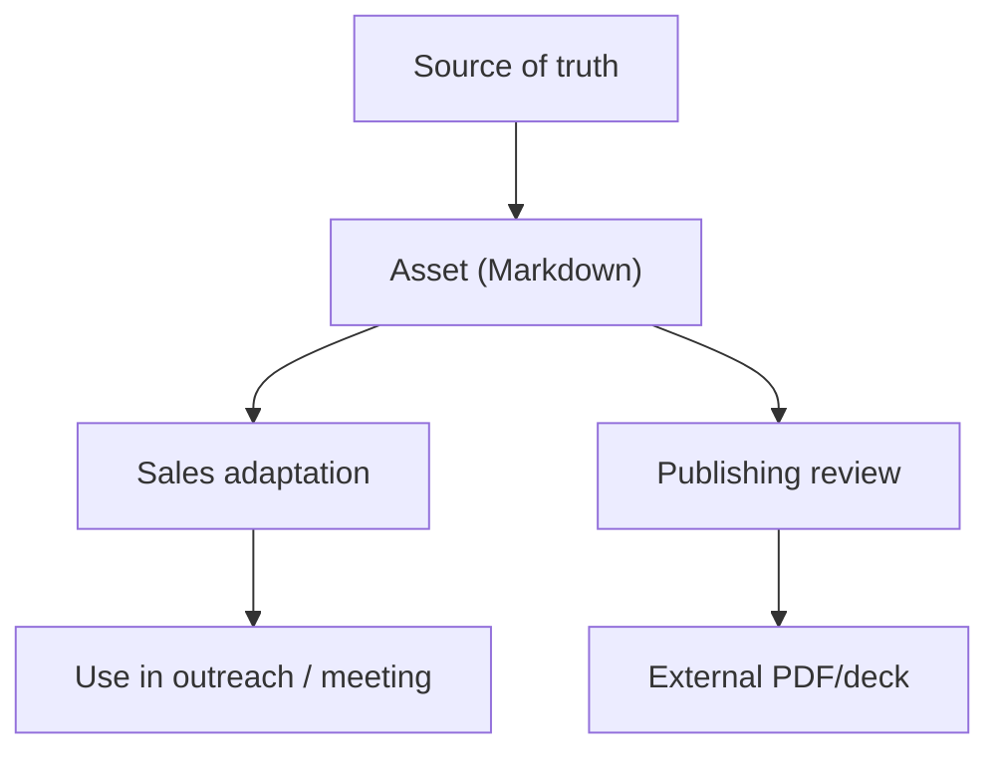

# Sales & Marketing Handoff

Dokument operacyjny dla współpracy marketing + sales wokół systemu GTM Consultify.

---

## 1. Cel

Ten dokument ustala:
- kto jest właścicielem której warstwy dokumentacji,
- jak assets przechodzą od treści źródłowej do użycia sprzedażowego,
- jak nie rozjechać narracji między marketingiem, sales i founderem,
- jak przenieść ten model na kolejne produkty.

---

## 2. Warstwy odpowiedzialności

### Marketing owns

- category narrative,
- message house,
- asset structure,
- stage mapping,
- publishing readiness,
- spójność języka i claims.

### Sales owns

- konto i kontekst,
- wybór persony wejściowej,
- discovery i qualification,
- adaptację materiałów do konkretnej rozmowy,
- prowadzenie komitetu do decyzji.

### Founder / GTM owner owns

- zmiany w strategicznej tezie,
- priorytety ICP,
- zgodę na nowe claimy,
- decyzje o publikacji materiałów zewnętrznych.

---

## 3. Jak działa przepływ materiału

### Source of truth

To są dokumenty, których sales nie powinien samodzielnie nadpisywać:
- [`../client-message-house.md`](../client-message-house.md)
- [`../partner-motion-playbook.md`](../partner-motion-playbook.md)
- [`../investor-narrative.md`](../investor-narrative.md)

### Asset (Markdown)

To są źródła robocze:
- [`../assets/`](../assets/)

### Sales adaptation

Sales może:
- skrócić,
- przepiąć kolejność,
- podmienić przykład,
- dopisać dane konta,
- zmienić kanał użycia.

Sales nie może:
- zmienić obietnicy produktu,
- dodać nowych claimów security / ROI bez review,
- użyć przykładowych liczb jako realnych.

---

## 4. Statusy materiałów

Statusy pochodzą z [`../asset-gap-map.md`](../asset-gap-map.md):

- **Gotowe (źródło MD)** — materiał istnieje jako pełna treść Markdown.
- **Gotowe (materiał zewnętrzny)** — istnieje finalny PDF/deck / link zewnętrzny.
- **Szkic** — niekompletne.
- **Brak** — nie istnieje.

### Reguła pracy

Marketing utrzymuje stan **Gotowe (źródło MD)**.  
Sales używa materiału dopiero po sprawdzeniu, czy:
- nie ma placeholderów operacyjnych dla danego konta,
- przeszedł review wymagany przez `PUBLISH-CHECKLIST`,
- jest adekwatny do etapu lejka.

---

## 5. Workflow przed użyciem materiału

### Krok 1

Sales identyfikuje:
- personę,
- stage,
- wymagany proof.

### Krok 2

Dobiera asset z:
- [`../asset-gap-map.md`](../asset-gap-map.md)
- odpowiedniego playbooka w tym katalogu.

### Krok 3

Jeśli materiał wychodzi na zewnątrz:
- przechodzi przez [`../assets/PUBLISH-CHECKLIST.md`](../assets/PUBLISH-CHECKLIST.md).

### Krok 4

Jeśli powstaje finalny deck / PDF:
- można dodać link zewnętrzny do mapy lub sekwencji outreachowych.

---

## 6. Minimalny handoff do nowego handlowca

Nowa osoba w sales powinna przeczytać:

1. [`../marketing-sales-handbook.md`](../marketing-sales-handbook.md)
2. [`01-product-marketing-framework.md`](./01-product-marketing-framework.md)
3. [`02-sales-outreach-playbook-clients.md`](./02-sales-outreach-playbook-clients.md)
4. [`03-sales-outreach-playbook-partners.md`](./03-sales-outreach-playbook-partners.md)
5. [`05-discovery-objections-qualification.md`](./05-discovery-objections-qualification.md)
6. odpowiednie assety z `../assets/`

---

## 7. Reguły reużycia pod kolejne produkty

### Co zostaje

- struktura handbook + playbooks,
- logika persona / stage / proof,
- workflow handoff,
- publishing checklist,
- model kwalifikacji i obiekcji.

### Co podmieniamy

- message house,
- persona assumptions,
- asset pack,
- category thesis,
- use cases,
- case studies,
- proof architecture.

### Kiedy nie kopiować 1:1

Nie kopiuj 1:1 wtedy, gdy:
- nowy produkt ma zupełnie inny komitet zakupowy,
- nie ma partner motion,
- nie wymaga security / ROI proof na podobnym poziomie,
- jest self-serve zamiast founder-led / enterprise-led.

---

## 8. Reguły eskalacji

### Escalate do marketingu, gdy:

- trzeba nowego assetu,
- current asset nie odpowiada obiekcjom z rynku,
- pojawia się nowy pattern pytań / blokad.

### Escalate do founder / GTM owner, gdy:

- trzeba zmienić core promise,
- pojawia się nowa persona strategiczna,
- trzeba zatwierdzić nowe claimy lub publiczne case studies.

---

## 9. Powiązane dokumenty

- [`../README.md`](../README.md)
- [`../asset-gap-map.md`](../asset-gap-map.md)
- [`../assets/PUBLISH-CHECKLIST.md`](../assets/PUBLISH-CHECKLIST.md)
