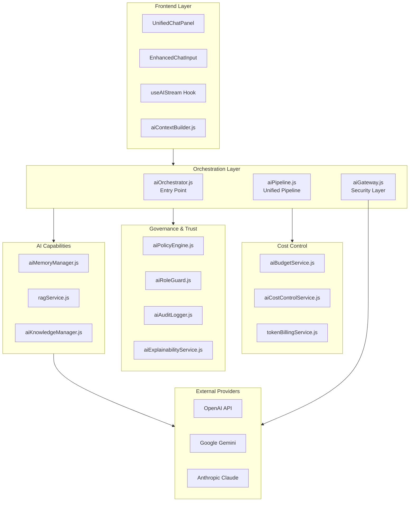

# AI System Inventory - Enterprise Audit Report

**Data audytu:** 2025-01-02  
**Wersja systemu:** 2.7.0  
**Status:** ✅ Inwentaryzacja zakończona

---

## Executive Summary

System AI Consultify składa się z **50+ serwisów backendowych** oraz **10+ komponentów frontendowych**, tworząc kompleksową platformę AI dla Enterprise PMO. Architektura jest modularna, z wyraźnym podziałem odpowiedzialności, jednak wymaga audytu pod kątem stabilności, bezpieczeństwa i gotowości do wdrożeń korporacyjnych.

**Kluczowe ustalenia:**
- ✅ Architektura jest dobrze zorganizowana z dependency injection
- ⚠️ Istnieją duplikaty plików (np. `aiService.js` vs `aiPipeline.js`)
- ⚠️ Niektóre serwisy mają wersje "2" (migracja w toku?)
- ✅ Multi-tenant isolation jest implementowane w kluczowych miejscach
- ⚠️ Wymaga weryfikacji kompletności implementacji

---

## 1. Architektura Systemu AI

### 1.1 Warstwy Systemu



### 1.2 Główne Komponenty

#### Orchestration Layer (Warstwa Orkiestracji)

| Komponent | Plik | Status | Opis |
|-----------|------|--------|------|
| **AI Orchestrator** | `aiOrchestrator.js` | ✅ Active | Główny punkt wejścia, sprawdza trial/limit, buduje kontekst, wywołuje pipeline |
| **AI Pipeline** | `ai/aiPipeline.js` | ✅ Active | Nowy unified pipeline (migracja z aiService.js) |
| **AI Gateway** | `ai/aiGateway.js` | ✅ Active | Security layer: PII scrubbing, rate limiting, injection guard |
| **AI Service** | `aiService.js` | ⚠️ Deprecated | Legacy service (95% migracja, wciąż używany dla queue) |

**Zależności Orchestrator:**
- `aiContextBuilder` - budowanie kontekstu
- `aiPolicyEngine` - polityki AI
- `aiMemoryManager` - zarządzanie pamięcią
- `aiRoleGuard` - kontrola ról
- `accessPolicyService` - kontrola dostępu (trial/limit)
- `tokenBillingService` - billing tokenów

#### Capabilities Layer (Warstwa Możliwości)

| Komponent | Plik | Status | Opis |
|-----------|------|--------|------|
| **Context Builder** | `aiContextBuilder.js` | ✅ Active | Buduje 6-warstwowy kontekst (platform, org, project, execution, knowledge, external) |
| **Memory Manager** | `aiMemoryManager.js` | ✅ Active | 4-warstwowa pamięć: session, project, organization, user preferences |
| **RAG Service** | `ragService.js` | ✅ Active | Retrieval-Augmented Generation - vector search z embeddings |
| **Knowledge Manager** | `aiKnowledgeManager.js` | ✅ Active | Zarządzanie bazą wiedzy PMO |

**Kluczowe funkcje Context Builder:**
- ✅ Multi-tenant isolation: wszystkie query sprawdzają `organizationId`
- ✅ Focus mode filtering: `pmo-docs`, `project-data`, `research`, `web`
- ✅ PMO Health Snapshot integration
- ✅ Pending approvals context (HITL)

#### Governance Layer (Warstwa Zarządzania)

| Komponent | Plik | Status | Opis |
|-----------|------|--------|------|
| **Policy Engine** | `aiPolicyEngine.js` | ✅ Active | Polityki: ADVISORY, ASSISTED, PROACTIVE, AUTOPILOT |
| **Role Guard** | `aiRoleGuard.js` | ✅ Active | Role: ADVISOR, MANAGER, OPERATOR |
| **Audit Logger** | `aiAuditLogger.js` | ✅ Active | Pełny audit trail wszystkich akcji AI |
| **Explainability** | `aiExplainabilityService.js` | ✅ Active | Generowanie wyjaśnień dla decyzji AI |
| **Context Validator** | `aiContextValidator.js` | ✅ Active | Walidacja kontekstu przed wysłaniem do AI |

**Role Capabilities Matrix:**
- **ADVISOR:** canExplain, canSuggest, canAnalyze (NO mutations)
- **MANAGER:** + canCreateDrafts (requires approval)
- **OPERATOR:** + canExecuteActions, canModifyEntities (within governance)

#### Cost Control Layer (Warstwa Kontroli Kosztów)

| Komponent | Plik | Status | Opis |
|-----------|------|--------|------|
| **Cost Control** | `aiCostControlService.js` | ✅ Active | Budżety per org/project, automatic downgrade |
| **Budget Service** | `aiBudgetService.js` | ✅ Active | Zarządzanie budżetami |
| **Token Billing** | `tokenBillingService.js` | ✅ Active | Billing tokenów, balance tracking |

**Model Cost Tiers:**
- **Premium/Reasoning:** gpt-4, claude-3-opus ($0.01-0.075/1K tokens)
- **Standard/Execution:** gpt-3.5-turbo, claude-3-sonnet ($0.0005-0.015/1K tokens)
- **Budget/Chat:** gpt-4o-mini, claude-3-haiku ($0.00015-0.00125/1K tokens)

#### Monitoring & Stability Layer

| Komponent | Plik | Status | Opis |
|-----------|------|--------|------|
| **Health Service** | `ai/aiHealthService.js` | ✅ Active | Testy 6 capabilities: connection, chat, eyes, memory, hands, reasoning |
| **Failure Handler** | `aiFailureHandler.js` | ✅ Active | Obsługa błędów i fallbacków |
| **Analytics** | `aiAnalyticsService.js` | ✅ Active | Metryki użycia AI |
| **Circuit Breaker** | `circuitBreakerService.js` | ✅ Active | Circuit breaker pattern dla providerów |

---

## 2. Kompletna Lista Serwisów AI

### 2.1 Serwisy Core (Orchestration & Pipeline)

1. ✅ `aiOrchestrator.js` - Main orchestrator (637 lines)
2. ✅ `ai/aiPipeline.js` - Unified pipeline (1755 lines)
3. ✅ `ai/aiGateway.js` - Security gateway (294 lines)
4. ⚠️ `aiService.js` - Legacy (deprecated, 2080 lines)

### 2.2 Serwisy Context & Memory

5. ✅ `aiContextBuilder.js` - 6-layer context builder (664 lines)
6. ✅ `aiMemoryManager.js` - 4-layer memory system (332 lines)
7. ✅ `aiContextValidator.js` - Context validation
8. ✅ `ragService.js` - RAG with vector search (310 lines)
9. ✅ `aiKnowledgeManager.js` - Knowledge base management (433 lines)

### 2.3 Serwisy Governance & Security

10. ✅ `aiPolicyEngine.js` - Policy management (274 lines)
11. ✅ `aiRoleGuard.js` - Role-based access control (291 lines)
12. ✅ `regulatoryModeGuard.js` - Regulatory mode enforcement
13. ✅ `aiAuditLogger.js` - Audit logging (272 lines)
14. ✅ `aiExplainabilityService.js` - Explainability layer

### 2.4 Serwisy Cost Control

15. ✅ `aiCostControlService.js` - Cost control & budgets (55+ lines)
16. ✅ `aiBudgetService.js` - Budget management
17. ✅ `tokenBillingService.js` - Token billing

### 2.5 Serwisy Monitoring & Stability

18. ✅ `ai/aiHealthService.js` - Health checks (577 lines)
19. ✅ `aiFailureHandler.js` - Error handling
20. ✅ `aiAnalyticsService.js` - Analytics & metrics
21. ✅ `circuitBreakerService.js` - Circuit breaker (133 lines)
22. ⚠️ `llmFallbackService.js` / `llmFallbackService 2.js` - Fallback mechanisms

### 2.6 Serwisy Actions & Integration

23. ✅ `aiActionExecutor.js` - Action execution
24. ✅ `aiIntegrationService.js` - External integrations (Jira, Slack, etc.)
25. ✅ `aiProactivityEngine.js` - Proactive AI suggestions

### 2.7 Serwisy Specialized

26. ✅ `aiAssessmentFormHelper.js` - Assessment form assistance
27. ✅ `aiAssessmentPartnerService.js` - Assessment partner AI
28. ✅ `aiAssessmentReportGenerator.js` - Report generation
29. ✅ `aiCharterGeneratorService.js` - Charter generation
30. ✅ `aiDecisionGovernance.js` - Decision governance
31. ✅ `aiExecutiveReporting.js` - Executive reports
32. ✅ `aiMaturityMonitor.js` - Maturity monitoring
33. ✅ `aiWorkloadIntelligence.js` - Workload intelligence
34. ✅ `aiRiskChangeControl.js` - Risk & change control
35. ✅ `aiExternalDataControl.js` - External data control

### 2.8 Serwisy Settings & Configuration

36. ✅ `aiSettingsService.js` / `aiSettingsService 2.js` - AI settings
37. ✅ `aiModeEnforcer.js` / `aiModeEnforcer 2.js` - Mode enforcement
38. ✅ `aiModeResolver.js` / `aiModeResolver 2.js` - Mode resolution
39. ✅ `aiPromptHierarchy.js` - Prompt hierarchy

### 2.9 Serwisy Post-Processing

40. ✅ `aiResponsePostProcessor.js` / `aiResponsePostProcessor 2.js` - Response processing
41. ✅ `aiReplayService.js` - Replay functionality

### 2.10 Serwisy w folderze `ai/`

42. ✅ `ai/aiContext.js` - AI context utilities
43. ✅ `ai/aiHealthAlertService.js` - Health alerts
44. ✅ `ai/modelRouter.js` - Model routing logic
45. ✅ `ai/llmService.js` - LLM service wrapper
46. ✅ `ai/embeddingService.js` - Embedding generation
47. ✅ `ai/agents.js` - Agent coordination

**TOTAL: 50+ serwisów AI**

---

## 3. Dependency Graph

### 3.1 Główne Zależności Orchestrator

```
aiOrchestrator.js
├── aiContextBuilder.js
│   ├── pmoHealthService.js
│   ├── aiActionExecutor.js
│   └── aiSettingsService.js
├── aiPolicyEngine.js
│   ├── aiRoleGuard.js
│   └── regulatoryModeGuard.js
├── aiMemoryManager.js
├── aiRoleGuard.js
├── aiExplainabilityService.js
├── accessPolicyService.js
└── tokenBillingService.js
```

### 3.2 Zależności Pipeline

```
aiPipeline.js
├── aiGateway.js
│   ├── rateLimiter.js
│   └── quotaService.js
├── enhancedContextBuilder.js
├── promptAssembler.js
├── modelRouter.js
├── llmService.js
│   └── circuitBreakerService.js
├── memoryManager.js
├── qualityChecker.js
├── enterpriseSecurity.js
└── performanceOptimizer.js
```

### 3.3 Zależności RAG

```
ragService.js
├── ai/embeddingService.js
└── knowledgeService.js
    └── knowledge_docs (DB table)
```

---

## 4. Punkty Integracji z Zewnętrznymi API

### 4.1 LLM Providers

| Provider | Endpoint | Używany w | Status |
|----------|----------|-----------|--------|
| **OpenAI** | `https://api.openai.com/v1/` | `aiGateway.js`, `ragService.js` | ✅ Active |
| **Google Gemini** | `https://generativelanguage.googleapis.com/` | `aiPipeline.js` | ✅ Active |
| **Anthropic Claude** | `https://api.anthropic.com/` | `aiGateway.js` | ✅ Active |

### 4.2 Embedding Providers

| Provider | Model | Używany w | Status |
|----------|-------|-----------|--------|
| **OpenAI** | `text-embedding-3-small` | `ragService.js` | ✅ Active |
| **Google** | `embedding-001` | `ai/embeddingService.js` | ✅ Active |

---

## 5. Multi-Tenant Isolation Analysis

### 5.1 Weryfikacja Izolacji w Kluczowych Serwisach

#### ✅ aiContextBuilder.js
- **Status:** ✅ Prawidłowa izolacja
- **Weryfikacja:** Wszystkie metody przyjmują `organizationId` jako parametr
- **Query patterns:** `WHERE organization_id = ?` w wszystkich query
- **Risk:** LOW - dobrze zaimplementowane

#### ✅ ragService.js
- **Status:** ✅ Prawidłowa izolacja
- **Weryfikacja:** `getContext()` przyjmuje `filterOptions.organizationId`
- **Query:** `JOIN knowledge_docs d ON c.doc_id = d.id WHERE d.organization_id = ?`
- **Risk:** LOW - JOIN zapewnia izolację

#### ✅ aiMemoryManager.js
- **Status:** ✅ Prawidłowa izolacja
- **Weryfikacja:** Memory jest per `projectId`, który jest powiązany z `organizationId`
- **Query:** `SELECT * FROM ai_project_memory WHERE project_id = ?`
- **Risk:** LOW - izolacja przez projectId

#### ⚠️ aiKnowledgeManager.js
- **Status:** ⚠️ Wymaga weryfikacji
- **Uwaga:** Należy sprawdzić czy wszystkie query sprawdzają `organizationId`

---

## 6. Deprecated & Duplicate Files

### 6.1 Pliki Deprecated

| Plik | Status | Migracja do | Uwagi |
|------|--------|-------------|-------|
| `aiService.js` | ⚠️ Deprecated | `ai/aiPipeline.js` | 95% migracja, wciąż używany dla queue operations |

### 6.2 Duplikaty (Wersje "2")

| Plik | Duplikat | Status | Uwagi |
|------|----------|--------|-------|
| `aiRecommendationService.js` | `aiRecommendationService 2.js` | ⚠️ Duplikat | Który jest aktywny? |
| `aiKnowledgeManager.js` | `aiKnowledgeManager 2.js` | ⚠️ Duplikat | Wymaga konsolidacji |
| `aiProactivityEngine.js` | `aiProactivityEngine 2.js` | ⚠️ Duplikat | Wymaga konsolidacji |
| `aiSettingsService.js` | `aiSettingsService 2.js` | ⚠️ Duplikat | Wymaga konsolidacji |
| `aiModeEnforcer.js` | `aiModeEnforcer 2.js` | ⚠️ Duplikat | Wymaga konsolidacji |
| `aiModeResolver.js` | `aiModeResolver 2.js` | ⚠️ Duplikat | Wymaga konsolidacji |
| `aiResponsePostProcessor.js` | `aiResponsePostProcessor 2.js` | ⚠️ Duplikat | Wymaga konsolidacji |
| `ai/aiGateway.js` | `ai/aiGateway 2.js` | ⚠️ Duplikat | Wymaga konsolidacji |
| `ai/aiPipeline.js` | `ai/aiPipeline 2.js` | ⚠️ Duplikat | Wymaga konsolidacji |
| `ai/aiHealthService.js` | `ai/aiHealthService 2.js` | ⚠️ Duplikat | Wymaga konsolidacji |

**Rekomendacja:** Należy zidentyfikować który plik jest aktywny i usunąć duplikaty lub zakończyć migrację.

---

## 7. Frontend Components

### 7.1 Komponenty AI Chat

| Komponent | Plik | Status | Opis |
|-----------|------|--------|------|
| **UnifiedChatPanel** | `components/AIChat/UnifiedChatPanel.tsx` | ✅ Active | Dual-mode chat (full/split) |
| **EnhancedChatInput** | `components/AIChat/EnhancedChatInput.tsx` | ✅ Active | Rich input z voice, files, tools |
| **ChatSlidingPanel** | `components/AIChat/ChatSlidingPanel.tsx` | ✅ Active | Historia rozmów |
| **FocusModeSelector** | `components/AIChat/Input/FocusModeSelector.tsx` | ✅ Active | Focus mode pills |

### 7.2 Hooks & Stores

| Komponent | Plik | Status | Opis |
|-----------|------|--------|------|
| **useAIStream** | `hooks/useAIStream.ts` | ✅ Active | Streaming hook |
| **useConversationStore** | `store/useConversationStore.ts` | ✅ Active | Conversation state (extended dla unified chat) |
| **AIContext** | `contexts/AIContext.tsx` | ✅ Active | AI context provider (extended dla workspace) |

---

## 8. Database Schema (AI-related tables)

### 8.1 Tabele AI

| Tabela | Opis | Kluczowe pola |
|--------|------|---------------|
| `ai_audit_logs` | Audit trail | `organization_id`, `user_id`, `action_type`, `reasoning_summary` |
| `ai_project_memory` | Project memory | `project_id`, `memory_type`, `content` |
| `ai_organization_memory` | Org memory | `organization_id`, `content` |
| `ai_policies` | AI policies | `organization_id`, `policy_level`, `max_policy_level` |
| `ai_user_preferences` | User preferences | `user_id`, `preferred_tone`, `education_mode` |
| `conversations` | Conversations | `organization_id`, `project_id`, `chat_project_id` |
| `conversation_messages` | Messages | `conversation_id`, `role`, `content`, `metadata` |
| `chat_projects` | Chat projects | `organization_id`, `name` |
| `knowledge_docs` | Knowledge docs | `organization_id`, `filename` |
| `knowledge_chunks` | RAG chunks | `doc_id`, `embedding` |

**Weryfikacja Multi-tenant:** ✅ Wszystkie tabele mają `organization_id` lub są izolowane przez `project_id`

---

## 9. Findings & Observations

### 9.1 Pozytywne Aspekty

1. ✅ **Modularna architektura** - wyraźny podział odpowiedzialności
2. ✅ **Dependency injection** - ułatwia testowanie
3. ✅ **Multi-tenant isolation** - implementowane w kluczowych miejscach
4. ✅ **Audit logging** - kompletny audit trail
5. ✅ **Role-based access** - dobrze zdefiniowane role i capabilities
6. ✅ **Cost control** - budżety i automatic downgrade
7. ✅ **Circuit breakers** - odporność na awarie providerów

### 9.2 Obszary Wymagające Uwagi

1. ⚠️ **Duplikaty plików** - wiele serwisów ma wersje "2", wymaga konsolidacji
2. ⚠️ **Legacy code** - `aiService.js` jest deprecated ale wciąż używany
3. ⚠️ **Brak dokumentacji** - większość serwisów nie ma dokumentacji
4. ⚠️ **Test coverage** - nieznany poziom pokrycia testami
5. ⚠️ **Migration status** - niejasny status migracji z legacy do nowego pipeline

---

## 10. Rekomendacje dla Fazy 2 (Stabilność)

Na podstawie inwentaryzacji, następujące obszary wymagają szczegółowego audytu:

1. **Circuit Breakers** - weryfikacja działania przy awariach providerów
2. **Fallback Mechanisms** - sprawdzenie automatycznego przełączania modeli
3. **Streaming Stability** - obsługa zerwanych połączeń
4. **Performance** - latency i throughput dla 6 capabilities

---

## Next Steps

- ✅ **Faza 1:** Inwentaryzacja - ZAKOŃCZONA
- ⏳ **Faza 2:** Audyt Stabilności - następna
- ⏳ **Faza 3:** Audyt Bezpieczeństwa
- ⏳ **Faza 4:** Audyt Funkcjonalności
- ⏳ **Faza 5:** Audyt UI/UX
- ⏳ **Faza 6:** Raport Końcowy

---

**Autor:** AI Audit System  
**Data:** 2025-01-02  
**Wersja:** 1.0


