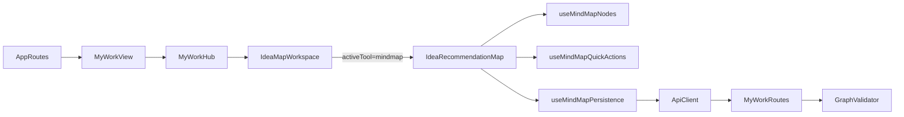

# Idea Workspace / Mindmap Code Audit

**Date:** 2026-03-14  
**Scope:** `My Work -> Ideas -> Idea Workspace -> Mindmap`, with supporting review of `Canvas OS`, backend persistence, artifact linking, and cross-canvas integration  
**Method:** static code audit + documentation audit  
**Status:** `NOT READY FOR SIGN-OFF`

## 1. Executive Summary

The active `Idea Workspace` path is not a fake shell with no logic behind it. There is substantial implementation depth in:
- workspace orchestration
- React Flow-based canvas runtimes
- autosave and hydration
- AI proposal review
- artifact attachment APIs
- selection and conversion scaffolding

The problem is different and more serious:

- the active runtime is architecturally fragmented
- the module overstates shared-canvas completion
- the active `Mindmap` path remains the weakest persistence path
- artifact linking is implemented through two inconsistent models
- the module mixes real workflows with scaffold workflows under one polished shell

The result is a workspace that can look feature-rich while still feeling untrustworthy in practice.

## 2. Audit Basis

Primary product and runtime canon used for validation:
- `docs/product/IDEA_WORKSPACE_V5_SSOT.md`
- `docs/product/MINDMAP_V1_SSOT.md`
- `docs/product/MIND_MAP_OS_CONTRACT_FREEZE.md`
- `docs/product/CANVAS_OS_CONTRACT_FREEZE.md`
- `docs/product/IDEA_WORKSPACE_V5_REMEDIATION_PLAN.md`
- `docs/product/IDEA_WORKSPACE_V5_FAILURE_INVENTORY_2026-03-09.md`
- `docs/product/IDEA_WORKSPACE_V5_1_IMPLEMENTATION_PROGRAM.md`
- `docs/ui-standards/FROZEN_LAYOUTS.md`
- `docs/ui-standards/02-components/workspace-3-tools-strip.md`
- `docs/architecture/MYWORK_ARCHITECTURE.md`

Primary implementation reviewed:
- `src/components/MyWork/MyWorkHub.tsx`
- `src/components/MyWork/IdeaMapWorkspace.tsx`
- `src/components/MyWork/IdeaRecommendationMap.tsx`
- `src/components/MyWork/mindmap/useMindMapNodes.ts`
- `src/components/MyWork/mindmap/useMindMapQuickActions.ts`
- `src/components/MyWork/mindmap/useMindMapPersistence.ts`
- `src/components/MyWork/canvas/useIdeaMapSync.ts`
- `src/components/MyWork/IdeaWhiteboardTool.tsx`
- `src/components/MyWork/IdeaProcessFlowTool.tsx`
- `src/components/MyWork/IdeaTableTool.tsx`
- `src/components/MyWork/IdeaContextPanel.tsx`
- `src/components/MyWork/IdeaAISuggestionsPanel.tsx`
- `src/services/api.ts`
- `server/src/routes/my-work.routes.ts`
- `server/src/validators/ideaWorkspaceGraph.validators.ts`

## 3. As-Built Runtime Topology

The production mount path is:

### 3.1 Production Entry Path

The real deep-link shape is parsed in `MyWorkHub`, not through a dedicated nested workspace router:

- `/my-work/ideas/:ideaId/workspace/:tool?`
- supported tool aliases: `mindmap`, `whiteboard`, `process_flow`, `table`

`IdeaMapWorkspace` is the shell orchestrator. `IdeaRecommendationMap` is only mounted when `activeTool === 'mindmap'`.

### 3.2 Real Sources of Truth

There are three competing graph owners:

1. `IdeaRecommendationMap` local React Flow state  
   `nodes`, `edges`

2. backend map document  
   `GET /PUT /POST /map`, persisted in `my_idea_maps`

3. `IdeaMapWorkspace` shadow copy  
   `graphNodes`, `graphEdges`, `graphLanes`, `mapExtensions`

This is the single biggest architectural risk in the module.

### 3.3 Event-Bus Dependence

The workspace is not integrated primarily through typed shared state. It is integrated through global custom events such as:

- `idea-workspace-quick-action`
- `idea-mindmap-node-quick-action`
- `idea-workspace-insert`
- `idea-workspace-theme`
- `idea-workspace-flow-semantic`
- `idea-workspace-graph-update`
- `mywork-open-item`

This makes the system hard to reason about, hard to refactor safely, and easy to miswire while still looking complete in the UI.

## 4. Architectural Findings

### 4.1 The module does not yet implement a true shared `Canvas OS`

The shell suggests one shared SuperCanvas, but the actual runtime still behaves as one active tool at a time with a shared persistence envelope.

What exists:
- one workspace shell
- one map document shape
- event-based cross-tool insertion and transforms

What does not yet exist in a trustworthy way:
- one authoritative runtime graph model across all four systems
- one consistent sync/conflict model across all four systems
- one canonical authoring model for nodes, edges, and object identity

### 4.2 The workspace is orchestrator-heavy and runtime-light

`IdeaMapWorkspace.tsx` owns:
- tool switching
- panel switching
- AI proposal apply
- import/export
- graph mirrors
- selection contract
- artifact attach popovers
- governance updates
- graph refresh and unmount save

This file is effectively acting as shell, integration bus, partial persistence layer, and workflow coordinator at once.

### 4.3 The same graph is saved through inconsistent strategies

Mindmap uses `useMindMapPersistence` and plain `PUT /map`.  
Whiteboard, Process Flow, and Table use `useIdeaMapSync` with `POST /map/sync`, local draft persistence, and conflict handling.

That means the same workspace has different durability and conflict semantics depending on which local tool is active.

## 5. Mindmap Audit

## 5.1 What is real

The active mindmap path is not empty scaffolding. The following are real:

- React Flow node/edge runtime
- node CRUD
- child and sibling insertion
- inline edit mode
- collapse state
- context menus
- AI proposal review overlay
- artifact-link rendering
- autosave and restore

## 5.2 P0 blockers

### MM-P0-01: active Mindmap persistence is last-write-wins

`useMindMapPersistence.ts` autosaves through `Api.saveMyIdeaMap()`, which uses `PUT /map`.  
The backend increments `version`, but conflict detection exists only in `/map/sync`, which Mindmap does not use.

Impact:
- silent overwrite risk
- weak trust in save/reload
- weak trust in artifact linking, AI apply, collapse state, and node edits

### MM-P0-02: tree operations share one edge model with cross-links

`useMindMapNodes.ts` assumes tree semantics:
- `findParentId()` returns first inbound edge
- children are all outbound edges

But `IdeaRecommendationMap.tsx` allows:
- arbitrary connect
- edge reversal
- context-menu connect-to-selected

Impact:
- sibling resolution can become wrong
- collapse and drill-down can target the wrong subtree
- keyboard navigation can degrade
- the map can become internally inconsistent through normal use

### MM-P0-03: “Add root” creates disconnected orphan nodes

`AddNodePopover` offers `New root topic`, but `useMindMapQuickActions.ts` implements `mm_add_root` as a free-floating idea node with no structural relation.

Impact:
- user believes they are using a canonical structural action
- graph becomes visually and semantically misleading immediately

### MM-P0-04: cancelled or empty inline edit still commits nodes

Blank child/sibling nodes are created first, then empty/cancelled edit is converted into fallback label instead of rollback.

Impact:
- accidental node pollution
- trust loss
- degraded map quality over time

### MM-P0-05: nodes feel inactive by design

Idea-node single click is effectively passive. Add affordances are hidden until selection and connect handles are hidden outside connect mode.

Impact:
- main path feels inert
- discoverability is weak
- current runtime matches the user complaint even when the code path technically exists

## 5.3 P1 issues

- AI governance is inconsistent by entry point
- artifact-link affordance is too hidden
- focus subtree and drill-down collapse into nearly the same behavior
- branch nodes act primarily as collapse toggles, not as first-class semantic objects

## 6. Cross-Canvas Integration Findings

## 6.1 Shared shell is real, shared semantic model is not

All four systems persist into the same document envelope:
- `nodes`
- `edges`
- `extensions`
- `preferredTool`

But the runtime authoring model is not unified.

Examples:
- table rows are generic nodes with table-specific data
- process flow writes flow-specific node types and lane metadata
- whiteboard writes sticky/text/frame/shapes with separate local semantics
- mindmap still relies on branch/tree assumptions not shared elsewhere

## 6.2 Selection contract is only partially normalized

The shared type system allows `node | edge | lane | row`, but the live implementations mostly emit:
- `node`
- `row`

I did not find parity-level evidence that edge and lane selections are surfaced consistently into the right strip.

## 6.3 Insert/transform parity is incomplete

Observed state:
- Mindmap consumes `idea-workspace-insert`
- Whiteboard consumes `idea-workspace-insert`
- Process Flow consumes `idea-workspace-insert`
- Table does not consume `idea-workspace-insert`

Impact:
- cross-tool transforms into table are structurally weaker than the shell implies
- the “shared canvas” story is ahead of the real runtime

## 6.4 Graph refresh parity is incomplete

Process Flow listens to `idea-workspace-graph-update`.  
I did not find equivalent refresh parity across Mindmap, Whiteboard, and Table.

Impact:
- some shell-level writes refresh only selected tools
- runtime consistency depends on which canvas is active

## 7. Backend Persistence and Data Integrity Findings

### 7.1 Strong points

- one row per idea/user map model exists
- schema normalization exists
- sync endpoint with optimistic concurrency exists
- artifact attach/detach endpoints exist
- snapshots API exists

### 7.2 Critical weaknesses

#### BE-P0-01: shallow merge of `extensions`

`PUT /map` merges top-level `extensions` keys shallowly. Nested objects are overwritten wholesale.

Impact:
- `surfaceState`
- `mindmap.viewState`
- `processFlow`
- `table`
- governance
- interop metadata

can overwrite one another depending on save path.

#### BE-P0-02: Mindmap does not use conflict-aware sync

The safe route exists but is not used by the active Mindmap path.

#### BE-P1-03: object attachment routes are node-centric, not true object-centric

The validator and docs imply `WorkspaceObjectRef`, but the live route resolves `objectId` by searching `nodes_json`.

Impact:
- object-level linking is only partially real
- attachment parity across lanes/rows/frames/system objects is weaker than the contract suggests

#### BE-P1-04: API contract and frontend usage drift

At least one `IdeaMapWorkspace` save path treats `getMyIdeaMap()` as if `extensions` were top-level, then spreads the whole response back into `saveMyIdeaMap()`.

Impact:
- output-link persistence is fragile
- some writes are only best-effort

## 8. Artifact Linking Findings

## 8.1 What is real

- backend attach/detach/read routes exist
- shared artifact attach popover exists
- node `artifactLinks` are rendered in the map
- `LinkGraph` APIs exist

## 8.2 What is inconsistent

There are two artifact-link models:

1. local map-state linking  
   node data updated directly in the mindmap runtime

2. API-backed object attachment  
   `POST /my-work/my-ideas/:id/objects/:objectId/artifacts`

These are not unified.

Impact:
- some attach flows create `LinkGraph` edges
- some attach flows only mutate local node data
- remove flows can desynchronize map state and graph truth

## 8.3 Context panel is only partially compliant

`IdeaContextPanel.tsx` does show backlinks and linked artifacts, but:
- backlinks are fetched at idea-level, not selected-object level
- linked artifacts are mixed with canvas object nodes
- node properties editing appears inside `Context`, which weakens the intended meaning of `Context / Links`

## 9. Compliance Summary

High-level classification against current canon:

| Category | Status | Audit conclusion |
| --- | --- | --- |
| Shell and frozen workspace layout | `partial` | core shell exists, but left-side runtime responsibility is broader than frozen contract implies |
| Four-system SuperCanvas | `scaffold` | shared persistence exists, but runtime still behaves as active tool switching, not full coexistence |
| Right strip `Tools | Context | AI Suggestions` | `partial` | strip exists and is stable, but `Context` is semantically overloaded |
| Manual-first editing | `real` | strongest area in active Mindmap path |
| Mindmap growth model | `partial` | canonical growth gesture exists, but competes with weaker or misleading alternate flows |
| AI proposal governance | `partial` | governed review exists, but direct insert paths still bypass it |
| Persistence and trust | `partial` | technically present, but inconsistent and unsafe on the active Mindmap path |
| Artifact linking | `partial` | visible and partly persisted, but not unified end-to-end |
| Shared Canvas OS runtime | `scaffold` | contract is ahead of implementation |

## 10. Root Causes

The problems are not primarily stylistic.

The root causes are:

1. No single runtime source of truth for graph state
2. Overuse of stringly-typed global event integration
3. Mixed persistence models across local tools
4. Tool-specific scaffolding presented as product-complete shell behavior
5. Contract drift between docs, validators, routes, and UI

## 11. Repair Plan Inputs

This is not yet the repair plan. It is the input pack the repair plan should be based on.

### Workstream A — Graph Authority

Define one authoritative runtime graph source and make every tool consume/update it through one consistent sync model.

### Workstream B — Mindmap Trust Recovery

Fix the active Mindmap path first:
- safe sync
- tree/cross-link separation
- rollback on cancelled inline creation
- remove misleading `add root`
- make primary interaction discoverable

### Workstream C — Artifact Truth Unification

Unify local node links and API-backed object links under one model that always updates both map state and `LinkGraph`.

### Workstream D — Cross-Canvas Integrity

Reconcile:
- insert event parity
- selection parity
- graph refresh parity
- shared object identity

### Workstream E — Promise Reduction

Downgrade or hide flows currently presented as finished but still scaffold-level.

## 12. Final Judgment

`Idea Workspace` should currently be treated as:

- strong scaffolding with some real islands of functionality
- not yet a trustworthy integrated `Canvas OS`
- especially risky on the production `Mindmap` path because the most interactive surface still uses the weakest persistence semantics

The next step should not be incremental polish.

The next step should be a repair plan grounded in:
- graph authority
- persistence consistency
- Mindmap P0 recovery
- artifact-link truth
- cross-canvas parity

## 13. Audit Limitations

This audit was based on code and documentation review.

I did not run browser-based runtime verification in this pass, so:
- observed findings are code-grounded
- runtime behavior should still be validated in a later verification pass
- no claims in this report should be treated as browser-proven until verified interactively
