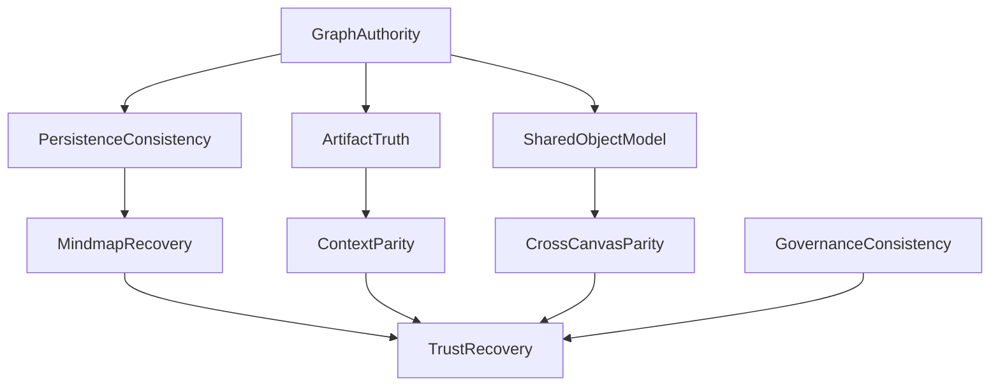

# Idea Workspace / Mindmap Integration Gap Report

**Date:** 2026-03-14  
**Purpose:** bridge the audit output into a repair-planning input pack without prescribing implementation details yet

## 1. Integration Baseline

What exists today:
- one workspace shell
- one persisted idea-map envelope
- four local tool runtimes
- one right-strip contract
- AI proposal review on selected paths
- backend validation and persistence routes

What does not exist yet:
- one runtime graph authority
- one consistent save/conflict contract across all four tools
- one unified artifact-link truth model
- one truly shared object model across Mindmap, Whiteboard, Process Flow, and Table

## 2. Gap Clusters

## 2.1 Graph Authority Gap

**Current state**
- live graph exists inside tool-local state
- shell keeps a shadow graph copy
- backend stores durable graph

**Gap**
- there is no single authoritative runtime graph

**Impact**
- stale reads
- partial saves
- overwrite risk
- panel/tool divergence

## 2.2 Persistence Contract Gap

**Current state**
- Mindmap uses `PUT /map`
- Whiteboard, Process Flow, and Table use `/map/sync`

**Gap**
- same workspace, different durability rules

**Impact**
- trust varies by active tool
- conflict handling is inconsistent
- extension durability is weak

## 2.3 Artifact Truth Gap

**Current state**
- API-backed attach/detach exists
- local node-based artifact links also exist
- `LinkGraph` exists

**Gap**
- not every visible artifact action updates the same source of truth

**Impact**
- node UI, context panel, and `LinkGraph` can drift
- object-level linking contract is only partially real

## 2.4 Shared Object Model Gap

**Current state**
- tools share one storage envelope
- validators normalize toward a canonical graph

**Gap**
- tool runtimes still author incompatible local semantics

**Impact**
- transforms are lossy
- parity across selections and inserts is incomplete
- `Canvas OS` remains scaffold-level

## 2.5 Governance Gap

**Current state**
- proposal review overlay exists
- replay metadata exists

**Gap**
- some AI-originated insertions bypass governed review

**Impact**
- inconsistent trust model
- mismatch with product promise

## 2.6 Promise Gap

**Current state**
- shell and chrome imply strong completion

**Gap**
- runtime maturity is lower than shell confidence

**Impact**
- user disappointment
- confusion over what is real vs draft

## 3. Dependency Order

## 4. Repair Planning Inputs

These are the inputs the future repair plan should respect.

### Input A

Do not start from visual polish. Start from graph authority and persistence consistency.

### Input B

Treat `Mindmap` as the first recovery surface because:
- it is the active user blocker
- it currently has the weakest save semantics
- it exposes the most obvious trust issues

### Input C

Do not repair artifact linking locally in one canvas only. Unify:
- attach
- detach
- open
- preview
- backlinks
- `LinkGraph`

### Input D

Do not claim `Canvas OS` completion until:
- insert parity is real
- selection parity is real
- refresh parity is real
- the shared object model is explicit

### Input E

Remove or downgrade any flow that remains `scaffold` but currently reads as production-ready.

## 5. Suggested Repair Workstreams

These are not tasks yet. They are planning buckets.

1. `Graph Authority`
   One runtime source of truth, one sync contract, one extension merge strategy.

2. `Mindmap Trust Recovery`
   Safe sync, tree/cross-link separation, rollback-safe inline creation, canonical root/growth semantics.

3. `Artifact Truth Unification`
   One attachment model across node UI, context panel, drawer, and backend graph truth.

4. `Cross-Canvas Parity`
   Insert, transform, refresh, and selection parity across all four systems.

5. `Governance Consistency`
   Same AI trust model across all material insertion/update paths.

6. `Promise Reduction and UX Honesty`
   Hide, relabel, or downgrade flows that remain partial or scaffold.

## 6. Exit Condition for the Future Repair Plan

The repair plan should not be considered complete when:
- labels exist
- panels open
- buttons are wired to toasts

It should be considered complete only when:
- runtime behavior is coherent
- state is durable
- artifact truth is unified
- the active Mindmap path is trustworthy
- the shared workspace promise matches actual runtime behavior
