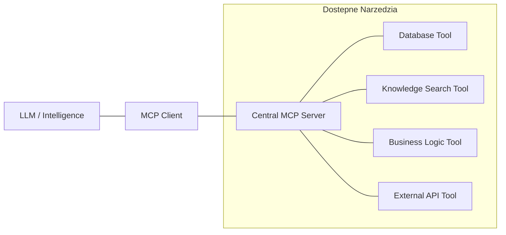

# Faza 7: MCP and Central Tool Server

## Executive Summary

Ten dokument definiuje implementację standardu **Model Context Protocol (MCP)** w Consultify. MCP służy jako ujednolicony interfejs między modelami LLM a zasobami platformy (bazami danych, API, systemem plików).

**Główne założenia:**
- **Centralized MCP Server:** Wszystkie narzędzia AI są zarządzane przez centralny serwer.
- **Tool Discovery:** AI dynamicznie wykrywa dostępne narzędzia.
- **Safety First:** Każde wywołanie narzędzia jest audytowane i sprawdzane pod kątem uprawnień.

---

## 1. Architektura MCP



### 1.1 Komponenty
1. **MCP Client:** Zintegrowany z AI Pipeline, odpowiedzialny za przesyłanie zapytania do serwera i odbiór wyników.
2. **Central MCP Server:** Serwer Node.js implementujący protokół MCP, hostujący logikę narzędzi.
3. **Tool Registry:** Rejestr wszystkich dostępnych narzędzi wraz z ich schematami JSON (zgodnie z OpenAI Tool Specification).

---

## 2. Specyfikacja Narzędzi (The Hands)

### 2.1 Database Tools
Pozwalają AI na bezpieczne odpytywanie bazy danych Consultify.

```json
{
  "name": "get_assessment_data",
  "description": "Pobiera szczegółowe dane z assessmentu dla danego projektu.",
  "parameters": {
    "type": "object",
    "properties": {
      "projectId": { "type": "string" },
      "axisId": { "type": "string", "description": "Opcjonalna oś DRD" }
    },
    "required": ["projectId"]
  }
}
```

### 2.2 Knowledge Tools
Dostęp do bazy wiedzy i metodologii DRD.

```json
{
  "name": "search_methodology",
  "description": "Przeszukuje bazę wiedzy metodologii DRD pod kątem konkretnego zagadnienia.",
  "parameters": {
    "type": "object",
    "properties": {
      "query": { "type": "string" },
      "category": { "type": "string", "enum": ["DRD", "ISO", "PMBOK"] }
    },
    "required": ["query"]
  }
}
```

### 2.3 Business Tools
Logika biznesowa i obliczenia.

```json
{
  "name": "calculate_initiative_roi",
  "description": "Oblicza przewidywany zwrot z inwestycji (ROI) dla zaproponowanej inicjatywy.",
  "parameters": {
    "type": "object",
    "properties": {
      "cost": { "type": "number" },
      "benefit": { "type": "number" },
      "timeframe_months": { "type": "number" }
    },
    "required": ["cost", "benefit"]
  }
}
```

---

## 3. Governance & Control Plane

### 3.1 Tool Access Control
Każde narzędzie posiada przypisaną politykę dostępu:
- **READ_ONLY:** Narzędzia tylko do odczytu (np. pobieranie statusu).
- **MUTATION:** Narzędzia zmieniające dane (np. tworzenie zadania) - **Zawsze wymaga potwierdzenia użytkownika**.
- **SENSITIVE:** Narzędzia operujące na danych PII (wymagają dodatkowego logowania).

### 3.2 Audit Trail
Każde wywołanie narzędzia przez AI jest zapisywane w `ai_audit_log`:
- `tool_name`
- `tool_args`
- `tool_result_summary`
- `execution_time`
- `status` (success/failure)

---

## 4. Implementacja (Node.js Example)

```typescript
import { McpServer } from "@modelcontextprotocol/sdk/server/mcp.js";
import { StdioServerTransport } from "@modelcontextprotocol/sdk/server/stdio.js";

const server = new McpServer({
  name: "Consultify Central Tool Server",
  version: "1.0.0"
});

// Rejestracja narzedzia
server.tool(
  "get_project_status",
  { projectId: z.string() },
  async ({ projectId }) => {
    const status = await db.projects.getStatus(projectId);
    return {
      content: [{ type: "text", text: JSON.stringify(status) }]
    };
  }
);

// Start serwera
const transport = new StdioServerTransport();
await server.connect(transport);
```

---

## 5. Korzyści z MCP w Consultify

1. **Agnostyczność:** AI może używać tych samych narzędzi niezależnie od tego, czy korzystamy z GPT-4o, Claude'a czy modelu lokalnego.
2. **Skalowalność:** Dodanie nowej funkcjonalności platformy wymaga jedynie zarejestrowania nowego narzędzia w MCP.
3. **Bezpieczeństwo:** Pełna separacja logiki AI od bezpośredniego dostępu do bazy danych.

---

*Document Version: 1.0*
*Last Updated: December 2024*
*Author: AI Research Team*


