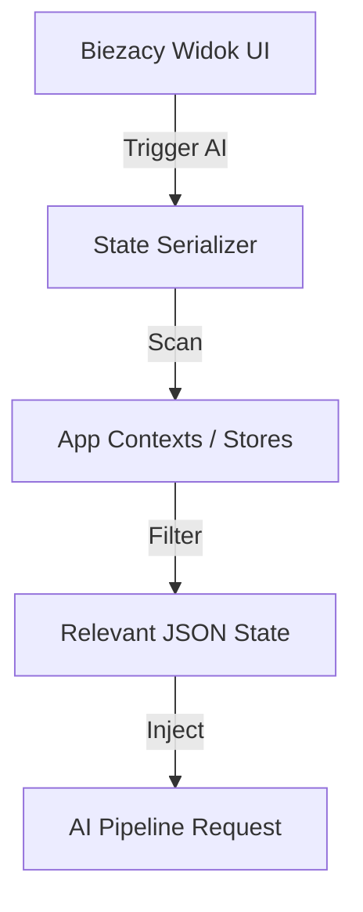

# Faza 8: Visual Context (Screen Awareness)

## Executive Summary

Ten dokument opisuje mechanizm **Visual Context**, który pozwala AI "widzieć" aktualny stan interfejsu użytkownika. Zamiast przesyłania obrazów (Vision), system wykorzystuje serializację stanu danych (JSON State Serialization), co jest bardziej wydajne i precyzyjne w kontekście danych biznesowych.

**Główne cele:**
- Dostarczenie AI precyzyjnych informacji o tym, co użytkownik widzi na ekranie.
- Eliminacja konieczności opisywania kontekstu przez użytkownika.
- Zapewnienie wysokiej wydajności (mały overhead danych).

---

## 1. Mechanizm Serializacji Stanu

### 1.1 Screen State Serializer (Frontend)
Moduł frontendowy odpowiedzialny za zbieranie danych z bazy stanów (np. React Context, Redux, bazy danych formularzy).



### 1.2 Struktura Kontekstu (JSON)
Każdy widok (Screen) posiada zdefiniowany schemat danych, które są przesyłane do AI.

**Przykład widoku Assessment:**
```json
{
  "screen_id": "assessment_view",
  "project_name": "Digital Transformation 2025",
  "active_tab": "data_management",
  "visible_data": {
    "current_score": 2.5,
    "target_score": 4.0,
    "gaps": ["Brak polityki zarządzania danymi", "Niska jakość metadanych"],
    "form_fields": {
      "justification": "Obecnie proces jest manualny...",
      "evidence": "Brak plików dowodowych"
    }
  }
}
```

---

## 2. Dynamiczne Wstrzykiwanie Kontekstu

W `AIPipeline` kontekst wizualny jest wstrzykiwany do system promptu w specjalnej sekcji.

### 2.1 Przykład System Promptu
```markdown
# SYSTEM CONTEXT
Jesteś Senior Consultantem Consultify. 

# CURRENT SCREEN STATE
Użytkownik znajduje się na ekranie: Assessment.
Projekt: "Digital Transformation 2025".
Dane widoczne dla użytkownika:
- Oś: Zarządzanie Danymi
- Wynik bieżący: 2.5
- Luka: 1.5

# USER QUERY
"Co mam tutaj wpisać, żeby podnieść wynik?"
```

---

## 3. Optymalizacja Kontekstu

Aby uniknąć przekroczenia limitu tokenów (Context Window), stosowane są następujące techniki:

1. **View-Specific Filtering:** Przesyłane są tylko dane istotne dla bieżącego widoku (np. na ekranie zadań nie przesyłamy danych o fakturach).
2. **Diffing:** Jeśli użytkownik prowadzi długą rozmowę w tym samym widoku, przesyłane są tylko zmiany (updates) w stanie.
3. **Summarization:** Bardzo duże zbiory danych (np. długa lista zadań) są skracane do statystyk i kluczowych elementów.

---

## 4. Mapowanie Widoków (Screen Maps)

| Widok (Screen ID) | Kluczowe dane JSON |
|-------------------|-------------------|
| `ASSESSMENT_VIEW` | Punkty, luki, uzasadnienia, wybrane osie |
| `INITIATIVES_BOARD` | Lista inicjatyw, statusy, priorytety, powiązane osie |
| `TASK_DETAIL` | Opis zadania, status, przypisana osoba, deadline, komentarze |
| `REPORT_BUILDER` | Wybrane sekcje raportu, status generowania, podgląd treści |
| `DASHBOARD_MAIN` | Kluczowe wskaźniki projektu, najbliższe kamienie milowe, alerty |

---

## 5. Bezpieczeństwo

- **Data Scrubbing:** Przed wysłaniem stanu do AI, moduł serializacji usuwa pola wrażliwe (hasła, klucze API, dane osobowe PII) zgodnie z polityką opisaną w `05_cost_security.md`.
- **Client-Side Control:** Użytkownik może zobaczyć (w trybie debugowania), jakie dane o jego ekranie są wysyłane do AI.

---

*Document Version: 1.0*
*Last Updated: December 2024*
*Author: AI Research Team*


