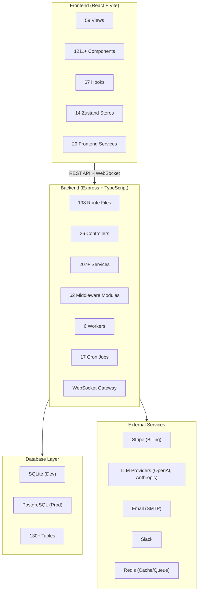
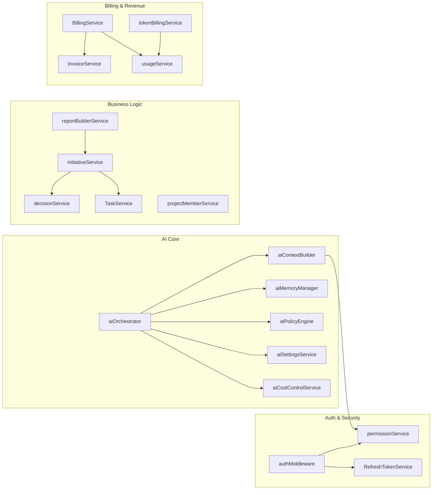
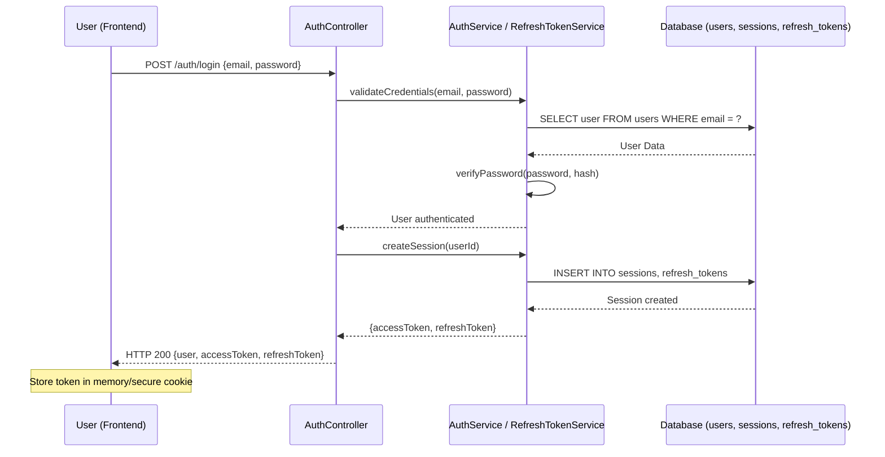
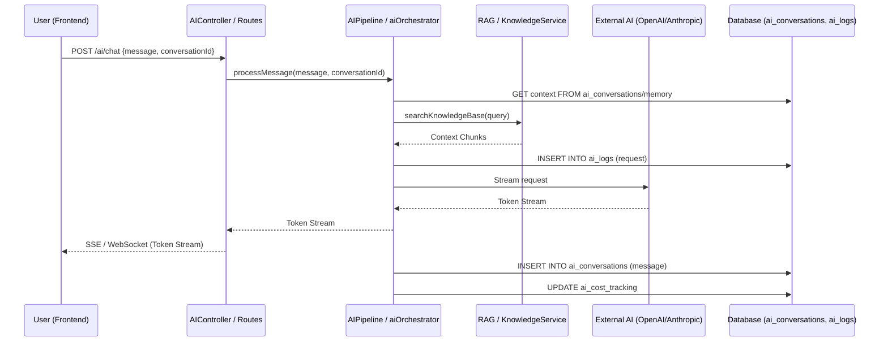
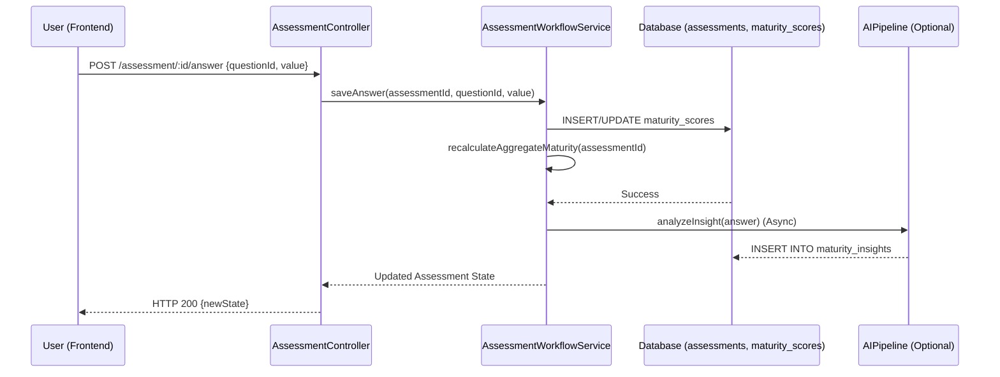
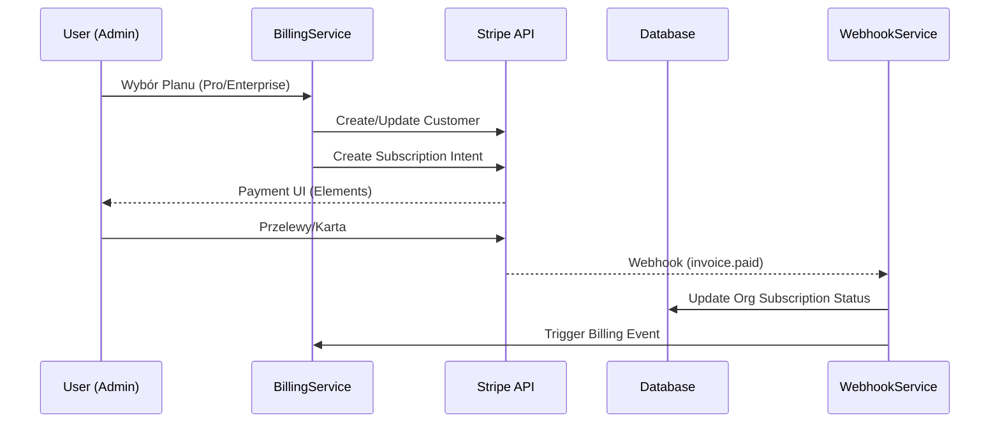

# 🗂️ Application Connection Map — IRIS 6.0 / Consultify

> **Last Updated:** 2026-02-12 | **Version:** 1.0 | **Status:** 📋 Initial Draft (living document)

---

## 1. Architektura Wysokiego Poziomu



---

## 2. Tabela Baz Danych — Pełna Lista Tabel (130+)

### 2.1 Core / Główne

| Tabela                 | Kolumny                                                                                                                                                                                                                                | Opis                                                   |
| ---------------------- | -------------------------------------------------------------------------------------------------------------------------------------------------------------------------------------------------------------------------------------- | ------------------------------------------------------ |
| `organizations`        | `id`, `name`, `status`, `billing_status`, `token_balance`, `created_by_user_id`, `is_active`, `ai_assertiveness_level`, `ai_autonomy_level`, `attribution_data`, `industry`, `domain`, `vat_number`, `onboarding_status`, `updated_at` | Główne dane organizacji i limity AI                    |
| `users`                | `id`, `first_name`, `last_name`, `email`, `role`, `status`, `organization_id`, `created_at`, `updated_at`                                                                                                                              | Dane użytkowników i ich role globalne                  |
| `organization_members` | `id`, `organization_id`, `user_id`, `role`, `status`, `invited_by_user_id`, `created_at`                                                                                                                                               | Mapowanie użytkowników do organizacji (wiele-do-wielu) |
| `projects`             | `id`, `name`, `current_phase`, `organization_id`, `owner_id`, `status`, `created_at`                                                                                                                                                   | Projekty transformacyjne                               |
| `tasks`                | `id`, `project_id`, `organization_id`, `name`, `status`, `priority`, `owner_id`, `due_date`                                                                                                                                            | Zadania wewnątrz projektów                             |

### 2.2 Auth & Security (PBAC)

| Tabela                 | Kolumny                                                                                     | Opis                                                                   |
| ---------------------- | ------------------------------------------------------------------------------------------- | ---------------------------------------------------------------------- |
| `permissions`          | `key`, `description`, `category`                                                            | Definicje wszystkich uprawnień w systemie                              |
| `role_permissions`     | `role`, `permission_key`                                                                    | Domyślne uprawnienia przypisane do ról (Owner, Admin, Member, etc.)    |
| `org_user_permissions` | `id`, `user_id`, `organization_id`, `permission_key`, `grant_type`                          | Nadpisywanie uprawnień (GRANT/REVOKE) dla konkretnego użytkownika      |
| `content_permissions`  | `id`, `content_id`, `content_type`, `user_id`, `permission_key`, `grant_type`, `expires_at` | Granularne uprawnienia do specyficznych zasobów (np. konkretny raport) |
| `revoked_tokens`       | `id`, `token`, `revoked_at`                                                                 | Odwołane tokeny JWT                                                    |
| `refresh_tokens`       | `id`, `user_id`, `token`, `expires_at`, `created_at`                                        | Tokeny odświeżające sesję                                              |
| `security_events`      | `id`, `organization_id`, `event_type`, `description`, `severity`, `ip_address`, `metadata`  | Audyt bezpieczeństwa                                                   |

### 2.3 AI System

| #   | Tabela                     | Moduł   | Relacje FK             | Opis                          |
| --- | -------------------------- | ------- | ---------------------- | ----------------------------- |
| 25  | `superadmin_ai_settings`   | AI      | —                      | Ustawienia AI SuperAdmin      |
| 26  | `organization_ai_settings` | AI      | → organizations        | Ustawienia AI per organizacja |
| 27  | `user_ai_settings`         | AI      | → users                | Ustawienia AI per user        |
| 28  | `ai_policies`              | AI      | → organizations        | Polityki AI                   |
| 29  | `ai_project_memory`        | AI      | → projects             | Pamięć AI per projekt         |
| 30  | `ai_organization_memory`   | AI      | → organizations        | Pamięć AI per organizacja     |
| 31  | `ai_user_memory`           | AI      | → users                | Pamięć AI per user            |
| 32  | `ai_partial_responses`     | AI      | → users                | Częściowe odpowiedzi AI       |
| 33  | `ai_audit_logs`            | AI      | → users, organizations | Logi audytowe AI              |
| 34  | `ai_system_prompts`        | AI      | → organizations        | System prompts AI             |
| 35  | `ai_knowledge_embeddings`  | AI/RAG  | → organizations        | Embeddingi wiedzy             |
| 36  | `ai_feature_control`       | AI      | → organizations        | Kontrola funkcji AI           |
| 37  | `ai_conversations`         | AI Chat | → users, organizations | Konwersacje AI                |
| 38  | `ai_cost_tracking`         | AI      | → organizations        | Śledzenie kosztów AI          |
| 39  | `ai_logs`                  | AI      | → users                | Logi AI                       |
| 40  | `ai_ideas`                 | AI      | → users, projects      | Pomysły generowane przez AI   |
| 41  | `ai_observations`          | AI      | → users                | Obserwacje AI                 |
| 42  | `ai_experiments`           | AI A/B  | → organizations        | Eksperymenty AI               |
| 43  | `ai_experiment_variants`   | AI A/B  | → ai_experiments       | Warianty eksperymentów AI     |
| 44  | `custom_prompts`           | AI      | → users, organizations | Niestandardowe prompty        |
| 45  | `usage_counters`           | AI      | → users, organizations | Liczniki użycia AI            |
| 46  | `circuit_breaker_state`    | AI      | —                      | Stan circuit breaker          |

### 2.4 Billing & Revenue

| #   | Tabela                             | Moduł   | Relacje FK           | Opis                            |
| --- | ---------------------------------- | ------- | -------------------- | ------------------------------- |
| 47  | `subscription_plans`               | Billing | —                    | Plany subskrypcyjne             |
| 48  | `organization_billing`             | Billing | → organizations      | Dane rozliczeniowe org          |
| 49  | `usage_records`                    | Billing | → organizations      | Rekordy użycia                  |
| 50  | `usage_summaries`                  | Billing | → organizations      | Podsumowania użycia             |
| 51  | `invoices`                         | Billing | → organizations      | Faktury                         |
| 52  | `plan_features`                    | Billing | → subscription_plans | Cechy planów                    |
| 53  | `spending_alerts`                  | Billing | → organizations      | Alerty wydatków                 |
| 54  | `stripe_events`                    | Billing | —                    | Zdarzenia Stripe                |
| 55  | `payment_attempts`                 | Billing | → invoices           | Próby płatności                 |
| 56  | `dunning_states`                   | Billing | → organizations      | Stany windykacji                |
| 57  | `subscription_state_history`       | Billing | → organizations      | Historia zmian subskrypcji      |
| 58  | `checkout_sessions`                | Billing | → organizations      | Sesje checkout                  |
| 59  | `proration_records`                | Billing | → organizations      | Rekordy proporcjonalne          |
| 60  | `billing_usage_events`             | Billing | → organizations      | Zdarzenia billingowe            |
| 61  | `billing_credits`                  | Billing | → organizations      | Kredyty rozliczeniowe           |
| 62  | `billing_email_queue`              | Billing | → organizations      | Kolejka e-maili billing         |
| 63  | `billing_notification_preferences` | Billing | → organizations      | Preferencje powiadomień billing |
| 64  | `billing_disputes`                 | Billing | → invoices           | Spory rozliczeniowe             |
| 65  | `billing_refunds`                  | Billing | → invoices           | Zwroty                          |
| 66  | `token_ledger`                     | Billing | → organizations      | Księga tokenów                  |
| 67  | `payment_methods`                  | Billing | → organizations      | Metody płatności                |
| 68  | `organization_seats`               | Billing | → organizations      | Licencje/stanowiska             |
| 69  | `organization_limits`              | Billing | → organizations      | Limity organizacji              |

### 2.5 Content & Knowledge

| #   | Tabela                        | Moduł      | Relacje FK                | Opis                  |
| --- | ----------------------------- | ---------- | ------------------------- | --------------------- |
| 70  | `maturity_assessments`        | Assessment | → projects, organizations | Oceny dojrzałości     |
| 71  | `maturity_scores`             | Assessment | → maturity_assessments    | Wyniki dojrzałości    |
| 72  | `multi_framework_assessments` | Assessment | → organizations           | Oceny wieloramowe     |
| 73  | `rapid_lean_assessments`      | Assessment | → organizations           | Oceny Lean            |
| 74  | `client_context`              | Context    | → organizations           | Kontekst klienta      |
| 75  | `knowledge_docs`              | Knowledge  | → organizations           | Dokumenty wiedzy      |
| 76  | `knowledge_chunks`            | Knowledge  | → knowledge_docs          | Fragmenty wiedzy      |
| 77  | `megatrends`                  | Strategy   | —                         | Megatrendy            |
| 78  | `custom_trends`               | Strategy   | → organizations           | Trendy niestandardowe |
| 79  | `reports`                     | Reports    | → projects, organizations | Raporty               |
| 80  | `report_blocks`               | Reports    | → reports                 | Bloki raportów        |
| 81  | `report_snapshots`            | Reports    | → reports                 | Snapshoty raportów    |

### 2.6 Admin & System

| #   | Tabela                     | Moduł   | Relacje FK                 | Opis                    |
| --- | -------------------------- | ------- | -------------------------- | ----------------------- |
| 82  | `admin_audit_logs`         | Admin   | → users                    | Logi audytowe admin     |
| 83  | `admin_sessions`           | Admin   | → users                    | Sesje admin             |
| 84  | `admin_approval_workflows` | Admin   | → organizations            | Workflows zatwierdzania |
| 85  | `admin_approval_requests`  | Admin   | → admin_approval_workflows | Wnioski o zatwierdzenie |
| 86  | `admin_dashboards`         | Admin   | → organizations            | Dashboardy admin        |
| 87  | `admin_saved_reports`      | Admin   | → users                    | Zapisane raporty admin  |
| 88  | `admin_report_executions`  | Admin   | → admin_saved_reports      | Wykonania raportów      |
| 89  | `system_feedback`          | Support | → users                    | Feedback systemowy      |
| 90  | `system_metrics`           | System  | —                          | Metryki systemowe       |
| 91  | `system_config`            | System  | —                          | Konfiguracja systemowa  |
| 92  | `user_api_keys`            | API     | → users                    | Klucze API użytkowników |

### 2.7 Integrations & External

| #   | Tabela                  | Moduł       | Relacje FK      | Opis                  |
| --- | ----------------------- | ----------- | --------------- | --------------------- |
| 93  | `webhooks`              | Integration | → organizations | Definicje webhooków   |
| 94  | `webhook_deliveries`    | Integration | → webhooks      | Dostawy webhooków     |
| 95  | `integrations`          | Integration | → organizations | Integracje zewnętrzne |
| 96  | `integration_sync_logs` | Integration | → integrations  | Logi synchronizacji   |
| 97  | `help_events`           | Help        | → users         | Zdarzenia pomocy      |
| 98  | `organization_events`   | Events      | → organizations | Zdarzenia organizacji |

---

## 3. Mapa Route → Controller → Service → Tabele DB

### 3.1 Core Business Flows

| Route File                     | Controller             | Service(s)                                               | Tabele DB                                                           | Flow                   |
| ------------------------------ | ---------------------- | -------------------------------------------------------- | ------------------------------------------------------------------- | ---------------------- |
| `auth.routes.ts`               | `AuthController`       | `RefreshTokenService`, `MFAService`                      | `users`, `sessions`, `refresh_tokens`, `revoked_tokens`             | Login → JWT → Session  |
| `settings.routes.ts`           | — (inline)             | `aiSettingsService`                                      | `settings`, `user_ai_settings`, `organization_ai_settings`          | User/Org settings CRUD |
| `ai.routes.ts`                 | AI Controllers         | `aiOrchestrator`, `aiContextBuilder`, `aiMemoryManager`  | `ai_conversations`, `ai_logs`, `ai_user_memory`, `ai_cost_tracking` | AI Chat Full Flow      |
| `conversations.routes.ts`      | —                      | `aiOrchestrator`                                         | `ai_conversations`                                                  | Conversation CRUD      |
| `assessment-reports.routes.ts` | `AssessmentController` | `assessmentPermissionService`, `reportGenerationService` | `maturity_assessments`, `maturity_scores`, `reports`                | Assessment → Report    |
| `initiatives.routes.ts`        | `InitiativeController` | `initiativeService`, `initiativeTemplateService`         | `initiatives`, `tasks`                                              | Initiative lifecycle   |
| `decisions.routes.ts`          | `DecisionController`   | `decisionService`, `decisionDelegationService`           | `tasks`, `activity_logs`                                            | Decision approval      |
| `billing.routes.ts`            | —                      | `BillingService`, `InvoiceService`                       | `organization_billing`, `invoices`, `subscription_plans`            | Subscription lifecycle |
| `partners.routes.ts`           | —                      | `partnerService`, `partnerReferralService`               | `organizations`                                                     | Partner management     |
| `superadmin.routes.ts`         | `SuperAdminController` | Multi-service                                            | All admin tables                                                    | SuperAdmin panel       |

### 3.2 AI System Flows

| Route File               | Service(s)                                                  | Tabele DB                                                                | Opis                    |
| ------------------------ | ----------------------------------------------------------- | ------------------------------------------------------------------------ | ----------------------- |
| `ai.routes.ts` (175KB!)  | `aiOrchestrator`, `aiContextBuilder`, `aiSuggestionService` | `ai_conversations`, `ai_logs`, `ai_cost_tracking`                        | Główny endpoint AI chat |
| `ai-analytics.routes.ts` | `aiAnalyticsService`                                        | `ai_logs`, `ai_cost_tracking`                                            | Analityka AI            |
| `ai-budgets.routes.ts`   | `aiBudgetService`, `aiCostControlService`                   | `ai_cost_tracking`, `token_ledger`                                       | Budżety AI              |
| `ai-settings.routes.ts`  | `aiSettingsService`                                         | `superadmin_ai_settings`, `organization_ai_settings`, `user_ai_settings` | Ustawienia AI 3-level   |
| `ai-feedback.routes.ts`  | `feedbackAIService`                                         | `ai_logs`, `system_feedback`                                             | Feedback loop AI        |
| `ai-prompts.routes.ts`   | —                                                           | `custom_prompts`, `ai_system_prompts`                                    | Zarządzanie promptami   |
| `aiMemory.routes.ts`     | `aiMemoryManager`                                           | `ai_user_memory`, `ai_project_memory`, `ai_organization_memory`          | Pamięć kontekstowa AI   |
| `aiPlaybooks.routes.ts`  | —                                                           | `ai_system_prompts`                                                      | Playbooki AI            |
| `knowledge.routes.ts`    | `KnowledgeService`, `ragService`                            | `knowledge_docs`, `knowledge_chunks`, `ai_knowledge_embeddings`          | RAG pipeline            |

### 3.3 Billing & Revenue Flows

| Route File               | Service(s)                                | Tabele DB                                                     | Opis                 |
| ------------------------ | ----------------------------------------- | ------------------------------------------------------------- | -------------------- |
| `billing.routes.ts`      | `BillingService`, `BillingWebhookService` | `organization_billing`, `subscription_plans`, `stripe_events` | Cykl subskrypcji     |
| `tokenBilling.routes.ts` | `tokenBillingService`                     | `token_ledger`, `billing_usage_events`                        | Pay-as-you-go tokens |
| `economics.routes.ts`    | `economicsFinancials`                     | `usage_records`, `usage_summaries`, `invoices`                | Ekonomika projektu   |
| `revenue.routes.ts`      | `partnerCommissionService`                | `invoices`, `organization_billing`                            | Revenue & prowizje   |

---

## 4. Frontend — Mapa View → Store → API → Backend

### 4.1 Główne Widoki (Views)

| Frontend Route               | View Component                | Store(s)                                 | Backend API                                     | Access     |
| ---------------------------- | ----------------------------- | ---------------------------------------- | ----------------------------------------------- | ---------- |
| `/`                          | `ProductEntryPage`            | `useAppStore`                            | —                                               | Public     |
| `/login`                     | `AuthView`                    | `useAppStore`                            | `auth.routes.ts`                                | Public     |
| `/register`                  | `AuthView`                    | `useAppStore`                            | `auth.routes.ts`                                | Public     |
| `/chat`                      | `AIChatWelcomeView`           | `useConversationStore`, `useAppStore`    | `ai.routes.ts`, `conversations.routes.ts`       | Protected  |
| `/chat/:conversationId`      | `AIChatWelcomeView`           | `useConversationStore`                   | `ai.routes.ts`                                  | Protected  |
| `/my-work`                   | `MyWorkView`                  | `useAppStore`                            | `my-work.routes.ts`                             | Protected  |
| `/studio`                    | `StudioView`                  | `useAppStore`                            | `studio.routes.ts`                              | Protected  |
| `/interview`                 | `InterviewHub`                | `useDiscoveryStore`                      | `interview.routes.ts`                           | Protected  |
| `/discovery`                 | `InterviewHub`                | `useDiscoveryStore`                      | `interview.routes.ts`                           | Protected  |
| `/context-builder/*`         | `ContextBuilderView`          | `useContextBuilderStore`                 | `context.routes.ts`                             | Protected  |
| `/assessment/*`              | `AssessmentHub`               | `useMultiFrameworkStore`                 | `assessment-*.routes.ts`                        | Protected  |
| `/assessment/:framework/:id` | `AssessmentSessionEditorView` | `useMultiFrameworkStore`, `useToolStore` | `assessment-workflow-v2.routes.ts`              | Protected  |
| `/initiatives`               | `InitiativesHub`              | `useAppStore`                            | `initiatives.routes.ts`                         | Protected  |
| `/roadmap`                   | `FullRoadmapView`             | `useAppStore`                            | `roadmap.routes.ts`                             | Protected  |
| `/portfolio`                 | `PortfolioView`               | `portfolioSlice`                         | `analytics.routes.ts`                           | Protected  |
| `/roi`                       | `FullROIView`                 | —                                        | `economics.routes.ts`                           | Protected  |
| `/economics`                 | `EconomicsView`               | —                                        | `economics.routes.ts`                           | Protected  |
| `/execution`                 | `ExecutionHub`                | —                                        | `execution.routes.ts`                           | Protected  |
| `/implementation`            | `ImplementationView`          | —                                        | `execution.routes.ts`                           | Protected  |
| `/rollout`                   | `FullRolloutView`             | —                                        | —                                               | Protected  |
| `/reports/builder`           | `ReportBuilderView`           | —                                        | `report-builder.routes.ts`                      | Protected  |
| `/reports/builder/:id`       | `ReportBuilderView`           | —                                        | `report-builder.routes.ts`                      | Protected  |
| `/kpi-okr`                   | `KpiOkrView`                  | —                                        | `metrics.routes.ts`                             | Protected  |
| `/benefits`                  | `BenefitsHub`                 | —                                        | `analytics.routes.ts`                           | Protected  |
| `/settings/*`                | `SettingsView`                | `useAppStore`                            | `settings.routes.ts`, `user/*.routes.ts`        | Protected  |
| `/admin/*`                   | `AdminView`                   | `useAppStore`                            | `admin-data.routes.ts`, `adminAlerts.routes.ts` | ADMIN      |
| `/superadmin/*`              | `SuperAdminView`              | `useAppStore`                            | `superadmin.routes.ts`                          | SUPERADMIN |
| `/partner/*`                 | `PartnerPortalViewNew`        | —                                        | `partners.routes.ts`                            | Protected  |
| `/discovery-tools`           | `DiscoveryToolsHub`           | `useToolStore`                           | `tools.routes.ts`                               | Protected  |
| `/ai-actions`                | `ActionProposalView`          | `useAIActionsStore`                      | `ai.routes.ts`                                  | Protected  |
| `/consultant/*`              | `ConsultantPanelView`         | —                                        | `consultants.routes.ts`                         | Protected  |
| `/org-setup`                 | `OrgSetupWizard`              | `useAppStore`                            | `organizations.routes.ts`                       | Protected  |
| `/onboarding`                | `OnboardingWizard`            | —                                        | `onboarding.routes.ts`                          | Protected  |
| `/trial-entry`               | `TrialEntryView`              | —                                        | `trial.routes.ts`                               | Public     |
| `/affiliate`                 | `AffiliateDashboardView`      | —                                        | `partners.routes.ts`                            | Protected  |
| `/pricing`                   | `AppPricingView`              | —                                        | —                                               | Public     |
| `/knowledge-base`            | `KnowledgeBaseView`           | `useKnowledge` (hook)                    | `knowledge.routes.ts`                           | Public     |
| `/executive`                 | `ExecutiveView`               | —                                        | `analytics.routes.ts`                           | Protected  |
| `/status`                    | `StatusPageView`              | —                                        | `health.routes.ts`                              | Public     |
| `/changelog`                 | `ChangelogView`               | —                                        | —                                               | Public     |
| `/docs/*`                    | `DocsLayout` + views          | `useDocs` (hook)                         | —                                               | Public     |
| `/tools`                     | `ToolsShowcasePage`           | —                                        | —                                               | Public     |
| `/audits`                    | `AuditsShowcasePage`          | —                                        | —                                               | Public     |
| `/about`                     | `AboutView`                   | —                                        | —                                               | Public     |
| `/contact`                   | `ContactView`                 | —                                        | —                                               | Public     |
| `/terms`                     | `TermsOfServiceView`          | —                                        | —                                               | Public     |
| `/privacy`                   | `PrivacyPolicyView`           | —                                        | —                                               | Public     |
| `/cookies`                   | `CookiePolicyView`            | —                                        | —                                               | Public     |
| `/security`                  | `SecurityView`                | —                                        | —                                               | Public     |

### 4.2 Zustand Stores — Opis i Połączenia

| Store                    | Plik                        | Główne dane                                   | Używany przez                          |
| ------------------------ | --------------------------- | --------------------------------------------- | -------------------------------------- |
| `useAppStore`            | `useAppStore.ts`            | currentUser, theme, currentView, organization | Globalnie — App, AppRoutes, MainLayout |
| `useConversationStore`   | `useConversationStore.ts`   | conversations, messages, activeConversation   | AIChat, ConversationRouteSync          |
| `useToolStore`           | `useToolStore.ts`           | tools, assessments, frameworkData             | DiscoveryToolsHub, Assessment          |
| `useDiscoveryStore`      | `useDiscoveryStore.ts`      | interview sessions, canvas data               | InterviewHub, DiscoveryConsultant      |
| `useContextBuilderStore` | `useContextBuilderStore.ts` | profile, goals, challenges, strategy          | ContextBuilderView                     |
| `useMultiFrameworkStore` | `useMultiFrameworkStore.ts` | framework assessments, scores                 | AssessmentHub, SessionEditor           |
| `useAIActionsStore`      | `useAIActionsStore.ts`      | proposals, executions                         | ActionProposalView                     |
| `useArtifactsStore`      | `useArtifactsStore.ts`      | generated artifacts from AI                   | AIChat                                 |
| `useChatProjectStore`    | `useChatProjectStore.ts`    | chat-linked project data                      | AIChat, Initiatives                    |
| `usePMOStore`            | `usePMOStore.ts`            | PMO domains, standards                        | PMO views                              |
| `megatrendStore`         | `megatrendStore.ts`         | megatrends data                               | ContextBuilder, Strategy               |
| `portfolioSlice`         | `portfolioSlice.ts`         | portfolio metrics                             | PortfolioView                          |

---

## 5. Middleware Pipeline — Warstwa Zabezpieczeń

```
Request → securityHeaders → rateLimiting → csrf → inputSanitization
       → auth.middleware → orgContext → permission/rbac
       → featureGate → quota → [Route Handler]
       → auditLog → metrics → errorHandler → Response
```

| Middleware         | Plik                              | Zakres            | Opis                         |
| ------------------ | --------------------------------- | ----------------- | ---------------------------- |
| Security Headers   | `securityHeaders.middleware.ts`   | Global            | CSP, HSTS, X-Frame-Options   |
| Rate Limiting      | `rateLimiting.middleware.ts`      | Global            | Throttling per IP/user       |
| CSRF               | `csrf.middleware.ts`              | Mutations         | Ochrona CSRF                 |
| Input Sanitization | `inputSanitization.middleware.ts` | Global            | XSS prevention               |
| Auth               | `auth.middleware.ts`              | Protected routes  | JWT verification             |
| Org Context        | `orgContext.middleware.ts`        | Protected routes  | Inject organization into req |
| Permission         | `permission.middleware.ts`        | Varies            | RBAC permission check        |
| RBAC               | `rbac.middleware.ts`              | Varies            | Role-based access            |
| Feature Gate       | `featureGate.middleware.ts`       | Varies            | Plan-based feature toggling  |
| Quota              | `quota.middleware.ts`             | AI, Billing       | Usage limits enforcement     |
| Resource Quota     | `resourceQuota.middleware.ts`     | CRUD              | Per-resource limits          |
| Project Quota      | `projectQuota.middleware.ts`      | Projects          | Max project limits           |
| Plan Limits        | `planLimits.middleware.ts`        | Billing           | Plan-based limits            |
| Admin              | `admin.middleware.ts`             | /admin/\*         | Admin role check             |
| SuperAdmin         | `superAdmin.middleware.ts`        | /superadmin/\*    | SuperAdmin role check        |
| Demo Guard         | `demoGuard.middleware.ts`         | Demo mode         | Restricts writes in demo     |
| API Key Auth       | `apiKeyAuth.middleware.ts`        | API routes        | API key authentication       |
| API Version        | `apiVersion.middleware.ts`        | API routes        | API versioning (v1/v2)       |
| Audit Log          | `auditLog.middleware.ts`          | Mutations         | Audit trail                  |
| Metrics            | `metrics.middleware.ts`           | Global            | Performance metrics          |
| PII Encryption     | `piiEncryption.middleware.ts`     | Sensitive data    | PII field encryption         |
| Assessment RBAC    | `assessmentRBAC.ts`               | Assessment routes | Framework-level permissions  |
| PMO Validation     | `pmoValidation.middleware.ts`     | PMO routes        | PMO field validation         |
| Trial Entry Guard  | `trialEntryGuard.middleware.ts`   | Trial routes      | Trial eligibility check      |
| User State Guard   | `userStateGuard.middleware.ts`    | Protected routes  | User status/state validation |

---

## 6. Service Dependencies — Kluczowe Połączenia Serwisów



---

## 7. WebSocket / Real-time Connections

| Gateway                | Events                                             | Services                                | Opis                   |
| ---------------------- | -------------------------------------------------- | --------------------------------------- | ---------------------- |
| `Gateway.ts` (main)    | `chat:stream`, `notification:new`, `status:update` | `aiOrchestrator`, `notificationService` | Główny WebSocket hub   |
| `dashboard.gateway.ts` | `dashboard:update`                                 | `dashboardBuilderService`               | Aktualizacje dashboard |

---

## 8. Cron Jobs / Background Workers

| Plik                     | Schedule | Service          | Opis                              |
| ------------------------ | -------- | ---------------- | --------------------------------- |
| `InvoiceReminderCron.ts` | Daily    | `InvoiceService` | Przypomnienia o fakturach         |
| Remaining 16 cron files  | Various  | Various          | Cleanup, analytics, health checks |

---

## 9. Integracje Zewnętrzne

| Integracja    | Protokół     | Service                                   | Route               | Opis                   |
| ------------- | ------------ | ----------------------------------------- | ------------------- | ---------------------- |
| **Stripe**    | REST/Webhook | `BillingService`, `BillingWebhookService` | `billing.routes.ts` | Płatności, subskrypcje |
| **OpenAI**    | REST         | `aiOrchestrator`                          | `ai.routes.ts`      | GPT-4, embeddings      |
| **Anthropic** | REST         | `aiOrchestrator`                          | `ai.routes.ts`      | Claude                 |
| **SMTP**      | SMTP         | `emailService`, `welcomeEmailService`     | Background          | E-maile transakcyjne   |
| **Slack**     | REST/Webhook | `slackService`                            | `integrations/`     | Notyfikacje Slack      |
| **Redis**     | TCP          | `redis/` service dir                      | N/A                 | Cache, queues, pub/sub |

---

## 10. Diagram Relacji DB — Główne Encje

```mermaid
erDiagram
    organizations ||--o{ users : "has many"
    organizations ||--o{ projects : "has many"
    organizations ||--o{ organization_billing : "has one"
    organizations ||--o{ teams : "has many"
    organizations ||--o{ invitations : "has many"
    organizations ||--o{ organization_ai_settings : "has one"
    organizations ||--o{ integrations : "has many"
    organizations ||--o{ webhooks : "has many"

    users ||--o{ sessions : "has many"
    users ||--o{ refresh_tokens : "has many"
    users ||--o{ notifications : "has many"
    users ||--o{ user_ai_settings : "has one"
    users ||--o{ ai_conversations : "has many"
    users ||--o{ ai_user_memory : "has many"
    users ||--o{ user_api_keys : "has many"

    projects ||--o{ tasks : "has many"
    projects ||--o{ initiatives : "has many"
    projects ||--o{ maturity_assessments : "has many"
    projects ||--o{ reports : "has many"
    projects ||--o{ ai_project_memory : "has many"

    tasks ||--o{ task_comments : "has many"
    tasks ||--o{ task_dependencies : "depends on"

    reports ||--o{ report_blocks : "has many"
    reports ||--o{ report_snapshots : "has many"

    organization_billing ||--o{ invoices : "has many"
    invoices ||--o{ payment_attempts : "has many"

    knowledge_docs ||--o{ knowledge_chunks : "has many"
    ai_experiments ||--o{ ai_experiment_variants : "has many"
    webhooks ||--o{ webhook_deliveries : "has many"
    integrations ||--o{ integration_sync_logs : "has many"
```



---

---

## 5. Sequence Diagrams — Key System Flows

### 5.1 User Login & Session Flow



### 5.2 AI Chat Request Flow (Streaming)



### 5.3 Assessment Execution Flow



---

## 11. API Endpoint Map — Core Modules

### 11.1 Authentication (`auth.routes.ts`)

| Metoda   | Endpoint             | Opis                                     | Auth   |
| -------- | -------------------- | ---------------------------------------- | ------ |
| `POST`   | `/auth/login`        | Logowanie użytkownika                    | Public |
| `POST`   | `/auth/refresh`      | Odświeżenie tokenu JWT                   | Public |
| `GET`    | `/auth/me`           | Pobranie danych zalogowanego użytkownika | JWT    |
| `POST`   | `/auth/logout`       | Wylogowanie (unieważnienie tokenu)       | JWT    |
| `POST`   | `/auth/register`     | Rejestracja nowej organizacji            | Public |
| `POST`   | `/auth/demo-login`   | Logowanie demo                           | Public |
| `GET`    | `/auth/sessions`     | Lista aktywnych sesji                    | JWT    |
| `DELETE` | `/auth/sessions/:id` | Usunięcie sesji                          | JWT    |

### 11.2 AI System (`ai.routes.ts`)

| Metoda | Endpoint                    | Opis                                        | Auth      |
| ------ | --------------------------- | ------------------------------------------- | --------- |
| `POST` | `/ai/chat/stream`           | Streaming chat AI (SSE/Tokeny)              | JWT + Org |
| `POST` | `/ai/chat/confirm`          | Walidacja zrozumienia taska (Deep Thinking) | JWT + Org |
| `GET`  | `/ai/context`               | Budowanie kontekstu dla AI                  | JWT + Org |
| `POST` | `/ai/deep-research/clarify` | Generowanie pytań doprecyzowujących         | JWT + Org |
| `POST` | `/ai/engagement-summary`    | Generowanie podsumowań zaangażowania        | JWT + Org |
| `POST` | `/ai/benchmarks/compare`    | Porównanie z benchmarkami branżowymi        | JWT + Org |
| `POST` | `/ai/attachments/ingest`    | Ingestowanie plików do chatu                | JWT + Org |

### 11.3 Assessment Workflow (`assessment-workflow-v2.routes.ts`)

| Metoda | Endpoint                                           | Opis                           | Auth         |
| ------ | -------------------------------------------------- | ------------------------------ | ------------ |
| `GET`  | `/assessment-workflow-v2`                          | Lista ocen dojrzałości         | JWT + Org    |
| `POST` | `/assessment-workflow-v2`                          | Tworzenie nowej oceny          | Admin        |
| `GET`  | `/assessment-workflow-v2/:id`                      | Pobranie detali oceny          | JWT (View)   |
| `PUT`  | `/assessment-workflow-v2/:id`                      | Aktualizacja danych oceny      | JWT (Edit)   |
| `POST` | `/assessment-workflow-v2/:id/request-review`       | Przejście DRAFT -> REVIEW      | JWT (Status) |
| `POST` | `/assessment-workflow-v2/:id/report`               | Generowanie raportu PDF/JSON   | JWT (Edit)   |
| `POST` | `/assessment-workflow-v2/:id/report/approve`       | Zatwierdzenie raportu          | Admin/PMO    |
| `POST` | `/assessment-workflow-v2/:id/approve`              | Zatwierdzenie oceny (APPROVED) | Admin/PMO    |
| `POST` | `/assessment-workflow-v2/:id/generate-initiatives` | Generowanie inicjatyw z oceny  | JWT (Gen)    |

## 12. Cykl Życia Billing & Subscriptions

Aplikacja wykorzystuje model subskrypcyjny zintegrowany ze Stripe.

### 12.1 Przepływ Subskrypcji



### 12.2 Kluczowe Zdarzenia Billingowe (`BillingWebhookService.ts`)

- `subscription.created`: Inicjalizacja planu dla nowej organizacji.
- `invoice.paid`: Przedłużenie ważności konta, generowanie faktury w systemie.
- `invoice.payment_failed`: Rozpoczęcie procesu Dunning (przypomnienia o płatności).

---

## 13. Integracje Zewnętrzne — Połączenia

| Usługa              | Moduł               | Zastosowanie                               |
| ------------------- | ------------------- | ------------------------------------------ |
| **Stripe**          | `BillingService.ts` | Płatności, faktury, subskrypcje            |
| **OpenAI / Gemini** | `llmService.ts`     | Silnik AI, Deep Research, Analiza          |
| **Slack**           | `slackService.ts`   | Powiadomienia o alarmach i zatwierdzeniach |

---

## 14. Zadania Cykliczne (Cron & Workers)

Lokalizacja: `server/src/cron/`

- **BillingCron**: Sprawdzanie wygasających subskrypcji.
- **DunningCron**: Automatyczne ponowienia płatności.
- **ReportGenerationJob**: Asynchroniczne generowanie raportów PDF.
- **CleanupRevokedTokens**: Czyszczenie wygasłych tokenów z bazy.

---

## 15. System i18n (Internationalization)

Aplikacja wspiera wielojęzyczność (9 języków).

- **Frontend**: [i18next](https://www.i18next.com/)
  - Pliki translacji: [public/locales/](file:///Users/piotrwisniewski/Documents/Antygracity/DRD/consultify/public/locales/)
  - Główne języki: EN, PL, DE, ES, AR, JA, FR, UK.
- **AI Backend**: Dynamiczne instruowanie modeli LLM na podstawie języka użytkownika (`languageInstruction`).

---

## 16. Infrastruktura Testowa i Jakość (QA)

System posiada rygorystyczne progi pokrycia testami (thresholds).

| Typ Testu       | Narzędzie                             | Zakres                            |
| --------------- | ------------------------------------- | --------------------------------- |
| **Unit/Logic**  | [Vitest](https://vitest.dev/)         | Logika biznesowa, Services, Utils |
| **Integration** | [Vitest](https://vitest.dev/)         | API Endpoints + DB (SQLite/PG)    |
| **E2E/Visual**  | [Playwright](https://playwright.dev/) | Krytyczne flows, UI Regression    |

**Krytyczne progi pokrycia (`vitest.config.ts`):**

- Globalne: 85% (Statements, Branches, Functions).
- Security ([accessPolicyService.ts](file:///Users/piotrwisniewski/Documents/Antygracity/DRD/consultify/server/src/services/accessPolicyService.ts)): **95%+**.

---

## 17. Deployment i Infrastruktura (CI/CD)

- **Platforma**: [Railway](https://railway.app/)
- **Konteneryzacja**: [Docker](file:///Users/piotrwisniewski/Documents/Antygracity/DRD/consultify/Dockerfile)
- **CI/CD**: GitHub Actions (Lint -> Type-Check -> Test:All -> Security -> Deploy)

---

## Podsumowanie Architektoniczne

Dokument ten stanowi kompletny obraz połączeń w aplikacji Consultinity IRIS 6.0. Każda zmiana w logice biznesowej powinna odzwierciedlać aktualizację w odpowiedniej sekcji.

> 📌 **Ten dokument jest dokumentem żywym** — ostatnia aktualizacja: 2026-02-12.
