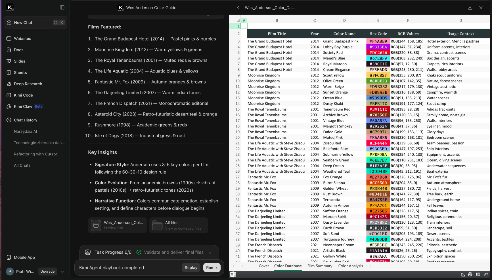
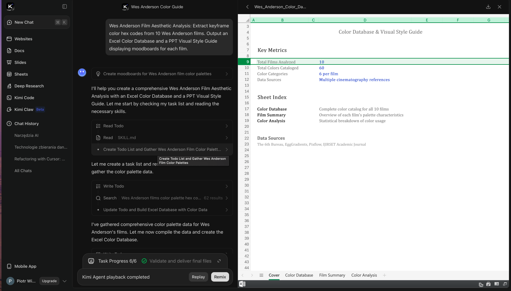
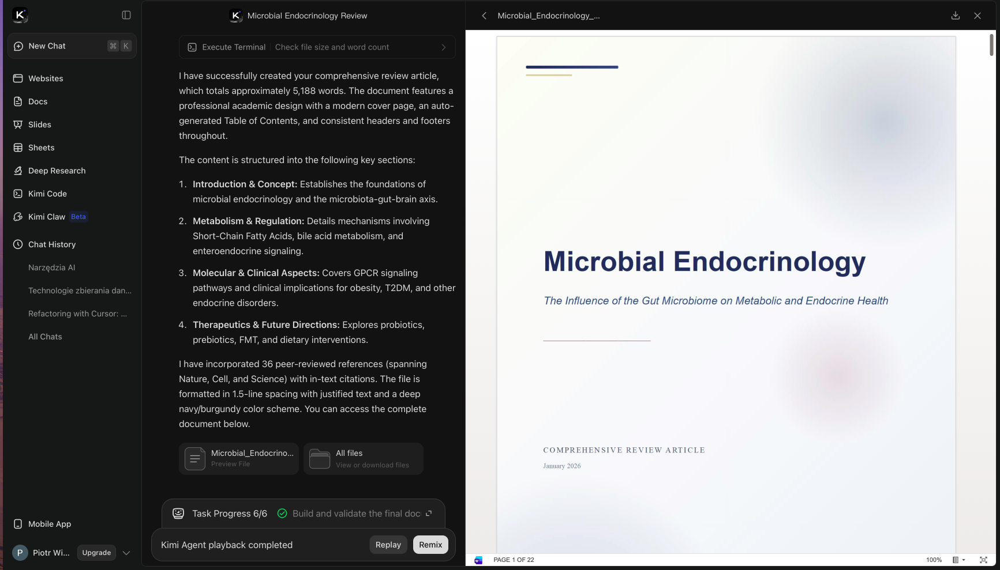
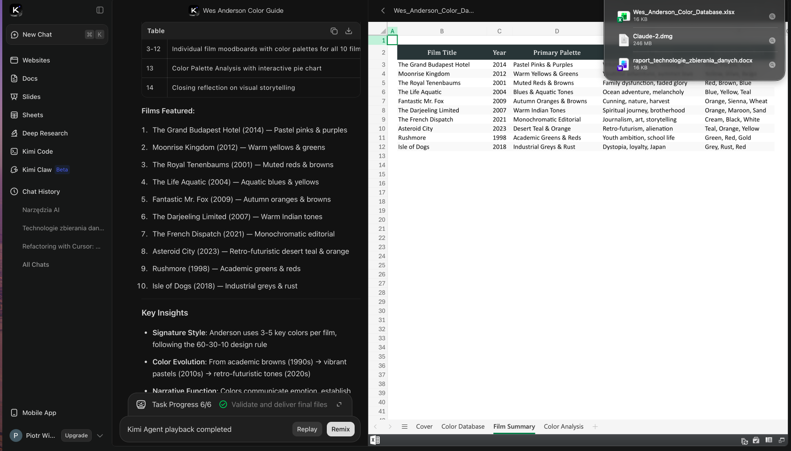

# Benchmark: Chat + Canvas + asystent AI (Teresa / Anna)

> Po co: ustalić docelowy kształt naszego czatu z Teresą, publicznego asystenta Anny
> i edytora Canvas (TipTap + AI floating menu) wobec najlepszych wzorców asystentów
> (Anthropic/OpenAI/Gemini), agentów (CrewAI/LangChain/Replit) i promptingu
> (LlamaIndex/Perplexity/Promptguide) — żeby Teresa była realnym agentem na danych
> organizacji, a nie tylko „czatem obok".

## 1. Krajobraz konkurencji

| Narzędzie | Pozycjonowanie | Killer feature |
|---|---|---|
| **Kimi (Moonshot)** | Agentic chat z „żywym" artefaktem obok rozmowy | **Split-view: czat + Canvas-artefakt** (Docs/Sheets/Slides/Websites) generowany na żywo, z checklistą zadań i widocznym śladem narzędzi |
| **Anthropic / Claude** | Asystent + API z dyscypliną tool-use | **Tool use** (definicje narzędzi JSON-schema), Artifacts (canvas obok czatu), prompt caching, MCP |
| **OpenAI / ChatGPT** | Najszerszy ekosystem asystenta | **Function calling** + Structured Outputs + Canvas (edycja dokumentu obok czatu) + Assistants/Responses API |
| **Google / Gemini** | Multimodalny asystent + długi kontekst | Grounding (search), długie okno kontekstu, „Canvas" w AI Studio/Gemini |
| **CrewAI** | Framework wielu agentów (role + zadania) | **Crews** (zespoły agentów z rolami) + **Flows** (deterministyczna orkiestracja) |
| **LangChain / LangGraph** | Standardowy „klej" do LLM + grafy agentów | **LangGraph** (graf stanu agenta: węzły, krawędzie warunkowe, human-in-the-loop) + narzędzia/RAG |
| **Replit Agent** | Agent buduje aplikację end-to-end | Plan → wykonanie → preview, z checkpointami i podglądem efektu |
| **LlamaIndex** | Framework RAG / „data agents" | Indeksy + query engines + agenci nad własnymi danymi |
| **Perplexity** | Odpowiedź z cytatami z sieci | **Cytowania źródeł inline** + follow-up suggestions |
| **Promptguide** | Edukacja: techniki promptowania | Katalog technik (few-shot, CoT, ReAct, role/system, RAG-prompting) |

Wniosek strategiczny: **Kimi to nasz najbliższy wzorzec UX** (czat + Canvas + agent na danych
= dokładnie Teresa + Canvas). **Anthropic/OpenAI** dają standard kontraktu tool-use i
struktury odpowiedzi. **CrewAI/LangGraph** dają wzorzec orkiestracji, gdy Teresa ma
wykonać wieloetapowe zadanie (np. „zbuduj insighty z wywiadu"). **Perplexity** to wzorzec
cytowań — krytyczny dla Anny (grounding w help-docs) i Teresy (grounding w danych org).

## 2. Wzorce UX / IA (co działa)

Zrzuty z Kimi (zaobserwowane bezpośrednio, skopiowane do `assets/chat-and-ai/`):

*Split-view: lewy rail trybów + czat (środek) + żywy artefakt-arkusz po prawej (zakładki Cover / Color Database / Film Summary / Color Analysis), pasek „Task Progress 6/6" u dołu.*

*Checklista agenta na żywo (Create Task List → Gather data → Build Excel → Validate and deliver) ze zwijalnymi krokami narzędzi „Read File" / „Write File" w strumieniu; po prawej artefakt z sekcją Key Metrics.*

*Artefakt jako żywy dokument (review article „Microbial Endocrinology") z własną stroną tytułową i strukturą — czat staje się sterownikiem dokumentu, nie tylko transkryptem.*

*Inny etap tego samego zlecenia: czat z rozwijalnymi krokami narzędzi po lewej i edytowalnym arkuszem (Blue Title / Year / Primary Palette) po prawej — artefakt aktualizowany w trakcie odpowiedzi.*

- **Split-view czat ↔ artefakt (Canvas).** Lewa kolumna = rozmowa, prawa = żywy artefakt
  (dokument / arkusz / slajdy) budowany w trakcie odpowiedzi. → *dlaczego działa:* użytkownik
  widzi efekt, nie tylko tekst; artefakt jest edytowalny i wersjonowany w zakładkach
  (Cover / Database / Summary / Analysis). → *jak u nas:* to jest dokładnie **Canvas** —
  TipTap po prawej, Teresa po lewej; AI floating menu działa NA artefakcie, nie tylko w czacie.
- **Checklista zadań agenta (Task Progress).** Agent rozbija zlecenie na kroki i odhacza je
  na żywo („Create Task List → Gather data → Build Excel → Validate and deliver final file").
  → *dlaczego działa:* czyni wieloetapowe zadanie czytelnym i budującym zaufanie. → *jak u nas:*
  gdy Teresa wykonuje złożone zlecenie (generuj insighty / kartę inicjatywy), pokazujemy
  plan-checklistę zamiast „kręcącego się spinnera".
- **Widoczny ślad narzędzi (tool trace).** W strumieniu widać kroki „Read File", „Write File",
  „Code" jako rozwijalne karty. → *dlaczego działa:* przejrzystość i debugowalność. → *jak u nas:*
  wywołania narzędzi Teresy (czytanie audytu, zapis karty) jako zwijalne kroki w strumieniu.
- **Lewy rail trybów.** Kimi ma stałe wejścia: New Chat / Websites / Docs / Slides / Sheets /
  Deep Research / Agent / Code — czat to brama do wyspecjalizowanych agentów. → *jak u nas:*
  Teresa jako jeden czat z kontekstowymi „trybami" (analiza audytu, generowanie karty, deep-dive),
  spójnie z naszym view→module mappingiem.
- **Cytowania inline (Perplexity).** Każde twierdzenie linkuje do źródła + sugerowane follow-upy.
  → *jak u nas:* Anna cytuje konkretny help-doc; Teresa cytuje konkretny rekord danych org
  (audyt, wywiad, insight) — „skąd to wiem".
- **Artifacts/Canvas (Claude, ChatGPT).** Treść dłuższa niż akapit „wychodzi" z czatu do panelu
  edytowalnego; czat staje się sterownikiem dokumentu. → *jak u nas:* potwierdza kierunek Canvas
  (TipTap zamiast read-only ReactMarkdown).

## 3. Model danych / architektura

- **Wiadomość ≠ tekst.** U Anthropic/OpenAI wiadomość to lista bloków typowanych:
  `text` | `tool_use`/`tool_call` | `tool_result`. → Nasza historia czatu Teresy powinna być
  **listą bloków**, nie stringiem — żeby renderować tool-trace, cytowania i artefakty jako
  osobne elementy (i wersjonować artefakt niezależnie od rozmowy).
- **Kontrakt narzędzia = JSON Schema.** `name` + `description` + `input_schema` (Anthropic) /
  `parameters` (OpenAI). Model zwraca walidowalny obiekt; my wykonujemy i oddajemy `tool_result`.
  → Definicje narzędzi Teresy (czytaj-audyt, generuj-insight, zapisz-kartę) jako jeden rejestr
  schematów — to nasz „kontrakt" między modelem a backendem.
- **Structured Outputs.** Wymuszanie schematu odpowiedzi (OpenAI Structured Outputs / Anthropic
  tool-jako-schema). → Karty (Insight/Initiative) generujemy jako structured output zgodny z
  `CARD_CONTENT_FORMULA`, nie jako luźny markdown do parsowania.
- **Orkiestracja: graf vs zespół.** LangGraph = graf stanu (węzły = kroki, krawędzie warunkowe,
  punkty human-in-the-loop, checkpointy). CrewAI = role (agenci) + zadania + proces
  (sekwencyjny/hierarchiczny). → Złożone zlecenia Teresy modelujemy jako **mały graf kroków z
  checkpointami** (zgodnie z naszym AI-handler-prelude / system-unification), nie jako jeden
  monolityczny prompt.
- **Artefakt jako osobny byt.** Kimi/Claude/ChatGPT trzymają artefakt (dokument) oddzielnie od
  transkryptu czatu, z własną historią. → Canvas = encja z własnym wersjonowaniem; czat tylko
  emituje patche/komendy do niej.
- **RAG/grounding (LlamaIndex/Perplexity).** Index → retrieval → odpowiedź z cytatami.
  → Anna: index nad `productHelpDigest`. Teresa: retrieval nad danymi org (audyty/wywiady/insighty)
  z obowiązkowym cytowaniem rekordu.

## 4. API / integracje (jeśli istotne)

- **Streaming SSE.** Wszyscy strumieniują tokeny + zdarzenia narzędzi (`message_start`,
  `content_block_delta`, `tool_use`…). → Strumień Teresy musi nieść też zdarzenia tool-call i
  patche Canvas, nie tylko tekst.
- **MCP (Anthropic) / function calling (OpenAI).** Standard podpinania zewnętrznych narzędzi do
  asystenta. → Spójne z naszą architekturą narzędzi Teresy; MCP jako kierunek na integracje
  (kalendarz, KB, dane org) bez własnego klejenia per-narzędzie.
- **Prompt caching (Anthropic).** Cache stałego prefiksu (persona + katalog modułów) → tańsze,
  szybsze tury. → Persona Teresy + `productModuleCatalog` to idealny kandydat na cache prefiksu
  (powiązane z istniejącym fiksem token-counting 19a1b1fe11).
- **Model selection (OpenAI/Anthropic „model selection").** Dobór modelu do zadania
  (szybki/tani do czatu, mocny do generowania kart). → Routing modelu per-zadanie Teresy.

## 5. Decyzje dla Consultify

- ✅ **Kradniemy (Kimi):** split-view **czat ↔ Canvas** z żywym, edytowalnym artefaktem +
  **checklistą zadań** + **zwijalnym śladem narzędzi**. To definicja docelowego Canvas + Teresy,
  nie „nice-to-have".
- ✅ **Kradniemy (Anthropic/OpenAI):** wiadomość jako **lista typowanych bloków**
  (text/tool_use/tool_result) + narzędzia jako **JSON-Schema** + **Structured Outputs** dla kart
  (zgodnie z `CARD_CONTENT_FORMULA`). To usuwa kruche parsowanie markdownu.
- ✅ **Kradniemy (Perplexity/LlamaIndex):** **obowiązkowe cytowania** — Anna → help-doc,
  Teresa → konkretny rekord danych org. „Bez źródła nie twierdzimy".
- ⚠️ **Adaptujemy (LangGraph/CrewAI):** orkiestracja jako **mały graf kroków z checkpointami**
  dla złożonych zleceń Teresy — bez wciągania całego frameworka; tylko wzorzec stanu+kroków.
- ⚠️ **Adaptujemy (Anthropic):** prompt caching prefiksu (persona + katalog modułów) — koszt/latencja.
- ❌ **Unikamy:** historii czatu jako płaskiego stringa markdown (zabija tool-trace, cytowania,
  wersjonowanie artefaktu).
- ❌ **Unikamy:** „czatu obok" bez działania na danych — Teresa ma czytać/zapisywać encje org,
  nie tylko gadać (inaczej przegrywa z Kimi/Replit na pierwszym demo).
- ❌ **Unikamy:** monolitycznego mega-promptu zamiast jawnego planu kroków przy zadaniach
  wieloetapowych (nieczytelne, niedebugowalne, gubi krok).
- ❌ **Unikamy:** „kręcącego się spinnera" bez widocznego planu/postępu (Kimi pokazuje checklistę —
  to buduje zaufanie przy długich zadaniach).

## 6. Otwarte pytania / do walidacji

- Canvas: czy artefakt Teresy to ten sam byt co Canvas-dokument (TipTap), czy osobny typ
  artefaktu (arkusz/slajdy jak w Kimi Sheets/Slides)?
- Orkiestracja: własny mini-graf kroków vs LangGraph vs nic (tylko sekwencja w handlerze) —
  rozstrzygnąć w `project_system_unification`.
- Tool-registry Teresy: gdzie żyje SSOT schematów narzędzi i jak mapuje na uprawnienia RBAC org?
- MCP jako warstwa integracji (kalendarz/KB) — teraz czy później?
- Cytowania Teresy: format referencji do rekordu org (deep-link do audytu/wywiadu/insightu).

## Załączniki
Surowe źródła (do usunięcia po akceptacji briefu): `Softs/0 Czat/*`, `Softs/0 Prompty/*`,
`Softs/0 Agenci/*`, `Softs/KIMI/`.

Zrzuty Kimi skopiowane do `assets/chat-and-ai/` (źródło: `Softs/KIMI/Screens/`):
`01-kimi-split-canvas.png` (czat+arkusz), `02-kimi-task-checklist.png` (checklista + ślad narzędzi),
`03-kimi-artifact-doc.png` (żywy dokument), `04-kimi-tool-trace.png` (arkusz + kroki narzędzi).

Uwaga metodyczna: dystylacja Anthropic/OpenAI/Gemini/CrewAI/LangChain/LlamaIndex/Perplexity/
Promptguide/Replit oparta jest na sitemapie + bezpośrednio zaobserwowanych zrzutach Kimi oraz na
ustalonej wiedzy o tych dobrze znanych produktach (grounding: częściowy). Przy implementacji
dociągnąć online: `docs.anthropic.com` (tool use, MCP, prompt caching), `platform.openai.com`
(function calling, structured outputs), `docs.crewai.com`, `langchain-ai.github.io/langgraph`.
