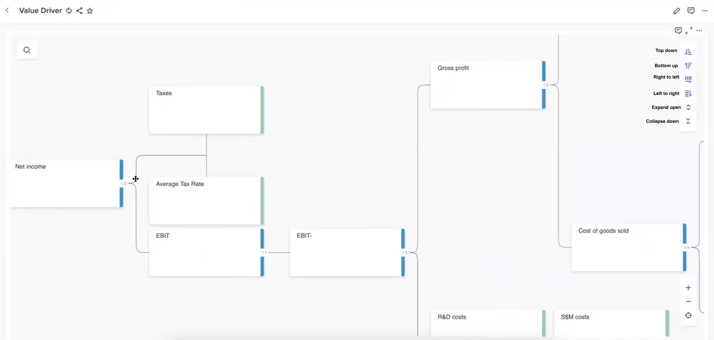
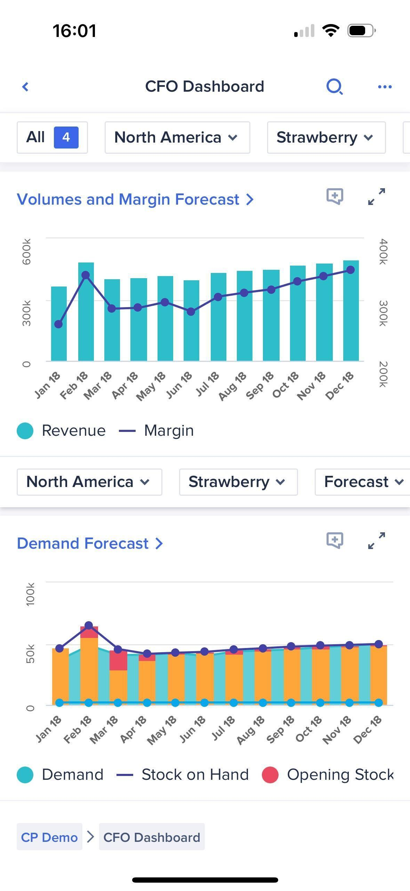

# Benchmark: Analiza finansowa

> Po co: zrozumieć wzorce „connected planning" i modelowania finansowego (Anaplan),
> żeby ocenić, czy i jak Consultify mógłby zaoferować warstwę scenariuszową/finansową
> na bazie danych z audytów i inicjatyw. Moduł jest na dziś SPEKULATYWNY (nie ma go
> w roadmapie) — ten brief to rozpoznanie, nie specyfikacja.

> ✅ **STATUS ŹRÓDEŁ (zaktualizowano 2026-06-10):** dostęp do `Documents` przywrócony,
> oba archiwa rozpakowane i przeczytane. `anaplan.zip` zawiera realny scrape Anapedia
> (`help.anaplan.com`) — strony Versions, Line items, Modeling, Dashboards itd.
> `Apiary.zip` NIE jest generycznym Apiary.io — to **dokumentacja Anaplan Integration API V2**
> hostowana na `anaplan.docs.apiary.io` (patrz §6, korekta poprzedniego werdyktu).
> Twierdzenia w §3–§4 są teraz potwierdzone cytatami ze scrape'u. Moduł pozostaje
> SPEKULATYWNY z powodu niepewności roadmapowej, nie braku źródeł.

## 1. Krajobraz konkurencji

| Narzędzie | Pozycjonowanie | Killer feature | Czy do TEGO modułu? |
|---|---|---|---|
| **Anaplan** | Enterprise „connected planning" / FP&A, sprzedaż, supply chain, workforce | Silnik **Hyperblock** — wielowymiarowe modele in-memory + **Versions** (scenariusze) | ✅ TAK — rdzeń tego briefu |
| **Anaplan Integration API V2** (folder `Apiary.zip`) | REST API Anaplana (Bulk + Transactional) udokumentowane na Apiary | Workspaces/Models/Line Items/Versions/Users + import-export cell data | ✅ TAK — to Anaplan, nie obcy produkt (§6) |

Wniosek strategiczny: **oba archiwa dotyczą Anaplana** — jedno to dokumentacja produktu
(Anapedia), drugie to dokumentacja jego API integracyjnego. Poprzednia identyfikacja
„Apiary = Apiary.io / API Blueprint, poza zakresem" była **błędna** — patrz §6.

## 2. Feature-surface Anaplan (siatka kontrolna — potwierdzona ze scrape'u Anapedia)
Z nawigacji Anapedia (`Modeling` + `Anaplan User Experience` + `Integrations`):

**Model danych:** Modules · Line Items · Lists (hierarchie, subsets) · Dimensions · Time (Time ranges) · **Versions**
**Logika:** Formulas (edytor z autocomplete + syntax highlighting) · Calculation functions (np. `CURRENTVERSION`) · Line item subsets jako wymiar
**Scenariusze:** **Versions** (Actual/Forecast + własne) · switchover dates · **rolling forecast** · variance reports (z/bez wersji)
**Współpraca/proces:** Model roles + per-list/module/version permissions · Workflow · History (cell history, audit trail) · ALM (Application Lifecycle Management)
**Integracje:** Bulk + Transactional API (Apiary, §6) · konektory (Informatica, Salesforce, Excel Add-in) · Data Orchestrator · import/export modułów i list
**Wizualizacja:** **Apps/Pages (User Experience)** — nowy standard · klasyczne dashboardy (grid/chart/KPI/hierarchy cards) — **deprecated dla nowych klientów**

→ Dla nas kluczowe trzy warstwy: **wielowymiarowy model**, **drivery** i **Versions/scenariusze** — wszystkie potwierdzone w scrape'ie.

> Screenshoty: **2 realne ujęcia UI** dograne do `assets/financial-analysis/` (patrz §3–§4).

## 3. Model danych / architektura (wzorzec Anaplan — cytaty ze scrape'u)
- **Line items = nośnik logiki.** Anapedia (Line items, zmod. 2023-05-31): *„Model builders create line items to measure data in a module. Use line items to input data, hold formulas, and run calculations."* Worked example to wprost **model finansowy**: moduły `REV01 Price Book`, `REV02 Volume Inputs`, `REV03 Margin Calculation` z formułą:
  `'REV02 Volume Inputs'.Volumes * 'REV01 Price Book'.Unit Price * (1 + Unit Price Growth %)`
  oraz moduł `Employee expenses` z line itemami Headcount / Salary / Bonus.
- **Wielowymiarowość:** dane = przecięcie wymiarów (Time × Versions × pozycja), line item należy do jednego modułu, ale może być referencjonowany w formułach innych modułów tego samego modelu.
- **Drivery jako drzewo wartości.** Realny ekran „Value Driver" (poniżej) pokazuje rozkład **Net income → Taxes / EBIT → Gross profit → Cost of goods sold / R&D / S&M costs** jako graf węzłów — dokładnie driver-based planning.
- **Versions = pierwszorzędny obywatel:** osobny wymiar Actual/Forecast/scenariusze.

→ Dla Consultify: gdybyśmy budowali warstwę finansową, model powinien być **driver-based i wersjonowany**,
nie arkuszem płaskim. Dodatkowo: drzewo driverów Anaplana to **kanwa węzłów** — spina się z naszym
modelem bindingów z `whiteboard.md` (jeden model węzeł↔krawędź dla Ideas + ewentualnego modelu finansowego).

## 4. Scenariusze / what-if (potwierdzone — to najmocniejsza koncepcja do „kradzieży")
Anapedia (Versions, zmod. 2023-07-06) — cytaty:
- *„You can use versions to compare different scenarios in a model."* — wersje = osobne scenariusze.
- Domyślnie model ma **Actual** i **Forecast**; admin tworzy kolejne, by „explore further scenarios".
- **Switchover date:** do wybranej daty wersja = Actual (read-only), po niej edytowalna — mechanizm rozdziału realizacji od planu.
- **Rolling forecast** wprost: *„select a new switchover date at the end of each period to create a rolling forecast."*
- **Variance reports** porównują wariancję między wersjami (z wymiarem Versions lub bez).
- `CURRENTVERSION` zwraca wartość line itemu dla bieżącej wersji — formuły świadome scenariusza.

Realny **CFO Dashboard** (mobile, App/Page UX) — Volumes & Margin Forecast + Demand Forecast,
filtry scenariusza (selektor `Forecast`), KPI/chart cards:

→ To dokładnie ten język, którego brakuje wynikom audytu/inicjatyw w Consultify:
inicjatywa ma „impact", ale nie ma **wersjonowanego modelu scenariusza**, który ten impact policzy.

## 5. Decyzje dla Consultify
- ✅ **Kradniemy koncepcyjnie:** **driver-based, wersjonowany model scenariuszy** (wzorzec Versions:
  base/forecast + switchover + variance) jako sposób kwantyfikacji efektu inicjatyw
  (oszczędność/przychód/ROI per scenariusz) — spina się z `project_initiative_formula`.
- ✅ **Kradniemy UX:** dashboard wyników scenariusza w stylu CFO Dashboard (KPI/chart cards + selektor wersji + forecast).
- ✅ **Kradniemy wzorzec drzewa driverów** (Value Driver) — rozkład efektu na sterowniki jako graf węzłów,
  wspólny model bindingów z Ideas/Whiteboard (`whiteboard.md`).
- ⚠️ **Adaptujemy lekko:** nie budujemy drugiego Anaplana. Realny zakres v1 = **mini-model
  scenariuszowy inicjatywy** (3–5 driverów, base/upside/downside), nie pełna platforma FP&A.
- ❌ **Unikamy:** wielowymiarowego silnika in-memory typu Hyperblock — to lata pracy i zła altituda.
- ❌ **Unikamy:** klasycznych dashboardów Anaplana (i tak deprecated) — wzorujemy się na Apps/Pages, nie na „classic".

## 6. Apiary.zip — KOREKTA: to dokumentacja API Anaplana, nie obcy produkt
- Poprzedni brief twierdził, że `Apiary.zip` = Apiary.io / API Blueprint i jest poza zakresem. **To błąd.**
- Realna zawartość archiwum: `anaplan.docs.apiary.io` → strona tytułowa *„Anaplan Integration API V2 Guide and Reference"*.
  Apiary to tylko **hosting dokumentacji**; treść to REST API Anaplana.
- Spis referencji obejmuje: **Workspaces, Models, Line Items, Model versions, Model Calendar, Users,
  Other Model Metadata, Read/Update module cell data, Upload Files for Actions**, oraz sekcje
  Bulk API / Transactional API, Authentication, Pagination, rate limits.
- **Werdykt (nowy):** Apiary **należy do tego briefu** — to warstwa integracyjna Anaplana, relewantna,
  jeśli kiedyś chcielibyśmy programowo zasilać/odpytywać model finansowy. Nic nie przenosimy.

## 7. Otwarte pytania
- Czy „Analiza finansowa" wchodzi do roadmapy, czy zostaje jako **scenariusz finansowy inicjatywy**
  wbudowany w moduł Inicjatyw (rekomendacja: to drugie)?
- Jaki minimalny zestaw driverów pokrywa 80% przypadków (FTE, stawka, czas wdrożenia, oszczędność/szt.)?
  Anaplan sugeruje kanon: Volumes × Unit Price × Growth %, Headcount × Salary × Bonus.
- Skąd dane wejściowe — ręcznie czy z audytu/wywiadu (re-use grounded data)?
- Czy model finansowy dzieli kanwę węzłów (bindingi) z Ideas/Whiteboard, czy to osobny edytor?

## Załączniki / status źródeł
- `Softs/0 Analiza finansowa/anaplan.zip` (~2,3 GB) — **ODCZYTANE**; scrape Anapedia (`help.anaplan.com`).
- `Softs/0 Analiza finansowa/Apiary.zip` — **ODCZYTANE**; to `anaplan.docs.apiary.io` = Anaplan Integration API V2 (§6).
- Screenshoty (2, realne UI): `assets/financial-analysis/anaplan-value-driver.png`, `assets/financial-analysis/anaplan-cfo-dashboard.jpg`.
- Wiedza referencyjna online: `anaplan.com` (Connected Planning, Hyperblock), Anapedia (Versions, Line items, Modeling).
