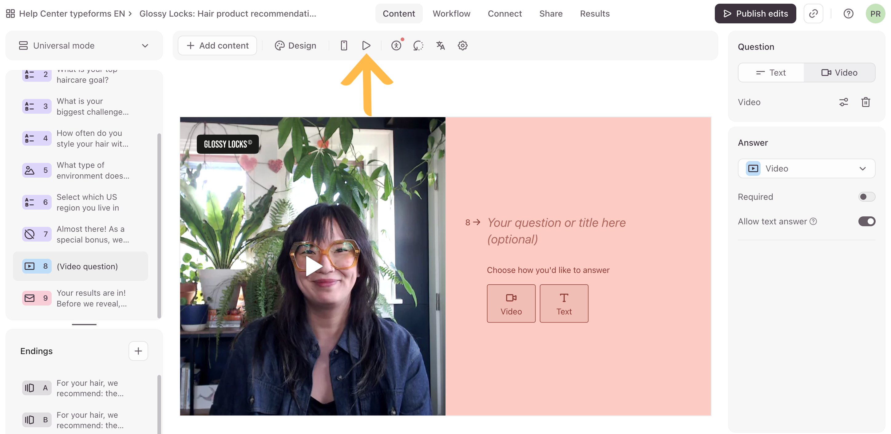
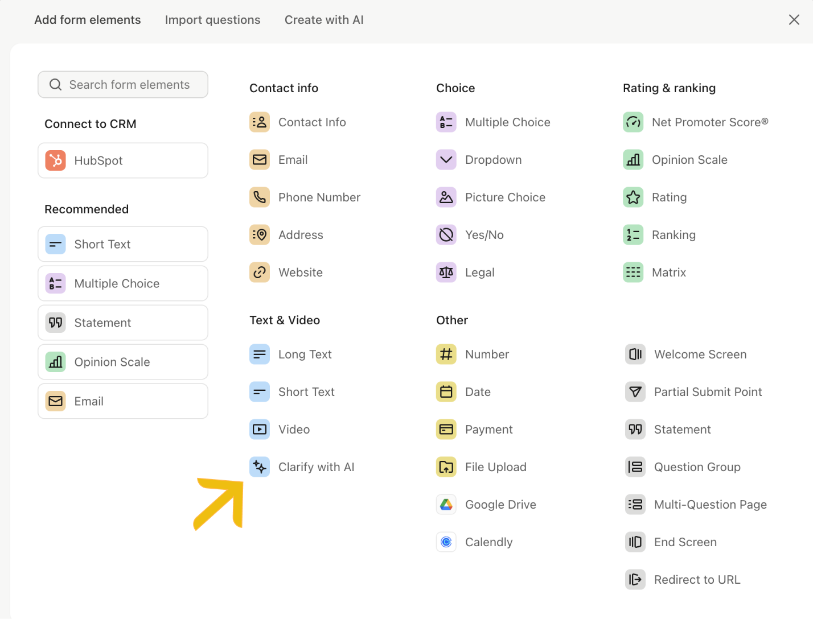
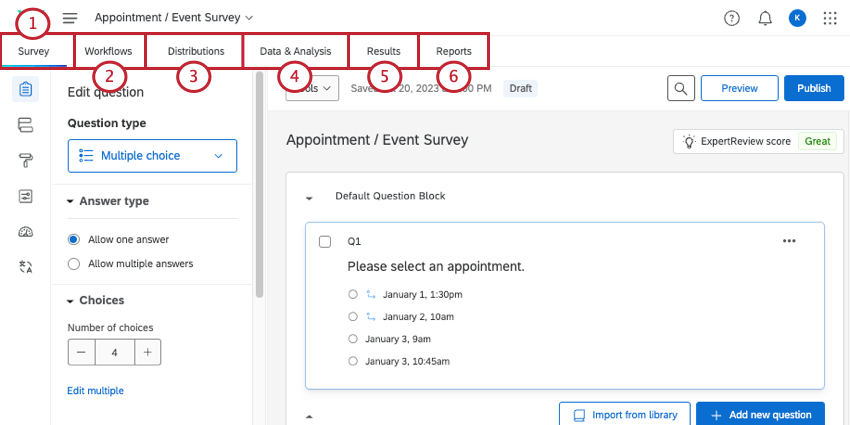
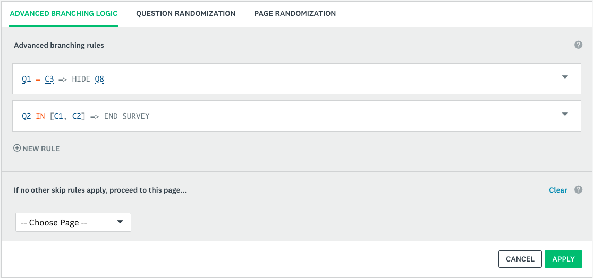

# Benchmark: Ankiety + Wywiad (Interview)

> Po co: ustawić feature-surface i UX naszych dwóch powiązanych modułów — klasycznych
> **Ankiet** (budowanie + dystrybucja + analityka) oraz **Wywiadu/Interview** (AI-diagnoza,
> szablony otwarte VTS-style, jedno-pytanie-naraz). Decyzja do odblokowania: czy Wywiad to
> osobny silnik konwersacyjny (wzorzec Typeform), a Ankiety to silnik macierzowy/logiczny
> (wzorzec Qualtrics/SurveyMonkey) — i co dzielą wspólnie.

## 1. Krajobraz konkurencji

| Narzędzie | Pozycjonowanie | Killer feature |
|---|---|---|
| **Typeform** | „Conversational" formularze — jedno pytanie na ekran, design-first | **One-question-at-a-time** + Logic Jumps + Recall (piping) + warstwa AI (Clarify/Qualify) — to wzorzec naszego **Wywiadu** |
| **Qualtrics** | Enterprise Experience Management (XM) — research-grade | Najbogatszy zestaw typów pytań + **Survey Flow** (rozgałęzienia, bloki, randomizacja, embedded data) + zaawansowana analityka/Stats iQ + Text iQ (NLP na otwartych) |
| **SurveyMonkey** | Masowy, samoobsługowy, szablonowy | Biblioteka szablonów + **Question Bank** (zwalidowane pytania) + prosta dystrybucja wielokanałowa + benchmarki branżowe |

Wniosek strategiczny: **Typeform = wzorzec Wywiadu** (konwersacyjny, AI-driven, otwarte pytania),
**Qualtrics = wzorzec Ankiet** (logika/flow/analityka research-grade), **SurveyMonkey = wzorzec
onboardingu/szablonów** (szybki start, biblioteka pytań). Nasza przewaga = oba w jednym, spięte
z Teresą/Anną i z resztą systemu (Insights → Initiatives).

## 2. Wzorce UX / IA (co działa)

Zrzuty (realne UI produktów, wyciągnięte ze scrapów `Softs/0 Ankiety`):

*Typeform — builder „jedno pytanie na ekran": lewa kolumna = sekwencja pytań, środek = pełnoekranowa kanwa pytania, prawa = konfiguracja (typ odpowiedzi, wymagalność). To wzorzec naszego **Wywiadu**.*

*Typeform — biblioteka typów pytań (Choice, Rating & ranking, Text & Video, …) z osobnym typem **Clarify with AI** (strzałka) jako natywnym elementem formularza.*

*Qualtrics — research-grade builder: górne zakładki (Survey → Workflows → Distributions → Data & Analysis → Results → Reports) rozdzielają tworzenie, logikę, dystrybucję i analitykę; lewy panel = edycja pytania, środek = bloki pytań.*

*SurveyMonkey — **Advanced Branching Logic** jako osobna zakładka: reguły `Q1 = C3 ⇒ HIDE Q8`, `Q2 IN [C1,C2] ⇒ END SURVEY` trzymane jako lista reguł, nie inline w pytaniu — dokładnie nasz wzorzec „osobna tabela reguł".*

- **Typeform — jedno pytanie na ekran (conversational):** pełnoekranowe pytanie, duży krok-po-kroku,
  klawiatura (Enter = dalej, 1/2/3 = wybór), płynne przejścia, pasek postępu. *Dlaczego działa:*
  drastycznie podnosi completion rate na długich/otwartych ankietach, „rozmowa" zamiast formularza.
  *Jak u nas:* to **dokładnie tryb Wywiadu** — VTS-style otwarte szablony PL/EN powinny lecieć
  jedno-pytanie-naraz, z Anną/Teresą jako „prowadzącą rozmowę".
- **Typeform — Logic Jumps + Recall:** rozgałęzienia po odpowiedzi (`if X → skok do pytania Y`)
  oraz „recall"/piping — wstawianie wcześniejszych odpowiedzi w treść kolejnych pytań
  (np. „Co najbardziej frustruje Cię w {{process_name}}?"). *Jak u nas:* personalizacja pytań
  per-proces (Apator AiR ICT) i per-respondent bez powtarzania pytań — to nasza zasada
  „grounded, no-repeat-questions".
- **Typeform — Clarify with AI:** osobny **typ pytania** (nie globalny tryb) — generatywne AI tworzy
  **do dwóch** spersonalizowanych pytań dopytujących na bazie odpowiedzi otwartej, gdy jest zbyt płytka
  (potwierdzone w help.typeform.com/Clarify-with-AI). *Jak u nas:* core Wywiadu = Teresa generuje
  follow-up na podstawie odpowiedzi, bez sztywnego limitu „do dwóch" i bez statycznego skryptu —
  to nasza przewaga nad Typeformem.
- **Qualtrics — Survey Flow (wizualny graf przebiegu):** osobny ekran „Flow" = bloki pytań +
  branch logic + randomizery + embedded data + end-of-survey, jako drzewo. *Dlaczego działa:*
  oddziela *strukturę przebiegu* od *edycji treści pytań*. *Jak u nas:* w Ankietach rozdzielić
  „edytor pytań" od „edytora przepływu" (nie mieszać logiki w listę pytań).
- **Qualtrics/SM — Question Bank / biblioteka:** zwalidowane, gotowe pytania + szablony branżowe
  jako punkt startu. *Jak u nas:* katalog szablonów (VTS general+per-process, Apator) jako
  pierwszorzędny onboarding — „nowa ankieta z szablonu", nie pusta kartka.
- **SurveyMonkey — dystrybucja wielokanałowa:** jeden „Collect" hub: link, e-mail, embed, QR,
  social, mobile. *Jak u nas:* jeden ekran „Wyślij/Zbierz" zamiast rozproszonych akcji
  (mapuje do importu ~131 osób z Excela → wysyłka VTS Wave 2).

## 3. Model danych / architektura

- **Wspólny rdzeń:** `Survey` → `Block/Page` → `Question` (typ + walidacja + opcje) →
  `Choice/Field` → `Response` → `Answer`. Qualtrics dokłada `SurveyFlow` (graf bloków + logika
  + `EmbeddedData`) jako osobną encję obok listy pytań — **to klucz**: przebieg ≠ lista pytań.
- **Typy pytań (suma vendorów, jako siatka kontrolna):** single/multi choice, dropdown, ranking,
  matrix/grid, Likert/NPS, slider, rating (gwiazdki/emoji), short/long text (open-ended),
  date/time, file upload, contact/address, payment, statement (bez odpowiedzi), constant sum.
  *Dla nas:* Ankiety potrzebują pełnej macierzy; Wywiad świadomie zawęża do **open-ended +
  follow-up AI** (to nasz wyróżnik, nie brak).
- **Piping/Recall** = referencja `answer_ref` w treści pytania (Qualtrics „piped text",
  Typeform „recall"). U nas: pola `{{...}}` rozwiązywane z odpowiedzi + z kontekstu org
  (embedded data = nasz „org-context").
- **Logika** = reguły `condition → action(skip/show/jump/end)` na poziomie pytania/bloku.
  Trzymać jako osobną tabelę reguł, nie inline w pytaniu (granular edit + walidacja jak w
  CARD_CONTENT_FORMULA).
- **Open-ended analytics:** Qualtrics **Text iQ** (kodowanie tematów/sentyment na otwartych) —
  to jest most między surową odpowiedzią a naszymi **Insights**: odpowiedź Wywiadu → temat/insight
  → Initiative. Nasz pipeline AI zastępuje ręczne kodowanie.

## 4. API / integracje

- **SurveyMonkey API v3** (`developer.surveymonkey.com/api/v3`) — REST, OAuth2, public vs private
  apps. Zasoby: `/surveys`, `/surveys/{id}/pages`, `/questions`, `/collectors` (kanały zbierania),
  `/responses/bulk`, **webhooks** (event-driven: `response_completed`). Wzorzec
  collector = osobna encja kanału dystrybucji — czysty rozdział „ankieta" vs „zbiórka".
- **Qualtrics API** (`api.qualtrics.com`) — Survey Definitions API (CRUD pytań/flow),
  Response Export (async job: start → poll → file), Distributions, Directory/Contacts,
  webhooky/event subscriptions. Wzorzec **async export** = jak robić ciężki eksport odpowiedzi
  bez blokowania.
- **Typeform** — Responses API + **webhooks** (push przy każdym submit) + Hidden Fields
  (parametry URL → embedded data, np. `?email=...&dept=...` do trackowania źródła/respondenta).
  *Dla nas:* Hidden Fields = sposób na pre-wypełnienie respondenta (osoba z importu Excel) bez
  pytania o tożsamość.
- → Dla nas: webhook `response_completed` powinien odpalać pipeline AI (Wywiad → Insight →
  Initiative) automatycznie; bulk/async export dla raportów zbiorczych.

## 5. Decyzje dla Consultify

- ✅ **Kradniemy (Wywiad):** tryb **jedno-pytanie-naraz** Typeforma + skróty klawiaturowe +
  pasek postępu jako domyślny UX Wywiadu i AI-diagnozy VTS.
- ✅ **Kradniemy (Wywiad):** **AI Clarify/follow-up** — Teresa dogłębia płytkie odpowiedzi otwarte
  w locie; to nasza przewaga nad statycznym Typeformem.
- ✅ **Kradniemy (Ankiety):** rozdzielenie **edytora pytań** od **wizualnego Survey Flow**
  (Qualtrics) + osobna tabela reguł logiki + Recall/piping przez `{{answer_ref}}`.
- ✅ **Kradniemy (oba):** **biblioteka szablonów + Question Bank** jako onboarding (VTS, Apator) —
  „nowa z szablonu" zamiast pustej kartki; webhook→pipeline (Wywiad→Insight→Initiative).
- ⚠️ **Adaptujemy:** pełną macierz typów pytań tylko w **Ankietach**; Wywiad świadomie zawężony do
  open-ended + AI (nie kopiować całego zoo typów do trybu konwersacyjnego).
- ⚠️ **Adaptujemy:** Text iQ (kodowanie otwartych) — u nas zastąpione pipeline'em AI (Insights),
  nie budujemy osobnego ręcznego kodera.
- ⚠️ **Adaptujemy:** Hidden Fields/embedded data → nasz „org-context" + pre-wypełnienie respondenta
  z importu (131 osób VTS), zamiast pytać o tożsamość.
- ❌ **Unikamy:** enterprise-przerostu Qualtrics (setki opcji per pytanie) — zabija prostotę;
  bierzemy *flow + analitykę*, nie cały panel ustawień.
- ❌ **Unikamy:** logiki wpisanej inline w pojedyncze pytania (trudna walidacja, rozjazd) —
  trzymamy reguły jako osobną encję.
- ❌ **Unikamy:** rozdzielenia Ankiet i Wywiadu na dwa niespójne modele danych — wspólny rdzeń
  `Survey/Question/Response`, różny tylko *renderer* (formularz vs konwersacja) i warstwa AI.

## 6. Otwarte pytania / do walidacji

- Czy Wywiad i Ankiety dzielą jeden schemat `Survey` z flagą `mode: form|conversation`, czy to
  dwa byty z mapowaniem? (rekomendacja: jeden schemat, dwa renderery).
- Gdzie żyje logika AI-follow-up — w definicji pytania (prompt per pytanie) czy globalnie per szablon?
- Czy potrzebujemy encji „Collector/Distribution" (SM-style) już w v1, czy wystarczy link+import Excel?
- Mapowanie open-ended → Insight: automat (webhook) vs batch po zamknięciu zbiórki?

## Załączniki
Surowe źródło: `Softs/0 Ankiety/{Qualtrics 1, Qualtrics 2, Surveymonkey 1, Surveymonkey 2,
typerform 1, typerform 2}` (do usunięcia po akceptacji).

Uwagi do źródła (ważne dla następnego, kto dotknie tych scrapów):
- **Zrzuty ekranowe dodane** (sesja 2026-06-10, dostęp do `~/Documents` przywrócony) — 4 realne UI
  produktów skopiowane do `assets/surveys-interview/` (Typeform builder + biblioteka Clarify-with-AI,
  Qualtrics survey builder, SurveyMonkey advanced branching logic). Każdy zweryfikowany wzrokowo
  jako genuine product UI.
- **Mislabel #1 (POTWIERDZONY):** folder **`Qualtrics 2`** zawiera de facto scrap **Typeform**
  (`help.typeform.com`, `www.typeform.com`, `renderer-assets.typeform.com`, `status.typeform.com` —
  zero domen qualtrics.com), nie Qualtrics — przy sprzątaniu nie pomylić.
- **Mislabel #2 (NOWY, POTWIERDZONY):** folder **`typerform 2`** zawiera de facto scrap **Qualtrics**
  (`www.qualtrics.com`, `qualtrics-www.s3.amazonaws.com`) — etykiety Qualtrics↔Typeform są zamienione
  dla obu „drugich" folderów. Realny Typeform-2 = `Qualtrics 2`; realny Qualtrics-2 = `typerform 2`.
- **`Surveymonkey 1/www.surveymonkey.com`** = w praktyce JS-shell (głównie `fides.js`/skrypty),
  treść produktu cienka; wartościowy jest **`developer.surveymonkey.com/api/v3`**.
- Najbogatsze realne treści: artykuły pomocy Typeform (Logic, Hidden fields, Recall, Clarify-with-AI,
  partial responses, source-tracking) oraz `api.qualtrics.com` / `developer.surveymonkey.com`.
- Przy implementacji dociągnąć online: Typeform Help (Logic Jumps, Recall), Qualtrics Survey Flow +
  Text iQ docs, SurveyMonkey API v3 reference — dla dokładnych kontraktów.
