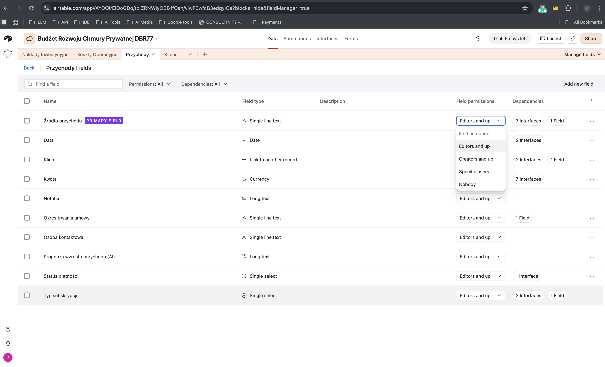
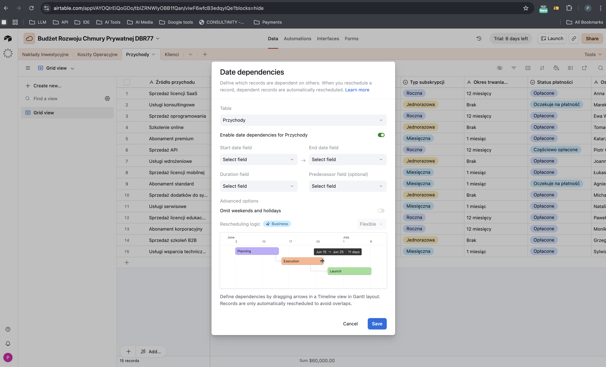
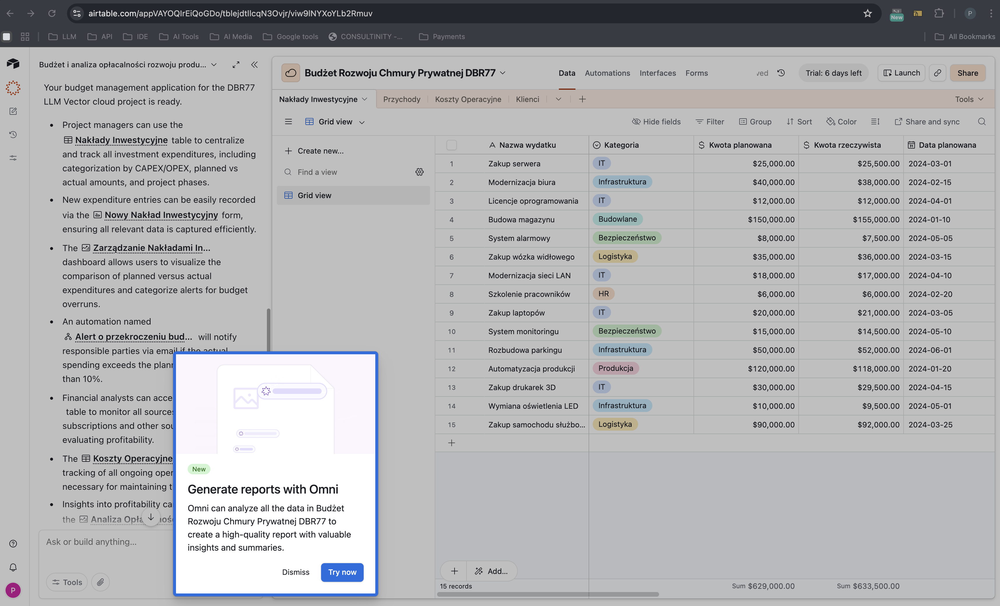
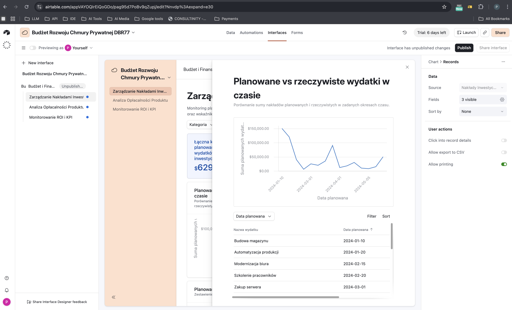

# Benchmark: Table + Table Studio (Ideas)

> Po co: zdefiniować feature-surface naszego narzędzia Table (Ideas) i Table Studio wobec
> dwóch wzorców „bazy-jako-tabeli" (Airtable = czysta baza relacyjna z widokami; Coda = doc+tabela+
> formuły+API). Cel: ustalić, ile z modelu „database-table" bierzemy, jak to NIE rozjeżdża się
> z `TABLE_AND_PREVIEW_CANON.md` (kanon list encji), i gdzie benchmark proponuje rozszerzenia kanonu.

## 0. Najważniejsze rozróżnienie (czytaj najpierw)
Mamy DWA byty tabelowe i benchmark dotyczy innego z nich niż kanon:
- **`TABLE_AND_PREVIEW_CANON.md` = listy ENCJI** (read+act na rekordach modułu: insighty, sesje, inicjatywy).
  To NIE jest edytowalna baza danych użytkownika. Kanon §1.2 wprost wyłącza „edytory macierzowe/komórkowe".
- **Ideas → Table + Table Studio = baza danych użytkownika** (Airtable/Coda-like): user definiuje pola,
  typy, formuły, relacje, widoki. To jest dokładnie ten „cell-by-cell editor", który kanon stawia POZA
  swoim zakresem (TODO `matrix-editor-standard.md`).
→ Wniosek: benchmark NIE podważa kanonu — opisuje **brakujący, komplementarny standard**. Tam gdzie oba się
  stykają (chipy statusu, preview wiersza, widoki alternatywne) trzymamy język wizualny kanonu; tam gdzie
  kanon milczy (typy pól, formuły, relacje, grid edycyjny) ten brief jest źródłem.

## 1. Krajobraz konkurencji

| Narzędzie | Pozycjonowanie | Killer feature |
|---|---|---|
| **Airtable** | Relacyjna baza „dla nie-programistów" z bogatymi widokami | Linked records (relacje) + ~25 typów pól + widoki Grid/Kanban/Calendar/Gallery/Timeline/Form + Interfaces (app-builder na danych) |
| **Coda** | All-in-one doc, w którym tabela jest obiektem pierwszej klasy | Tabela osadzona w dokumencie + język formuł (Coda Formula Language) + Packs (integracje) + Buttons/Automations + pełne REST API |

Wniosek strategiczny: **Airtable to wzorzec modelu danych i widoków** (typy pól, relacje, view-per-rola),
**Coda to wzorzec „tabela + akcje + API + AI"** (formuły, przyciski-akcje, automatyzacje, programowalny dostęp).
Nasza przewaga do zbudowania: **Table Studio z AI (Teresa) buduje schemat z rozmowy** — Airtable dopiero to
dokleja, my możemy mieć to jako rdzeń (patrz §2, screeny „4.a thinking - LLM zbiera dane" → „5d tabela zbudowana").

## 2. Wzorce UX / IA (co działa)
Źródło wizualne: scrape Airtable (`Softs/0 tabele/AirTable/Screen/` — m.in. serie „11 Field type 1–56",
„13 Data dependecies 1–6", „14 Interfaces 1–16", „15 Forms", „9 tools - manage fields/extensions",
„12 creat template", oraz sekwencja AI-buildu „4.a thinking - LLM zbiera dane" → „5d. tabela zbudowana").
Cztery reprezentatywne zrzuty skopiowane do `assets/tables/` (realny produkt, baza demo „Budżet Rozwoju
Chmury Prywatnej DBR77"):

| Zrzut | Co pokazuje |
|---|---|
|  | Panel zarządzania polami — każda kolumna ma **typ** (Single line text, Date, Link to another record, Currency, Long text, Single select) + per-pole uprawnienia i licznik zależności. |
|  | Grid view + dialog „Date dependencies" — rekordy współzależne, auto-reschedule, podgląd na osi Gantta. To zachowanie „bazy" (relacje sterują przeliczeniem), nie arkusza. |
|  | Sekwencja AI-buildu (split-view): po lewej asystent „Omni" streszcza, co zbudował z rozmowy; po prawej gotowy grid (kategorie, kwoty, daty) + prompt „Generate reports with Omni". |
|  | Interfaces / app-builder — warstwa prezentacji nad tabelą (wykres „Planowane vs rzeczywiste wydatki w czasie" + lista rekordów), bez kodu. |

- **Wybór typu pola jako bogate menu z grupami** (Airtable „Field type 1–56"): typy pogrupowane (tekst,
  liczba/waluta/procent, select/multiselect, data, użytkownik, załącznik, checkbox, rating, link do rekordu,
  lookup, rollup, formula, count, autonumber, barcode, button, created/modified by/time). → U nas: kreator
  kolumny w Table Studio musi mieć ten sam grupowany picker, nie płaską listę.
- **Linked records + lookup/rollup** („13 Data dependecies 1–6"): pole „link do rekordu w innej tabeli",
  a na jego bazie `lookup` (pokaż pole z połączonego rekordu) i `rollup` (agreguj, np. SUM po dzieciach).
  To jest serce „bazy", nie arkusza. → U nas: model relacji (patrz §3) + UI dependency-mapy.
- **Widoki jako zapisane konfiguracje TYCH SAMYCH danych** (Grid/Kanban/Calendar/Gallery/Timeline/Form):
  każdy widok ma własny filter/sort/group/hidden-fields, ale jedno źródło prawdy. → U nas: spójne z kanonem
  §8 (segment ikonowy: lista→grid→kanban→timeline) — ale tu **widok = trwale zapisana konfiguracja usera**,
  nie tylko przełącznik. To rozszerzenie kanonu (kanon zna „saved views" tylko jako wzmiankę przy §6).
- **Interfaces / app-builder na danych** („14 Interfaces 1–16"): warstwa prezentacji (dashboard, formularz,
  record-detail) zbudowana NAD tabelą bez kodu. → U nas: to jest dokładnie rola **Table Studio jako buildera**
  + most do Presentation/Document Studio (deliverables). Nie kopiujemy całego app-buildera; kradniemy ideę
  „jedna tabela → wiele powierzchni prezentacji".
- **Forms jako widok zbierający rekordy** („15 Forms"): formularz = po prostu kolejny widok tabeli, który
  pisze wiersze. → U nas: most do modułu Ankiety/Wywiad (źródło → tabela), nie osobny silnik.
- **AI buduje tabelę z rozmowy** (sekwencja „4.a … LLM zbiera dane" → „6c rozmowa 3 w czacie" → „5d tabela
  zbudowana"): user opisuje potrzebę, asystent dopytuje, generuje schemat (pola+typy) i pierwsze wiersze.
  → U nas: **Teresa w Table Studio** — to nasz killer, nie dodatek (spójne z mapą `chat-and-ai.md`).

## 3. Model danych / architektura
Kanoniczny model „bazy" (Airtable + potwierdzony kształtem API Coda, §4):
- **Hierarchia:** `base/doc → table → (column | row)`. Wiersz = mapa `columnId → value`. To rekordowy model,
  nie monolityczny blob — zgodny z naszą doktryną z `whiteboard.md` (store rekordów dla realtime/undo).
- **Kolumna ma TYP** (silnie typowana), a typ niesie zachowanie (walidacja, render, edytor inline). Minimalny
  zestaw v1 dla Table Studio: text, long-text, number, currency, percent, date, single-select, multi-select,
  checkbox, user(assignee), attachment, link-to-record, lookup, rollup, formula, created/modified meta.
- **Relacje (linked records)** = osobny typ pola wskazujący wiersze innej tabeli (1-N / N-N). `lookup` i
  `rollup` to pola POCHODNE od relacji. To jest most do reszty Ideas: ten sam wzorzec „bindings/relations",
  co tldraw-bindings w `whiteboard.md` — **jeden wspólny model relacji dla całego Ideas** (Table ↔ Mind Map
  ↔ Process Flow), nie silos.
- **Formuła = kolumna obliczana** (Coda Formula Language; Airtable formula field). Reaktywna: zmiana wejścia
  przelicza wyjście. v1 może być wąski (arytmetyka, daty, if, lookup-ref); pełny język to dług.
- **Widok = zapisana konfiguracja** `{type, filters[], sort[], groupBy, hiddenColumns[], rowHeight}` nad tą
  samą tabelą. Realtime/collab: jak `realtime-collab.md` (Liveblocks/CRDT) — diff per-komórka/wiersz.

→ Dla schematu Consultify: Table Studio potrzebuje własnego schematu `table_def / column_def(type) / row /
  view_def`, z relacjami jako first-class. To NIE jest `FilterableTable` (tamto renderuje encje modułów).

## 4. API / integracje
- **Coda REST API (`coda.io/apis/v1`, 90 ścieżek)** — czysty wzorzec CRUD bazy:
  `/docs/{docId}/tables`, `/tables/{t}/columns`, `/tables/{t}/rows` (list/insert/**upsert**/update/delete),
  `/rows/{r}/buttons/{col}` (wyzwól akcję), `/formulas`, `/controls`, `/hooks/automation/{ruleId}` (webhook),
  `/analytics/docs`. → Dla nas: kształt naszego API tabel powinien być rekordowy i wspierać **upsert**
  (idempotentny import) + webhook automation. Buttons = akcje wierszowe sterowane danymi.
- **Coda Packs / Airtable extensions** = warstwa integracji (Snowflake, Jira, Figma, Slack, Google, 500+).
  → U nas: zamiast budować 500 konektorów, jeden „Pack-like" kontrakt + most do naszego briefu
  `integrations.md`; AI (Teresa) jako „pack" generujący/wzbogacający wiersze.

## 5. Decyzje dla Consultify
- ✅ **Kradniemy:** silnie typowany model `table → column(type) → row` + relacje (linked records) jako
  first-class i **lookup/rollup jako pola pochodne**. To definicja „bazy", nie arkusza.
- ✅ **Kradniemy:** „AI buduje tabelę z rozmowy" jako rdzeń Table Studio (Teresa) — przewaga, nie dodatek.
- ✅ **Kradniemy:** widoki jako zapisane konfiguracje (filter/sort/group/hidden per widok) nad jednym źródłem.
- ✅ **Kradniemy:** REST z **upsert** + webhook automation + akcje-przyciski wierszowe (wzorzec Coda API).
- ⚠️ **Adaptujemy:** segment widoków z kanonu §8 (lista→grid→kanban→timeline) — ale wzbogacony o „zapis
  widoku" i Calendar/Gallery. Język wizualny chipów statusu/preview wiersza = kanon (`c.*`, `StatusChip`,
  preview §7), żeby Table nie wyglądała obco wobec list encji.
- ⚠️ **Adaptujemy:** Interfaces/Forms jako „jedna tabela → wiele powierzchni" = most Table Studio →
  Presentation/Document Studio + Ankiety, NIE osobny no-code app-builder.
- ❌ **Unikamy:** traktowania Table jak `FilterableTable` (kanon §1.2 wyłącza edytory komórek) — to osobny
  silnik schematu; nie wciskać bazy usera w komponent list encji.
- ❌ **Unikamy:** monolitycznego JSON-a całej tabeli (zabija realtime/undo — patrz `whiteboard.md`).
- ❌ **Unikamy:** silosu relacji — relacje Table muszą dzielić model z Mind Map/Process Flow (jeden Ideas).
- ❌ **Unikamy:** pełnego języka formuł i 500 konektorów w v1 (przeciążenie scope) — wąski rdzeń + Teresa.

## 6. Otwarte pytania / do walidacji
- Wspólny model relacji dla całego Ideas (Table/Mind Map/Process Flow) — jeden pakiet czy per-narzędzie?
- Czy potrzebny osobny `matrix-editor-standard.md` (kanon go zapowiada), czy ten brief go zastępuje dla Table?
- Zakres formuł v1 (arytmetyka+daty+if+lookup) vs odłożenie pełnego języka.
- Granica Table Studio vs deliverables: gdzie kończy się „baza", a zaczyna Document/Presentation Studio.
- Realtime: ten sam transport co Whiteboard (Liveblocks) czy lżejszy dla tabel? (rozstrzygnąć w `realtime-collab.md`).

## Załączniki
Zrzuty (realny produkt Airtable, w repo): `assets/tables/airtable-field-types.png` (typy pól + uprawnienia),
`assets/tables/airtable-linked-records.png` (grid + date dependencies/relacje),
`assets/tables/airtable-ai-build-grid.png` (AI „Omni" buduje tabelę z rozmowy → gotowy grid),
`assets/tables/airtable-interfaces.png` (Interfaces/app-builder nad tabelą). Pełne serie (m.in. „11 Field
type 1–56", „13 Data dependecies 1–6", „14 Interfaces 1–16", „15 Forms") w `Softs/0 tabele/AirTable/Screen/`.
Surowe źródło (do usunięcia po akceptacji): `Softs/0 tabele/AirTable/` (unpacked), `Softs/0 tabele/Coda.zip`.
Coda: tekst marketingowy cienki (nav-heavy); wartość = `apis/v1/openapi.json` — **zweryfikowano 2026-06-10**:
dokładnie 90 ścieżek, model `docs→tables→rows` (list/insert/upsert/update/delete), `/rows/{r}/buttons/{col}`,
`/formulas`, `/controls`, `/hooks/automation/{ruleId}`, `/analytics/docs`.
