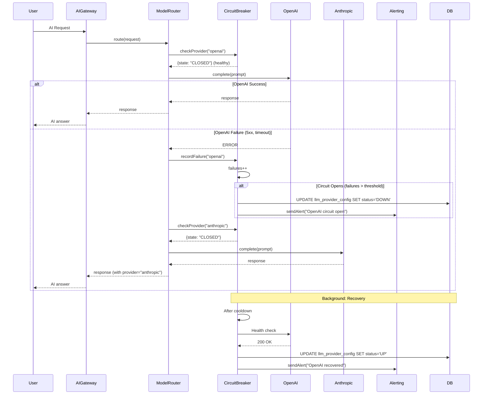

# AI Provider Failover - Analiza przepływu biznesowego

> **ID przepływu:** FLOW-AI-002  
> **Data analizy:** 2026-01-11  
> **Autor:** BFCS Analysis  
> **Status:** 🟢 Approved  
> **Wersja:** 1.0

---

## 📋 Podsumowanie wykonawcze

| Metryka                          | Wartość |
| -------------------------------- | ------- |
| **Kompletność przepływu**        | 90%     |
| **Liczba zidentyfikowanych luk** | 2       |
| **Luki krytyczne (🔴)**          | 0       |
| **Luki wysokie (🟠)**            | 0       |
| **Luki średnie (🟡)**            | 1       |
| **Luki niskie (🟢)**             | 1       |
| **Szacowany effort naprawy**     | S (4h)  |

### Status komponentów

| Komponent     | Status | Uwagi                         |
| ------------- | ------ | ----------------------------- |
| Frontend UI   | ✅     | Health dashboard w SuperAdmin |
| Backend API   | ✅     | modelRouter, circuitBreaker   |
| Database      | ✅     | llm_provider_config           |
| Integrations  | ✅     | OpenAI, Anthropic, Ollama     |
| Documentation | ⚠️     | Brak runbook dla incydentów   |

---

## 1️⃣ Definicja przepływu

### 1.1 Cel biznesowy

Zapewnienie wysokiej dostępności usług AI poprzez automatyczne przełączanie między providerami gdy główny provider jest niedostępny lub degraded.

### 1.2 Trigger (co rozpoczyna przepływ)

1. **API Error:** OpenAI zwraca 5xx lub timeout
2. **Rate Limit:** Provider zwraca 429
3. **Health Check Fail:** Scheduled health check fails
4. **Manual Override:** SuperAdmin ręcznie wyłącza provider

### 1.3 Outcome (oczekiwany rezultat)

- Automatyczny failover do backup providera
- Użytkownik nie zauważa przerwania
- Alert do ops team
- Automatic recovery gdy provider wraca

### 1.4 Success Criteria

- [x] Circuit breaker chroni przed cascading failures
- [x] modelRouter obsługuje failover
- [x] Health monitoring per provider
- [x] SuperAdmin może manualnie przełączać
- [ ] Automatic recovery testing
- [x] Alerting przy failover

---

## 2️⃣ Moduły zaangażowane

### 2.1 Backend Services

| Serwis           | Ścieżka                                      | Funkcje                     |
| ---------------- | -------------------------------------------- | --------------------------- |
| modelRouter      | `server/src/services/ai/modelRouter.ts`      | Provider selection, routing |
| circuitBreaker   | `server/src/services/ai/circuitBreaker.ts`   | Failure protection          |
| llmHealthMonitor | `server/src/services/ai/llmHealthMonitor.ts` | Health checks               |
| alerting         | `server/src/services/ai/alerting.ts`         | Incident alerts             |
| llmConfigService | `server/src/services/ai/llmConfigService.ts` | Provider config             |

### 2.2 Database

| Tabela                | Opis                   |
| --------------------- | ---------------------- |
| `llm_provider_config` | Provider configuration |
| `llm_health_logs`     | Health check history   |
| `ai_incidents`        | Incident tracking      |

---

## 3️⃣ Diagram sekwencji



---

## 4️⃣ Provider Priority

| Priority | Provider         | Use Case                    |
| -------- | ---------------- | --------------------------- |
| 1        | OpenAI GPT-4     | Primary - best quality      |
| 2        | Anthropic Claude | Backup - similar quality    |
| 3        | OpenAI GPT-3.5   | Fallback - faster, cheaper  |
| 4        | Ollama (local)   | Emergency - offline capable |

---

## 5️⃣ Circuit Breaker States

```
┌─────────────────────────────────────────────────────────────┐
│                    CIRCUIT BREAKER STATES                    │
├─────────────────────────────────────────────────────────────┤
│                                                              │
│   ┌─────────┐      failure > threshold     ┌─────────┐     │
│   │ CLOSED  │ ─────────────────────────────▶│  OPEN   │     │
│   │(healthy)│                               │(blocked)│     │
│   └────┬────┘                               └────┬────┘     │
│        │                                         │          │
│        │  success                    cooldown    │          │
│        │                             expires     │          │
│        │                                         ▼          │
│        │                               ┌─────────────┐      │
│        │◀──────── test success ────────│ HALF-OPEN  │      │
│        │                               │  (testing)  │      │
│                                        └─────────────┘      │
│                                              │              │
│                        test failure          │              │
│                                              ▼              │
│                                         Back to OPEN        │
│                                                              │
└─────────────────────────────────────────────────────────────┘

Configuration:
- failure_threshold: 5 failures in 60s
- cooldown_period: 30s
- half_open_requests: 3
```

---

## 6️⃣ Gap Analysis

### GAP-AI-004: Brak automatic recovery testing

| Atrybut         | Wartość                                                    |
| --------------- | ---------------------------------------------------------- |
| **Severity**    | 🟡 MEDIUM                                                  |
| **Component**   | Backend                                                    |
| **Description** | Po failover nie testujemy automatycznie czy primary wrócił |
| **Impact**      | Może zostać na backup dłużej niż potrzeba                  |
| **Fix**         | Dodać scheduled recovery probes                            |
| **Effort**      | S (3h)                                                     |

### GAP-AI-005: Brak incident runbook

| Atrybut         | Wartość                                                 |
| --------------- | ------------------------------------------------------- |
| **Severity**    | 🟢 LOW                                                  |
| **Component**   | Documentation                                           |
| **Description** | Brak dokumentacji dla ops team jak reagować na failover |
| **Impact**      | Dłuższy czas reakcji                                    |
| **Fix**         | Stworzyć runbook                                        |
| **Effort**      | S (1h)                                                  |

---

## 7️⃣ Action Items

| ID         | Opis                      | Priorytet | Effort | Status  |
| ---------- | ------------------------- | --------- | ------ | ------- |
| ACT-AI-004 | Automatic recovery probes | MEDIUM    | 3h     | 🔴 TODO |
| ACT-AI-005 | Incident runbook          | LOW       | 1h     | 🔴 TODO |

---

## 📎 Powiązane dokumenty

- [modelRouter.ts](../../server/src/services/ai/modelRouter.ts)
- [circuitBreaker.ts](../../server/src/services/ai/circuitBreaker.ts)
- [FLOW-AI-001: AI Usage & Limits](./AI_USAGE_LIMITS_FLOW.md)
