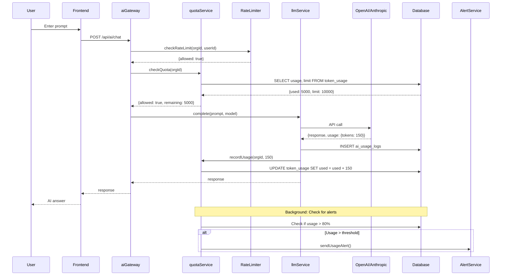

# AI Usage & Limits - Analiza przepływu biznesowego

> **ID przepływu:** FLOW-AI-001  
> **Data analizy:** 2026-01-11  
> **Autor:** BFCS Analysis  
> **Status:** 🟢 Approved  
> **Wersja:** 1.0

---

## 📋 Podsumowanie wykonawcze

| Metryka                          | Wartość  |
| -------------------------------- | -------- |
| **Kompletność przepływu**        | 85%      |
| **Liczba zidentyfikowanych luk** | 3        |
| **Luki krytyczne (🔴)**          | 0        |
| **Luki wysokie (🟠)**            | 1        |
| **Luki średnie (🟡)**            | 1        |
| **Luki niskie (🟢)**             | 1        |
| **Szacowany effort naprawy**     | S (6-8h) |

### Status komponentów

| Komponent     | Status | Uwagi                            |
| ------------- | ------ | -------------------------------- |
| Frontend UI   | ✅     | TokenUsageAnalytics, UsageAlerts |
| Backend API   | ✅     | quotaService, rateLimiter        |
| Database      | ✅     | ai_usage_logs, token_usage       |
| Integrations  | ⚠️     | Stripe metered billing częściowo |
| Documentation | ⚠️     | Brak user docs o limitach        |

---

## 1️⃣ Definicja przepływu

### 1.1 Cel biznesowy

Śledzenie i kontrolowanie użycia AI (tokeny, requests) per organizację, egzekwowanie limitów zgodnie z planem subskrypcji, oraz billing za overage.

### 1.2 Trigger (co rozpoczyna przepływ)

1. **API Request:** User wysyła prompt do AI
2. **Batch Processing:** System przetwarza dokumenty
3. **Usage Check:** Cron sprawdza limity
4. **Billing Cycle:** Koniec miesiąca - overage calculation

### 1.3 Outcome (oczekiwany rezultat)

- Każde użycie AI jest śledzone i logowane
- Limity są respektowane (soft/hard)
- Alerty są wysyłane przed przekroczeniem
- Overage jest naliczane poprawnie

### 1.4 Success Criteria

- [x] Każdy AI request loguje zużycie tokenów
- [x] Quota check przed każdym requestem
- [x] Rate limiting per org/user
- [x] Usage dashboard dostępny dla Admin
- [ ] Alerty przy 80%, 90%, 100% użycia
- [x] SuperAdmin widzi usage wszystkich orgs

---

## 2️⃣ Aktorzy

### 2.1 Mapa aktorów

```
┌─────────────────────────────────────────────────────────────────────┐
│                    AI USAGE & LIMITS FLOW                            │
├─────────────────────────────────────────────────────────────────────┤
│                                                                      │
│   [USER]  ──────►  [AI GATEWAY]  ──────►  [LLM PROVIDER]            │
│   (prompt)          (quota check,         (OpenAI,                   │
│                      rate limit)           Anthropic)                │
│                                                                      │
│       │                  │                      │                    │
│       │                  ▼                      │                    │
│       │            [QUOTA SERVICE]              │                    │
│       │            (check limits)               │                    │
│       │                  │                      │                    │
│       │                  ▼                      ▼                    │
│       │            [USAGE LOG]            [RESPONSE]                 │
│       │            (track tokens)         (to user)                  │
│       │                                                              │
│       ▼                  │                                           │
│   [ADMIN]                ▼                                           │
│   (view usage)     [BILLING]                                         │
│                    (overage calc)                                    │
│                                                                      │
└─────────────────────────────────────────────────────────────────────┘
```

### 2.2 Role i odpowiedzialności

| Aktor            | Rola        | Kluczowe akcje             |
| ---------------- | ----------- | -------------------------- |
| **User**         | AI consumer | Wysyła prompts             |
| **AI Gateway**   | Gatekeeper  | Sprawdza quota, rate limit |
| **QuotaService** | Enforcer    | Check/update usage         |
| **Admin**        | Monitor     | Przegląda usage dashboards |
| **Billing**      | Accountant  | Nalicza overage            |

---

## 3️⃣ Moduły zaangażowane

### 3.1 Frontend

| Moduł               | Ścieżka                                            | Status |
| ------------------- | -------------------------------------------------- | ------ |
| TokenUsageAnalytics | `src/components/analytics/TokenUsageAnalytics.tsx` | ✅     |
| BillingAlerts       | `src/components/billing/BillingAlerts.tsx`         | ✅     |
| AIUsageView (SA)    | `src/views/superadmin/AIUsageView.tsx`             | ✅     |

### 3.2 Backend Services

| Serwis       | Ścieżka                                  | Funkcje             |
| ------------ | ---------------------------------------- | ------------------- |
| quotaService | `server/src/services/ai/quotaService.ts` | Check/update quotas |
| rateLimiter  | `server/src/services/ai/rateLimiter.ts`  | Rate limiting       |
| aiGateway    | `server/src/services/ai/aiGateway.ts`    | Main entry point    |
| llmService   | `server/src/services/ai/llmService.ts`   | LLM calls           |

### 3.3 Database

| Tabela               | Opis                     |
| -------------------- | ------------------------ |
| `ai_usage_logs`      | Per-request logs         |
| `token_usage`        | Aggregated usage per org |
| `billing_alerts`     | Alert thresholds         |
| `subscription_plans` | Token limits per plan    |

---

## 4️⃣ Diagram sekwencji



---

## 5️⃣ Gap Analysis

### GAP-AI-001: Brak automatycznych alertów przy threshold

| Atrybut         | Wartość                                                      |
| --------------- | ------------------------------------------------------------ |
| **Severity**    | 🟠 HIGH                                                      |
| **Component**   | Backend                                                      |
| **Description** | System nie wysyła alertów gdy org przekracza 80%, 90% limitu |
| **Impact**      | Admini nie wiedzą że zbliżają się do limitu                  |
| **Fix**         | Dodać trigger w quotaService lub cron job                    |
| **Effort**      | M (3h)                                                       |

### GAP-AI-002: Brak soft cap / grace period

| Atrybut         | Wartość                                             |
| --------------- | --------------------------------------------------- |
| **Severity**    | 🟡 MEDIUM                                           |
| **Component**   | Backend                                             |
| **Description** | Hard limit odcina AI natychmiast bez warning period |
| **Impact**      | Bad UX, zaskoczeni użytkownicy                      |
| **Fix**         | Implementować soft cap z degraded service           |
| **Effort**      | M (4h)                                              |

### GAP-AI-003: Brak user-facing docs o limitach

| Atrybut         | Wartość                                     |
| --------------- | ------------------------------------------- |
| **Severity**    | 🟢 LOW                                      |
| **Component**   | Documentation                               |
| **Description** | Brak Help Center artykułu o AI usage/limits |
| **Impact**      | Support tickets                             |
| **Fix**         | Stworzyć dokumentację                       |
| **Effort**      | S (1h)                                      |

---

## 7️⃣ Action Items

| ID         | Opis                               | Priorytet | Effort | Status  |
| ---------- | ---------------------------------- | --------- | ------ | ------- |
| ACT-AI-001 | Automatyczne alerty przy threshold | HIGH      | 3h     | 🔴 TODO |
| ACT-AI-002 | Soft cap z grace period            | MEDIUM    | 4h     | 🔴 TODO |
| ACT-AI-003 | User documentation                 | LOW       | 1h     | 🔴 TODO |

---

## 📎 Powiązane dokumenty

- [quotaService.ts](../../server/src/services/ai/quotaService.ts)
- [rateLimiter.ts](../../server/src/services/ai/rateLimiter.ts)
- [FLOW-AI-002: AI Provider Failover](./AI_PROVIDER_FAILOVER_FLOW.md)
