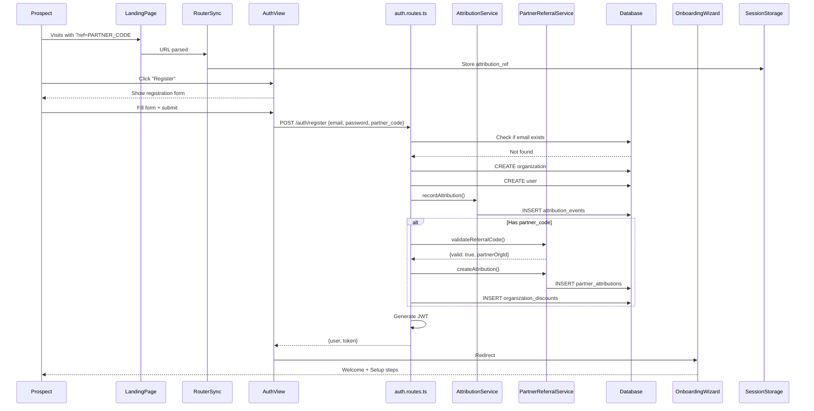

# User Onboarding - Analiza przepływu biznesowego

> **ID przepływu:** FLOW-AUTH-001  
> **Data analizy:** 2026-01-11  
> **Autor:** BFCS Analysis  
> **Status:** 🟢 Approved  
> **Wersja:** 1.0

---

## 📋 Podsumowanie wykonawcze

| Metryka                          | Wartość  |
| -------------------------------- | -------- |
| **Kompletność przepływu**        | 90%      |
| **Liczba zidentyfikowanych luk** | 3        |
| **Luki krytyczne (🔴)**          | 0        |
| **Luki wysokie (🟠)**            | 0        |
| **Luki średnie (🟡)**            | 2        |
| **Luki niskie (🟢)**             | 1        |
| **Szacowany effort naprawy**     | S (5-8h) |

### Status komponentów

| Komponent     | Status | Uwagi                                   |
| ------------- | ------ | --------------------------------------- |
| Frontend UI   | ✅     | AuthView, WelcomeView, OnboardingWizard |
| Backend API   | ✅     | auth.routes.ts kompletny                |
| Database      | ✅     | users, organizations, access_requests   |
| Integrations  | ✅     | Attribution tracking, Partner codes     |
| Documentation | ⚠️     | Brak onboarding guide                   |

---

## 1️⃣ Definicja przepływu

### 1.1 Cel biznesowy

Umożliwienie nowym użytkownikom założenia konta, utworzenia organizacji i rozpoczęcia korzystania z platformy. Zapewnienie smooth experience od landing page do pierwszego użycia.

### 1.2 Trigger (co rozpoczyna przepływ)

1. **Self-serve:** Użytkownik klika "Start Free" na landing page
2. **Invitation:** Użytkownik otrzymuje invite link od istniejącej organizacji
3. **Demo mode:** Użytkownik wybiera Demo bez rejestracji
4. **Partner referral:** Użytkownik przychodzi z linku partnera (?ref=CODE)

### 1.3 Outcome (oczekiwany rezultat)

- Użytkownik ma konto w systemie
- Organizacja jest utworzona (lub user dołączył do istniejącej)
- Onboarding wizard przeprowadził przez setup
- User może korzystać z dashboardu

### 1.4 Success Criteria

- [x] Użytkownik może się zarejestrować z email + password
- [x] Access code validation działa
- [x] Partner attribution jest captured
- [x] Onboarding wizard prowadzi przez setup
- [x] Demo mode pozwala na bezpieczne testowanie
- [ ] Email verification jest wysyłany
- [ ] Progress onboardingu jest tracked

---

## 2️⃣ Aktorzy

### 2.1 Mapa aktorów

```
┌─────────────────────────────────────────────────────────────────────┐
│                    USER ONBOARDING FLOW                              │
├─────────────────────────────────────────────────────────────────────┤
│                                                                      │
│   [PROSPECT]  ──────►  [AUTH UI]  ──────►  [ONBOARDING]             │
│   (landing              (register/         (wizard,                  │
│    page)                 login)              setup)                  │
│                                                                      │
│       │                     │                    │                   │
│       │ ?ref=CODE           │                    │                   │
│       ▼                     ▼                    ▼                   │
│   [ATTRIBUTION]        [AUTH API]          [DASHBOARD]               │
│   (partner              (auth.routes)       (main app)               │
│    tracking)                                                         │
│                              │                                       │
│                              ▼                                       │
│                        [SUPERADMIN]                                  │
│                        (access request                               │
│                         approval)                                    │
│                                                                      │
└─────────────────────────────────────────────────────────────────────┘
```

### 2.2 Role i odpowiedzialności

| Aktor          | Rola                   | Kluczowe akcje                               |
| -------------- | ---------------------- | -------------------------------------------- |
| **Prospect**   | Potencjalny użytkownik | Wypełnia formularz, podaje dane              |
| **System**     | Automatyzacja          | Walidacja, tworzenie konta, attribution      |
| **SuperAdmin** | Approval               | Zatwierdza access requests (jeśli brak kodu) |

---

## 3️⃣ Moduły zaangażowane

### 3.1 Frontend

| Moduł               | Ścieżka                                             | Status                 |
| ------------------- | --------------------------------------------------- | ---------------------- |
| AuthView            | `src/views/AuthView.tsx`                            | ✅                     |
| WelcomeView         | `src/views/WelcomeView.tsx`                         | ✅                     |
| OnboardingWizard    | `src/views/OnboardingWizard.tsx`                    | ✅                     |
| OnboardingChecklist | `src/components/Onboarding/OnboardingChecklist.tsx` | ✅                     |
| RouterSync          | `src/components/RouterSync.tsx`                     | ✅ Attribution capture |

### 3.2 Backend API

| Endpoint                         | Metoda | Opis                       | Status |
| -------------------------------- | ------ | -------------------------- | ------ |
| `/api/auth/register`             | POST   | Rejestracja + org creation | ✅     |
| `/api/auth/login`                | POST   | Login                      | ✅     |
| `/api/auth/demo-login`           | POST   | Demo mode access           | ✅     |
| `/api/auth/validate-access-code` | POST   | Walidacja kodu             | ✅     |
| `/api/auth/me`                   | GET    | Current user info          | ✅     |

### 3.3 Services

| Serwis                 | Ścieżka                                         | Funkcje                 |
| ---------------------- | ----------------------------------------------- | ----------------------- |
| auth.routes.ts         | `server/src/routes/auth.routes.ts`              | Full auth logic         |
| AttributionService     | `server/src/services/attributionService.ts`     | Attribution tracking    |
| PartnerReferralService | `server/src/services/partnerReferralService.ts` | Partner code validation |

### 3.4 Database

| Tabela                 | Opis                  |
| ---------------------- | --------------------- |
| `users`                | User accounts         |
| `organizations`        | Organizations         |
| `access_requests`      | Pending approvals     |
| `access_codes`         | Valid access codes    |
| `attribution_events`   | Marketing attribution |
| `partner_attributions` | Partner referrals     |

---

## 4️⃣ Diagram sekwencji



---

## 5️⃣ Dependency Matrix

### Landing → Auth

| Source      | Target         | Type         | Status |
| ----------- | -------------- | ------------ | ------ |
| RouterSync  | SessionStorage | Data capture | ✅     |
| LandingPage | AuthView       | Navigation   | ✅     |

### Frontend → API

| Frontend | API Endpoint                     | Status |
| -------- | -------------------------------- | ------ |
| AuthView | `/api/auth/register`             | ✅     |
| AuthView | `/api/auth/login`                | ✅     |
| AuthView | `/api/auth/demo-login`           | ✅     |
| AuthView | `/api/auth/validate-access-code` | ✅     |

### API → Services

| API            | Service                                       | Status |
| -------------- | --------------------------------------------- | ------ |
| /auth/register | AttributionService.recordAttribution()        | ✅     |
| /auth/register | PartnerReferralService.validateReferralCode() | ✅     |
| /auth/register | PartnerReferralService.createAttribution()    | ✅     |

---

## 6️⃣ Gap Analysis

### GAP-AUTH-001: Brak email verification

| Atrybut         | Wartość                                    |
| --------------- | ------------------------------------------ |
| **Severity**    | 🟡 MEDIUM                                  |
| **Component**   | Backend                                    |
| **Description** | Email nie jest weryfikowany po rejestracji |
| **Impact**      | Możliwe fake accounts, security risk       |
| **Fix**         | Dodać email verification flow              |
| **Effort**      | M (4h)                                     |

### GAP-AUTH-002: Brak progress tracking onboardingu

| Atrybut         | Wartość                                            |
| --------------- | -------------------------------------------------- |
| **Severity**    | 🟡 MEDIUM                                          |
| **Component**   | Backend/Frontend                                   |
| **Description** | Nie śledzimy który step onboardingu user completed |
| **Impact**      | Nie możemy targetować incomplete onboardings       |
| **Fix**         | Dodać onboarding_progress table i tracking         |
| **Effort**      | S (3h)                                             |

### GAP-AUTH-003: Brak welcome email

| Atrybut         | Wartość                                       |
| --------------- | --------------------------------------------- |
| **Severity**    | 🟢 LOW                                        |
| **Component**   | Backend                                       |
| **Description** | User nie dostaje welcome email po rejestracji |
| **Impact**      | Gorszy first impression                       |
| **Fix**         | Dodać welcome email w auth.routes.ts          |
| **Effort**      | S (1h)                                        |

---

## 7️⃣ Action Items

| ID           | Opis                         | Priorytet | Effort | Status  |
| ------------ | ---------------------------- | --------- | ------ | ------- |
| ACT-AUTH-001 | Dodać email verification     | MEDIUM    | 4h     | 🔴 TODO |
| ACT-AUTH-002 | Onboarding progress tracking | MEDIUM    | 3h     | 🔴 TODO |
| ACT-AUTH-003 | Welcome email                | LOW       | 1h     | 🔴 TODO |

---

## 8️⃣ Rekomendacje

### Krótkoterminowe (1-2 tygodnie)

1. **ACT-AUTH-003**: Welcome email - quick win, dobry UX

### Średnioterminowe (1 miesiąc)

1. **ACT-AUTH-001**: Email verification - security best practice
2. **ACT-AUTH-002**: Progress tracking - analytics value

### Długoterminowe

1. Rozważyć social login (Google, Microsoft)

---

## 📎 Powiązane dokumenty

- [auth.routes.ts](../../server/src/routes/auth.routes.ts)
- [AuthView.tsx](../../src/views/AuthView.tsx)
- [OnboardingWizard.tsx](../../src/views/OnboardingWizard.tsx)
