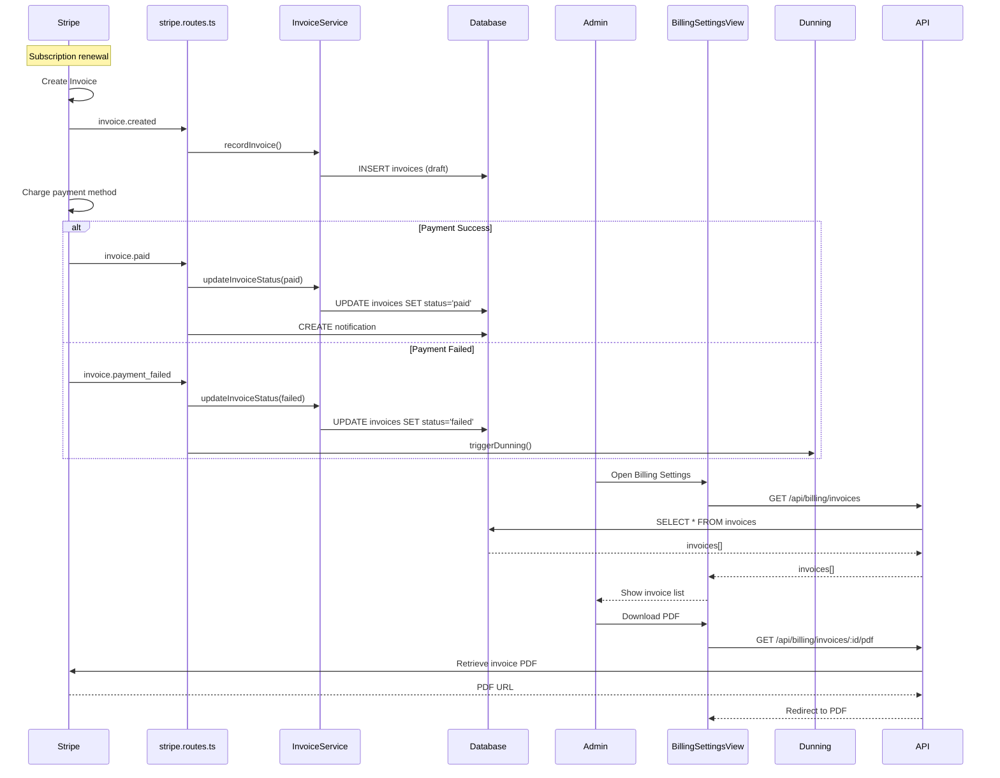

# Invoice & Payment - Analiza przepływu biznesowego

> **ID przepływu:** FLOW-BILLING-002  
> **Data analizy:** 2026-01-11  
> **Autor:** BFCS Analysis  
> **Status:** 🟢 Approved  
> **Wersja:** 1.0

---

## 📋 Podsumowanie wykonawcze

| Metryka                          | Wartość    |
| -------------------------------- | ---------- |
| **Kompletność przepływu**        | 80%        |
| **Liczba zidentyfikowanych luk** | 5          |
| **Luki krytyczne (🔴)**          | 0          |
| **Luki wysokie (🟠)**            | 2          |
| **Luki średnie (🟡)**            | 2          |
| **Luki niskie (🟢)**             | 1          |
| **Szacowany effort naprawy**     | M (10-15h) |

### Status komponentów

| Komponent     | Status | Uwagi                             |
| ------------- | ------ | --------------------------------- |
| Frontend UI   | ✅     | Invoice list w Billing Settings   |
| Backend API   | ✅     | InvoiceService, billing.routes.ts |
| Database      | ✅     | Tabela invoices                   |
| Integrations  | ⚠️     | Stripe Invoices, PDF generation   |
| Documentation | ⚠️     | Brak invoice guide                |

---

## 1️⃣ Definicja przepływu

### 1.1 Cel biznesowy

Automatyczne generowanie faktur za subskrypcje i usługi, przetwarzanie płatności, oraz dostarczanie dokumentacji finansowej do organizacji.

### 1.2 Trigger (co rozpoczyna przepływ)

1. **Subscription renewal:** Stripe automatycznie generuje invoice
2. **Usage billing:** Overage charges na koniec okresu
3. **Manual invoice:** SuperAdmin tworzy manualną fakturę
4. **Credit note:** Korekta/zwrot

### 1.3 Outcome (oczekiwany rezultat)

- Faktura wygenerowana z poprawnymi danymi
- Płatność pobrana automatycznie lub manual
- PDF dostępny do pobrania
- Księgowość zaktualizowana

### 1.4 Success Criteria

- [x] Faktury są tworzone automatycznie przez Stripe
- [x] Admin może zobaczyć historię faktur
- [x] Admin może pobrać PDF faktury
- [x] Failed payments triggerują dunning
- [ ] Credit notes są poprawnie powiązane z fakturami
- [ ] Faktury zawierają dane VAT organizacji

---

## 2️⃣ Aktorzy

### 2.1 Mapa aktorów

```
┌─────────────────────────────────────────────────────────────────────┐
│                    INVOICE & PAYMENT FLOW                            │
├─────────────────────────────────────────────────────────────────────┤
│                                                                      │
│   [STRIPE]  ──────►  [WEBHOOK]  ──────►  [INVOICE SERVICE]          │
│   (auto-                (stripe.routes)    (processing)              │
│    billing)                                                          │
│                                                                      │
│       │                     │                                        │
│       │                     ▼                                        │
│       │               [DATABASE]                                     │
│       │               (invoices)                                     │
│       │                                                              │
│       ▼                     │                                        │
│   [PAYMENT]                 ▼                                        │
│   (auto-charge)       [ADMIN]                                        │
│       │               (views invoices,                               │
│       │                downloads PDF)                                │
│       │                                                              │
│       ▼                     │                                        │
│   [DUNNING]                 ▼                                        │
│   (if failed)         [SUPERADMIN]                                   │
│                       (monitoring, refunds)                          │
│                                                                      │
└─────────────────────────────────────────────────────────────────────┘
```

### 2.2 Role i odpowiedzialności

| Aktor              | Rola              | Kluczowe akcje                   |
| ------------------ | ----------------- | -------------------------------- |
| **Stripe**         | Invoice generator | Tworzy faktury przy renewal      |
| **Webhook**        | Event processor   | Odbiera events od Stripe         |
| **InvoiceService** | Business logic    | Przetwarzanie i zapis            |
| **Admin**          | Viewer            | Przegląda faktury, pobiera PDF   |
| **SuperAdmin**     | Manager           | Refunds, credit notes, analytics |
| **DunningService** | Recovery          | Retries failed payments          |

---

## 3️⃣ Moduły zaangażowane

### 3.1 Frontend

| Moduł              | Ścieżka                                                  | Status |
| ------------------ | -------------------------------------------------------- | ------ |
| InvoicesList       | `src/views/admin/BillingSettingsView.tsx`                | ✅     |
| InvoicesPanel (SA) | `src/components/SuperAdmin/billing/InvoicesPanel.tsx`    | ✅     |
| CreditNotesPanel   | `src/components/SuperAdmin/billing/CreditNotesPanel.tsx` | ✅     |

### 3.2 Backend API

| Endpoint                        | Metoda | Opis               | Status  |
| ------------------------------- | ------ | ------------------ | ------- |
| `/api/billing/invoices`         | GET    | Lista faktur org   | ✅      |
| `/api/billing/invoices/:id`     | GET    | Szczegóły faktury  | ✅      |
| `/api/billing/invoices/:id/pdf` | GET    | Pobierz PDF        | ⚠️ Mock |
| `/api/superadmin/invoices`      | GET    | Wszystkie faktury  | ✅      |
| `/api/superadmin/credit-notes`  | POST   | Utwórz credit note | ✅      |
| `/webhooks/stripe`              | POST   | invoice.\* events  | ✅      |

### 3.3 Services

| Serwis         | Ścieżka                                 | Funkcje              |
| -------------- | --------------------------------------- | -------------------- |
| InvoiceService | `server/src/services/InvoiceService.ts` | CRUD, PDF            |
| BillingService | `server/src/services/BillingService.ts` | Integration          |
| DunningService | `server/src/services/DunningService.ts` | Failed payment retry |

### 3.4 Database

| Tabela               | Opis                |
| -------------------- | ------------------- |
| `invoices`           | Wszystkie faktury   |
| `invoice_line_items` | Pozycje na fakturze |
| `credit_notes`       | Korekty             |
| `dunning_attempts`   | Historia retry      |

---

## 4️⃣ Diagram sekwencji



---

## 5️⃣ Dependency Matrix

### Stripe Events → Webhook Handlers

| Event                    | Handler                | DB Update            | Status     |
| ------------------------ | ---------------------- | -------------------- | ---------- |
| `invoice.created`        | handleInvoiceCreated   | INSERT invoices      | ✅         |
| `invoice.paid`           | handleInvoicePaid      | UPDATE status=paid   | ✅         |
| `invoice.payment_failed` | handlePaymentFailed    | UPDATE status=failed | ✅         |
| `invoice.finalized`      | handleInvoiceFinalized | UPDATE finalized_at  | ⚠️ Missing |

### Frontend → API

| Frontend            | API Endpoint                    | Status |
| ------------------- | ------------------------------- | ------ |
| BillingSettingsView | `/api/billing/invoices`         | ✅     |
| BillingSettingsView | `/api/billing/invoices/:id/pdf` | ⚠️     |
| InvoicesPanel (SA)  | `/api/superadmin/invoices`      | ✅     |
| CreditNotesPanel    | `/api/superadmin/credit-notes`  | ✅     |

---

## 6️⃣ Gap Analysis

### GAP-INVOICE-001: PDF generation nie działa dla wszystkich przypadków

| Atrybut         | Wartość                                                      |
| --------------- | ------------------------------------------------------------ |
| **Severity**    | 🟠 HIGH                                                      |
| **Component**   | Backend                                                      |
| **Description** | PDF pobiera się z Stripe, ale dla manual invoices nie działa |
| **Impact**      | Admin nie może pobrać wszystkich faktur                      |
| **Fix**         | Dodać własne PDF generation dla non-Stripe invoices          |
| **Effort**      | 4h                                                           |

### GAP-INVOICE-002: Brak VAT handling

| Atrybut         | Wartość                                            |
| --------------- | -------------------------------------------------- |
| **Severity**    | 🟠 HIGH                                            |
| **Component**   | Backend/Frontend                                   |
| **Description** | Faktury nie zawierają VAT ID organizacji           |
| **Impact**      | Problemy z księgowością dla EU klientów            |
| **Fix**         | Dodać VAT ID do org profile, przekazywać do Stripe |
| **Effort**      | 3h                                                 |

### GAP-INVOICE-003: Brak invoice.finalized handler

| Atrybut         | Wartość                                 |
| --------------- | --------------------------------------- |
| **Severity**    | 🟡 MEDIUM                               |
| **Component**   | Backend                                 |
| **Description** | Nie obsługujemy invoice.finalized event |
| **Impact**      | finalized_at nie jest tracked           |
| **Fix**         | Dodać handler w stripe.routes.ts        |
| **Effort**      | 1h                                      |

### GAP-INVOICE-004: Credit notes nie są linked z original invoice UI

| Atrybut         | Wartość                                          |
| --------------- | ------------------------------------------------ |
| **Severity**    | 🟡 MEDIUM                                        |
| **Component**   | Frontend                                         |
| **Description** | UI nie pokazuje powiązania credit note → invoice |
| **Impact**      | Trudna nawigacja dla finance team                |
| **Fix**         | Dodać linking w InvoicesPanel                    |
| **Effort**      | 2h                                               |

### GAP-INVOICE-005: Brak invoice reminder emails

| Atrybut         | Wartość                            |
| --------------- | ---------------------------------- |
| **Severity**    | 🟢 LOW                             |
| **Component**   | Backend                            |
| **Description** | Brak reminder przed due date       |
| **Impact**      | Więcej failed payments             |
| **Fix**         | Dodać cron job dla reminder emails |
| **Effort**      | 3h                                 |

---

## 7️⃣ Action Items

| ID          | Opis                                      | Priorytet | Effort | Status  |
| ----------- | ----------------------------------------- | --------- | ------ | ------- |
| ACT-INV-001 | Własne PDF generation dla manual invoices | HIGH      | 4h     | 🔴 TODO |
| ACT-INV-002 | VAT handling (org profile + Stripe)       | HIGH      | 3h     | 🔴 TODO |
| ACT-INV-003 | Handler dla invoice.finalized             | MEDIUM    | 1h     | 🔴 TODO |
| ACT-INV-004 | Credit note linking w UI                  | MEDIUM    | 2h     | 🔴 TODO |
| ACT-INV-005 | Invoice reminder emails                   | LOW       | 3h     | 🔴 TODO |

---

## 8️⃣ Rekomendacje

### Krótkoterminowe (1-2 tygodnie)

1. **ACT-INV-002**: VAT handling - compliance requirement
2. **ACT-INV-001**: PDF generation - UX blocker

### Średnioterminowe (1 miesiąc)

1. **ACT-INV-003 + ACT-INV-004**: Event handling i UI improvements

### Długoterminowe

1. **ACT-INV-005**: Reminder emails dla lepszego cash flow

---

## 📎 Powiązane dokumenty

- [FLOW-BILLING-001: Subscription Lifecycle](./SUBSCRIPTION_LIFECYCLE_FLOW.md)
- [InvoiceService Code](../../server/src/services/InvoiceService.ts)
- [DunningService Code](../../server/src/services/DunningService.ts)
