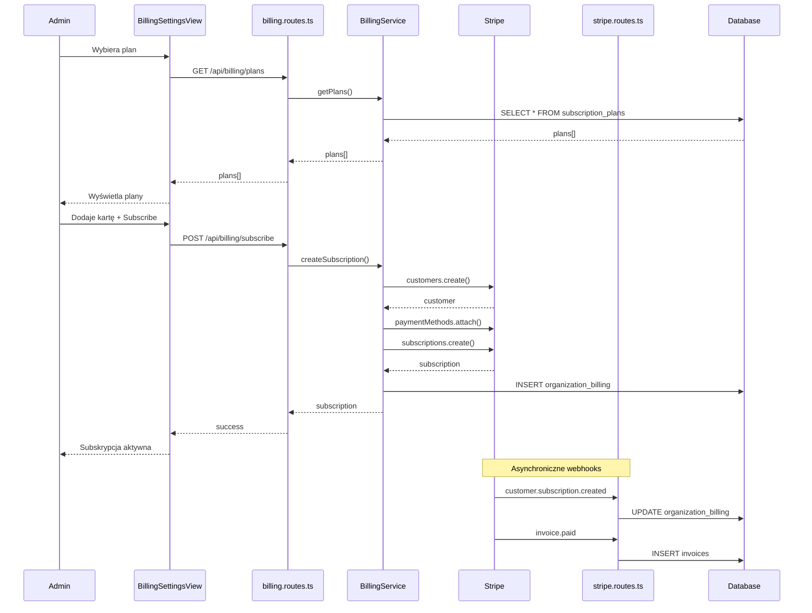

# Subscription Lifecycle - Analiza przepływu biznesowego

> **ID przepływu:** FLOW-BILLING-001  
> **Data analizy:** 2026-01-11  
> **Autor:** BFCS Analysis  
> **Status:** 🟢 Approved  
> **Wersja:** 1.0

---

## 📋 Podsumowanie wykonawcze

| Metryka                          | Wartość   |
| -------------------------------- | --------- |
| **Kompletność przepływu**        | 85%       |
| **Liczba zidentyfikowanych luk** | 4         |
| **Luki krytyczne (🔴)**          | 0         |
| **Luki wysokie (🟠)**            | 1         |
| **Luki średnie (🟡)**            | 2         |
| **Luki niskie (🟢)**             | 1         |
| **Szacowany effort naprawy**     | M (8-12h) |

### Status komponentów

| Komponent     | Status | Uwagi                                                           |
| ------------- | ------ | --------------------------------------------------------------- |
| Frontend UI   | ✅     | BillingSettingsView kompletny                                   |
| Backend API   | ✅     | BillingService, billing.routes.ts                               |
| Database      | ✅     | Tabele: subscriptions, subscription_plans, organization_billing |
| Integrations  | ⚠️     | Stripe webhook działa, ale brak retry                           |
| Documentation | ⚠️     | Brak user-facing docs                                           |

---

## 1️⃣ Definicja przepływu

### 1.1 Cel biznesowy

Umożliwienie organizacjom zarządzania subskrypcją SaaS - od wyboru planu, przez aktywację, upgrade/downgrade, aż do cancellation. Zapewnienie ciągłości przychodów recurringowych.

### 1.2 Trigger (co rozpoczyna przepływ)

1. **New Subscription:** Admin organizacji wybiera plan w Billing Settings
2. **Upgrade/Downgrade:** Admin zmienia plan
3. **Cancellation:** Admin anuluje subskrypcję
4. **Auto-renewal:** Stripe automatycznie odnawia subskrypcję

### 1.3 Outcome (oczekiwany rezultat)

- Organizacja ma aktywną subskrypcję z odpowiednim planem
- Stripe pobiera płatności automatycznie
- Faktury są generowane i wysyłane
- Limity tokenów/storage są aktualizowane zgodnie z planem

### 1.4 Success Criteria

- [x] Admin może zobaczyć dostępne plany z cenami
- [x] Admin może wybrać plan i dodać metodę płatności
- [x] Stripe tworzy subskrypcję i pobiera pierwszą płatność
- [x] Webhooks aktualizują status w naszej bazie
- [ ] Admin otrzymuje email potwierdzający zmianę planu
- [x] Limity są aktualizowane natychmiast po zmianie planu

---

## 2️⃣ Aktorzy

### 2.1 Mapa aktorów

```
┌─────────────────────────────────────────────────────────────────────┐
│                 SUBSCRIPTION LIFECYCLE FLOW                          │
├─────────────────────────────────────────────────────────────────────┤
│                                                                      │
│   [ADMIN]  ──────►  [SYSTEM]  ──────►  [STRIPE]                     │
│   (wybór             (API              (payment                      │
│    planu)            processing)        processing)                  │
│                                                                      │
│       │                                     │                        │
│       │                                     │                        │
│       ▼                                     ▼                        │
│   [BILLING UI]                        [WEBHOOK]                      │
│   (BillingSettingsView)               (stripe.routes.ts)            │
│                                                                      │
│                           │                                          │
│                           ▼                                          │
│                    [SUPERADMIN]                                      │
│                    (monitoring,                                      │
│                     override)                                        │
│                                                                      │
└─────────────────────────────────────────────────────────────────────┘
```

### 2.2 Role i odpowiedzialności

| Aktor          | Rola                     | Kluczowe akcje                                       |
| -------------- | ------------------------ | ---------------------------------------------------- |
| **Admin**      | Zarządzający organizacją | Wybór planu, dodanie karty, anulowanie               |
| **System**     | Automatyzacja            | Tworzenie subskrypcji w Stripe, aktualizacja limitów |
| **Stripe**     | Płatności                | Przetwarzanie płatności, zarządzanie subskrypcjami   |
| **SuperAdmin** | Oversight                | Monitoring przychodów, manualne overrides            |

---

## 3️⃣ Moduły zaangażowane

### 3.1 Frontend

| Moduł                  | Ścieżka                                        | Status |
| ---------------------- | ---------------------------------------------- | ------ |
| BillingSettingsView    | `src/views/admin/BillingSettingsView.tsx`      | ✅     |
| PlanSelector           | `src/components/billing/PlanSelector.tsx`      | ✅     |
| PaymentMethodForm      | `src/components/billing/PaymentMethodForm.tsx` | ✅     |
| BillingCenterView (SA) | `src/views/superadmin/BillingCenterView.tsx`   | ✅     |

### 3.2 Backend API

| Endpoint                    | Metoda | Opis               | Status |
| --------------------------- | ------ | ------------------ | ------ |
| `/api/billing/plans`        | GET    | Lista planów       | ✅     |
| `/api/billing/organization` | GET    | Billing org        | ✅     |
| `/api/billing/subscribe`    | POST   | Utwórz subskrypcję | ✅     |
| `/api/billing/change-plan`  | POST   | Zmień plan         | ✅     |
| `/api/billing/cancel`       | POST   | Anuluj subskrypcję | ✅     |
| `/webhooks/stripe`          | POST   | Stripe webhook     | ✅     |

### 3.3 Services

| Serwis                | Ścieżka                                                | Funkcje            |
| --------------------- | ------------------------------------------------------ | ------------------ |
| BillingService        | `server/src/services/BillingService.ts`                | Główny serwis      |
| BillingCommandService | `server/src/services/billing/BillingCommandService.ts` | Mutacje            |
| BillingQueryService   | `server/src/services/billing/BillingQueryService.ts`   | Queries            |
| BillingWebhookService | `server/src/services/BillingWebhookService.ts`         | Webhook processing |

### 3.4 Database

| Tabela                 | Opis                   |
| ---------------------- | ---------------------- |
| `subscription_plans`   | Definicje planów       |
| `subscriptions`        | Aktywne subskrypcje    |
| `organization_billing` | Billing status per org |
| `payment_methods`      | Metody płatności       |

---

## 4️⃣ Diagram sekwencji



---

## 5️⃣ Dependency Matrix

### Frontend → API

| Frontend            | API Endpoint                | Status |
| ------------------- | --------------------------- | ------ |
| BillingSettingsView | `/api/billing/plans`        | ✅     |
| BillingSettingsView | `/api/billing/organization` | ✅     |
| BillingSettingsView | `/api/billing/subscribe`    | ✅     |
| BillingSettingsView | `/api/billing/cancel`       | ✅     |
| PlanSelector        | `/api/billing/change-plan`  | ✅     |

### API → Service

| API                  | Service Method                             | Status |
| -------------------- | ------------------------------------------ | ------ |
| `/billing/plans`     | BillingQueryService.getPlans()             | ✅     |
| `/billing/subscribe` | BillingCommandService.createSubscription() | ✅     |
| `/billing/cancel`    | BillingCommandService.cancelSubscription() | ✅     |

### Service → Database

| Service               | Tables                                   | Status |
| --------------------- | ---------------------------------------- | ------ |
| BillingQueryService   | subscription_plans, organization_billing | ✅     |
| BillingCommandService | subscriptions, organization_billing      | ✅     |

### External Integrations

| Integration              | Direction | Status |
| ------------------------ | --------- | ------ |
| Stripe Subscriptions API | Outbound  | ✅     |
| Stripe Webhooks          | Inbound   | ✅     |

---

## 6️⃣ Gap Analysis

### GAP-BILLING-001: Brak email po zmianie planu

| Atrybut         | Wartość                                              |
| --------------- | ---------------------------------------------------- |
| **Severity**    | 🟠 HIGH                                              |
| **Component**   | Backend                                              |
| **Description** | Admin nie otrzymuje email po upgrade/downgrade planu |
| **Impact**      | Brak potwierdzenia, ryzyko nieporozumień             |
| **Fix**         | Dodać trigger email w `changePlan()`                 |
| **Effort**      | 2h                                                   |

### GAP-BILLING-002: Brak retry dla webhooks

| Atrybut         | Wartość                                       |
| --------------- | --------------------------------------------- |
| **Severity**    | 🟡 MEDIUM                                     |
| **Component**   | Backend                                       |
| **Description** | Jeśli webhook fail, brak automatycznego retry |
| **Impact**      | Możliwy desync między Stripe a DB             |
| **Fix**         | Dodać webhook queue z retry logic             |
| **Effort**      | 4h                                            |

### GAP-BILLING-003: Brak grace period przy anulowaniu

| Atrybut         | Wartość                                            |
| --------------- | -------------------------------------------------- |
| **Severity**    | 🟡 MEDIUM                                          |
| **Component**   | Backend/Frontend                                   |
| **Description** | Cancellation jest natychmiastowy, bez grace period |
| **Impact**      | Utrata potencjalnych klientów                      |
| **Fix**         | Implementacja cancel_at_period_end                 |
| **Effort**      | 3h                                                 |

### GAP-BILLING-004: Brak dokumentacji dla użytkowników

| Atrybut         | Wartość                                  |
| --------------- | ---------------------------------------- |
| **Severity**    | 🟢 LOW                                   |
| **Component**   | Documentation                            |
| **Description** | Brak help docs o zarządzaniu subskrypcją |
| **Impact**      | Support tickets                          |
| **Fix**         | Stworzyć help center artykuły            |
| **Effort**      | 2h                                       |

---

## 7️⃣ Action Items

| ID           | Opis                                      | Priorytet | Effort | Status  |
| ------------ | ----------------------------------------- | --------- | ------ | ------- |
| ACT-BILL-001 | Dodać email notification po zmianie planu | HIGH      | 2h     | 🔴 TODO |
| ACT-BILL-002 | Implementować webhook retry queue         | MEDIUM    | 4h     | 🔴 TODO |
| ACT-BILL-003 | Dodać grace period (cancel_at_period_end) | MEDIUM    | 3h     | 🔴 TODO |
| ACT-BILL-004 | Stworzyć user documentation               | LOW       | 2h     | 🔴 TODO |

---

## 8️⃣ Rekomendacje

### Krótkoterminowe (1-2 tygodnie)

1. **ACT-BILL-001**: Dodać email - quick win dla UX
2. **ACT-BILL-003**: Grace period - zmniejszy churn

### Średnioterminowe (1 miesiąc)

1. **ACT-BILL-002**: Webhook queue - ważne dla reliability

### Długoterminowe

1. **ACT-BILL-004**: Dokumentacja dla self-service

---

## 📎 Powiązane dokumenty

- [FLOW-BILLING-002: Invoice & Payment Flow](./INVOICE_PAYMENT_FLOW.md)
- [BillingService Code](../../server/src/services/BillingService.ts)
- [Stripe Integration](../../server/src/routes/webhooks/stripe.routes.ts)
