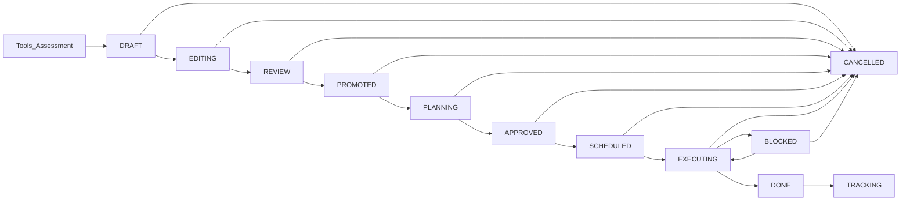

# FLOW-INITIATIVE-001: Initiative Management (Canonical)

> **ID:** FLOW-INITIATIVE-001 | **Status:** ✅ Complete | **Priority:** P0

## Overview

| Metric                    | Value                                           |
| ------------------------- | ----------------------------------------------- |
| **Completeness**          | 85%                                             |
| **Gaps Identified**       | 3                                               |
| **Implementation Status** | Mostly implemented, needs status machine update |

## Purpose
Define the **end-to-end initiative lifecycle** (one initiative = one object = one lifecycle), including governance decision gates, and module ownership from creation to benefits tracking.

Canonical references:
- `docs/product/SYSTEM_ARCHITECTURE_BRIEF.md`
- `docs/product/INITIATIVE_GOVERNANCE_MODEL.md`

## Initiative flow (canonical)



> This reflects the simplified, final initiative status model (no extra statuses).

### Status definitions (what it means, where it lives)

| Status / Gate phase | Module ownership | Description |
|---|---|---|
| **DRAFT** | Tools / Assessment | Initiative draft auto-created from outputs |
| **EDITING** | Initiatives | Single initiative form; enriched and completed |
| **REVIEW** | Initiatives | Prepared for promotion decision |
| **PROMOTED** (Gate 1) | Initiatives | Sponsor decides “is this a real initiative?” |
| **PLANNING** | Initiatives | Scope/KPI/dependencies/timeline readiness completed |
| **APPROVED** (Gate 2) | Initiatives | Sponsor/Committee approves investing resources |
| **SCHEDULED** (Gate 3) | Initiatives | PMO schedules on roadmap and baseline |
| **EXECUTING** | Implementation | Tasks executed; changes and risks tracked |
| **BLOCKED** | Implementation | Blocked state; requires decision to unblock/escalate |
| **DONE** (Gate 4) | Implementation → Benefits | PMO confirms delivery completion |
| **TRACKING** (Gate 5) | Benefits | Business Owner accepts and starts measuring benefits |
| **CANCELLED** | Any | Sponsor cancels with rationale |

## Triggers

| Trigger             | Description                                  |
| ------------------- | -------------------------------------------- |
| Assessment Complete | Assessment report generates draft initiatives |
| Tool Complete | Tool outputs generate draft initiatives |
| Manual Creation | Authorized user creates initiative manually |
| Import PDF | External audit import can generate drafts |
| Gate Decision | A decision gate authorizes the transition |

## Outcomes

- Initiative created with full context from tools/assessment
- Decision gates prevent uncontrolled lifecycle transitions
- Execution is tracked in Implementation (tasks + decisions + RAID)
- Benefits are tracked via KPIs in Benefits

## Initiative card structure (N-mode, canonical)

The Initiative detail card in N-mode uses a canonical navigation order.  
Visibility is controlled by initiative template (`visibleSections`), but ordering remains stable.

1. Initiative Definition
2. Target State & Scope
3. KPI
4. Financial Analysis
5. Financial Impact
6. Team
7. RACI
8. Resources
9. Dependencies
10. Risk & RAID
11. Milestones
12. Timeline
13. Tasks
14. Decisions
15. Gates
16. Technical Specification
17. Attachments
18. Comments
19. Activity Log

### Visibility rules (template-driven)

- `visibleSections[key] = true` -> corresponding tab visible
- `visibleSections[key] = false` -> corresponding tab hidden
- If template provides explicit `visibleSections`, this map is authoritative (no fallback "show all")

### Key mapping notes

- `problemDefinition` and legacy `overview` map to **Initiative Definition**
- `targetState` and `scope` map to **Target State & Scope**
- `financialAnalysis` and `financialImpact` are distinct tabs
- RAID stays explicit as **Risk & RAID**
- `stakeholders` is presented as **RACI**
- `history` is presented as **Activity Log**

## Actors

| Actor | Role |
|---|---|
| Business Owner / Sponsor | Final decision authority for governance gates |
| Transformation Lead | Owns lifecycle logic and scheduling baseline |
| Consultant / Domain Expert | Creates drafts from tools/assessments (advisory) |
| Execution Lead (PM / Delivery) | Owns execution delivery and closure |
| Contributor | Executes tasks and updates progress |
| AI System | Assists analysis, summarization, recommendations (never decides) |

## Sequence diagram: Assessment/Tools → Initiative draft

```text
┌──────────────┐   ┌──────────────┐   ┌──────────────┐   ┌──────────────┐
│  Tools/Assess│   │  Initiative  │   │   Project    │   │    AI        │
│   Module     │   │   Service    │   │   Service    │   │   System     │
└──────┬───────┘   └──────┬───────┘   └──────┬───────┘   └──────┬───────┘
       │                  │                  │                  │
       │ Complete tool/assessment            │                  │
       │─────────────────►│                  │                  │
       │                  │                  │                  │
       │                  │  Analyze outputs │                  │
       │                  │─────────────────────────────────────►
       │                  │                  │                  │
       │                  │◄─────────────────────────────────────
       │                  │  {recommendations}                   │
       │                  │                  │                  │
       │                  │  Create DRAFT initiative             │
       │                  │─────────────────►│                  │
       │                  │                  │                  │
       │◄─────────────────│                  │                  │
       │  {draft_initiative}                 │                  │
       │                  │                  │                  │
```

## Database Schema Enhancements

### initiatives table additions (illustrative)

```sql
-- Gate tracking (decisions or explicit timestamps)
validated_at TIMESTAMP
validated_by TEXT
promoted_at TIMESTAMP
promoted_by TEXT
approved_at TIMESTAMP
approved_by TEXT
scheduled_at TIMESTAMP
scheduled_by TEXT

-- Execution tracking
execution_started_at TIMESTAMP
blocked_at TIMESTAMP
blocked_reason TEXT
done_at TIMESTAMP
done_by TEXT

-- Benefits reference
benefits_tracking_enabled BOOLEAN DEFAULT FALSE
benefits_kpi_ids TEXT -- JSON array of KPI IDs

-- Source reference
source_type TEXT -- 'assessment', 'manual', 'pdf_import', 'ai_generated'
source_id TEXT -- assessment_id, pdf_id, etc.

-- Roadmap positioning
roadmap_slot TEXT -- e.g. quarter/week range
priority_order INTEGER
```

## Gap Analysis

### GAP-INITIATIVE-001: Lifecycle + gate alignment (documentation vs implementation)

| Attribute    | Value                       |
| ------------ | --------------------------- |
| **Priority** | HIGH                        |
| **Effort**   | 4h                          |
| **Impact**   | Status machine niekompletna |

**Solution (next implementation step):**
- Implement gate decisions for PROMOTED/APPROVED/SCHEDULED/DONE/TRACKING
- Ensure UI permissions match `docs/product/INITIATIVE_GOVERNANCE_MODEL.md`
- Align status/transition validation to the canonical lifecycle

---

### GAP-INITIATIVE-002: Missing readiness/completeness checker

| Attribute    | Value                                      |
| ------------ | ------------------------------------------ |
| **Priority** | MEDIUM                                     |
| **Effort**   | 4h                                         |
| **Impact**   | Inicjatywy mogą iść do review niekompletne |

**Solution:**
- Add a readiness service and endpoint (e.g., `GET /api/initiatives/:id/readiness`)
- UI checklist gates submission to REVIEW/APPROVED

---

### GAP-INITIATIVE-003: Missing move between projects

| Attribute    | Value                               |
| ------------ | ----------------------------------- |
| **Priority** | MEDIUM                              |
| **Effort**   | 3h                                  |
| **Impact**   | Inicjatywy nie mogą być przenoszone |

**Solution:**
- Add endpoint to move initiative between projects (with tasks and audit trail)

## Implementation Tasks

- [x] Basic CRUD
- [x] Status transitions (limited)
- [x] KPI tracking
- [x] Project association
- [ ] Extended status machine (review, approved, executing, blocked, done)
- [ ] Completion checker
- [ ] Move between projects
- [ ] Benefits tracking integration
- [ ] PDF import to initiatives
- [ ] AI-assisted planning

## API Endpoints

### Existing

| Method | Endpoint                      | Description       |
| ------ | ----------------------------- | ----------------- |
| GET    | `/api/initiatives`            | List initiatives  |
| POST   | `/api/initiatives`            | Create initiative |
| GET    | `/api/initiatives/:id`        | Get initiative    |
| PUT    | `/api/initiatives/:id`        | Update initiative |
| PATCH  | `/api/initiatives/:id/status` | Update status     |
| GET    | `/api/initiatives/portfolio`  | Portfolio view    |

### To Add

| Method | Endpoint                               | Description                |
| ------ | -------------------------------------- | -------------------------- |
| GET    | `/api/initiatives/:id/readiness`       | Check completion readiness |
| POST   | `/api/initiatives/:id/submit-review`   | Submit for review          |
| POST   | `/api/initiatives/:id/approve`         | Approve initiative         |
| POST   | `/api/initiatives/:id/reject`          | Reject initiative          |
| POST   | `/api/initiatives/:id/start-execution` | Start execution            |
| POST   | `/api/initiatives/:id/block`           | Mark as blocked            |
| POST   | `/api/initiatives/:id/unblock`         | Remove block               |
| POST   | `/api/initiatives/:id/complete`        | Mark as done               |
| POST   | `/api/initiatives/:id/move`            | Move to different project  |
| POST   | `/api/initiatives/:id/archive`         | Archive initiative         |

## Related Flows

- FLOW-PROJECT-001: Initiatives belong to projects
- FLOW-TASK-001: Tasks belong to initiatives
- FLOW-DECISION-001: Decisions can block initiatives
- FLOW-ASSESSMENT-001: Initiatives generated from assessments
- FLOW-BENEFITS-001: Done initiatives go to benefits tracking
- `docs/product/SYSTEM_ARCHITECTURE_BRIEF.md`
- `docs/product/INITIATIVE_GOVERNANCE_MODEL.md`
