# Discovery Consultant Flow

> **Flow ID:** FLOW-DISCOVERY-001  
> **Priority:** P1 | **Status:** ✅ Designed | **Est. Hours:** 48h  
> **Category:** AI & Intelligence + Sales

---

## 🎯 Flow Overview

### Purpose

Prowadzenie strukturyzowanej rozmowy discovery z potencjalnym klientem, identyfikacja pain points, dostarczenie wartości i konwersja do projektu transformacyjnego.

### Actors

- **User** - Potencjalny klient / Lead
- **AI Consultant** - Wirtualny konsultant transformacyjny
- **System** - Entity Extractor, Recommendation Engine

### Trigger Points

1. Klik "Discovery Consultant" w menu AI
2. Redirect z landing page "Porozmawiaj z konsultantem"
3. Deep link z kampanii marketingowej
4. Propozycja po zakończeniu Free Assessment

---

## 📊 Flow Diagram

```mermaid
stateDiagram-v2
    [*] --> Welcome: User opens Discovery

    Welcome --> IceBreaking: Start conversation

    state IceBreaking {
        [*] --> AskContext
        AskContext --> ReceiveContext: User responds
        ReceiveContext --> ExtractProfile: AI processes
        ExtractProfile --> AskGoals: Profile captured
        AskGoals --> ReceiveGoals: User responds
        ReceiveGoals --> [*]
    }

    IceBreaking --> PainDiscovery: Context established

    state PainDiscovery {
        [*] --> AskPain
        AskPain --> ReceivePain: User describes pain
        ReceivePain --> ExtractPain: AI extracts
        ExtractPain --> AddToCanvas: Pain identified
        AddToCanvas --> MorePains: Check depth
        MorePains --> AskPain: Need more
        MorePains --> [*]: Sufficient
    }

    PainDiscovery --> ImpactAssessment: Pains captured

    state ImpactAssessment {
        [*] --> AskImpact
        AskImpact --> QuantifyImpact: User quantifies
        QuantifyImpact --> UpdateSeverity: Update canvas
        UpdateSeverity --> GenerateInsights: AI analyzes
        GenerateInsights --> [*]
    }

    ImpactAssessment --> Recommendations: Impact assessed

    state Recommendations {
        [*] --> AnalyzePatterns
        AnalyzePatterns --> DetermineType: Strategic/Operational/Digital
        DetermineType --> SuggestFrameworks: Match to assessments
        SuggestFrameworks --> SuggestTools: Match to tools
        SuggestTools --> GenerateInitiatives: Create ideas
        GenerateInitiatives --> PresentRecommendation
        PresentRecommendation --> [*]
    }

    Recommendations --> Decision: Recommendations shown

    state Decision {
        [*] --> UserReviews
        UserReviews --> StartProject: "Rozpocznij projekt"
        UserReviews --> AttachProject: "Przenieś do projektu"
        UserReviews --> SaveSession: "Zapisz"
        UserReviews --> ContinueChat: "Kontynuuj rozmowę"
        StartProject --> [*]
        AttachProject --> [*]
        SaveSession --> [*]
        ContinueChat --> [*]
    }

    Decision --> [*]: Flow complete
```



---

## 🔄 Detailed Step-by-Step

### Phase 1: Welcome & Ice Breaking (2-3 min)

```
┌─────────────────────────────────────────────────────────────────┐
│ STEP 1.1: Welcome                                               │
├─────────────────────────────────────────────────────────────────┤
│ AI: "Witaj! Jestem Twoim wirtualnym konsultantem               │
│      transformacyjnym. Pomogę Ci zrozumieć, gdzie leżą         │
│      największe szanse na usprawnienie w Twojej organizacji.   │
│                                                                 │
│      Zanim zaczniemy - opowiedz mi o sobie i firmie.           │
│      Jaka jest Twoja rola?"                                    │
│                                                                 │
│ User options:                                                   │
│   ○ CEO / Prezes                                               │
│   ○ CTO / Dyrektor IT                                          │
│   ○ COO / Dyrektor Operacyjny                                  │
│   ○ Manager / Kierownik                                        │
│   ○ [Inna rola...]                                             │
└─────────────────────────────────────────────────────────────────┘

┌─────────────────────────────────────────────────────────────────┐
│ STEP 1.2: Context Gathering                                     │
├─────────────────────────────────────────────────────────────────┤
│ AI: "Świetnie, [Rola]! W jakiej branży działa Twoja firma      │
│      i jakiej jest wielkości?"                                 │
│                                                                 │
│ User options:                                                   │
│   Branża: ○ Produkcja ○ Logistyka ○ IT ○ Usługi ○ Inna        │
│   Wielkość: ○ <50 ○ 50-250 ○ 250-1000 ○ >1000                 │
│                                                                 │
│ [Canvas: Client Profile card appears]                          │
└─────────────────────────────────────────────────────────────────┘

┌─────────────────────────────────────────────────────────────────┐
│ STEP 1.3: Goals Understanding                                   │
├─────────────────────────────────────────────────────────────────┤
│ AI: "Co skłoniło Cię do rozmowy o transformacji?               │
│      Jaki jest najważniejszy cel biznesowy na najbliższe       │
│      12 miesięcy?"                                             │
│                                                                 │
│ User options:                                                   │
│   ○ Zwiększenie efektywności / redukcja kosztów                │
│   ○ Wzrost i skalowanie biznesu                                │
│   ○ Poprawa jakości / compliance                               │
│   ○ Innowacja i cyfryzacja                                     │
│   ○ [Wolna odpowiedź...]                                       │
│                                                                 │
│ System: Extract goal → Add "Goal" node to canvas               │
└─────────────────────────────────────────────────────────────────┘
```

### Phase 2: Pain Discovery (5-7 min)

```
┌─────────────────────────────────────────────────────────────────┐
│ STEP 2.1: Open Pain Question                                    │
├─────────────────────────────────────────────────────────────────┤
│ AI: "Rozumiem - [cel]. To ambitny i ważny cel.                 │
│                                                                 │
│      Teraz kluczowe pytanie: Co dziś najbardziej spowalnia     │
│      realizację tego celu? Co Cię 'boli' operacyjnie?"         │
│                                                                 │
│ [Free text input encouraged]                                    │
│                                                                 │
│ System: Listen for pain signals, extract entities              │
└─────────────────────────────────────────────────────────────────┘

┌─────────────────────────────────────────────────────────────────┐
│ STEP 2.2: Pain Confirmation & Deepening                         │
├─────────────────────────────────────────────────────────────────┤
│ AI: "Słyszę, że [pain point]. To częsty problem w [branża].    │
│                                                                 │
│      Powiedz mi więcej - jak to się objawia na co dzień?       │
│      Daj mi konkretny przykład."                               │
│                                                                 │
│ [Canvas: 🔴 Pain Point node appears with user's words]         │
│                                                                 │
│ System: Update severity based on emotional language            │
└─────────────────────────────────────────────────────────────────┘

┌─────────────────────────────────────────────────────────────────┐
│ STEP 2.3: Probe for More Pains                                  │
├─────────────────────────────────────────────────────────────────┤
│ AI: "Dziękuję za ten przykład. Czy jest coś jeszcze,           │
│      co utrudnia Wam osiągnięcie [cel]?                        │
│                                                                 │
│      Często widzę u klientów z [branża] problemy z:            │
│      • [Suggestion 1 based on industry]                        │
│      • [Suggestion 2 based on role]                            │
│      • [Suggestion 3 based on size]                            │
│                                                                 │
│      Czy któryś z nich brzmi znajomo?"                         │
│                                                                 │
│ [Canvas: Additional pain points added as user confirms]        │
└─────────────────────────────────────────────────────────────────┘
```

### Phase 3: Impact Assessment (3-5 min)

```
┌─────────────────────────────────────────────────────────────────┐
│ STEP 3.1: Quantify Impact                                       │
├─────────────────────────────────────────────────────────────────┤
│ AI: "Mamy teraz dobry obraz wyzwań. Spróbujmy oszacować,       │
│      ile to kosztuje firmę.                                    │
│                                                                 │
│      Weźmy [największy pain point]:                            │
│      Ile czasu/pieniędzy tracicie miesięcznie przez ten        │
│      problem? (nawet przybliżona estymata pomoże)"             │
│                                                                 │
│ [Canvas: Update pain point severity ●●●●○]                     │
│ [Canvas: Add impact annotation "~€XX k/month"]                 │
└─────────────────────────────────────────────────────────────────┘

┌─────────────────────────────────────────────────────────────────┐
│ STEP 3.2: Generate Insights                                     │
├─────────────────────────────────────────────────────────────────┤
│ AI: "Na podstawie tego, co mi powiedziałeś, widzę              │
│      interesujący wzorzec:                                     │
│                                                                 │
│      💡 [Insight 1: Connection between pains]                  │
│      💡 [Insight 2: Root cause hypothesis]                     │
│                                                                 │
│      Czy to rezonuje z Twoim doświadczeniem?"                  │
│                                                                 │
│ [Canvas: 💡 Insight nodes appear, connected to pains]          │
└─────────────────────────────────────────────────────────────────┘
```

### Phase 4: Recommendations (3-4 min)

```
┌─────────────────────────────────────────────────────────────────┐
│ STEP 4.1: Transformation Type                                   │
├─────────────────────────────────────────────────────────────────┤
│ AI: "Na podstawie naszej rozmowy, widzę że Wasza sytuacja      │
│      wskazuje na potrzebę TRANSFORMACJI OPERACYJNEJ.           │
│                                                                 │
│      Dopasowanie: 85%                                          │
│                                                                 │
│      Dlaczego? [Brief reasoning based on pain patterns]"       │
│                                                                 │
│ [Canvas: ✅ Recommendation panel updates]                      │
│ [Canvas: Transformation type: OPERATIONAL with 85% match]      │
└─────────────────────────────────────────────────────────────────┘

┌─────────────────────────────────────────────────────────────────┐
│ STEP 4.2: Suggested Assessments                                 │
├─────────────────────────────────────────────────────────────────┤
│ AI: "Żeby głębiej zdiagnozować sytuację, rekomenduję:          │
│                                                                 │
│      📊 LEAN 4.0 Assessment                                    │
│         → Analiza procesów i potencjału optymalizacji          │
│                                                                 │
│      📊 SIRI (Industry 4.0 Readiness)                          │
│         → Ocena dojrzałości technologicznej                    │
│                                                                 │
│      Te narzędzia pokażą dokładnie gdzie są luki."             │
│                                                                 │
│ [Canvas: 📊 Assessment nodes in recommendation panel]          │
└─────────────────────────────────────────────────────────────────┘

┌─────────────────────────────────────────────────────────────────┐
│ STEP 4.3: Tool Recommendations                                  │
├─────────────────────────────────────────────────────────────────┤
│ AI: "Na początek sugeruję wykorzystać:                         │
│                                                                 │
│      🛠️ Value Stream Mapping                                   │
│         → Zmapowanie przepływu wartości                        │
│                                                                 │
│      🛠️ Process Mining                                         │
│         → Analiza rzeczywistych procesów z danych              │
│                                                                 │
│      To da Wam szybki wgląd w to, co naprawić."               │
│                                                                 │
│ [Canvas: 🛠️ Tool nodes appear]                                 │
└─────────────────────────────────────────────────────────────────┘

┌─────────────────────────────────────────────────────────────────┐
│ STEP 4.4: Initiative Ideas                                      │
├─────────────────────────────────────────────────────────────────┤
│ AI: "Gdybym miał wskazać 3 inicjatywy transformacyjne          │
│      do rozważenia:                                            │
│                                                                 │
│      🚀 1. Integracja systemów ERP-MES                         │
│            Impact: Wysoki | Effort: Średni                     │
│                                                                 │
│      🚀 2. Dashboard KPI w czasie rzeczywistym                 │
│            Impact: Średni | Effort: Niski (quick win!)         │
│                                                                 │
│      🚀 3. Automatyzacja raportowania                          │
│            Impact: Średni | Effort: Niski                      │
│                                                                 │
│      To punkty startowe - szczegóły wypracujemy razem."        │
│                                                                 │
│ [Canvas: 🚀 Initiative idea nodes]                             │
└─────────────────────────────────────────────────────────────────┘
```

### Phase 5: Decision & Conversion

```
┌─────────────────────────────────────────────────────────────────┐
│ STEP 5.1: Call to Action                                        │
├─────────────────────────────────────────────────────────────────┤
│ AI: "To był bardzo produktywny discovery. Masz teraz           │
│      wizualną mapę swoich wyzwań i kierunek działania.         │
│                                                                 │
│      Co chciałbyś zrobić dalej?"                               │
│                                                                 │
│ [ACTION BUTTONS]                                                │
│ ┌─────────────────────────────────────────────────────────────┐ │
│ │ 🚀 Rozpocznij projekt                                       │ │
│ │    Utwórz projekt transformacyjny z tymi danymi             │ │
│ ├─────────────────────────────────────────────────────────────┤ │
│ │ 📂 Przenieś do istniejącego projektu                        │ │
│ │    Dodaj tę rozmowę do aktywnego projektu                   │ │
│ ├─────────────────────────────────────────────────────────────┤ │
│ │ 💾 Zapisz rozmowę                                           │ │
│ │    Zachowaj do późniejszego wykorzystania                   │ │
│ ├─────────────────────────────────────────────────────────────┤ │
│ │ 💬 Kontynuuj rozmowę                                        │ │
│ │    Chcę dowiedzieć się więcej                               │ │
│ └─────────────────────────────────────────────────────────────┘ │
└─────────────────────────────────────────────────────────────────┘
```

---

## 🎛️ AI Behavior Configuration

### Discovery Consultant Persona

```typescript
const DISCOVERY_CONSULTANT_PROMPT = `
You are a senior transformation consultant conducting a discovery call.

PERSONA:
- Name: Senior Partner at DBR77 Industrial Intelligence
- Style: Warm but professional, Socratic questioning
- Language: Polish (unless user writes in English)

METHODOLOGY: SPIN Selling adapted for consulting
- Situation: Understand current state
- Problem: Identify pain points
- Implication: Quantify impact
- Need-payoff: Show value of solution

RULES:
1. Ask ONE question at a time
2. Listen more than talk (short responses)
3. Always acknowledge user's input before next question
4. Extract entities and add to canvas in real-time
5. Provide value even if user doesn't convert

EXTRACTION FORMAT:
After each response, include structured extraction:
---EXTRACTION---
{
  "painPoints": [{"text": "...", "severity": 1-5, "area": "process|technology|people|data"}],
  "insights": [{"text": "...", "linkedPains": ["pain_id"]}],
  "quotes": [{"text": "...", "sentiment": "positive|negative|neutral"}],
  "clientContext": {"industry": "...", "size": "...", "role": "..."}
}
---END---
`;
```

### Entity Extraction Rules

```typescript
const EXTRACTION_RULES = {
  painPoint: {
    signals: [
      'problem',
      'trudność',
      'ból',
      'wyzwanie',
      'blokuje',
      'spowalnia',
      'kosztuje',
      'marnuje',
      'frustruje',
    ],
    severityMapping: {
      mild: ['mały', 'drobny', 'czasami'],
      moderate: ['znaczący', 'regularnie', 'często'],
      severe: ['krytyczny', 'blokuje', 'uniemożliwia'],
      critical: ['katastrofa', 'bankructwo', 'kryzys'],
    },
  },
  insight: {
    signals: ['widzę', 'zauważam', 'wzorzec', 'powiązanie', 'przyczyna'],
    requiresLinkedPain: true,
  },
  quote: {
    signals: ['powiedział', 'dosłownie', 'cytuję', '"'],
    preserveExact: true,
  },
};
```

---

## 🔄 State Machine

```typescript
type DiscoveryPhase =
  | 'welcome'
  | 'ice_breaking'
  | 'pain_discovery'
  | 'impact_assessment'
  | 'recommendations'
  | 'decision'
  | 'completed';

interface DiscoveryState {
  phase: DiscoveryPhase;

  // Progress tracking
  contextGathered: boolean;
  painsIdentified: number;
  impactQuantified: boolean;
  recommendationsGenerated: boolean;

  // Thresholds
  minPainsRequired: 2;
  maxPainsToCollect: 5;

  // Transitions
  canAdvance: (currentPhase: DiscoveryPhase) => boolean;
}

const PHASE_TRANSITIONS: Record<DiscoveryPhase, DiscoveryPhase | null> = {
  welcome: 'ice_breaking',
  ice_breaking: 'pain_discovery',
  pain_discovery: 'impact_assessment',
  impact_assessment: 'recommendations',
  recommendations: 'decision',
  decision: 'completed',
  completed: null,
};

const canAdvancePhase = (state: DiscoveryState): boolean => {
  switch (state.phase) {
    case 'ice_breaking':
      return state.contextGathered;
    case 'pain_discovery':
      return state.painsIdentified >= state.minPainsRequired;
    case 'impact_assessment':
      return state.impactQuantified;
    case 'recommendations':
      return state.recommendationsGenerated;
    default:
      return true;
  }
};
```

---

## 📊 Canvas Auto-Layout Algorithm

```typescript
const AUTO_LAYOUT_CONFIG = {
  // Category positions (percentage of canvas)
  categories: {
    pains: { x: 10, y: 10, width: 40, height: 35 },
    insights: { x: 55, y: 10, width: 40, height: 35 },
    recommendations: { x: 10, y: 55, width: 85, height: 40 },
  },

  // Node spacing
  nodeGap: { x: 20, y: 15 },

  // Animation
  layoutAnimation: {
    duration: 300,
    easing: 'easeInOut',
  },
};

const calculateNodePosition = (
  node: DiscoveryNode,
  existingNodes: DiscoveryNode[],
  canvasSize: { width: number; height: number }
): Position => {
  const category = getCategoryForNodeType(node.type);
  const categoryBounds = AUTO_LAYOUT_CONFIG.categories[category];

  const nodesInCategory = existingNodes.filter((n) => getCategoryForNodeType(n.type) === category);

  const row = Math.floor(nodesInCategory.length / 3);
  const col = nodesInCategory.length % 3;

  return {
    x: (categoryBounds.x / 100) * canvasSize.width + col * (180 + AUTO_LAYOUT_CONFIG.nodeGap.x),
    y: (categoryBounds.y / 100) * canvasSize.height + row * (100 + AUTO_LAYOUT_CONFIG.nodeGap.y),
  };
};
```

---

## 🔗 API Endpoints

### Discovery Session Endpoints

```
POST   /api/discovery/sessions              Create new discovery session
GET    /api/discovery/sessions              List user's sessions
GET    /api/discovery/sessions/:id          Get session details
PUT    /api/discovery/sessions/:id          Update session
DELETE /api/discovery/sessions/:id          Delete session

POST   /api/discovery/sessions/:id/messages  Add message to session
GET    /api/discovery/sessions/:id/canvas   Get canvas state
PUT    /api/discovery/sessions/:id/canvas   Update canvas state

POST   /api/discovery/sessions/:id/extract  Trigger entity extraction
GET    /api/discovery/sessions/:id/recommendations  Get recommendations

POST   /api/discovery/sessions/:id/convert  Convert to project
POST   /api/discovery/sessions/:id/attach   Attach to existing project

POST   /api/discovery/sessions/:id/versions Save version
GET    /api/discovery/sessions/:id/versions List versions
GET    /api/discovery/sessions/:id/versions/:v  Get specific version
```

---

## 🧪 Test Scenarios

### Happy Path

1. User starts discovery
2. Completes ice breaking (role, industry, goal)
3. Identifies 3 pain points
4. Quantifies impact for main pain
5. Receives recommendations
6. Clicks "Rozpocznij projekt"
7. Project created with discovery data

### Edge Cases

- User abandons mid-flow → Session saved as draft
- User provides minimal info → AI prompts for more
- User disagrees with recommendation → Option to regenerate
- Canvas node manually deleted → Update session state
- Network error during extraction → Retry with backoff

### Error Handling

- AI extraction fails → Fallback to manual mode
- Project creation fails → Show error, keep session
- Canvas sync fails → Local state preserved, sync on reconnect

---

## 📈 Success Criteria

| Metric                   | Target   | Measurement                                 |
| ------------------------ | -------- | ------------------------------------------- |
| Flow completion rate     | > 70%    | Sessions reaching "recommendations" / Total |
| Average session duration | 8-12 min | Time from start to decision                 |
| Conversion rate          | > 25%    | Projects created / Sessions completed       |
| Pain points per session  | 3-5      | Average extracted pain points               |
| User satisfaction        | > 4.2/5  | Post-session NPS                            |

---

## 📚 Related Flows

- [AI_CHAT_ASSISTANCE_FLOW.md](./core/AI_CHAT_ASSISTANCE_FLOW.md) - Base chat flow
- [ASSESSMENT_EXECUTION_FLOW.md](./core/ASSESSMENT_EXECUTION_FLOW.md) - Follows discovery
- [PROJECT_LIFECYCLE_FLOW.md](./core/PROJECT_LIFECYCLE_FLOW.md) - Project creation
- [INITIATIVE_MANAGEMENT_FLOW.md](./core/INITIATIVE_MANAGEMENT_FLOW.md) - Initiative from discovery
