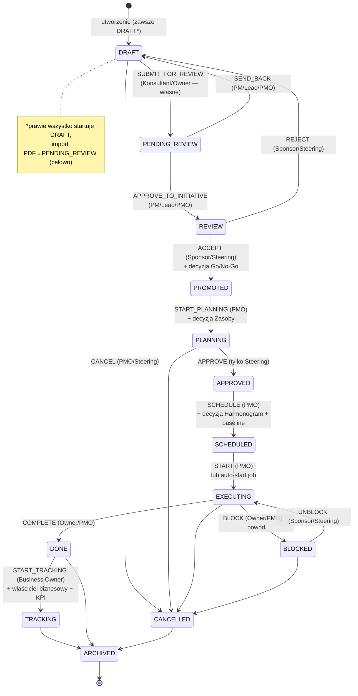

# Cykl życia inicjatywy — pełna dokumentacja (kod-grounded)

> **Status:** odzwierciedla ŻYWY kod na 2026-06-26 (zweryfikowane file:line, nie audyt).
> **SSOT statusów/bramek:** [`server/src/constants/initiativeStatuses.ts`](../../server/src/constants/initiativeStatuses.ts)
> **Żywy kontroler:** [`server/src/controllers/InitiativeController.ts`](../../server/src/controllers/InitiativeController.ts)
> **Doktryna treści:** [`INITIATIVE_FORMULA.md`](./INITIATIVE_FORMULA.md)
> **Analiza szczelności procesu:** [`INITIATIVE_PROCESS_EFFECTIVENESS.md`](./INITIATIVE_PROCESS_EFFECTIVENESS.md)

Inicjatywa przechodzi przez **4 moduły** (M13 Inicjatywy → M14 Wdrożenie → M15 Rezultaty → M16 Finanse) napędzana **jednym kręgosłupem 13 statusów**. Nie istnieje pojedyncze „Zatwierdź" — jest **łańcuch bramek (gates)**, każda z przypisaną rolą.

---

## 1. Słownik statusów (13)

SSOT: `constants/initiativeStatuses.ts:34-57`. Metadane UI (etykiety PL/EN, kolory, kolejność): `STATUS_METADATA:368-521`.

| Status | Znaczenie | Moduł | Postęp |
|---|---|---|---|
| `DRAFT` | Autor pracuje | Narzędzia/Assessment | 5% |
| `PENDING_REVIEW` | Czeka na przegląd PM/Lead | Narzędzia | 10% |
| `REVIEW` | Przegląd Go/No-Go | Inicjatywy (M13) | 15% |
| `PROMOTED` | Przyjęte do planowania | M13 | 25% |
| `PLANNING` | Planowanie/zakres | M13 | 35% |
| `APPROVED` | Zatwierdzone, gotowe do harmonogramu | M13 | 45% |
| `SCHEDULED` | W roadmapie, baseline zablokowany | M13/M14 | 55% |
| `EXECUTING` | W realizacji | M14 Wdrożenie | 70% |
| `BLOCKED` | Zablokowane, wymaga decyzji | M14 | 65% |
| `DONE` | Dostarczone | M14 | 90% |
| `TRACKING` | Śledzenie korzyści | M15 Rezultaty / M16 Finanse | 100% |
| `CANCELLED` | Terminalny — anulowane | — | 0% |
| `ARCHIVED` | Terminalny — zarchiwizowane | — | 100% |

> ⚠️ **Drift:** stary 5-wartościowy enum w `server/src/types/index.ts:157` (`draft/planning/active/completed/cancelled`) NIE jest żywym automatem — autorytatywne jest 13 wartości z `constants/`. Patrz analiza B.

---

## 2. Diagram cyklu życia

---

## 3. Faza 1 — POWSTANIE (M13 Inicjatywy / PMO)

### Ścieżki tworzenia (każda → DRAFT, chyba że zaznaczono)

| Skąd | Plik | Status | Moduł |
|---|---|---|---|
| Ręcznie — Charter/AI Wizard w `InitiativesHub` | `InitiativeController.createInitiative:572` ← `POST /initiatives` | DRAFT | M13 |
| Z wywiadu (insight) | `routes/v8/interview-insights.routes.ts:1047` | DRAFT | Wywiad |
| Z Pomysłów/Mind-map (MyWork) | `notebookConversionService.ts:326` (init) / funnel `:289` | **DRAFT** | MyWork |
| Z Assessmentu | `assessmentInitiativeService.ts:646` | DRAFT | Assessment |
| Z Narzędzi | `ToolInitiativeService.ts:271` | DRAFT | Narzędzia |
| Z czatu Teresy (`generate_initiative`) | `ai/tools/generateInitiative.ts` | DRAFT | Czat |
| Z importu PDF | `reportImportService.ts:1536` | **PENDING_REVIEW** (celowo) | Import |
| Z Discovery (pain points) | `routes/discovery.routes.ts:270` | DRAFT | Discovery |

> **Lejek kanoniczny** `createInitiativeService.ts:96` ma ujednolicić wszystkie ścieżki (zawsze DRAFT, name+title, lineage, audyt, doradczy QA §B3), ale jest **za flagą `INITIATIVE_FUNNEL_ENABLED`** — przy OFF każda ścieżka używa legacy INSERT. Patrz analiza B.
>
> **Korekta 2026-06-26:** wcześniejszy automatyczny audyt twierdził, że Pomysł→inicjatywa pisze `APPROVED` — to **błąd**: linia `:88` ustawia status **sesji narzędzia** (`tool_sessions`), nie inicjatywy. Inicjatywa powstaje jako **DRAFT** (`:326` fallback + funnel `:289`). Import PDF→`PENDING_REVIEW` jest **celowy** (treść już zwalidowana w raporcie źródłowym; i tak przechodzi przez PM-review). Żadna ścieżka nie omija governance.

### Kto może tworzyć (RBAC)
`evaluateInitiativeWriteAccess` (`initiativeGovernanceGuard.ts:135`), egzekwowane w `createInitiative:582`:
- **Blokuje** pasmo „pilotów": TEAM_MEMBER, MEMBER, VIEWER, CLIENT
- **Wpuszcza** staff: PROJECT_MANAGER, MANAGER, CONSULTANT + ADMIN/OWNER + superadmin

### Minimum przy tworzeniu (charter-lite)
Doktryna `INITIATIVE_FORMULA.md` §2/§11: tytuł · falsyfikowalna teza („jeśli X to Y bo Z") · **jeden właściciel** · impact×effort · **≥1 KPI (baseline→target)** · źródło/lineage.
Schema API (`validators/initiative.validators.ts`, `CreateInitiativeSchema`) wymusza tylko `title` + `sourceType≠manual ⇒ sourceId`. KPI/właściciel pilnuje **wizard UI**, nie API. Pełny charter (22 karty) wypełnia się progresywnie wraz z bramkami.

---

## 4. Faza 2 — DROGA DO ZATWIERDZENIA (łańcuch bramek, M13)

### Bramki RBAC (kto zatwierdza)
`GATE_PERMISSIONS:117-141` × `GATE_TRANSITIONS:146-192`, egzekwowane `InitiativeController.ts:1290-1348`:

| Przejście | Bramka | Kto zatwierdza |
|---|---|---|
| DRAFT → PENDING_REVIEW | SUBMIT_FOR_REVIEW | Konsultant / Owner (tylko własne, `created_by`) |
| PENDING_REVIEW → REVIEW | APPROVE_TO_INITIATIVE | PM / Lead / PMO |
| PENDING_REVIEW → DRAFT | SEND_BACK | PM / Lead / PMO (+ wymaga powodu) |
| REVIEW → PROMOTED | ACCEPT | **Sponsor / Komitet Sterujący** |
| REVIEW → DRAFT | REJECT | Sponsor / Steering |
| PROMOTED → PLANNING | START_PLANNING | PMO |
| PLANNING → APPROVED | APPROVE | **tylko Komitet Sterujący** |
| APPROVED → SCHEDULED | SCHEDULE | PMO |
| SCHEDULED → EXECUTING | START | PMO |
| EXECUTING → BLOCKED | BLOCK | Owner / PMO |
| BLOCKED → EXECUTING | UNBLOCK | Sponsor / Steering |
| EXECUTING → DONE | COMPLETE | Owner / PMO |
| DONE → TRACKING | START_TRACKING | Business Owner |
| → CANCELLED | CANCEL | PMO / Steering |

**Zasady szczególne:** ADMIN omija wszystkie bramki. Konsultant ograniczony do `SUBMIT_FOR_REVIEW` własnych inicjatyw. Brak komitetu w org → wymóg Steering degraduje się do Sponsor/Portfolio Owner (`:1299-1304`). `CANCELLED` = escape hatch, omija bramki RBAC/AI/readiness.

### Dwie dodatkowe warstwy bramek (przy każdym kroku w przód)

**(a) Bramki AI „seria G"** — `constants/initiativeGateAi.ts` + `gateAiReadinessService.ts`:
- Ocenia wymagane sekcje inicjatywy (`GATE_REQUIRED_SECTIONS:49-77`) w skali 0-100, próg domyślny **75** (per-org override)
- Poniżej progu LUB `block`-severity flaga timeline'u → **HTTP 422 `INITIATIVE_GATE_AI_SOFT_BLOCK`** (`InitiativeController.ts:1354-1409`), chyba że `overrideReason`
- **Doradcze, fail-open, włączane flagą per-org.** Bramki regresywne (SEND_BACK/REJECT/BLOCK/UNBLOCK/CANCEL) wykluczone. Dla SCHEDULE/START dochodzi analiza konfliktów timeline (`gateTimelineService`)

**(b) Bramki decyzji governance** — twarde, per krawędź (`InitiativeController.ts:1457-1836`):
| Przejście | Wymagana zatwierdzona decyzja | Efekt dodatkowy |
|---|---|---|
| REVIEW→PROMOTED | `GOVERNANCE_DECISION_MAKING` (Go/No-Go) | 400 `GATE_DECISION_REQUIRED` jeśli brak |
| PROMOTED→PLANNING | `RESOURCE_RESPONSIBILITY` (Zasoby) | — |
| APPROVED→SCHEDULED | `SCHEDULE_MILESTONES` + daty + ≥1 kamień | **tworzy wersjonowany baseline** `initiative_schedule_baselines` |
| DONE→TRACKING | właściciel biznesowy + ≥1 KPI z targetem | ustawia okno 90-dniowe `tracking_start/end_date` |

**(c) Twardy readiness** (`getBlockingReadinessItems:1413-1450`) — blokujące braki → 400 `GATE_BLOCKED` + powiadomienia.

---

## 5. Faza 3 — WYKONANIE (M14 Wdrożenie = ExecutionHub, `/implementation`)

Statusy SCHEDULED/EXECUTING/BLOCKED/DONE. UI: `src/components/Execution/ExecutionHub.tsx` (zakładki: list/portfolio · rollout · reports · people_change).

- **Zadania** → FK `initiative_id` (tasks table); CRUD `TaskService` / `routes/pmo/tasks.routes.ts`
- **Zależności** → tabela `task_dependencies` (`migr. 533`): FS/SS/FF/SF + `lag_days` = **jedyne źródło prawdy dla Gantta** (NIE per-task `dependsOnId` — footgun, patrz B)
- **Kamienie** → `initiative_milestones` (`migr. 293`); kamień z `is_gate` + `gate_decision_id` może blokować postęp
- **Gantt/timeline** → `ExecutionTimelineView.tsx` + `ganttBaseline.ts` (ahead/on_track/slipping/late)
- **Auto-start** → `jobs/initiativeAutoStartJob.ts` przełącza SCHEDULED→EXECUTING gdy nadejdzie data startu (⚠️ omija RBAC — job systemowy)

---

## 6. Faza 4 — REZULTATY i FINANSE (M15 + M16, status TRACKING)

DONE → TRACKING uruchamia:
- **Rejestr korzyści** `benefits_register` (`migr. 20260623`): baseline/target/current, status tracking/realized/at_risk/missed/retired, `source='M14_CLOSURE_HANDOFF'`
- **M15 Rezultaty:** `valueStageGateService` klasyfikuje L0_idea→L5_realized; tylko **L5 (DONE/TRACKING + `hasRealized=true`) = wartość zaksięgowana**, reszta = prognoza korygowana ryzykiem; `resultsValueIntelligenceService`
- **M16 Finanse:** realizacja ROI (`v8_roi_realization_entries` z flagą `verified`), powiązanie ekonomia↔inicjatywa, NPV/IRR/DCF; `resultsROIService`, UI `ROITrackingView`/`ROIAnalysisView`
- **KPI:** `v8_kpi_definitions` (initiative_linked), szeregi czasowe + odchylenia/RCA; UI `KPIDashboard.tsx`

---

## 7. Side effects przy KAŻDEJ zmianie statusu

`InitiativeController.ts:1838-2272`:
1. Zapis statusu + **znaczniki czasu cyklu** (`approved_at`, `blocked_at`, `done_at`, `cancelled_at`… via `pushOptionalColumnUpdate`, schema-tolerant)
2. **Stage handoff** `recordStageHandoff` (fail-safe)
3. **Dwa ślady historii:** `initiative_status_history` (z `gate_type`) + `initiative_history` (action `status_changed`)
4. **Audyt:** `auditEventsService.log` action `initiative.status_changed`
5. **Powiadomienia** (jeden kanoniczny emiter `:2113`; duplikat R4 usunięty `137492dd67`):
   - `initiative.status_changed` do odbiorców (`getInitiativeNotificationRecipients`: owner biznesowy/wykonawczy, sponsor, `initiative_watchers`, `initiative_stakeholders` — bez aktora)
   - **→BLOCKED = CRITICAL + powód · →CANCELLED = WARNING · reszta INFO**
   - osobne `initiative.gate_action_required` do osób z rolą następnej bramki

---

## 8. Gdzie to WIDAĆ (raporty i powierzchnie)

### Widoki na żywo
- **InitiativesHub** (`/initiatives` i `/portfolio`) — 4 tryby: **kanban** (`PortfolioKanbanView`), tabela (`PortfolioListView`), **timeline/Gantt** (`InitiativeGantt`), grid + zakładka **Analiza** (effort-impact)
- **ExecutionHub** (`/implementation`) — własny kanban wykonawczy
- **ExecutiveView** (`/executive`) — rollup zarządczy

### Kanban — kolumny = statusy
`PortfolioKanbanView.getColumnsForScope:64`, scope w Hubie (`InitiativesHub.tsx:220`):
- **scope='active'** → DRAFT, PENDING_REVIEW, REVIEW, PROMOTED, PLANNING, APPROVED, SCHEDULED (`initiativeHelpers.ts:186`)
- **scope='all'** → + EXECUTING, BLOCKED, DONE, TRACKING, CANCELLED, ARCHIVED
- DRAFT/PENDING_REVIEW prowadzą listę → świeże inicjatywy widoczne (fix `973138a3a3`). Drag-drop = zmiana statusu.

### Raporty zawierające inicjatywy
Silnik `Reports/reportContentGenerator.ts` (11 typów): weekly-exec, program-health, blockers-recovery, milestone-slippage, capacity-utilization, budget-variance, decision-backlog, cross-dependency, delivery-confidence, monthly-pmo, sponsor-onepager. Renderer `Execution/ReportDocumentView.tsx`.
Pakiet zarządczy: **SteeringCommitteeReport** (RAG schedule/budget/scope/risk), **PortfolioHealthReport** (onTrack/atRisk/critical), **RaidReport**. Współdzielone: `InitiativeExecutionReport` (`GET /api/reports/initiative/:id`), `OrganizationOverviewReport`.

### Powiadomienia
`notificationService` → tabela `notifications`; widać w: dzwonku (`NotificationDropdown`), `NotificationsHub`, kanbanie powiadomień, zunifikowanym Inboxie (zadania+inicjatywy+decyzje).

### Terminy / przeterminowanie
`initiativeDueBreachService` + cron `InitiativeDueBreachCron` 06:00 UTC — ⚠️ **wyłączony domyślnie** (`INITIATIVE_DUE_BREACH_CRON_ENABLED`, M13 safety). Przeterminowanie widać wizualnie w chipach/wierszach raportu nawet bez crona.

---

## 9. Indeks plików (kotwice)

| Co | Plik |
|---|---|
| Statusy + przejścia + bramki + RBAC | `server/src/constants/initiativeStatuses.ts` |
| Żywy handler statusu | `server/src/controllers/InitiativeController.ts:1231` (`updateInitiativeStatus`), `:572` (`createInitiative`) |
| Trasa | `server/src/routes/pmo/initiatives.routes.ts:2335` (status), `:2310` (create) |
| Mounty | `server/src/Gateway.ts:470` (`/api/initiatives`), `:849` (`/api/pmo/initiatives`) |
| Bramki AI | `server/src/constants/initiativeGateAi.ts`, `services/initiative/gateAiReadinessService.ts` |
| RBAC tworzenia | `server/src/services/initiative/initiativeGovernanceGuard.ts:135` |
| Normalizacja driftu | `server/src/services/initiative/initiativeLifecycleCanon.ts:40,225` |
| Auto-start | `server/src/jobs/initiativeAutoStartJob.ts` |
| Kanban kolumny | `src/utils/initiativeHelpers.ts:186` |
| Due-breach | `services/initiative/initiativeDueBreachService.ts` + `cron/InitiativeDueBreachCron.ts` |

> Martwy kod (NIE używać): `src/components/Implementation/` (M14 to ExecutionHub), `RoadmapKanban.tsx`, nieroutowane `ExecutiveSummaryView`/`LeadershipDashboardView`/`FullInitiativesView`/`InitiativeManagementView`, `Reports/InitiativesReportSection.tsx`.
