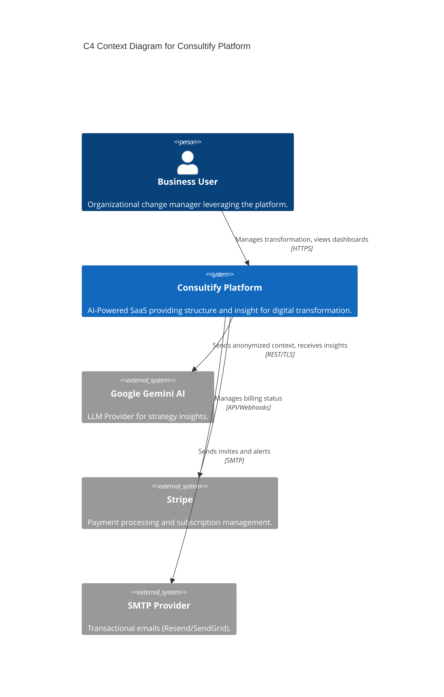
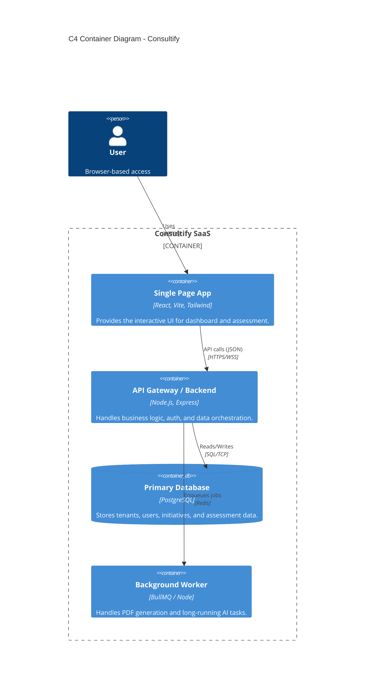

# 3. System Architecture

## 3.1. High-Level Architecture

Consultify follows a modern **Modular Monolith** architecture (during the MVP/Growth phase) designed for easy extraction into Microservices as complexity grows.

### C4 Context Diagram

### C4 Container Diagram

### Data Flow Overview
1.  **Frontend**: The React SPA holds the session state (Zustand) and communicates with the Backend via REST API.
2.  **API Layer**: Express.js validates JWT tokens and enforces RBAC middleware before hitting Controllers.
3.  **Service Layer**: "Fat Services, Thin Controllers" pattern. Business logic resides here.
4.  **AI Integration**: The `AIService` constructs prompts with specific context (anonymized) before calling Gemini.
5.  **Persistence**: Data is committed to PostgreSQL using transactional integrity.

## 3.2. Technological Guardrails

Adherence to these technologies is mandatory to ensure maintainability and compliance with Capgemini delivery standards.

### Frontend
-   **Framework**: React 18+ (Functional Components, Hooks).
-   **Build Tool**: Vite (No Webpack).
-   **State Management**: Zustand (Avoid Redux unless strictly necessary).
-   **Styling**: Tailwind CSS (Utility-first).
-   **Language**: TypeScript (Strict mode enabled).

### Backend
-   **Runtime**: Node.js LTS (v20+).
-   **Framework**: Express.js (Standard middleware pattern).
-   **Validation**: Zod (Runtime schema validation).
-   **ORM**: Low-level query builders or raw SQL (to maintain performance control) or light ORMs like Better-SQLite3/PG.

### Database
-   **Primary**: PostgreSQL 15+ (Production), SQLite (Local Dev allowed but must be compatible).
-   **NoSQL**: Redis (for Queues/Caching only).

### Infrastructure (IaC)
-   **Containerization**: Docker (Multi-stage builds).
-   **CI/CD**: GitHub Actions.
-   **Hosting**: Cloud-agnostic (Docker allows deployment to AWS ECS, GCP Cloud Run, or Azure App Service).

### "Forbidden" Technologies (Risk Avoidance)
-   **GraphQL**: Use REST for simplicity and cacheability unless a specific complex data graph necessitates it.
-   **Micro-frontends**: Strictly forbidden for current scope (unnecessary complexity).
-   **MongoDB**: Relational data model is required for the strict schema of corporate reporting.
