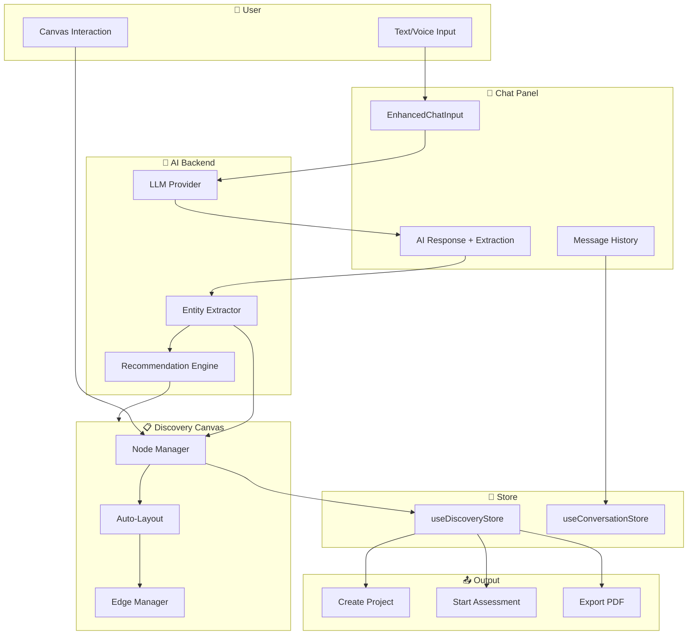

# Discovery Consultant Module

> **Version:** 1.0 | **Status:** Design Complete | **Priority:** P1  
> **Owner:** Product Team | **Last Updated:** 2026-01-11

---

## 📋 Executive Summary

**Discovery Consultant** to moduł AI-powered prowadzący interaktywne rozmowy konsultacyjne z potencjalnymi klientami. Łączy w sobie elementy:

- **Sales Discovery** - zrozumienie potrzeb i bólów klienta
- **Strategic Consulting** - dostarczenie wartości już podczas pierwszej rozmowy
- **Visual Collaboration** - live canvas w stylu Miro do wizualizacji wniosków

### Business Value

| Metryka               | Cel  | Opis                                                    |
| --------------------- | ---- | ------------------------------------------------------- |
| Lead Qualification    | +40% | AI kwalifikuje leady na podstawie rozmowy               |
| Time to Value         | -60% | Natychmiastowe insights zamiast czekania na konsultanta |
| Conversion Rate       | +25% | Lepsze dopasowanie oferty do potrzeb                    |
| Consultant Efficiency | +50% | Pre-filled discovery przed spotkaniem live              |

---

## 🎯 Cele modułu

### Primary Goals

1. **Zrozumieć klienta** - pain points, cele, ograniczenia
2. **Dostarczyć wartość** - quick wins, insights, rekomendacje
3. **Zakwalifikować** - typ transformacji (strategiczna/operacyjna/cyfrowa)
4. **Przekonwertować** - przycisk "Rozpocznij projekt"

### Secondary Goals

- Zebrać dane do personalizacji dalszej współpracy
- Wytrenować AI na bazie feedback z rozmów
- Skrócić czas pierwszego spotkania z konsultantem

---

## 🏗️ Architecture Overview

```
┌─────────────────────────────────────────────────────────────────────────────┐
│                        DISCOVERY CONSULTANT VIEW                            │
├──────────────────────────────┬──────────────────────────────────────────────┤
│                              │                                              │
│   CHAT PANEL                 │   DISCOVERY CANVAS                           │
│   (Konsultant AI)            │   (Live Working Board)                       │
│                              │                                              │
│   ┌──────────────────────┐   │   ┌────────────────────────────────────┐    │
│   │ useConversationStore │   │   │ useDiscoveryStore                  │    │
│   │ useAIStream          │   │   │ - nodes[]                          │    │
│   │ useAIContext         │   │   │ - edges[]                          │    │
│   └──────────────────────┘   │   │ - recommendations                  │    │
│            │                 │   │ - sessionVersion                   │    │
│            ▼                 │   └────────────────────────────────────┘    │
│   ┌──────────────────────┐   │              │                              │
│   │ EnhancedChatInput    │   │              ▼                              │
│   │ - Text input         │   │   ┌────────────────────────────────────┐    │
│   │ - Voice mode         │   │   │ React Flow Canvas                  │    │
│   │ - File upload        │   │   │ - PainPointNode                    │    │
│   └──────────────────────┘   │   │ - InsightNode                      │    │
│            │                 │   │ - RecommendationNode               │    │
│            ▼                 │   │ - ConnectionEdges                  │    │
│   ┌──────────────────────┐   │   └────────────────────────────────────┘    │
│   │ AI Response          │   │              │                              │
│   │ + Entity Extraction  │───┼──────────────┘                              │
│   └──────────────────────┘   │                                              │
│                              │   ┌────────────────────────────────────┐    │
│                              │   │ RecommendationPanel                │    │
│                              │   │ - Transformation Type              │    │
│                              │   │ - Suggested Assessments            │    │
│                              │   │ - Recommended Tools                │    │
│                              │   │ - Initiative Ideas                 │    │
│                              │   └────────────────────────────────────┘    │
├──────────────────────────────┴──────────────────────────────────────────────┤
│                           FOOTER ACTIONS                                    │
│  [🚀 Rozpocznij projekt]  [📂 Przenieś do projektu]  [💾 Zapisz] [v2 ▾]    │
└─────────────────────────────────────────────────────────────────────────────┘
```

---

## 🔗 Integracje z istniejącymi modułami

### 1. AI Chat System (`AIChatWelcomeView`)

**Relacja:** Rozszerzenie / nowy tryb

| Aspekt      | Istniejący Chat   | Discovery Consultant        |
| ----------- | ----------------- | --------------------------- |
| Layout      | Full-screen       | Split (Chat + Canvas)       |
| AI Persona  | General Assistant | Discovery Consultant        |
| Output      | Conversation      | Conversation + Visual Board |
| Persistence | Conversations     | Discovery Sessions          |

**Shared Components:**

- `EnhancedChatInput` - input z voice mode
- `ChatSlidingPanel` - historia rozmów
- `useAIStream` - streaming odpowiedzi
- `useConversationStore` - persistence

**Punkt integracji:**

```typescript
// W AIChatWelcomeView dodać toggle do Discovery Mode
<FocusModeSelector
  modes={[
    { id: 'general', label: 'General' },
    { id: 'discovery', label: 'Discovery Consultant' }, // NEW
    { id: 'assessment', label: 'Assessment' },
  ]}
/>
```

---

### 2. Assessment Frameworks (`frameworkRegistry.ts`)

**Relacja:** Konsumuje / Rekomenduje

Discovery Consultant na podstawie wykrytych pain points rekomenduje odpowiedni framework:

| Pain Point Area      | Recommended Frameworks    |
| -------------------- | ------------------------- |
| Process inefficiency | LEAN, SIRI                |
| Technology/Legacy    | SIRI, ADMA                |
| Data quality         | ADMA, CMMI                |
| Organization/People  | DRD                       |
| Mixed/Strategic      | DRD (baseline) + specific |

**Punkt integracji:**

```typescript
// Discovery → Assessment recommendation
import { FRAMEWORK_CONFIGS, FrameworkId } from '@/services/frameworkRegistry';

const recommendFrameworks = (painPoints: PainPoint[]): FrameworkId[] => {
  const areas = painPoints.map((p) => p.area);
  const recommendations: FrameworkId[] = [];

  if (areas.includes('process')) recommendations.push('LEAN');
  if (areas.includes('technology')) recommendations.push('SIRI');
  if (areas.includes('data')) recommendations.push('ADMA');

  return recommendations.length ? recommendations : ['DRD'];
};
```

---

### 3. Project System (`ProjectController`, `useAppStore`)

**Relacja:** Konwertuje do / Dołącza do

Discovery Session może być:

1. **Rozpocznij projekt** - tworzy nowy projekt z danymi z sesji
2. **Przenieś do projektu** - dołącza sesję do istniejącego projektu

**Punkt integracji:**

```typescript
// Discovery → Project conversion
const convertToProject = async (session: DiscoverySession) => {
  const project = await Api.createProject({
    name: `Discovery: ${session.clientContext?.companyName || 'New Client'}`,
    description: generateProjectDescription(session),
    metadata: {
      sourceType: 'discovery_session',
      sourceId: session.id,
      transformationType: session.recommendedTransformation,
      painPoints: session.painPoints,
    },
  });

  // Attach discovery session to project
  await Api.attachDiscoveryToProject(session.id, project.id);

  return project;
};
```

---

### 4. Initiative Generator (`InitiativeGeneratorWizard`)

**Relacja:** Feeds into

Pain points i recommendations z Discovery stają się inputem do generowania inicjatyw:

| Discovery Output  | Initiative Input        |
| ----------------- | ----------------------- |
| Pain Points       | Problem statements      |
| Insights          | Context & rationale     |
| Opportunities     | Initiative objectives   |
| Recommended Tools | Implementation approach |

**Punkt integracji:**

```typescript
// Discovery → Initiative generation
const generateInitiativesFromDiscovery = async (session: DiscoverySession) => {
  const initiatives = await Api.generateInitiatives({
    context: {
      painPoints: session.painPoints,
      insights: session.insights,
      transformationType: session.recommendedTransformation,
      clientProfile: session.clientContext,
    },
    frameworks: session.recommendedFrameworks,
  });

  return initiatives;
};
```

---

### 5. Studio Canvas (`StudioCanvas.tsx`)

**Relacja:** Bazuje na / Rozszerza

Discovery Canvas używa React Flow podobnie jak Studio Canvas:

**Shared:**

- React Flow infrastructure
- Node drag & drop
- MiniMap, Controls
- Export functionality

**Extended for Discovery:**

- Nowe typy node'ów (PainPoint, Insight, etc.)
- Auto-layout algorithm
- Real-time sync z chat
- Category grouping

**Punkt integracji:**

```typescript
// Extend StudioCanvas node types
const discoveryNodeTypes = {
  ...studioNodeTypes, // existing: processStep, decision, etc.
  painPoint: PainPointNode,
  insight: InsightNode,
  opportunity: OpportunityNode,
  recommendation: RecommendationNode,
  quote: QuoteNode,
  tool: ToolNode,
  assessment: AssessmentNode,
};
```

---

### 6. PMO Standards (`pmoStandardsMapping.ts`)

**Relacja:** Validates against

Discovery recommendations są mapowane do PMO standards:

| Discovery Output           | PMO Standard Mapping          |
| -------------------------- | ----------------------------- |
| Strategic transformation   | ISO 21500 - Governance        |
| Operational transformation | PMBOK 7 - Performance Domains |
| Digital transformation     | PRINCE2 - Themes              |

**Punkt integracji:**

```typescript
// Discovery → PMO compliance check
const validateDiscoveryAgainstPMO = (session: DiscoverySession) => {
  return {
    iso21500: mapToISO21500(session.recommendedTransformation),
    pmbok7: mapToPMBOK7Domains(session.initiativeIdeas),
    prince2: mapToPRINCE2Themes(session.painPoints),
  };
};
```

---

### 7. Tools & Instruments Catalog (NEW)

**Relacja:** Recommends from

Nowy katalog narzędzi transformacyjnych do rekomendacji:

```typescript
// config/transformationTools.ts
export const TRANSFORMATION_TOOLS = {
  strategic: [
    { id: 'swot', name: 'SWOT Analysis', category: 'Analysis' },
    { id: 'porter', name: "Porter's 5 Forces", category: 'Competition' },
    { id: 'bcg', name: 'BCG Matrix', category: 'Portfolio' },
    { id: 'okr', name: 'OKR Framework', category: 'Goals' },
    { id: 'balanced_scorecard', name: 'Balanced Scorecard', category: 'KPIs' },
  ],
  operational: [
    { id: 'vsm', name: 'Value Stream Mapping', category: 'Process' },
    { id: 'kaizen', name: 'Kaizen Events', category: 'Improvement' },
    { id: '5s', name: '5S Methodology', category: 'Workplace' },
    { id: 'smed', name: 'SMED', category: 'Changeover' },
    { id: 'tpm', name: 'Total Productive Maintenance', category: 'Equipment' },
    { id: 'six_sigma', name: 'Six Sigma DMAIC', category: 'Quality' },
  ],
  digital: [
    { id: 'process_mining', name: 'Process Mining', category: 'Analysis' },
    { id: 'rpa', name: 'RPA Assessment', category: 'Automation' },
    { id: 'data_governance', name: 'Data Governance', category: 'Data' },
    { id: 'api_audit', name: 'API Integration Audit', category: 'Integration' },
    { id: 'cloud_readiness', name: 'Cloud Readiness', category: 'Infrastructure' },
  ],
};
```

---

### 8. Conversation Store (`useConversationStore`)

**Relacja:** Extends

Discovery sessions są przechowywane podobnie do conversations:

```typescript
// Extended conversation store for Discovery
interface DiscoverySession extends Conversation {
  sessionType: 'discovery';

  // Canvas state
  canvasNodes: DiscoveryNode[];
  canvasEdges: DiscoveryEdge[];

  // Extracted data
  painPoints: PainPoint[];
  insights: Insight[];
  opportunities: Opportunity[];

  // Recommendations
  recommendedTransformation: TransformationType | null;
  recommendedFrameworks: FrameworkId[];
  recommendedTools: string[];
  initiativeIdeas: InitiativeIdea[];

  // Client context
  clientContext: {
    companyName?: string;
    industry?: string;
    size?: string;
    role?: string;
  };

  // Versioning
  versions: SessionVersion[];
  currentVersion: number;

  // Outcome tracking
  outcome?: 'converted' | 'follow_up' | 'lost';
  convertedProjectId?: string;
}
```

---

## 📊 Data Flow Diagram



---

## 🎨 UI/UX Specifications

### Color System for Nodes

| Node Type      | Light Mode                        | Dark Mode                            | Icon |
| -------------- | --------------------------------- | ------------------------------------ | ---- |
| Pain Point     | `bg-red-100 border-red-400`       | `bg-red-900/30 border-red-500`       | 🔴   |
| Insight        | `bg-amber-100 border-amber-400`   | `bg-amber-900/30 border-amber-500`   | 💡   |
| Opportunity    | `bg-green-100 border-green-400`   | `bg-green-900/30 border-green-500`   | 💚   |
| Quote          | `bg-slate-100 border-slate-400`   | `bg-slate-800 border-slate-600`      | 💬   |
| Recommendation | `bg-blue-100 border-blue-400`     | `bg-blue-900/30 border-blue-500`     | ✅   |
| Tool           | `bg-purple-100 border-purple-400` | `bg-purple-900/30 border-purple-500` | 🛠️   |
| Assessment     | `bg-cyan-100 border-cyan-400`     | `bg-cyan-900/30 border-cyan-500`     | 📊   |

### Severity Indicators (Pain Points)

```
●○○○○  (1) Minor inconvenience
●●○○○  (2) Noticeable problem
●●●○○  (3) Significant issue
●●●●○  (4) Critical blocker
●●●●●  (5) Business-threatening
```

### Responsive Breakpoints

| Breakpoint     | Layout         | Canvas Width |
| -------------- | -------------- | ------------ |
| < 768px        | Stacked (tabs) | 100%         |
| 768px - 1024px | Split 40/60    | 60%          |
| > 1024px       | Split 35/65    | 65%          |
| > 1440px       | Split 30/70    | 70%          |

---

## 🔐 Permissions & Access

### Role-Based Access

| Role    | Can View | Can Edit | Can Convert | Can Delete |
| ------- | -------- | -------- | ----------- | ---------- |
| Viewer  | ✅       | ❌       | ❌          | ❌         |
| Member  | ✅       | ✅       | ❌          | Own only   |
| Manager | ✅       | ✅       | ✅          | Team's     |
| Admin   | ✅       | ✅       | ✅          | All        |

### Feature Flags

```typescript
const DISCOVERY_FEATURE_FLAGS = {
  'discovery.enabled': true,
  'discovery.voice_mode': true,
  'discovery.auto_extraction': true,
  'discovery.project_conversion': true,
  'discovery.pdf_export': false, // Phase 2
  'discovery.team_collaboration': false, // Phase 3
};
```

---

## 📈 Analytics & Tracking

### Events to Track

| Event                                | Properties                                   | Purpose           |
| ------------------------------------ | -------------------------------------------- | ----------------- |
| `discovery_started`                  | `session_id`, `source`                       | Funnel start      |
| `discovery_message_sent`             | `session_id`, `message_length`               | Engagement        |
| `discovery_entity_extracted`         | `session_id`, `entity_type`, `count`         | AI quality        |
| `discovery_canvas_interaction`       | `session_id`, `action`, `node_type`          | UX insights       |
| `discovery_recommendation_generated` | `session_id`, `transformation_type`, `score` | AI accuracy       |
| `discovery_converted`                | `session_id`, `project_id`                   | Conversion        |
| `discovery_abandoned`                | `session_id`, `step`, `duration`             | Drop-off analysis |

### Success Metrics

| Metric                  | Target    | Measurement                                    |
| ----------------------- | --------- | ---------------------------------------------- |
| Session Completion Rate | > 70%     | Sessions with recommendations / Total sessions |
| Conversion Rate         | > 25%     | Projects created / Sessions completed          |
| Time to Recommendation  | < 10 min  | Avg time from start to first recommendation    |
| User Satisfaction       | > 4.0/5.0 | Post-session feedback score                    |
| AI Extraction Accuracy  | > 85%     | User-confirmed entities / Total extracted      |

---

## 🧪 Testing Strategy

### Unit Tests

```typescript
// Node rendering
describe('PainPointNode', () => {
  it('renders with correct severity indicators');
  it('handles drag and drop');
  it('displays impact when provided');
});

// Entity extraction
describe('DiscoveryExtractor', () => {
  it('extracts pain points from conversation');
  it('identifies insights and links them to pains');
  it('detects transformation type');
});

// Recommendation engine
describe('RecommendationEngine', () => {
  it('recommends LEAN for process issues');
  it('recommends SIRI for technology issues');
  it('always includes DRD as baseline');
});
```

### Integration Tests

```typescript
describe('Discovery Flow', () => {
  it('creates session on first message');
  it('syncs chat messages to canvas nodes');
  it('converts session to project');
  it('preserves session on version save');
});
```

### E2E Tests

```typescript
describe('Discovery Consultant E2E', () => {
  it('completes full discovery flow');
  it('voice mode works correctly');
  it('canvas interactions persist');
  it('project conversion creates valid project');
});
```

---

## 📚 Related Documentation

- [UNIFIED_AI_CHAT_SYSTEM.md](./UNIFIED_AI_CHAT_SYSTEM.md) - Base chat architecture
- [PMO_STANDARDS_COMPLIANCE.md](./00_foundation/PMO_STANDARDS_COMPLIANCE.md) - PMO mapping
- [MASTER_FLOW_REGISTRY.md](./flows/MASTER_FLOW_REGISTRY.md) - Flow catalog
- [AI_OPERATIONS_MODULE.md](./AI_OPERATIONS_MODULE.md) - AI infrastructure

---

## 📝 Changelog

| Version | Date       | Changes               |
| ------- | ---------- | --------------------- |
| 1.0     | 2026-01-11 | Initial specification |
