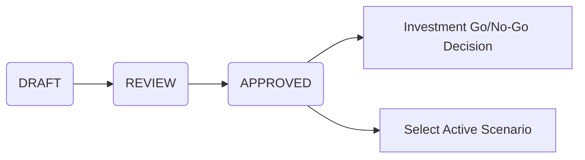
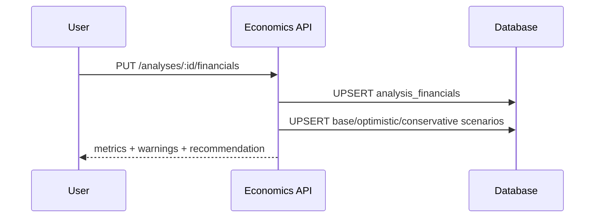
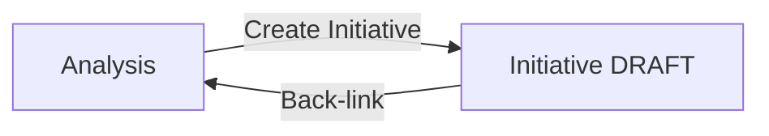

# Economics Module - Economic Analysis

## Scope
- Workflow: DRAFT -> REVIEW -> APPROVED
- Scenarios: base / optimistic / conservative
- Create Initiative from Analysis
- Integrations: Initiatives, Decision Management, Reporting

## Data Model (Core)
- `digitization_analyses` (analysis metadata + status)
- `analysis_financials` (input + cached metrics)
- `analysis_financial_scenarios` (scenario snapshots)
- `benefit_tracking` (realization tracking, optional)

## API Flow (Summary)
1. Create analysis: `POST /api/economics/analyses`
2. Update financials: `PUT /api/economics/analyses/:id/financials`
3. Get scenarios: `GET /api/economics/analyses/:id/scenarios`
4. Activate scenario: `POST /api/economics/analyses/:id/scenarios/:scenarioId/activate`
5. Approve analysis (status update): `PUT /api/economics/analyses/:id`
6. Create initiative: `POST /api/economics/analyses/:id/create-initiative`
7. Gate decisions: `POST /api/economics/analyses/:id/decisions`

## Status Flow

## Scenario Flow

## Initiative Linkage

## Validations and Insights
- Reject negative cost/benefit values.
- Reject invalid horizon or discount rate.
- Warn on negative net cashflow after year 0.
- Recommend scenario with highest NPV.

## Tests
- Integration: `tests/integration/routes/economicsFlow.test.js`
- Unit: `tests/backend/services/economicsFinancials.test.ts`

## Risks and Mitigations
- Complex form input -> sectioned UI + autosave.
- Conflicting scenarios -> validation + scenario recommendation.
- Long-running metrics -> cached metrics and scenario snapshots.
