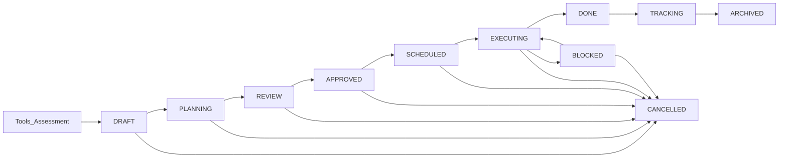

# Module Routing Architecture (Canonical)

## Purpose
This document is the canonical source of truth for **module routing**, **sidebar modules**, and **module responsibility boundaries**.

It also summarizes how the **initiative lifecycle** maps onto modules, based on the canonical governance model.

**Last updated**: 2026-01-23

## Source-of-truth links
- Governance model: `docs/product/INITIATIVE_GOVERNANCE_MODEL.md`
- System architecture brief: `docs/product/SYSTEM_ARCHITECTURE_BRIEF.md`
- Documentation registry: `docs/product/DOCUMENTATION_REGISTRY.md`

---

## Architecture overview

The application follows a **status- and gate-driven architecture**: modules are organized around the transformation initiative lifecycle and governance gates.

## Canonical artefact outputs by module (closed list)
Per `docs/product/SYSTEM_ARCHITECTURE_BRIEF.md`, modules produce and consume a **closed artefact set**:

| Module | Primary outputs | Notes |
|---|---|---|
| Chat | Conversation context | Feeds Interview; not a governance artefact |
| Interview | **Insights (artefact)** | Context only; does not create initiatives directly |
| Tools | **Tool Output** (ToolSession) | Persistent tool run snapshot; can create Initiative drafts |
| Assessment | **Assessment Report** | Draft → Review → Final (locked); creates Initiative drafts |
| Initiatives | **Initiative** (portfolio planning + decisions) | Planning + decision moments (governance) |
| Implementation | **Task**, **Decision**, Economic analysis updates | Flexible updates: tasks/decisions/budgets |
| Benefits | Benefits / tracking records | Plan vs actual, financial + operational evaluation |
| Reporting | Report packages | Aggregates artefacts; does not introduce new artefacts |

### Canonical initiative lifecycle (high-level)



> Note: `EDITING`, `VALIDATED`, `PROMOTED` are treated as governance gate phases within Tools/Assessment (see governance model).

---

## Main application modules (sidebar)

### Core flow order (product)
Per `docs/product/SYSTEM_ARCHITECTURE_BRIEF.md`, the core sequential flow is:
Chat → Interview → Tools → Assessment → Initiatives → Implementation → Benefits → Reporting

Other modules can exist as **supporting / cross-cutting** UI areas.

### 1. AI Chat
| Właściwość | Wartość |
|------------|---------|
| **Sidebar ID** | `AI_CHAT` |
| **AppView** | `AppView.AI_CHAT` |
| **Route** | `/chat` |
| **Component** | `AIChatWelcomeView` |
| **Ikona** | `MessageSquare` |

### 2. Interview (Discovery Consultant)
| Właściwość | Wartość |
|------------|---------|
| **Sidebar ID** | `INTERVIEW` |
| **AppView** | `AppView.DISCOVERY_CONSULTANT` |
| **Route** | `/discovery` |
| **Component** | `DiscoveryConsultantView` |
| **Ikona** | `Brain` |
| **Lokalizacja** | `src/components/Discovery/DiscoveryConsultantView.tsx` |

### 3. Discovery Tools
| Właściwość | Wartość |
|------------|---------|
| **Sidebar ID** | `DISCOVERY_TOOLS` |
| **AppView** | `AppView.DISCOVERY_TOOLS` |
| **Route** | `/discovery-tools` |
| **Component** | `DiscoveryToolsHub` |
| **Ikona** | `Wrench` |
| **Badge** | `new` |
| **Sub-routes** | `/discovery-tools/strategic`, `/discovery-tools/operational`, `/discovery-tools/digital`, `/discovery-tools/process-automation` |

### 4. Assessment
| Właściwość | Wartość |
|------------|---------|
| **Sidebar ID** | `MODULE_ASSESSMENT` |
| **AppView** | `AppView.ASSESSMENT_OVERVIEW` |
| **Route** | `/assessment` |
| **Component** | `AssessmentHubDashboard` |
| **Ikona** | `CheckCircle2` |
| **Sub-routes** | `/assessment/drd`, `/assessment/siri`, `/assessment/adma`, `/assessment/cmmi`, `/assessment/lean` |

### 5. Initiatives
| Właściwość | Wartość |
|------------|---------|
| **Sidebar ID** | `MODULE_INITIATIVES` |
| **AppView** | `AppView.FULL_STEP2_INITIATIVES` |
| **Route** | `/initiatives` |
| **Component** | `InitiativesHub` |
| **Ikona** | `Lightbulb` |
| **Lokalizacja** | `src/components/Initiatives/InitiativesHub.tsx` |

### 6. Execution
| Właściwość | Wartość |
|------------|---------|
| **Sidebar ID** | `MODULE_EXECUTION` |
| **AppView** | `AppView.FULL_STEP5_EXECUTION` |
| **Route** | `/execution` |
| **Component** | `ExecutionHub` |
| **Ikona** | `Rocket` |
| **Lokalizacja** | `src/components/Execution/ExecutionHub.tsx` |
| **Initiative states handled** | `SCHEDULED`, `EXECUTING`, `BLOCKED`, `DONE` |

### 7. Benefits
| Właściwość | Wartość |
|------------|---------|
| **Sidebar ID** | `MODULE_BENEFITS` |
| **AppView** | `AppView.BENEFITS_REALIZATION` |
| **Route** | `/benefits` |
| **Component** | `BenefitsHub` |
| **Ikona** | `TrendingUp` |
| **Lokalizacja** | `src/components/Benefits/BenefitsHub.tsx` |
| **Initiative states handled** | `TRACKING`, `ARCHIVED` |

### 8. Economics
| Właściwość | Wartość |
|------------|---------|
| **Sidebar ID** | `MODULE_ECONOMICS` |
| **AppView** | `AppView.ECONOMICS` |
| **Route** | `/economics` |
| **Component** | `EconomicsView` |
| **Ikona** | `Calculator` |
| **Lokalizacja** | `src/views/EconomicsView.tsx` |

> Economics is a **supporting capability** (economic analysis artefact) that can feed initiatives, but it is not part of the core sequential flow order.

### 9. Reports
| Właściwość | Wartość |
|------------|---------|
| **Sidebar ID** | `MODULE_REPORTS` |
| **AppView** | `AppView.FULL_STEP6_REPORTS` |
| **Route** | `/reports` |
| **Component** | `FullReportsView` → `ManagementReportsView` |
| **Ikona** | `BookOpen` |
| **Lokalizacja** | `src/views/FullReportsView.tsx` |

---

## Configuration files (code references)

### 1. Menu Sidebar
**Lokalizacja**: `src/components/navigation/Sidebar/menuConfig.ts`

Definiuje strukturę menu bocznego z:
- `id` - unikalny identyfikator elementu
- `label` - etykieta wyświetlana (z i18n)
- `icon` - ikona Lucide
- `viewId` - wartość AppView dla nawigacji
- `badge` - opcjonalny badge (`new`, `soon`)

### 2. Mapowanie Route
**Lokalizacja**: `src/routes/routeConfig.ts`

```typescript
// Definicje ścieżek
export const ROUTES = {
  INTERVIEW: '/interview',
  DISCOVERY_CONSULTANT: '/discovery',
  INITIATIVES: '/initiatives',
  EXECUTION: '/execution',
  BENEFITS: '/benefits',
  ECONOMICS: '/economics',
  REPORTS: '/reports',
  // ...
};

// Mapowanie AppView → Route
export const APP_VIEW_TO_ROUTE: Record<AppView, string> = {
  [AppView.DISCOVERY_CONSULTANT]: ROUTES.DISCOVERY_CONSULTANT,
  [AppView.FULL_STEP2_INITIATIVES]: ROUTES.INITIATIVES,
  [AppView.FULL_STEP5_EXECUTION]: ROUTES.EXECUTION,
  [AppView.BENEFITS_REALIZATION]: ROUTES.BENEFITS,
  [AppView.ECONOMICS]: ROUTES.ECONOMICS,
  [AppView.FULL_STEP6_REPORTS]: ROUTES.REPORTS,
  // ...
};
```

### 3. Definicje Route (React Router)
**Lokalizacja**: `src/routes/AppRoutes.tsx`

```tsx
<Route
  path={ROUTES.EXECUTION}
  element={
    <MainLayout breadcrumbs={['Execution']} noPadding>
      <ExecutionHub />
    </MainLayout>
  }
/>
```

### 4. Enum AppView
**Lokalizacja**: `src/types/core.ts`

```typescript
export enum AppView {
  AI_CHAT = 'AI_CHAT',
  INTERVIEW = 'INTERVIEW',
  DISCOVERY_CONSULTANT = 'DISCOVERY_CONSULTANT',
  DISCOVERY_TOOLS = 'DISCOVERY_TOOLS',
  ASSESSMENT_OVERVIEW = 'ASSESSMENT_OVERVIEW',
  FULL_STEP2_INITIATIVES = 'FULL_STEP2_INITIATIVES',
  FULL_STEP5_EXECUTION = 'FULL_STEP5_EXECUTION',
  BENEFITS_REALIZATION = 'BENEFITS_REALIZATION',
  ECONOMICS = 'ECONOMICS',
  FULL_STEP6_REPORTS = 'FULL_STEP6_REPORTS',
  // ...
}
```

---

## Navigation flow

```
User klika w Sidebar
       ↓
MenuItem.viewId (np. AppView.FULL_STEP5_EXECUTION)
       ↓
APP_VIEW_TO_ROUTE[viewId] → '/execution'
       ↓
navigate('/execution')
       ↓
React Router dopasowuje Route
       ↓
Renderuje ExecutionHub w MainLayout
```

### Implementacja w Sidebar

```typescript
// src/components/navigation/Sidebar/Sidebar.tsx (lub menuConfig.ts)
onClick={() => {
  const route = APP_VIEW_TO_ROUTE[item.viewId];
  if (route) {
    navigate(route);
  }
  setCurrentView(item.viewId);
}}
```

---

## Hub components (`ModuleHub` pattern)

Moduły Execution i Benefits używają wzorca `ModuleHub` zapewniającego:

### Zakładki (Tabs)
- **list** - Widok Kanban/tabela
- **reports** - Timeline/analityka
- **initiatives** - Workload/ROI

### Tryby Widoku (ViewMode)
- `table` - widok tabeli
- `grid` - widok kart
- `kanban` - tablica Kanban

### Struktura Komponentu Hub

```tsx
<ModuleHub
  tabs={tabs}
  activeTab={activeTab}
  onTabChange={setActiveTab}
  viewMode={viewMode}
  onViewModeChange={setViewMode}
  onSearch={setSearchQuery}
  openDocuments={openDocuments}
  activeDocumentId={activeDocumentId}
  onDocumentSelect={setActiveDocumentId}
  onDocumentClose={handleCloseDocument}
>
  {renderContent()}
</ModuleHub>
```

---

## Module exports

### Benefits Module
**Lokalizacja**: `src/components/Benefits/index.ts`

```typescript
export { BenefitsHub } from './BenefitsHub';
```

### Execution Module
**Lokalizacja**: `src/components/Execution/index.ts`

```typescript
export { ExecutionHub } from './ExecutionHub';
export { BenefitsTracker } from './BenefitsTracker';
```

---

## Canonical lifecycle → module ownership

This table is the **routing-level** version of the governance model. For gate owners and UX permissions, refer to `docs/product/INITIATIVE_GOVERNANCE_MODEL.md`.

| Status / Gate phase | Module | What users do here |
|--------|-------|------|
| `DRAFT` | Tools / Assessment | Auto-created draft; initial scoping and context |
| `EDITING` (gate phase) | Tools / Assessment | Team enriches and structures the draft |
| `VALIDATED` (gate) | Tools / Assessment | Business clarity/value validation |
| `PROMOTED` (gate) | Tools / Assessment → Initiatives | Promote draft into portfolio pipeline |
| `PLANNING` | Initiatives | Scope, KPIs, dependencies, readiness for review |
| `REVIEW` (gate) | Initiatives | Business Owner / Sponsor review; prepare for approval |
| `APPROVED` (gate) | Initiatives | Business Owner / Sponsor approves to execute |
| `SCHEDULED` (gate) | Initiatives → Execution | Transformation Lead schedules on roadmap and baseline |
| `EXECUTING` | Execution | Tasks executed; progress, risks, RAID, decisions |
| `BLOCKED` (gate) | Execution | Business Owner / Sponsor controlled stop/resolution |
| `DONE` (gate) | Execution → Benefits | Execution Lead confirms delivery completion |
| `TRACKING` | Benefits | Business Owner measures KPI impact over time |
| `CANCELLED` (gate) | Any | Business Owner / Sponsor cancels with rationale |
| `ARCHIVED` | Benefits | Closed for audit/reporting and long-term retention |

---

## Verification checklist (routing)

### Checklist

- [ ] Menu Sidebar ma `viewId` dla każdego modułu
- [ ] `APP_VIEW_TO_ROUTE` zawiera mapowanie dla każdego `AppView`
- [ ] `AppRoutes.tsx` ma definicję `<Route>` dla każdej ścieżki
- [ ] Komponent jest poprawnie lazy-loaded
- [ ] Eksport komponentu istnieje w `index.ts` modułu

---

## Navigation stability (incident notes)

### Objaw

Na `/economics`, `/reports` (a czasem inne moduły) pojawiał się ekran błędu:

```
SyntaxError: The requested module '/node_modules/lodash/get.js?...' does not provide an export named 'default'
```

Routing działał (URL się zmieniał), ale render kończył się błędem w `RouteErrorBoundary`.

### Przyczyna

`recharts` używa `lodash/get` w trybie CJS, a Vite (ESM) próbował importować `default`.
W efekcie moduł ładowany dynamicznie powodował runtime error w widoku.

### Bezpieczna Naprawa

Wymuszenie prebundlingu `recharts` i `lodash` w Vite, aby usunąć konflikt CJS/ESM:

```ts
// vite.config.ts
optimizeDeps: {
  include: [
    'lodash',
    'lodash/get',
    'recharts',
  ],
}
```

To nie zmienia logiki aplikacji i minimalizuje ryzyko regresji.

### Test Po Naprawie

- [ ] `Cmd+Shift+R` na `/economics`
- [ ] `Cmd+Shift+R` na `/reports`
- [ ] Brak błędu `lodash/get`

### Testowanie Połączenia

```bash
# Sprawdź czy komponent istnieje
ls -la src/components/[Module]/[Component].tsx

# Sprawdź eksporty
grep "export.*Hub" src/components/[Module]/index.ts

# Sprawdź route
grep "ROUTES.[MODULE]" src/routes/AppRoutes.tsx

# Sprawdź mapowanie
grep "[AppView.VIEW_NAME]" src/routes/routeConfig.ts
```

---

## Historia Zmian

| Data | Zmiana | Autor |
|------|--------|-------|
| 2026-01-20 | Utworzenie dokumentacji | AI Assistant |
| 2026-01-20 | Usunięcie badge 'soon' z Economics i Reports | User |
| 2026-01-20 | Naprawienie błędów TypeScript w ExecutionHub | AI Assistant |
| 2026-01-20 | Naprawa błędu lodash/get w modułach Economics/Reports | AI Assistant |

---

## Powiązane Dokumenty

- [NAVIGATION_STRUCTURE.md](./NAVIGATION_STRUCTURE.md) - Nawigacja Admin/SuperAdmin
- [ARCHITECTURE.md](../architecture/ARCHITECTURE.md) - Architektura aplikacji
- [DISCOVERY_CONSULTANT_MODULE.md](./DISCOVERY_CONSULTANT_MODULE.md) - Moduł Interview
- [DISCOVERY_TOOLS_MODULE.md](./DISCOVERY_TOOLS_MODULE.md) - Moduł Discovery Tools
- `docs/product/INITIATIVE_GOVERNANCE_MODEL.md` - Canonical governance + UX permissions
- `docs/product/DOCUMENTATION_REGISTRY.md` - Canonical vs legacy docs

---

## Implementation delta vs current code
This section exists so product documentation can be canonical even when code is mid-transition.

- **Gate phases vs core enums**: `EDITING`, `VALIDATED`, `PROMOTED`, `SCHEDULED`, `TRACKING` may not exist as core enum states in code yet.\n  - **Required behavior**: UI locks/buttons and audit trail must behave as if they do.\n  - Preferred implementation: decisions/gates + timestamps/fields, not necessarily new core status values.\n
- **Transition ordering**: the canonical lifecycle order is defined in `docs/product/INITIATIVE_GOVERNANCE_MODEL.md` and supersedes older flow diagrams.
