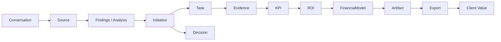

# Object Graph

## Purpose

This document defines the core business objects that make Consultify a coherent consulting work system, not only a set of screens.

The rule is simple: every durable object must have one canonical owner, clear producers, clear consumers and evidence/provenance.

The object graph explains how Consultify moves from:

`Conversation -> Source -> Finding -> Initiative -> Task/Decision -> KPI/ROI/FinancialModel -> Artifact -> Export`

## Business Goal

Consultify achieves business value when it can prove this chain:

1. A user or organization provides context.
2. The system captures or imports sources.
3. AI and workflows generate traceable findings.
4. Findings become governed initiatives and decisions.
5. Initiatives become executable tasks.
6. Execution produces evidence.
7. Evidence maps to KPI, ROI and financial reasoning.
8. Approved outputs become client-ready artifacts and exports.

No object should exist only because a screen renders it. Objects exist because they move consulting work toward a measurable business outcome.

## Core Objects

| Object | Canonical owner | Produced by | Consumed by | Business role |
| --- | --- | --- | --- | --- |
| `Conversation` | `01_czat` | user, Teresa, imported context | `02_moja-praca`, `03_wywiad`, `04_narzedzia`, `09_outputs` | Captures intent and starts work. |
| `Source` | `16_organizacja` or producing module | upload, integration, user input, workspace knowledge | all evidence-backed modules | Grounds claims in traceable material. |
| `Artifact` | producing artifact module | `09_outputs`, `10_dokumenty`, `11_tabele`, `12_prezentacje` | client delivery, meetings, exports | Packages approved work into useful form. |
| `Document` | `10_dokumenty` | artifact generation, user editing | `09_outputs`, `13_meeting`, exports | Editable narrative artifact. |
| `Deck` | `12_prezentacje` for `/prezentacje`; `09_outputs` for `/presentations` runtime | artifact generation, user editing | `09_outputs`, meetings, exports | Presentation artifact, not business truth. |
| `Table` | `11_tabele` | analysis, import, generated model | `08_finanse`, `09_outputs`, documents, decks | Structured data and calculation surface. |
| `Initiative` | `05_inicjatywy` | diagnosis, recommendation, decision, user planning | `06_realizacja`, `07_rezultaty`, `08_finanse` | Owns change rationale and scope. |
| `Task` | `06_realizacja` | initiative breakdown, meeting action, AI suggestion | execution tracking, meetings, status reporting | Owns execution work. |
| `Decision` | owning workflow; usually `05_inicjatywy` for initiative decisions | user approval, governance flow | execution, outputs, audit trail | Locks consequential choices. |
| `KPI` | `07_rezultaty` | initiative goals, result measurement | finance, outputs, management review | Measures value realization. |
| `ROI` | `07_rezultaty` with `08_finanse` | KPI and financial model | management review, client outputs | Connects value to economics. |
| `FinancialModel` | `08_finanse` | user assumptions, tables, integrations | ROI, outputs, decisions | Owns assumptions and calculations. |
| `Meeting` | `13_meeting` | scheduled event, review/follow-up workflow | tasks, decisions, outputs | Creates review and follow-up loop. |
| `OrganizationContext` | `16_organizacja` | org profile, knowledge, memory, imports | Teresa, diagnosis, outputs, integrations | Provides cross-module context/memory. |
| `Evidence` | source-owning or calculation-owning module | source, calculation, review, approval | all high-impact outputs | Proves why a claim/action is trustworthy. |
| `Approval` | owning workflow | user/admin approval | decisions, exports, high-impact mutations | Converts proposed work into authorized work. |
| `Export` | `09_outputs` | approved artifact package | client delivery, audit trail | Final external delivery package. |

## Object Lifecycle Contracts

### `Conversation`

- Starts as user or Teresa interaction.
- May produce proposals, draft artifacts, tasks or handoff requests.
- Must preserve source and context refs when creating downstream work.
- Must not become the system of record for initiatives, tasks, KPIs, finance models or exports.

### `Source`

- Starts as uploaded file, external integration result, user-provided content, conversation extract or organization knowledge.
- Must carry provenance, tenant boundary and access visibility.
- Can be consumed by any module, but only through source refs.
- Must not be copied into a second untraceable truth store.

### `Artifact`

- Starts as approved or draft output package request.
- May specialize into `Document`, `Deck` or `Table`.
- Must retain links to source, evidence, approval and producing module.
- Must not hide business truth inside presentation/document text only.

### `Document`

- Starts from an output/document request, source pack or narrative plan.
- Can be edited, reviewed, versioned and exported.
- Must preserve source pack and review status.
- Must not own initiative scope, KPI, ROI or finance assumptions.

### `Deck`

- Starts from deck request, approved story, source pack or presentation template.
- Can be generated, reviewed, edited and used in meetings.
- `/presentations` runtime belongs to `09_outputs`; `/prezentacje` is standalone generator lane owned by `12_prezentacje`.
- Must not become the only place where business claims exist.

### `Table`

- Starts from imported data, generated structure, calculation request or analysis workflow.
- Can feed financial models, documents, decks and outputs.
- Must preserve formulas/assumptions/source refs where relevant.
- Must not own finance decisions unless promoted through `08_finanse`.

### `Initiative`

- Starts from finding, recommendation, opportunity, decision or user plan.
- Owns business rationale, scope, expected value, owner and governance state.
- Hands off execution to `06_realizacja`, outcomes to `07_rezultaty`, economics to `08_finanse`.
- Must not own detailed task execution.

### `Task`

- Starts from initiative breakdown, meeting action, user action or AI proposal.
- Owns execution detail, owner, blocker, due state and completion evidence.
- Can be surfaced in `02_moja-praca`.
- Must not redefine initiative rationale or KPI ownership.

### `Decision`

- Starts from governance flow, meeting outcome, user approval or high-impact mutation request.
- Must state subject, options, approver, timestamp, evidence and downstream effect.
- Can unlock initiative transition, export, integration mutation or artifact publication.
- Must not be implicit in generated content.

### `KPI`

- Starts from initiative expected outcome, result measurement or goal definition.
- Owns target, actuals, measurement cadence, owner and evidence.
- Feeds ROI and Outputs.
- Must not be overwritten by finance or presentation wording.

### `ROI`

- Starts from KPI, financial model and value realization evidence.
- Bridges business result and economics.
- Must show assumptions, calculation basis and confidence.
- Must not replace the underlying KPI or financial model.

### `FinancialModel`

- Starts from assumptions, cost/revenue inputs, table data or initiative economics.
- Owns formulas, assumptions, scenarios and model version.
- Feeds ROI, decisions and outputs.
- Must not invent KPI actuals or override results ownership.

### `Meeting`

- Starts from agenda, artifact review, initiative/execution checkpoint or follow-up need.
- Produces decisions, notes, follow-up tasks and review outcomes.
- Sends durable work back to owner modules.
- Must not become system of record for tasks, initiatives or artifacts.

### `OrganizationContext`

- Starts from organization profile, knowledge imports, memory candidates and verified sources.
- Grounds AI and module workflows in shared context.
- Must preserve tenant and ACL boundaries.
- Must not override user approvals or module-level ownership.

### `Evidence`

- Starts from source, calculation, trace, review, test, approval or integration result.
- Must be attached to high-impact claims and outputs.
- Can be referenced by many modules.
- Must not be faked, hidden or detached from provenance.

### `Approval`

- Starts when a proposal, decision, mutation, export or governance transition requires explicit user/admin authorization.
- Must record approver, scope, timestamp, evidence and effect.
- Converts draft/proposed state into durable/authorized state.
- Must not be implied by user inactivity or AI confidence.

### `Export`

- Starts from approved artifact package.
- Owns final package metadata, delivery status and audit trail.
- Must preserve source/evidence/approval refs.
- Must not create new business truth outside source modules.

## Ownership Rules

- `Conversation` can initiate work but must not become the long-term owner of downstream business objects.
- `Initiative` owns why and what should change.
- `Task` owns execution work, not strategic rationale.
- `KPI` and `ROI` own value realization, not presentation wording.
- `Document`, `Deck` and `Table` own artifact form, not the business truth behind it.
- `OrganizationContext` provides shared context but must not override explicit module ownership.
- `Evidence` and `Approval` must be attached to high-impact decisions, exports and generated artifacts.
- `Export` owns delivery package state, not the truth inside the package.

## Required Object Metadata

Every durable object should expose:

- `id`,
- `tenantId`,
- `ownerModule`,
- `createdBy`,
- `createdAt`,
- `updatedAt`,
- `sourceRefs`,
- `evidenceRefs`,
- `approvalState` when high-impact,
- `status`,
- `downstreamRefs`.

High-impact objects should also expose:

- `decisionRefs`,
- `approvalRefs`,
- `auditRefs`,
- `version`,
- `confidence` or `assumptionState` when generated/calculated,
- `tenantVisibility`,
- `aclPolicyRef`.

## Object Flow

1. `Conversation` captures intent.
2. `Source` and `OrganizationContext` ground the work.
3. `Wywiad` and `Narzędzia` create findings.
4. Findings become `Initiative` and `Decision`.
5. Initiatives become `Task`.
6. Tasks produce execution evidence.
7. Execution links to `KPI`, `ROI` and `FinancialModel`.
8. Outputs package approved work into `Artifact`, `Document`, `Deck`, `Table`, `Meeting` and `Export`.

## Value Path

## Cross-Object Integrity Rules

- Every `Initiative` should link back to at least one `Source`, finding or decision context.
- Every `Task` should link to an initiative, meeting or explicit user action.
- Every `KPI` should link to initiative outcome and measurement evidence.
- Every `ROI` should link to both KPI and financial model.
- Every `FinancialModel` should expose assumptions and source refs.
- Every `Artifact` should link to source/evidence and producing workflow.
- Every `Export` should link to approval and artifact version.
- Every high-impact AI output should be represented as proposal/draft until approved.

## Module Ownership Summary

| Module | Owns primarily | References but must not own |
| --- | --- | --- |
| `01_czat` | `Conversation`, proposals, chat context | `Initiative`, `Task`, `KPI`, `FinancialModel`, `Export` |
| `02_moja-praca` | work attention, action routing | source domain objects |
| `03_wywiad` | interview findings, evidence | final initiatives, execution tasks |
| `04_narzedzia` | tool outputs, analysis results | initiative/execution ownership |
| `05_inicjatywy` | `Initiative`, initiative `Decision` | detailed tasks, realized KPI |
| `06_realizacja` | `Task`, execution evidence | strategic rationale, ROI model |
| `07_rezultaty` | `KPI`, value realization, ROI input | financial model formulas |
| `08_finanse` | `FinancialModel`, finance assumptions | KPI actuals, initiative governance |
| `09_outputs` | output package, `Export`, `/presentations` runtime | source business truth |
| `10_dokumenty` | `Document` artifact form | source truth |
| `11_tabele` | `Table` artifact/calculation form | final finance decision |
| `12_prezentacje` | `/prezentacje` deck generator lane | `/presentations` ownership |
| `13_meeting` | meeting record and follow-up handoff | task/initiative system of record |
| `14_mcp-iris` | integration execution result | provider catalog, policy |
| `15_mcp-marketplace` | provider/capability catalog | execution runtime |
| `16_organizacja` | `OrganizationContext`, shared sources | domain decisions |
| `17_panel-administratora` | tenant/admin policy | business content |
| `18_ustawienia` | user/workspace preferences | tenant policy |
| `19_portal-partnerski` | partner workflow state | core tenant ownership |

## Open Verification Items

- Confirm exact model/type names in code during CODEMAP audit.
- Confirm whether all listed objects already exist as durable entities or are currently conceptual.
- Confirm which objects require explicit approval before mutation or export.
- Confirm which object metadata fields are already implemented vs target-state requirements.
