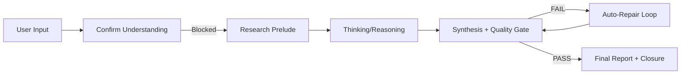

# Deep Thinking Module – Dokumentacja

> **Status wdrożenia:** ✅ Production Ready (92% wg audytu 2026-02-06)  
> **Wersja:** IRIS 6.0 / Enterprise MVP  
> **Ostatnia aktualizacja:** 2026-02-06

---

## 1. Overview

Deep Thinking to **samodzielny tryb decyzyjny** w IRIS 6.0 zaprojektowany do wsparcia złożonych decyzji organizacyjnych. Różni się od standardowego czatu AI poprzez:

- **5-etapowy deterministyczny flow** (Confirm → Research → Thinking → Synthesis → Closure)
- **Blokującą bramkę potwierdzenia** przed rozpoczęciem analizy
- **Widoczny proces research** z transparentnymi źródłami
- **14-punktową rubrykę jakości** (DoD) z automatyczną naprawą
- **8 serwisów enterprise** (memory, audit, calibration, stakeholders, templates, stress testing, collaboration, integrations)

---

## 2. Architecture

### 5-Stage Deterministic Flow



### Backend Services Layer

| Service                            | Odpowiedzialność                            |
| ---------------------------------- | ------------------------------------------- |
| `deepThinkingOrchestrator.ts`      | Główny koordynator 5-stage flow, SSE eventy |
| `deepThinkingQuality.ts`           | Walidacja DoD (6 sekcji) + rubric scoring   |
| `deepThinkingSelfCheck.ts`         | 3-warstwowy quality gate, pass/fail, repair |
| `deepThinkingEvaluationService.ts` | Detekcja N1-N8/P1-P6 patterns               |
| `deepThinkingMetricsService.ts`    | Logowanie eventów operacyjnych              |
| `deepThinkingHintService.ts`       | Sugestia użycia Deep Thinking               |

### Enterprise Suite (8 serwisów)

| Service                           | Cel                                             |
| --------------------------------- | ----------------------------------------------- |
| `decisionMemoryService.ts`        | Pamięć organizacyjna decyzji + outcome tracking |
| `decisionAuditService.ts`         | Black-box replay do compliance                  |
| `confidenceCalibrationService.ts` | Tracking intellectual honesty AI                |
| `multiStakeholderService.ts`      | Perspektywy CFO/CTO/COO/CMO/CHRO/CEO            |
| `industryTemplateService.ts`      | Szablony Manufacturing/Healthcare/Finance/Tech  |
| `scenarioStressTestService.ts`    | Monte Carlo robustness analysis                 |
| `collaborativeSession.gateway.ts` | Real-time multi-user decision rooms             |
| `integrationHubService.ts`        | Export do Notion/Confluence/Slack               |

---

## 3. API Reference

### Endpointy operacyjne

| Method | Endpoint                              | Opis                              |
| ------ | ------------------------------------- | --------------------------------- |
| `POST` | `/api/ai/deep-thinking/evaluate`      | Ewaluacja DoD + patterns + rubric |
| `POST` | `/api/ai/deep-thinking/pairwise`      | Porównanie A vs B                 |
| `POST` | `/api/ai/deep-thinking/save-decision` | Zapisz do decision memory         |
| `POST` | `/api/ai/deep-thinking/events`        | Client-side metrics (copied)      |
| `GET`  | `/api/ai/deep-thinking/metrics`       | Agregowane metryki operacyjne     |
| `POST` | `/api/ai/deep-thinking/metrics/reset` | Reset (super_admin)               |

### Przykład: Evaluate

```bash
curl -X POST /api/ai/deep-thinking/evaluate \
  -H "Authorization: Bearer $TOKEN" \
  -d '{"text": "## Executive Summary\n...", "language": "en"}'
```

Response:

```json
{
  "success": true,
  "dod": { "ok": true, "missing": [] },
  "rubric": { "total": 12, "criteria": {...} },
  "patterns": { "negative": [], "positive": ["P1", "P2", "P3"] }
}
```

---

## 4. Quality Engine (DoD)

### 14-Point Rubric (0-2 per criterion)

| Criterion              | 0              | 1              | 2                     |
| ---------------------- | -------------- | -------------- | --------------------- |
| **Framing**            | Brak           | Częściowy      | + "if we do nothing"  |
| **Alternatives**       | <2 opcje       | 2 opcje        | 3-4 opcje             |
| **Trade-offs**         | Brak           | Implicit       | Explicit tension      |
| **Assumptions & Gaps** | Brak           | Jedno z dwóch  | Oba wyraźne           |
| **Closure/Conditions** | Brak           | Rekomendacja   | + boundary conditions |
| **Clarity**            | Ściana tekstu  | Struktura      | Executive-grade       |
| **Safety/Honesty**     | Hard overreach | Soft overreach | Clean + assumptions   |

### Pass/Fail Rules

- ✅ `total >= 10`
- ✅ Każdy core criterion `>= 1` (framing, alternatives, tradeoffs, assumptions, closure)
- ✅ `safety_honesty >= 1` (hard gate)
- ❌ Overreach bez assumptions = FAIL

### Negative Patterns (N1-N8)

| Tag | Opis             | Auto-repair instruction           |
| --- | ---------------- | --------------------------------- |
| N1  | No Framing       | Dodaj "if we do nothing" scenario |
| N2  | Single-path Bias | Dodaj min. 2 distinct options     |
| N3  | No Trade-offs    | Dodaj explicit vs/tension         |
| N4  | Fake Confidence  | Dodaj assumptions + gaps          |
| N5  | Consultant Soup  | Skróć, dodaj strukturę            |
| N6  | Checklist-only   | Dodaj reasoning                   |
| N7  | No Closure       | Dodaj rekomendację + boundary     |
| N8  | Overreach        | Dodaj Assumptions & Gaps          |

---

## 5. Metrics & Monitoring

### Zbierane metryki

| Metric          | Opis                                |
| --------------- | ----------------------------------- |
| `run_started`   | Rozpoczęcie Deep Thinking session   |
| `run_completed` | Zakończenie z PASS                  |
| `run_aborted`   | Przerwanie przez użytkownika        |
| `force_depth`   | Trigger "go deeper"                 |
| `copied`        | Użytkownik skopiował/zapisał output |

### Dashboard endpoint

```
GET /api/ai/deep-thinking/metrics?period=24h
```

Response:

```json
{
  "metrics": {
    "started": 100,
    "completed": 85,
    "aborted": 5,
    "copied": 50,
    "dodPassRate": 0.88,
    "abortRate": 0.05,
    "forceDepthRate": 0.12,
    "avgOptions": 2.7
  }
}
```

---

## 6. Testing

### Unit Tests

```bash
# Wszystkie testy Deep Thinking
npm run test:unit -- --grep "DeepThinking"

# Gold Standard regression (5 EN + 5 PL)
npm run test:unit -- server/tests/unit/backend/services/DeepThinkingGoldStandard.test.ts
```

### Test Files

| File                                    | Cases                                |
| --------------------------------------- | ------------------------------------ |
| `DeepThinkingSelfCheck.test.ts`         | Pass/fail rules, overreach detection |
| `DeepThinkingGoldStandard.test.ts`      | 10 regression cases (5 EN + 5 PL)    |
| `DeepThinkingQuality.test.ts`           | DoD validation, rubric scoring       |
| `DeepThinkingOrchestrator.test.ts`      | State machine, SSE events            |
| `DeepThinkingEvaluationService.test.ts` | Pattern detection, pairwise          |

---

## 7. Zweryfikowane Komponenty Frontend

| Komponent                  | Status              | Lokalizacja                                               |
| -------------------------- | ------------------- | --------------------------------------------------------- |
| Confirm Understanding Card | ✅ Zaimplementowany | `UnifiedChatPanel.tsx:1079-1164`                          |
| Research Visibility Panel  | ✅ Zaimplementowany | `UnifiedChatPanel.tsx:1032-1076` + `ResearchProgress.tsx` |
| ThinkingStatusLine         | ✅ Zaimplementowany | `ThinkingStatusLine.tsx`                                  |
| Force-depth handlers       | ✅ Zaimplementowany | `UnifiedChatPanel.tsx:557-600`                            |
| Alerting                   | ⚪ Opcjonalny       | Metryki zbierane, alerty do konfiguracji                  |

---

## 8. Changelog

| Data       | Zmiana                             |
| ---------- | ---------------------------------- |
| 2026-02-06 | Audyt 20/20 DoD PASS, dokumentacja |
| 2026-02-05 | Enterprise Suite (8 serwisów)      |
| 2026-01-28 | Gold Standard 10 cases             |
| 2026-01-20 | Self-Check Engine + N-tag repair   |
| 2026-01-15 | Initial Deep Thinking MVP          |
