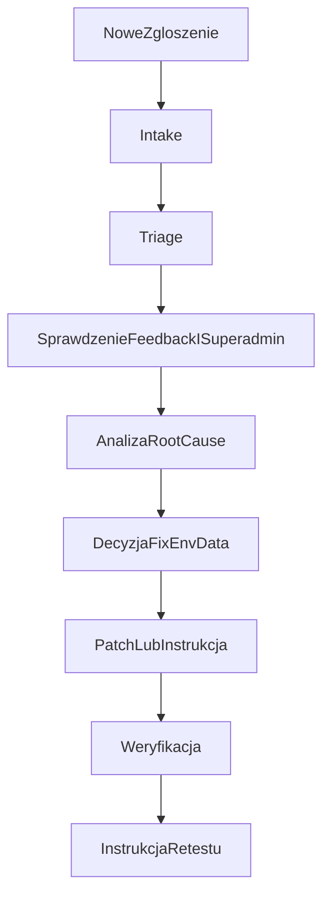

# Cursor Bug Triage Workflow

Ten dokument opisuje standardowa procedure pracy nad nowymi zgloszeniami, ktore wrzucasz mi tutaj do analizy i naprawy.

## Cel
Chodzi o to, zebys mogl w staly sposob przekazywac nowe tematy, a ja zebym:
- robil szybki triage,
- sprawdzal, czy temat jest widoczny w feedback lub superadmin,
- wskazywal root cause,
- przygotowywal bezpieczny fix,
- konczyl temat testem i instrukcja retestu.

## Domyslne zasady
- Jesli nie napiszesz inaczej, najpierw robie triage i potwierdzenie problemu.
- Jesli temat dotyczy produkcji, a zmiany maja isc na staging, najpierw odtwarzam i stabilizuje temat na stagingu.
- Jesli problem wyglada na env, dane albo integracje, mowie to wprost i nie udaje, ze to czysty bug w kodzie.
- Jesli temat ma aspekt bezpieczenstwa, traktuje go jako wysoki priorytet.

## Gdzie standardowo sprawdzam temat
- `server/src/routes/feedback.routes.ts`
- `src/views/superadmin/SuperAdminFeedbackView.tsx`
- `src/views/superadmin/SuperAdminFeedbackBacklogView.tsx`
- `src/components/Feedback/FeedbackSidePanel.tsx`

To jest podstawowa sciezka, gdy chcesz zebym potwierdzil, czy temat byl zgloszony przez system feedback i czy trafil do superadmina.

## Standardowy przebieg
### 1. Intake
Na starcie potwierdzam:
- jaki jest objaw,
- na jakim srodowisku to sie dzieje,
- czy temat dotyczy konkretnego usera, organizacji albo route,
- czy dane wejsciowe wystarczaja do startu.

Jesli czegos krytycznie brakuje, prosze tylko o 1-2 brakujace elementy.

### 2. Triage
Potem sprawdzam:
- czy da sie potwierdzic temat w systemie feedback lub superadmin,
- czy problem wyglada na frontend, backend, env, dane albo proces,
- czy to jest pojedynczy przypadek, czy szerszy wzorzec,
- czy potrzebny jest fix w kodzie, czy raczej retest albo analiza danych.

Na tym etapie status dla Ciebie jest jeden z tych:
- `potwierdzone`
- `niepotwierdzone jeszcze`
- `wyglada na env/data`
- `wyglada na bug w kodzie`

### 3. Analiza
Jesli temat jest potwierdzony albo mocno prawdopodobny, przechodze przez:
- UI i sciezke uzytkownika,
- endpoint i controller,
- dane i statusy konta lub organizacji,
- sesje, tokeny, maile i integracje,
- testy i miejsca podatne na regresje.

### 4. Decyzja wykonawcza
Po analizie kwalifikuje temat jako:
- `fix w kodzie`
- `problem danych`
- `problem srodowiska`
- `brak odtworzenia`
- `do retestu przez czlowieka`

### 5. Fix
Jesli jest sens robic patch:
- najpierw wskazuje root cause,
- potem robie minimalny bezpieczny fix,
- potem odpalam test albo celowana weryfikacje,
- na koncu przygotowuje instrukcje retestu.

### 6. Zamkniecie
Na koncu zawsze dostajesz:
- co bylo przyczyna,
- co zostalo zmienione,
- jak to przetestowac,
- jakie sa ryzyka albo co jeszcze trzeba sprawdzic.

## Sciezka domyslna dla auth i recoverability
Jesli temat dotyczy logowania, maila albo hasel, standardowo sprawdzam:
- login,
- forgot password,
- reset password,
- akcje superadmina na userze,
- sesje i revoke,
- `FRONTEND_URL`, SMTP, cookies i hosty.

## Minimalny workflow

## Jak najlepiej mnie prosic o robote
### Jeden temat
Uzyj szablonu z:
- `docs/templates/CURSOR_BUG_INTAKE_TEMPLATE.md`

### Kilka tematow naraz
Powiedz wprost:
- ile ticketow mam przejrzec,
- czy tylko robimy triage,
- czy moge od razu przejsc do fixu na staging.

### Pelne prowadzenie sprawy
Napisz:
- ze mam wziac temat end-to-end,
- czy mam tylko zbadac,
- czy mam tez wdrozyc poprawke i przygotowac wiadomosc do retestu.
