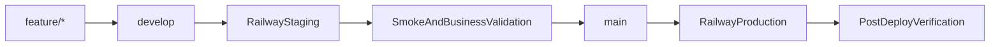

# Staging and Production Operating Model

**Status:** Canonical source of truth  
**Last updated:** 2026-04-12

## Purpose

This document defines the only supported release model for Consultify.

Use it as the reference for:
- branch flow
- Railway deployment targets
- local work against staging
- promotion from staging to production
- rollback and hotfix discipline

## Canonical Flow

## Branch Model

- `feature/*`: daily development branches.
- `develop`: integration branch and the only source for staging deployments.
- `main`: production branch and the only source for production deployments.

## Deployment Policy

### Staging

- Source branch: `develop`
- Trigger: automatic deploy on push to `develop`
- Target: dedicated Railway staging target
- Purpose: integration, QA, pilot validation, release candidate rehearsal

### Production

- Source branch: `main`
- Trigger: manual GitHub Actions dispatch after approval
- Target: dedicated Railway production target
- Purpose: customer-facing stable release

## Railway Target Model

The supported model is two isolated Railway targets:

- `staging`
- `production`

They may be implemented as either:

- two separate Railway projects, or
- two separate environments inside one Railway project

Operationally, both are treated as separate deployment channels with separate configuration, secrets, domains, databases, and monitoring.

## Environment Separation Rules

### Staging must have its own:

- database
- JWT and MFA secrets
- OAuth callback URLs
- email sender identity
- Stripe test keys
- monitoring and alert routing

### Production must have its own:

- database
- live secrets
- production domains
- production OAuth callback URLs
- live billing integrations
- production monitoring and alerting

Never reuse production secrets in staging.

## Local Work Against Staging

When working locally against staging data:

- use `npm run dev:staging` for normal work
- use `npm run dev:staging:ro` for read-only investigation
- use `npm run db:migrate:staging` for staging migrations

Do not use Railway private DB hosts from a laptop. Follow [RAILWAY_DB_TARGET_RULES.md](./RAILWAY_DB_TARGET_RULES.md).

## Promotion Rules

A change may move from staging to production only when all of the following are true:

- merged into `develop`
- deployed to staging
- smoke-checked on staging
- validated by business or pilot owner
- promoted via PR from `develop` to `main`
- production deployment explicitly approved

Standard promotion path is:

1. merge feature work into `develop`
2. validate on staging
3. open PR `develop -> main`
4. approve and merge
5. run manual production deploy
6. execute production verification

## Hotfix Rules

Use this flow for production hotfixes:

1. create `hotfix/*` from `main`
2. merge hotfix into `main`
3. deploy production
4. immediately back-merge `main` into `develop`

Never leave `develop` behind after a production hotfix.

## CI and Release Controls

- `test-suite.yml` is the quality gate for `main` and `develop`
- `railway-deploy.yml` is the deployment workflow
- successful staging deploy records the deployed revision as the `staging-deployed` tag; production deploy is blocked unless `main` matches this tag
- branch protection must match real GitHub job names, not legacy placeholders

## Reference Documents

- [Railway Environment Matrix](../deployment/RAILWAY_ENV_MATRIX.md)
- [Local to Staging Runbook](./LOCAL_TO_STAGING_RUNBOOK.md)
- [Staging to Production Runbook](./STAGING_TO_PRODUCTION_RUNBOOK.md)
- [Railway DB Target Rules](./RAILWAY_DB_TARGET_RULES.md)
