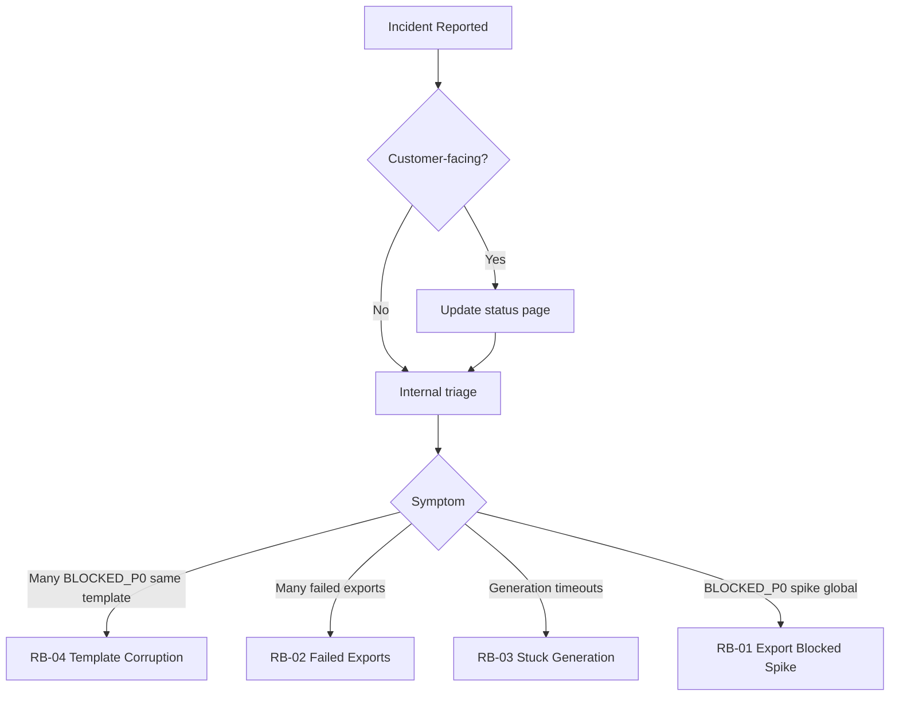

# Presentation Pipeline — Incident Runbooks Index

> Operator-facing entry point for the four canonical incident scenarios on
> the Consultify presentation pipeline. Each runbook below follows the same
> structure (Detection → Containment → Recovery → Communication →
> Postmortem) so on-call muscle memory stays consistent across scenarios.
>
> Authoritative SLO definitions: `docs/testing/PRESENTATION_SLI_SLO.md`.
> Anomaly detector: `docs/operations/PRESENTATION_OPS_ANOMALY_DETECTION.md`.
> Governance alert dispatch: `docs/operations/PRESENTATION_GOVERNANCE_ALERTS.md`.

## Quick decision flow

## Runbooks

| ID    | Scenario                  | Severity | SLO impacted                  | Path |
|-------|---------------------------|----------|-------------------------------|------|
| RB-01 | Export Blocked Spike      | P1 / P0  | `export_blocked_rate`         | [`RB-01-export-blocked-spike.md`](./RB-01-export-blocked-spike.md) |
| RB-02 | Failed Exports            | P1 / P0  | `export_success_rate`         | [`RB-02-failed-exports.md`](./RB-02-failed-exports.md) |
| RB-03 | Stuck Generation          | P1 / P0  | `p95_generation_latency_ms`   | [`RB-03-stuck-generation.md`](./RB-03-stuck-generation.md) |
| RB-04 | Template Corruption       | P0       | indirect (export_blocked_rate)| [`RB-04-template-corruption.md`](./RB-04-template-corruption.md) |

## Severity × ETA × On-call rotation

| Severity | Definition                                                             | ETA to mitigate | On-call rotation                              |
|----------|------------------------------------------------------------------------|-----------------|-----------------------------------------------|
| P0       | Customer-facing or shared infrastructure broken; >50% of org impacted. | ≤ 30 min        | SRE primary + Backend Lead + Exec sponsor     |
| P1       | Single org or single SLO in `breach`.                                  | ≤ 60 min        | SRE primary + Backend Lead                    |
| P2       | Single SLO in `at_risk` or single deck affected.                       | Next business day | Backend Lead during business hours          |

## Customer comms templates

Customer-facing acknowledge / investigation / resolution copy lives in
`docs/operations/incident-runbooks/customer-comms-templates.md` (companion
file maintained by the support lead). Always send acknowledge within 15
minutes of P0/P1 confirmation.

## Frontend integration

The SuperAdmin Operations Health view renders an
`<IncidentRunbooksCard />` (see
`src/components/SuperAdmin/IncidentRunbooksCard.tsx`) that classifies the
current report against the runbook taxonomy via
`server/src/services/presentationIncidentClassificationService.ts` and
points the on-call operator at the right runbook from this index.

## Customer Communications

Every runbook's `Communication` section points at the same canonical
template library: [`customer-comms-templates.md`](./customer-comms-templates.md).
That file is the single source of truth for tone, severity → channel
mapping, and the five reusable email templates (acknowledge, update,
resolution, postmortem, maintenance pre-announcement). Whenever a
runbook says "use the customer email template", it means: copy the
relevant template from `customer-comms-templates.md`, fill in the
incident ID and ISO timestamps, and send it via the channel matching
the severity. Edits to tone or template structure are made there — not
in the individual runbooks — so all four scenarios stay consistent.
