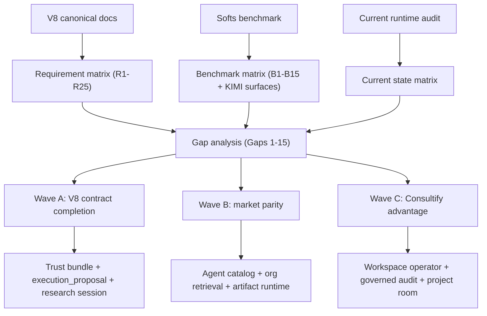

# Chat V8 — AI Parity Audit

> Status: Draft v1 (2026-04-16)
> Owner: AI / Chat program
> Zakres: jedna prawda `V8 requirements → benchmark → current state → gap → roadmap` dla AI/chat w `consultify`.
> Plan źródłowy: `.cursor/plans/ai_chat_parity_73396818.plan.md` (plik planu pozostaje niezmieniony).

---

## 0. TL;DR

- `consultify` ma mocny, żywy runtime czatu (stream, historia, foldery, URL/plik ingest, private mode, custom instructions, co-thinker, deep research gate, approve/reject, voice pieces, background workers).
- Jednocześnie nie jest jeszcze jednym, kanonicznym, leader-grade „AI operating system”. Najważniejsze źródło tarcia to **dryf produktowy**, nie brak raw capability:
  1. dwa shelle czatu (`AIChatWelcomeView` vs `UnifiedChatPanel`),
  2. brak jednolitego, user-visible kontraktu zaufania (source-class badges, routing trace, trust bundle),
  3. niespójny model propozycji/akcji (`ChatActionProposal` vs `ActionProposal`, brak `execution_proposal` jako pierwszoklasowego message type),
  4. brak pełnego, governed „chat → research → proposal → approval → execution → artifact → revisit” jako jednego przepływu dla wszystkich typów pracy,
  5. specjalistyczne agent surfaces (docs / sheets / slides / reports / research) nadal doklejane zamiast chat-native,
  6. artifact runtime i background long-running research są częściowe — nie ma first-class „research session jako zadanie w kolejce”, z resume/retry,
  7. output trust (citations → provenance → confidence → cost → model → trace) nie ma jednego kontraktu,
  8. cloud OAuth w czacie pozostaje UI-obietnicą bez pełnego runtime.
- Celem V8 parity jest nie „ładniejszy chat”, tylko **domknięcie modelu**:
  `entry → scope understanding → ask → stream → source/trust disclosure → propose → approve → execute → artifact → revisit → org memory`.
- Dostarczenie w trzech falach: **Wave A — V8 contract completion**, **Wave B — market parity**, **Wave C — consultify advantage** (workspace-native, artifact-native, governed, action-native).

---

## 1. V8 AI contract — requirement matrix

Źródła normatywne (czytane w tej iteracji):
`CHAT_V8_SSOT.md`, `CHAT_V8_CONTROL_SURFACE_SPEC.md`, `CHAT_V8_RUNTIME_TRUTH_MAP.md`, `CHAT_V8_ACTIONS_AND_APPROVALS.md`, `CHAT_V8_ATTACHMENTS_AND_RETRIEVAL.md`, `CHAT_V8_MODES_AND_SCOPE_MODEL.md`, `CHAT_V8_HISTORY_AND_LIBRARY_MODEL.md`, `CHAT_V8_MEMORY_AND_PERSONALIZATION.md`, `CHAT_V8_AI_GOVERNANCE.md`, `CHAT_V8_RESPONSE_MODEL.md`, `CHAT_V8_VOICE_AND_MULTIMODAL.md`, `CHAT_V8_GAP_MATRIX.md`, `CHAT_V8_AS_IS.md`, `AI_LEADER_PARITY_ARCHITECTURE_V8.md`.

### 1.1 Capability areas i „non-negotiable contracts”

| # | Obszar | Kanoniczny kontrakt V8 (skrót) | Dokument źródłowy |
|---|---|---|---|
| R1 | Jeden shell | `UnifiedChatPanel` to jedyny kanoniczny shell dla full + split chat; `AIChatWelcomeView` = legacy migration target | SSOT §4.1, RUNTIME_TRUTH_MAP §2, AS_IS §2 |
| R2 | Jedna ścieżka produktu | `entry → select/create conv → understand scope/modes → ask → stream → inspect → refine → act/save → revisit` | SSOT §5 |
| R3 | Model domenowy | `Conversation`, `ChatFolder`, `ConversationMessage` (w tym `execution_proposal` messageType), `ChatActionProposal`, `AttachmentContext` | SSOT §6 |
| R4 | Źródła wiedzy (source classes) | 6 jawnych klas: `general / conversation history / workspace / attachments / web / org memory`; sourced answer odróżnialny od general | SSOT §10.1, ATTACH §2, GOVERN §6 |
| R5 | Retrieval honesty | Jeśli UI obiecuje źródło, runtime musi je mieć; cytaty best-effort → oznaczyć wprost; deep research = gated flow z confirm + reviewable output | ATTACH §7–§8, GOVERN §6.2 |
| R6 | Scope/modes | Każdy mode odpowiada na „jak AI pracuje” lub „z czego korzysta”; żadnych ukrytych focusów; scope zawsze user-visible | MODES §2–§5 |
| R7 | Private mode + personalization | 3 warstwy pamięci: conversation / user / organizational; private mode ogranicza injection; custom instructions = controlled layer | MEMORY §3–§7 |
| R8 | Actions / approvals | Lifecycle `proposed → pending_review → approved|rejected → executed|closed → audited`; no silent execution; `approve` ≠ `execute` jeśli to różne kroki | ACTIONS §3–§5, GOVERN §5 |
| R9 | Response classes | 8 klas: `general / workspace-grounded / attachment-grounded / research / proposal / action-carrying / artifact-oriented / rich structured`; trust contract per klasa | RESPONSE §2–§5 |
| R10 | Proposals jako first-class | `execution_proposal` musi być dedykowanym `messageType`, nie schowanym w `actions` (Decision W2-3) | SSOT §6.3 |
| R11 | Streaming contract | Partial chunks / stop / retry / end-of-stream / errors; advanced eventy (thinking, citations, actions) bez mylenia zwykłej rozmowy | RESPONSE §4 |
| R12 | History as library | Lifecycle `recent → pinned → folders → search → archived → open → continue`; search musi mieć baseline client i target server; archive ≠ delete; folder ≠ project | HISTORY §2–§5 |
| R13 | Voice | Jeden user-visible state machine: idle/listening/dictating/recording/transcribing/speaking/muted/failed; dictation = canonical; voice conv = partial until contract; TTS = output mode | VOICE §2–§8 |
| R14 | Artifact handoff | Save-as-note/idea/decision/task/report/slide z jasnym rezultatem (draft vs final, approval-required); artifact runtime first-class | ACTIONS §4.3, SSOT §9 |
| R15 | Workspace split | Split mode = product advantage, nie mniejsza kopia full chat; workspace context user-visible | SSOT §4.7 |
| R16 | Prompt governance | Jeden owner base persona; governance > co-thinker > retrieval addons > style; fallback honesty | GOVERN §7 |
| R17 | Output trust | One provenance/routing/trust bundle contract — citations + source class + model/tier + confidence + cost/tokens + routing trace, operator-visible | AI_LEADER_PARITY §5 (Output Trust = P0) |
| R18 | Enterprise search & connectors | ACL-aware, freshness-aware, org-wide retrieval (nie tylko pojedynczy attachment) | AI_LEADER_PARITY §5 (Connectors = P0) |
| R19 | Background & scheduled runtime | Long-running work z lifecycle, retry, resume, queue-aware (research session, multi-agent run, scheduled reports) | AI_LEADER_PARITY §5 (Background = P0) |
| R20 | Agent security & tool governance | Least privilege, approvals, safe delegation, permissioned tools | AI_LEADER_PARITY §5 |
| R21 | AI ops & release | Safe rollout, rollback, evals, deprecations, policy control dla modeli i promptów | AI_LEADER_PARITY §5 |
| R22 | Human-in-the-loop | Widoczna kontrola nad ważnymi mutacjami i decyzjami, cross-surface | AI_LEADER_PARITY §5 |
| R23 | Workload classes / SLA | Dopasowanie workload shape → latency / budget / reliability (fast chat vs deep research vs async job) | AI_LEADER_PARITY §5 |
| R24 | Memory lifecycle | Freshness, retention, deletion, compact working state; jasny owner retencji | AI_LEADER_PARITY §5, MEMORY §9 |
| R25 | Feedback loop | Jeden canonical pipeline z learning system, bez legacy/fake paths | GOVERN §10 |

### 1.2 Klasyfikacja wymagań (P0 / P1 / P2)

- **P0** (produkt nie jest V8-ready bez tego): R1, R2, R4, R5, R6, R8, R10, R17, R18, R19
- **P1** (hardening do leader-grade): R3, R7, R9, R11, R12, R14, R15, R16, R22, R23, R24, R25
- **P2** (rozszerzenia / dokumentacyjne): R13, R20, R21

---

## 2. Benchmark matrix z `Softs`

Katalog `Softs` jest asymetryczny:
- jedyny czytelny „product surface” to **KIMI** (`Softs/KIMI/Docs/www.kimi.com/`),
- pozostałe foldery (`0 Czat`, `0 Agenci`, `0 Prompty`, `0 Notatki`, `0 Projekty`, `0 Prezentacje`, `0 Baza wiedzy`, `0 tabele`, `0 synchronizacja`, `0 Whiteboard`, `0 Miro`, `0 Diagramy`, `0 KPI`, `0 Ankiety`, `0 Kalendarz`, `0 Analiza finansowa`, `0 Program partnerski`) to archiwa dokumentacji wendorów,
- `Multiplayer` → Liveblocks pattern (real-time collab primitives),
- `Palantir` → enterprise governed AI pattern (AIP).

Wyciągamy wzorce capability, nie vendor UI.

### 2.1 Vendor reference map (na podstawie zawartości folderów)

| Kategoria | Vendor refs obecne w `Softs` | Wzorzec capability |
|---|---|---|
| Core chat | `Anthropic` / Claude, `OpenAI`, `Google` (`0 Czat`) | Prosty, szybki core flow; Claude = projects + file-heavy; ChatGPT = low-friction main shell |
| Retrieval / research | `Perplexity`, `LlamaIndex`, `Promptguide` (`0 Prompty`) | Evidence-led answers, sourced responses, visible trust; retrieval-first discipline |
| Agent / orchestration | `CrewAI`, `LangChain` (+ dev), `OpenAI function calling`, `OpenAI model selection`, `Replit` (`0 Agenci`) | Multi-agent planning, routing, subagents, structured outputs, long-running workflow classes, approvals |
| Knowledge base | `Atlassian` ×2, `Intercom` ×2, `Zendesk` ×2 (`0 Baza wiedzy`) | Enterprise KB search z ACL, freshness, deflection/copilot dla support; grounded answer z org sources |
| Notes | `Notion` (dev + help), `Evernote` (`0 Notatki`) | AI doc editor embedded w knowledge graph; slash-commands; summaries; Q&A over page |
| Presentations | `Beautiful.ai`, `Gamma`, `Pitch` (`0 Prezentacje`) | Chat-driven slide creation/editing; templates + generative deck; shareable output |
| Project mgmt | `ClickUp` (dev/help), `Linear`, `Monday` (`0 Projekty`) | AI assistant w tasks: auto-create, summarize, follow-up, cross-issue queries |
| Collab real-time | `Liveblocks` (`Multiplayer`) | Co-presence, multi-cursor, shared live state dla artefaktu (doc/canvas) |
| Governed enterprise AI | `Palantir` AIP (`Palantir`) | Operational ontology, human approvals, typed tools, traceable actions na danych produkcyjnych |
| Whiteboard | `0 Whiteboard`, `0 Miro`, `0 Diagramy` | AI sidekick dla canvas/mindmap/diagram |
| Analysis | `0 Analiza finansowa`, `0 KPI`, `0 tabele` | Analytical AI nad sheets/KPIs |

### 2.2 KIMI product surface (źródło: `Softs/KIMI/Docs/www.kimi.com/features/index.html` + sekcje)

| KIMI surface | Opis (z meta description) | Odpowiednik capability |
|---|---|---|
| `Agent` | Breakdown tasks, deep research, generate deliverables (websites/slides/docs/sheets/reports) | One assistant → many artifact specialists |
| `Deep Research` | Decomposition + extensive search + long-form professional report | Governed research session jako workflow |
| `Agent Swarm` | Parallel massive reports, setki firm, bulk papers, consistent visuals | Parallel long-running worker pool z shared output |
| `Docs` | Word/PDF print-ready z track changes, comments, illustrations, cover | Chat-driven document editor |
| `Sheets` | Excel z formulas, pivots, charts, data cleaning, financial modeling | Chat-driven spreadsheet analyst |
| `Slides` | Turn idea → slides | Chat-driven presentation builder |
| `Websites` | No-code interactive site builder, auto-deploy share-ready | Chat-driven publishing |
| `Kimi Claw` | 24/7 deployable agents one-click | Always-on scheduled/background agent |
| `Kimi Code` | AI code agent dla terminal/IDE | Developer copilot (poza zakresem V8 core) |

### 2.3 Wzorce benchmark (wyciągnięte z vendorów + KIMI)

| # | Wzorzec | Gdzie wiodący | Co znaczy produktowo |
|---|---|---|---|
| B1 | Prosty core chat z predictable streaming | ChatGPT, Claude, KIMI | Najkrótsza droga od entry do streamu, jeden shell |
| B2 | Projects / folders z file-heavy workflow | Claude Projects, KIMI | Rozmowy + pliki + context grouped jako projekt; re-usable memory |
| B3 | Sourced answer z widocznymi citations | Perplexity, Atlassian Rovo, KIMI Deep Research | Każda non-trivial wypowiedź ma ewidencję; UI odróżnia sourced vs general |
| B4 | Guided Deep Research z confirm + long-form output | KIMI Deep Research, Perplexity Pro | Dedykowany tryb z dłuższym runtime i reviewable raportem |
| B5 | Agent swarm / parallel background agents | KIMI Agent Swarm, OpenAI agents, Replit workflows | Long-running queue-aware jobs z resume/retry |
| B6 | Artifact agents (docs/sheets/slides/sites) | KIMI, Gamma, Notion AI, Beautiful.ai | Specjalistyczne surface generujące artefakty, nie tylko odpowiedzi |
| B7 | Chat-native task/proposal creation | ClickUp/Linear/Monday AI | AI → propose task/ticket → approval → execution |
| B8 | Enterprise KB z ACL i freshness | Atlassian Rovo, Intercom Fin, Zendesk AI | Org search jako equal retrieval source; ACL-aware |
| B9 | Governed ontology + human approvals | Palantir AIP | Typed tools, ontology-aware actions, każda ważna akcja reviewable/auditable |
| B10 | Real-time multiplayer nad artefaktem | Liveblocks | Co-presence podczas edycji produktu AI |
| B11 | Persona / co-thinker catalog | Claude Projects personas, KIMI Agent | Specjalizowane persona jako first-class, nie ukryte toggle |
| B12 | Multi-step orchestration z subagents | LangChain, CrewAI, OpenAI agents | Routing / planning / delegation / structured outputs |
| B13 | Transparent trust bundle (model + sources + trace) | Anthropic system transparency, Perplexity | „Why this answer” surface pod każdą odpowiedzią |
| B14 | Scheduled/always-on agents | KIMI Claw, CrewAI crews | Agenty działające bez usera, cyklicznie lub na event |
| B15 | Honest multimodal scope | Claude, OpenAI | Jasne rozróżnienie tego co wspierane vs nie |

---

## 3. Current state — consultify chat/AI capability map

Źródło: `CHAT_V8_AS_IS.md` + audyt runtime (szczegóły w `UnifiedChatPanel.tsx`, `AIChatWelcomeView.tsx`, `useAIStream.ts`, `useConversationStore.ts`, `useChatProjectStore.ts`, `server/src/routes/ai.routes.ts`, `server/src/routes/conversations.routes.ts`, `server/src/routes/chat-projects.routes.ts`, `server/src/routes/voice.routes.ts`, `server/src/services/ai/*`, `server/src/queues/aiQueue.ts`, `server/src/workers/aiWorker.ts`, `server/src/cron/Scheduler.ts`).

Klasyfikacja: `real / partial / legacy-live / missing / documented-only`.

### 3.1 Shell / flow

| Kapability | Stan | Dowód runtime |
|---|---|---|
| Canonical shell `/chat` | `legacy-live` | `AppRoutes.tsx` renderuje `AIChatWelcomeView` dla `ROUTES.AI_CHAT` i `AI_CHAT_CONVERSATION`. `UnifiedChatPanel` działa głównie w split/layout context. |
| Full vs split parity | `partial` | Dwa równoległe drzewa komponentów. Wspólne: `EnhancedChatInput`, `useAIStream`. Różne: nagłówek, actions, handlers. |
| Stream runtime (chunk/stop/retry/citations/thinking/proposals/policy) | `real (rich)` ale bez `execution_proposal` | `useAIStream.ts` obsługuje `citations`, `thought`, `dt_*`, `teresa_proposal`, `stream_meta`. `ai.routes.ts` `POST /chat/stream` z DT gate. Brak osobnej rodziny `action/proposal` events poza Teresa. |
| New chat / route sync | `real` | `ConversationRouteSync.tsx` + `useConversationStore.createConversation`. |
| Deep research confirm gate | `real` | `POST /chat/confirm`, stream wymaga `context.deepThinkingConfirmed` gdy `deepResearch`. |

### 3.2 History / library

| Kapability | Stan | Dowód |
|---|---|---|
| History groups (recent/pinned/archived/folders/unassigned) | `real` | `ChatHistorySidebar.tsx` + `groupConversations`. |
| Search (client + server) | `real` | <3 znaki → client filter; ≥3 znaki → `GET /conversations/search?q=`. |
| Folder CRUD personal/team | `real` | `useChatProjectStore` + `chat-projects.routes.ts` z `scope`. |
| Conversation actions (rename/star/archive/delete/move) | `real` | Store + routes; DnD do folderu. |
| Optimistic concurrency (version / 409) | `real` | `useConversationStore` wysyła `expectedVersion`, handle'uje 409 odświeżeniem. |

### 3.3 Retrieval / scope

| Kapability | Stan | Dowód |
|---|---|---|
| Local file ingest | `real` (whitelist: PDF, text/markdown/csv/json, `text/*`) | `POST /attachments/ingest` (multer) + `chatAttachmentSupport.ts`. |
| URL ingest | `real` w obu shellach | `POST /attachments/ingest-url` + `AddFilesMenu.onUrlAdd` + ingest przy wysyłce w `UnifiedChatPanel`. |
| Cloud OAuth in-chat | `partial` | `useCloudIntegrations` toast „OAuth not available in chat”; browse/download real gdy provider już połączony. |
| Source-class badges w UI (general/workspace/attachment/web/org) | `partial` | `MessageRenderer` ma `sourceLedger` + `CitationList`, brak jawnych badge'y klas. |
| Citations (stream + render) | `real` | `useAIStream` emits `citations`, `CitationList` renderuje. |
| Web search runtime | `real` (Tavily + DuckDuckGo fallback) | `tavilyWebSearchService`, `runtimeWebSearchService`, `deepResearchService`. |
| Organizational memory injection | `partial` | `ai.routes.ts` używa `conversationSummaryService` + `longTermMemoryService.getPromptAddendum`; pełny `AIMemoryManager` szerszy, ale nie wszędzie zintegrowany. |

### 3.4 Modes / personalization

| Kapability | Stan | Dowód |
|---|---|---|
| Private mode | `real` | `memoryInjectionAllowed = !privateMode && !deepResearch` + `userPrivacyService`. |
| Custom instructions | `real` | `ToolsMenu.tsx` → `/api/ai-memory/custom_instructions`, odczyt w `AIPipeline.ts`. |
| Model/tier selection | `real (global)` | `useAppStore.aiConfig.selectedTier/selectedModelId`; brak per-message pickera. |
| Co-thinker / persona | `real` | `CoThinkerMenu.tsx` + `coThinkerService.buildCoThinkerSystemPrompt`. |
| Voice (dictation) | `real` | `useUniversalVoice` + Web Speech. |
| Voice (conversation) | `partial` | Ścieżka istnieje (`/api/voice/stt`, Teresa voice), brak jednego user-visible state machine. |
| TTS / auto-read | `real` | `/api/voice/tts` + toggle w panelu. |

### 3.5 Actions / approvals

| Kapability | Stan | Dowód |
|---|---|---|
| Pending actions + approve/reject | `real` | `useAIActionsStore`, `ai.routes.ts` endpoints, `aiActionExecutor.UPDATE ai_actions`. |
| Lifecycle `proposed→pending_review→approved/rejected→executed→audited` | `partial` (nazewnictwo enum ≠ V8 vocab) | `aiActionExecutor` statusy PENDING/APPROVED/REJECTED/EXECUTED; brak explicit `pending_review` i pełnego `audited` pipeline user-visible. |
| Unifikacja `ChatActionProposal` vs `ActionProposal` | `partial` (Wave 2 fasada w planie V8) | `chatExecutionService`, `ActionProposalView.tsx`. |
| `execution_proposal` jako first-class messageType | `missing` | Brak w `src/` — wiadomości zapisują `messageType: 'text'`. |
| Save-to-artifact | `real (notes/ideas/decisions)` | Handlery w `UnifiedChatPanel`, endpointy konwersacji. |
| Silent execution | `partial risk` | Krytyczne akcje przez `ai_actions`; brak globalnego enforce „no silent side effects”. |

### 3.6 Workspace / split

| Kapability | Stan | Dowód |
|---|---|---|
| Split workspace context | `real` | `MainLayout.createWorkspaceContext` + `setWorkspaceContext`; `UnifiedChatPanel` dostaje `workspaceContext`; `ContextBadge`. |
| Auto-navigation z AI | `partial` | `navigateToRoute` dla część artefaktów (heurystyki), nie deterministyczny kontrakt. |

### 3.7 Governance / trust

| Kapability | Stan | Dowód |
|---|---|---|
| Response metadata (sources, model, cost, tokens) | `partial` | Stream metadata i koszt w części paneli; brak widocznego `routing_trace`. |
| AI quality checker | `partial (server-only)` | `qualityChecker.ts` — heurystyki + LLM judge; nie widoczne w UI. |
| Feedback pipeline | `partial` | `POST /ai/feedback` + `learningSystem.extractAllPatterns/consolidateLearnings` w Scheduler; brak closed-loop w UX. |
| Audit trail AI actions | `partial` | `aiActionExecutor._logAudit` przy reject; brak user-facing viewer. |

### 3.8 Agent / background

| Kapability | Stan | Dowód |
|---|---|---|
| Multi-agent decision room | `real` (perspektywy CFO/CTO/…) | `ai.routes.ts` `multiAgent → runDecisionRoom` w `advancedFeatures`. |
| Agent catalog (docs/sheets/slides/research agent) | `partial (persona-level)` | Co-thinkers (`multi_consultant`, `idea_maker`, ...) — bliżej person niż specialized agent surfaces z KIMI/Claude. |
| BullMQ AI jobs | `real` | `aiQueue`/`aiWorker`: `generate_initiatives`, `build_roadmap`, `RUN_EVAL_SUITE`, `AGENT_BACKGROUND_TASK`. |
| Scheduled AI jobs | `real` | `Scheduler.ts`: pattern extraction, learning consolidation, OpenRouter sync, AI budget, cleanup. |
| Agent swarm (parallel per-conversation) | `partial` | `runDecisionRoom` wieloperspektywiczne; brak publicznego swarm flow. |
| Long-running research session jako job | `missing` | Deep Research działa w HTTP stream, nie jako resumable job w kolejce. |

### 3.9 Artifact runtime

| Kapability | Stan | Dowód |
|---|---|---|
| Chat-driven editing (notes/docs/slides/reports) | `partial` | `KimiWorkspaceShell`, Wordy/Excele/Prezentacje integrują `UnifiedChatPanel`; brak jednolitego modelu. |
| `Rich structured response` rendering | `partial` | `MessageRenderer` ma citations/ledger; brak pełnej palety dla proposal/action-carrying/artifact response classes. |
| Cross-surface publish/share artifact | `partial` | Sharing rozmów istnieje; cross-surface publish model niepełny (zgodnie z `AI_LEADER_PARITY` Collaboration = PARTIAL). |

### 3.10 Current state maturity summary

| Layer | Maturity | Verdict |
|---|---|---|
| Core chat streaming | strong | ready to harden |
| History & library | medium-high | silna baza, brak formal product model w UI |
| Retrieval & attachments | medium | realna podstawa, niepełna transparentność |
| Scope & modes | medium | realne toggles, brak pełnego modelu source-class |
| AI actions | medium | propose/approve real, brak `execution_proposal` + unified vocabulary |
| Voice | low-medium | kawałki real, brak one user-facing story |
| Full vs split shell | low | największy structural gap |
| Output trust | low-medium | citations real, brak trust bundle |
| Artifact runtime | low-medium | fragmentarycznie, bez unified contract |
| Background AI | medium | jobs real, brak resumable research sessions |

---

## 4. Gap analysis — „co musi być, żeby AI wykorzystywało 100% potencjału aplikacji”

Gap nie jest w samym chacie. Jest w pełnym modelu współpracy `user ↔ AI ↔ app runtime`.

### 4.1 Gap #1 — Two-shell contradiction (P0)

- **Target** (R1, R2): jeden canonical shell dla `/chat` i split.
- **Dziś**: `/chat` → `AIChatWelcomeView`, split → `UnifiedChatPanel`.
- **Konsekwencja**: QA weryfikuje wrong shell, feature drift, podwójna konserwacja.
- **Co trzeba**:
  1. Route `/chat` przełączyć na `UnifiedChatPanel` w trybie `full`.
  2. Mieć one parameter contract (`mode: 'full' | 'split'`).
  3. `AIChatWelcomeView` → klasyfikacja `legacy` w `DOCUMENTATION_REGISTRY`, plan dekomisji z flagą feature parity checklist.

### 4.2 Gap #2 — Scope / source transparency (P0)

- **Target** (R4, R5, R6, R17): user zawsze widzi source class i trust contract.
- **Dziś**: citations są, ale brak source-class badges; brak `routing_trace`; brak „why this answer” panel.
- **Co trzeba**:
  1. Rozszerzyć `stream_meta` o `sourceClasses` (aktywne zestawy) + per-message `provenance`.
  2. `MessageRenderer` → badge'y: `workspace`, `attachment`, `web`, `org`, `general`.
  3. Expandable „Trust panel” pod każdą non-trivial odpowiedzią: model, tier, tokens, cost, tools used, sources, confidence (heurystyka + LLM judge), warnings.
  4. Jawne rozróżnienie `grounded` vs `best-effort` w UI.

### 4.3 Gap #3 — Actions / proposal model unification (P0)

- **Target** (R8, R10, R22): jeden lifecycle, `execution_proposal` jako first-class `messageType`, explicit `approve` ≠ `execute`.
- **Dziś**: `ChatActionProposal` ≠ `ActionProposal`, `messageType: 'text'` zawsze; enum statusów ≠ V8 vocab; brak `pending_review`/`audited` w UI.
- **Co trzeba**:
  1. Schemat: nowy `messageType: 'execution_proposal'` (oraz `action_result`, `proposal_update`).
  2. `MessageRenderer` specjalny render dla proposal: `what / why / target / risk / approve / reject / view diff`.
  3. Unify `ChatActionProposal` + `ActionProposal` → `AIActionProposal` (Wave 2 fasada → Wave 3 merge).
  4. Approval UI pokazuje `approved (awaiting execution)` vs `executed` vs `rejected` vs `audited`.
  5. Audit viewer (reviewable log) dostępny z poziomu wątku i z settings.

### 4.4 Gap #4 — Deep research jako resumable session (P0)

- **Target** (R19, B4, B5): long-running research jako job w kolejce, z resume, retry, progress, cancel, final report artifact.
- **Dziś**: deep research = HTTP stream w jednym żądaniu; `deepResearchService` + confirm gate; nie jest to reusable session.
- **Co trzeba**:
  1. `research_session` jako osobna encja w DB + BullMQ job.
  2. Lifecycle: `planned → approved → running → paused → completed → archived`.
  3. UI „research dock” z listą sesji (podobnie jak OpenAI Deep Research w ChatGPT).
  4. Output = artifact klasy `research_report` zapisany do biblioteki.
  5. Reopen/resume research z historii.

### 4.5 Gap #5 — Specjalizowane agent surfaces (P0 dla advantage)

- **Target** (R9, R14, B6, B11, B12): chat produkuje governed artefakty w kategoriach relevant dla pracy konsultingowej.
- **Dziś**: `co-thinkers` (persona) + decision room; brak agent surfaces typu:
  - `docs agent` (notatki, analizy, memos, executive summaries),
  - `sheets agent` (modele finansowe, KPI checklists, dane trybami),
  - `slides agent` (prezentacje klient-facing, internal),
  - `reports agent` (raporty executive, status reports),
  - `research agent` (deep research session),
  - `decision agent` (decision room / proposal writer),
  - `execution agent` (task/RACI/roadmap writer),
  - `governance agent` (audit/compliance checklist).
- **Co trzeba**: Agent catalog z 6–8 pierwszoklasowymi agentami, każdy:
  - własny system prompt + tool set + output schema,
  - dedykowany entry z chat (`/agents`, slash commands, chips),
  - artifact-first output,
  - approval requirement dla mutacji,
  - visible source class + trust.

### 4.6 Gap #6 — Org memory + enterprise retrieval (P0)

- **Target** (R7, R18, B8): org memory jako first-class retrieval source, ACL, freshness, user-visible.
- **Dziś**: `aiMemoryManager` i `organizationContextService` istnieją; injection przez `conversationSummaryService` + `longTermMemoryService.getPromptAddendum`; brak ACL granularity + UI/UX warstwy „Org Knowledge”.
- **Co trzeba**:
  1. `org_memory` jako jedna z wybieralnych klas źródeł w scope picker.
  2. Admin surface: które dokumenty/ontologie/policies są w org memory, z ACL i freshness.
  3. Retrieval pipeline: przy każdym grounded answer — podać które org docs weszły (+ ich permissions).
  4. Cross-tenant isolation enforced testami.

### 4.7 Gap #7 — Background & scheduled agent runtime (P0)

- **Target** (R19, R23, B5, B14, Palantir): long-running + scheduled + resumable + audited.
- **Dziś**: BullMQ `aiQueue` + `aiWorker` obsługują część (eval, background task, generate_initiatives); brak full-fledged runtime dla:
  - scheduled research („daily competitive brief”),
  - always-on agents (Kimi Claw),
  - swarm runs (parallel research N firm),
  - agent-driven notifications.
- **Co trzeba**: runtime contract `AIRun` (`type`, `trigger`, `schedule`, `owner`, `scope`, `status`, `audit`), dedicated UI „Runs”, integracja ze Scheduler + BullMQ, approval w momencie mutacji.

### 4.8 Gap #8 — Artifact runtime + chat-driven editing (P1)

- **Target** (R14, B2, B6, B10): AI edytuje żywe artefakty (doc/sheet/slide/report/decision) z approval.
- **Dziś**: osobne edytory, chat doklejony; brak unified `Artifact` encji + diff/accept model.
- **Co trzeba**:
  1. `Artifact` runtime (`id`, `type`, `version`, `owner`, `permissions`, `approvalState`).
  2. Chat proposal → diff preview → approve → commit → audited version.
  3. Liveblocks-style presence w edytorze dla `multiplayer` scenario (docelowo; non-baseline V8).

### 4.9 Gap #9 — Voice as one user-facing contract (P1)

- **Target** (R13): jeden state machine voice.
- **Dziś**: dictation real, STT/TTS kawałki, no single story.
- **Co trzeba**: jeden komponent `<VoiceSession>` z 8 stanami (idle/listening/dictating/recording/transcribing/speaking/muted/failed) + privacy disclosure.

### 4.10 Gap #10 — Output trust as one contract (P0)

- **Target** (R17, B3, B13): `Trust bundle` per odpowiedź.
- **Dziś**: citations real, pozostałe metadane fragmentaryczne.
- **Co trzeba**:
  1. Schema trust bundle (sources, source-classes, routing trace, model/tier, tokens, cost, confidence, warnings, safety notes).
  2. Zapis do DB (`conversation_messages.metadata`) + render w „Trust panel”.
  3. Operator/support view (Palantir-grade traceability).

### 4.11 Gap #11 — Canonical prompt governance (P1)

- **Target** (R16, GOVERN §7): jeden owner base persona, precedence, fallback honesty.
- **Dziś**: `CHAT_V8_PROMPT_SYSTEM_AND_COMPOSITION.md` istnieje; audit wskazuje, że co-thinker overlays konkurują z base persona.
- **Co trzeba**: jedna truth klasa `PromptComposer` (owner), cała dokumentacja + runtime test że governance > co-thinker > retrieval > style.

### 4.12 Gap #12 — Feedback closed-loop user-visible (P1)

- **Target** (R25, GOVERN §10).
- **Dziś**: `POST /ai/feedback` + learning jobs; brak UX „feedback → learned → applied”.
- **Co trzeba**: widoczny „learned pattern” panel dla admina; per-conversation hint „this behavior was adjusted based on past feedback”.

### 4.13 Gap #13 — Cloud OAuth honesty (P1)

- **Target** (R5): jeśli UI sugeruje connect, runtime musi istnieć; inaczej klasyfikacja `partial` + honest messaging.
- **Dziś**: toast „OAuth not available in chat” bez pełnego redirect do settings.
- **Co trzeba**: wyraźna klasyfikacja: `supported / settings-only / not supported` per provider; jawny connect flow tam gdzie possible.

### 4.14 Gap #14 — Workload classes & SLA (P1)

- **Target** (R23).
- **Dziś**: jeden model/tier na konfigurację; brak routing per workload.
- **Co trzeba**: `workloadClass` (`fast_chat / deep_research / long_job / background`) z per-class model/tier/tool budget, visible w trust panel.

### 4.15 Gap #15 — Conversational help vs workspace copilot vs governed execution assistant (P1)

- **Target** (plan tez): trzy surfaces o różnych kontraktach.
- **Dziś**: wszystko przez jeden chat runtime; help chat nie ma osobnego privacy/tool scope.
- **Co trzeba**: 3 wyraźne tryby:
  1. `help` — model knowledge + product docs, read-only,
  2. `workspace copilot` — split mode, workspace context, light actions,
  3. `governed execution assistant` — pełny proposal/approval/artifact runtime.

---

## 5. Non-negotiable rules dla parity

(Reasumując z V8 SSOT + governance + parity package; każda fala musi te rule'e utrzymać.)

1. Jeden canonical shell dla chat (`UnifiedChatPanel`).
2. Brak silent execution dla jakichkolwiek mutacji artefaktów/business state.
3. Każda sourced answer ma source class + citations; best-effort oznaczone wprost.
4. Folder ≠ Project ≠ Research session ≠ Artifact; słowniki trzymane w osobności.
5. `approve` ≠ `execute` chyba że doc i UI mówią wprost że są tożsame.
6. Deep research = guided + reviewable + resumable, nie inline magic.
7. Trust bundle widoczny, nie ukryty w logach serwera.
8. Co-thinker nie nadpisuje governance / safety / base persona.
9. Org memory respektuje ACL i tenant isolation.
10. Voice story ma jeden state machine; żadnych „shipped hidden features”.

---

## 6. Implementation roadmap

Każda fala dostaje: `outcome`, `central capabilities`, `główne pliki/systemy`, `ryzyka`, `dependency order`.

### 6.1 Wave A — V8 contract completion (6–10 tygodni)

> Outcome: pakiet V8 domknięty end-to-end; jeden shell, jeden source model, jeden proposal model, jeden trust bundle, jeden research flow.

| # | Capability | Owner surface | Kluczowe pliki |
|---|---|---|---|
| A1 | Route `/chat` → `UnifiedChatPanel` mode `full`; `AIChatWelcomeView` → legacy | Frontend | `src/routes/AppRoutes.tsx`, `src/layouts/MainLayout.tsx`, `src/components/AIChat/UnifiedChatPanel.tsx`, `src/views/AIChatWelcomeView.tsx` |
| A2 | Parameter contract `mode: 'full'\|'split'` | Frontend | `UnifiedChatPanel.tsx` props, `useConversationStore.ts` |
| A3 | Source-class badges + trust bundle w stream | Full stack | `src/hooks/useAIStream.ts`, `src/components/AIChat/MessageRenderer.tsx`, `server/src/routes/ai.routes.ts`, `server/src/services/ai/AIPipeline.ts` |
| A4 | `execution_proposal` messageType + dedicated render | Full stack | `server/src/routes/conversations.routes.ts`, `src/components/AIChat/MessageRenderer.tsx`, `src/store/useConversationStore.ts` |
| A5 | Action lifecycle vocabulary (`pending_review`, `audited`) | Backend | `server/src/services/ai/aiActionExecutor.ts`, `server/src/routes/ai.routes.ts`, DB migration `ai_actions.status` |
| A6 | `ChatActionProposal` ↔ `ActionProposal` fasada (V8 W2-2) | Full stack | `server/src/services/v8/chatExecutionService.ts`, `src/views/ActionProposalView.tsx` |
| A7 | Trust panel + routing trace | Full stack | `MessageRenderer.tsx`, `conversation_messages.metadata`, `server/src/services/ai/qualityChecker.ts` |
| A8 | `research_session` encja + BullMQ job + UI dock | Full stack | `server/src/services/ai/deepResearchService.ts`, `server/src/queues/aiQueue.ts`, `server/src/workers/aiWorker.ts`, nowy `src/views/ResearchSessionsView.tsx`, `src/store/useResearchStore.ts` |
| A9 | Unified voice state machine | Frontend | `src/hooks/useUniversalVoice.ts`, `EnhancedChatInput.tsx` |
| A10 | Classification audit: `canonical/partial/legacy/not_supported` per control + docs | Docs/QA | `CHAT_V8_CONTROL_SURFACE_SPEC.md`, `CHAT_V8_RUNTIME_TRUTH_MAP.md` |

Dependencies: A1 ⟶ A2 ⟶ (A3, A4, A7). A4 ⟶ A5 ⟶ A6. A8 niezależnie. A9/A10 równolegle.

Ryzyka:
- regresja w legacy `AIChatWelcomeView` (mitigacja: parity checklist + ostateczna klasyfikacja jako legacy po dwóch sprintach parity).
- migracja enum `ai_actions.status` — wymaga backfill i feature flag.

### 6.2 Wave B — market parity (10–14 tygodni)

> Outcome: chat dogania ChatGPT/Claude/Perplexity/KIMI tam, gdzie benchmark ma sens dla B2B konsultingu.

| # | Capability | Odpowiednik | Główne pliki |
|---|---|---|---|
| B1 | Agent catalog 6–8 specialized surfaces (docs / sheets / slides / reports / research / decision / execution / governance) | KIMI Agents + Claude Personas + CrewAI | Nowy `server/src/services/ai/agents/*`, `src/components/AIChat/AgentSelector.tsx`, `CoThinkerMenu.tsx` → `AgentCatalog`, schema prompts + tool sets |
| B2 | Structured output schemas per response class | OpenAI structured outputs | `server/src/services/ai/AIPipeline.ts`, `MessageRenderer.tsx`, kontrakt w `conversation_messages.metadata` |
| B3 | Enterprise search: `org_memory` as first-class retrieval source | Atlassian Rovo / Glean | `server/src/services/organizationContext/OrganizationContextService.ts`, `server/src/services/aiMemoryManager.ts`, nowy endpoint `GET /org/knowledge/search` |
| B4 | Per-workload routing (`fast_chat / deep_research / long_job / background`) | LangChain router + AI ops | `server/src/services/ai/llmRouter.ts` (nowy/istniejący), `useAppStore.aiConfig`, per-workload model/tier mapping |
| B5 | Scheduled agents / always-on (`Claw-style`) | KIMI Claw / CrewAI crews | `Scheduler.ts` rozbudowa + nowe `AIRun` encja, UI `Runs` view |
| B6 | Artifact runtime: `Artifact` encja + proposal/diff/commit | Claude Artifacts / Gamma / Notion AI | Nowy `server/src/services/artifactRuntime.ts`, integracja z `notes/ideas/decisions/reports/slides` |
| B7 | Chat-driven editing dla docs/sheets/slides/reports | KIMI Docs/Sheets/Slides, Gamma | `KimiWorkspaceShell` + artifact runtime hookup |
| B8 | Cloud connectors: OAuth flow honest (connect + browse + freshness) | Claude + Atlassian | `useCloudIntegrations.ts`, `cloudIntegrations.routes.ts`, UI w `AddFilesMenu` |
| B9 | Feedback closed-loop visible | Product learn | `learningSystem.ts`, nowy admin view |
| B10 | Rich response class rendering (code, tables, checklists, citation clusters, export block) | ChatGPT + Claude | `MessageRenderer.tsx` extension, exporters |

Dependencies: B1 → B2. B3 → B4. B6 ⟂ B7. B5 zależy od A8.

Ryzyka:
- scope creep agent catalog — mitigacja: 6 agentów MVP, nie 10.
- ACL dla org memory — wymaga review permissions model przed wdrożeniem.

### 6.3 Wave C — consultify advantage (12–18 tygodni)

> Outcome: chat przestaje być „równie dobry jak liderzy”, staje się wyraźnie lepszy w workspace-native, governed, action-native, artifact-native consulting workflow.

| # | Capability | Dlaczego advantage | Główne pliki / systemy |
|---|---|---|---|
| C1 | Workspace-aware AI Operator (nawigacja po całej platformie z chata) | Konkurenci nie mają workspace; ChatGPT/Claude są oderwane od danych klienta | `src/context/WorkspaceContext.tsx`, `src/components/AIChat/UnifiedChatPanel.tsx`, nowy `AIOperator` surface |
| C2 | Chat-native proposal system as primary action interface | Liderzy dają akcje, ale nie governed dla B2B consulting | `ActionProposalView`, `chatExecutionService`, `ai_actions`, audit log viewer |
| C3 | Org memory jako strategic asset (playbooks, decisions, patterns) | Kontekst konkretnej organizacji przewaga nad generic AI | `aiMemoryManager.ts`, `organizationContextService.ts`, nowy `OrgKnowledgeView` |
| C4 | Multi-agent decision room z approval | `runDecisionRoom` unique twist | `advancedFeatures.runDecisionRoom`, artifact `decision_room_result` |
| C5 | Cross-module AI: chat → task → decision → report → presentation jako jeden flow | Liderzy łamią flow pomiędzy produktami | Integracja: `tasks`, `decisions`, `notes`, `reports`, `presentations`, `ideas` |
| C6 | Governance audit viewer (support-ready) | Palantir-grade enterprise trust | Nowa strona `admin/ai-audit`, agregująca `ai_actions`, trust bundles, feedback, research sessions |
| C7 | Artifact bookmarks + revisit across modules | Re-usable output pattern | `bookmarks` service, cross-surface |
| C8 | Follow-through agents (SLA/deadline/owner) | Consulting = follow-up | Integracja `slaService`, `taskAssignmentService`, `decisionEscalationChainService` z chat |
| C9 | AI-native project room (chat + artifacts + decisions + tasks + research + timeline) | Claude Projects, ale z execution | Nowa strona `ProjectRoomView` złożona z chat + artifact runtime + runs |
| C10 | Evals & release pipeline (AI ops) | Enterprise safety | `RUN_EVAL_SUITE` rozbudowa, dashboard `ai-ops` |

Dependencies: C1 polega na A1/B3. C2 → A4/A5/A6. C5 → B6/B7. C6 → A7/A8. C9 agreguje wszystko.

Ryzyka:
- spec sprawl — mitigacja: C1, C2, C5, C9 jako must, reszta jako P1.
- overload konsultanta UI — mitigacja: progressive disclosure, agent catalog jako entry.

---

## 7. Parity matrix — skondensowana tabela V8 ↔ benchmark ↔ current ↔ target

| Capability (V8) | Leader reference | consultify today | Target wave |
|---|---|---|---|
| Canonical shell | ChatGPT/Claude (one shell) | `legacy-live` (2 shelle) | A1 |
| Streaming + stop/retry | All | `real` | — |
| Source-class badges | Perplexity | `partial` | A3 |
| Citations | Perplexity/KIMI | `real (basic)` | A3+A7 |
| Deep research confirm + resumable session | KIMI/ChatGPT Deep Research | `partial` (HTTP only) | A8 |
| Agent catalog | KIMI/Claude/OpenAI | `partial (co-thinker)` | B1 |
| Structured outputs | OpenAI | `partial` | B2 |
| Enterprise retrieval (ACL) | Atlassian/Glean/Intercom | `partial` | B3 |
| Workload classes/SLA | LangChain | `missing` | B4 |
| Scheduled/always-on agents | KIMI Claw/CrewAI | `partial` | B5 |
| Artifact runtime + chat-editing | Claude Artifacts/KIMI Docs | `partial` | B6+B7 |
| Cloud connectors honest | Claude/Atlassian | `partial` | B8 |
| Feedback closed-loop | All | `partial` | B9 |
| Voice state machine | ChatGPT Voice | `partial` | A9 |
| Actions + approvals | Palantir AIP / Linear / ClickUp AI | `real (basic)` | A4–A6 + C2 |
| Trust bundle (why this answer) | Anthropic/Perplexity | `partial` | A7 |
| Multi-agent parallel | KIMI Agent Swarm/OpenAI agents | `partial` | A8 + C4 |
| Realtime collab nad artefaktem | Liveblocks | `missing` | Wave C (optional) |
| Governed execution + audit viewer | Palantir AIP | `partial` | C6 |
| Org memory strategic | Claude Projects + KB | `partial` | C3 |

---

## 8. Centralna teza

`consultify` nie potrzebuje głównie „ładniejszego chatu”. Potrzebuje **domknięcia modelu**:

```
entry → scope understanding → ask → stream with source/trust disclosure →
  propose → review → approve → execute (governed) → artifact → revisit → org memory
```

Każda fala ma dostarczyć kolejny segment tego łańcucha bez łamania poprzednich. To oddziela V8 od `jeszcze jednego AI asystenta` i kieruje go w stronę `leader-grade, workspace-native, governed AI operating system dla konsultingu`.

---

## 9. Diagram realizacji



---

## 10. References

- Plan: `.cursor/plans/ai_chat_parity_73396818.plan.md`
- V8 SSOT + pakiet: `consultify/docs/product/CHAT_V8_*.md`
- Parity architecture: `consultify/docs/product/AI_LEADER_PARITY_ARCHITECTURE_V8.md`
- VTS operational context: `DRD/PLAN VTS/PLAN_VTS.md`
- Benchmark: `DRD/Softs/KIMI/Docs/www.kimi.com/features/index.html` + vendor folders
- Runtime sources (canonical):
  - `consultify/src/components/AIChat/UnifiedChatPanel.tsx`
  - `consultify/src/views/AIChatWelcomeView.tsx` (legacy)
  - `consultify/src/hooks/useAIStream.ts`
  - `consultify/src/store/useConversationStore.ts`
  - `consultify/src/store/useChatProjectStore.ts`
  - `consultify/server/src/routes/ai.routes.ts`
  - `consultify/server/src/routes/conversations.routes.ts`
  - `consultify/server/src/routes/chat-projects.routes.ts`
  - `consultify/server/src/routes/voice.routes.ts`
  - `consultify/server/src/services/v8/chatExecutionService.ts`
  - `consultify/server/src/services/ai/aiActionExecutor.ts`
  - `consultify/server/src/services/ai/deepResearchService.ts`
  - `consultify/server/src/services/ai/qualityChecker.ts`
  - `consultify/server/src/services/aiMemoryManager.ts`
  - `consultify/server/src/services/organizationContext/OrganizationContextService.ts`
  - `consultify/server/src/queues/aiQueue.ts`
  - `consultify/server/src/workers/aiWorker.ts`
  - `consultify/server/src/cron/Scheduler.ts`

---

## 11. Rezultat

Po akceptacji tego audytu zespół ma jeden dokument, który:

- definiuje non-negotiable kontrakt V8 (R1–R25),
- pokazuje gdzie benchmark wiodących produktów ma realny sens,
- klasyfikuje obecny stan (real / partial / legacy / missing),
- wskazuje 15 konkretnych gap'ów,
- składa je w roadmapę trzech fal z konkretnymi surface'ami i plikami.

Dalszym krokiem nie jest produkcja kolejnych dokumentów, tylko egzekucja Wave A.
