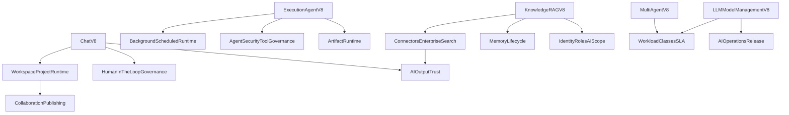

# AI Leader Parity Architecture v8

> Status: Draft v8
> Owner: Product + Engineering
> Cel: domknac brakujace warstwy architektury, ktore odrozniaja dobry zestaw funkcji AI od najlepszego na swiecie `AI business environment`.

---

## 1. Why this document exists

`consultify` ma juz mocny pakiet `Chat v8`, `Execution Agent v8`, `Knowledge RAG v8`, `Working Memory v8`, `Multi-Agent v8` i `LLM Model Management v8`.

To jednak nadal nie daje pelnej parity z liderami rynku, jesli brakujace warstwy przekrojowe pozostaja:

- rozproszone,
- niedopowiedziane,
- albo tylko czesciowo opisane wewnatrz innych pakietow.

Ten dokument spina program uzupelnienia kanonu dla 12 obszarow, ktore liderzy traktuja jako first-class architecture, a nie jako lokalne dodatki.

---

## 2. Executive target

Canonical target for `consultify` is:

`the most trusted AI business environment: stable, fast, governed, explainable, workspace-native and execution-ready`

To oznacza, ze system musi byc jednoczesnie:

- szybki w prostych interakcjach,
- stabilny przy dlugich i zlozonych runach,
- bezpieczny dla duzych organizacji,
- zrozumialy dla usera,
- przewidywalny dla supportu i admina,
- audytowalny dla governance,
- gotowy do pracy na artefaktach, a nie tylko w rozmowie.

---

## 3. Leader references imported into this program

Program opiera sie na analizie liderow i referencji z `Softs`, przede wszystkim:

- `ChatGPT` for speed, simple interaction model and broad capability packaging,
- `Claude` for project semantics, file-heavy workflows and strong workspace memory model,
- `Perplexity` for retrieval honesty and evidence-led answer discipline,
- `OpenAI` agent references for subagents, parallel work and structured outputs,
- `LangChain` for orchestration patterns, routing and context engineering,
- `CrewAI` for task/process/planning discipline,
- `Replit` for workflow execution classes and long-running work patterns.

Imported cross-cutting rules:

- runtime objects matter more than prompt cleverness,
- context isolation beats giant shared memory,
- retrieval must be scope-aware and policy-first,
- background work needs its own lifecycle, not a hidden extension of chat,
- tool use must be permissioned and explainable,
- quality and safety require eval-driven release discipline,
- trust requires evidence, provenance and operator visibility.

---

## 4. Current V8 reality

Strong today:

- `Chat v8` product thinking and workflow semantics,
- `Execution Agent v8` propose -> approve -> apply lifecycle,
- `Knowledge RAG v8` separation of user-private and org-shared knowledge,
- `Working Memory v8` bounded active context,
- `Multi-Agent v8` orchestration principles,
- `AI_LLM_MODEL_MANAGEMENT_V8` as cross-app model-routing direction.

Main gaps today:

- no dedicated canonical package for `connectors + enterprise search`,
- no first-class `background and scheduled agent runtime` spec,
- no single canonical `tool governance matrix` across consumers,
- no unified `workspace/project runtime contract` across chat, runs and artifacts,
- no full `AI ops + release architecture` for safe model and prompt change management,
- no one document that turns `output trust` into a full provenance contract.

---

## 5. The 12 required architecture areas

| Area | Why it matters | Current V8 status | Priority |
| --- | --- | --- | --- |
| `Workspace / Project Runtime` | one governed operating context across chat, runs and artifacts | `PARTIAL-STRONG` | `P0` |
| `Connectors And Enterprise Search` | governed enterprise retrieval with ACL, sync and source truth | `PARTIAL` | `P0` |
| `Artifact Runtime` | first-class object model for generated and edited outputs | `PARTIAL-STRONG` | `P1` |
| `Background And Scheduled Agent Runtime` | long-running work, retries, resumes, schedules and queues | `MISSING-PARTIAL` | `P0` |
| `Agent Security And Tool Governance` | least privilege, approvals and safe delegation | `PARTIAL-STRONG` | `P0` |
| `AI Operations And Release Architecture` | safe rollout, rollback, evals, deprecations and policy control | `PARTIAL` | `P0` |
| `Human-In-The-Loop Governance` | visible control over important mutations and decisions | `STRONG-PARTIAL` | `P1` |
| `Collaboration And Publishing` | team-safe sharing and artifact publishing model | `PARTIAL` | `P1` |
| `Identity, Roles And AI Scope` | predictable access semantics for all AI consumers | `PARTIAL` | `P1` |
| `Workload Classes And SLA` | matching workload shape to latency, budget and reliability | `PARTIAL` | `P1` |
| `Memory Lifecycle` | freshness, retention, deletion and compact working state | `STRONG-PARTIAL` | `P1` |
| `AI Output Trust` | citations, provenance, routing trace and support-visible why | `PARTIAL` | `P0` |

---

## 5.1 Benchmark-to-architecture import map

This parity package must be read as the place where leader references are translated into shared architecture.

| Leader reference | Most important imported rule | Canonical parity docs that must carry it |
| --- | --- | --- |
| `ChatGPT` | simple core flow, low-friction main shell, clear interactive confidence | `AI_WORKSPACE_PROJECT_RUNTIME_ARCHITECTURE_V8.md`, `AI_WORKLOAD_CLASSES_AND_SLA_ARCHITECTURE_V8.md` |
| `Claude` | project semantics, file-heavy workflows, long-context work, reusable workspace memory | `AI_WORKSPACE_PROJECT_RUNTIME_ARCHITECTURE_V8.md`, `AI_ARTIFACT_RUNTIME_ARCHITECTURE_V8.md`, `AI_MEMORY_LIFECYCLE_ARCHITECTURE_V8.md` |
| `Perplexity` | sourced answers, evidence-led retrieval, visible trust contract | `AI_CONNECTORS_ENTERPRISE_SEARCH_ARCHITECTURE_V8.md`, `AI_OUTPUT_TRUST_ARCHITECTURE_V8.md` |
| `OpenAI agent references` | subagents, structured outputs, parallel work, approval-aware orchestration | `AI_BACKGROUND_AND_SCHEDULED_AGENT_RUNTIME_V8.md`, `AI_AGENT_SECURITY_AND_TOOL_GOVERNANCE_V8.md`, `AI_OUTPUT_TRUST_ARCHITECTURE_V8.md` |
| `LangChain` | orchestration patterns, task fit, context engineering, router retrieval | `AI_CONNECTORS_ENTERPRISE_SEARCH_ARCHITECTURE_V8.md`, `AI_WORKLOAD_CLASSES_AND_SLA_ARCHITECTURE_V8.md`, `AI_OPERATIONS_AND_RELEASE_ARCHITECTURE_V8.md` |
| `CrewAI` | planning, hierarchical delegation, expected outputs, reasoning effort | `AI_HUMAN_IN_THE_LOOP_GOVERNANCE_ARCHITECTURE_V8.md`, `AI_WORKLOAD_CLASSES_AND_SLA_ARCHITECTURE_V8.md`, `AI_AGENT_SECURITY_AND_TOOL_GOVERNANCE_V8.md` |
| `Replit workflows` | long-running work classes, resumable workflows, queue-aware execution | `AI_BACKGROUND_AND_SCHEDULED_AGENT_RUNTIME_V8.md`, `AI_WORKLOAD_CLASSES_AND_SLA_ARCHITECTURE_V8.md` |

This mapping prevents the parity package from becoming only a list of topics.
Each area must materially import the strongest benchmark patterns rather than only mention leader names.

---

## 5.2 Current hardening verdict

After the first parity pass:

- the package is structurally complete,
- the package is not yet uniformly `reference-grade`,
- the biggest remaining hardening need is depth, not topic coverage.

Areas needing the strongest second pass:

- `Connectors And Enterprise Search`
- `Background And Scheduled Agent Runtime`
- `Agent Security And Tool Governance`
- `AI Operations And Release Architecture`
- `AI Output Trust`

Typical hardening still required across the package:

- more explicit parity matrixes vs benchmarks,
- more concrete contracts and state transitions,
- stronger operator/support semantics,
- clearer failure models,
- more implementation-grade acceptance criteria.

---

## 6. Delivery waves

### 6.1 Wave One - critical parity gaps

These areas most directly decide whether `consultify` behaves like a world-class operating environment or like a collection of good AI features:

- `Workspace / Project Runtime`
- `Connectors And Enterprise Search`
- `Background And Scheduled Agent Runtime`
- `Agent Security And Tool Governance`
- `AI Operations And Release Architecture`
- `AI Output Trust`

### 6.2 Wave Two - operating model hardening

These areas make the platform scalable, governable and team-native:

- `Artifact Runtime`
- `Human-In-The-Loop Governance`
- `Collaboration And Publishing`
- `Identity, Roles And AI Scope`
- `Workload Classes And SLA`
- `Memory Lifecycle`

---

## 7. Canonical package created by this program

This document is the entrypoint for the parity package.

The package adds these canonical documents:

- `AI_WORKSPACE_PROJECT_RUNTIME_ARCHITECTURE_V8.md`
- `AI_CONNECTORS_ENTERPRISE_SEARCH_ARCHITECTURE_V8.md`
- `AI_ARTIFACT_RUNTIME_ARCHITECTURE_V8.md`
- `AI_BACKGROUND_AND_SCHEDULED_AGENT_RUNTIME_V8.md`
- `AI_AGENT_SECURITY_AND_TOOL_GOVERNANCE_V8.md`
- `AI_OPERATIONS_AND_RELEASE_ARCHITECTURE_V8.md`
- `AI_HUMAN_IN_THE_LOOP_GOVERNANCE_ARCHITECTURE_V8.md`
- `AI_COLLABORATION_AND_PUBLISHING_ARCHITECTURE_V8.md`
- `AI_IDENTITY_ROLES_AND_SCOPE_ARCHITECTURE_V8.md`
- `AI_WORKLOAD_CLASSES_AND_SLA_ARCHITECTURE_V8.md`
- `AI_MEMORY_LIFECYCLE_ARCHITECTURE_V8.md`
- `AI_OUTPUT_TRUST_ARCHITECTURE_V8.md`

---

## 8. Rules for using this package

1. These documents do not replace `Chat v8`, `Execution Agent v8`, `Knowledge RAG v8`, `Multi-Agent v8` or `LLM Model Management v8`.
2. These documents define cross-cutting architecture that multiple packages must inherit.
3. If a module-specific SSOT conflicts with this package, the conflict must be resolved in the same change set.
4. No new AI surface should invent its own local model for scope, trust, approvals, background work or tool permissions if a parity document already defines the shared rule.

---

## 9. Cross-document dependency map

---

## 10. Definition of done for this parity program

This program is complete when:

- every one of the 12 areas has a canonical document,
- `DOCUMENTATION_REGISTRY` registers the package explicitly,
- core `V8` documents point to the new canonical architecture where relevant,
- `AGENT_AND_KNOWLEDGE_V8_MASTER_PLAN` uses the parity package as rollout input,
- no critical cross-cutting AI behavior depends on undocumented local rules.

---

## 11. Read order

Read in this order:

1. `AI_LEADER_PARITY_ARCHITECTURE_V8.md`
2. `AI_WORKSPACE_PROJECT_RUNTIME_ARCHITECTURE_V8.md`
3. `AI_CONNECTORS_ENTERPRISE_SEARCH_ARCHITECTURE_V8.md`
4. `AI_BACKGROUND_AND_SCHEDULED_AGENT_RUNTIME_V8.md`
5. `AI_AGENT_SECURITY_AND_TOOL_GOVERNANCE_V8.md`
6. `AI_OPERATIONS_AND_RELEASE_ARCHITECTURE_V8.md`
7. `AI_OUTPUT_TRUST_ARCHITECTURE_V8.md`
8. remaining parity documents by module need
9. core package docs: `Chat v8`, `Execution Agent v8`, `Knowledge RAG v8`, `Multi-Agent v8`, `AI_LLM_MODEL_MANAGEMENT_V8`

---

## 12. Related canonical docs

- `docs/product/CHAT_V8_SSOT.md`
- `docs/product/AGENT_EXECUTION_V8_SSOT.md`
- `docs/product/KNOWLEDGE_RAG_V8_SSOT.md`
- `docs/product/KNOWLEDGE_RAG_V8_WORKING_MEMORY_ARCHITECTURE.md`
- `docs/product/AGENT_MULTI_AGENT_WORK_MANAGEMENT_V8.md`
- `docs/product/AI_LLM_MODEL_MANAGEMENT_V8.md`
- `docs/product/AGENT_AND_KNOWLEDGE_V8_MASTER_PLAN.md`
- `docs/product/DOCUMENTATION_REGISTRY.md`
