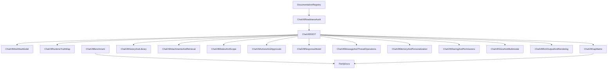

# Chat v8 Readiness Audit

> Status: Historical readiness audit snapshot; later Wave 1 closure superseded this draft
> Current authority: `docs/product/work-packets/evidence/548-v81-wave1-final-module-gate-ratification.md`
> Note: readiness and blocker language below is historical at time of write, not the current Wave 1 program status
> Owner: Product + Engineering
> Cel: spiac pakiet `Chat v8` w jeden punkt orientacyjny, ustalic read order, rozdzielic role dokumentow lokalnych i przekrojowych oraz wskazac, co jeszcze trzeba minimalnie domknac przed uznaniem chatu za planistycznie gotowy.

---

## 1. Why this document exists

`Chat v8` ma juz mocny pakiet:

- SSOT,
- benchmark,
- workflow,
- gap matrix,
- implementation plan,
- runtime truth map,
- pakiet szczegolowy dla historii, retrieval, actions, voice, sharing, memory i prompt stack.

Problem nie polega juz na braku dokumentow.
Problem polega na tym, ze bez jednego readiness auditu latwo pomylic:

- co jest lokalna prawda chatu,
- co jest zaleznoscia od pakietu `AI core / parity`,
- co jest juz zamrozone,
- co nadal wymaga jednego malego hardening pass.

---

## 2. Executive verdict

Current verdict for `Chat v8` is:

`strong and broadly complete, but not yet final canon`

To oznacza:

- chat jest juz bardzo mocny planistycznie,
- mozna na nim opierac dalszy przeglad `V8`,
- pakiet jest wystarczajaco dojrzaly dla individual use i duzej czesci group/shared use,
- nadal potrzebny jest ostatni pass domykajacy kilka semantyk i zaleznosci przekrojowych.

---

## 3. Recommended read order

This is the recommended one-path read order for `Chat v8`:

1. `DOCUMENTATION_REGISTRY.md`
2. `CHAT_V8_READINESS_AUDIT.md`
3. `CHAT_V8_SSOT.md`
4. `CHAT_V8_BENCHMARK.md`
5. `CHAT_V8_WORKFLOW_MODEL.md`
6. `CHAT_V8_RUNTIME_TRUTH_MAP.md`
7. `CHAT_V8_GAP_MATRIX.md`
8. `CHAT_V8_HISTORY_AND_LIBRARY_MODEL.md`
9. `CHAT_V8_ATTACHMENTS_AND_RETRIEVAL.md`
10. `CHAT_V8_MODES_AND_SCOPE_MODEL.md`
11. `CHAT_V8_ACTIONS_AND_APPROVALS.md`
12. `CHAT_V8_RESPONSE_MODEL.md`
13. `CHAT_V8_MESSAGE_AND_THREAD_OPERATIONS.md`
14. `CHAT_V8_MEMORY_AND_PERSONALIZATION.md`
15. `CHAT_V8_SHARING_AND_PERMISSIONS.md`
16. `CHAT_V8_VOICE_AND_MULTIMODAL.md`
17. `CHAT_APPLICATION_AGENT_RUNTIME_V8.md`
18. `TERESA_VOICE_CHAT_RAIL_V8.md`
19. `AI_PROPOSAL_ONLY_APPLICATION_MODE_V8.md`
20. `VOICE_TRUST_AND_APPROVALS_V8.md`
21. `CHAT_V8_ENTERPRISE_AND_COMPLIANCE.md`
22. `CHAT_V8_PROMPT_SYSTEM_AND_COMPOSITION.md`
23. `CHAT_V8_RICH_OUTPUT_AND_RENDERING.md`
24. cross-cutting parity docs only where the local chat package explicitly depends on them

Rule:

`read local chat truth first, then validate cross-cutting dependencies through parity docs, not the other way around`

---

## 4. Ownership model

| Document family | Owns what |
| --- | --- |
| `CHAT_V8_READINESS_AUDIT.md` | readiness verdict, read order, remaining blockers, hardening priorities |
| `CHAT_V8_SSOT.md` | chat product purpose, scope, main promises and completeness criteria |
| `CHAT_V8_BENCHMARK.md` | external benchmark, parity targets and non-goal discipline |
| `CHAT_V8_WORKFLOW_MODEL.md` | canonical user path and workflow variants |
| `CHAT_V8_RUNTIME_TRUTH_MAP.md` | one runtime truth: canonical vs partial vs legacy surfaces |
| `CHAT_V8_GAP_MATRIX.md` | explicit unresolved gaps and priorities |
| local chat specs | detailed behavior of history, retrieval, modes, actions, memory, sharing, voice, response and rendering |
| parity package | shared architecture for runtime, trust, identity, collaboration, enterprise retrieval and governance |

Non-negotiable rule:

`local chat docs own product behavior; parity docs own shared cross-cutting architecture; this audit owns readiness and navigation`

---

## 5. Current readiness by concern

| Concern | Readiness verdict | Why |
| --- | --- | --- |
| Core chat flow | `strong` | SSOT, workflow and runtime truth are all present |
| History and library | `strong` | one of the best-described areas in the package |
| Retrieval and source honesty | `strong but dependency-heavy` | local rules are good, but enterprise depth still depends on parity docs |
| Actions and approvals | `strong` | governed lifecycle is explicit and differentiating |
| Voice | `strong` | dual-mode voice and Teresa rail are now documented as one governed user-facing system |
| Memory and personalization | `strong conceptually, lighter operationally` | clear scope model, but user/admin control UX still needs harder closure |
| Sharing and permissions | `strong baseline, lighter collaboration detail` | visibility layers are good, but explicit sharing remains deliberately limited |
| Message/thread operations | `improved, but still a hardening hotspot` | needed one more pass to freeze baseline semantics |
| Group/shared use | `strong enough for B2B collaborative AI workspace` | good for folders, org context and governed actions; not a Slack-like messenger by design |

---

## 6. What is now clearly covered

After the current documentation pass, `Chat v8` clearly covers:

- one canonical chat mission,
- benchmark and parity targets,
- one workflow spine,
- one runtime truth map,
- history and library semantics,
- grounded file and URL work,
- scope and mode semantics,
- governed AI actions,
- message/thread iteration model,
- memory and personalization boundaries,
- team-safe sharing and permissions baseline,
- voice baseline,
- response classes and rendering,
- enterprise and compliance boundaries.

This means:

`Chat v8` is already documented as a serious AI operating system, not just a chat box`

---

## 7. Remaining blockers before final canon

`Chat v8` is not yet final while these blockers remain:

1. Full chat still depends on one final runtime cutover away from the legacy shell contradiction.
2. Shared/team use is now documented more fully, but still depends on cross-cutting collaboration, identity and implementation proof for enterprise-grade certainty.
3. Memory controls are now documented, but the product still needs implementation-proof user and admin surfaces.
4. Named assistants now have first-class contracts, but their future implementation must still respect tenant memory bootstrap and identity or scope resolution.
5. Chat-started application-agent runtime is now documented with a stronger run and proposal spine, but module adapters still need future implementation proof.

These are now hardening blockers, not foundational blockers.

---

## 8. Minimal hardening list

The smallest useful hardening pass for `Chat v8` is:

1. freeze baseline semantics for `edit / regenerate / fork`
2. freeze baseline semantics for `team folder` vs `explicit conversation sharing`
3. freeze baseline semantics for `user memory` vs `org memory` and `private mode`
4. keep runtime truth, benchmark and gap matrix synchronized when statuses change
5. keep Teresa rail, proposal-only mode and voice trust docs synchronized with base chat voice semantics

This hardening pass now also depends on:

- `AI_TENANT_MEMORY_BOOTSTRAP_AND_ASSIGNMENT_V8.md`
- `TERESA_ASSISTANT_CONTRACT_V8.md`
- `CHAT_APPLICATION_AGENT_RUNTIME_V8.md`
- `TERESA_VOICE_CHAT_RAIL_V8.md`
- `AI_PROPOSAL_ONLY_APPLICATION_MODE_V8.md`
- `ASYNC_NOTIFICATIONS_AND_REENGAGEMENT_V8.md`
- `AGENT_INTERRUPT_AND_RESUME_RUNTIME_V8.md`
- `EXECUTION_RUN_AND_PROPOSAL_SPINE_V8.md`
- `USER_AND_ADMIN_MEMORY_CONTROLS_V8.md`
- `OPERATOR_SUPPORT_AND_FAILURE_RECOVERY_V8.md`
- `TEAM_APPROVAL_AND_SHARED_AGENT_REVIEW_V8.md`

---

## 9. What is safe to build next

After this audit, it is safe to treat `Chat v8` as planistycznie mocny for:

- downstream functional planning,
- relationship checks against `Interview`, `Initiatives`, `MyWork` and `Execution`,
- implementation planning,
- future module-local AI assistant work.

But it is not safe to:

- reintroduce a second shell truth,
- document collaboration beyond the explicit baseline without owner docs,
- overstate cloud, voice or enterprise search completeness beyond runtime truth.

---

## 10. Chat dependency map

---

## 11. Definition of readiness for further work

`Chat v8` is ready for further planning when:

- one stable read order exists,
- one runtime truth exists,
- hardening gaps are explicit and small,
- teams no longer need to guess whether local chat docs or parity docs own a given rule.

This is a readiness gate for planning and implementation work.
It is not yet the claim that the chat product is fully final.

---

## 12. Related canonical docs

- `docs/product/DOCUMENTATION_REGISTRY.md`
- `docs/product/CHAT_V8_SSOT.md`
- `docs/product/CHAT_V8_BENCHMARK.md`
- `docs/product/CHAT_V8_WORKFLOW_MODEL.md`
- `docs/product/CHAT_V8_RUNTIME_TRUTH_MAP.md`
- `docs/product/CHAT_V8_GAP_MATRIX.md`
- `docs/product/CHAT_V8_HISTORY_AND_LIBRARY_MODEL.md`
- `docs/product/CHAT_V8_ATTACHMENTS_AND_RETRIEVAL.md`
- `docs/product/CHAT_V8_MODES_AND_SCOPE_MODEL.md`
- `docs/product/CHAT_V8_ACTIONS_AND_APPROVALS.md`
- `docs/product/CHAT_V8_MESSAGE_AND_THREAD_OPERATIONS.md`
- `docs/product/CHAT_V8_MEMORY_AND_PERSONALIZATION.md`
- `docs/product/CHAT_V8_SHARING_AND_PERMISSIONS.md`
- `docs/product/CHAT_AND_AGENT_FUNCTIONAL_COMPLETENESS_AUDIT_V8.md`
- `docs/product/ASYNC_NOTIFICATIONS_AND_REENGAGEMENT_V8.md`
- `docs/product/AGENT_INTERRUPT_AND_RESUME_RUNTIME_V8.md`
- `docs/product/EXECUTION_RUN_AND_PROPOSAL_SPINE_V8.md`
- `docs/product/USER_AND_ADMIN_MEMORY_CONTROLS_V8.md`
- `docs/product/OPERATOR_SUPPORT_AND_FAILURE_RECOVERY_V8.md`
- `docs/product/TEAM_APPROVAL_AND_SHARED_AGENT_REVIEW_V8.md`
- `docs/product/TERESA_ASSISTANT_CONTRACT_V8.md`
