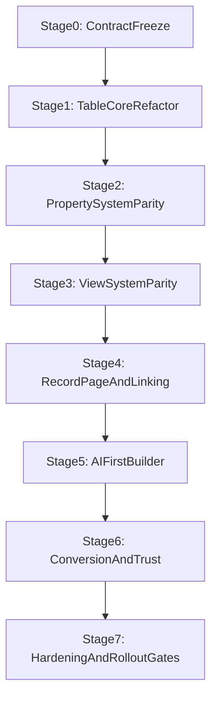

# Idea Workspace V5 Staged Rollout Plan

> **Status:** ACTIVE IMPLEMENTATION PLAN
> **Date:** 2026-03-10
> **Owner:** Product / Platform / CTO
> **Scope:** staged implementation of `Table OS` inside `Idea Workspace`
> **Purpose:** turn the target from `IDEA_WORKSPACE_V5_FINAL_SSOT.md` and the realities from `IDEA_WORKSPACE_V5_GAP_ANALYSIS.md` into an execution sequence with dependencies, risks, and verification gates.

---

## 0) References

- `docs/product/IDEA_WORKSPACE_V5_FINAL_SSOT.md`
- `docs/product/IDEA_WORKSPACE_V5_GAP_ANALYSIS.md`
- `docs/product/IDEA_WORKSPACE_V5_SSOT.md`
- `docs/product/IDEA_WORKSPACE_V5_1_IMPLEMENTATION_PROGRAM.md`
- `docs/product/IDEA_WORKSPACE_V5_REMEDIATION_PLAN.md`
- `docs/ui-standards/FROZEN_LAYOUTS.md`
- `docs/ui-standards/03-modules/app-table-standard.md`
- `docs/ui-standards/03-modules/table-preview-pane-standard.md`

Primary code anchors:
- `src/components/MyWork/IdeaMapWorkspace.tsx`
- `src/components/MyWork/IdeaWorkspaceTools.tsx`
- `src/components/MyWork/IdeaTableTool.tsx`
- `src/components/MyWork/table/tableTypes.ts`
- `src/components/MyWork/table/AddColumnDialog.tsx`
- `src/components/MyWork/table/FilterPanel.tsx`
- `src/components/MyWork/table/KanbanView.tsx`
- `src/components/MyWork/table/TimelineView.tsx`
- `src/components/MyWork/table/MatrixView.tsx`
- `src/components/MyWork/table/RowDetailPanel.tsx`
- `src/components/MyWork/table/AITableAssistant.tsx`

---

## 1) Rollout principles

- Preserve the current workspace shell.
- Build trust before breadth.
- Extract domain boundaries before adding major parity features.
- No automations scope in this program.
- Behavior-based verification is mandatory for each stage.
- Partial views must be labeled, completed, or downgraded. Never implied as finished.

---

## 2) Program structure

---

## 3) Stage-by-stage implementation plan

## Stage 0 - Contract freeze, doc alignment, IA freeze

### Outcome

Freeze the product contract before code expansion:
- one agreed target for `Table OS`
- no further workspace IA churn
- explicit rules for what stays frozen

### Why this stage exists

The workspace shell is finally coherent enough.
Breaking it again before the table is finished would create rework with no product gain.

### Scope files

Primary:
- `docs/product/IDEA_WORKSPACE_V5_FINAL_SSOT.md`
- `docs/product/IDEA_WORKSPACE_V5_GAP_ANALYSIS.md`
- `docs/product/IDEA_WORKSPACE_V5_STAGED_ROLLOUT_PLAN.md`

Validation anchors:
- `docs/ui-standards/FROZEN_LAYOUTS.md`
- `src/components/MyWork/IdeaMapWorkspace.tsx`
- `src/components/shared/WorkspacePanelStrip.tsx`

### Implementation tasks

- Freeze the `Table OS` product target and terminology.
- Confirm that `4 systems` and `3-tools strip` are not changing.
- Confirm that automations are out of scope.
- Document which current views are trusted, partial, or scaffolds.

### Dependencies

None.

### Main risks

- reopening workspace navigation debates
- mixing Table OS with a separate module concept

### Verification

- docs approved
- IA rules explicit
- no planned work item violates `FROZEN_LAYOUTS`

---

## Stage 1 - Table core refactor and extraction from the monolith

### Outcome

Reduce `IdeaTableTool.tsx` from a domain monolith into a clearer orchestration surface with extracted slices.

### Why this stage exists

Current parity work will become expensive and unstable if new features keep landing in one oversized file.

### Scope files

Primary:
- `src/components/MyWork/IdeaTableTool.tsx`
- `src/components/MyWork/table/tableTypes.ts`

Expected new/extracted areas:
- `src/components/MyWork/table/*` domain files for schema, views, detail state, AI builder, persistence adapter, and toolbar/view state

Related:
- `src/components/MyWork/IdeaMapWorkspace.tsx`

### Implementation tasks

- Extract table state domains:
  - schema/property state
  - saved views and layout state
  - row selection and bulk actions
  - preview/detail state
  - persistence adapter
  - AI overlay entrypoints
- Move thin inline view implementations out of `IdeaTableTool.tsx` where appropriate.
- Keep behavior stable during extraction.
- Preserve current save/reload contract unless a change is necessary.

### Dependencies

- Stage 0 complete

### Main risks

- regressions in save/reload
- breaking view-switch behavior
- losing keyboard interactions during extraction

### Verification

- existing table behavior still works after refactor
- save/reload parity preserved
- view switching still uses one canonical order
- no feature regression in current `table`, `kanban`, `timeline`, `matrix`

---

## Stage 2 - Property system parity and manual schema builder

### Outcome

Turn current column handling into a richer property system with stronger semantics and better manual control.

### Why this stage exists

The core product promise requires that users can model structure manually without fighting the system.

### Scope files

Primary:
- `src/components/MyWork/table/tableTypes.ts`
- `src/components/MyWork/table/AddColumnDialog.tsx`
- `src/components/MyWork/table/CellRenderer.tsx`
- `src/components/MyWork/IdeaTableTool.tsx`

Likely additions:
- property editor panels
- property metadata helpers
- status and system-property definitions

### Implementation tasks

- Add stronger property semantics for:
  - status
  - long text/body
  - created/edited metadata
  - relation config
  - rollup config
- Improve manual schema operations:
  - rename
  - reorder
  - show/hide per view
  - edit type-specific config
- Clarify which fields are user-defined versus system-managed.
- Keep property editing compatible with saved views.

### Dependencies

- Stage 1 complete

### Main risks

- property migrations breaking old ideas
- UI sprawl from too many schema controls
- inconsistent type semantics across views

### Verification

- user can build a meaningful table manually from empty state
- property edits survive save/reload
- select/status/relation/rollup behavior is explicit and testable

---

## Stage 3 - View system parity and saved-view governance

### Outcome

Make views feel like real operating modes rather than uneven visual branches.

### Why this stage exists

Multi-view trust is a core Airtable-style expectation, and current parity is uneven.

### Scope files

Primary:
- `src/components/MyWork/IdeaTableTool.tsx`
- `src/components/MyWork/table/KanbanView.tsx`
- `src/components/MyWork/table/TimelineView.tsx`
- `src/components/MyWork/table/MatrixView.tsx`
- `src/components/MyWork/table/FilterPanel.tsx`

Likely additions:
- dedicated calendar view component
- dedicated grid/cards view component
- saved-view utilities

### Implementation tasks

- Separate all major views into clear components if still inline.
- Rebuild `calendar` into a real view, or explicitly downgrade it until completed.
- Strengthen `grid/cards` as a real record-card mode.
- Add stronger saved-view configuration:
  - visible properties
  - filters
  - multi-sort
  - grouping
  - layout options
- Ensure all view chrome respects the frozen order and command-row rules.

### Dependencies

- Stage 2 complete

### Main risks

- parity work becoming UI-only without shared state correctness
- duplicate toolbar rows violating `FROZEN_LAYOUTS`
- view-specific logic fragmenting data truth

### Verification

- all views reflect one underlying record model
- save/reload preserves active view and configuration
- `calendar` is either truly functional or intentionally not shipped
- no extra toolbar rows appear under the topbar

---

## Stage 4 - Record page, preview depth, and linked context

### Outcome

Turn row detail into a first-class record page with stronger preview/detail cohesion and visible artifact-driven value.

### Why this stage exists

This is where the table starts feeling more like Notion depth plus Consultify context rather than a thin row editor.

### Scope files

Primary:
- `src/components/MyWork/table/RowDetailPanel.tsx`
- `src/components/MyWork/IdeaTableTool.tsx`
- `src/components/MyWork/IdeaContextPanel.tsx`

Related:
- `src/components/shared/PreviewPane/*`
- artifact-link utilities and shared preview components

### Implementation tasks

- Formalize preview versus full detail behavior.
- Strengthen row page sections:
  - body/notes
  - properties
  - attachments
  - activity
  - linked artifacts
  - related rows
  - AI insights
- Pull context linking closer to row workflows.
- Make artifact-backed row work visibly valuable.
- Align preview anatomy with global preview-pane canon.

### Dependencies

- Stage 3 complete

### Main risks

- duplicate detail surfaces between preview and full page
- row page becoming bloated without hierarchy
- linking UX still feeling secondary

### Verification

- single click gives preview behavior consistent with canon
- double click or Enter reaches richer detail state
- linked artifacts are visible and useful in row workflows
- record pages survive save/reload

---

## Stage 5 - AI-first table builder and prompt-to-structure

### Outcome

Elevate current AI command parsing into the flagship AI-first builder flow.

### Why this stage exists

Current AI is useful, but not yet the signature `say what you need and get a trustworthy table proposal` experience.

### Scope files

Primary:
- `src/components/MyWork/table/AITableAssistant.tsx`
- `src/components/MyWork/IdeaWorkspaceTools.tsx`
- `src/components/MyWork/IdeaTableTool.tsx`

Related:
- AI service layers already used by workspace/table
- proposal review surfaces in `Idea Workspace`

### Implementation tasks

- Add proposal-driven schema generation:
  - properties
  - starter views
  - starter rows
  - context hints
- Support partial acceptance of AI-generated table structure.
- Ground proposals in attached and linked artifacts where available.
- Keep direct command actions for quick power-user control.
- Standardize table AI with workspace-level proposal governance.

### Dependencies

- Stage 4 complete

### Main risks

- AI generating attractive but low-trust structures
- direct-action AI bypassing review rules
- prompt experience becoming detached from real table state

### Verification

- prompt can generate a reviewable first table
- user can accept part of a proposal
- accepted output is editable manually immediately
- AI actions are auditable at the user-facing level

---

## Stage 6 - Conversion, cross-artifact linking, and trust layer

### Outcome

Make the table visibly stronger than competitors by connecting structure to execution and other Consultify artifacts.

### Why this stage exists

This is the differentiator stage. Without it, the product risks becoming only a good clone.

### Scope files

Primary:
- `src/components/MyWork/IdeaTableTool.tsx`
- `src/components/MyWork/table/RowDetailPanel.tsx`
- `src/components/MyWork/IdeaContextPanel.tsx`
- conversion and artifact-linking helpers/services already used by `Idea Workspace`

Related backend and routing surfaces:
- relevant APIs that persist linked artifacts and conversion outputs

### Implementation tasks

- Make row and selection conversion deterministic.
- Preserve source traceability from table rows to outputs.
- Strengthen row-level and table-level artifact linking.
- Ensure context panel, row page, and conversion outputs reflect the same truth.
- Add trust signals for what is:
  - linked
  - generated
  - converted
  - pending review

### Dependencies

- Stage 5 complete

### Main risks

- conversion ambiguity between row, selection, and whole-table scope
- trust erosion if linked data is not reflected consistently across surfaces
- backend/frontend mismatch in attachment truth

### Verification

- linked artifacts are visible from both context and record page
- converted outputs preserve source references
- row-selection conversion is understandable and survives reload

---

## Stage 7 - Hardening, tests, telemetry, and rollout gates

### Outcome

Prevent the product from regressing into `demo-rich, trust-poor` behavior.

### Why this stage exists

The remediation docs already established that behavior truth was overstated in the past.

### Scope files

Primary:
- table-related test files
- telemetry hooks for table workflows
- verification docs and rollout checklists

Code anchors:
- `src/components/MyWork/IdeaTableTool.tsx`
- `src/components/MyWork/table/*`

### Implementation tasks

- Add behavior-based tests for:
  - property editing
  - saved views
  - view switching
  - record-page behavior
  - AI proposal acceptance
  - conversion and linking
- Add telemetry for:
  - prompt-to-table
  - manual schema creation
  - view adoption
  - record page usage
  - conversion usage
- Introduce release gates by trust level:
  - core trusted
  - advanced beta
  - withheld/not shipped

### Dependencies

- Stage 6 complete

### Main risks

- static smoke checks passing while runtime behavior is still weak
- hidden regressions after the refactor and parity phases
- shipping partial views as if complete

### Verification

- behavior tests pass
- telemetry confirms flagship flows are actually used
- explicit go/no-go checklist exists for each major capability

---

## 4) Cross-stage file map

## Highest-churn files

- `src/components/MyWork/IdeaTableTool.tsx`
- `src/components/MyWork/table/tableTypes.ts`
- `src/components/MyWork/table/RowDetailPanel.tsx`
- `src/components/MyWork/table/AITableAssistant.tsx`
- `src/components/MyWork/IdeaWorkspaceTools.tsx`

## Medium-churn files

- `src/components/MyWork/table/AddColumnDialog.tsx`
- `src/components/MyWork/table/FilterPanel.tsx`
- `src/components/MyWork/table/KanbanView.tsx`
- `src/components/MyWork/table/TimelineView.tsx`
- `src/components/MyWork/table/MatrixView.tsx`
- `src/components/MyWork/IdeaContextPanel.tsx`

## Stable shell files

- `src/components/MyWork/IdeaMapWorkspace.tsx`
- `src/components/shared/WorkspacePanelStrip.tsx`

Rule:
- use stable shell files as host contracts
- put most change into table-domain files

---

## 5) Delivery order inside engineering

Recommended implementation sequence:
1. Refactor the monolith before adding heavy parity.
2. Strengthen manual schema editing before flagship AI builder work.
3. Complete view trust before polishing advanced visualization.
4. Make record pages and linking feel premium before scaling conversion flows.
5. Add AI-first flagship flow only after manual-first control is solid.
6. End with hardening and truth-based release gates.

This order reduces rework and keeps the product honest.

---

## 6) Exit criteria for the full program

The program is complete only when all of the following are true:
- users can start from prompt or empty state and reach a trustworthy table quickly
- manual schema and view editing feel first-class
- all shipped views are real operating modes
- preview and record-page behavior are coherent and useful
- linked artifacts materially improve the workflow
- conversion into platform outputs preserves traceability
- AI proposes structure without taking control away from the user
- tests and rollout gates validate runtime truth, not only code presence

---

## 7) Final implementation posture

This rollout should be executed as progressive strengthening, not a giant rewrite.

Keep:
- the current workspace shell
- the core `Idea Workspace` concept
- the existing table foundation

Change:
- the trust level
- the domain boundaries
- the parity of the views and property system
- the quality of AI-first and linked-context workflows

That is the shortest path from current V5 reality to the intended `Table OS` product.
