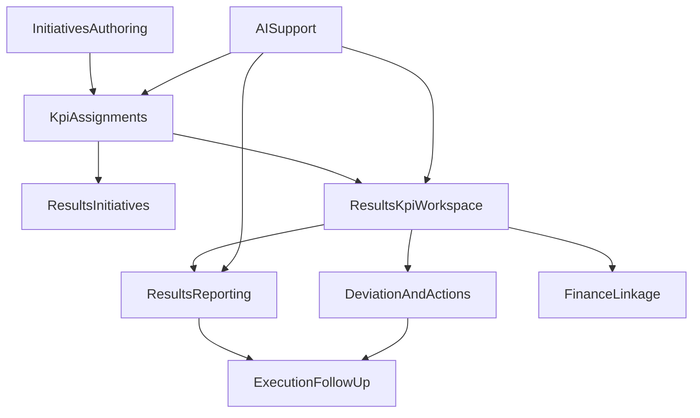

# KPI Full System Canon v8

> Status: Draft v8
> Owner: Product + Engineering
> Scope: canonical cross-module doctrine for KPI across Initiatives, Results, Reporting, Finance linkage, alerts, action workflow and AI support

---

## 1. Why this document exists

`Consultify` already has a credible `Results / KPI / ROI` runtime, but the product no longer treats KPI as a bounded dashboard lane only.

The product now needs one canonical view that explains how KPI works across:

- initiative definition and setup
- execution and observation
- operator review and reporting
- finance linkage and reconciliation
- deviation handling and next actions
- AI support

This document is the index and doctrine bridge above the narrower module-specific documents.

---

## 2. Core statement

`KPI` in `Consultify` is a governed operating system for measurable outcomes.

It is not:

- a generic BI suite
- a passive dashboard shelf
- a finance-model replacement
- a second source of truth next to initiatives, reports or finance

Canonical rule:

`Initiatives define the context, Results governs KPI truth, Reporting materializes narrative, and Finance adds economic interpretation without replacing KPI truth`

---

## 3. Canonical operating model

The full KPI system is built from three operating layers inside `Results`:

- `Initiatives` = scope
- `KPI` = signals
- `Reporting` = narrative

These layers are fed by initiative authoring and linked to execution, tasks, decisions and finance.

---

## 4. Canonical product surfaces

### 4.1 Initiative KPI authoring

Inside `Initiatives`, the product must support:

- linking KPI from governed definitions or existing KPI
- creating manual or standalone KPI when needed
- setting expectations separately for:
  - `realization`
  - `post-implementation`
  - `both`
- defining owner, cadence, target, baseline and tracking flags

### 4.2 Results - Initiatives

The `Initiatives` tab inside `Results` is the observation scope surface.

It exists to answer:

`Which initiatives are currently under KPI observation and worth operational review?`

It should show:

- initiatives in realization
- realized or tracking initiatives still under observation
- tracked KPI counts
- attention state
- report coverage

### 4.3 Results - KPI

The `KPI` tab is the main operator workspace.

It should provide:

- cockpit entry surfaces:
  - `Overview`
  - `Queue`
  - `Catalog`
- governed metric-definition surfaces:
  - `Definition`
  - `Targets`
  - `History`
  - `Lineage`
- table plus preview working surface
- actual entry and history
- target vs actual vs baseline
- phase-aware expectations
- commentary and explanation
- deviations and next actions
- links to initiatives, finance and reporting

Premium expectation beyond the original bounded lane:

- `Overview` is the executive/operator cockpit for runtime health, spotlight signals and review pack readiness
- `Queue` is the operational triage surface grouped by stale entry, below target, discrepancy and requires-review lanes
- `Catalog` is the detailed KPI workspace with table/grid, preview and governed drill-in
- the workspace must support visible transitions between these surfaces without leaving the module
- KPI management must evolve from field-editing into governed metric management with explicit aggregation semantics, dimensions, slices, provenance and target change audit

### 4.3A Results - Goals and scorecards

The full KPI system also requires a governed `Goals / Scorecards` layer inside `Results`.

It should provide:

- `Goal`
- `Objective`
- `Key Result`
- `Scorecard`
- `Check-in`
- `Subgoal / roll-up`
- links back to initiatives and KPI definitions

Canonical rule:

`KPI provides measurable truth; Goals and Scorecards organize that truth into managed outcome commitments`

### 4.4 Results - Reporting

The `Reporting` tab is the narrative and decision surface.

It must be:

- template-first
- snapshot-based by default
- optionally refreshable from current data
- able to choose KPI from the observed KPI set
- able to materialize corrective actions and review outputs
- able to expose distribution sub-surfaces:
  - `Reports`
  - `Schedules`
  - `Wallboards`
  - `Connectors`

### 4.5 Finance linkage

Finance remains a separate governed domain.

KPI may link to finance for:

- interpretation
- drivers
- review evidence
- realization verification

But canonical rule stays:

`metric truth stays in Results, modeled finance truth stays in Finance`

---

## 5. Canonical KPI lifecycle

Every KPI should support five governed layers:

1. `Definition`
2. `Expectation`
3. `Measurement`
4. `Interpretation`
5. `Actionability`

### 5.1 Definition

- name
- description
- formula or semantic meaning
- unit
- source
- owner
- linked initiatives
- category
- dimensions
- slices
- aggregation method
- semantic version
- lineage metadata

### 5.2 Expectation

- baseline
- target
- directionality
- thresholds
- cadence
- phase split between realization and post-implementation
- status-rule logic
- target history

### 5.3 Measurement

- actual value
- period or measurement date
- source type
- freshness
- note
- audit trail
- ingest provenance
- quality score / trust posture

### 5.4 Interpretation

- status
- trend
- variance
- explanation
- commentary
- reconciliation state where finance linkage exists

### 5.5 Actionability

- deviation case
- RCA
- corrective action plan
- execution follow-up
- report inclusion
- check-in
- escalation / reminder policy
- wallboard alert broadcast where appropriate

---

## 6. Template-first reporting doctrine

KPI reporting follows this canonical creation flow:

`scope -> observed KPI set -> template -> narrative -> snapshot`

Minimum templates:

- `Control Pack`
- `Benefits Review`
- `Portfolio KPI Review`
- `Executive Monthly Review`
- `Custom`

Every report must preserve:

- selected initiative scope
- selected KPI scope
- narrative context
- deviations and actions
- snapshot traceability

Premium expectation:

- every report row should show the template used, scope size and open-action load
- snapshot refresh must be possible from the reporting surface without rebuilding scope manually
- the artifact should remain a governed scorecard with `summary / KPI overview / deviation cases / action plan / appendix`
- scheduled distribution must support recurring sends, approval gates and recipient policy
- wallboards must support refresh cadence, alert banners and TV-style operating visibility
- connectors must expose ingest provenance and refresh posture without becoming a second source of KPI truth

---

## 7. AI doctrine

AI may support:

- KPI definition suggestions in initiative context
- stale-entry and observation-gap detection
- variance explanation
- commentary drafts
- report summary drafting
- action plan suggestions

AI may not:

- silently change KPI truth
- rewrite actuals or targets without human approval
- close deviations or update initiative status without confirmation
- replace finance truth or KPI truth with opaque recommendations

Canonical rule:

`AI accelerates KPI reasoning; it never becomes the source of truth`

---

## 8. Documentation stack

This document is the cross-module index above the narrower runtime documents.

Read order:

1. `docs/product/KPI_FULL_SYSTEM_CANON_V8.md`
2. `docs/product/RESULTS_V8_SSOT.md`
3. `docs/product/RESULTS_KPI_AND_FINANCE_ANALYSIS_LINKAGE_RUNTIME_V8.md`
4. `docs/product/REPORTING_CANONICAL_TEMPLATES.md`
5. `docs/product/work-packets/cursor-work/final_master/final-v8-contracts/FINAL_IMPLEMENTATION_PLAN_04_KPI_2026-03-29.md`
6. `docs/product/work-packets/cursor-work/final_master/KPI_AI_SUPPORT_ANALYSIS_2026-04-06.md`
7. `docs/product/work-packets/POST_V81_BACKLOG_TRACKER.md`

Interpretation rule:

- this document defines the full-system target state
- `RESULTS_V8_SSOT.md` defines Results ownership and doctrine
- the finance linkage runtime defines optional KPI to Finance bridge semantics
- reporting templates define canonical narrative outputs
- historical Wave 1 / V8.1 contracts describe the bounded lane already shipped

---

## 9. Product truth guardrails

To prevent split truth:

- `Initiatives` own initiative context and lifecycle
- `Results` own KPI truth and KPI-native review workflows
- `Reporting` owns narrative materialization, not KPI source truth
- `Finance` owns financial interpretation and finance model truth
- `AI` assists reasoning but does not mutate truth silently

---

## 10. Acceptance bar

The KPI system is complete only when:

- initiative-linked and standalone KPI coexist coherently
- phase-aware targets and actuals are explicit
- operator can move from signal to action without ambiguity
- metric definitions are governed, reusable and source-aware
- scorecards and goals can organize KPI into explicit business commitments
- reporting is template-first and traceable
- distribution supports reports, schedules and wallboards without fragmenting truth
- finance linkage explains economic meaning without overwriting KPI truth
- documentation tells one coherent story across modules

## 11. Premium rollout delta still in scope

The original `P04` contract closed the bounded lane.
The active product target still includes the visible premium delta below.

- operator cockpit in `Results > KPI` with `Overview / Queue / Catalog`
- stronger queue semantics for stale entry, below target, discrepancy and requires-review
- template-first scorecard artifact with visible template metadata and snapshot refresh
- richer chart semantics, target history and auditability
- stronger alerting, reconciliation evidence and next-action materialization
- governed metric foundation with dimensions, slices, aggregation semantics and provenance
- goals / scorecards / check-ins / roll-ups as explicit Results objects
- reporting-adjacent distribution surfaces: schedules, wallboards and connectors
- enterprise governance hardening: lineage, permission posture, auditability and source trust

Canonical interpretation:

`P04` verified the base lane; this canon keeps the premium target state open until these operator surfaces and workflows are fully delivered.
