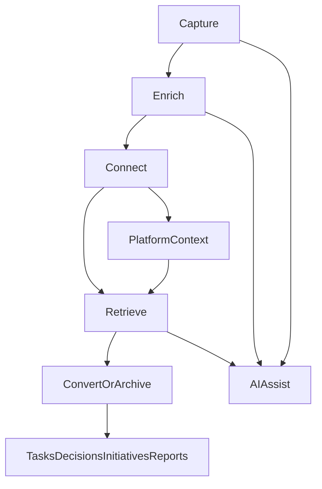

# Notatka v8 - Workflow model

> Status: Draft v8
> Cel: Zdefiniowac docelowy model pracy uzytkownika z notatkami w `consultify`.
> Zakres: Workflow end-to-end, lifecycle notatki, role AI, powiazania z innymi artefaktami.

---

## 1. Definicja

`Notatka v8` nie jest tylko dokumentem.
To operacyjny artefakt wiedzy, ktory:
- lapie sygnaly i mysli,
- dojrzewa razem z praca uzytkownika,
- laczy sie z innymi obiektami systemu,
- wraca jako kontekst wtedy, gdy jest potrzebny,
- moze zostac przeksztalcony w dzialanie lub output.

---

## 2. Głowny lifecycle notatki

Kanoniczny lifecycle:

`capture -> enrich -> connect -> retrieve -> convert/archive`

### 2.1 Capture

Uzytkownik zapisuje:
- szybka mysl,
- notatke ze spotkania,
- material z web clippera,
- email,
- plik,
- import z zewnatrz,
- wynik pracy AI lub czatu.

Efekt:
- powstaje notatka lub draft notatki,
- system zapisuje source context,
- tresc trafia do inboxu wiedzy albo od razu do aktywnej pracy.

### 2.2 Enrich

Notatka jest wzbogacana przez:
- strukture blokowa,
- tagi i metadata,
- AI suggestions,
- attachments,
- outline,
- template intent,
- review i komentarze.

Efekt:
- notatka przestaje byc surowym zrzutem,
- staje sie artefaktem o rosnacej wartosci operacyjnej.

### 2.3 Connect

Notatka zostaje powiazana z:
- initiative,
- task,
- decision,
- report,
- presentation,
- interview,
- innymi notatkami,
- aktywnym chat context,
- knowledge graph lub link graph.

Efekt:
- notatka staje sie elementem systemu pracy, a nie izolowanym dokumentem.

### 2.4 Retrieve

Wiedza z notatki wraca przez:
- search,
- semantic search,
- backlinks,
- related notes,
- knowledge pulse,
- AI contextual recall,
- "used in" i "open in context".

Efekt:
- notatka pracuje po zapisaniu, a nie tylko "lezy w archiwum".

### 2.5 Convert / Archive

Notatka moze:
- zostac przeksztalcona w task, decision, initiative, report, presentation lub assessment,
- pozostac aktywnym artefaktem wiedzy,
- zostac przeniesiona do archiwum lub trybu pasywnego.

Efekt:
- wiedza ma naturalny koniec albo przejscie do innego rodzaju artefaktu.

---

## 3. Docelowy model pracy uzytkownika

### 3.1 Tryb 1 - Capture-first

Scenariusz:
- Uzytkownik jest w trakcie rozmowy, analizy lub pracy i lapie sygnal.
- Tworzy szybka notatke bez rozbudowanych decyzji.

System powinien:
- otwierac szybkie tworzenie z wielu miejsc,
- podpinac source context,
- domyslnie wlaczac autosave,
- odraczac decyzje strukturalne na pozniej.

### 3.2 Tryb 2 - Thinking workspace

Scenariusz:
- Uzytkownik rozwija temat, porzadkuje watek, dodaje bloki, pytania i hipotezy.

System powinien:
- wspierac prace blokowa,
- dawac szybkie wstawianie struktur i calloutow,
- wspierac outline i long-form note navigation,
- dawac AI do streszczania, rozwijania, kontrargumentowania i porzadkowania.

### 3.3 Tryb 3 - Knowledge synthesis

Scenariusz:
- Uzytkownik chce z kilku notatek i sygnalow zbudowac bardziej dojrzaly obraz.

System powinien:
- wskazywac related notes,
- podpowiadac missing links,
- pokazac historyczne i aktywne powiazania,
- dawac AI synthesis z cytatami i kontekstem.

### 3.4 Tryb 4 - Conversion to action/output

Scenariusz:
- Notatka dojrzala do dzialania albo deliverable.

System powinien:
- pokazac gotowosc do konwersji,
- wygenerowac outline lub draft struktury docelowego artefaktu,
- zachowac link source -> output,
- nie tracic powiazania miedzy notatka a efektem konwersji.

---

## 4. Warstwy workflow modelu

### 4.1 Capture layer

Elementy:
- quick note,
- source-aware creation,
- upload/import/email/web clipper,
- inbox wiedzy,
- lightweight mobile/desktop capture mindset.

Definition of done:
- user moze bez tarcia dostarczyc wiedze do systemu,
- system nie gubi pochodzenia notatki.

### 4.2 Content layer

Elementy:
- blocks,
- headings,
- checklist,
- tables,
- callouts,
- attachments,
- embeds,
- AI blocks,
- outline and note navigation.

Definition of done:
- notatka jest semantyczna i nadaje sie do dalszego przetwarzania.

### 4.3 Context layer

Elementy:
- tags,
- project or initiative context,
- linked artifacts,
- visibility,
- ownership,
- maturity,
- verification status,
- review cadence.

Definition of done:
- notatka ma operacyjny kontekst i lifecycle.

### 4.4 Discovery layer

Elementy:
- keyword search,
- semantic search,
- related notes,
- backlinks,
- used-in graph,
- recommendation surfaces.

Definition of done:
- wiedza jest odzyskiwalna zarowno przez user intent, jak i przez system context.

### 4.5 Conversion layer

Elementy:
- create from note,
- AI extraction,
- action items,
- outline-first conversion,
- source traceability.

Definition of done:
- przejscie z wiedzy do dzialania jest kontrolowane i odwracalne poznawczo.

### 4.6 Governance layer

Elementy:
- propose/review/accept,
- comment trail,
- activity log,
- locked/read-only behavior,
- auditability AI,
- org-safe retrieval.

Definition of done:
- notatki pozostaja wiarygodne, kontrolowalne i zgodne z zaufaniem uzytkownika.

---

## 5. Rola AI w workflow

AI w `Notatka v8` nie jest osobnym dodatkiem.
Jest warstwa wspierajaca wszystkie etapy lifecycle.

### 5.1 AI during capture

AI moze:
- rozpoznac typ notatki,
- zasugerowac tytul,
- zasugerowac template,
- wydzielic kluczowe tematy,
- oszacowac dalsze kroki.

AI nie moze:
- przepisywac tresci bez zgody,
- nadpisywac oryginalnego inputu.

### 5.2 AI during enrich

AI moze:
- streszczac,
- rozszerzac,
- strukturyzowac,
- generowac pytania,
- wskazywac luki,
- wydobywac action items,
- sugerowac metadata i linki.

AI nie moze:
- publikowac zmian bez `review -> accept`.

### 5.3 AI during retrieve

AI moze:
- zwracac relevant notes,
- budowac contextual recall,
- tworzyc RAG context z cytatami,
- podpowiadac, dlaczego dana notatka jest teraz istotna.

AI nie moze:
- mieszac prywatnych i niedozwolonych danych poza policy boundary.

### 5.4 AI during convert

AI moze:
- generowac outline,
- proponowac target artifact,
- wyciagac decyzje, zadania, ryzyka i follow-upy.

AI nie moze:
- tworzyc "gotowych obiektow" bez jawnej akceptacji.

---

## 6. Kanoniczne scenariusze pracy

### 6.1 Meeting note

Flow:
- user tworzy notatke ze spotkania,
- system podpina meeting/client/project context,
- AI wyciaga tematy, ryzyka i action items,
- user akceptuje lub odrzuca ekstrakcje,
- notatka pozostaje zrodlem prawdy i moze utworzyc taski lub decyzje.

### 6.2 Discovery / research note

Flow:
- user zbiera obserwacje z kilku zrodel,
- system laczy powiazane notatki i sygnaly,
- AI sugeruje tezy, pytania i missing angles,
- user zamienia dojrzyłe fragmenty w initiative lub report outline.

### 6.3 Strategic note

Flow:
- user zapisuje hipoteze strategiczna,
- notatka dojrzewa przez iteracje i komentarze,
- AI przypomina o niej przy podobnych initiative/decision flows,
- notatka moze stac sie decision draft albo source dla reportu.

### 6.4 Inbox knowledge note

Flow:
- notatka trafia z clippera, emaila lub uploadu,
- system normalizuje tresc,
- user lub AI klasyfikuje i laczy note do kontekstu,
- notatka przechodzi z `captured` do `active` albo `archived`.

---

## 7. Powiazania z reszta platformy

Notatka v8 ma byc osadzona w platformie na czterech poziomach:

### 7.1 Input

Notatka przyjmuje wiedze z:
- AI chat,
- interview,
- uploads,
- web/email capture,
- innych modulow `My Work`,
- aktywnych obiektow domenowych.

### 7.2 Context

Notatka przechowuje:
- source type,
- source id,
- project or initiative scope,
- linked objects,
- review and maturity signals.

### 7.3 Output

Notatka generuje:
- taski,
- decyzje,
- initiative seeds,
- report/presentation outlines,
- AI context packets.

### 7.4 Recall

Notatka wraca do pracy przez:
- AI suggestions,
- context panels,
- linked previews,
- semantic search,
- used-in backlinks.

---

## 8. Workflow model a UI standards

Docelowy workflow nie zmienia frozen layouts:
- notatki pozostaja w `My Work > Notebook`,
- sidebar order bez zmian,
- workspace strip bez czwartego panelu,
- reuse istniejących shared sections/blocks tam, gdzie wzorzec jest wspolny.

Workflow model ma byc implementowany w granicach obecnej architektury shella, a nie przez budowe nowego modulu top-level.

---

## 9. Definition of success

`Notatka v8` jest udana, gdy:
- user zapisuje wiedze szybko i bez tarcia,
- notatki dojrzewaja zamiast gnic w archiwum,
- AI pomaga porzadkowac i odzyskiwac wiedze bez utraty kontroli,
- notatka jest naturalnym pomostem miedzy mysleniem, analiza i dzialaniem,
- notatka realnie pracuje w innych modulach systemu.

---

## 10. Diagram workflow

