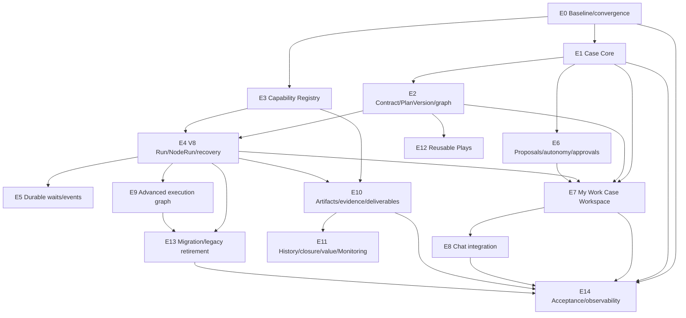

# Case Workspace — epic dependency graph (W1 draft)

> Derived from the invariants/contracts in the requirement extraction
> (`FUNCTIONAL_REQUIREMENT_COVERAGE.csv`), not independently designed.

## Sequencing notes

- **E7 (My Work Case Workspace) is a convergence point**, not an early
  packet: it needs E1, E2, E4 and E6 all present in at least a thin form
  before its UI can be more than a mock. This matches the codebase finding
  that all five UI primitives it needs already exist (`StandardModuleBar`,
  `StandardTable`, `StandardPreview`, `ArtifactRightPanel`,
  `StandardArtifactShell`) — the blocker is domain readiness, not UI
  plumbing.
- **E4 is the highest-leverage early packet**: E5, E7, E9, E10 and
  (transitively) E8/E11/E13 all sit downstream of it, and the codebase
  mapping shows most of its Run/NodeRun substrate already exists (`KEEP`),
  narrowing real new work to the CasePlanVersion binding plus the pre-E4
  hand-port of `v8-full-done`'s 3 commits (session task #8).
- **E3 (Capability Registry) should resolve its naming collision before
  E4/E7/E8 packets start**, since all three call into it.
- **E14 is last by construction** — it is the acceptance/observability
  rollup, not a buildable epic on its own.

This graph is a planning aid, not itself an authorization to sequence
packets — packet start order is a Piotr/Codex-reviewed decision per
document 13's packet-registry discipline.
