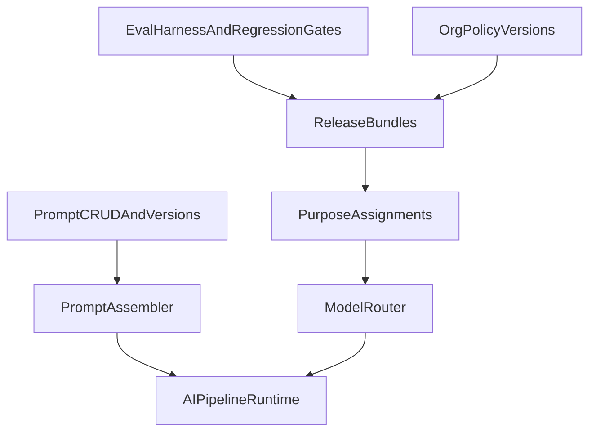
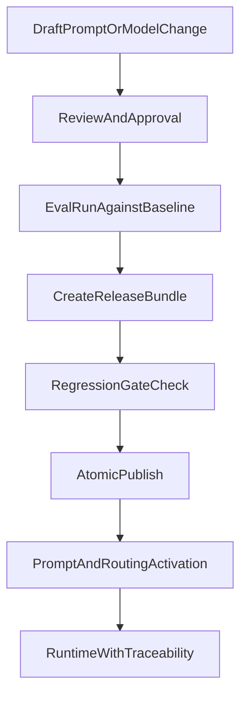

# AI Prompt Governance Audit

Date: `2026-03-07`

## Objective
This document maps the current prompt and AI-governance stack to the target enterprise workflow for controlled change:

`draft -> review -> eval -> release bundle -> publish -> runtime activation`

## Current Architecture

### Canonical Prompt SSOT
Primary source of truth:

- `server/src/routes/ai-prompts.routes.ts`
- `server/src/services/ai/promptAssembler.ts`

What already exists:
- prompt CRUD
- filtering and categories
- prompt version history
- restore and rollback
- assemble/preview
- prompt experiments
- learning suggestions

### Runtime Consumption
The runtime pipeline already tries to consume the canonical prompt system:

- `server/src/services/ai/AIPipeline.ts`

Observed runtime behavior:
- pipeline derives a `promptKey`
- pipeline calls `promptAssembler.assemble(...)`
- if successful, the assembled system prompt and prompt metadata are injected into runtime request state
- if prompt assembly fails, the pipeline falls back to persona-based role generation

This means prompt SSOT is no longer only administrative; it is already part of runtime execution.

### Legacy Prompt Stack
Legacy prompt API still exists in parallel:

- `server/src/routes/ai/ai-prompts.routes.ts`
- `server/src/controllers/ai/AIPromptsController.ts`

Important detail:
- the legacy route is explicitly marked deprecated
- however, its continued existence keeps the system in a dual-stack state

### Governance And Release Layer
Relevant governance building blocks:

- `server/src/routes/llm.routes.ts`
- `server/src/services/ai/evalHarnessService.ts`

What already exists:
- organization AI policy versions and rollback
- evaluation datasets and evaluation runs
- regression gates
- release bundles
- gating for executive purpose assignments

## Current Workflow Mapping

## What Already Works Well
- `Prompt CRUD and version history` are mature enough to support real operational use.
- `Prompt assembly` is already integrated into runtime and not isolated in admin tooling.
- `Policy versioning` is strong and includes draft/history/rollback behavior.
- `Eval harness` and `release bundles` provide a real governance foundation for controlled AI changes.
- `Executive purpose assignment gate` already prevents some unsafe routing changes without an approved bundle.

## Structural Gaps

### 1. Dual Prompt API Stack
Today there are two prompt worlds:

- canonical `server/src/routes/ai-prompts.routes.ts`
- deprecated `server/src/routes/ai/ai-prompts.routes.ts`

Impact:
- admin tooling and engineering changes can drift toward different APIs
- governance is harder to reason about because not every prompt mutation is guaranteed to follow the same path

### 2. Publish Is Not Atomic
`publishReleaseBundle()` currently publishes bundle status, but does not atomically activate:

- prompt version
- model assignment
- fallback assignment
- policy version

Impact:
- the system has the components of a safe release workflow
- but not yet one controlled promotion transaction

### 3. Prompt Runtime Is Fail-Soft
`AIPipeline` falls back to persona role generation when prompt assembly fails.

This is useful for resiliency, but for enterprise governance it also means:
- a prompt problem may degrade silently into legacy behavior
- runtime traceability is weaker than it should be for critical use-cases

### 4. Release Bundle Requirement Is Selective
Current routing change enforcement is strongest for executive purposes, not universally for all critical AI surfaces.

Impact:
- the governance model is good
- the enforcement perimeter is still partial

## Recommended Target Workflow

## Target Enterprise Publish Contract
Every critical AI change should publish exactly one governed artifact containing:

- `purpose`
- `prompt_key`
- `prompt_version`
- `primary_model_id`
- `fallback_model_id`
- `policy_version`
- `baseline_eval_id`
- `candidate_eval_id`
- `gate_passed`
- `changed_by`
- target environment

And `publish` should do all of the following together:

1. validate gate status
2. validate referenced prompt version exists
3. validate referenced policy version exists
4. activate purpose assignment and fallback
5. stamp runtime metadata so every production request can be traced back to the published release artifact

## Decision: Canonical Source Of Truth
The canonical stack should be:

- prompt CRUD: `server/src/routes/ai-prompts.routes.ts`
- runtime prompt assembly: `server/src/services/ai/promptAssembler.ts`
- governed routing and policy activation: `server/src/routes/llm.routes.ts`
- evaluation and release control: `server/src/services/ai/evalHarnessService.ts`

The legacy stack should be reduced to one of two options:

- thin compatibility adapter with no independent logic
- full removal after migration

## Recommended Controls To Reach 100%
- Remove or neutralize independent legacy prompt behavior.
- Require governed release bundles for all critical AI surfaces, not only executive ones.
- Replace non-atomic publish with one activation step for prompt, model, fallback, and policy.
- Persist runtime traceability as `request -> bundle -> prompt version -> policy version -> model assignment`.
- Add explicit failure mode for critical prompts: some flows should fail closed rather than silently falling back to persona prompts.

## Definition Of Done
Prompt and governance can be considered complete only when:

- there is one prompt API truth
- there is one publish workflow
- every critical AI change must pass eval and gate checks
- runtime can always tell which prompt, model, policy, and bundle produced a response
